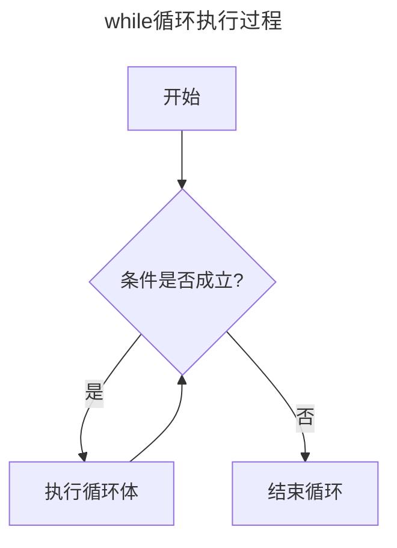

## 6.1while循环

C语言中有三种循环语句：while、for、do_while；我们首先介绍while循环，while的通用形式如下：

```
while(表达式)
	语句
```

**当表达式为真时，循环执行语句，然后再判断表达式是否为真，再执行语句。直到表达式为假，循环停止**




语句可以是简单的一条语句，也可以是用花括号括起来的复合语句（块）;下面是一个使用循环输出1~10的简单示例

```
int main() {
	int i = 1;
	while (i <= 10)
	{
		printf("%d ", i);
		i++;
	}
}
```

使用循环可以有效的减少重复的代码量，如果不使用循环，上面的代码可能会变成这样；

```
int main() {
	int i = 1;
	printf("%d ", i);
	i++;
	printf("%d ", i);
	i++;
	printf("%d ", i);
	i++;
	printf("%d ", i);
	i++;
	printf("%d ", i);
	i++;
	printf("%d ", i);
	i++;
	printf("%d ", i);
	i++;
	...
}

```


#### 6.1.1 终止while循环

循环有一点非常重要，在构建循环时，必须让测试表达式的值有变化，表达式最终必须为假，否则，循环不会终止（即死循环）

```
int main() {
	int i = 1;
	while (i <= 10)
	{
		printf("%d ", i);
	}
}
```

在上面的代码中，i值永远为1，永远小于10，循环每次判断都为真，这个循环会一直执行下去，除非你手动关闭程序。


#### 6.1.2语法要点

只有在测试条件后面的语句，才是循环部分，下面演示了忽略这点的后果

```
int main() {
	int n = 0;
	while (n < 10)
		printf("%d", n);
		n++;
	printf("程序结束");
}

```

该程序输出：00000000000000.......

屏幕上会一直输入0。虽然缩进了n++这条语句，但它并不属于循环的内容，使用循环执行多条语句使，需要用花括号包括起来。所以，上面的程序只有输出是循环的内容。


#### 6.1.3 入口条件循环

while循环使用入口条件的有条件循环，所谓“有条件”指的是语句部分的执行取决于测试表达式描述的条件。如果条件为假，则循环不会执行，如条件为真，则条件执行


## 6.2 用关系运算符和表达式比较大小

出现在关系表达式中间的运算符叫做**关系运算符**：<、<=、 ==  >= 、>、！=


#### 6.2.1 真值

在C语言中，表达式一定有一个值，关系表达式同样；0为假，非0为真


#### 6.2.2 _Bool类型

_Bool类型的值，不是0就是1，在C99提供了头文件stdbool.h头文件，该头文件让bool称为了\_Bool的别名，而且还把true和false分别定义成了1和0的符号常量；


## 6.3 不确定循环和计数循环

**不确定循环**指在测试表达式为假之前，预先不知道要执行多少次循环。另一类是**计数循环**。这类循环在执行循环之前就知道要重复执行多少次。下面是一个计数循环程序

```
int main() {
	const int NUMBER = 22;
	int count = 1;  //初始化

	while (count <= NUMBER) //测试
	{
		printf("Hello\n"); //行为
		count++;  //更新计数
	}
}
```

可见的知道这个程序将循环22次，输出22句Hello。在创建一个重复执行固定次数的循环中涉及了3个行为：

1. 必须初始化计数器
2. 计数器与有限的值左比较
3. 每次循环机时递增计数器


## 6.4for循环

for循环把上述三个行为（初始化，测试和更新）组合在了一处。下面的程序使用for循环修改了上面的程序

```
#include <stdio.h>
int main() {
	const int NUMBER = 22;
	for (int count = 1; count <= NUMBER;count++)
		printf("Hello");
	return 0;
}
```

关键字for后面的圆括号有三个表达式，分别用分号隔开，第一个表达式为初始化，只会在for循环开始时执行一次，第二个表达式是测试条件，每次执行语句前判断表达式为真还是假。第三个表达式执行更新。在每次循环结束时求值。


#### 6.4.1 for的使用技巧

1 第三个表达式可以使用容易合法的表达式。无论是什么表达式，每次迭代都会更新该表达式的值

```
int main() {
	int x;
	int y = 55;
	for (x = 1; y <= 75;y = (++x * 5) + 50) {
		printf("%d %10d\n", x, y);
	}
	return 0;
}
```

输出：

```
1         55
2         60
3         65
4         70
5         75
```


2 可以省略一个或多个表达式（但是不能省略分号），只要在循环中包括能结束循环的语句即可

```
int main() {
	int ans, n;
	ans = 2;
	for (n = 3;ans <= 25;) {
		ans = ans * n;
	}
	printf("%d %d", n, ans);
}

```

输出：

```
3 54
```


3 第一个表达式不一定是给变量赋初值，也可以使用printf()。记住，在执行循环的其他部分之前，只对第一个表达式求值一次或执行一次

```
#include <stdio.h>
int main() {
	int num = 0;
	for (printf("阿巴阿巴");num != 6;)
		scanf_s("%d", &num);
	printf("eeee");
	return 0;
}

```


## 6.5 逗号运算符

逗号运算符有两个性质，它保证了被它分割的表达式从左往右求值。其次整个逗号表达式的值是最右侧的值：

x=(y=3, (z=++y+2)+5);

首先，执行把3赋给了y ,然后递增y为4，z=6，最后整个表达式最右侧的值为11；所以x=11 ,y = 4;

逗号运算符最常用的地方是for循环，可以用于同时控制多个变量

```
#include <stdio.h>

int main() {
    // 用逗号运算符初始化 i 和 j，同时更新两者
    for (int i = 0, j = 10; i <= j; i++, j--) {
        printf("i=%d, j=%d\n", i, j);
    }
    return 0;
}
```

输出

```c
i=0, j=10
i=1, j=9
i=2, j=8
i=3, j=7
i=4, j=6
i=5, j=5
```


6.6 出口条件循环：do while

while和for都是入口条件循环，即在循环的每次迭代之前检查测试条件，所以有可能不执行循环体中的内容。C语言还有出口条件循环，即在循环的每次迭代之后检测条件，这保证了至少执行循环体中内容的一次。这种循环被称为**do while**循环

```
#include <stdio.h>

int main() {
    int num;

    do {
        printf("请输入一个1到10之间的整数: ");
        scanf_s("%d", &num);

        // 清除输入缓冲区残留内容（防止非数字输入导致死循环）
        while (getchar() != '\n');

        if (num < 1 || num > 10) {
            printf("输入错误！请重新输入。\n");
        }
    } while (num < 1 || num > 10); // 条件不满足时退出循环

    printf("你输入的是：%d\n", num);
    return 0;
}
```


## 6.7 嵌套循环

指一个循环里包含另一个循环。嵌套循环常用语按行和列显示数据，也就是说，一个循环处理一行中的所有列，另一个循环处理循环所有的行

```
#include <stdio.h>

int main() {
	int cow;
	int ch;
	for (cow = 0;cow < 10;cow++) {
		for (ch = 'A'; ch <= 'Z';ch++) {
			printf("%c", ch);
		}
		printf("\n");
	}
}
```

输出：

```
ABCDEFGHIJKLMNOPQRSTUVWXYZ
ABCDEFGHIJKLMNOPQRSTUVWXYZ
ABCDEFGHIJKLMNOPQRSTUVWXYZ
ABCDEFGHIJKLMNOPQRSTUVWXYZ
ABCDEFGHIJKLMNOPQRSTUVWXYZ
ABCDEFGHIJKLMNOPQRSTUVWXYZ
ABCDEFGHIJKLMNOPQRSTUVWXYZ
ABCDEFGHIJKLMNOPQRSTUVWXYZ
ABCDEFGHIJKLMNOPQRSTUVWXYZ
ABCDEFGHIJKLMNOPQRSTUVWXYZ
```


####  6.7.1 嵌套变式

上一个实例中，内层循环和外层循环所左的事相同。可以通过外层循环控制内层循环，在每次外层循环迭代时内层循环完成不同的任务

```
#include <stdio.h>

int main() {
	int cow;
	int ch;
	for (cow = 0;cow < 26;cow++) {
		for (ch = 'A'+cow; ch <= 'Z';ch++) {
			printf("%c", ch);
		}
		printf("\n");
	}
}
```

输出:

```
ABCDEFGHIJKLMNOPQRSTUVWXYZ
BCDEFGHIJKLMNOPQRSTUVWXYZ
CDEFGHIJKLMNOPQRSTUVWXYZ
DEFGHIJKLMNOPQRSTUVWXYZ
EFGHIJKLMNOPQRSTUVWXYZ
FGHIJKLMNOPQRSTUVWXYZ
GHIJKLMNOPQRSTUVWXYZ
HIJKLMNOPQRSTUVWXYZ
IJKLMNOPQRSTUVWXYZ
JKLMNOPQRSTUVWXYZ
KLMNOPQRSTUVWXYZ
LMNOPQRSTUVWXYZ
MNOPQRSTUVWXYZ
NOPQRSTUVWXYZ
OPQRSTUVWXYZ
PQRSTUVWXYZ
QRSTUVWXYZ
RSTUVWXYZ
STUVWXYZ
TUVWXYZ
UVWXYZ
VWXYZ
WXYZ
XYZ
YZ
Z
```


## 6.8 数组简介

数组（array)是按顺序存储的一系列类型相同的值，如10个char类型的字符或15个int类型的值。整个数组有一个数组名，通过整数下标访问数组中单独的项或元素。数组的声明形式如下：

```
type name[整数]
int array[50]; //一个能容纳50个整型的数组array
```

数组的第一个元素是array[0],第二个元素是array[1]，以此类推。注意，数组元素的编号从0开始。可以给每个元素赋对应类型的值：

array[2]=100;

使用数组元素和使用同类型的变量一样：

```
scanf("%d",array[1]); //把一个值读入到数组的第二个元素
printf("%d",array[1]);//输出数组的第二个元素
```

用于识别数组元素的数组被称为**下标**。下标必须是整数，而且要从0开始计数，数组的元素被依次存储在内存中相邻的位置。


#### 6.8.1在for循环中使用数组

程序中有许多地方要用到数组，下面是一个例子，创建一个数组存储每个月的天数

```
#include <stdio.h>
#define MONTH 12
int main() {
	int month_day[MONTH];

	for (int i = 0;i < MONTH;i++) {
		printf("%d月的天数：", i + 1);
		scanf_s("%d", &month_day[i]);
	}
	for (int i = 0;i < MONTH;i++)
		printf("%d月：%d\n", i + 1, month_day[i]);

	return 0;
}
```


## 6.9编程练习

1

```
#include <stdio.h>
int main() {
	for (int i = 0;i < 5;i++) {
		for (int n = 0; n < i+1;n++) {
			printf("$");
		}
		if (i == 4) {
			break;
		}
		printf("\n");
	}
}
```

输出：

```
$
$$
$$$
$$$$
$$$$$
```

程序解析：如果是n<i,那么第一行就不会输出，所以我们需要让i+1;另外，当i==4，循环已经输出够所有的$,但还是会多输出一个换行符，这是多余的，所以我让他在i==4时停止循环；


2

```
#include <stdio.h>
int main() {
	for (int i = 6;i>0;i--) {
		for (char ch = 'F';ch >='A'+i-1;ch--) {
			printf("%c", ch);
		}
		if (i == 1) {
			break;
		}
		printf("\n");
	}
}
```

输出:

```
F
FE
FED
FEDC
FEDCB
FEDCBA
```


3

```
#include <stdio.h>
int main() {
	int j;
	char ch;
	for (int i = 0;i<6;i++) {
		for (j = 0,ch = 'A';j < i + 1;j++,ch++) {
			printf("%c", ch+j+i);
		}
		if(i==5)
			break;
		printf("\n");
	}
}
```

输出：

```
A
BD
CEG
DFHJ
EGIKM
FHJLNP
```


4 输出99乘法表

```
#include<stdio.h>
int main() {
	for (int i = 1;i <= 9;i++) {
		for (int j = 1;j <= i;j++) {
			printf("%d*%d=%d\t",j,i,j*i);
		}
		printf("\n");
	}
}
```

输出：

```
1*1=1
1*2=2   2*2=4
1*3=3   2*3=6   3*3=9
1*4=4   2*4=8   3*4=12  4*4=16
1*5=5   2*5=10  3*5=15  4*5=20  5*5=25
1*6=6   2*6=12  3*6=18  4*6=24  5*6=30  6*6=36
1*7=7   2*7=14  3*7=21  4*7=28  5*7=35  6*7=42  7*7=49
1*8=8   2*8=16  3*8=24  4*8=32  5*8=40  6*8=48  7*8=56  8*8=64
1*9=9   2*9=18  3*9=27  4*9=36  5*9=45  6*9=54  7*9=63  8*9=72  9*9=81
```

5 求1!+2!+3! ·····+20！；

```c
#include<stdio.h>
#include<math.h>
int main() {
	long long sum = 1;
	long long jie_sum = 0;
	for (int i = 1;i <=20;i++) {
		for (int j = 1;j <= i;j++) {
			sum = sum * j;
		}
		jie_sum = jie_sum + sum;
		sum = 1;
	}
	printf("%lld",jie_sum);
}
```

```c
2561327494111820313
```


