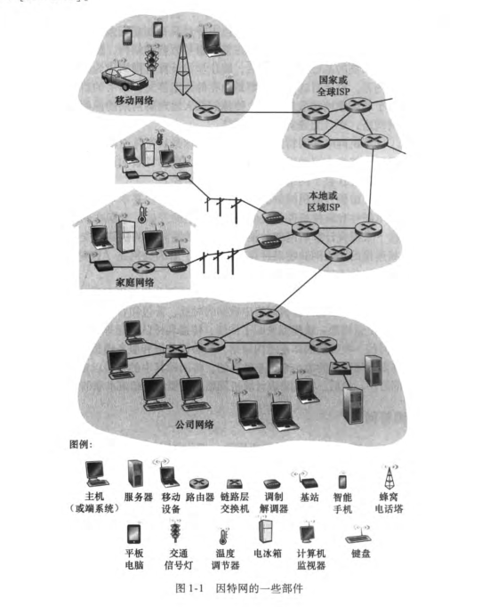
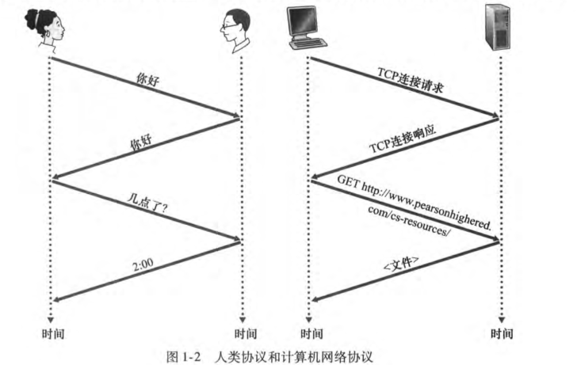
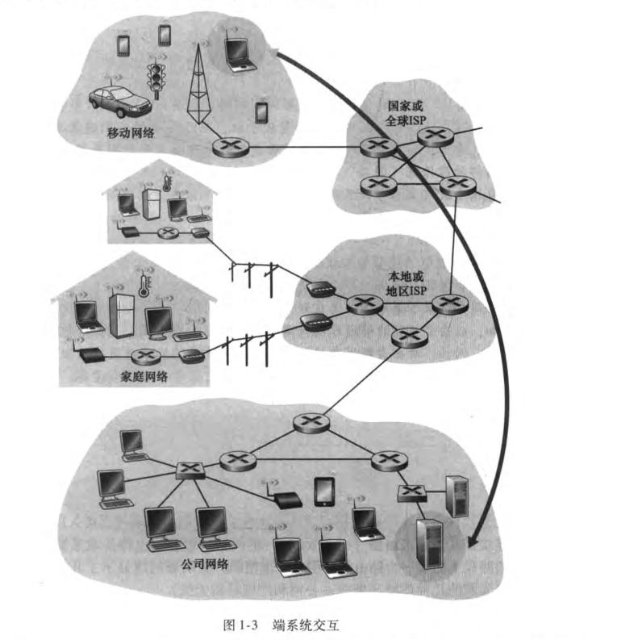
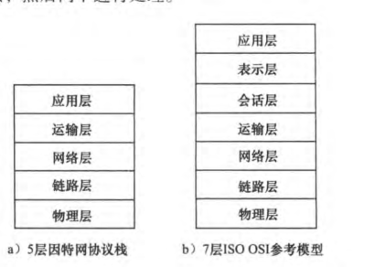

​	因特网是有史以来人类创造、精心设计的最大系统，该系统具有数以亿计的相连的计算机、通信链路和交换机，有数十亿的便携计算机、平板电脑和只能手机连接的用户，并且还有一批与因特网链接的“物品”，如游戏界、监视系统、手表等等。

​	第1章将概述计算机网络和因特网。从整体上粗略地勾勒计算机网络的概貌，并且描述本身内容的原理。这一章包含大量的背景知识，讨论大量的计算机网络构件。

## 1.1什么是internet

​	我们使用一种特定的计算机网络，即==公共因特网，作为讨论计算机网络极其协议的主要载体==。但什么是因特网。可以用两个方面来回答：其一，我们能够描述因特网的具体构成，即构成因特网的基本硬件和软件组件；其二，我们能够根据为分布式应用提供服务的联网继承设施来描述因特网。我们先从描述因特网的具体构成开始。

#### 1.1.1 internet具体构成描述

​	==因特网是一个世界范围的计算机网络==，即它是一个互联了遍及全世界数十亿计算设备的网络。不久前，这些设备多少是传统的桌面PC、Linux工作站以及服务器，然而，越来越对的非传统的因特网物品（如便携机、只能手机、电视、游戏机、温度调节装置、家用安全系统等等）正在与因特网相连。用因特网术语来说，**==所有这些设备都称为主机（host）或端系统（end system）==**。据估计，到2015年大约有50亿台设备与因特网连接。全球已有超过32亿因特网用户。

​	端系统通过**通信链路**（communication link）和**分组交换机**（packet switch）连接在一起。在1.2节将介绍许多类型的通信链路。它们由不同类型的物理媒体组成。==这些物理媒体包括同轴电缆、铜线、光纤和无线电频谱==。不同的链路能够以不同的速率传输数据，**链路的传输速率（transmission rate）以比特/秒（bit/s，或bps）度量**。==当一台端系统要向另一台端系统发送数据时，发送端系统将数据分段，并为每段加上首部字节，由此形成的信息包用计算机网络的术语来说称为**分组**（packet）==。这些分组通过网络发送到目的端系统，在那里被装配成初始数据。

​	==分组交换机从它的一条入通信链路**接收**到达的分组，并从它的一条出通信链路**转发**该分组==。市面上流行着各种类型、各具特色的分组交换机。但在当今的因特网中，两种最著名的类型是**路由器（router）**和**链路层交换机（linke-layer switch)**。这两种类型的交换机朝着最终目的转发分组。链路层交换机通常用于接入网中，而路由器通常用于网络核心中。从发送端系统到接收端系统，一个分组所经历的一系列通信链路和分组交换机称为通过改网络的路径（path）。

​	用于传送分组的分组交换网络在许多方面类似于承载运输车辆的运输网络，该网络包括了高速公路、公路和交叉口。通信链路类似于高速公路和公路，分组交换机类似于交叉口，而端系统类似于建筑物。就像卡车选取运算网络的一条路径前行一样，**分组则选取计算机网络的一条路径前行**。

​	==端系统通过因特网服务提供商（internet Service Provider , IPS）接入因特网。每个IPS自身就是一个由多台交换机和多段通信链路组成的网络==。IPS为内容提供者提供因特网接入服务，将Web站点和视频服务器直接连入因特网。因特网就是将端系统彼此互联，因此为端系统提供接入的IPS也必须互联。

​	端系统、分组交换机和其他因特网部件都要运行一系列协议（protocol），这些协议控制因特网中信息的接受和发送。==**TCP**（trasmission Control Protocol,传输控制协议和**IP**（internet Protocol,网络协议）是因特网中两个最为重要的协议==。IP协议定义了在路由器和端系统之间发送和接受的分组格式。因特网的主要协议统称**TCP/IP**。

​	

#### 1.1.2 服务描述

​	从应用程序提供服务的基础设施来描述因特网。因特网应用包括移动智能手机和平板电脑应用程序，其中包括即时讯息、来着云的音乐流等等。==因为这些应用涉及多个相互交换数据的端系统。故它们被称为**分布式应用程序**（distributed applicaiton）==。

​	运行在一个端系统的应用程序怎样才能指令因特网向运行在另一个端系统上的软件发送数据？与因特网相连的端系统提供了一个**套接字接口**（socket interface），==该接口规定了运行在一个端系统上的程序请求因特网基础设施向运行在另一个端系统上的特定目的地程序交付数据的方式。因特网套接字接口是一套发送程序必须遵循的规则集合，因此因特网能够将数据交付给目的地==。

​	我们已经给出了因特网的两种描述方式：一种是根据它的硬件和软件组件来描述，另一种是根据基础设施向分布式应用程序提供的服务来描述。或许还是对什么是因特网感到困惑。什么是分组交换和TCP/IP？什么是路由器？因特网中正再使用什么样的通信链路？请不要担心。后续章节中解释这些重要的术语和问题。

#### 1.1.3 什么是协议

协议是计算机网络中重要组成部分。现在来讨论协议是什么，协议是用来干什么的

1. **人类活动的类比**

人类无时无刻不在执行协议。考虑当你想要询问时间时将要怎么做。下面的图中显示了一种典型的交互过程。人类协议（至少说是好的行为方式）要求一方首先进行问候（第一个"你好"），以开始与另一个人的通信。当对方响应是返回一个"你好"报文，隐式着一种指示，表示能够继续向那人询问时间了。但是对最初的“你好”的不同响应，如不要烦或我不会说英语等等则表明了不能进行通信的结果。此时按照人类协议就不能继续通信。

2. **网络协议**

​	网络协议类似于人类协议，交换报文和采取动作的实体是某些设备的硬件或软件。在因特网中，涉及两个或多个远程通信实习的所有获得都受协议的制约。在因特网中协议运行无处不在。

​	当你向一个Web服务器发出请求时所发生的情况，图1-2右半部分显示了这种情形。首先，你的计算机将向该Web服务器发送一条连接请求报文，并等待回答。该Web服务器将最终能接受到请求连接报文，并返回一条连接响应报文。得知请求该Web文档正常以后，计算机则在一条GET报文中发送要从这台Web服务器上取回的网页名字，最后Web服务器向计算机返回该Web网页。

​	**协议定义了在两个或多个通信实体之间交换的报文的格式和顺序，以及报文发送和/或接收一条报文或其他事件所采取的动作**。

​	因特网广泛地使用了协议。不同的协议用于完成不同的通信任务。某些协议简单而直截了当，而某些协议则复杂且晦涩难懂。==掌握计算机网络领域知识的过程就是理解网络协议的构成、原理和工作方式的过程==。

## 1.2 网络边缘

​	在接下来的一节中，将从网络边缘向网络核心推进，查看计算机网络中的交换和选路。

​	通常，把与因特网相连的计算机和其他设备统称为端系统，因为它们位于因特网的编译，故而被称为端系统。因特网的端系统包括桌面计算机、服务器和移动计算机。

​	

​	端系统也称为主机（host），主机=端系统。主机有时被进一步划分为两类：客户(client)和服务器(server)。客户通常是桌面PC、移动PC和智能手机登，而服务器是更为强大的机器，用于存储和发布Web页面、流视频等等。

#### 1.2.1 接入网

​	接入网，指将端系统物理连接到其**边缘路由器**的网络。边缘李永强是端系统到任何其他远程端系统的路径上的第一台路由器。

1. **家庭接入：DSL、电缆、FTTH、拨号和卫星**

​	宽带住宅接入有两种最流行的类型：**数组用户线（DSL）**和电缆。住户从本地电话接入的本地电话公司处获取DSL因特网接入。因此，当使用DSL，用户的本地电话公司也是他的ISP。

​	家庭电话线同时承载了数据和传统的电话信号，它们用不同的频率进行编码：

- 高速下行信道，位于50kHz到1MHz频段；
- 中速上行信道，位于4KHz到50KHz频段；
- 普通的双向电话信道，位于0到4KHz频段；

#### 1.2.2 物理媒介

​	在计算机网络的物理媒介是指承载网络信号进行传输的实际物理材料或介质。负责在设备之间或设备内部传输表示数据的电信号、光信号等。

##### 1 双绞铜线

​	双绞铜线常用于电话网。从电话机到本地电话交换机的连线超过99%使用的是双绞铜线。双绞铜线由两根绝缘的铜线组成，每根大约1mn粗，以规则的螺旋状排列。**无屏蔽双绞铜线（Unshielded Twisted Pair UTP）常用于建筑物内的计算机网络中，即局域网（LAN）中。==局域网中双绞线的速率在10Mbps到10Gbps之间==**

​	现代的双绞线技术6a类电缆能够达到10Gbps的数据传输速率，距离长达100m。==双绞线最终已经作为高速LAN联网的主导型解决方案==。

##### 2 同轴电缆

​	同轴电缆由两个铜导体组成。同轴电缆在电缆电视系统中相当普遍。同轴电缆能被用作导引型共享媒体。**许多端系统能够直接于该电缆相连，每个端系统都能接收由其他端系统发送的内容**。

 

##### 3 光纤

​	**光纤是一种细而柔软的、能够导引光脉冲的媒体，每个脉冲表示一个比特。一根光纤能够支持极高的比特率，高达数百Gbps。它们不受电磁干扰，长达100km的光缆信号衰减极低，并且很难窃听**。许多长途电话网络现在全面使用光纤。，光纤广泛用于因特网的主干。然而光纤的成本是普通家庭难以承受的，所以在LAN或家庭接入网中就不适用它们。

## 1.5 协议层次及其服务模型

#### 1.5.1 **协议分层**

​	协议分层具有概念化和结构化的优点。分层提供了一种结构化方式来讨论系统组件。模块化使更新系统组件更任意。各层的所有协议被称为**协议栈**。因特网的协议栈由5个层次组成：物理层、链路层、网络层、运输层和应用层。我们采用自顶向下的方式描述计算机网络。首先处理应用层

1. **应用层**

​	应用层是网络应用程序及它们的应用层协议存留的地方。**因特网的应用层包括许多协议，例如HTTP(Web文档的请求和传送)、SMTP(电子邮件报文的传输)和FTP(两个端系统之间的文件传送)**。某些网络功能，如将像www.letf.org这样对人友好的端系统名字转换为32比特的网络地址，也是借助于特定的应用层协议即域名系统(DNS)完成的

​	应用层协议分布在多个端系统上，**而一个端系统中的应用程序使用协议与另一个端系统中的应用程序交换信息分组。我们把这种位于应用层的信息分组称为报文（message）。**

2. **运输层**

​	因特网的运算层在应用程序断电之间传送应用层报文，在因特网中，**有两种运输协议，即TCP和UDP**，利用其中的任一个都能运输应用层报文。TCP向它的应用程序提供了面向连接的服务。**TCP也将长报文划分为短报文，并提供拥塞控制机制，因此当网络拥塞时，TCP抑制其传输速率**。

## 1.6 计算一个ip地址的子网掩码、网络地址和广播地址。

​	
