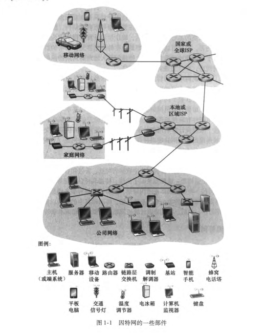
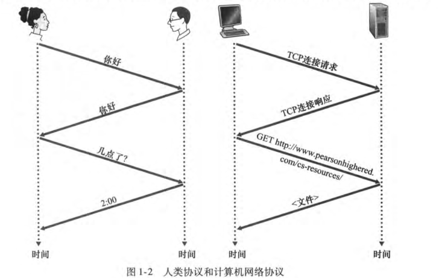
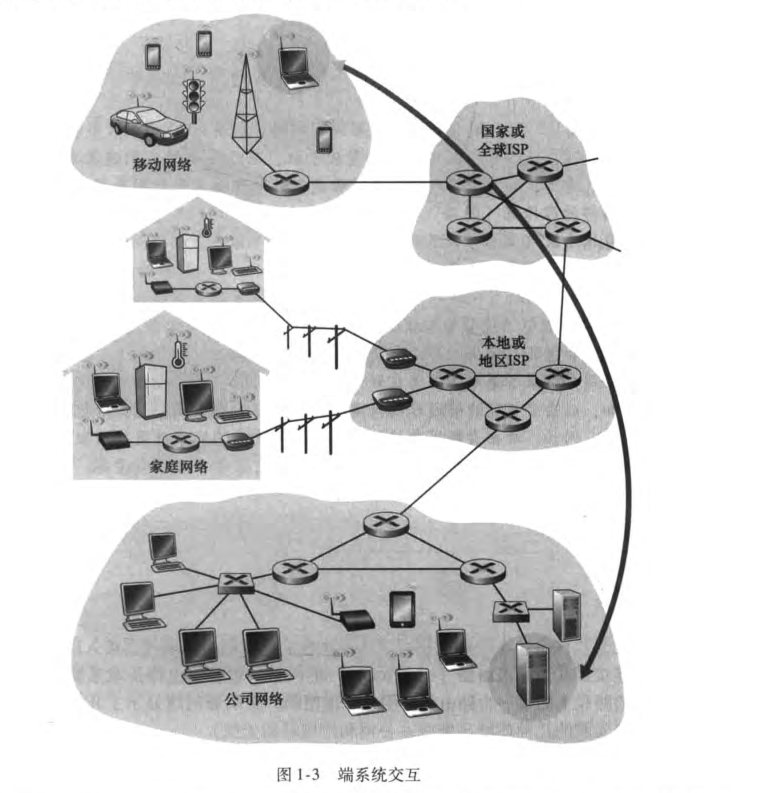
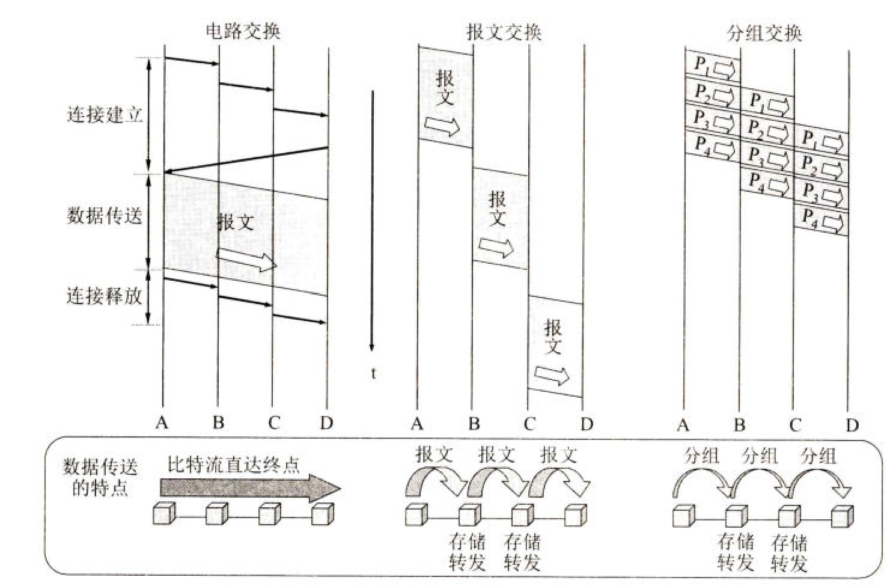
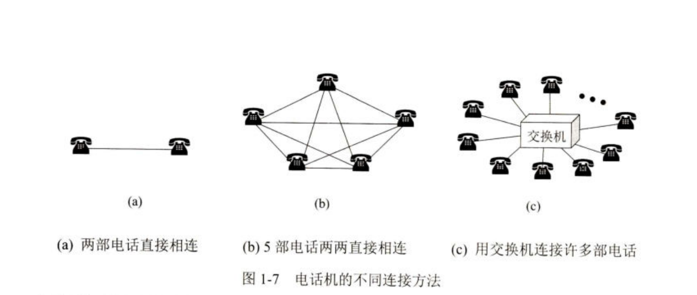
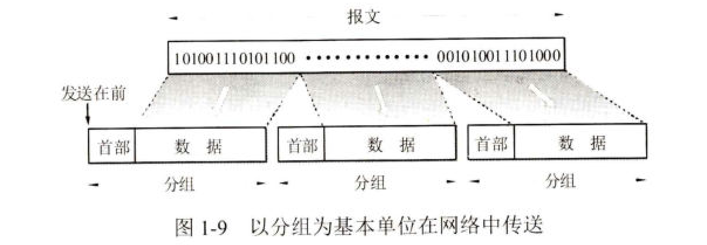
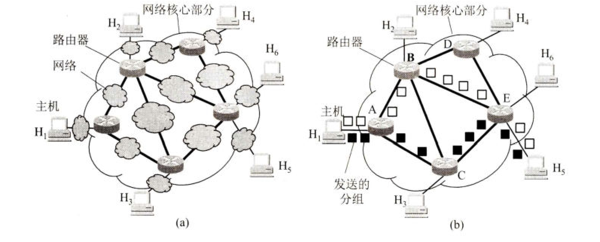
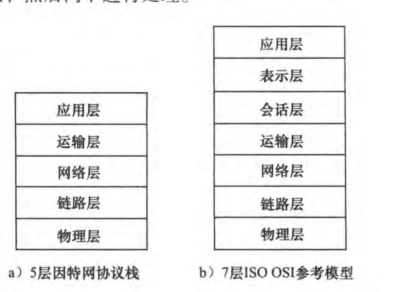

​	因特网是有史以来人类创造、精心设计的最大系统，该系统具有数以亿计的相连的计算机、通信链路和交换机，有数十亿的便携计算机、平板电脑和只能手机连接的用户，并且还有一批与因特网链接的“物品”，如游戏界、监视系统、手表等等。

​	第1章将概述计算机网络和因特网。从整体上粗略地勾勒计算机网络的概貌，并且描述本身内容的原理。这一章包含大量的背景知识，讨论大量的计算机网络构件。

## 1.1什么是internet

​	我们使用一种特定的计算机网络，即==公共因特网，作为讨论计算机网络极其协议的主要载体==。但什么是因特网。可以用两个方面来回答：其一，我们能够描述因特网的具体构成，即构成因特网的基本硬件和软件组件；其二，我们能够根据为分布式应用提供服务的联网继承设施来描述因特网。我们先从描述因特网的具体构成开始。

#### 1.1.1 internet具体构成描述

​	==因特网是一个世界范围的计算机网络==，即它是一个互联了遍及全世界数十亿计算设备的网络。不久前，这些设备多少是传统的桌面PC、Linux工作站以及服务器，然而，越来越对的非传统的因特网物品（如便携机、只能手机、电视、游戏机、温度调节装置、家用安全系统等等）正在与因特网相连。用因特网术语来说，**==所有这些设备都称为主机（host）或端系统（end system）==**。据估计，到2015年大约有50亿台设备与因特网连接。全球已有超过32亿因特网用户。

​	端系统通过**通信链路**（communication link）和**分组交换机**（packet switch）连接在一起。在1.2节将介绍许多类型的通信链路。它们由不同类型的物理媒体组成。==这些物理媒体包括同轴电缆、铜线、光纤和无线电频谱==。不同的链路能够以不同的速率传输数据，**链路的传输速率（transmission rate）以比特/秒（bit/s，或bps）度量**。==当一台端系统要向另一台端系统发送数据时，发送端系统将数据分段，并为每段加上首部字节，由此形成的信息包用计算机网络的术语来说称为**分组**（packet）==。这些分组通过网络发送到目的端系统，在那里被装配成初始数据。

​	==分组交换机从它的一条入通信链路**接收**到达的分组，并从它的一条出通信链路**转发**该分组==。市面上流行着各种类型、各具特色的分组交换机。但在当今的因特网中，两种最著名的类型是**路由器（router）**和**链路层交换机（linke-layer switch)**。这两种类型的交换机朝着最终目的转发分组。链路层交换机通常用于接入网中，而路由器通常用于网络核心中。从发送端系统到接收端系统，一个分组所经历的一系列通信链路和分组交换机称为通过改网络的路径（path）。

​	用于传送分组的分组交换网络在许多方面类似于承载运输车辆的运输网络，该网络包括了高速公路、公路和交叉口。通信链路类似于高速公路和公路，分组交换机类似于交叉口，而端系统类似于建筑物。就像卡车选取运算网络的一条路径前行一样，**分组则选取计算机网络的一条路径前行**。

​	==端系统通过因特网服务提供商（internet Service Provider , IPS）接入因特网。每个IPS自身就是一个由多台交换机和多段通信链路组成的网络==。IPS为内容提供者提供因特网接入服务，将Web站点和视频服务器直接连入因特网。因特网就是将端系统彼此互联，因此为端系统提供接入的IPS也必须互联。

​	端系统、分组交换机和其他因特网部件都要运行一系列协议（protocol），这些协议控制因特网中信息的接受和发送。==**TCP**（trasmission Control Protocol,传输控制协议和**IP**（internet Protocol,网络协议）是因特网中两个最为重要的协议==。IP协议定义了在路由器和端系统之间发送和接受的分组格式。因特网的主要协议统称**TCP/IP**。

​	

#### 1.1.2 服务描述

​	从应用程序提供服务的基础设施来描述因特网。因特网应用包括移动智能手机和平板电脑应用程序，其中包括即时讯息、来着云的音乐流等等。==因为这些应用涉及多个相互交换数据的端系统。故它们被称为**分布式应用程序**（distributed applicaiton）==。

​	运行在一个端系统的应用程序怎样才能指令因特网向运行在另一个端系统上的软件发送数据？与因特网相连的端系统提供了一个**套接字接口**（socket interface），==该接口规定了运行在一个端系统上的程序请求因特网基础设施向运行在另一个端系统上的特定目的地程序交付数据的方式。因特网套接字接口是一套发送程序必须遵循的规则集合，因此因特网能够将数据交付给目的地==。

​	我们已经给出了因特网的两种描述方式：一种是根据它的硬件和软件组件来描述，另一种是根据基础设施向分布式应用程序提供的服务来描述。或许还是对什么是因特网感到困惑。什么是分组交换和TCP/IP？什么是路由器？因特网中正再使用什么样的通信链路？请不要担心。后续章节中解释这些重要的术语和问题。

#### 1.1.3 什么是协议

协议是计算机网络中重要组成部分。现在来讨论协议是什么，协议是用来干什么的

1. **人类活动的类比**

人类无时无刻不在执行协议。考虑当你想要询问时间时将要怎么做。下面的图中显示了一种典型的交互过程。人类协议（至少说是好的行为方式）要求一方首先进行问候（第一个"你好"），以开始与另一个人的通信。当对方响应是返回一个"你好"报文，隐式着一种指示，表示能够继续向那人询问时间了。但是对最初的“你好”的不同响应，如不要烦或我不会说英语等等则表明了不能进行通信的结果。此时按照人类协议就不能继续通信。

2. **网络协议**

​	网络协议类似于人类协议，交换报文和采取动作的实体是某些设备的硬件或软件。在因特网中，涉及两个或多个远程通信实习的所有获得都受协议的制约。在因特网中协议运行无处不在。

​	当你向一个Web服务器发出请求时所发生的情况，图1-2右半部分显示了这种情形。首先，你的计算机将向该Web服务器发送一条连接请求报文，并等待回答。该Web服务器将最终能接受到请求连接报文，并返回一条连接响应报文。得知请求该Web文档正常以后，计算机则在一条GET报文中发送要从这台Web服务器上取回的网页名字，最后Web服务器向计算机返回该Web网页。

​	**协议定义了在两个或多个通信实体之间交换的报文的格式和顺序，以及报文发送和/或接收一条报文或其他事件所采取的动作**。

​	因特网广泛地使用了协议。不同的协议用于完成不同的通信任务。某些协议简单而直截了当，而某些协议则复杂且晦涩难懂。==掌握计算机网络领域知识的过程就是理解网络协议的构成、原理和工作方式的过程==。

## 1.2 网络边缘

​	在接下来的一节中，将从网络边缘向网络核心推进，查看计算机网络中的交换和选路。

​	通常，把与因特网相连的计算机和其他设备统称为端系统，因为它们位于因特网的编译，故而被称为端系统。因特网的端系统包括桌面计算机、服务器和移动计算机。

​	

​	端系统也称为主机（host），主机=端系统。主机有时被进一步划分为两类：客户(client)和服务器(server)。客户通常是桌面PC、移动PC和智能手机登，而服务器是更为强大的机器，用于存储和发布Web页面、流视频等等。

#### 1.2.1 接入网

​	接入网，指将端系统物理连接到其**边缘路由器**的网络。边缘李永强是端系统到任何其他远程端系统的路径上的第一台路由器。

1. **家庭接入：DSL、电缆、FTTH、拨号和卫星**

​	宽带住宅接入有两种最流行的类型：**数组用户线（DSL）**和电缆。住户从本地电话接入的本地电话公司处获取DSL因特网接入。因此，当使用DSL，用户的本地电话公司也是他的ISP。

​	家庭电话线同时承载了数据和传统的电话信号，它们用不同的频率进行编码：

- 高速下行信道，位于50kHz到1MHz频段；
- 中速上行信道，位于4KHz到50KHz频段；
- 普通的双向电话信道，位于0到4KHz频段；

#### 1.2.2 物理媒介

​	在计算机网络的物理媒介是指承载网络信号进行传输的实际物理材料或介质。负责在设备之间或设备内部传输表示数据的电信号、光信号等。

##### 1 双绞铜线

​	双绞铜线常用于电话网。从电话机到本地电话交换机的连线超过99%使用的是双绞铜线。双绞铜线由两根绝缘的铜线组成，每根大约1mn粗，以规则的螺旋状排列。**无屏蔽双绞铜线（Unshielded Twisted Pair UTP）常用于建筑物内的计算机网络中，即局域网（LAN）中。==局域网中双绞线的速率在10Mbps到10Gbps之间==**

​	现代的双绞线技术6a类电缆能够达到10Gbps的数据传输速率，距离长达100m。==双绞线最终已经作为高速LAN联网的主导型解决方案==。

##### 2 同轴电缆

​	同轴电缆由两个铜导体组成。同轴电缆在电缆电视系统中相当普遍。同轴电缆能被用作导引型共享媒体。**许多端系统能够直接于该电缆相连，每个端系统都能接收由其他端系统发送的内容**。

 

##### 3 光纤

​	**光纤是一种细而柔软的、能够导引光脉冲的媒体，每个脉冲表示一个比特。一根光纤能够支持极高的比特率，高达数百Gbps。它们不受电磁干扰，长达100km的光缆信号衰减极低，并且很难窃听**。许多长途电话网络现在全面使用光纤。，光纤广泛用于因特网的主干。然而光纤的成本是普通家庭难以承受的，所以在LAN或家庭接入网中就不适用它们。

#### 1.2.3 客户-服务器方式

​	**客户(client)**和**服务器（server）**都是指通信中所涉及的两个应用进程。该方式描述的是进程之间服务和被服务的关系。比如：**主机A运行客户程序，而主机B运行服务器程序**。在这种情况下，A是客户而B是服务器。客户A向服务器B发出请求服务，而服务器B向客服A提供服务。这里最主要的特征是：

​	**客户是服务请求方，服务器是服务提供方。**

​	

#### 1.2.4 P2P（对等连接方式）

​	**对等连接（peer-to-peer）,简写为P2P**。**指两台主机在通信时，并不区分哪一个是服务请求方，哪个是服务方。只要两台主机都运行了对等连接软件，它们就可以进行平等的对等连接通信。这时，双方都可以下载对方已经存储在硬盘中的共享文档。因此，这种方式被称为P2P方式。**

## 1.3 网络核心部分

​	网络核心部分是互联网中最复杂的部分，因为网络中的核心部分要向网络边缘部分中的大量主机提供连通性，使边缘不符中的任何一台主机都能够与其他主机通信。

​	在网络核心部分器特殊作用的是**路由器（router）**，他是一种专用计算机（但不叫做主机）。路由器是实现**分组交换（packet switching）的关键构件**，其任务是转发收到的分组。

​	交换方式主要有3种：

- **电路交换**——整个报文的比特流连续地从源点直达终点，好像在一个管道中传送。
- **报文交换**——整个报文先传送到相邻结点，全部存储下来后查找转发表，转发到下一个节点。
- **分组交换**——单个分组（这只是整个报文的一部分）。传送到相邻节点，存储下来后查找转发表，转发到下一个节点。

​	下面先介绍电路交换的基本概念。

#### 1.3.1 电路交换

​	两部电话至需要一根电话线就能够相互连接起来。但如果有5部电话两两相连，则需要10对电线。显然，若有N部电话需要相连，则需要$N(N-1)/2$对电话线。**当电话机的数量很大时，这种连接方式需要的电话线数量就太庞大了** 。

​	于是，人们认识到，要使得每一步电话能够很方便地喝另一部电话进行通信，就应当使用电话交换机将这些电话连接起来。**每一部电话都连接到交换机上，而交换机使用交换的方法，让电话用户彼此之间可以很方便的通信**，这种交换方式，就叫**电路交换**

​	

​	当电话机的数量增多时，就要使用很多彼此连接起来的交换机来完成全网的交换任务。用这样的方法，就构成了覆盖全世界的电信网。

​	从通信资源的分配角度来看，**交换**就是按照某种方式动态地分配传输路线的资源。

​	在使用电路交换打电话之前，必须拨号请求连接，当被叫用户听到交换机送来的振铃声并摘机后，从主叫端到被叫端建立了连接，也就是一条专用的物理通路。通话完毕挂机后，交换机释放刚才使用的这条专用的物理通路。

​	这种必须经过：**建立连接（占用通信资源）--->通话（一直占用通信资源）---->释放连接（归还通信资源）** 这三个步骤称为**电路交换**。

​	电路交换的一个重要特点是：**在通话的全部时间内，通话的两个用户始终占用端到端的通信资源**

​	但是，当使用电路交换来传送计算机数据时，其**线路的传输效率往往很多**。这是因为计算机数据是突发式地出现在传输线路。线路上真正用来传输数据的时间往往不到10%甚至1%。已被用户占用的通信线路资源在绝大部分时间里都是空闲的。

​	特点：

- **独占性**：连接建立后，即使双方没有数据传输，该线路也不能被其他用户使用，资源利用率较低
- **实时性高**：数据传输的延迟很小，适合语音通话（传统电话网）。
- **缺点**：建立连接耗时，信道利用率低，且一旦某个节点故障，连接可能中断。

#### 1.3.2 分组交换

​	分组交换采用**存储转发技术**。下图表示把一个报文划分为几个分组后再进行传送。

​	通常我们把要发送的整块数据称为一个**报文（message）**。在发送报文之前，先把较长的报文划分为一个个更小的等长数据段，例如，每个数据段为`1024bit`。在每个数据段前面，加上一些必要的控制信息组成的**首部（header）**后，就构成了一个**分组（packet）**。分组又称为**包**，而分组的首部也可称之为**包头**。

​	分组是在互联网中传送的数据单元，分组中的“首部”是非常重要的，正是由于分组的首部包含了诸如目的地址和源地址等重要控制信息，每一个分组才能在互联网中独立地选择传输路径，并被正确地交付到分组传输的终点。

​                         	

​	**主机是为用户进行信息处理的**，并且可以和其他主机通过网络交换信息。**路由器用来转发分组，即进行分组交换**。 路由器收到一个分组，先暂时存储一下，检查其首部，查找转发表，按照首部中的目的地址，找到合适的接口转发出去，把分组交给下一个路由器。这样一步一步地以存储转发的方式，把分组交付最终的目的主机。各路由器之间必须经常交换彼此掌握的路由信息，以便创建和动态维护路由器中的转发表，使得转发表能够在整个网络拓扑发送变化时及时更新。

​					

​		**分组交换的优点**：

- **高效**：在分组传输的过程中动态分配传输宽带，对通信链路逐段占用。
- **灵活**：为每一个分组独立地选择最合适的转发路由
- **迅速**：以分组作为传送单位，不先建立连接就能向其他主机发送分组。
- **可靠**：保证可靠性的协议；分布式多路由的分组交换网，使网络有很好的生存性。

​	分组交换也带来一些新的问题。比如，**分组在各路由器存储转发时需要排队，这会造成一定的时延。因此，必须尽量设法减少这种时延。此外，由于分组交换不像电路交换那样通过建立连接来保证通信时所需的各种资源，因此无法确保通信时端到端所需的带宽**

​	电路交换适合语音通信，而分组交换则适合于数据通信。然而随着蜂窝移动通信的发展，从第四代蜂窝移动通信网开始，无论是语音通信还是数据通信，都要采用分组交换。

​	

## 1.4 计算机网络的类别

​	计算机网络的精确定义并未统一。

​	关于计算机网络的较好的定义是这样的：**计算机网络主要是由一些通用的、可编程的硬件互联而成，这些硬件并非专门用来实现某一特定目的。这些可编程的硬件能够用来传送多种不同类型的数据，并能支持广泛的和日益的增长的应用。**

​	

#### 1.4.1 几种不同类别的网络

##### 1.按网络的作用进行分裂

1. **广域网WAN（Wide Area NetWork）** ：广域网的作用范围通常为几十到几千公里，有时也称为**远程网**。**广域网是互联网的核心部分，其任务是长距离运送主机所发送的数据。连接广域网各节点交换机的链路一般都是高速链路**，具有较大的通信容量。
2. **城域网MAN （Metropolitain Area NetWork）**：城域网的作用范围一般是一个城市，可跨越几个街区甚至整个城市，其作用距离越5~50km。城域网可以分为一个或几个单位所拥有，也可以是一种公用设施，用来将多个局域网进行互联。目前很多城域网采用的是以太网技术，因此有时也并入局域网的范围进行讨论。
3. **局域网LAN （Local Area NetWork）**：**局域网一般用微型计算机或工作站通过高速通信线路相连，但地理上则局限在较小的范围。**现在，学校或企业大都拥有许多个互连的局域网（这样的网络常称为校园网或企业网）。
4. **个人区域网PAN（Personal Area NetWork）**：**个人局域网就是在个人工作的地方吧属于个人使用的电子设备用无线技术连接起来的网络，，因此也常称为无线个人区域网WPAN（Wireless PAN）,其范围很小，大约在10m作用**

​	

##### 2. 按照网络的使用者分类

1. **公用网（public network）**：这里是指电信公司（国有或私有）出资建造的大型网络。“公用”的意思是所有愿意按电信公司的规定交纳费用的人都可以使用这种网络，因此也可称为公众网。
2. **专用网（private network）**：这里是指某个部门为满足本单位的特殊业务工作的需要而建成的网络。这种网络不向本单位以外的人提供服务，例如，军队、铁路、银行、电力等系统均有本系统的专用网。

​	

##### 3. 用来把用户接入到互联网的网络

​	这种网络就是**接入网AN（Access Network）**，它又称为**本地接入网或居民接入网**。这是一类比较 特殊的计算机网络。前面已经介绍**用户必须通过本地ISP才能接入到互联网**。**接入网实际上就是本地ISP所拥有的网络，它既不是互联网的核心部分，也不是互联网的边缘部分，接入网由某个端系统连接本地ISP的第一个路由器之间的一些物理链路组成。**

​	

## 1.5 计算机网络的性能指标

​	计算机网络的性能一般是指它的几个重要的性能指标。

#### 1.5.1 速率

​	计算机发送的信号都是数字形式的（二进制）。 **比特（bit）来源于`binary digit`**,意思是一个二进制数字。一个比特只能是0或1。比特也是信息论中使用的信息量的单位。

​	**网络技术中的速率是指数据的传输速率。也称为数据率或比特率**。速率是计算机网络中最重要的一个性能指标。单位写为**`bit/s`（比特每秒）（或b/s,有时也写为bps，即bit per second）**。当数据流较高时，就常常在`bit/s`前面加上一个字母。如 `K(kilo=10^3)= 千、M(Mega)=10^6=兆、G(Giga)=10^9=吉`，依次类推。比如$4*10^{10}bit/s$的数据率记为40Gbit/s。 

| 字母      | 数值      | 中文名称 |
| :-------- | :-------- | :------- |
| k (kilo)  | $10^{3}$  | 千       |
| M (Mega)  | $10^{6}$  | 兆       |
| G (Giga)  | $10^{9}$  | 吉       |
| T (Tera)  | $10^{12}$ | 太       |
| P (Peta)  | $10^{15}$ | 拍       |
| E (Exa)   | $10^{18}$ | 艾       |
| Z (Zetta) | $10^{21}$ | 泽       |
| Y (Yotta) | $10^{24}$ | 尧       |

​	我们在生活中常常看见千兆宽带这种宣传语，但实际使用下来，发现下载速度确只有100M左右，这是因为，它们使用的不是一个单位。这里的千兆宽带使用的单位是$bit/s$。而下载速度使用的单位通常是$byte/s$。它们相差了8倍。因为1byte=8bit。所以千兆宽带的最大下载速度应为：
$$
1000Mbit/s  = 125Mbyte/s \\
1000Mbit/s=\frac{1000}{8} MB/s =125 MB/s
$$
​	细心的朋友互发现，$Mbit/s和Mbyte/s$的缩写都是MB，那我们怎么区分，哪个是字节单位，哪个是比特单位。答案很简单，在计算机规范中，严格区分大小写。

- **B = Byte（字节）**
- **b = bit (比特）**

​	所以你在浏览器下载文件时，你会发现，默认显示的是MB/s。

​	而Steam的下载速率但是默认为Mbps，这就是为什么你感觉Steam的下载速度比浏览器快的原因。但实际上，抛开程序、站点原因，它们所能达到的速率是一样的。

​	

#### 1.5.2 带宽

​	**“带宽”（bandwidth）有两种不同的意义：**

1. **带宽本来是指某个信号具有的频带宽度**。信号的带宽是指该信号所包含的各种不同频率成分所占据的频率范围。例如，传统的通信线路上传送的电话信号的标准带宽是**3.1KHz（从300Hz到3.4KHz，即语音的主要成分的频率范围）**。**这种意义的带宽的单位是赫（或千赫、兆赫、吉赫等）**
2. **在计算机网络中，带宽用来表示网络中某通道传输数据的能力。因此网络带宽表示在单位时间内网络中的某信道所能通过的“最高数据率”**。在本笔记中提到“带宽时”，主要是指这个意思。这种意义的带宽的单位就是数据率的单位bit/s，是“比特每秒”

​	一条通信链路的带宽越宽，其所能传输的最高数据率也就越高。好比一个水管，水管越粗，能流动的水就越多。或者说一条高速公路越宽，能通过的车流量就越多。这里的带宽指的是一个网络在一定时间内能够传输的极限数据率。

#### 1.5.3 吞吐量

​	上一节我们将了带宽，是在时间单位中网络中的某信道能够通过的“最高数据率”。而**吞吐量（throughput）表示在时间单位内通过某个网络（或信道、接口）的实际数据量**

​	吞吐量更经常地用于对现实世界中的网络的一种测量，以便实际上到底有多少数据量能够通过网络。吞吐量受网络带宽或网络额定速率的限制。例如，对于一个1Gbit/s的以太网，就说其额定速率是1Gbit/s。这个数值也是该以太网的吞吐量的绝对上限值。因此，对于1Gbit/s的以太网，其实际吞吐量可能只有100Mbit/s，甚至更低。

​	接入到互联网的主机的实际吞吐量，受多方因数影响。如发送方的发送速率、通信线路的速率、网络的额定速率、带宽，以及接收方的接收速率。

​	所以，在构建家庭网络时，在物理设备的数据率上，尽量选择较大的，避免出现短板桶现象。

> 家庭网络中，任何一个环节（光猫、路由器、网线、网卡、终端设备）的速率瓶颈，都会限制整体吞吐量，这就是“短板桶现象”。

​	

#### 1.5.4 时延

​	**时延（delay或latency）是指数据（一个报文或分组，甚至比特）从网络的一端传送到另一端所需的时间**。时延时个很重要的性能指标，它有时也称为延迟或迟延。单位通常为`ms`，没错，就是你打游戏时最关注的一个数字，当你打出很丑陋的操作时，都会说卡了卡了，延迟成了你游戏失误的背锅侠。

​	网络中的时延由以下几个不同的部分组成：

##### 1. 发送时延

​	**发送时延（又叫传输时延）是主机或路由器发送数据帧所需的时间，也就是从发送数据帧的第一个比特算起，到该帧的最后一个比特发送完毕所需的时间**，发送时延的计算公式是：
$$
发送时延=\frac{数据帧长度(bit)}{发送速率(bit/s)}
$$

##### 2 传播时延

​	**传播时延（propagation delay）是电磁波在信道中传播一定距离需要花的时间**。传播时延的计算公式是：
$$
传播时延 =  \frac{信道长度(m)}{电磁波在信道上的传播速率(m/s)}
$$
​	**电磁波在自由空间的传播速率是光速，即$3.0*10^5km/s$** 。电磁波在网络传输媒体中的传播速率比在自由空间要略低一些：

- 在铜线电缆中的传播速率约为$2.3*10^5km/s$。

- 在光线中的传播速率越为$2.0*10^5km/s$

  例如，1000km长的光纤线路产生的传播时延约为5ms。计算过程。首先把单位换成米：
  $$
  传播时延 =  \frac{1000km}{2*10^5km/s}  
  \\传播时延=
  \frac{10^3*10^3m}{2*10^5*10^3m} s
  $$
  然后把单位去掉
  $$
  传播时延 = \frac{10^6}{2*10^8}s
  \\
  传播时延 = \frac{1}{2} * \frac{10^6}{10^8}s = \frac{1}{2} * 10^{-2}s = \frac{1}{2} * \frac{1}{10^2} s = \frac{1}{2} * 0.01s = 0.005s 
  \\
  0.005s*1000 = 5ms
  $$
  得出结果5ms

​	

​	发送时延和传播时延有本质上的不同。**发送时延发送在机器内部的发送器中（一般发生在网络适配器），与传输信道的长度没有任何关系**。

​	而传播时延则发生在机器外部传输信道媒体上，而与信号的发送速率无关。信号传送的越远，传播时延就越大。

​	用一个简单的比喻来说明。假定10辆车按顺序从公路收费站入口出发到相聚50km的目的地。再假定每一辆车过收费站要花6秒。而车速是每小时100公里。现在可以算出这10辆车从收费站到目的地要花费的时间：发车时间共需60秒（发送时延），在公路上的行车时间需要30分钟（相当于网络中的传播时延）。因此从第一辆车到收费站开始计算，到最后一辆车到达目的地为止。总共花费的时间是二者之和，即31分组。

## 1.5 协议层次及其服务模型

#### 1.5.1 **协议分层**

​	协议分层具有概念化和结构化的优点。分层提供了一种结构化方式来讨论系统组件。模块化使更新系统组件更任意。各层的所有协议被称为**协议栈**。因特网的协议栈由5个层次组成：物理层、链路层、网络层、运输层和应用层。我们采用自顶向下的方式描述计算机网络。首先处理应用层

1. **应用层**

​	应用层是网络应用程序及它们的应用层协议存留的地方。**因特网的应用层包括许多协议，例如HTTP(Web文档的请求和传送)、SMTP(电子邮件报文的传输)和FTP(两个端系统之间的文件传送)**。某些网络功能，如将像www.letf.org这样对人友好的端系统名字转换为32比特的网络地址，也是借助于特定的应用层协议即域名系统(DNS)完成的

​	应用层协议分布在多个端系统上，**而一个端系统中的应用程序使用协议与另一个端系统中的应用程序交换信息分组。我们把这种位于应用层的信息分组称为报文（message）。**

2. **运输层**

​	因特网的运算层在应用程序断电之间传送应用层报文，在因特网中，**有两种运输协议，即TCP和UDP**，利用其中的任一个都能运输应用层报文。TCP向它的应用程序提供了面向连接的服务。**TCP也将长报文划分为短报文，并提供拥塞控制机制，因此当网络拥塞时，TCP抑制其传输速率**。

​	

​	
