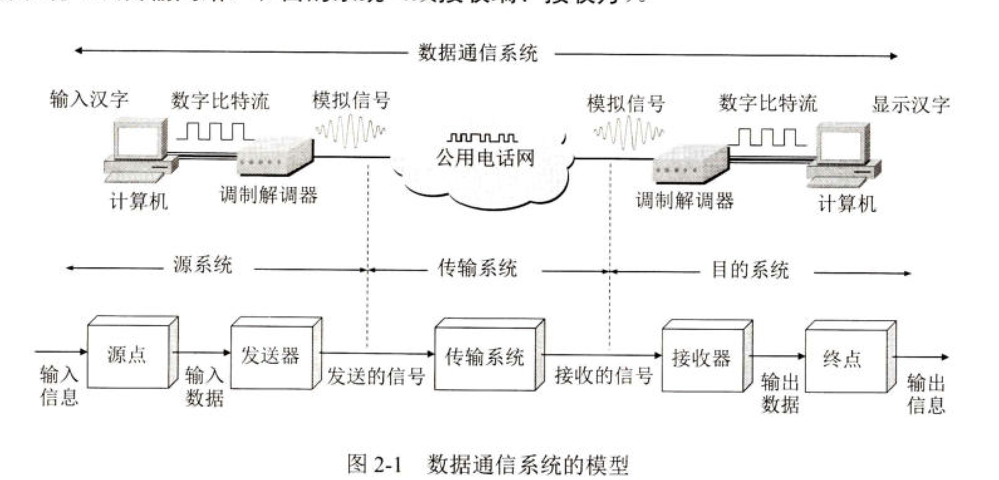
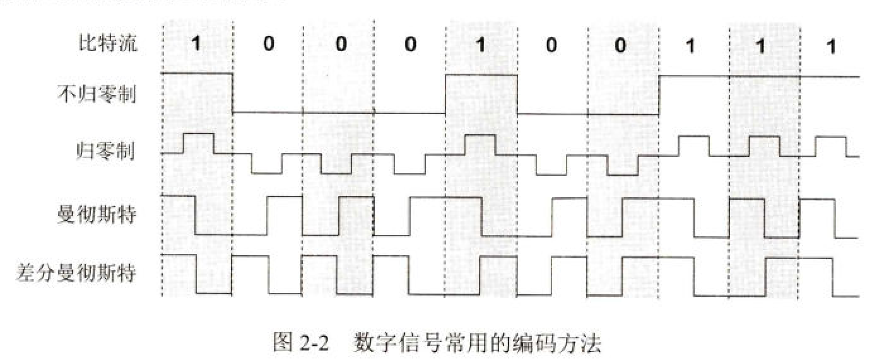
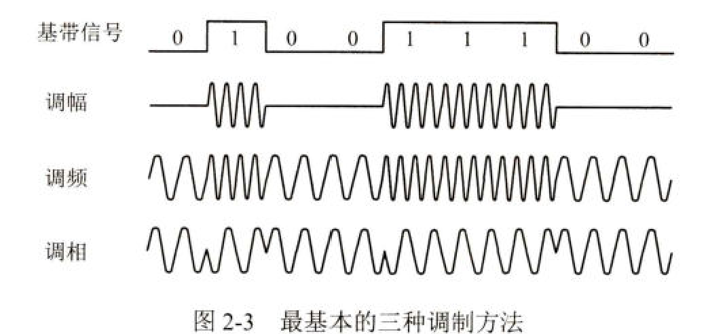
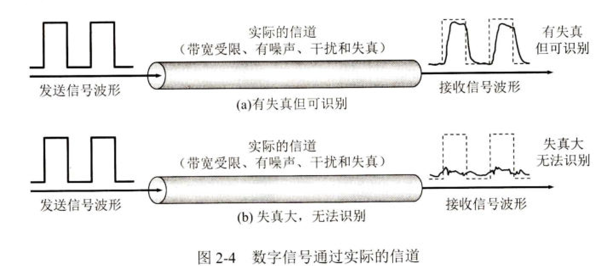

## 2.1 物理层基本概念

​	**物理层的任务是将帧中的一个个比特从一个节点移动到下一个节点**。传输媒体有：**双绞线、同轴电缆，光纤等**。用于物理层的协议也常称为物理层**规程（procedure）**，物理层规程==物理层协议。

​	可以将物理层的主要任务描述为确定与传输媒体的接口有关的特性，即：

1. **机械特性**： 指明接口所用接线器的形状和尺寸、引脚数目和排列、固定和锁定装置等。平时常见的各种规格的接插件都有严格的标准化规定。
2. **电气特性**
3. **功能特性**
4. **过程特性**

​	在本章节，我们主要学习以下内容：**传输媒体、数字传输系统、和复用技术**

## 2.2 数据通信的基础知识

​	

#### 2.2.1 数据通信系统的模型。

​	一个数据通信系统可划分为三大部分，即**源系统**（或发送方）、传输系统（或传输网络）和**目的系统**（或接收端、接收方）。

​	源系统包括两个部分：

- 源点（source）：计算机产生输出的数字比特流。
- 发送器：数字比特流要通过发送器编码后才能够在传输系统中进行传输。**典型的发送器就是调制器**

​	目的系统也包含两个部分：

- 接收器：接收传输系统过来的信号，并把它转化为能弄被目的设备处理的信息。典型的接收器就是解调器。
- 终点：从接收器传送来的数字比特流，然后把信息输出。

​	语音、文字、图像、视频等都是消息。数据（data）是运送消息的实体。**而信号（signal）则是数据的电气或电磁的表现。**

​	信号可分为两大类：

1. **模拟信号**，或连续信号——代表消息的参数的取值是连续的。**家中的调值解调器到电话端局之间的用户线上传送的就是模拟信号**。
2. 数字信号，或离散信号——代表消息的参数的取值是离散的。**在使用时间域的波形表示数字信号时，代表不同离散数值的基本波形就称为码元**。在使用二进制编码时，只有两种不同的码元，一种代表0状态而另一种代表1状态。

​	

#### 2.2.2 有关信道的几个基本概念

​	信道与电路不等同。**信道一般是用来表示向某一个方向传送信息的媒体，因此，一条通信电路往往包含一条发送信道和一条接收信道**

​	信道有三种基本交互方式：

1. 单工通信（单向通信）： 即只能有一个方向的通信。无线电广播就属于这种类型。
2. 双向交替通信（半双工通信）：即双方都可以收发消息。但双方不能同时发送。这种方式是一方发送一方接收。典型的代表就是对讲机。
3. 双向同时通信（全双工通信）：即通信双方可以同时发送和接收消息。

​	来着信源的信号称为**基带信号**（即基本频带信号）。像计算机输出各种文字或图像等都属于基带信号。基带信号往往不能直接传输。需要对基带信号进行**调制（modulation）**

​	调制可分为两大类。

1. **编码**：这种调制方式对基带信号的波形进行变换，使它能够与信道特性相适应。变换后仍是基带信号，称为基带调制。但由于这种方式是将数字信号转化为另一种形式的数字信号，也可以称为编码。
2. 载波（carrier）：把基带信号的频率范围搬移到较高的频段，并转化为模拟信号。结果载波调制后的信号称为**带通信号**，而使用载波的调制称为**带通调制**

​	

##### 1. 常见编码方式

​	常见编码方式如图：

- **不归零制**：正电平代表1，负电平代表0
- **归零制**：正脉冲代表1，负脉冲代表0
- **曼彻斯特编码**：位周期中心的向上跳代表0，位位周期中心向下跳代表1
- **差分曼彻斯特编码**：在每一位的中心始终有跳变。位开始边界有跳边代表0，而位开始边界没有跳变代表1.

##### 2. 基本的带通调制方法

​	下图给出了最基本的调制方法

- 调幅（AM）：即载波的振幅随着基带信号数字变化而变化。
- 调频（FM）：即载波的频率随着基带数字信号而变化
- 调相（PM）：即载波的初始相位随着基带数字信号而变化。

#### 2.2.3 信道的极限容量

​	数字通信的优点是：**虽然信号能在信道上传输，传输时会不可避免地产生失真，但是在接收端只要能从失真的波形中识别出原来的信号，那么这种失真对通信质量就可以视为无影响。**

​	**码元传输的速率越高、信号传输的距离越远、噪声干扰越大或传输媒体质量越差，在接收端的波形的失真就越严重**

> 码元：在信道上传输的一个信号单元。每个码元可以携带一定的信息（bit）

##### 1.奈式准则

​	奈式准则提出，在假定的理想条件下，为避免码间串扰，码元的传输速率的上限值：

​	**在带宽为W（Hz）的低通信道中，若不考虑噪声影响，则码元传输的最高速率是2W(码元每秒)。传输速率超过此上限，就会出现严重的码间串扰的问题。**

​	例如，信道的带宽为4000Hz，那么最高码元传输速率就是每秒8000个码元。

习题：**假定某信道受奈式准则的现在最高码元速率为20000码元每秒。如果采用振幅调制，把码元的振幅划分为16个不同等级来传输，那么最高可以获得多少数据率（bit/s）**

​	在通信中。一个码元可以取多种不同的状态。如果把振幅划分为16个不同的等级，那就意味着一个码元可以代表16种不同的符号。每个符号对应一组二进制比特。16种符号，需要用多少bit来表示？

- 1 比特 → 2 种状态
- 2 比特 → 4 种状态
- 3 比特 → 8 种状态
- **4 比特 → 16 种状态**

因此，**每个码元能携带的比特数 = log₂(状态数)**

​	数据率指的是**每秒传输的比特数**。在这里，它等于： **码元速率✖️每码元比特数**
$$
数据率 = 20000 * 4 =80000
$$
​	所以，这题的答案是80000bit/s

##### 2. 信噪比

​	实际的信道中是一定有噪声的，下面给出公式计算信噪比。：
$$
信噪比(dB) = 10*log_{10}(S/N) (dB)
$$
​	例如，当S/N为10时，信噪比为10db

​	香农推导出了著名的香农公式，该公式指出：信道的极限信息传输速率C是：
$$
C = W*log_2(1+S/N) (bit/s)
$$
​	其中，$W$为信道的带宽（以Hz为单位）。S为信道内所传信号的平均功率，N为信道内的最高噪声功率

​	该公式表明：**信道的带宽或信道中的信噪比越大，信息的极限传输速率越高**。

习题：**假定要用3kHz带宽的电话信道传送64kbit/s的数据，这个信道具有多高信噪比。这个结果说明什么问题**

​	代入香农公式计算：
$$
64*10^3 = 3*10^3 log_2(1+S/N)
$$
​	计算过程有些复杂，这里直接得出结果：64.2dB。

## 2.3 物理层的传输媒体

​	传输媒体不属于计算机网络体系结构中的任何一层。勉强可分为物理层之下。传输媒体可分为两类：

​	**1、导引型传输媒体**

 1. 同轴电缆

 2. 双绞线：常用语家用宽带网络传输

 3. 光纤

 4. 电力线

    **2、非导引型传输媒体**

1. 无线电波
2. 微波
3. 红外线
4. 可见光

#### 2.1.2 传输方式

- **串行传输**：数据是一个比特一个比特依次传输的，因此，发送端和接收端只需要有一条线路
- **并行传输**：数据的多个比特在多条并行的物理线路上同时进行传输，发送端和接收端需要有n条线路。优点是比串行传输速度快了倍。缺点是成本高，因为需要多条线路。
- **同步传输**
- **异步传输**
- **单向通行（单工）**：通信链路上的数据传输**永远只在一个固定的方向上进行**。一方固定为发送端，另一方固定为接收端。
- **双向交替通信（半双工）**：通信双方**都能发送和接收数据**，但**不能同时进行**。在任一时刻，数据流只能是单向的。双方需要“切换”方向

#### 2.1.3 编码与调制

​	我们将文字、视频、图片音乐的信息称之为`message`，运送该信息的实体成为`Data`，用二进制表达式。将二进制用电磁信号表达。发送给基带信号

​	基带信号分为：数字基带信号和模拟基带信号。信号需要在信到中进行传输，对应的信道也分为数字信道和模拟信道两种

​	对数字基带信号的波形进行变换，成为编码，编码后参数数字信号，在数字信道传输。

​	

## 2.4 信道复用技术

​	复用是通信技术中最基本的概念。