## 3.1 数据链路层概述

​	数据链路层位于五层模型中的第2层。如下：

```
应用层
运输层
网络层
数据链路层
物理层
```

​	**链路（Link）**是从一个结点到相邻结点的一段物理线路，而中间没有任何其他的交换结点。

​	**数据链路（Data Link）是指把实现通信协议的硬件和软件加到链路上，就构成了数据链路**

​	**帧**：在数据链路传输的数据包，被称为帧。也就是说，数据链路层以帧为单位传输和处理数据 。


#### 3.1.2 封装成帧

​	在传输数据时，发送方通过应用层将数据封装为应用成数据单元，然后从上到下，每经过一次，添加对应层次的**协议首部**。如：

```
应用层数据单元
	|
	|
	|
应用层数据单元|运输层协议首部
	|
	|
	|
应用层数据单元|运输层协议首部|网络层协议首部
	|
	|
	|
帧尾|应用层数据单元|运输层协议首部|网络层协议首部|帧头
```

​	**数据链路层将网络层交付的数据协议单元添加帧头帧尾的操作称为封装成帧**。帧头帧尾中含有重要的地址信息。比如：

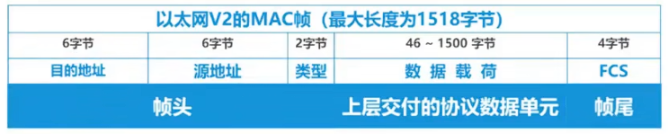

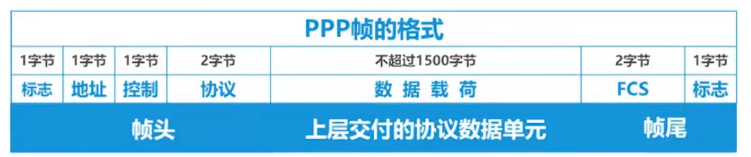

​	帧头和帧尾的作用之一就是帧定界


#### 3.1.3 差错检测

​	差错检测是一种在数据存储或传输过程中，**自动发现数据是否出现错误**的技术。它是确保数据完整性和可靠性的基础手段

1. **发现错误**：检测数据是否因干扰、硬件故障等原因产生了比特翻转（如 0 变 1，1 变 0）、丢失或错序。
2. **不可靠环境下的保障**：在存在噪声的通信信道或不完美的存储介质中，提供一个检查机制。
3. **注意**：绝大多数常见的差错检测技术**只能发现错误，而不能自动纠正错误**。发现错误后，通常需要请求发送方重新传输数据。

​	在一段时间内，传输错误的比特占所传输比特总是的比率称为**误码率 BER **。为了保证数据传输的可靠性，必须采用各种差错检测措施。目前在链路层广泛使用了==**循环冗余检验（CRC）**==的检错技术。

​	

##### 1.循环冗余检验CRC原理

1. 在发送端，先把数据划分为组。假定每组k个比特
2. CRC运算在每组数据M后面再添加供差错检测用的**`n`位冗余码**，然后构成一个帧发送出去。

##### 2.**冗余码的计算**

​	这n位冗余码可以用以下方法得出

1. **在M后面添加n个0**，得到（k+n）位的数除以**除数P**
2. 收发双方首先约定一个`n+1`位的二进制数，n是冗余码的位数。例如1101，n=3。这个（n+1）位的数就是除数
3. 得到商和余数，商不重要，主要看余数。

​	比如，M = 101001 (k=6)，假定除数P =1101 （即n=3）。被除数为101001000，得出的商Q=110101（没什么用），而余数R=001。这个余数R就作为冗余码拼接在数据M后面发送出去。

​	这种为了进行检测差错而添加的冗余码厂称为**帧检验序列（FSC）**，因此加上FCS后发送的帧是101001001（即$2^nM+FCS$），供有（k+n）位。

​	注意，循环冗余检验CRC和帧检验序列FCS并不是同一个概念。**CRC是一种检错方法，而FCS是添加在数据后面的冗余码。**


​	在接收端把接收到的数据以帧为单位进行CRC检验：**把收到的每一个帧都除以同样的除数P（模2运算），然后检测得到余数R**

​	如果传输过程中无差错，那么经过CRC检验后得到的余数R肯定是0。总之，在接收端对收到的每一帧经过CRC检验后，有两种情况:

1. 若得出的余数R=0，则判定这个帧没有错误，就接收，
2. 如果余数R!=0，则判定这个帧有差错。

​	

##### 3.**生成多项式P(X)表示除数P**

​	在上面的例子中，可以用多项式：$P(X)=X^3+X^2+1$表示上面的除数P=1101（最高位对应于$X^3$,最低位对应于$X^0$）。多项式$P(X)$称为生成多项式。

​	可以这样理解，$X^3+X^2+1 = 1*X^3+1*X^2+0*X^1*1*X^0$

​	X^n代表二进制所在的位数，n就是在n位，只要写出来了，就代表这个位数上是1，没有写出来就是0。

0

##### 4. 模2运算规则

​	以上面的例子为例：被除数为1010010000，除数为：1101。每次只看被除数最高位为0还是1，为1就商1，把被除数与除数做或运算，只算后面三位，然后从上面落。如果最被除数最高位数0，就商0，与0做或运算 

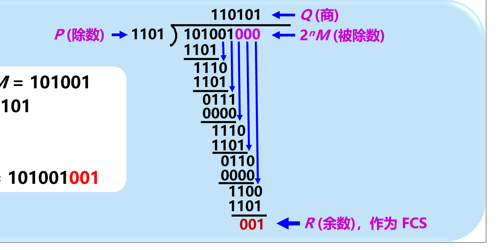


#### 3.1.4 透明传输

​	误码是不能完全避免的，但若能实现发送发发送什么，接收方就收到什么，就称为可靠传输


## 3.2 点对点协议PPP

​	点对点协议PPP(Point-to-Point Protocol) 是目前使用最广泛的点对点数据链路层协议。

​	ISP（网络服务提供商）如联通、移动和电信等服务商，从因特网申请一批IP地址。**用户计算机只有获取ISP分配的合法地址后，才能称为因特网的主机，用户计算机与ISP通信时，所使用的数据链路层协议通常就是PPP协议**

​	PPP协议为在点对点链路传输各种协议数据报提供一个标准方法，主要由以下三部分构成：

- 对各种协议数据报的封装方法（封装成帧）
- 链路控制协议LCP ，用于建立、配置以及测试数据链路的连接
- 一套网络控制协议NCPs ，其中的每一个协议支持不同的网络层协议

​	PPP协议主要解决三个问题：

- 封装成帧
- 透明传输
- 差错控制


#### 3.2.3 PPP协议帧格式

##### 1.各字段含义

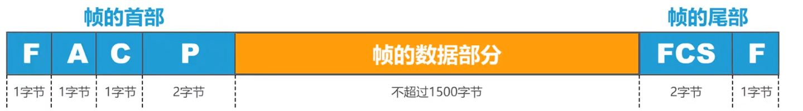

标志（Flag）字段：PPP帧的定界符，取值`0x7E`

协议（Protocol）字段：指明帧的数据部分送交哪个协议处理

- 取值`0x0021`表示：帧的数据部分为IP数据报
- 取值`0xC021`表示：帧的数据部分为LCP分组
- 取值`0x8021`表示：帧的数据部分为NCP分组

帧检验序列（FCS）字段：CRC计算出的校验位

​	可以看出PPP帧的首部和尾部分别为四个字段和两个字段。

​	首部的第一个字段和尾部的第二个都是帧定界符，规定为0x7E（0x标识后面的字符是用十六进制标识的），帧定界符表示一个帧的开始和结束。

​	首部的第二个字段A规定为0XFF(111111)，控制字段C规定为0X03

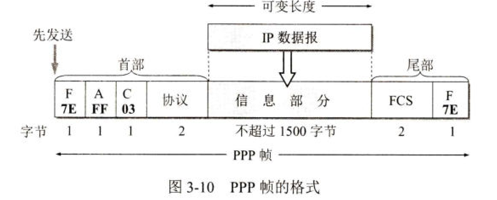

##### 2.字节填充

​	当信息字段中出现和标志字段一样的比特组合时，就必须采取一些措施。当PPP使用异步传输时，它把转义符定义为0X7D，并使用字节填充。方法如下：

1. 把信息字段中出现的每一个0x7E字节转变为1字节序列 （0x7D,0x5E）。
2. 若信息字段中出现了一个0x7D的字节，则把0x7D转变为2字节序列（0x7D，0x5D）。
3. 若信息字段中出现了ASCII码的控制符（即数值小于0x20的字符），则在该字符前面加一个0x7D，同时将该字符的编码加以改变。


##### 3.零比特填充

​	PPP协议在使用同步传输（一连串的比特连续传送）而不是异步传输时。在这种情况下，PPP协议采用零比特填充方法来实现透明传输。

​	零比特填充的具体做法是：**在发送端，先扫描整个信息字段。只要发现有5各连续的1，则立即填入一个0。因此，结果零比特填充后的数据，就可以保证在信息字段中不会出现6个连续1**

​	接收端在收到一个帧时，先找到标志字段F以确定一个帧的边界，接在再用硬件对其中的比特流进行扫描，每当发现连续5个连续1时，就把这5个连续1后的一个0删除，以还原原来的信息比特流。

​	这样就保证了透明传输：在所传送的数据比特流中可以传送任意组合的比特流，而不会引起对帧边界的错误判断。


## 3.3 媒体接入控制

​	共享信道要着重考虑是**如何协调多个发送和接收站点对一个共享传输媒体的占用，即媒体接入控制MAC（Medium Access Control）**

​	许多网络拓扑（如早期的总线型以太网，现在的无线WIFI中）所以设备都连接在同一个传输媒介（同轴电缆，无线电波）上，这个媒介就是所有设备共享的公共资源。共享信道是多个设备使用一个单行道，多个媒体在共享媒体发送数据，它们的信号会相互叠加、混淆，导致所有数据传输失败，造成冲突。

​	

​	媒体接入控制总共分为两类：

- 信道划分MAC协议（静态分配）
  - 把大路预先划分成几条固定的小道，每人走自己的道
    - 频分多址
    - 时分多址
    - 码分多址
- 随机接入MAC协议（动态分配）
  - 随时使用整条大路，但需要遵守一套规则，避免冲突。是现在WI-FI等现代计算机网络的主流方式。
    - 受控接入
      - 集中控制
      - 分散控制
    - 随机接入


#### 3.3.1 静态划分信道

​	复用（`Multiplexing`）是通信技术中的一个重要概念。**复用是通过一条物理线路同时传输多路用户的信号**

​	当网络中传输媒体的传输容量大于多条单一信道传输的总通信量时，可以利用复用技术在一条物理线路上建立多条通信信道来充分利用传输媒体的带宽。

​	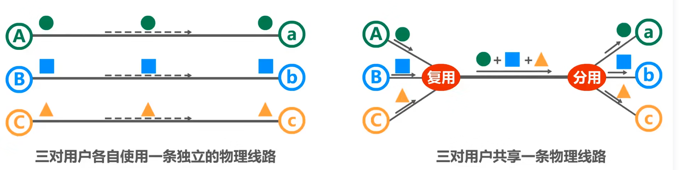

​	信道复用技术有：频分复用FDM，时分复用TDM、波分复用WDM


#### 3.3.2 随机接入——CSMA/CD协议

​	CSMA/CD协议全称**载波监听多点接ZQ	入/碰撞检测**

​	

#### 3.3.3 随机接入——CSMA/CA协议


## 3.4 MAC地址、IP地址以ARP协议

​	MAC地址是以太网的MAC子层所使用的地址；属于数据链路层。

​	IP地址与ARP协议属于网络层，但它们与MAC地址存在一定关系，日常的网络应用都离不开MAC地址、IP地址以及ARP协议。因此放在一起讨论


#### 3.4.1 MAC地址

​	

​	如图所示，两台设备通过一条链路通信，显然它们不需要地址就可以通信，因为连接在信道上的主机只有它们两个。**使用点对点信道的数据链路层不需要使用地址**

​	下面是使用共享信道的总线型局域网。

​	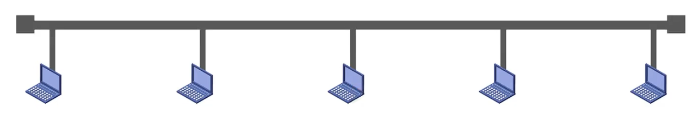

​	总线上的一台主机要发送帧给另一台主机，帧的信号会通过共享信道传送到总线上的其他所有主机，**主机如何判断该帧是否发送给自己的，因此必须使用地址区分个主机**

- **当多个主机在同一个广播信道上，要想实现主机之间的通信，则每个主机都必须有一个唯一的标识，即一个数据链路层地址；**
- 每个主机发送的**帧中必须携带标识发送主机和接收主机的地址**。由于这类地址是用媒体接入控制MAC（Media Access Control），因此这类地址被称为MAC地址。
  - MAC地址一般被固化在网卡（网络适配器）的电可擦可编程只读存储器EEPROM中，因此MAC地址也被称为**硬件地址**或**物理地址**，注意，MAC地址不属于网络体系结构中的物理层，而属于数据链路层

​	一般情况下，用户主机会包含两个网络适配器：有线局域网适配器（有线网卡）和无线局域网适配器（无线网卡）。每个适配器都有一个全球唯一的MAC地址。**而交换机和路由器往往拥有更多的网络接口，所以会拥有更多的MAC地址。严格来说，MAC地址是对网络上各接口的唯一标识，而不是网络上各设备都唯一标识**

​	

​	**IEEE 802局域网的MAC地址格式**

​	由48个比特构成，每8个比特构成一个字节，从左至右依次为第一字节到第六字节，前三个字节是组织唯一标识符OUI，生产网络设备都厂商，需要向IEEE的注册管理机构申请一个或多个OUI。后三个字节由获得OUI的厂商自行随意分配s

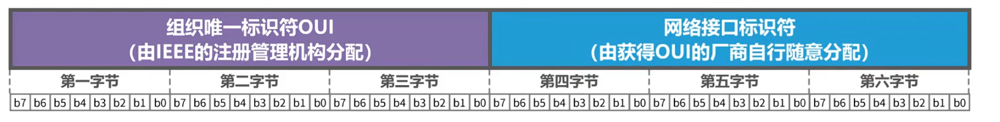

​	这种标识符被称为**EUI**，对于48个比特的称为`EUI-48`

​	将每4个比特用十六进制标识一个字符，两个字符一组，共分为6组。得到标准标识法：

```
xx-xx-xx-xx-xx-xx 
或用冒号连接
xx:xx:xx:xx:xx:xx
或四个字符一组，用.连接
xxxx.xxxx.xxxx.xxxx
```

​	例如30-FB-B8 OUI被分配给华为科技有限空手，`A4-45-19`被分配给小米公司

​	MAX地址的第一字节B0位：

​	**取0：单播地址**

​	**取1：多播地址**

​	MAX地址的第一个字节B1位：

​	**取0：全球管理的唯一地址**

​	**取1：本地管理**

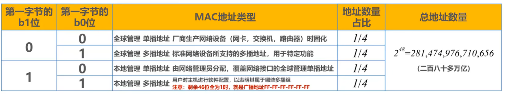

​	**单播地址**：使用单播地址发送单播帧时，包装成帧后，会通过共享线路发送给其他设备，只有目标MAC地址匹配时，才会接收该帧。

​	**多播地址**：当主机A的目的`07-ED-12-F6-D8`在其他主机都多播主列表时，就会接收该帧，返回上层解析。反之不在多播地址则不会接收，会丢弃该帧。

​	判断是否为多播地址的技巧，判断第一组字符的第二个十六进制数不能被2整出（1,3,5,7,9,B,D,F），即为多播地址

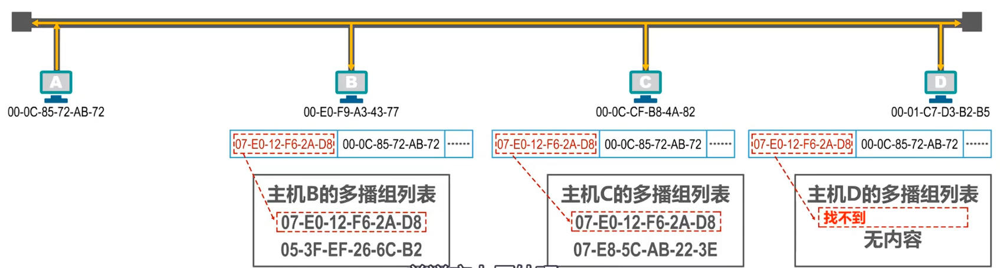

​	**广播地址**：当46位全为1时，就是广播地址`FF-FF-FF-FF-FF`。此时会发送到总线上的所有主机，主机检测到目的地址是广播地址后，就会接收该广播帧。交给上层处理

​	

#### 3.4.2 IP地址

​	IP地址是因特网上的主机和路由器所使用的地址，用于标识两部分信息

- 网络编号：标识因特网上数以百万记的网络
- 主机编号：标识同一网络上不同主机（或路由器各接口）

​	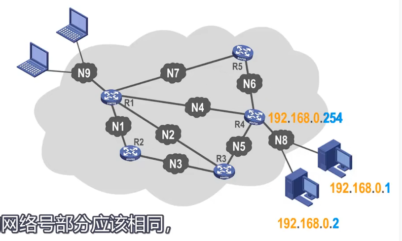

​	观察`N8`网络的各个ip，可以看到前三个数字相同，最后一个数字不相同。表明它们是同一网络下的不同终端设备，换句话说：**同一网络上的各主机和路由器的接口的IP地址的网络号部分应该相同，而主机号部分应该互不相同**

​	很显然，IP地址可以将各个网络划分为局域网。之前介绍的MAC地址不具备区分网络的功能。如果只是一个单独的网络，可以只使用MAC地址。**如果主机所在网络需要接入因特网，则IP地址和MAC地址都需要使用s**

​	**从网络体系结构中看IP地址和MAC地址**。

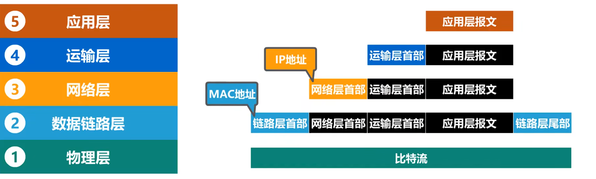

​	**数据包转发过程中源IP地址和目的IP地址保持不变**；

​	数据包转发过程中源MAC地址和目的MAC地址逐个链路改变。如何通过IP地址知道对应的MAC地址，这是下一节要讲的ARP协议要解决的问题


#### 3.4.3 ARP协议

​	ARP协议解决的是，如何通过IP地址知道对应的MAC地址。下面来看一个具体例子

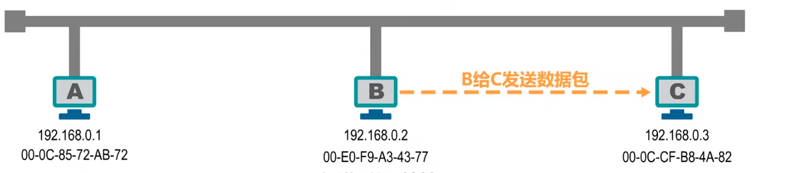

​	主机B要发送数据包给C，但是只知道C的ip地址，却不知道MAC地址，B的数据链路层封装MAC帧时，无法填写目的MAC地址。所以，它会在主机的ARP高速缓存中寻找对应地址的MAC地址。

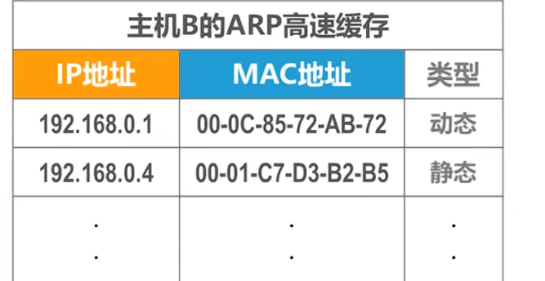

​	如果此时还没找到，那么就会发送一条`APR请求报文`（封装在MAC帧中，目的地为FF-FF-FF-FF-FF-FF）广播。内容如下：

```
我的IP地址为：192.168.0.2
我的MAC地址为：00-E0-F9-A3-43-77
我想知道IP地址为192.168.0.3的主机的MAC地址
```

​	现在，主机A和C都会收到这条报文。主机A发现，询问的地址不是它，就不予理会。主机C发现，是在询问我的MAC地址，于是：

1. **将B的ip地址与MAC地址记录到APR高速缓存表中；**
2. 给B发送APR响应报文（单播 帧，目的地为主机B的MAC地址），告知自己的MAC地址

​	ARP缓存表中都有其类型，分为动态类型和静态类型：

​	**动态：自动获取，生命周期默认为两分钟；**

​	**静态：手工设置，不同操作系统下的生命周期不同。例如系统重启后不存在或系统重启后仍然有效**

​	ARP只能在一个网络或在一个线路上使用，不能夸网络使用


3.5 


