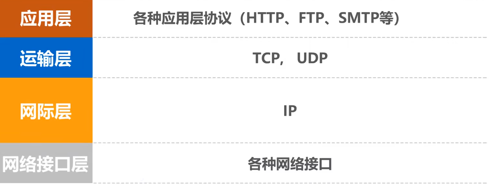
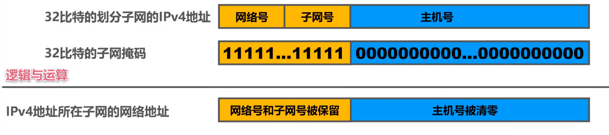

## 4.1 网络层概述

​	网络层的主要任务是**实现网络互联**，进而实现数据包在各网络之间的传输。

​	**因特网(internet)**是目前全世界用户数量最多的互联网，它使用**TCP/IP协议栈**。由于该协议栈的网络层使用**网际协议IP**，所以又被称为**网际层**



​	

## 4.2 IPv4

​	在TCP/IP体系中，**IP地址是最基础的概念**。**IPv4地址是给因特网上的每一台主机（或路由器）的每一个接口分配一个在全世界范围内是唯一的32位比特的标识符**

​	

#### 4.2.1 IPv4的表示方法

​	32比特的IP地址不方便阅读、记录以及输入，IPv4地址采用**点分十进制方法**表示。如：

```
00001010 11110000 00001111 10101010
```

​	将每8个比特分为一组，总共4组，写出每组对应的十进制数：

```
10.240.15.170
```

​	每个十进制数用一个点`.`分隔。


#### 4.2.2 分类编址

- A类地址：8位网络号+24位主机号。最高位为0，即第一位是0。**网络号范围：1~127**
- B类地址：16位网络号+16位主机号，最高两位为10，即前两位是10。**网络号范围：128~191**
- C类地址：24位网络号+8位主机号，最高三位为110，即前三位是110。**网络号范围：192~223**
- D类地址：多播地址。最高4位固定为1110
- E类地址：保留地址。最高4位固定位1111

​	只有A、B和C类地址可分配给网络中的主机或路由器的各接口。

​	**主机号为 “全0”的地址是网络地址，不能分配给主机或路由器的各接口**

​	**主机号为 “全1”的地址是广播地址，不能分配给主机或路由器的各接口**


****

**1. A类地址的细节**

​	8位网络号的最高位固定为0，其余7位全部取0：

```	
00000000 + 24位主机号
```

​	**为最小网络号，该网络号被保留，不能指派**。**因此，A类网络第一个可被指派的网络号最高位固定为0，低7位为0000001**：

```
00000001 + 24位主机号
```

​	网络地址为：1.0.0.0。

​	**最高位取0，低7位全取1，则位A类的最大网络号127,作为本地环回测试地址，不能指派**：

```
最小本地环回测试地址：127.0.0.1
01111111.00000000.00000000.00000001
最大的本地环回测试地址:127.255.255.254
01111111.11111111.11111111.11111110
```

​	**最后一个可指派的网络号**：126.0.0.0

​	每个网络中可分配的IP地址数量为：$2^{24}-2$ （减2是因为去除掉主机号全为0的网络地址和全为1的广播地址）。

​	总结，A类地址范围：1.0.0.0~ 126.0.0.0


**2.B类地址的细节**

​	与A类相似，最高位取10，其余取0，得到最小网络号

```
1000000000000000 0000000000000000
网络地址为：128.0.0.0
```

​	最高位取10，其余取1，得到最大网络号

```
10111111111111 000000000000000
网络地址为：191.255
```

​	可指派的网络为：$2^{16-2}$个（16-2）是因为最高位是固定的，不能改变

​	每个网络中可分配的网络数量：$2^{16}-2$ 个（减2是因为去除掉主机号全为0的网络地址和全为1的广播地址）。


**3. C类地址的细节**

​	最高位取110，其余取0，为最小网络号：

```
11000000 00000000 00000000 00000000
网络地址为：192.0.0.0
```

​	同样的，其余取1，为最大网络号

```
11011111 11111111 11111111 0000000
网络地址为：223.255.255.0
```

​	可指派的网络数量：$2^{24-3}$ （24-3）是因为最高位是固定的，不能改变

​	每个网络可分配的IP地址数量为：$2^8-2 = 254$ 

​	

**4. 特殊的地址**

​	地址**0.0.0.0** 是一个特殊的IPv4地址，**只能作为源地址使用（发送方），表示“在本网络上的主机”**。封装有DHCP Discovery报文的IP分支的原地址使用**0.0.0.0**;

​	以**127开头且后面三个直接非“全0”或“全1”的IP地址**是一类特殊的IPv4地址，**既可以作为源地址，也可以作为目的地址使用，用于本地软件环回测试**。常用的环回测试地址是**127.0.0.1**

​	地址**255.255.255.255**是一个特殊的IPv4地址，**只能作为目的地使用，表示“只在本网络上进行广播”**


#### 4.2.3 划分子网

​	子网划分可以将**一个大型网络分割成多个较小的子网**。而划分的工具就是子网掩码。

​	**32比特的==子网掩码==可以表明分类IP地址的主机号部分被借用了几个比特作为子网号**

- 子网掩码使用**连续的1来对应网络号和子网号**
- 使用**连续的0来对应主机号**
- 将划分子网的**IPv4地址与其对应的子网掩码进行逻辑与运算**就可以得到IPv4地址所在子网的网络地址




例如：

- 掩码 `255.255.255.0` 的二进制是 `11111111.11111111.11111111.00000000`，表示前24位是网络位，后8位是主机位。
- 掩码 `255.255.0.0` 的二进制是 `11111111.11111111.00000000.00000000`，表示前16位是网络位，后16位是主机位。

子网掩码有两种常见的表示形式：

1. **点分十进制**

这是我们最熟悉的写法，例如：

- `255.0.0.0`（对应A类网络默认掩码）
- `255.255.0.0`（对应B类网络默认掩码）
- `255.255.255.0`（对应C类网络默认掩码）

**2. CIDR斜杠表示法**

直接在IP地址后面加一个斜杠和数字，数字表示**网络位的长度**。例如：

- `192.168.1.0/24` 表示网络位为24位（掩码 `255.255.255.0`）
- `10.0.0.0/8` 表示网络位为8位（掩码 `255.0.0.0`）
- `172.16.0.0/12` 表示网络位为12位（掩码 `255.240.0.0`）

斜杠表示法简洁明了，是现代网络文档中最常用的方式。


​	子网掩码通过**把二进制表示中的“0”（主机位）改为“1”（网络位）**，来占用主机号，占用的位数越多，能划分的子网就越多，但每个子网能容纳的主机就越少


**例：已知某个网络的地址为218.75.230.0, 使用子网掩码255.255.255.128对其进行划分。**

> 1. 由题目可知，该地址是一个C类地球，前三组为网络号，第四组位主机号
>    1. 可指派的IP地址有 $2^{24-3}个$
>    2. 每个网络可分配的IP是$2^8-2$个
>    3. 
> 2. 由子网掩码可知 :255.255.255.128 转化为二进制为:1111111 11111111 11111111 1000000
> 3. 由子网划分规则：
>    1. 子网掩码使用连续的1来对应网络号和子网号。所以这里的二进制比原先IP地址的二进制多了一位1。
>    2. 使用连续的0来对应主机号。现在主机位就只有了7位。
> 4. 该子网掩码表示，一个比特1表示从主机号中借用一个比特作为子网号，由此可知，该子网掩码对IP地址划分了 $2^1 = 2$ 个子网
> 5. 每个子网可分配的地址数量为：$2^{8-1} - 2 =126$ 个 （8-1是因为主机号只有8位，被借用了一位），整体减2是因为广播地址和网络地址
>
> 

**C类地址218.75.230.0 的全部细节**：

- **第一个地址（为网络地址）：218.75.230.0**
- 第一个可用地址：218.75.230.1
- 最后一个可用地址：218.75.230.254
- **最后一个地址（广播地址）：218.75.230.255**

该网络可分配的地址数量为254个

****

**子网划分后（从主机位借1位做网络位），也就是将该网络均分为两个子网**

1. 将主机号转化为二进制形式：

   ```
   218.75.230.000000000  (原来的网络地址)
   
   借用一个1比特作为子网号 ，子网号只能是0或1 ：
   218.75.230.00000000 （子网0），网络号和子网号保持不变，改变主机号
   
   子网0的网络地址：218.75.230.0 0000000---> 218.75.230.0
   子网0的第一个可用地址：  218.75.230.0 0000001-----> 218.75.230.1
   子网0的最后一个可用地址: 218.75.230.0 1111110------> 218.75.230.126
   子网0的广播地址：218.75.230.0 1111111 -->218.75.230.127
   
   218.75.230.100000000 （子网1）
   子网1的网络地址：218.75.230.1 0000000 ---->218.75.230.128
   子网1的第一个可用地址：	218.75.230.1 0000001 ----->218.75.230.129
   子网1的最后一个可用地址:   218.75.230.1 1111110 ----->218.75.230.254
   子网1的广播地址：218.755.230.1 1111111 ----> 218.75.230.255
   
   ```

   

   