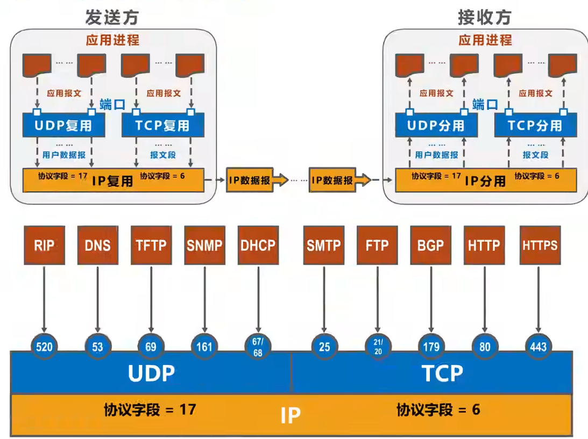
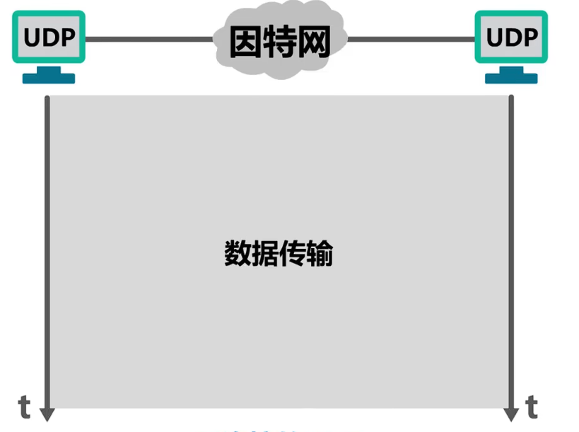
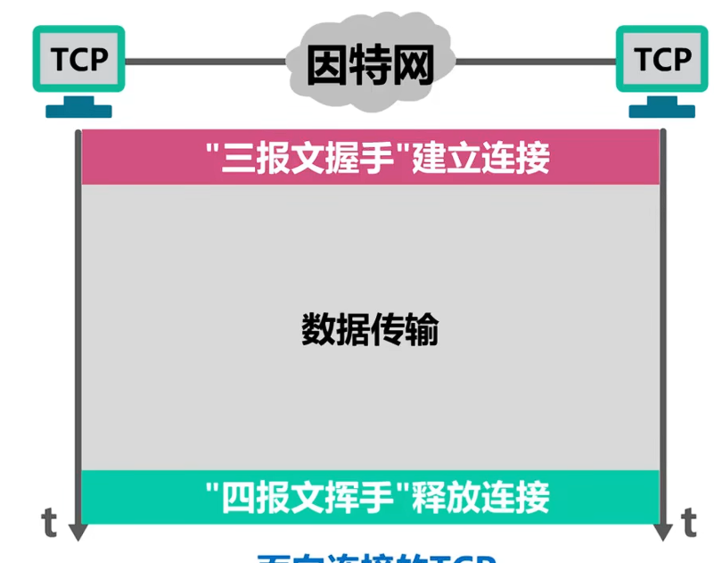
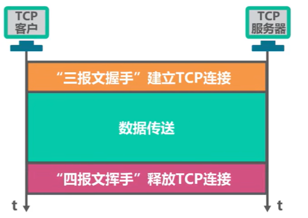

## 5.1 运输层概述

​	运输层是计算机网络体系结构中的关键一层，位于应用层和网络层之间，负责为不同主机上的应用进程提供逻辑通信服务。运输层依托网络层提供的**主机到主机**的通信（IP地址），将其扩展为**进程到进程**的通信，通过端口号标识不同的应用程序。

## 5.2 运输层端口号、复用与分用的概念。

​	运行在计算机上的进程使用进程**标识符PID来标志**。而因特网上的计算机并不是使用统一的操作系统，不同的操作系统（Windowns、Liunx、MaxOS）又使用不同格式的进程标识符。

​	为了使运行不同操作系统的计算机的应用进程之间能够进行网络通信，就必须使用**统一的方法对TCP/IP体系的应用进程进行标识**

​	TCP/IP体系的运输层使用**端口号**来区分应用层的不同进程。**端口号使用16比特标识，取值范围0~65535**:

1. 熟知端口号：0~1023 ，IANA把这些端口号指派给了TCP/IP体系中最重要的一些应用协议，例如：**FTP使用21/20， HTTP使用80，DNS使用53**
2. 登记端口号：**1024~49151 **
3. 短暂端口号：**49152~65535**,留给客户进程选择暂时使用。

​	**端口号只具有本地意义。即端口号只是为了标识本计算机应用层中的各进程**，在因特网中，不**同计算机中的相同端口号是没有联系的。**

#### 5.2.1 发送方的复用和接收方的分用

**复用**：发送方有多个应用进程需要发送数据时，运输层将这些进程的数据都使用同一个运输层协议（TCP或UDP）封装后交给网络层发送。

**举例**：用户同时使用浏览器访问网页（使用端口80）、下载文件（使用端口21）、收发邮件（使用端口25/110），运输层将这些不同进程的数据复用到同一个IP地址上进行发送。

---

**分用**：接收方运输层收到网络层交付的数据后，根据报文首部中的**目的端口号**，将数据正确地分发给对应的应用进程。

**举例**：服务器同时收到来自网络层的数据，运输层根据端口号判断：端口80的数据交给Web服务器进程，端口53的数据交给DNS服务器进程，端口22的数据交给SSH服务进程。

## 5.3 UDP和TCP

​	**UDP和TCP是TCP/IP体系结构运输层中的两个重要协议**

​	UDP（User Datagram Protocol） 意为：用户数据报协议。**使用UDP协议的双方可以随时发送数据**。UDP是无连接的，不可靠的服务。UDP支持单播、多播和广播三种通信方式。UDP是面向应用报文的。

​	TCP（Transmission Control Protocol）意为：传输控制协议。而使用TCP协议的通信双法，在传输之前，必须使用**三报文握手**来建立连接。**连接成功后，才能进行数据传输**，传输结束后，必须使用**四报文挥手**来释放TCP连接。TCP是面向连接的

​	而TCP仅支持单播，TCP是面向字节流的。虽然IP协议向上提供的是无连接不可靠的传输服务，但TCP**向上提供面向连接可靠的传输服务**

​	

#### 5.3.1 TCP的流量控制

​	一般来说，我们总是希望数据传输得更快一些。但如果发送发把数据发送得过快，接收方就可能来不及接收，这就会造成数据的丢失。所谓**流量控制（flow control）就是让发送发的发送速率不要太快，要让接收方来得及接收**

​	

## 5.4 TCP的连接建立

​	TCP是面向连接的协议，它基于运输连接来传送TCP报文段。TCP运输连接的建立和释放是每一次面向连接的通信中比不可少的过程，TCP运输连接有以下三个阶段：

1. 建立TCP连接
2. 数据传送
3. 释放TCP连接

