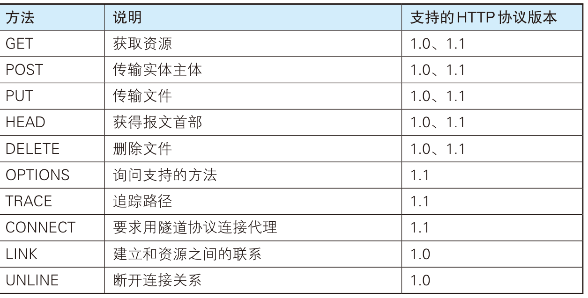

## 6.1 HTTP协议概述

​	HTTP协议基于TCP协议建立，HTTP位于应用层，而TCP位于传输层，提供可靠的字节流服务。

​	字节流服务是指，为了方便传输，将大块数据分割成以报文段为单位的数据包进行管理。


#### 6.1.1 HTTP协议用于客户端和服务器端之间的通信

​	HTTP协议用于客户端和服务器之间的通信

​	**请求访问文本或图像等资源为客户端，而提供资源响应的一端称为服务器端。在两台计算机之间使用HTTP协议通信时，在一条通信线路上必定有一段是客户端，另一端是服务器端。**

​	HTTP协议能够区分哪端是客户端，哪端是服务器端


#### 6.1.2 通过请求和响应的交换达成通信

​	HTTP协议规定，**请求从客户端发出，最后服务器端响应请求并返回**。如

```
客户端发起请求：
GET / HTTP/1.1
Host: hackr.jp

服务器端发起响应：
HTTP/1.1 200 OK
Date: Tue, 10 Jul 2012 06:50:15 GMT
.....
```

​	下面是从客户端发送给某个HTTP服务器端的请求报文中的内容。

```
GET /index.htm HTTP/1.1
Host: hackr.jp
```

​	请求的起始行开头的GET表示访问服务器的类型，称为方法（method）。随后的字符串`/index.htm`指明了请求访问的资源对象，也叫做请求`URI(request-URI)`。最后的HTTP/1.1，即HTTP的版本好。

​	这段请求内容的意思是：请求访问某台HTTP服务器上的`/index.htm`资源。

​	请求报文是由请求方法、请求URI、协议版本、可选的请求首部字段和内容实体构成。

​	**请求之后服务器端会发送响应报文给客户端。**

```
HTTP/1.1 200 OK
Date: Tue, 10 Jul 2012 06:50:15 GMT
Content-Length:362
Content-Type:text/html

<html>
...
```

​	起始行的开头HTTP/1.1表示服务器对应的HTTP版本。紧挨着的200 OK表示请求的处理结果的状态码（status code）和原因短语（reason-phrase）。下一行显示了创建响应的日期时间，是首部字段内的一个属性。

​	接着以一空行分割，之后的内容称为资源实体的主题（entitiy body）

​	


#### 6.1.3 告知服务器意图的HTTP方法

​	**GET :获取资源**

​	GET方法用来请求访问已被URI识别的资源。指定的资源经过服务器端解析后返回响应内容。

​	使用GET方法的请求-响应的例子

```
请求：
GET /index.html HTTP/1.1
Host:www.hackr.jp

响应：
返回index.html的页面资源
```


​	**POST: 传输实体主体**

​	**POST方法用来传输实体的主体，用于向服务器提交数据**，通常用于创建、更新资源或执行操作。它可能改变服务器状态。

```
请求：
POST /submit.cgi HTTP/1.1
Host:www.hackr.jp
Content-Length:1560 (1560字节的数据)
响应：
返回submit.cgi接收数据的处理结构
```

​	其他方法




#### 6.1.4 URI和URL

​	**URL (Uniform Resource Locator , 统一资源定位符)。URL是使用Web浏览器访问Web页面时需要输入的网页地址**。

​	如`http://hackr.jp`就是URL

​	而URI用字符串标识某一互联网资源，URL表示资源的地址。URL是URI的子集。URI是更广泛的定义。日常使用URL比较多


#### 6.1.5 使用Cookie的状态管理

​	HTTP是无状态协议，它不对之前发生过的请求和响应的状态进行管理。也就是说，无法根据之前的状态进行本次的请求处理。

​	 假设要求登录认证的Web页面本身无法进行状态的管理，那么每次跳转新页面就要再次登录，就是要在每次请求报文中附加参数来管理登录状态。

​	`Cookie`技术通过在请求和响应报文中写入`Cookie`信息来控制客户端的状态。

​	`Cookie`会根据服务器端发送的响应报文的一个叫`Set-Cookie`的首部字段信息，通知客户端保存`Cookie`。下次当客户端再往该服务器发送请求时，客户端会自动在请求报文中加入`Cookie`指后发送出去。

​	服务器端发现客户端发送过来的`Cookie`后，会去检查究竟是从哪个客户端发来的连接请求。

​	HTTP请求报文和响应报文的内容如下：

1. **请求报文 （没有Cookie信息的状态）**

```
GET /reader/ HTTP1.1
Host: hackr.jp
* 首部字段内没有Cookie的相关信息
```

2. **响应报文（服务器端生成Cookie信息）**

```
HTTP/1.1 200 OK
.....
<Set-Cookie: sid =...... ; path=/; expries =Web....>
```

3. 客户端再次请求报文（自动发送保存着的Cookie信息）

```
GET /image /HTTP/1.1
Host: hackr.jp
Cookkie :sid =.....
```

