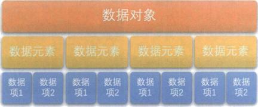
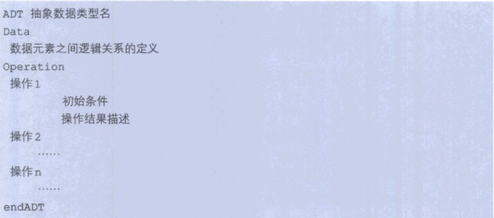

***数据结构：是互相之间存在一种或多种特定关系的数据元素的集合*。**

## 1.1 数据结构起源

​	***数据结构是一门研究非数值计算的程序设计问题的操作对象，以及它们之间的关系和操作等相关问题的学科***

​	1968年，美国的高德纳（Donald E. Knuth）教授在其所写的《计算机程序设计艺术》第一卷《基本算法》中，较系统地阐述了数据的逻辑结构和存储结构及其操作，开创了数据结构的课程体系。同年，"数据结构"作为一门独立的课程，在计算机科学的学位课程中开始出现。

## 1.2 基本概念与术语

说到数据结构，得先来谈谈什么是数据

#### 1.2.1 数据

​	**数据：是描述客观事物的符号，是计算机中可以操作的对象，是能被计算机识别，并输入给计算机处理的符号集合**。数据不仅仅包括整型、实型等数值类型，还包括字符以及声音、图像、视频等非数值类型。

数据，必须具备两个前提：

- 可以输入到计算机中。
- 能被计算机程序处理。

#### 1.2.2 数据元素

​	数据元素：**是组成数据的、有一定意义的基本单位，在计算机中通常作为整体处理，也被称为记录**。

​	比如，在动物这个大类中，猪鸭牛羊等就可以看做动物的数据元素。

#### 1.2.3 数据项

​	数据项：**一个数据元素可以由若干个数据项组成**。

​	比如人这样的数据元素，可以有眼睛、耳朵、鼻子、嘴巴、手这些数据项。**数据项是数据不可分割最小单位**。

#### 1.2.4 数据对象

​	数据对象：**是性质相同的数据元素的集合，是数据的子集**。

#### 1.2.5 数据结构

​	不同数据元素之间不是独立的，而是存在特定的关系，我们将这种关系称为结构。

​	***数据结构：是相互之间存在一种或多种特定关系的数据元素的集合。***

## 1.3 逻辑结构与物理结构

​	按照视点的不同，把数据结构分为逻辑结构和物理结构。

#### 1.3.1 逻辑结构

​	逻辑结构：**是指数据对象中数据元素之间的相互关系**。也是今后我们需要关注的问题。**逻辑结构分为以下四种**：

 1. 集合结构

    集合结构中数据元素除了同属于一个集合外，它们之间没有其他关系。

 2. 线性结构

    线性结构中的数据元素之间是一对一的关系。

 3. 树形结构

    树形结构中的数据元素存在一种一对多的层次关系。

 4. 图形结构

    图形结构的数据元素是多对多的关系。

#### 1.3.2 物理结构

​	物理结构：是指数据的逻辑结构在计算机中存储的形式。

 1. 顺序存储结构

    是把数据元素存放在地址连续的存储单元里，其数据见的逻辑关系和物理关系是一致的。

 2. 链式存储结构

    ​	是把数据元素存放在任意的存储单元里，这种存储单元是可以连续的，也可以是不连续的。数据元素的存储关系并不能反映其逻辑关系，因此需要用一个指针存放数据元素的地址。

逻辑结构是面向问题的，而物理结构就是面向计算机的，其基本的目标就是将数据及其逻辑关系存储到计算机的内存中。

## 1.4 数据类型

​	数据类型：**是指一组性质相同的值的集合以及定义在此集合上的一些操作总称**。

#### 1.4.1 数据类型定义

​	数据类型是按照值的不同进行划分。在高级语言中，每个变量、常量和表达式都有各自的取值范围。类型就用来说明变量或表达式的取值范围所能进行的操作。

​	在C语言中，数据类型可以分为两类：

 1. 基础类型：

    是不可以再分解的基本类型，如整型、实型、字符型等。

 2. 结构类型：

    由若干个类型组合而成，是可以再分解的。例如整型数组。

#### 1.4.2 抽象数据类型

​	对已有的数据类型进行抽象，就有了抽象数据类型。抽象是指抽取出事物具有的普遍性的本质。

​	**抽象数据类型**（*Abstract Data Type，ADT*）：一个数学模型及定义在该模型上的一组操作。下面是描述抽象数据类型的标准格式：

