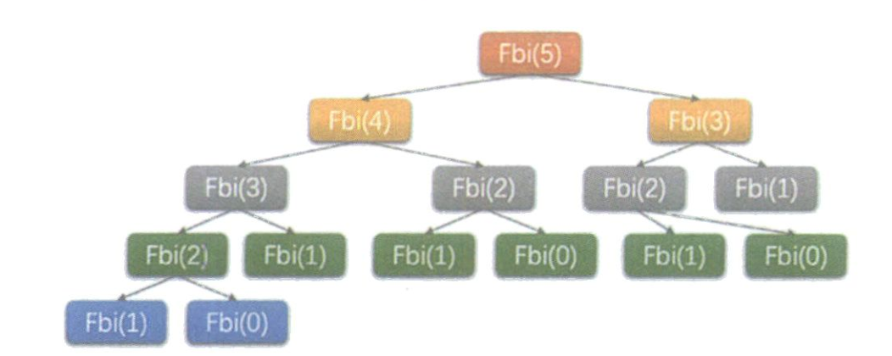
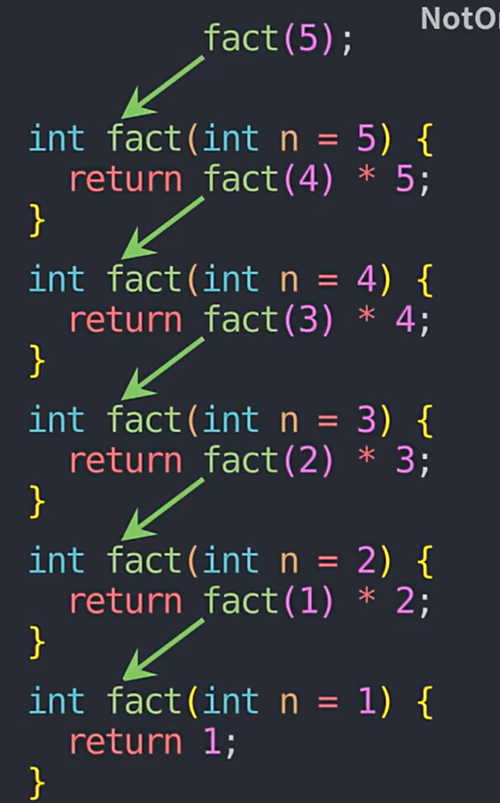
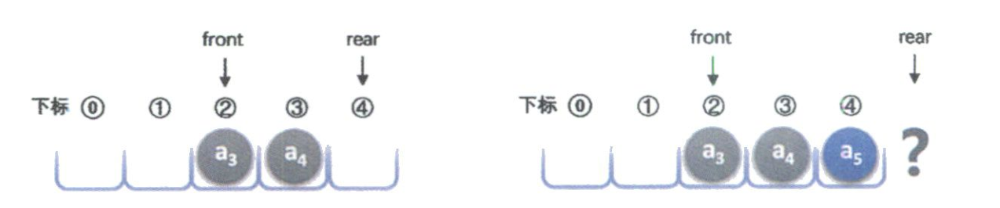
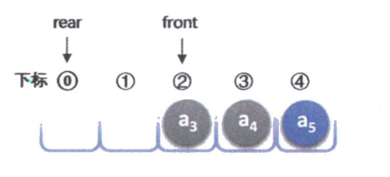
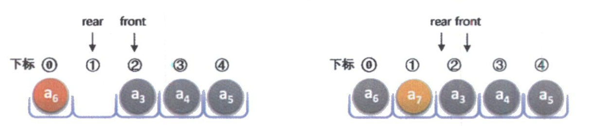
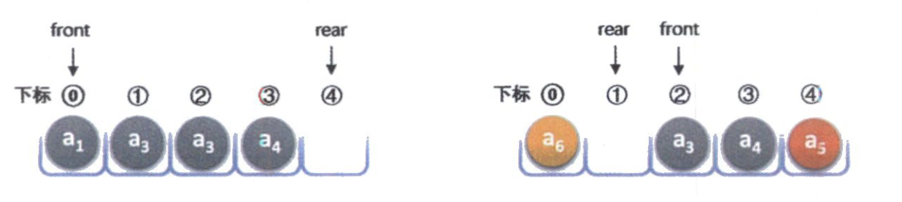

	栈和队列都是特殊的线性表。线性表、栈和队列三者中的元素以及元素之间的逻辑关系完全相同，在操作上的差别是：线性表的插入和删除步收限制、而栈只能在栈顶插入和删除，队列只能在队尾插入，队头删除。


## 4.1 栈

​	栈（stack）是限定仅在表尾进行插入或删除操作的线性表。因此，对栈来说，**表尾端具有特殊含义，成为栈顶（top）**，相应的，**表头成为栈底。**

​	栈顶的位置是动态的，用于标记当前栈顶位置的变量称为栈顶指示器（或栈顶指针）。根据栈的定义，每次入栈的元素都放在元栈顶元素之前而称为新的栈顶元素。每次出栈的都是栈顶元素，这样，最后进入栈的元素总是最先出栈，因此，栈是**后进先出**或是**先进后出**的线性表


### 4.1.1 栈的抽象数据结构

```c
ADT 栈(Stack)

Data
    栈的数据集合可以表示为{a0,a1,a2....An-1},每个元素的数据类型均为DataType
    
Operation
    StackInitiate(*S):初始化栈
    StackNotEmpty(S):栈S非空返回1，否则返回0
    StackPush(*S,x):在栈S的栈顶插入元素x
    StackPop(*S,*d):把栈s的栈顶元素删除并返回给d。若出栈成功，则返回1，反之返回0
    StackTop(S,*d): 把栈S的栈顶元素由d带回。
    StakcDestory(*S):销毁栈S
endADT
```


### 4.1.2 栈的顺序表示和实现

#### 1.**顺序栈的存储结构**

​	顺序表和顺序栈的表示是相同的，唯一不同的是栈只能在栈顶进行操作。`stack`表示顺序栈存储元素的数组，`MAXSTACKSIZE`表示顺序栈数组的最大元素个数，而`top`表示顺序栈数组`stack`的当前栈顶位置。

​	由于顺序表是数组实现，所以需额外注意栈顶指示器，当栈顶指示器为0时，该栈没有元素。当栈里有元素时，栈顶指示器实际指向栈顶的下一个位置。如，一个栈有5个元素，栈顶为stakc[4]，那么栈顶指示器为5。

​	下面是顺序栈的结构定义:

```c
typedef struct{
    DataType stack[MAXSTACKSIZE];
    int top;//栈顶指示器
}SeqStack;
```

#### 2. 顺序栈的初始化

​	由于顺序栈的储存结构是是数组，所以我们初始化时只需要把栈顶指示器初始化为0即可

```c
//初始化栈
Status StakcInitiate(SeqStack *S){
	S->top=0; //初始化，栈为空
	return OK;
}
```

#### 3.判断顺序栈是否为空

​	当栈顶指示器为0时，代表栈空，反正不空

```c
//如果栈非空，返回1，反之返回0
Status StackNotEmpty(SeqStack S){
	if(S.top==0){
		return FALSE;
	}else{
		return TRUE;
	}
}
```

#### 4.返回顺序栈的长度

​	栈顶指示器刚好能代表栈的长度。

```c
int StackLength(SeqStack s){
	if(s.top==0){
		return 0;
	}
	
	return s.top;
}
```

#### 5.顺序栈的入栈操作

​	栈只允许在栈顶插入元素，所以操作比较简单。我们规定，**`top`栈顶指示器指向下一个可用位置。方便入栈**。

1. 检查栈是否为已满，如果已满返回错误值
2. 在不满的情况下，向栈顶插入元素。然后让指示器+1.
3. 由于栈顶指示器的值，对于数组下标来说，是表示为栈顶的下一个元素。所以能直接写如下代码：

```c
Status StackPush(SeqStack *S,Element x){
	if(S->top==MAXSTACKSIZE)
		return ERROR;
	S->stack[S->top]=x;
	S->top++;
	return OK;
}
```

#### 6.顺序栈的出栈操作

​	同样的，栈只允许在栈顶出栈，但始终不变的是：**栈顶指示器对于数组实现来说它代表栈顶的下一个元素**。所以，它的实现步骤是

1. 检查栈是否为空，如果为空，返回错误值。
2. 在不空的情况下，弹出栈顶。由于栈顶指示器是指向栈顶的下一个元素，所以先要--，在把栈顶元素记录

```c
Status Stackpop(SeqStack *S, Element *d){
	//如果栈为空，返回错误
	if(!StackNotEmpty(*S))
		return ERROR;
	S->top--;
	*d=S->stack[S->top]; //获取栈顶元素;
	return OK;
}
```

#### 7.顺序栈获取元素

​	栈获取元素和出栈操作差不多，不过，不能把栈顶指示器做改变，所以实现如下

```c
Status StackGetElem(SeqStack S,Element *e){
    //当栈为空时，返回错误
    if(!StackNotEmpty(S))
        return ERROR;
    *e = S->stack[S->top-1];
}
```


### 4.1.3 链栈

​	链栈就是链式储存结构的堆栈。**以头指针为栈顶，在头指针处插入或删除**。它的数据储存结构与链表类似。**链栈的出栈和入栈时间复杂度都为O(n)**

#### 1. 链栈的储存结构

​	我们一般用头指针来代表一个栈，同时操作的也是头指针，头指针为栈顶。为了方便操作，我们使用typedef定义一个头指针类型

```c
typedef int DataType;
typedef struct SNode{
	DataType data;
	struct SNode * next; // 指针域，指向下一个结点的指针
}SNode,*LinkStack;
```

​	

#### 2.链栈的一般操作

​	**链栈的初始化操作就是构造一个空栈，因为没必要设置头节点，**所以直接将栈顶指针置为空既可。

​	一般操作包括：初始化、非空判断、获取链栈的长度

```c
//初始化链栈
Status InitStack(LinkStack *S){
	*S=NULL; //将头指针置空
	return OK;
}

//非空返回true，空返回false
bool StackNotEmpty(LinkStack S){
	return S!=NULL;
}

//返回链栈长度
int StackLength(LinkStack S){
	int Length = 0 ;
	if(!StackNotEmpty(S)){
		return Length;
	}
	
	while(S!=NULL){
		S=S->next;
		Length++;
	}
	return Length;
}
```


#### 3.链栈的入栈

​	链式储存结构的栈，它的入栈操作其实就是在第一个位置插入结点，操作和链表插入类似。下面是步骤

1. 检查错误条件，如栈已满（链式储存结构不限制元素个数），或指针为空。
2. 创建新结点，检查是否分配内存成功，保存数据。
3. 让新节点成为栈顶（把它插入在栈顶的前面）
4. 让头结点next与指向新结点。

```c
//入栈,在链表中，将头指针视为栈顶
Status Push(LinkStack *S,DataType x){
	LinkStack newS =(LinkStack)malloc(sizeof(SNode));
	if(newS==NULL)
		return ERROR;
	newS->data=x; //存储数据
	newS->next=*S; //新结点 next 指向旧栈顶
	*S=newS;// 更新栈顶指针
	return OK;
}
```

​	

#### 4.链栈的出栈

​	链栈的出栈也非常简单，只需让头结点的next与指向栈顶的下一个元素即可，但需注意要使用变量保存栈顶元素，因为还没会释放它的内存，下面是算法步骤：

1. 检查错误条件，如头指针为空、头结点为空、栈为空
2. 获取栈顶结点，保存栈顶结点的值。
3. 更新栈顶指针，跳过要删除的结点
4. 释放原结点
5. 返回OK

```c
//出栈，同样的是在头指针处删除
Status Pop(LinkStack *S,DataType *x){
	if(!StackNotEmpty(*S)){
		return ERROR;
	}
	*x = (*S)->data;
	LinkStack p = *S;//保存当前栈顶
	*S =(*S)->next; //移动栈顶指针
	free(p);
	return OK;
}
```


#### 5.获取栈顶元素

```c
//获取栈顶元素
DataType Top(LinkStack S){
	if(!StackNotEmpty(S)){
		return ERROR;
	}
	
	return S->data;
}
```


## 4.2 堆栈应用


### 4.2.1 括号匹配问题

​	假设一个算术表达式中包含**圆括号、方括号**两种类型的括号，编写一个**判别表达式中括号是否正确配对**的函数，并设计一个测试主函数。下面是算法步骤：

1. 初始化空栈S
2. 设置一标记性变量flag，用来标记匹配结果以控制循环及返回结果，1表示正确匹配，0表示匹配错误，flag初值为1
3. 查找表达式，依次读入字符ch，如果表达式没有查找完毕且`flag`非0，则循环执行以下操作
   - 若ch是左括号`(或[`,则将其压入栈；
   - 若ch是右括号`)或]`，根据当且栈顶元素的值分情况考虑。若栈非空且栈顶元素是与ch对应的左括号，则正确匹配。否则错误匹配，flag置为0
4. 退出循环后，如果栈空且flag值为1，则匹配成功，返回true，否则返回false。

```c

Status Matching(){
	//建立一个空栈
	LinkStack s;
	InitStack(&s);
	char ch;
	cin>>ch; //读入第一个字符
	bool flag =1; //标志匹配结果以及控制循环
	DataType x; //用于接受被出栈的元素
	//"表达式以#结尾"
	while(ch!='#' && flag){
		switch (ch) {
		case '(':
		case '[':
			Push(&s,ch);  //入栈
			break;
		case ')':
			//若栈非空，且栈顶是左括号，则出栈
			if(StackNotEmpty(s) && Top(s) == '('){
				Pop(&s,&x);
			}else{
				flag=0; //匹配失败。
			}
			break;
		case ']':
			if(StackNotEmpty(s) && Top(s) == '['){
				Pop(&s,&x);
			}else{
				flag=0; //匹配失败。
			}
			break;
		}
		
		cin>>ch;
	}
	// flag不为false且，栈已空
	if(flag && !StackNotEmpty(s))
		return true;
	else 
		return false;
}
```


### 4.2.2 表达式求值

​	任何一个表达式都是由操作数（`operand`）、运算符（`operator`）和界限符组成。基本界限符有左右括号和表达式结束符等。再此仅讨论简单算术表达式的求值问题。这种表达式是包含加减乘除4种运算符。

​	下面把运算符和界限符统称为算符。

​	简单四则运算遵循下面的规则：

1. 先乘除，后加减
2. 从左算到右
3. 先括号内，后括号外。

​	为了便于实现，假设每个表达式均以`#`开始，以`#`结束。 可以用两个工作栈实现表达式求值算法，一个称作`OPTR`，用作寄存运算符；另一个称作`OPND`，用以寄存操作数或运算结果。

​	【算法步骤】

1. 初始化`OPTR`栈和`OPND`栈，将表达式起始符`#`压入栈`OPTR`。
2. 查找表达式，读入第一个字符ch，如果表达式没有查找完毕至`#`或`OPTR`的栈顶元素不为#时，循环执行以下操作。
   1. 若ch不是运算符，则压入`OPND`栈，读入下一个字符ch。
   2. 若ch是运算符，根据`OPTR`的栈顶元素和ch的优先级比较结果，做不同的处理:
      1. 若小于，则将`ch`压入`OPTR`栈，读入下一字符；
      2. 若大于，则弹出`OPTR`栈顶的运算符，从`OPND`栈弹出两个数，进行相应运算，将结果压入`OPND`栈
      3. 若等于，则`OPTR`的栈顶元素是`(`且ch是`)`，这是弹出`OPTR`栈顶的`(`，相当于括号匹配成功，然后读入下一字符ch
3. `OPND`栈顶元素即表达式求值结果，返回此元素。

```cpp
char EvaluateExpression(){
	LinkStack OPND; //操作数栈
	LinkStack OPTR; //运算符栈 
	char ch;
	InitStack(&OPND);
	InitStack(&OPTR);
	Push(&OPTR,'#'); //将表达式起始符压入栈
	cin>>ch;
	while(ch!='#' || Top(OPTR)!='#'){
		if(!In(ch)){
			// ch不是运算符则如OPND栈
			Push(&OPND,ch);
			cin>>ch; //继续输入
		}else{
			switch (Precede(Top(OPTR),ch)) { //比较优先级
			case '<': //栈顶运算符小于ch，入栈。
				Push(&OPTR,ch);
				break;
			case '>': //栈顶运算符大于ch，出栈计算。
				DataType thete; //存储出栈运算符
				Pop(&OPTR,&thete); 
				DataType a,b; //存储操作数
				Pop(&OPND,&b); Pop(&OPND,&a);
				Push(&OPND,Operate(a,thete,b));
				break;
			case '=':
				DataType x;
				Pop(&OPTR,&x); //出栈。
				cin>>ch;
				break;
			}
		}
	}
	
	return Top(OPND);
}
```

​		其`In()`函数用来判断该字符是否为运算符。`Precede()`函数用来反应两个运算符的优先级，`Opreate()`用来计算两个操作数。


### 4.2.3 递归

​	假设兔子在出生两个月后，就有繁殖能力，一对兔子每月能生出一对兔子来，假设所有兔子都不死，那么一年以后可以繁殖多少对兔子？

​	第一个月，兔子每月繁殖能力，所以还是一堆，第二个月，生下一对兔子共有两对。三个月后，老兔子又生下一对，因为小兔子还每月繁殖能力，所以一共是三对。依次类推可以得如下列表

|  1   | 2    | 3    | 4    | 5    | 6    | 7    | 8    | 9    | 10   | 11   | 12   | 13   |
| :--: | ---- | ---- | ---- | ---- | ---- | ---- | ---- | ---- | ---- | ---- | ---- | ---- |
|  1   | 2    | 3    | 5    | 8    | 13   | 21   | 34   | 55   | 89   | 144  | 233  | 377  |

​	从第3个月开始，这个数列有一个规律：前面相邻两项之和，构成后一项。可以看出，这是一个典型的斐波那契数列，斐波那契数列的定义是：**第1项为0，第2项为1，从第3项开始，每一项都是前两项之和**。

假设我们需要打印出前40位的斐波那契数列。常规的迭代方法如下：

```c
#include<stdio.h>
int main() {
	int a[40];
	a[0]=0;
	a[1]=1;
	printf("%d ",a[0]);
	printf("%d ",a[1]);
	
	for(int i=2;i<40;i++){
		a[i]=a[i-1]+a[i-2];
		printf("%d ",a[i]);
	}
	
	return 0;
/*
输出：
	0 1 1 2 3 5 8 13 21 34 55 89 144 233 377 610 987 1597 2584 4181 6765 10946 17711 28657 46368 75025 121393 196418 317811 514229 832040 1346269 2178309 3524578 5702887 9227465 14930352 24157817 39088169 63245986
*/
```

​	下面是递归的实现代码：

```c
int Fib(int n){
	if(n<2)
		return n==0?0:1;
	return Fib(n-1)+Fib(n-2);
}
```

​	斐波那契数列的函数是：
$$
F(n) = \begin{cases}
0 & 当n=0 \\
1 & 当n=1 \\
F(n-1)+F(n-2) & 当n>=2

\end{cases}
$$
​	

​	假设n等于5时，执行过程如下：



​	

​	递归简单来说，就是自己调用自己，我们以阶乘为例，阶乘$5!=5*4*3*2*1$。

​	
$$
F(n) = \begin{cases}
F(n-1)*n & 当n>1 \\
1& 当n=1
\end{cases}
$$
​	可以拆解为如下几个函数调用
$$
f(5) = f(4)*5 \\
f(4) = f(3)*4 \\
f(3) = f(2)*3 \\
f(2) = f(1)*2 \\
	f(1)=1
$$
​	写成代码的形式为：

```c
int Fact(int n){
	if(n==1)
		return 1;
	return Fact(n-1)*n;
}
```

​	当n=5时，代码一层层递进，直到n=1时，函数直接返回1，代码重重递归，计算$1*2*3*4*5$，从而计算出结果。




## 4.3 队列

​	**队列（queue）是只允许在一端进行插入操作，而在另一段进行删除操作的线性表**。队列是一种先进先出（*First in First Out*）的线性表，简称FIFO。允许插入的一端称为队尾，允许删除的一端称为队头。


### 4.3.1 队列的抽象数据类型

​	同样是线性表，队列也有类似线性表的各种操作，不同的是插入数据智能在队尾进行，删除数据只能在队头进行。

```c
ADT 队列(Queue)
Data
	同线性表。元素具有相同的类型，相邻元素具有前驱和后继关系。
Operation
	InitQueue(*Q);初始化操作，建立一个空队列
	DestoryQueue(*Q): 若队列存在，则销毁它。
    ClearQueue(*Q):将队列Q清空
    QueueEmpty(Q):若队列为空，返回true，否则返回false。
    GetHead(Q,*e):返回队头元素
    EnQueue(*Q,e): 插入新元素e到队列中并成为队尾元素
    DeQueue(*Q,*e): 删除队列队头元素，并用e返回其值。
    QueueLength(Q)：返回队列的元素个数。
endADT
```


### 4.3.2 循环队列

​	普通顺序结构的队列，通常用下标为0表示队头，而入队则直接在队尾追加一个元素，对于数组来说没有问题，**但出队时，我们要依次把队头的后面元素向前移动一个位置，这样的时间复杂度是$O(n)$。**

​	而循环队列使用两个指示器维护队列，front指示器表示队头，rear指示器指向队尾元素的下一个元素。这种维护方式优化了出队的性能。当队头出队时，**只需移动front指示器即可，而不用移动数组里面的元素**。

​	这里有一个小问题，假设有一个大小为5的循环队列，前面已经出队了两个元素，腾出了两个空间，但我队尾要插入元素，已经满了，那么此时rear就指向数组大小之外的空间了。这种问题称为“假溢出”，后面已经满了，但前面还有位置



​	解决假溢出的办法就是后面满了，就再从头开始，也就是头尾相接的循环，**我们把队列的这种头尾相接的顺序储存结构称为循环队列**

​	当队尾已经溢出后，我们把rear指示器改为指向下标为0的位置。



​	接着入队$a_6$, rear指针指向下标为1处，**再入队$a_7$，则rear指针就与front指针重合**。



​	那么问题来了，**空队列时，rear和front指针重合，队列满时rear和front指针也重合**。那么如何判断此时的队列是空还是满？

为了解决这个问题，我们设定：

​	**当队列空时，条件就是front==rear**。

​	**当队列满时，我们修改其条件，保留一个空间元素，也就是说。队列满时，数组中还有一个空闲单元。左下图所示，我们就任务队列已经满了**



​	由于rear可能比front大，也可能比front小，所以尽管它们只相差一个位置时就是满的情况，但也可能是相差整整一圈。所以若队列的最大尺寸为QueueSize。==**那么队列满的条件是（rear+1）%QueueSize =fron **==。因为是循环队列，所以需要对它取模。

​	和同样的计算队列长度的公式为：

​	$(rear-front + QueueSize)\bmod  QueueSize$

​	下面是循环队列的**存储结构和初始化代码**

```c
typedef struct{
	Element data[MAXSIZE];
	int front; //头指针
	int rear; //尾指针，若队列不空，指向队列尾元素的下一个位置。
}SqQueue;

Status InitQueue(SqQueue *Q){
	Q->front=0;
	Q->rear=0;
	return OK;
}
```

​	**求队列的长度**

```c
//计算队列长度
int QueueLength(SqQueue Q){
	return (Q.rear-Q.front+MAXSIZE)%MAXSIZE;
}
```


#### 1. 循环队列入队

​	入队只能在队尾插入，要先判断队列是否为满。队尾指示器指向的是队尾的下一个元素，所以插入的时候直接插入，再把队尾指针想后移动一个位置。

​	而在向后移动一个位置的时候，我们注意要使用这样的表达式：$(Q->rear+1) \bmod MAXSIZE$; 这样做的好处是把尾指针的范围划到了$0到MAXSIZE-1$之间。

​	比如，当rear=5 ,MAXSIZE=6时。 (5+1) %6 = 6 %6 =0。尾指针从5循环到0，实现了循环的效果。代码如下：

```c
Status EnQueue(SqQueue *Q ,Element e){
	//队列已满
	if( (Q->rear+1) % MAXSIZE == Q->front)
		return ERROR;
	Q->data[Q->rear] = e;
	Q->rear = (Q->rear+1) %MAXSIZE;
	return OK;
}
```


#### 2.循环队列出队

​	与入队类似，只不过要先判断它是否为空，如果为空，返回错误。

```c
Status DeQueue(SqQueue *Q,Element *e){
	if(Q->front==Q->rear)
		return ERROR;
	
	*e = Q->data[Q->front];
	
	Q->front = (Q->front+1) %MAXSIZE;
}
```

​	详细解读这个表达式：$(Q->front+1) \bmod MAXSIZE$。让front+1，是因为队头已经出队，需要让下一个元素成为队头。为什么要取余MAXSIZE。它限定了值的范围，只能在0到MAXSIZE-1之间，做到了让front指针循环的效果。


### 4.3.3 队列的链式储存结构及实现

​	**队列的链式储存结构，其实就是线性表的单链表，只不过它只能尾进头出。我们把它简称为链队列**。为了操作上的方便，我们将队头指针指向链队列的头结点。而队尾指针指向终端结点。空队列时，front和r    ear都指向头指针。

​	**对于头指针，它始终都指向头节点**。

​	链队列的结构为：

```c
//结构结点
typedef sturct QNode{
    Element data;
    struct QNode *next;
}QNode,*QueuePtr;

typedef struct{
    QueuePtr front,rear; //队头、队尾指针
}LinkQueue;
```

​	**链队列的初始化。使队头队尾指针指向同一个结点**，以及判断链队列是否为空

```c
//构造一个空队列
Status InitQueue(LinkQueue *LQ){
	//分配内存，队头、队尾指向同一结点
	LQ->front = LQ->rear = (QueuePtr)malloc(sizeof(QNode));
	if(!LQ->front)
		exit(EOVERFLOW);
	LQ->front->next =NULL; //头结点的next赋空值。
}

//判断队列是否为空
Status QueueEmpty(LinkQueue LQ){
	if(LQ.front == LQ.rear)
		return TRUE;
	else
		return FALSE;
}
```


#### 1. 链队列的入队

​	前面说过，链队列等同于单链表，只不过只允许队头删除和队尾插入。而队尾插入就叫入队。下面是它的算法步骤：

1. 创建一个新结点，分配空间。
2. 把数据给新结点
3. 让新结点的next域置空
4. 让尾指针的next域指向新结点
5. 更新尾指针。

```c
//入队，等同于在单链表的最后一个结点插入元素
Status EnQueue(LinkQueue *LQ, Element e){
	QueuePtr newS = (QueuePtr)malloc(sizeof(QNode));
	newS->data = e;
	newS->next = NULL;
	LQ->rear->next = newS; //尾指针的next域指向新元素
	LQ->rear = newS;//更新尾指针
	
	return OK;
}

```


#### 2 链队列的出队

​	出队即删除首元结点，和单链表删除操作相同，但需注意一点，如果队列只有一个元素，那么出队后需更新尾指针，使其变成空队状态，下面是算法步骤：

1. 检查队列是否为空，为空返回错误
2. 定义一个节点用来储存队头
3. 更新首元结点：将头结点的指针与指向首元结点的下一个元素
4. 判读队尾是否等于首元结点，如果是，则代表该队列只有一个元素，更新rear指针指向front头指针
5. 释放旧的首元结点。

```c
//出队，等同于在单链表删除首元结点
Status DeQueue(LinkQueue *LQ,Element *e){
	if(QueueEmpty(*LQ))
		return ERROR;
	QueuePtr firstNode = LQ->front->next; //获取首元结点
	*e = firstNode->data;
	LQ->front->next = firstNode->next; //更新首元结点
	//如果队头就是队尾（即只有一个元素的队列），则删除后将rear指向front指针（使其变为空标状态）
	if(LQ->rear == firstNode)
		LQ->rear = LQ->front;
	free(firstNode); //释放被废弃的首元结点。
	
	return OK;
}
```


