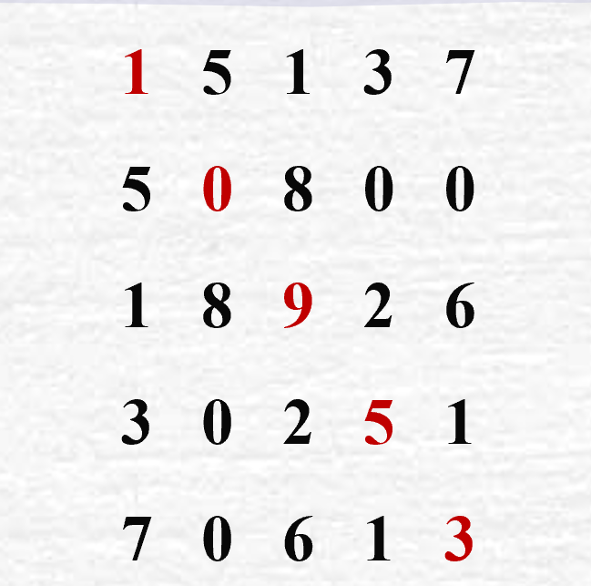

## 5.1 串的定义

​	串（String）是由零个或多个字符组成的有限序列，又叫字符串。

​	而在C语言中，字符串存储在char类型的数组中，**由于C语言用`\0`标记字符串的结束，而`\0`是空字符，为非打印字符，其ASCII码是0，所以其数组的容量必须比待存储字符的字符数多1**。如下：

```c
char str[6]="Hello";
```

​	错误使用方式：

```c
char str[5]="Hello";
```

​	看似数组能够存储这个字符串常量。但并没有给结束符留空间，所以访问的时候编译器不知道该字符串在什么时候结束，有可能会输出乱码。

​	下面解释一些常用的概念

​	**零个字符的串称为空串**，可以直接用两个双引号表示`""`。或者用希腊字母`∅`表示。

​	**空格串，是只包含空格的串**，它与空串不同，空格串是有内容有长度的，它的内容是空格。而空串不包含任何内容。

​	**主串中任意个数的连续字符组成的子序列称为该串的子串，相应的，包含子串的串称为主串**。

​	如`over,end,lie`可以认为是`lover,friend,believe`这些单词字符串的主串。


## 5.2 串的抽象数据类型

​	串的逻辑结构和线性表很相似，不同之处在于串针对的字符集，而线性表更关注的是单个元素的操作，如查找、插入或删除一个元素。**但串中更多是查找子串位置、得到指定位置子串、替换子串等操作**。

```c
ADT 串（String）
Data
    串中元素仅由一个元素组成，相邻元素具有前驱和后继关系
Operation
    StrAssign(T,*chars); 生成一个其值等于字符串常量chars的串T
    StrCopy(*T,S): 串S存在，由串S复制得串T
    ClearString(*S):串S存在，将串清空
    StringEmpty(S):若串S为空，返回true，否则返回false。
    StrLength(S): 返回串S的元素个数，即串的长度
	StrCompare(S,T):若S>T，返回值>0,若S==T，返回0，若S<T,返回值<0
    Concat(*T,S1,S2):用T返回由S1和S2连接而成的新串
    SubString(Sub,S,pos,len):串S存在，1<=pos<=StrLength(S),
							 且0<=length<=Strlength(S)-pos+1,用Sub返回
                             串S的第pos个字符起长度为len的子串
    Index(S,T,pos):串S和T存在，T是非空串，1<=pos<=StrLength(S)。
                   若主串S中存在和串T值相同的子串，则返回它在主串S中
                   第pos个字符之后第一次出现的位置，否则返回0
    Replace(S,T,V):串S、T和V存在，T是非空串，用V替换主串中出现的所有与T相等的不重叠子串。
    StrInsert(S,pos,T):串S和T存在，1<=pos<=Strlength(S)+1,在串S的第pos个字符之前插入串T。
    StrDelete(S,pos,len):串S存在，1<=pos<=StrLength(S)-len+1。从串中删除第pos个字符起长度为len的子串。
```

​	对于不同的高级语言，对串的基本操作都会有不同定义方法。但具体原理都是类似的。字符串操作还有一些扩展操作。如`ToLower`转小写、`ToUpper`转大写等等


## 5.3 串的存储结构

​	**串的顺序存储结构是用一组地址连续的存储单元来存储串中的字符序列**。也就是使用`char`类型的数组存储。这种存储方式叫做静态数组，也就是说它的大小是静态的，一但确定就不能改变。

​	所以我们一般使用动态数组来存储字符串，只在运行时确定数组的大小，当存储空间不够时再重新分配。如：

```c
#define MaxSize 20
char *str = (char*)malloc(sizeof(char)*MaxSize);
```

​	

​	同样的，串也有链式存储结构，和单链表类似，只不过存储的元素是字符，但每个结点只存储一个字符似乎有点浪费空间，所以我们可以根据需求，把每个结点存储的元素修改为字符数组，数组大小由具体实现来定。这种链称为块链。


## 5.4 串的实现

​	这里我们使用顺序存储结构中的动态数组来实现字符串。下面是它的存储结构

```c
typedef struct{
    char *data;
    int length;
    int maxsize;
}String
```

​	下面是它的一些常规操作：

```c
//初始化函数，确保不会出现野指针情况,必须调用
String * InitStr(String *T){
	if(T==NULL)
		return NULL;
	T->data=NULL;
	T->length=0;
	return T;
}


/*
当出现chars的长度大于字符串设置的最大长度限制时，
这里采用的是截断方法，也就是让chars最多把MaxSize-1
个字符复制给字符串T
*/
String * StrAssign(String *T, const char *chars){
	//假设参数为"Hello"
	//检查输入参数
	if(T == NULL || chars ==NULL)
	{
		return NULL;
	}
	
	//检查长度是否超过最大限制,这里src_len=5
	int src_len =  strlen(chars); //该函数不计算结束符。
	if(src_len>=MaxSize){
		T->length=MaxSize-1; //留一个位置给结束符，0~49
	}else{
		T->length = src_len; //设置串长度为5
	}
	
	
	T->data=(char*)malloc(sizeof(char)*MaxSize); //给data分配MaxSize大小的内存空间
	//检查是否正确分配空间
	if(T->data==NULL){
		return NULL;
	}
	
	//复制字符内容，从0走到4
	//或参数大于最大长度限制时，从0走到48，设置了49个字符
	for(int i=0;i<T->length;i++){
		T->data[i]=chars[i];
	}
	
	//再结尾处T->data[5]添加结束符，或设置最后T->data[49]最后一个字符为结束符
	T->data[T->length]='\0';
	return T;
} //生成一个其值等于字符串常量chars的串T


void ClearString(String *S){
	if(S==NULL){
		return;
	}
	free(S->data);
	S->length=0;
}//若串存在，将串清空。


bool StrEmpty(String S){
	if(S.length==0)
		return true;
	else
		return false;
} // 判断串是否为空


unsigned int StrLength(String S){
	if(S.data==NULL){
		return 0;
	}else
		return S.length;
} //返回串S的元素个数,即串的长度。

```


### 5.4.1 StrCopy 串复制

​	StrCopy函数用于将串2上的值复制到串1上，会覆盖串1原有的值。下面是该函数原型：

```c
String* StrCopy(String*T,String S); //串S存在，由串S复制得串T
```

​	具体实现：

```c
/*
当串S大于串T时，重新分配更多的空间
*/
String* StrCopy(String*T,String S){
	//参数检查
	if(T==NULL || S.data==NULL){
		return NULL;
	}
	
	int src_len = StrLength(S);  //获取串S的长度
	
	//当空间不够时，分配更多空间
	if(src_len > MaxSize-1){
		//保留旧指针以便空间分配失败时恢复
		char *old_data=T->data;
		//分配能够存储全部字符的空间，包括结束符
		char *new_data = (char*)malloc(sizeof(char)*src_len+1);
		if(!new_data)
		{
			//分配内存失败，保持原状
			T->data=old_data;
			return NULL;
		}
		
		T->data = new_data;
	}
	
	//如果T未初始化，分配默认大小空间
	if(!T->data){
		T->data =(char*)malloc(sizeof(char)*MaxSize);
	}
	
	//复制字符串
	for(int i=0;i< src_len;i++){
		T->data[i]=S.data[i];
	}
	//设置串T长度
	T->length=src_len;
	//手动设置结束符
	T->data[T->length]='\0';
	return T;
	
}//串S存在，由串S复制得串T
```

​	可以看到，为了保证健壮性，大多数代码都在为了处理指针问题。

	1. 第一个判断检查参数的非空性
	1. 第二个判断保证串T有足够的空间存储串S的值。为什么判断条件是`if(src_len>MaxSize-1)`，我们知道字符串最多存储`MaxSize-1`个字符，当他大于这个长度，就无法保证有地方存储结束符`\0`。所以要为串T的字符分配更多的空间。
	1. 如果传入的参数T没有初始化，为了保证指针安全，给它的成员data分配空间。
	1. 我们可以粗略的把字符串分为两部分处理，第一部分是可见字符部分，也就是可以访问的字符。第二部分是不可见部分，也就是结束符。由于数组从0开始访问，假设字符串长度为49，那么要访问可见字符部分就要使用循环从0走到48。所以这里使用循环复制了串S的可见字符部分。再手动设置结束符。结束符的位置是字符串的最后一个字符。


### 5.4.2  StrCompare 串比较

​	该函数可以比较两个串的大小。下面是该函数原型：

```c
int StrCompare(String T,String S); 
```

​	返回值分三种情况：

1. 串T大于串S ，返回值>0
2. 串T等于串S，返回值=0
3. 串T小于串S，返回<0

​	下面是具体实现：

```c
int StrCompare(String T,String S){
	while(*T.data && *(T.data)==*(S.data)){
		T.data++; //指针指向到下一个元素
		S.data++; //指针指向下一个元素
	}
	
	return *(unsigned char*)T.data- *(unsigned char *)S.data;
}
```

​	我们举3个例子：

1. 串1：Hello，串2：HelloWorld

   执行过程：

   H && H = H

   e && e = e

   l && l= l

   l && l=l

   o && o= o

   \0 &&  \0==W； 不满足条件，停止循环

   返回由`\0-W`的值，`\0的ASCII码值是0`，所以一定会返回负值。代表串1比串2小。

2. 反过来，串1：HelloWorld，串2：Hello

   执行过程都差不多，直到串2走到结束符：

   `W && W== \0`，条件不满足，停止循环，这次由`W-\0`，一定会返回正值。

3. 两个串的内容一样，循环结束后

​	`*(unsigned char*)T.data的值\0,而*(unsigned char *)S.data也是\0`，所以0-0等于0；


### 5.4.3 StrConcat 串连接

​	该函数将两个字符串连接到一起，使用一个新的字符串返回。下面是该函数原型：

```c
String* StrConcat(String *T,const String *S1, const String *S2);
```

​	将串S1和串S2的内容连接到一起给串T，这里使用const指针可以减少使用的空间，提高空间效率，下面是该算法的具体思想。

1. 实现检查参数的合法性。
2. 当串T的存储空间无法存储串S1+串S2时，给它重新分配足够的空间
3. 通过循环依次复制串1和串2

```c

String* StrConcat(String *T,const String *S1, const String *S2){
	//检查参数可靠性
	if(T==NULL || S1->data==NULL ||S2->data==NULL)
		return NULL;
	
	int src_len = StrLength(*S1)+StrLength(*S2);
	//如果空间不够或没有分配空间，就重新分配足够空间
	if(T->data==NULL|| src_len>MaxSize-1){
		char *new_char = (char*)malloc(sizeof(char)*(src_len+1));
		if(new_char==NULL)
		{
			return NULL;
		}
		T->data = new_char;
	}
	//复制串1
	for(int i=0;i<StrLength(*S1);i++){
		T->data[i]=S1->data[i];
	}
	
	for(int j=src_len-StrLength(*S2);j<src_len;j++){
		T->data[j]=S2->data[j-StrLength(*S1)];
	}
	
	T->data[src_len]='\0';
	T->length=src_len;
	return T;
	
}//用T返回由S1和S2连接而成的新串
```

​	假设串1的长度是5，串2的长度是10。那么第一个循环的终止条件就是`i<5`，第一个循环就可以把串1的内容复制给串T了。而第二个循环在参数是有一些变化。循环起始值是`5`,终止条件是`i<15;`那么第二个循环就能从5走到14。然后通过`j-Strlength(*S1)`表达式从0走到10；

​	最后手动设置终止符和新串长度。


### 5.4.4 Index 返回子串位置

​	函数原型：

```c
int Index(String S,String T,int pos)
```

​	在S中从第pos个字符开始，查找第一个与T相等的子串，如果找到则返回该子串在S中的起始位置（从1开始计数），否则返回0。

```c
int Index(String S,String T,int pos){
	//检查传入参数合法性
	if(pos < 1|| StrLength(T)==0 || pos >StrLength(S))
		return 0;

	 //在S中搜索T
	int i=pos-1; 
	int j=0;
	while(i<StrLength(S)&& j<StrLength(T)){
		if(S.data[i]==T.data[i])
		{
			//当前字匹配，继续比较下一个。
			i++;
			j++;
		}else
		{
			//不匹配，回溯
			i = i-j+1;  //i回到上次匹配开始的下一个位置
			j=0;
		}
	}
	
	//循环结束后，J==串T的长度，代表匹配成功
	if(j==T.length){
		return i-j+1;
	}else
		return 0;
}
```

​	从主串S的第pos个位置开始匹配。如果匹配成功，就继续匹配下一个字符，直到全部匹配成功。注意其中不匹配时它是怎么处理的

它使用表达式`i-j+1`;

​	它代表了i需要回到pos起点，然后进行从下一个元素开始匹配，所以要+1

​	**这种匹配模式也叫做暴力匹配（Brute-Force）**

​	

### 5.4.5 SubString 返回指定子串

```c
String* SubString(String *sub,const String *s,int pos,int len);
```

​	从串S中提取子串，从第Pos个字符开始，长度为len，结果存放在sub中。下面是算法步骤：

1. 如果len为0，那么子串为空串，我们需要将sub设置为空串。
2. 如果sub还没有分配内存，我们需要为sub分配足够的内存（长度为len+1）。
3. 如果sub已经分配了内存，但是内存不够，我们需要重新分配。
4. 然后从s的pos-1位置（因为数组从0开始）开始复制len个字符到sub中。
5. 最后在sub的末尾添加结束符，并设置sub的长度为len。

```c
String* SubString(String *sub,const String *s,int pos,int len){
	if(s==NULL||pos <1 || pos> s->length || len>(s->length-pos+1)||len <0)
		return NULL;
	
	//如果长度为0，设置为空串
	if(len==0){
		sub->data=""; //设置为空串
		return sub;
	}
	
	//如果它为空，为他分配内存
	if(sub->data==NULL || MaxSize-1< len){
		sub->data = (char*)malloc(sizeof(char)*(len+1));
	}
	
	//提取子串
	for(int i=0;i<len;i++){
		sub->data[i]=s->data[pos-1+i+];
	}
	sub->data[len]='\0';
	sub->length=len;
	return sub;
}
```

该实现会包括第pos个字符一起提取。


### 5.4.6 StrInsert 串插入

​	该函数将指定子串插入到主串指定位置中去，其中`1<=pos<=str.length`, 比如现在有一个字符串`HELLO`，我要在位置3上面插入一个字串`Yes`，插入后的字符串为`HEYesLLO`。

​	在逻辑上，我们可以让插入位置后面的字符，包括插入位置上的字符，向后移动插入子串长度的距离，如上个例子，我们就要使`LLO`三个字符向后移动3个位置，给待插入字符串腾出空间。

​	这个算法的具体逻辑和步骤是：

1. 检查插入位置的合法性。`1<=pos<=str.length+1`；
2. 检查主串和待插入子串的值是否为NULL，如果为NULL，则返回错误值。
3. 检查当前主串的空间是否能足够容纳插入后的字符串，如果不能，重新分配空间，分配空间时要注意给结束符留空间。
4. 通过循环，主串最后一个字符开始，依次往后移动子串.length个位置
5. 将子串插入主串，再手动为主串添加结束符。

```c
//将子串T插入主串S，位置为pos，1<=pos<=length+1
String* StrInser(String *S , int pos ,String T){
	//1<=pos<=S.length+1
	if(pos <1 || pos>S->length+1){
		return NULL;
	}
	
	//判断参数是否为NULL
	if(S->data==NULL || T.data==NULL){
		return NULL;
	}
	
	int str_len = S->length+T.length;
	//判断当前的存储空间是否足够
	if(str_len>MaxSize-1){
		char *old = S->data;
		char *newp = realloc(S->data,str_len+1);
		if(newp==NULL){
			free(newp); //
			S->data = old;
		}
	}
	
	//挪动主串，给子串腾出空间
	/*
	从最后一位开始，向后移动n（子串的长度）个位置
	*/
	for(int i=S->length-1;i>=pos-1;i--){
		S->data[i+T.length]=S->data[i]; //依次往后移动T.length个位置
	}
	
	//插入子串
	for(int i=0;i<T.length;i++){
		S->data[pos-1+i] =T.data[i]; 
	}
	
	return S;
}
```

​	需要注意的是，如果插入位置是字符串最后一个元素的下一个位置，则代表添加操作。在串尾添加元素。

### 5.4.7 StrDelete 串删除

​	与插入相反，该函数删除指定位置后len个的子串，包括其pos位置上的字符。其`1<=pos<=str.length`是指位置只能在其串的长度范围内，而 `pos+len>=str.length`限制了不能删除超出主串的串，且`len>=1`让他不能删除一个空串，因为那没有意义。

​	下面是算法思想与步骤：

1. 检查被删除的串是否为空串。如果为空串返回NULL
2. 检查其指定的删除位置，`1<=pos<=str.length`;
3. 检查其从pos开始后的字符长度是否小于len，如果小于则说明删除范围过长。
4. 与插入相反，删除是将从pos+len到串尾的所有字符依次前移len个位置。
5. 设置串的长度，手动设置结束符。

```c
String* StrDelete(String*S,int pos,int len){
	//判断该串是否为空串
	if(StrEmpty(*S))
		return NULL;
	
	//判断删除位置合法性
	if(pos <1 || pos >S->length){
		return NULL;
	}
	//判断删除长度合法性
	if(len <1 || len+pos >S->length){
		return NULL;
	}
	
	//从pos+len到串尾的全部元素，依次往前移动len个元素
	for(int i=pos+len-1; i<S->length;i++){
		S->data[i-len]=S->data[i];
	}
	
	S->length-=len;
	S->data[S->length]='\0';
	return S;
}
```


### 5.4.8 Replace 串替换    

​	太难了，不学


## 5.5 KMP算法

​	**KMP算法是基于（Brute-Force）朴素模式匹配算法的改进算法。**实际上，在之前写的`Index`函数使用的就是朴素匹配。KMP是由三位学者共同发表的算法，所以使用了三位学者的名字命名KMP，KMP在代码的表现是并不困难。抽象的是它的数学思想，难以理解。

​	对于**朴素模式匹配算法**，假如要一个串T和一个串S，我们需要在串T中去找到串S的位置。我们依次匹配每个字符是否相等，如果相等，则进行下一个字符的匹配，直到走完了串S。这代表成功找到串S在串T中的位置。**但每次匹配失败后，都需要进行回溯，主串下标回溯到上次字符的下一个字符。而子串下标则需要回溯到0**。再进行匹配。

​	这样的匹配模式下，假设T串的长度是n，S串的长度是m，则在最差的情况下的时间复杂度是$O(n*m)$。

​	

​	而KMP算法的核心思想是：**利用匹配失败后的信息，尽量减少模式串与主串的匹配次数**，以达到快速匹配的目的。

​	**通过预处理模式串生成记录最长公共前后缀长度的next数组，使主指针无需回溯即可实现高效匹配。时间复杂度为$O(n+m)$**

在这样的匹配中，我们把被匹配的串成为**主串**，要匹配的串成为**模式串**。	

​	在KMP算法中，**我们不必去回溯主串的指针，而通过匹配失败的信息去回溯子串的指针，换句话说，我们只需要遍历一次就可以找出子串的位置。**但是要移动子串指针多少个位置才合适？我们使用next数组来记录。下面介绍next数组的思想及实现。

​	

### 5.5.1 next数组

​	让我们现举一个例子，现在有一个主串`ABABABCAA`和子串`ABABC`。让我们使用KMP的方法去寻找子串的位置。我们使用`i`表示主串指针， `j`表示子串指针

```c
        i
A B A B A B C A A 
A B A B C
        j   
```

​	可以看到我们在第5个位置匹配时，匹配失败，那么此时就要**利用匹配失败的信息去获取子串回溯多少**的信息。且主串的指针是不回溯的。现在主串指针和子串指针都在5的位置。进行下一步。至于为什么，后面分析

```c
        i
A B A B A B C A A 
	A B A B C
    j
```

​	这一步，主串指针依旧没有移动，仍在位置5，而子串指针却回溯到了3的位置。相比朴素匹配，我们提前跳过了2个字符，那么重点来了，我们是怎么知道要跳过2个字符的呢。这就是**next数组**的作用了

​	在学习next数组之前，先了解字符串的一个概念：**前缀和后缀**。

1. **字符串前缀**

​	**字符串前缀是指从字符串开头到任意位置的子串**（不包括整个字符串，但包括空串）。如字符串`abc`的前缀包括：

```c
"","a","ab"
```

2. **字符串后缀**

​	**字符串后缀则是指从字符串任意位置到字符串结尾的字符（不包括整个字符串，但包括空串）**。例如，字符串`abc`的后缀包括：

```c
"","b","bc";
```

3. **公共前后缀**

​	**对于一个字符串，如果它的一个前缀同时也是一个后缀，那么这个前缀就是该字符串的一个公共前后最**。注意。这个公共前后缀不能是字符串本身，但可以是空串。

4. **最长公共前后缀**

​	**最长公共前后缀是指一个字符串的所有公共前后缀中最长的那个（不包括整个字符串）**。例如字符串`abcabc`;那么对于这个字符串

它的公共前后缀有如下：

```c
ab,bc,abc
```

​	注意前后缀是对于字符串内任意一个字符来说。而不是单一的某个字符的前后缀。对于这个字符串，abc可以是a的前缀，也可以是c的后缀。所以他是公共前后缀，而显然对于这个公共前后缀，它是最长的，所以它的公共前后缀。


​	**next数组是生成KMP算法的核心。对于模式传P,`next[j]`表示：==当前模式串第j个字符与主串不匹配时，模式串应该跳转的位置。也就是子串的最长公共前后缀的长度==**

​	**next数组的定义是：对于模式串`P`，`next[i]`表示`P[0]~ P[i-1]`这个子串的最长公共前后缀的长度**。

​	首先我们初始化`next[0]=-1`，这是一个特殊标记，表示如果第一个字符就不匹配，主串指针后移，模式串指针回到0，下标`i`从0开始

​	下面以模式串ABABC为例。计算next数组，根据定义，**对于模式串`P`，`next[i]`表示`P[0]~ P[i-1]`这个子串的最长公共前后缀的长度**。==**那么我们则需要判断每一个子串是否拥有公共前后缀。如果有，则将它的长度存入当前下标为`i`的`next`数组中。**==

​	第一步是所有的模式串都要做的，按照惯例，下标`i`为0的值为-1，做特殊标记。

| i值  | 分析子串P[0....i-1] |             所有的前缀和后缀              | 最长公共前后缀 | next[i] |         说明         |
| :--: | :-----------------: | :---------------------------------------: | :------------: | :-----: | :------------------: |
|  0   |        (空)         |                     -                     |       -        |   -1    |       特殊标记       |
|  1   |         “A”         |                    无                     |       无       |    0    | 单个字符，无真前后缀 |
|  2   |        “AB”         |            前缀{“A”},后缀{“B”}            |       无       |    0    |   前缀“A”!=后缀“B”   |
|  3   |        “ABA”        |        前缀{“A,AB”},后缀{“BA”,”A”}        |      “A”       |    1    |   前缀“A”==后缀“B”   |
|  4   |       “ABAB”        | 前缀{“A”,”AB”,”ABA”},后缀{“BAB”,”AB”,”B”} |      “AB”      |    2    |  前缀“AB”==后缀“AB”  |

​	遍历完模式串的所有子串，算出了next数组里面的值：

```c
{-1,0,0,1,2};
  0 1 2 3 4
```

​	所以，我总结出一套计算next数组的方法。

1. 如有一模式串P，那么遍历其P的所有子串，也就是从`P[0]~P[i-1]`
2. 我们把`i`值表示`next数组的`下标，它的初始值为0，范围是`0~P.length-1`，以上面的例子为例，模式串P`ABABC`的长度为5，那么i值要从0走到4。

3. 设置`next[0]`的值为-1，用作特殊表示。
4. 依次判断其子串是否有公共前后缀，如果有，就把它的长度存入`next`数组。
5. 如果有多个公共前后缀，取最长的长度存入`next`。

​	这套方法虽然简单，但仍需记住`next[i]`的核心概念。`next[i]`对应的是已匹配子串`P[0....i-1]`的最长公共后缀长度。

```c
void getNext(const char *pattern, int *next) {
	int len = strlen(pattern); //获取字符串长度
	next[0] = -1;  // 初始值
	
	int i = 0;  // 后缀指针
	int j = -1; // 前缀指针
	
	while (i < len - 1) { // 从 0 走到 len -1
		if (j == -1 || pattern[i] == pattern[j]) {
			i++;
			j++;
			next[i] = j;  // 记录最长相等前后缀长度
		} else {
			j = next[j];  // 回溯
		}
	}
}
```

​	上面是求next数组的实现，我们具体分析。

1. 初始化：`next[0]=-1`,表示当模式串的第一个字符就不匹配时，应该将模式串向右移动一位（即主串指针后移一位，模式串从0开始匹配）。这里用-1是一种标志，表示模式串已经无法再向左回溯了
2. 定义两个指针`i和j`
   1. `i`是后缀指针，从0开始，逐步向后移动，直到模式串的末尾
   2. `j`是前缀指针，初始化为-1，表示还没有匹配的前缀。
3. 循环条件：i<len-1，因为next[0]被初始化为-1，然后循环体先++在赋值，实际上next数组的每个位置都会被赋值
4. 在循环中：
   1. 如果`j==-1`,则说明没有共同前后缀，将`i和j`都+1，然后设置`next[i]=j`(此时j为0)，表示从模式串的开头重新匹配。
   2. 如果`pattern[i]==parttern[j]`,说明，前后缀字符串匹配，那么`i和j`都加1，然后设置`next[i]=j`;
   3. 如果`pattern[i]!=parttern[j]`,则将j回溯到`next[j]`的位置

下面是基于next数组的KMP查找算法

```c

// KMP搜索算法
int kmpSearch(const char *text, const char *pattern) {
	if (text == NULL || pattern == NULL) return -1;
	
	int textLen = strlen(text);
	int patternLen = strlen(pattern);
	
	if (patternLen == 0) return 0;  // 空模式串匹配位置0
	if (textLen < patternLen) return -1;
	
	// 创建并初始化next数组
	int *next = (int*)malloc(patternLen * sizeof(int));
	if (next == NULL) return -1;
	
	getNext(pattern, next);
	
	// 打印next数组（调试用）
	printf("Next array: ");
	for (int i = 0; i < patternLen; i++) {
		printf("%d ", next[i]);
	}
	printf("\n");
	
	int i = 0;  // text指针
	int j = 0;  // pattern指针
	
	while (i < textLen && j < patternLen) {
		if (j == -1 || text[i] == pattern[j]) {
			// 字符匹配成功，或者j回溯到起始位置
			i++;
			j++;
		} else {
			// 字符不匹配，根据next数组回溯pattern指针
			j = next[j];
		}
	}
	
	free(next);
	
	// 判断匹配结果
	if (j == patternLen) {
		return i - j;  // 返回匹配的起始位置
	} else {
		return -1;  // 未找到
	}
}
```


## 5.6 数组

​	数组是具有**相同数据类型**的、按照一定格式排列起来，构成占用一块地址连续的内存空间有限序列。在C语言中，数组定义方式如下

```c
//数据类型 数组名[数组长度];
int arr[10];
```

​	当一维数组的数据元素又是一个一维数组时，则该数组成为二维数组。如下：

```c
//数据类型 数组名[行数][列数]
int arr[5][5];
```

​	二维数组通常可看成一个矩阵。上面的数组可以看成一个5行5列的矩阵。


#### 5.6.1 数组的抽象数据类型

```c
ADT
    DataType
    数组的数据集合可表示为：A0、A2、A3、A4.....An-1; 每个数据元素的类型都是相同的
Operation 
    ArrayLength(*arr): 返回数组arr的元素个数
    Storage(*arr,i,x):将x存入数组arr中下标为i的元素中。0<=i<=arr.length-1
    Get(*arr,i,x):获取数组arr下标为i的元素赋值给x，0<=i<=arr.length-1
```


#### 5.6.2 动态数组

​	静态数组在编译时向系统申请空间，这要求静态数组在定义时就必须给出数组元素个数。而动态数组时在运行时向系统申请空间，所以动态数组可以灵活的根据需要来定义长度。下面是C语言中动态数组的申请方式：

```c
int *arr = (int*)malloc(sizeof(int)*n);
```

​	这里的`n`可以是变量。

​	下面给出动态一维数组的使用方式：

```c
#include <stdio.h>
#include <stdlib.h>

int main(int argc, char *argv[]) {
	int length=10;
	
	int *arr= (int*)malloc(sizeof(int)*length);
	
	for(int i=0;i<length;i++){
		arr[i]=i+1;
		printf("%d ",arr[i]);
	}
	
	free(arr);
}
```

​	**由`malloc`函数分配的内存空间，在使用完成后一定要记得使用对应的`free`函数释放掉。**

​	输出：`1 2 3 4 5 6 7 8 9 10`


​	二维动态数组与二维静态数组有一点不一样。静态数组是行与行是连续的内存地址，动态数组则不一定连续。从它申请的方式就可以看出来。下面是一个二维动态数组定义的经典程序。

```c
#include <stdio.h>
#include <stdlib.h>

int main(int argc, char *argv[]) {
	int length=10;
	//元素为int指针的数组，长度为10个
	int**arr= (int**)malloc(sizeof(int*)*length);
	
	for(int i=0;i<length;i++){
		//元素为int的数组，长度为10
		arr[i] = (int*)malloc(sizeof(int)*length);
	}
	
	for(int i=0;i<length;i++){
		for(int j=0;j<length;j++){
			arr[i][j]=(i*10)+j+1;
			printf("%d\t",arr[i][j]);
		}
		printf("\n");
	}
}
```

​	输出：

```c
1       2       3       4       5       6       7       8       9       10
11      12      13      14      15      16      17      18      19      20
21      22      23      24      25      26      27      28      29      30
31      32      33      34      35      36      37      38      39      40
41      42      43      44      45      46      47      48      49      50
51      52      53      54      55      56      57      58      59      60
61      62      63      64      65      66      67      68      69      70
71      72      73      74      75      76      77      78      79      80
81      82      83      84      85      86      87      88      89      90
91      92      93      94      95      96      97      98      99      100
```


#### 5.6.3 特殊矩阵压缩

​	**我们称有许多值相同的元素或许多零元素，并且值相同的元素或零元素分布有一定规律的矩阵为特殊矩阵**。当矩阵的阶数比较大时。这是利用特殊矩阵的分布规律压缩矩阵的内存空间去优化它

​	若一个对称矩阵的行数和列数相等且等于`n`，则称该矩阵为**N阶特殊矩阵**，且n阶对称矩阵A中的元素要满足：

​								 **$a_{ij}=a_{ji} \quad 1<=i,j<=n$**

​									

​	上图就是一个n阶对称矩阵。它关于主对角线对称。故只需要存储矩阵中上三角或下三角的元素。这样能节约近一半的存储空间。当它压缩过后，应该是一个一维数组的形式：

|  1   |  5   |  0   |  1   |  8   |  9   |  3   |  0   |  2   |  5   |  7   |  0   |  6   |  1   |  3   |
| :--: | :--: | :--: | :--: | :--: | :--: | :--: | :--: | :--: | :--: | :--: | :--: | :--: | :--: | :--: |

​	我们设一个特殊矩阵A，`k`为一维数组`va`的下标序号，其中$a_{ij}$为n阶对称矩阵A中i行j列数据元素，其数学映射关系为：
$$
k =
\begin{cases}
\dfrac{i(i-1)}{2} + j - 1, & \text{当 } i \ge j (下三角部分) \\ 
\\
\dfrac{j(j-1)}{2} + i - 1, & \text{当 } i < j(上三角部分)
\end{cases}
$$
​	n阶对称矩阵中的元素在一维数组`va`中的对应位置关系见下表。

|     k      |    0     |    1     |    2     |    3     | ...  | n(n-1)/2 | .... | n(n+1)/2-1 |
| :--------: | :------: | :------: | :------: | :------: | ---- | :------: | :--: | :--------: |
| va中的元素 | $a_{11}$ | $a_{21}$ | $a_{22}$ | $a_{31}$ | .... | $a_{n1}$ | .... |  $a_{nn}$  |
|  隐含元素  |          | $a_{12}$ |          | $a_{13}$ |      | $a_{1n}$ |      |            |

​	假设数组a是特殊矩阵，那么下面的程序将它压缩为一维数组`va`

```c
#define N 10
void Compress(int A[][N], int a[], int n) {
	int k = 0;
	for (int i = 1; i <= n; i++) {
		for (int j = 1; j <= i; j++) {
			k = i * (i - 1) / 2 + j - 1; //数学映射公式
			a[k] = A[i - 1][j - 1];
		}
	}
}

```

​	相反的，下面的程序将压缩过的数组展开为特殊矩阵：

```c
void Print(int a[],int n){
	int k=0;
	for(int i=1;i<=n;i++){
		for(int j=1;j<=n;j++){
			if(i>=j){
				k=i*(i-1)/2+j-1;
			}else{
				k =j*(j-1)/2+i-1;
			}
			printf("%d ",a[k]);
		}
	}
}
```


​	


## 5.7 广义表

​	广义表是由$n(n>=0)$个元素组成的序列，其中每个元素或是单个元素（简称原子）或者仍然是一个广义表。换句话说，**广义表是允许元素本身也是表的线性表。**

​	广义表可以看作是线性表的推广，但如果从原子的角度上看，一个元素有多个后继原子，就属于树结构，所以广义表本质上是非线性结构。**广义表中的原子通常用小写字母表示，而广义表通常大写字母表示**。从结构上来看，一个广义表对应着一棵树。例如，有如下广义表：

```c
A = () ;    空表，长度为0
B = (a,b,c);  长度为3，有a、b、c3个原子；
C = (d)
D = (B,C);   长度为2 ，有两个广义表
E = (D,e) = (B,C,e) = ((a,b,c),(d),e);
```


#### 5.7.1 广义表的术语

​	广义表通常记作：$LS = (a_1,a_2,.....,a_n)$

​	其中:LS为表名，n为表的长度。

​	**表头**：若LS非空，则其第一个元素$a_1$为表头，表头可以是原子，也可以是子表。

​	**表尾**：除去第一个元素后剩下的广义表。

​	**一个广义表无论简单与复杂，都可以分成表头和表尾两部分。任何一个非空广义表的表头，即可能是原子也可能是广义表，但一个非空广义表的表尾一定是一个广义表**。例如，广义表(a,b)，其表头为原子a，其表尾为广义表(b)。又如广义表(b)，其表头为b，表尾为广义表();再如，广义表`( ((a,b,c),(b)) , e)` 其表头为`((a,b,c),(b))`，其表尾为广义表(e)；

​	**广义表的深度是指广义表中所有原子到达跟结点的最大值，或者是广义表的深度定义为该广义表展开后括号的重数；**我们规定，原子的深度为0；空表的深度为1

​	如：

1. A = (b,c)的深度为1
2. B = (A,d)的深度为2，它展开后为  B= ((b,c),d);
3. C= (f,B,h)的深度为3，它展开后为 C  = (f, ((b,c),d), h);

​	我们可以数，这个广义表展开后左括号有多少个，这就是它的深度。

​	广义表可以为其他广义表共享；如：广义表B就共享广义表A，在B中不必列出A的值。而是通过名称来引用：`B = (A)`

​	


## 5.8广义表的抽象数据类型

​	广义表的操作主要有创建、求长度、求深度、判断非空否、取表头、取表尾、查找、删除、撤销等。**由于广义表具有递归定义的特点，因此广义表操作的算法实现特征是递归。**

```C
ADT 广义表(GeneralizedList)
Data
	广义表是n个(n>=0)个元素组成的集合。每个元素可以是原子或者是广义表
	
Operation
	CreateGList(S): 创建初值为字符串S的广义表。函数返回所创建的广义表的头指针L，称该广义表为L。
	GListLength(L):求广义表L的长度。函数返回广义表L的长度
    GListAtomNum(L):求广义表L的原子个数
    GListDepth(L)：求广义表的深度
    GListNotEmpty(L):判断广义表L是否非空
    GetHead(L):取广义表L的表头
    GetTail(L):取广义表L的表尾
    GListInsert(L,e):把原子e插入广义表L中成为第一个元素
   	GListDelete(L,e): 删除广义表L的第一个元素，并由参数e带回。
    GListSearch(L,e):在广义表L中查找原子e，若查找到，则返回指向原子的结点指针，否则返回空指针
    DestoryGList(L):释放广义表L占用的所有动态内存空间
```


#### 5.8.1 广义表的存储结构

​	广义表通常采用链式存储结构。像单链表一样，链式存储结构的广义表也有带头结点的和不带头结点的。本次实现选择不带头结点的广义表。**也就是头指针直接指向首元结点**。

​	在广义表中，由于每个结点可以是原子或者是子表，因此需要一个标志域来区分元素的类型。

​	

##### 1. 头链和尾链存储结构

​	由于广义表可以由表头和表尾两部分组成，因此可以用一个头指针和一个尾指针表示广义表。当`tag`为1时，表示该结点除了`tag`外还有一个子表。当`tag`为0时，表示该结点除了`tag`还有一个原子。

​	前面说过，无论多简单或负责的广义表都可以分成表头和表尾来看。**表头可以是原子或子表。但表尾必须是子表。**我们来看前面的一个例子。

```C
 E = ((a,b,c),(d),e);
```

​	它的表头可以看成`((a,b,c),(d))`，而表尾则是一个长度为1的子表(e)。在将表头往下推`(a,b,c)`是它的表头，`(d)`是它的表尾。同样的，`(a,b,c)`广义表的表头是`原子a`，而表尾`(b、c)`又是一个广义表，它的表头为`原子b`，表尾是广义表`(c)`；

​	不管广义表如何复杂，最终都会使结点变为原子。下面给出C语言的广义表存储结构。

```C
typedef char DataType;
typedef struct GListNode{
	int tag; //标志域
	union{
		DataType atom; //原子域
		struct{
			struct GListNode *head; //头指针
			struct GListNode *tail; //尾指针
		}subList;  //子表域
	};
}GLNode;

```


