## 6.1 树的定义

​	树上由$n(n>=0)$个结点组成的有限集合T。

​	n=0的树称为空树，对于n>0的树有：

1. 仅有一个特殊的结点称为根结点，根结点没有前驱结点；
2. 当n>1时，除根结点外其余的结点分为m(m>0)个互不相交的有限集合。其中每个集合T本身又是一颗结构和树类似的子树。

​	**树的定义具有递归性**，即“树中还有树”。树的大部分操作都是使用递归函数实现，学习树之前，先了解递归。


#### 6.1.1 树的相关术语

1. **结点**：由数据元素和构造数据元素之间关系的指针组成
2. **结点的度**：结点所拥有的子树的个数
3. **叶结点**：度为0的结点（没有子树的结点），也称作终端结点
4. **分支结点**：度不为0的结点。
5. **孩子结点**：结点的直接后继
6. **双亲结点**：结点的直接前驱
7. **兄弟结点**：同一双清下的同层结点
8. **树的度**：树中所有结点的度的最大值
9. **结点的层次**：从根结点到该结点的层数
10. **树的深度**：树中所有结点的层次的最大值
11. **路径**：由根结点到该结点所经分支和结点构成
12. **无序树**：子树之间不存在确定的次序关系
13. **有序树**：子树之间存在确定的次序关系
14. **森林**：$m(m>=0)$颗树的集合

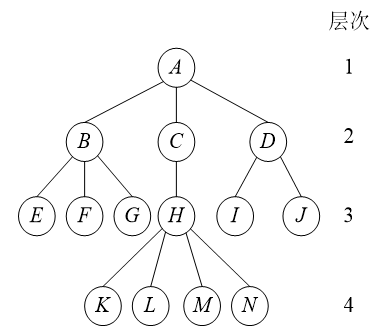

（1）该树是由14个数据类型相同的结点组成的，是一棵非空树；

（2）有且仅有一个根结点为A；

（3）根结点A有3棵子树，3棵子树的根结点分别是B、C、D；

（4）3棵子树互不相交，每棵子树又是一棵树。


## 6.2 树的抽象数据结构

​	相对于线性结构，树结构的操作完全不同，这里给出一些基本和常用的操作。

```C
ADT 树（Tree）
Data
	树是由一个根结点和若干子树构成的。树中结点具有相同数据类型及层次关系
Operation
    InitTree(*T): 构造空树
    DestroyTree(*T):销毁树
    CreateTree(*T,definition):按difinition中给出树的定义来构造树
    ClearTree(*T):将树清空为空树
    TreeEmpty(T):判断树是否为空，如果是则返回true,反之返回false
    TreeDepth(T):返回T的深度
    Root(T): 返回T的根结点
    value(T,cur_e): cur_e是树中的一个结点，返回此结点的值
    Assgin(T,cur_e,value):给树T的结点cur_e,返回此结点的值
    Parent(T,cur_e),若cur_e是树T的非根结点，则返回它的双亲，否则返回空。
    LeftChild(T,cur_e):若cur_e是树T的非叶结点，返回它的最左孩子。否则返回空
    RightSibling(T,cur_e):若 cur_e有右兄弟，则返回它的右兄弟，否则返回空
    InsertChild(*T,*p,i,c):在树 T 中，将树 c 插入为节点 p 的第 i 棵子树
    DeleteChild(*T,*P,i): 删除树T中结点p的第i个子树
endADT
```

​	

## 6.3 树的存储结构

​	树是一对多的结构，很难用一般顺序数组来表示。但充分利用顺序存储和链式存储结构的特点，完全可以实现对树的存储结构表示。这里介绍：**双亲表示法、孩子表示法、孩子兄弟表示法**

​	其中使用的最多的就是**孩子兄弟表示法**


#### 6.3.1 双亲表示法

​	假设以一组连续空间存储树的结点，在每个结点中，附设一个**双亲指针**指示其双亲结点在数组中的位置。

```C
typedef int TElemType;

typedef struct PTNode{
    TElemType data;
    int parent;
}PTNode;

typedef struct{
    PTNode nodes[MAX_TREE_SIZE];
    int r,n;  //根的位置和结点数
}PTree
```

​	其中`data`是数据域，存储结点的数据信息，`parent`是指针域，存储该结点的双亲在数组中的下标。比如说，用如下树形结构：

```C
        A
       / \
      B   C
     / \   \
    D   E   F	
```

​	可以画一个表格来帮助理解

| 下标 i | 节点 | 双亲 parent |
| :----: | :--: | :---------: |
|   0    |  A   |     -1      |
|   1    |  B   |      0      |
|   2    |  C   |      0      |
|   3    |  D   |      1      |
|   4    |  E   |      1      |
|   5    |  F   |      2      |


#### 6.3.2 孩子表示法

​	把每个结点的孩子结点排列起来，看成一个线性表，且以单链表作为存储结构，则n个节点有n个孩子链表（叶子的孩子链表为空表）。而n个头指针又组成一个线性表，为了便于查找，可采用顺序存储结构。假设以如下树形结构。

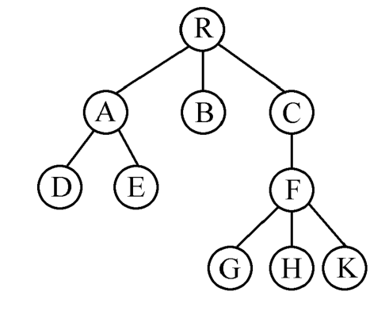

​	用孩子表示法如下：


​	可以看见有一个存储单链表的数组去代表整颗树，每一个单链表都有指向孩子链表的指针。R是整颗树的根结点。注意，孩子链表只保存该结点的孩子位置。比如说结点A的孩子结点数D，E ，则该结点的指针域指向D，D的指针域指向E。

​	用C语言表示：

```C
#define MAX_TREE_SIZE 100

typedef int TElemType;

typedef struct CTNode{
    int child;  //孩子结点在顺序数组中的下标
    struct CTNode *next; //指向孩子结点的指针
} *ChildPtr;// 定义 ChildPtr 为 CTNode 的指针类型

typedef struct{
    TElemType data; //数据域
    ChildPtr firstchild; //一个单链表的头指针
}CTBox;

typedef struct{
    CTBox nodes[MAX_TREE_SIZE]; //存储头指针的数组
    int r,n; //r根结点的下标，n是结点数
}CTree;
```


#### 6.3.3 孩子兄弟表示法

​	孩子兄弟表示法又称二叉树表示法，或二叉链表示法，即以二叉链表作为数的存储结构。**链表中节点的两个链域分别指向该结点的第一个孩子结点和下一个兄弟结点，分别命名为firstchild域或nextsibling域**

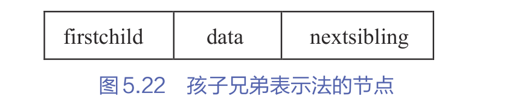

```C
typedef struct CSNode{
    ElemType data;
    struct CSNode *firstchild,*nextsibling;
}CSNode, *CSTree;
```

​	若要访问结点x的第i个孩子，则只需要从`firstchild`域找到第1个孩子，然后沿着孩子结点的`nextsibiling`域连续走`i-1`步，便可找到`x`结点的第i个孩子。

​	**它和二叉树的二叉链表表示完全一样，便于将一般的树结构转换为二叉树处理**。因此孩子兄弟表示法是应用较为普遍的一种树的存储方式。

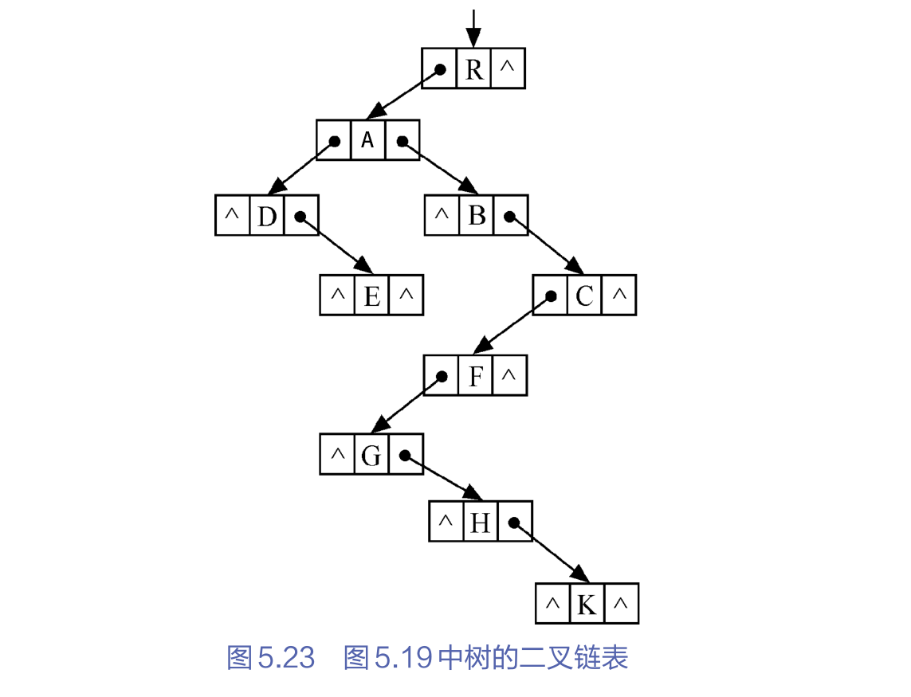


## 6.4 二叉树

​	二叉树（Binary Tree）是$n(n>=0)$个节点所构成的集合，它或为空树（n=0）,或为非空树T:

1. 有且仅有一个称之为根的节点：
2. 除根节点以外的其余节点分为两个互不相交的子集$T_1$和$T_2$，分别称为T的左子树和右子树，且$T_1$和$T_2$本身又都是二叉树。

​	二叉树和树一样具有递归性质，二叉树和树的区别主要有以下两点:

1. 二叉树每个节点至多只有两颗子树（二叉树不存在度大于2的节点）。
2. 二叉树的子树有左右之分，其次序不能任意颠倒。

​	二叉树可以是空树，有5种基本形态。

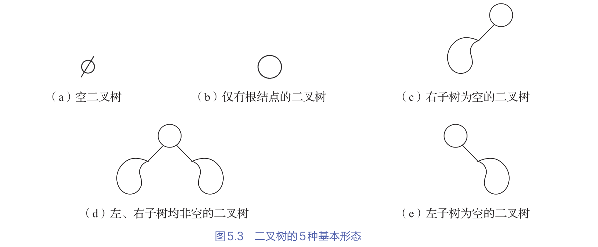


#### 6.4.1 二叉树的抽象数据结构

```C
ADT BinaryTree (二叉树)
Data：
    二叉树（Binary Tree）是 n (n >= 0) 个节点构成的集合
    树要么为空（n = 0），要么为非空树 T：
        根节点 + 左子树 + 右子树
    每个节点包含：
        data   : 节点数据
        lchild : 左孩子指针（指向子树根）
        rchild : 右孩子指针（指向子树根）

Operation：
    InitBiTree(*T)              : 构造空二叉树 T
    DestroyBiTree(*T)           : 销毁二叉树，释放所有节点，T 置空
    CreateBiTree(*T, definition): 按 definition 构造二叉树（先序构造）
    ClearBiTree(*T)             : 清空二叉树（保留 T 变量）
    BiTreeEmpty(T)              : 若 T 为空二叉树，则返回 true，否则返回 false。
    BiTreeDepth(T)              : 返回树 T 的深度
    Root(T)                     : 返回树 T 根节点的数据（若空树返回 Nil）
    Value(node)                 : 返回指定节点的数据
    Assign(node, value)         : 给指定节点赋值
    Parent(T, node)             : 返回节点的父节点，若 node 为根节点，则返回 NULL
    LeftChild(node(或T))             : 返回节点的左孩子，若无左孩子，则返回 NULL
    RightChild(node(或T))            : 返回节点的右孩子，若无右孩子，则返回 NULL
    InsertChild(*T, p, LR, c)  : 将 c 树插入 p 的左（LR=0）或右（LR=1）子树
                                  原有子树变为 c 的右子树（把一棵子树 c 插入到树 T 中某个节点 p 的左子树或右子树位								 置）
    DeleteChild(*T, p, LR)     : 删除树T中的节点 p 的左（LR=0）或右（LR=1）子树
    PreOrderTraverse(T)         : 前序遍历树 T
    InOrderTraverse(T)          : 中序遍历树 T
    PostOrderTraverse(T)        : 后序遍历树 T
    LevelOrderTraverse(T)       : 层序遍历树 T
endADT

```


#### 6.4.2 二叉树的性质

​	**性质1** 在二叉树的第`i`层上至多有$2^{i-1}(i>=1)$个节点。

​	**性质2** 深度为`k`的二叉树至多有$2k-1(k>=1)$个结点

​	**性质3** 对任何一颗二叉树T，如果其终端节点数为$n_0$，度为2的结点为$n_2$，则$n_0=n2+1$


#### 6.4.3 满二叉树

​	深度为k且含有$2^k-1$个节点的二叉树。

​	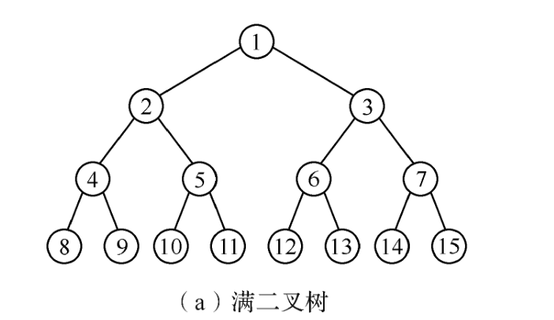

​	满二叉树的特点是：每一层上的节点数都是最大节点数，即每一层`i`的结点数都具有最大值**$2^i-1$**。比如第3层的节点数是$2^3-1=7$ 。

​	


#### 6.4.4 完全二叉树

​	对满二叉树的节点进行连续编号，约定编号从根节点起，自上而下，自左至右。从而引出完全二叉树的定义。

​	**完全二叉树**：深度为`k`的，有`n`个结点的二叉树，当且仅当其每一个节点都与深度为`k`的满二叉树中编号从1至n的节点一一对应时，称为完全二叉树。

​	完全二叉树的特点是：

1. **叶子节点只可能在层次最大的两层上出现**；
2. **对于任一节点，若其右分支下的子孙的最大层次为`L`，则其左分支下的子孙的最大层次必为`L`或`L+1`**。

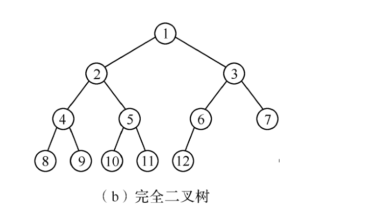

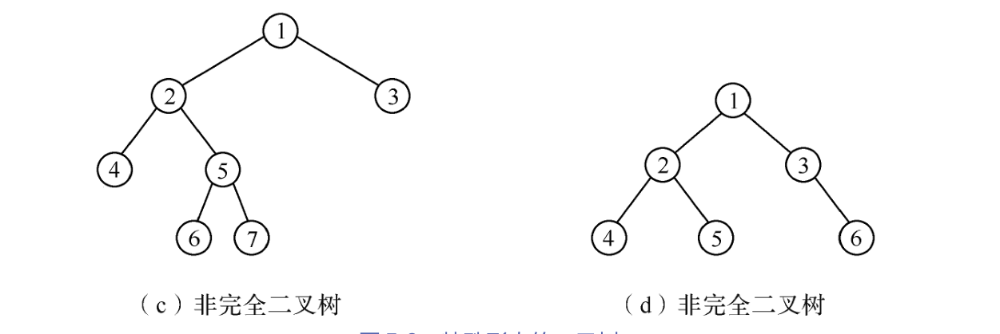

​	性质1：**具有n个结点的完全二叉树深度为$[log_2n]+1$**。如b图具有12个结点，那么它的深度为：$[log_212]+1=3.464101615+1=4$。去掉小数

​	


## 6.5 二叉树的存储结构

​	存储结构一般分为顺序存储和链式存储两种。


#### 6.5.1 顺序存储结构

```c
#define MAXTSIZE 100

typedef int TElemType;
typedef TElemType SqBiTree[MAXTSIZE]; //0好单位存储根节点
SqBiTree bt;
```

​	顺序存储结构使用一组地址连续的存储单元来存储数据元素。为了能够在存储结构中反映出结点之间的逻辑关系，**必须将二叉树中的结点安装一定规律安排在这组单元中。**

​	**对于完全二叉树，只需要从根起按层序存储即可，以此自上而下、自左至右存储结点的元素**，即将完全二叉树上编号为`i`的节点元素存储在如上定义的一维数组中下标为`i-1`的单位中。

​	对于一般二叉树，则应将其每个结点与完全二叉树上的节点相对照，存储在一维数组的相应分量中。以0表示不存在此节点。

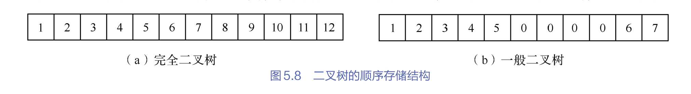

​	**顺序存储结构仅使用于完全二叉树**。在最坏的情况下，一个深度为k的且只有`k`个节点的单支树却需要长度为$2^k-1$的一维数组，这造成了存储空间的极大浪费。**对于一般二叉树，更适合采用链式存储结构。**


#### 6.5.2 链式存储结构

​	由二叉树的定义得知，**二叉树的节点由一个数据元素和分别指向其左、右子树的两个分支构成**。表示二叉树的链表中的节点至少包含3个域：**数据域和左、右指针域**。

​	有时为了便于找到节点的双亲，还可在节点解构中增加一个指向其双亲结点的指针域。两种节点解构所得二叉树的存储解构分别成为**二叉链表和三叉链表**。

​	**链表的头指针指向二叉树的根节点。在含有n个节点的二叉链表中有`n+1`个空链域**。后面将利用这些空链域存储其他有用信息，从而得到另一种链式存储结构——线索链表。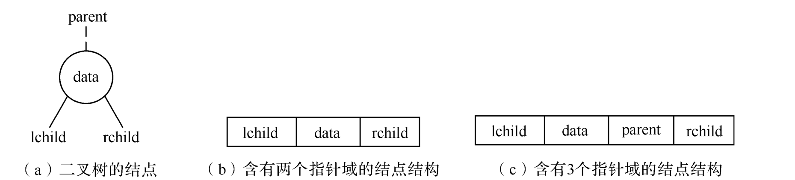

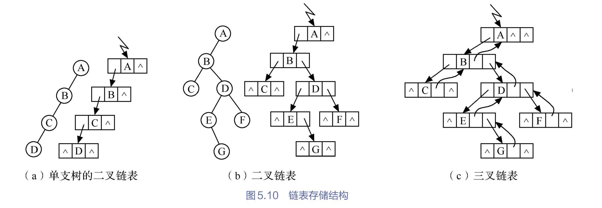

​	在不同的存储解构中，实现二叉树的方法也不同。找节点x的双亲`Parent(T,e)`，在三叉链表很容易实现，而在二叉链表中则需从根指针出发巡查。**后面二叉树遍历及其应用的算法均采用以下的二叉链表实现**

```c
// 二叉树的二叉链表存储实现
typedef struct BiTNode{
    TElemType data;  //节点数据域
    struct BiTNode *LChild,*Rchild; // 左右孩子指针
}BiTNode,*BiTree;
```


## 6.6 遍历二叉树

​	遍历二叉树是值按某条搜索路径巡访树中的每个节点，使得每个节点均被访问一次，而且仅被访问一次。**遍历二叉树是二叉树的基本操作，也是二叉树其他各种操作的基础**

​	二叉树由3个基本单元组成：根节点、左子树和右子树。遍历情况可分为3种，分别称为先（根）序遍历、中（根）序遍历和后（根）序遍历

​	基于二叉树的递归定义，可得下述遍历二叉树的递归算法定义。


1. **先序遍历二叉树的操作定义如下：**
   1. 先访问根节点；
   2. 先序访问左子树；
   3. 先序访问右子树；
2. **中序遍历二叉树的操作定义如下**
   1. 中序访问左子树
   2. 访问根节点
   3. 中序访问右子树
3. **后序遍历二叉树的操作定义如下：**
   1. 后序访问左子树
   2. 后序访问右子树
   3. 访问根节点。

**中序遍历的递归算法**

```c++
void InOrderTraverse(BiTree T){
    //中序遍历二叉树
    if(T){ //若树非空
        InOrderTraverse(T->Lchild); //中序访问左子树
        cout<<T->data; //访问根节点
        InOrderTraverse(T->Rchild); //中序遍历右子树
    }
}
```

​	只要改变输出语句的顺序，便可类似地实现先序遍历和后序遍历的递归算法


#### 6.6.1 根据遍历序列确定二叉树

​	**若二叉树中各节点的值均不相同**，任意一颗二叉树结点的先序、中序和后序遍历都是唯一的。反过来，若已知二叉树遍历的任意两种序列，能否确定这棵二叉树呢？这与确定的二叉树是否是唯一的？

​	==**由二叉树的先序序列和中序序列，或由其后序序列和中序序列均能唯一地确定一棵二叉树。**==

​	根据定义。**在先序序列中，第一个节点一定是二叉树的根节点**。另一方面，中序遍历先遍历左子树、然后访问根节点，最后遍历右子树。这里，**根节点在中序序列中必然将中序序列分割成两个子序列，前一个子序列是根节点的左子树中序序列，而后一个字序列是根节点的右子树的中序序列**。根据这两个字序列，在先序序列中找到对于的左子序列和右子序列。在先序序列中，左子序列的第一个节点是左子树的根节点，右子序列的第一个节点是右子树的根节点。这与，就确定了二叉是3个节点。同时，左子树和右子树的根节点右可以分别吧左子序列和右子序列划分为两个子序列。如此递归下去，当取尽先序序列中的节点时，便可以得到一个棵二叉树。

​	同理，由二叉树的后序序列和中序序列也可以唯一地确定一颗二叉树。依据后序遍历和中序遍历的定义，**后序序列的最后一个节点，就如同先序序列的第一个节点一眼，可将中序序列分成两个子序列**。分别为这个节点左子树的中序序列和右序序列，再拿出后序序列的倒数第二个节点，并继续分割中序序列。如此递归下去，当倒着取尽后序序列的节点时，便可得到一颗二叉树。

​	

【例5.1】 已知一颗二叉树的中序序列和后序序列分别是`BDCEAFHG`和`DECBHGFA`，请画出这棵二叉树。

1. 由后序遍历特征。根节点必然在后序序列尾部，即根节点是A；
2. 由中序遍历特征，根节点必然在其中间，而其左部分必全部是左子树子孙（BDCE），其右子树必全部是右子树子孙（FHG);
3. 继而，根据后序中的`DECB`子树可确定B为A的左孩子，根据`HGF`子树可确定`F`为A的右孩子；依次类推，可唯一地确定一颗二叉树。

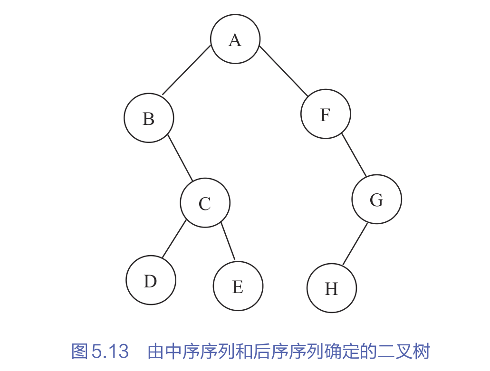

#### 6.6.2 二叉树遍历算法的应用

​	“遍历”是二叉树各种操作的基础，假设访问节点的具体操作不仅仅局限于输出节点数据域的值，而吧“访问”延伸到对节点的判别、计算等其他操作。如在遍历过程中生成节点，这与便可建立二叉树的存储结构。


##### 1.创建二叉树的存储解构——二叉链表

​	为简化问题，设二叉树中的节点元素均为单字符，假如按先序遍历的顺序建立二叉链表，T为指向根节点的指针，对于一个给定的字符序列，依次读入字符，从根节点开始，递归创建二叉树。

【算法步骤】

1. 查找字符序列，读入字符ch。
2. 如果ch是一个`#`号字符，则表明该二叉树为空树，即T为NULL；否则执行以下操作
   1. 申请一个节点空间T；
   2. 将ch赋给T->data;
   3. 递归创建T的左子树；
   4. 递归创建T的右子树；

```c
//先序遍历创建树
void CreateBiTree(BiTree *T){
	char ch;
	scanf("%c",&ch);
	if(ch=='#')
		*T=NULL;
	else{
		*T=(BiTree)malloc(sizeof(BiTNode));
		(*T)->data=ch;
		CreateBiTree(&(*T)->LChild);
		CreateBiTree(&(*T)->Rchild);
	}
}
```


##### 2.复制二叉树

​	复制二叉树利用已有的一颗二叉树复制得到另一棵与其完全相同的二叉树。根据二叉树的特点，复制步骤如下

​	如果是空树，递归结束，否则执行以下操作：

1. 申请一个新节点空间，复制根节点；
2. 递归复制左子树；
3. 递归复制右子树。

```c
void Copy(BiTree T, BiTree *NewT){
	if(T==NULL){
		NewT=NULL;
		return;
	}else{
		*NewT=(BiTree)malloc(sizeof(BiTNode));
		(*NewT)->data = T->data;
		Copy(T->LChild,&(*NewT)->LChild);
		Copy(T->Rchild,&(*NewT)->Rchild);
	}
}
```


##### 3.计算二叉树的深度

​	二叉树的深度为树中结点的最大层次，二叉树的深度为左右子树深度的较大者加1.

【算法步骤】

​	如果是空树，递归结束，深度为0，否则执行以下操作：

1. 递归计算左子树的深度记为m；
2. 递归计算右子树的深度记为n；
3. 如果m大于n，二叉树的深度为m+1，否则为n+1。

```c
int Depth(BiTree T){
	if(T==NULL)
		return 0;
	else{
		int m = Depth(T->LChild);
		int n = Depth(T->Rchild);
		if(m>n)
			return m+1;
		else
			return n+1;
	}
}
```


##### 4.统计二叉树中节点的个数

​	如果是空树，则节点个数为0，递归结束。否则，节点个数为左子树的节点树加右子树的节点个数再加上1(根节点）

```c
int NodeCount(BiTree T){
    if(T==NULL) return 0;
    else return NodeCount(T->LChild)+NodeCount(T->Rchild)+1;
}
```


## 6.7 线索二叉树

​	前面了解过，遍历二叉树是以一定规则将二叉树中的节点排列成一个线性序列。这实质上是对一个非线性结构进行线性化操作，使每个节点（除第一个和最后一个）在这些线性序列中有且仅有一个直接前驱和直接后继。

​	但，以二叉链表为存储结构时，只能找到节点的左、右孩子信息，而**不能直接得到节点在任一序列的前驱和后继先序**，这种信息只在遍历的动态过程中才能得到。

​	**由于有n个节点的二叉链表中必定存在`n+1`个空链域**。因此可以充分利用这些空链域来存放节点的前驱和后继信息。


​	若节点有左子树，则其`lchild`域指向其左孩子，否则令`child`域指向其前驱；若节点有右子树，则其`rchild`域指向其右孩子，否则令`rchild`域指示其后继。为避免混淆，尚需改变节点结构，增加两个标志域

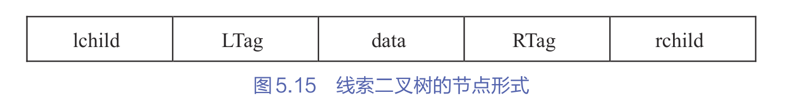

​	其中：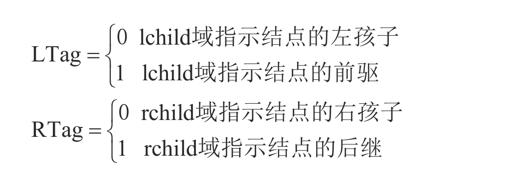

​	定义如下:

```c
typedef struct BiThrNode
{
    TElemType data;
    struct BiThrNode *lchild,*rchild;
    int LTag,Rtag;
}BiThrNode,*BiThrTree;
```

​	以这种节点结构构成的二叉链表作为二叉树的存储解构，叫做**线索链表**，其中指向结点前驱和后继的指针，叫做**线索**。加上线索的二叉树称之为**线索二叉树**。对二叉树以某种次序遍历使其变为线索二叉树的过程叫做线索化。


#### 6.7.1 构造二叉树（线索化）

​		线索二叉树构造的实质是**将二叉链表中的空指针改为指向前驱或后继的线索**，而前驱和后继的信息只有在遍历时才能得到，因此线索化的过程即在遍历的过程修改空指针的过程，可以用递归算法对二叉树按照不同的遍历次序进行线索化，可以得到不同的线索二叉树。如**先序线索二叉树、中序线索二叉树和后序线索二叉树。**下面介绍中序线索后的算法。

​	设一个指针`pre`始终指向刚刚访问过的节点。指针`p`指向当且访问的节点，由此记录遍历过程中访问节点的先后关系。

【算法1】以节点p为根的子树中序线索化

1. 如果`p`非空，左子树递归线索化。
2. 如果`p`的左孩子为空，则给p加上左线索，将其`LTag`置为1，让`p`的左孩子指向`pre`（前驱）；否则将`p`的`LTag`置为0
3. 如果`pre`的右孩子为空，则给`pre`加上右线索，将其`RTag`置为1，让`pre`的右孩子指针指向`p`（后继）;否则将`pre`的`RTag`置为0
4. 将`pre`指向刚访问过的节点`p`，即`pre=p`;
5. 右子树递归线索化。

【算法2】带头节点的二叉树中序线索化


#### 6.7.2 遍历线索二叉树

​	由于有了节点的前驱和后继信息，线索二叉树的遍历在指定次序下查找节点的前驱和后继都变得简单了。**因此，若需经常查找节点所在遍历线性序列中的前驱和后继，则采用线索链表作为存储解构**

​	下面分3种情况讨论线索二叉树如何查找节点的前驱和后继。


##### 1.在中序线索二叉树中查找

1. 查找p指针所指节点的前驱：
   1. 若`p->LTag`为1，则p的左链指示其前驱；
   2. 若`p->LTag`为0，则说明`p`有左子树，节点的前驱是遍历左子树时最后访问的一个节点（左子树中最右下的节点）。
2. 查找`p`指针所指节点的后继：
   1. 若`p->RTag`为1，则`p`的右链指示其后继，
   2. 若`P->Rtag`为0，则说明`p`有右子树。根据中序遍历的规律可知，节**点的后继应是遍历其右子树时访问的第一个节点，即右子树最左下的节点**。


##### 2.在先序线索树中查找

1. 查找p指针所指节点的前驱：
   1. 若`p->LTag`为1，则`p`的左链指示其前驱;
   2. 若`P->Ltag`为0，则说明`p`有左子树，此时`p`的前驱有两种情况：**若*p是其双亲的左孩子，则前驱为双亲结点；否则应该是其双亲左子树上先序遍历最后访问的节点**
2. 查找`p`指针所指节点的后继：
   1. 若`p->RTag`为1，则`p`的右链指示其后继；
   2. 若`p->RTag`为0，则说明`p`有右子树，按先序遍历的规则可知，\*p的后继必为其左子树根或右子树根。


##### 3.在后序线索二叉树中查找

1. 查找`p`指针所指节点的前驱；

   1. 若`p->LTag`为1，则`p`的左链指示其前驱；
   2. 如`p->LTag`为0，当`p->RTag`也为0时，则`p`的右链指示其前驱；若`p->LTag`为0，而`p->RTag`为 1时，则p的左链指示其前驱。

2. 查找`p`指针所指节点的后继情况比较复杂，分以下情况讨论：

   1. 若\*p是二叉树的根，则后继为空
   2. 若\*p是其双亲的右孩子，则其后继为双亲结点；
   3. 若\*p是其双亲的左孩子，且\*p没有右兄弟，则其后继为双亲结点；
   4. 若\*p是其双亲的左孩子，且\*p有右兄弟，则其后继为双亲的右子树上按后序遍历列出的第一个节点（右子树中最左下的叶节点）。

   

​	下面以遍历中序二叉树为例介绍该算法

**【算法】遍历中序线索二叉树**

1. 指针p指向根节点
2. p为非空树或遍历未结束时，循环执行以下操作：
   1. 沿左孩子向下，到达最左下节点\*p，它是中序的第一个节点；
   2. 访问\*p；
   3. 沿右线索反复查找当前节点\*p的后继节点并访问后继节点，知道右线索为0或遍历结束。
   4. 转向`p`的右子树。

```c
void InOrderTraverse_Thr(BiThrTree T)
{
    p=T->lchild;
    while(p!=T)
    {
        While(p->LTag=0)
            p=p->lchild; //沿左孩子向下
        cout<<p->data; //访问其左子树为空的节点
        
        while(p->RTag==1 && p->rchild!=T)
        {
            p=p>rchild;
            cout<<p->data;
        }
        
        p=p->rchild;
    }
}
```


## 6.8 森林

​	从树的二叉链表表示的定义可知，**任何一颗和树对应的二叉树，其根节点的右子树必为空**。

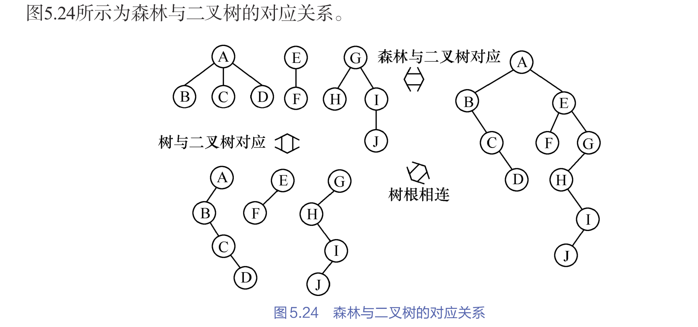

​	胜利或树于二叉树可以相互转换。


#### 6.8.1 森林转换成二叉树

​	如果$F=\{T_1,T_2,...,T_m \}$是森林，则可按如下规则将其转换成一颗二叉树 $B=(root,LB,RB)$;

1. 若F为空，则m=0,则B为空树；
2. 若F非空，则B的根`root`即森林中第一颗树的根ROOT($T_1$)；B的左子树LB是从$T_1$中根节点的的子树森林转换而成的二叉树；同样的其右子树RB是从森林转换二叉的二叉树。


## 6.9 哈夫曼树

​		哈夫曼（`Huffman`）树又称最优树，是一类**带权路径长度最短的树**。

1. **路径**：从树中一个节点到另一个节点之间分支构成这两个节点之间的路径。
2. **路径长度**：路径上的分支数目称作路径长度
3. **树的路径**：从树根到每一叶子节点的路径长度之和
4. **权**：赋予某个实体的一个量。
5. **节点的带权路径长度**：从节点到树根之间的路径长度与节点上权值的乘积。
6. **树的带权路径长度**：树中所有叶子节点的带权路径长度之和。通常记作`WPL`；
7. **哈夫曼树**：假设有m个权值$\{w_1,w_2,....w_m\}$,可以构造一个含n个叶子节点的二叉树，每个叶子节点的权值为$w_i$。则==**其值带权路径长度`WPL`最小的二叉树称作最优二叉树或哈夫曼树**==

​	如下：

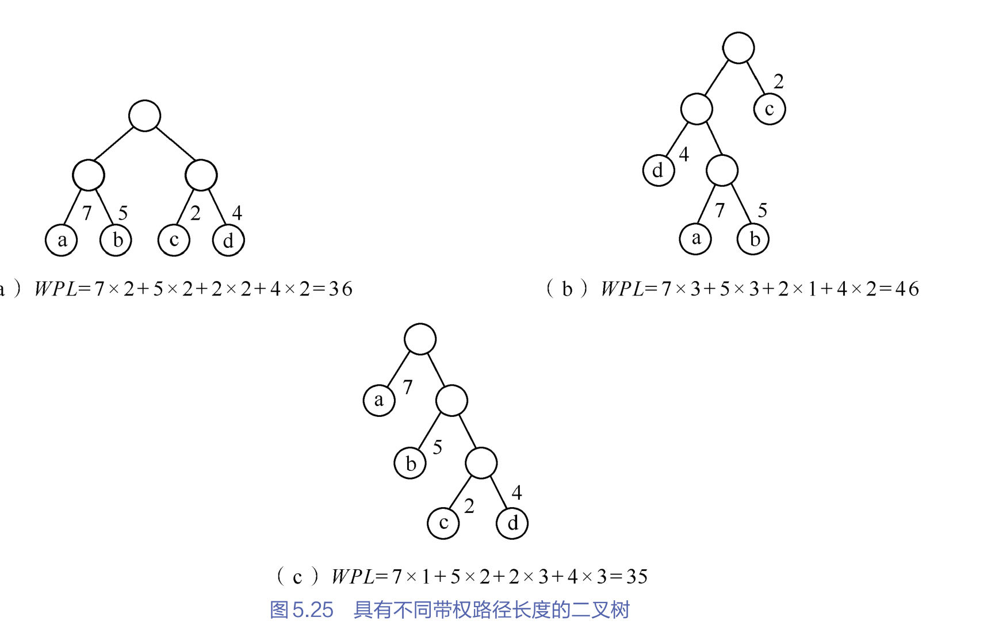

​	上图的3棵二叉树，都含4个叶子节点`a,b,c,d`。分别带权值`7,5,2,4`。其值带权路径长度最小的就叫哈夫曼树。在哈夫曼树中，**权值越大的节点离根节点越近。**根据这个特点，哈夫曼给出了一个构造哈夫曼树的方法，称哈夫曼算法。


#### 6.9.1 哈夫曼树的构造过程

1. 根据给定的`n`个权值$\{W_1,W_2,...,W_n\}$，构造`n`个只有根节点的二叉树。这`n`棵二叉树构成森林F。
2. 在森林F中选取两棵根节点的权值最小的书作为左右子树构造一颗新的二叉树，且置新的二叉树的根节点的权值为其左、右子树上根节点的权值之和。
3. 在F中删除这两棵树，同时将新得到的二叉树假如F中。
4. 重复2和3，直到F只含一棵树为止。这棵树便是哈夫曼树。

在构造哈夫曼树时，首先选择权值小的，这样保证权值大的离根比较近。这种生成算法是一种典型的贪心法。


#### 6.9.2 哈夫曼算法的实现

​	由于哈夫曼树没有度为1的节点，则**一颗有n个叶子节点的哈夫曼树共有$2n-1$**个节点，所以可以存储在一个大小为`2n-1`的一维数组里。树中每个节点还要包含其双亲信息和孩子节点的信息。存储结构如下：

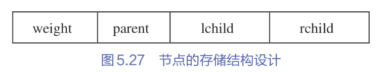

```c
typedef struct{
    int weight;  //权值
    int parent,lchild,rchild; //双亲，左右孩子的下标
}HTNode,*HuffmanTree; //动态分配数组存储哈夫曼树
```

​	为了方便，数组的0号单位不在使用。从1号单位开始使用，所以数组的大小为`2n`。将叶子节点存储在前面`n`个位置。后面`n-1`个位置存储其余非叶子节点。


【算法步骤】

构造哈夫曼树的算法实现可以分为两大部分

1. 初始化：动态申请2n个单位，循环`2n-1`次，从1号单元开始，依次将`1`至`2n-1`所有单元的双亲、左右孩子的下标初始化为0；最后循环n次。输入前`n`个单元叶子节点的权值。
2. 创建树：循环`n-1`次，通过`n-1`次的选择、删除与合并（构造哈夫曼树过程）来创建哈夫曼树。选择是从**当且森林中选取双亲为0且权值最小的两个树根节点s1和s2**；删除是指**将节点s1和s2该为非0**；合并就是**将s1和s2的权值作为一个新的节点依次存入数组的n+1号及之后的单元中，同时记录这个新节点左孩子的下标为是s1,右孩子下标s2**

```c
#include"HaffmanTree.h"

void CreatHuffmanTree(HuffmanTree *HT, int n){
	//构造哈夫曼树HT
	
	if(n<=1) //最少两个节点
		return;
	int m = 2*n-1; // 哈夫曼树总共的节点树
	
	// 0 号单位不使用。总共申请2n个单位，HT[M]表示根节点
	*HT = (HuffmanTree)malloc(sizeof(HTNode)*(m+1));
	
	//将1~m号单元的双亲、左孩子、右孩子下标都初始化为0
	for(int i=1;i<=m;i++){
		(*HT)[i].parent=0;
		(*HT)[i].lchild=0;
		(*HT)[i].rchild=0;
		(*HT)[i].weight=0;
	}
	
	cout<<"输入前n个单元叶子节点的权值: "<<endl;
	for(int i=1;i<=n;i++){
		cin>>(*HT)[i].weight;
	}
	
	//初始化结束，开始构造哈夫曼树
	for(int i=n+1; i<=m;i++){
		// 通过n-1次的选择、删除、合并来创建哈夫曼树
		int s1,s2;
		Select(*HT,i-1,&s1,&s2);
		//给两个最小的叶子节点的双亲赋值，由于新节点放在n+1个位置，所以它们的双亲指针就是i
		(*HT)[s1].parent=i; 
		(*HT)[s2].parent=i;
		
		//给新节点赋予左孩子和右孩子
		(*HT)[i].lchild=s1;
		(*HT)[i].rchild=s2;
		(*HT)[i].weight=(*HT)[s1].weight+(*HT)[s2].weight; // 值为两个叶子节点的和
	}
	
}

void Select(HuffmanTree HT, int i, int *s1, int *s2){
	int min1W = 9999999, min2W = 9999999;
	int min1 = -1, min2 = -1;
	
	// 找最小
	for(int k=1;k<=i;k++){
        //不要忘了是根节点，双亲指示器为0
		if(HT[k].parent == 0 && HT[k].weight < min1W){
			min1W = HT[k].weight;
			min1 = k;
		}
	}
	
	// 找第二小
	for(int k=1;k<=i;k++){
		if(k == min1) continue;
        //不要忘了是根节点，双亲指示器为0
		if(HT[k].parent == 0 && HT[k].weight < min2W){
			min2W = HT[k].weight;
			min2 = k;
		}
	}
	
	if(min1 > min2){
		int temp = min1;
		min1 = min2;
		min2 = temp;
	}
	
	*s1 = min1;
	*s2 = min2;
}

void PrintHaffuman(HuffmanTree HT,int n){
	cout<<"节点i\tweight\tparent\tlchild\trchild"<<endl;
	
	int m=2*n-1;
	
	for(int i=1;i<=m;i++){
		printf("%d\t%d\t%d\t%d\t%d\n",i,HT[i].weight,HT[i].parent,HT[i].lchild,HT[i].rchild);
	}
}
```


#### 6.9.3 哈夫曼树编码

​	在进行数据压缩时，为了使压缩后的数据文件尽可能短，可采用**不定长编码**。其基本思想是：**为出现次数较多的字符编以比较短的编码。**可以利用哈夫曼树来设计二进制编码。在哈夫曼树中约定**左分支标记为0，右分支标记为1，则根节点到每个叶子节点路径上的0、1即相应字符的编码**

​	下面给出有关编码的概念。

1. 前缀编码：如果在一个编码方案中，**任一个编码都不是其他编码的前缀，则称编码是前缀编码。**例如，0、10、110、111都是前缀编码
2. 哈夫曼编码。对一颗具有n个叶子节点的哈夫曼树，**若对树中的每个左分支赋予0，对每个右分支赋予1，则从根到每个叶子的路径上，各分支的赋值分别构成一个二进制串。该二进制串就称为哈夫曼编码**。

​	哈夫曼编码具有下面的两个性质

1. 哈夫曼编码是前缀编码
2. 哈夫曼编码是最优前缀编码


#### 6.9.4 哈夫曼编码算法实现

​	求哈夫曼编码的主要思想是：**依次以叶子节点为出发点，向上回溯至根节点位置。回溯时走左分支则生成代码0，走右分子则生成代码1。**

​	由于每个哈夫曼编码是变长编码，因此使用一个指针数组来存放每个字符编码串的首地址。

```c
//哈夫曼编码表的存储表示
typedef char **HuffmanCode; //动态分配数组存储哈夫曼编码表。
```

​	为方便实现。0号单元不使用，从1号单元开始使用。所以数组HC的大小为`n+1`，即编码表HC包括`n+1`行。每一行存储一个字符编码，但字符编码的长度事先不能确定，所以**不能预先为每个字符分配大小合适的存储空间**

​	为不浪费存储空间，**动态分配一个长度为`n`（字符编码长度一定小于`n`）的一维数组cd，用来临时存放当前正在求解的第$i(1<=i<=n)$个字符的编码**。当第i个字符的编码求解完毕后，根据数组cd的字符串长度分配`HC[i]`的空间，然后将数组cd中的编码复制到HC[i]中

​	因为求解编码是从哈夫曼树的叶子节点出发，自下而上的回溯至根节点。对于每个字符得到的编码是从右向左的。故存储时将编码向数组cd存放的顺序也是从后向前的，即每个字符的第1个编码存放在cd[n-2]中(`cd[n-1]存放字符串结束符标志\0`)，第2个编码存放在`cd[n-3]`中。依次类推。直到全部编码存放完毕。


【算法步骤】

1. 分配存储n个字符编码的编码表空间HC，长度为n+1（个字符串）；分配临时存储每个字符编码的动态数组空间cd，`cd[n-1]`置为0
2. 逐个求解n个字符的编码，循环n次，执行以下操作：
   1. 设置变量`start`用于记录编码在cd存放的位置，start初始时指向最后，即编码结束符位`n-1`
   2. 设置变量`c`用于记录从叶子节点向上回溯至根节点所经过的节点下标，`c`初始时为当前带编码字符的下标`i`，`f`用于记录i的双亲结点的下标
   3. 从叶子节点向上回溯至根节点，求得字符`i`的编码，当`f`没有到达根节点时，循环执行以下操作：
      1. 回溯一次start向前指一个位置，即`--start`;
      2. 若节点`c`是`f`的左孩子，则生成代码`0`，否则生成代码`1`，生成的代码0或1保存在`cd[start]`中。
      3. 继续向上回溯，改变`c`和`f`的值
   4. 根据数组`cd`的字符串长度为第`i`个字符编码分配空间`HC[i]`，然后将数组cd中的编码复制到`HC[i]`中。
3. 释放临时空间`cd`

```c

// n表示叶子节点的个数
void CreatHuffmanCode(HuffmanTree *HT,HuffmanCode *HC,int n){
	//分配编码字符串存储空间,0号空间不使用，从1开始
	*HC =(HuffmanCode)malloc(sizeof(char*)*(n+1));
	//创建临时存储每个字符编码的字符串
	char * cd = (char*)malloc(sizeof(char)*n);
	cd[n-1]='\0'; //设置结束符
	
	int start =0;
	int c,f;
	//逐个求haffman编码
	for(int i=1;i<=n;i++){
		start = n-1;  //标记数组cd的下标
		c=i; //记录当前节点下标
		f=(*HT)[i].parent; //记录当且节点的双亲节点下标
		
		while(f!=0){ //从叶子节点向上回溯
			--start;
			if((*HT)[f].lchild==c) //当且节点是父节点的左孩子，code为0
				cd[start]='0';
			else
				cd[start]='1';
			c=f; //向上回溯，更新当前节点指示器。
			f=(*HT)[f].parent; //同时更新父节点指示器
		}
		(*HC)[i] = (char*)malloc(sizeof(char) * (n-start)); //为第i个字符分配空间
		strcpy((*HC)[i],&cd[start]);
	}
	
	free(cd);
}

```

