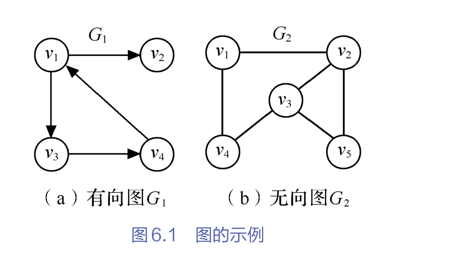
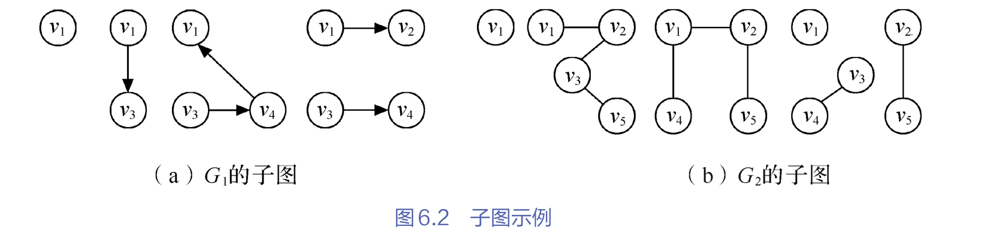
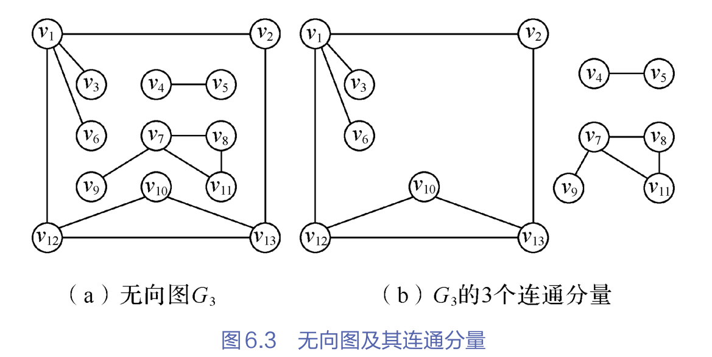
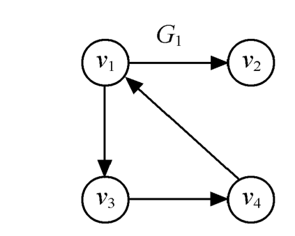
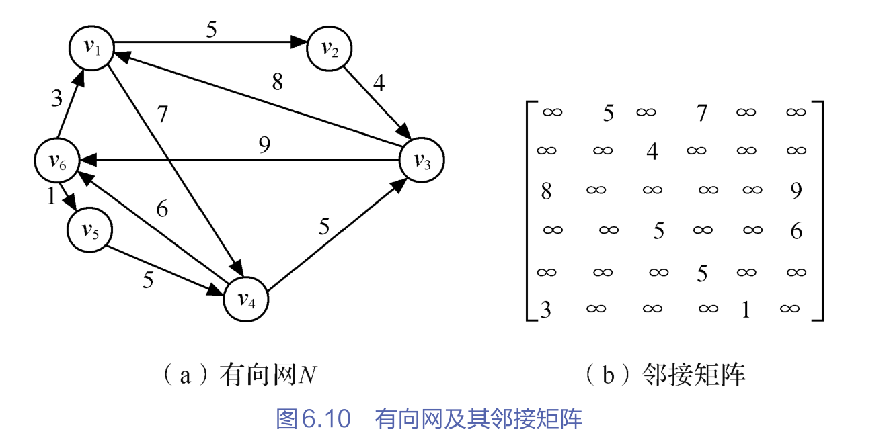
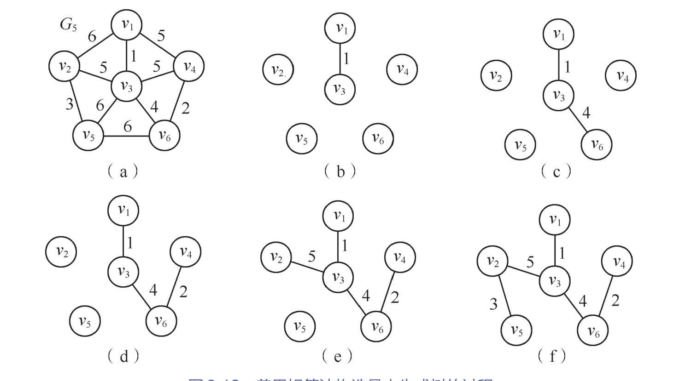

## 7.1 图的概述

​	前面我们学习了线性表和树两种数据结构，它们分别是一对一和一对多的关系。而图是数据结构中的最后一种结构，它是**多对多**的关系。

​	**图（Graph）G由两个集合V和E组成，记为G=（V，E），其中V是顶点的有穷非空集合，E是V中==顶点偶对==的有穷集合，这些顶点成为边。**

​	$V(G)和E(G)$通常分别表示图G的**顶点集合和边集合**，$E(G)$可以为空集。若$E(G)$为空，则图G只有顶点而没有边。

​	对于图G，若边集$E(G)$为有向边的集合，则称该图为有向图；反之边集$E(G)$为无向边的集合，则称改图为无向图。在有向图中，顶点对$<x,y>$是有序的，**它称为从顶点x到顶点y的一条有向边。因此$<x,y>和 <y,x>$是不同的两条边。对于$<x,y>$而言，x是有向图的始点，y是有向图的终点。$<x,y>$也称作一条弧，x为弧头，y为弧尾。**

​	弧尾为弧的起点，即箭头出发的那个顶点。弧头为弧的终点，即箭头指向的那个顶点

​	在无向图中，**顶点对$(x,y)$是无序的，它称为与顶点x和顶点y相关联的一条边。这条边没有特定的方向，$(x,y)和(y,x)$是同一条边。无向图的顶点对用一对圆括号括起来**。



​	对于有向图a，$<v_1,v_4>$这条弧，v1为弧头,v4为弧尾


#### 7.1.1 图的基本术语

​	用`n`表示图中顶点数目，用e表示边的数目。下面介绍图结构中的一些基本术语。

​	**（1） 子图**：假设有两个图$G =(v,E)$ 和$G'=(v',E')$ ，如果$v' \subseteq v 且 E' \subseteq E $, 则称$G'为G$的子图。例如，下面是图G1和G2的子图示例：

​	

​		换句话说，对图进行删点和删边，得到的就是它的子图。不能添加没有的顶点和边。

​	（2）**无向完全图和有向完全图**：对于无向图，若具有**$n(n-1)/2$条边**，则称为无向完全图。对于有向完全图，若具有$n(n-1)$条弧，则称为有向完全图。

​		完全的定义：意味着所有的顶点对之间都有一条边相连。图中再也无法添加新的边而不重复已存在的边。它在连接上是完全的。

​	（3）**稀疏图和稠密图**：有很少条边或弧（如$e<nlog_2n$）的图称为稀疏图，反之称为稠密图。

​	（4）**权和网**；**在实际应用中，每条边可以标上具有某种含义的数值，该数值称为该边上的权值。这种带权的图通常称为网**，

​	（5）**邻接点**：对于无向图G，如果图的边$(v,v') \in E $,则称顶点v和v’ 互为邻接点。即v和v’相邻接。边$(v,v')$依附于顶点v和v’（这里v和v’仅用作区分不同的顶点）**换句话说，如果这两个顶点组成的顶点偶对属于集合E的某条边，那么这两个顶点相连**。

​	（6） **度、入度和出度**：**定点v的度是指和V相关联的边的数目，记为$TD(v)$**，例如，图6.1（b）中的顶点$v_3$的度是3;

​			对于有向图，顶点v的度分为入度和出度，**入度是以顶点v为头的弧的数目**，记为$ID(v)$; 也就是说，有多少条弧已顶点v为头（目标）的数目。

​			**出度是以顶点v为尾的弧的数目，记为$OD(v)$, 顶点v的度为$TD(V)=ID(v)+OD(v)$**。例如图6.1中$G_1$的顶点$v_1$的入度为1，因为以顶点v1为弧头的弧只有一条，出度OD=2，以顶点v1为弧尾的弧有两条，OD加上ID为顶点v1的度。度是指与顶点相关联的边的数目。

​	一般的，如果顶点$v_i$的度记为$TD(v_i)$, 那么一个有n个顶点，e条边的图满足如下关系：

$$
e = \frac{1}{2}\sum_{i=1}^{n} TD(v_i)
$$
​	也就是说，**图中所有顶点的度数之和，等于边数的两倍**。反过来说，边数等于总度数乘以2。我们分析这个公式。$TD（v_i）$

表示$v_i$的度，$\sum_{i=1}^{n} TD(v_i)$就代表，从第一个顶点的度累加到最后一个顶点的度。用程序员的视角，类似于循环累加求sum。只不过这个累加的数变成了顶点的度。最后 **$e = \frac{1}{2} \sum_{i=1}^{n} TD(v_i) $。 解释为，边数等于 所有顶点的度的和的一半**。

​	

​	（7）**路径和路径长度**：在无向图G中，从顶点v到顶点v’的路径是一个顶点序列。如果G是有向的，则路径是也是有向的。**路径长度是一条路径上经过的边或弧的数目。**

​	（8）**回路或环**：如果一个路径的**起点和终点是同一个顶点**，那么这条路径就称为**回路**（或环）。

​	（9）**简单路径、简单回路或简单环**：序列中顶点不重复出现的路径称为简单路径。除了第一个顶点和最后一个顶点之外，其余顶点不重复出现的回路，称为简单回路或简单环。**通俗理解，在一个路径中，第一个顶点和最后一个顶点是相同的才能叫做回路，除了这两个顶点能重复，其他顶点不能出现重复的回路叫做简单回路。就好比一根绳子环成一圈，只有一个结的，叫简单回路。如果有多个结的，那么就是非简单回路。**

​		换句话说，对于一个路径，第一个顶点为起点，最后一个顶点为终点。他们是相同的，该顶点出现的次数是两次。其他顶点出现的次数只能有一次。

​	（10）**连通、连通图和连通分量**：在无向图G中，如果从顶点v到顶点v‘有路径，则称它们相通的；如果对于图中任意两个顶点 $v_i,v_j \in V ，v_i和v_j$都是连通的，则称G是连通图。 



​		**所谓连通分量，是指无向图中的极大连通子图**。所谓极大，是指一个连通子图已经包含了原图中所有能与该集合内的顶点连通的其他顶点和边。极大的意思是已经是最大的连通子图，多一个顶点就会破坏连通性，少一个顶点会破坏极大性。就像这里的
$$
v_{12}->v_{10}->v_{13}
$$
​	这里是无向图，不区分方向。如果我们多加一个顶点v6进去，那么就会破坏连通性，因为v6与该连通分量没有关联，如果少一个，就会破坏极大性。所以，连通分量，是指无向图中的极大连通子图。


​	（11） 强连通图和强连通分量；**在有向图G中，如果对于每一对$v_i,v_j \in V, v_i\not= v_j $,从$v_i$到$v_j 和v_j到v_i$都存在路径，则称G是强连通图。有向图的极大强连通子图称作有向图的强连通分量**

​													

​	（12）**连通图的生成树：一个极小连通子图，它含有图中全部顶点，但只有足以构成一颗树的n-1条边，这样的连通子图称为连通图的生成树。**

​	一颗有n个顶点的生成树有且仅有n-1条边，如果一个图有n个顶点和小于n-1条边，则是非连通图。如果它多于n-1条边，则一定有环，但是有n-1条边的图不一定是数。


## 7.2 图的抽象数据结构

​	图是一种数据结构，加上一组基本操作，就构成了抽象数据类型。如下：

```ADT
ADT Graph{
	数据对象：V具有相同特效的数据元素的集合，称为顶点集
	数据关系：我们将图定义为 G = (V, E)，其中 V 是顶点集，E 是边集。
	基本操作：

// 按照顶点集 V 和 弧集 VR 的定义构造图 G
CreateGraph(&G, V, VR); 

// 销毁图 G，释放内存中所有的顶点与边资源
DestroyGraph(&G); 


/* --- 2. 顶点数据操作 --- */

// 查找顶点 u 的索引位置（坐标），若不存在则返回错误标识
LocateVex(G, u); 

// 获取图中索引为 v 的顶点所存储的具体数值/对象内容
GetVex(G, v); 

// 对索引为 v 的顶点进行赋值（更新其携带的数据信息）
PutVex(&G, v, value); 

// 在图中添加一个互不重复的新顶点 v
InsertVex(&G, v); 

// 删除顶点 v 及其关联的所有弧（边）。注意：此操作会导致图结构的变化
DeleteVex(&G, v); 


/* --- 3. 边/弧关系操作 --- */

// 返回顶点 v 的第一个邻接顶点；若 v 孤立无邻居，则返回空
FirstAdjVex(G, v); 

// 返回 v 的邻居中，排在 w 之后的下一个邻接点；若 w 已是最后一个邻居，则返回空
// 这是遍历一个节点所有邻居的核心迭代器
NextAdjVex(G, v, w); 

// 在 v 和 w 之间建立连接。若为无向图，则自动创建双向对称连接 <v, w> 和 <w, v>
InsertArc(&G, v, w); 

// 断开 v 和 w 之间的连接。若为无向图，则同步删除其对称方向的边
DeleteArc(&G, v, w); 


/* --- 4. 全局遍历算法 --- */

// 深度优先遍历：从某个起点开始，“一扎到底”式地访问所有连通顶点，每个点仅访问一次
DFSTraverse(G); 

// 广度优先遍历：从某个起点开始，“波纹扩散”式地逐层访问所有邻近顶点，每个点仅访问一次
BFSTraverse(G);
}ADT Graph
```


## 7.3 图的存储结构

​	图的结构比较复杂，任意两个顶点都可能存在联系，图没有顺序存储结构，但可以借助二维数组来表示元素之间的关系。即**邻接矩阵表示法**。另一方面，由于图的任意两个顶点都可能存在关系，因此，用链式存储表示图是很自然的关系，图的链式存储有多种，有**邻接表、十字链表和邻居多重表。**

​	


#### 7.3.1 邻接矩阵

**1. 邻接矩阵表示法**

​	**邻接矩阵是表示顶点之间相邻关系的矩阵。设$G(V,E)$是具有n个顶点的图，则G是邻接矩阵是具有如下性质的n阶方阵。**
$$
A[i][j]= \begin{cases}
	1, <v_i,v_j> 或(v_i,v_j) \in E\\
	0 ， 其他
\end{cases}
$$


​	也就是说，两个顶点之间有关联的写1，没有关联的写0

​	例如，图6.1所示的G1的邻接矩阵为：
$$
G_{1,arcs} = \begin{bmatrix}
0 & 1 & 1 &0 \\
0 & 0 & 0 &0 \\
0 & 0 & 0 &1 \\
1 & 0 & 0 &0
\end{bmatrix}
$$


​	若G是网（边带权值的图），则邻接矩阵可以定义为：
$$
A[i][j]= \begin{cases}
	w_{ij}, <v_i,v_j> 或(v_i,v_j) \in E\\
	\infty ， 其他
\end{cases}
$$
​	其中，$w_{ij}$表示边上的权值； $\infty$表示计算机允许的、大于所有边上全值的数



​	用邻接矩阵表示法表示图，除了用一个存储邻接矩阵的二维数组外，还需要用一个一位数组存储顶点信息。形式如下：

```c++
// 图的邻接矩阵存储表示
#define MaxInt 32767 //表极大值
#define MVNum 100  //最大顶点数
typedef char VerTexType;    //假设顶点的数据类型为字符型
typedef int ArcType; //假设边的权值为整型

typedef struct{
    VerTexType vexs[MVNum]; //顶点表
    ArcType arcs[MVNum][MVNum]; //邻接矩阵
    int vexnum,arcnum; //顶点数量和边数
}AMGraph;
```


**2. 采用邻接矩阵表示法创建无向网，**

​	已知一个图的顶点和边，使用邻接矩阵表示法来创建此图的方法比较简单。

**算法 采用邻接矩阵表示法创建无向网**

【算法步骤】

1. 输入总定顶点数和总边数
2. 依次输入顶点的信息并将其存入顶点表中。
3. 初始化邻接矩阵，使每个权值初始化为极大值
4. 构造邻接矩阵，依次输入每条边依附的顶点和其权值，确定两个顶点在图中的位置后，使相应边赋予相应的权值，同时使其对称边赋予相同的权值。

```c++
Status CreateUDN(AMGraph &G){ 
	cin>>G.vexnum>>G.arcnum; //输入总顶点数，总边数
	
	//输入每个顶点的信息
	for(int i=0; i<G.vexnum;i++)
		cin>>G.vexs[i];
	
	//初始化邻接矩阵，边的权值均为极大值
	for(int i=0;i<G.vexnum;i++){
		for(int j=0;j<G.vexnum;j++)
			G.arcs[i][j] = MaxInt;
	}
	
	for(int k=0;k<G.arcnum;++k){
		VerTexType v1,v2;
		ArcType w; 
		cin>>v1>>v2>>w; //输入一条边依附的顶点及权值
		//确定v1和v2在G中的位置，即顶点数组的下标
		/**
		 i = LocateVex(G,v1); j=LocateVex(G,v2)
		  G.arcs[i][j] =w;
		  G.arcs[j][i] = G.arcs[i][j];
		 */
	}
	return OK;
}
```

​	该算法的时间复杂度是$O(n^2)$，可以看出，顶点在顶点表的位置决定了它在邻接矩阵的位置，最重要的是边关系的输入。

​	若要建立无向图，只需对将权值初始化为0，构造时将权值w该为常量值1.


**3 邻接矩阵表示法的优缺点**

​	（1）优点

1. 便于判断两个顶点之间是否有边，即根据`A[i][j]=0或1`来判断。
2. 便于计算各个顶点之间的度。对于无向图，邻接矩阵第`i`行元素之和就是顶点$V_i$的度；对于有向图，第`i`行元素之和就是顶点$V_i$的出度，第i列元素之和就是顶点i的入度。


​	假设$N=（V，E）$是连通网，$TE$是N上最小生成树的集合。

1. $U = {u_0} (u_0 \in V )，TE = \{\}$，换句话说，从图中任选一顶点。
2. 在所有$u \in U,v\in V-U$的边$(u,v)\in E$中找一条权重最小的边$(u_0,v_0)$并入集合TE，同时$v_0$并入U。
3. 重复2，直到U=V为止。 

​	此时TE必有n-1条边，则T =(V，TE)为N的最小生成树




