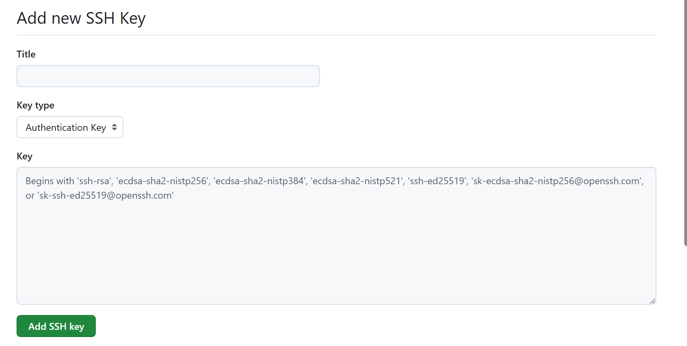
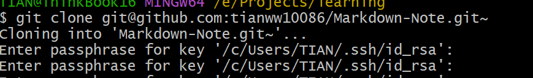

## 1 Git连接Github

ls/ll	查看当前目录

cat         查看文件内容

touch    创建文件

vi            vi编辑器


#### 1.1 Git环境配置

下载网址：[Git - Downloading Package](https://git-scm.com/downloads/win)

安装无脑下一步


#### 1.1.2 ssh密钥

​	首先设置本地Git的名字和邮箱（与欲连接的账户一致）

```bash
git config --global user.name "name"
git config --global user.email "email.com"
```

​	其次生成ssh密钥：

```bash
ssh -keygen -t rsa -C "your_email.com"
Generating public/private rsa key pair.
Enter file in which to save the key (/c/Users/TIAN/.ssh/id_rsa):  //回车，保存密钥的位置
Created directory '/c/Users/TIAN/.ssh'. 
Enter passphrase for "/c/Users/TIAN/.ssh/id_rsa" (empty for no passphrase): //输入ssh密语
Enter same passphrase again: //再次输入ssh密语
```

​	注意，这个密语不是要你输入Github的密码，而是设置该ssh密钥的密码。后续连接需使用该（ssh）密语。现在，在所在文件位置找到`id_rsa.pub`文件，该文件即公开密钥。`id_rsa`私钥则是自己所有，网站用这条密钥验证该客户端的主人。而公开密钥可以分享给别人来获得。

​	回归正题，在GitHUb网站中，添加公开密钥，在`setting`中，找到`ssh密钥`，点击`new ssh key`。然后复制公开密钥：



​	最后，在`Git Bash`命令中，输入如下指令

```bash
$ssh -T git@github.com
```

​	作用是测试与GitHub的SSH连接是否成功。如果返回`successful`等字样，说明本地Git已经与Github对应账户连接成功


#### 1.1.3 初次使用Git

​	**1. clone**

​	大多数远程仓库，都可以使用`ssh`地址进行clone，格式如下：

```bash
$git clone ssh地址
//例如
$git clone git@github.com:tianww10086/Markdown-Note.git
```

​	克隆下来的仓库会默认存储在当前路径，可以使用pwd查看当前路径 。但一般的工作者都会使用专门的文件夹存储仓库，然后通过cd指令切回当该路径，最后再克隆。

​	也可以在该指令的后面指定想要的位置：

```bash
# 克隆并重命名文件夹
git clone git@github.com:tianww10086/Markdown-Note.git my-notes

# 克隆到特定路径
git clone git@github.com:tianww10086/Markdown-Note.git ~/Desktop/my-notes
```

​	我注意到，由于我设置了ssh密钥，所以每次clone都需要输入密钥，很麻烦：


​	为了解决这个问题，可以添加SSH Agent：

```bash
# 1. 启动 SSH Agent
eval "$(ssh-agent -s)"
# 应该显示：Agent pid XXXX

# 2. 添加你的私钥到 Agent（只需要做一次）
ssh-add ~/.ssh/id_rsa
# 这时会要求输入一次密码短语

# 3. 验证已添加
ssh-add -l
```

​	现在，已经将仓库克隆到本地。对这个仓库进行一些操作，比如新建文件(hello.c）。由于该文件还没有添加至Git仓库，所以显示为`Untracked files`(未跟踪的文件),处于工作区 。使用`git status`检查仓库状态。

```bash
$ git status
On branch main
Your branch is up to date with 'origin/main'.

Untracked files:
  (use "git add <file>..." to include in what will be committed)
        hello.c

nothing added to commit but untracked files present (use "git add" to track)
//
在主分支上
您的分支与“origin/main”分支保持同步。

未跟踪的文件：
（使用“git add <文件名>...”命令可将这些文件包含在将要提交的文件列表中）
hello.c
暂无提交内容添加，但存在未跟踪的文件（使用“git add”命令可进行跟踪）
```


**2. 提交**

​	将该文件提交至仓库，此后该文件就进入了Git的管理下。

```bash
$ git add hello.c
warning: in the working copy of 'hello.c', LF will be replaced by CRLF the next time Git touches it
//警告：在“hello.c”的工作副本中，下次 Git 操作时，换行符（LF）将被转换为回车换行符（CRLF）。
```

 	通过`git add`命令将文件加入暂存区。再通过`git commit`命令提交至仓库。

```bash
$ git commit -m "Add hello by C"
[main 097a98e] Add hello by C
 1 file changed, 5 insertions(+)
 create mode 100644 hello.c
//
[主菜单 097a98e] 添加由 C 发送的“你好”消息1 个文件发生更改，新增了 5 行内容。
以 100644 的权限创建文件“hello.c”
```

​	注意，`git commit`只是将改动正式提交到本地的仓库中。还不会更新远程仓库的内容。我们可以使用`git log`查看提交日志

```bash
git log
commit 097a98ec7b4b331ca54465f4494a2917b76c41d9 (HEAD -> main)
Author: tww <tianweiweiyy@gmail.com>
Date:   Wed Jan 28 16:14:19 2026 +0800

```

```bash
编辑文件 (工作区) → git add (暂存区) → git commit (本地仓库) → git push (远程仓库)
```

​	所以，最后一步，只需要push,就可以把本地更新提交到远程仓库中。

```bash
git push
```


