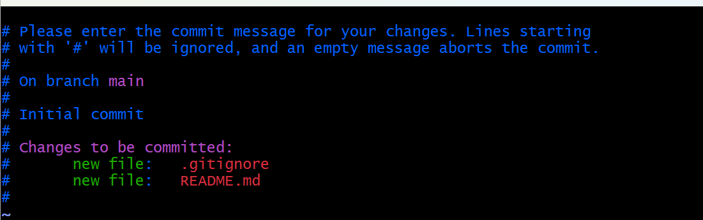
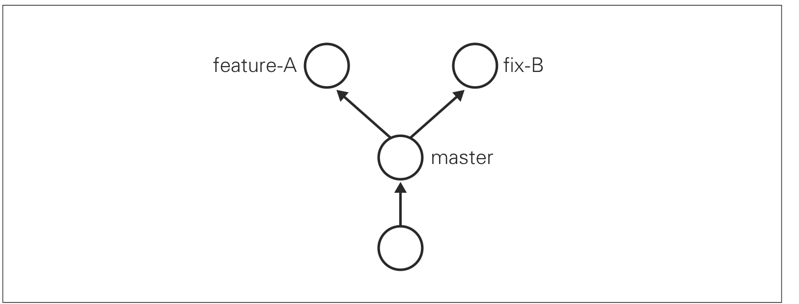

## 2.1 基础操作

​	


#### 2.1.1 git init ----初始化仓库

​	在本地项目中，要使用Git进行版本管理，必须先初始化仓库。

```bash
git init
```

​	你在哪个目录里，这个目录就是被初始化的仓库。初始化成功后，该目录的下会生成一个隐藏的`.git`目录，这个`.git`目录里存储着管理当前目录内容所需的仓库数据。

​	在Git中，该目录中的内容称为“附属于该仓库的工作树”。文件的编辑等操作在工作树（即工作目录）中进行，然后记录到仓库中，以此管理文件的历史快照，如果想将文件恢复到原先的状态，可以调取仓库中之前的快照，在工作树中打开。

​	工作树又称工作目录（因为目录实际上是树形结构）

#### 2.1.2 git add

​	如果只是在工作树中创建了文件，该文件并不会被标记进入Git仓库的版本管理对象中。对于刚创建的文件，它的状态是`Untracked files`。

​	`git add`命令将其加入暂存区。加入暂存区后的文件，用`git status`命令会显示在`Changes to be commited:`（**将要提交的更改：**）中。

```bash
# 跟踪单个文件
git add filename 

# 跟踪所有文件
git add .
```

​	


#### 2.1.3 git status

​	`git status `命令用于查看仓库的状态，


#### 2.1.4 git commit

​	该命令可以将当前暂存区的文件实际保存到仓库的历史记录中。通过这些记录，可以在工作树中复原文件。

​	**用法一**：

```bash
git commit -m "First commit"
```

​	`-m`参数后的字符串用于描述本次提交的记录。

​	**用法二**：

```bash
git commit
```

​	直接commit，它会要求你输入本次提交记录的描述，一般在第一行开始输入。输入完成后按ESC ：wq退出



​	提交完的状态：

```bash
$ git status
On branch main
Your branch is up to date with 'origin/main'.

nothing to commit, working tree clean
```


#### 2.1.5 git log

​	该命令可以查看以往仓库中提交的日志。日志里记录了`git commit`

```bash
$ git log
commit a182a9d2f5411d8ce4fb5fd1d325b7b6ac4f4ebd (HEAD -> main, origin/main)
Author: tww <tianweiweiyy@gmail.com>
Date:   Fri Jan 30 15:57:48 2026 +0800

    projects initial commit

```

​	**只显示指定目录、文件的日志**

```bash
git log README.md
```

​	在`git log`后面加上目录名，就只会显示该目录下的日志。

​	**显示文件的改动**

​	想查看提交所带来的改动，可以加上`-p` 参数，文件的前后差别就会显示在提交信息后。还可以在后面加上指定文件，查看提交前后的区别。

```bash
git log -p
//
git log -p FILENAME
```

​	

#### 2.1.6 git diff

​	`git diff`命令可以查看工作树、暂存区，最新提交之间的区别。如果没有区别什么都不会输出

​	现在我在README中写点新东西。也就是处于未跟踪状态。执行`git diff`命令。

```bash
$ git diff
warning: in the working copy of 'README.md', LF will be replaced by CRLF the next time Git touches it
diff --git a/README.md b/README.md
index 285c212..d502e9b 100644
--- a/README.md
+++ b/README.md
@@ -1 +1,5 @@
 ## ## 测试测试
+
+
+
+#TEST GIT DIFF
```

​	由于现在还未跟踪状态，不在暂存区。只会显示工作树和最新提交的差别。

- diff信息头：`diff --git a/旧文件路径 b/新文件路径`

- --- : 原始文件（旧版本）的标识

- +++：新文件（当前版本）的标识

- `@@ -1 +1,5`：`@@ -旧文件起始行,旧文件行数 +新文件起始行,新文件行数 @@`

- 实际变更内容：

- **符号含义**：

  **（无符号）**：**未改变的行**（显示为上下文）

  - `## ## 测试测试`：这一行没有改变

  - **`+`**：**新增的行**
    - 第1个`+`：新增了一个空行
    - 第2个`+`：新增了第二个空行
    - 第3个`+`：新增了第三个空行
    - `+#TEST GIT DIFF`：新增了内容为`#TEST GIT DIFF`的

  - **红色**：删除的行（以 `-` 开头）
  - **绿色**：新增的行（以 `+` 开头）
  - **白色**：未改变的行（上下文）


 **1. 查看工作树和最新提交的差别**

​	要查看与最新提交的差别，执行以下命令

```bash
git diff HEAD
```

​	**HEAD是指向当前分支中最新一次提交的指针**。


## 2.2 分支

​	可以从`master`分支中创建（fork）A分支和B分支后，每个分支都在自己的的代码上进行工作。`master 或main`分支是Git默认创建的分支。基本上所有开发都是以这个分支为中心进行的。



​	不同的分支中，可以同时进行完全不同的作业。等该分支的作业完成后再与master分支合并。


#### 2.2.1 git branch--显示分支列表

​	git branch命令可以将分支名列表显示，同时可以确认当前所在分支。

```bash
$ git branch
* main
```

​	`main`分支左侧标有**"\*"**号，表示当前所在的分支，也就是说，当前我们正在master分支下进行开发。结果中么有显示其他分支。表示仓库只有`main`一个分支。

​	


#### **2.2.2 git checkout -b**  -- 创建并切换分支

​	以当前的`main`分支为基础创建新的分支，使用`git checkout -b`命令。

​	执行下面的命令，创建名为`freature-A`的分支,同时会切换到所创建的分支中

```bash
TIAN@ThinkBook16 MINGW64 ~/Desktop/Teaching/TeachingRepository (main)
$ git checkout -b feature-A
Switched to a new branch 'feature-A'
TIAN@ThinkBook16 MINGW64 ~/Desktop/Teaching/TeachingRepository (feature-A)
$
```

​	下面两条命令可以起到同样的效果

```bash
git branch feature-A //创建分支
git checkout feature-A //切换分支
```

​	`git add 和git commit`等操作会提交的当前所在分支中。但此时该分支还没有关联远程仓库，所以需要关联远程仓库后才能进行`git push`操作

​		

#### 2.2.3 git checkout 切换分支

​	`git checkout 分支名`可以切换到指定分支，不同分支的修改不会互相影响。

​	或`git checkout -`切换到上一个使用时的分支。

