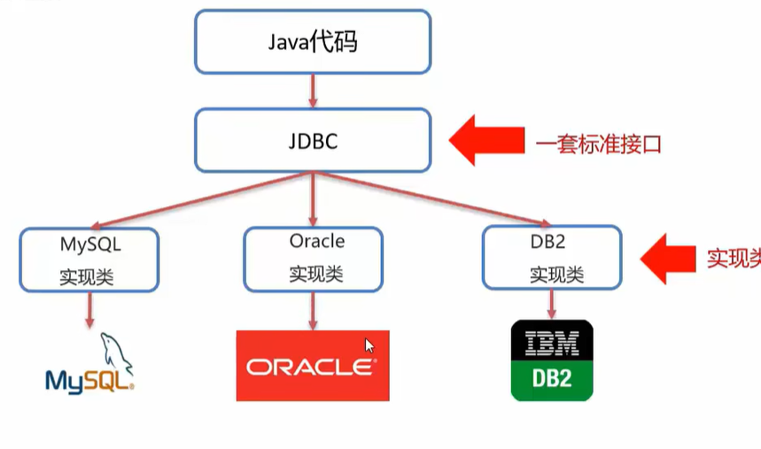
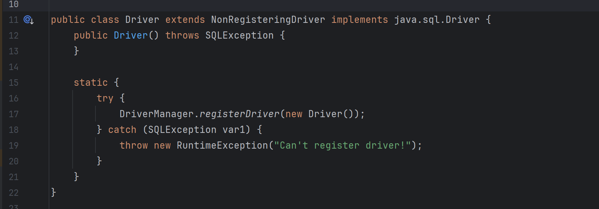
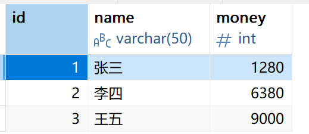

## 7.1 JDBC API概述

​	**JDBC（Java DataBase Connectivity）**是Java提供的一套操作关系型数据库的API。全称Java数据库连接。`JDBC`定义了一套标准接口，该接口由不同的数据库各种实现自己的实现类，从而操作对应的数据库。

​										

​	官方定义的一套才熬制所有关系型数据库的规则，即接口，各数据库厂商去实现这套接口 ，提供数据库驱动`jar`包。我们在使用这套接口时，真正执行代码的其实是驱动`jar`包中的实现类


## 7.2 JDBC快速入门

​	在JAVA项目中导入对应的驱动`jar`包后。

1. 注册驱动

```java
   Class.forName("com.mysql.jdbc.Driver");
//里面的类名是固定的 
```

2. 获取连接

```java
     //连接数据库
        String url = "jdbc:mysql://127.0.0.1:3306/teaching" ; //数据库地址
        String username = "root"; //用户名
         String passwd  = "119034";   // 密码
        Connection conn = DriverManager.getConnection(url,username,passwd);


```

​	JDBC URL的格式是：jdbc:mysql://主机名:端口号/数据库名。这里主机名是本地换回测试地址，端口号默认为3306，可以省略。本地地址可以使用`localhost`代替。

3. 定义SQL语句

```java
   //定义Sql语句
	 String UpDataSql = "update account SET money = 5000 WHERE name = '张三'";
```

4. 获取执行SQL对象

```java
        // 获取执行Sql的对象Statement
        Statement stat  =  conn.createStatement();
```

5. 执行SQL

```java
        //执行Sql
        int count = stat.executeUpdate(sql); //该方法会返回受影响的行
```

​	注意，这里的方法名是`executeUpdate`，意思是执行更新，所以这条Sql语句只能是更新操作。删除、增加、修改都属于更新操作。

6. 处理返回结果

```java

        // 处理结果
        System.out.println("该语句受影响的行："+count);
```

7. 释放资源

```java
        //释放资源
        conn.close();
        stat.close();
```


## 7.3 DriverManager

​	DriverManager（驱动管理类）的作用有**注册驱动、获取数据库连接**。这个类属于工具类，包含大量静态方法。原先需要通过`Class.forName()`方法去注册驱动。

```java
Class.forName("com.mysql.cj.jdbc.Driver");
```

​	该方法可以加载并链接指定的类，由于Driver类中有静态代码快，所以这一步操作就是加载驱动。



​	在静态代码块中，可以看到`DriverManager.registerDriver(new Driver())`；这行代码，这才是真正执行加载驱动的代码。

​	不过在JDBC5之后，可以省略掉`Class.forName()`这种方式来加载驱动了。


​	`DriverManager`中的静态方法`getConnection`可以建立连接，下面是它的方法签名：

```java
static Connection getConnection(String url,String user,String password)
```

​	参数：

1. url：连接路径

   语法：`jdbc::mysql://ip地址(域名):端口号/数据库名称?参数键值对1&参数键只对2`

   示例：`jdbc::mysql//127.0.0.1:3306/db1`

​	如果是连接的本机Mysql服务器，并且mysql服务默认端口是3306，则url可以简写为：`jdbc::mysql://数据库名称`

2. user:用户名
3. password:密码


## 7.4 Connection

​	Connection用作连接数据库，主要有两个功能：

1. 获取执行SQL的对象	
   - 普通执行SQL对象

```java
Statement createStatement()
```

- 预编译SQL的执行SQL对象：防止SQL注入

```java
PreparedStatement prepareStatement(sql)
```


2. **管理事务**

​	在Mysql中，事务是一个有原子性的操作，要么执行，要么不执行。Mysql默认自动提交事务。

​	`Connection`借口中定义了3个对应的方法

```java
开启事务：setAutoCommit(boolean autoCommit): true为自动提交事务；false为手动提交事务，即开启事务。
提交事务：commit();
回滚事务：rollback();
```

​	示例代码：

```java
    public static void main(String[] args) throws Exception {


        //连接数据库
        String url = "jdbc:mysql:///school"; //数据库地址
        String username = "root"; //用户名
        String passwd  = "119034";   // 密码
        Connection conn = DriverManager.getConnection(url,username,passwd);

        //定义Sql语句
        String UpDataSql = "update account SET money = 2000 WHERE id = 1";
        String UpDataSql2 = "update account SET money = 5000 WHERE id = 2";

        // 获取执行Sql的对象Statement
        Statement stat  =  conn.createStatement();

        //开启事务

        try{
            conn.setAutoCommit(false);
            int count = stat.executeUpdate(UpDataSql); //该方法会返回受影响的行
            System.out.println("该语句受影响的行："+count);
            int i = 3/0;
            int count1 = stat.executeUpdate(UpDataSql2); //该方法会返回受影响的行
            System.out.println("该语句受影响的行："+count1);
            //提交事务。
            conn.commit();
        }catch(Exception e){
            //回滚事务
            conn.rollback();
            System.out.println("事务已回滚");
        }
        //释放资源
        conn.close();
        stat.close();
    }
```


## 7.5 Statement

​	  该API只有一个作用：执行SQL语句。

```java
int executeUpdate(sql) //执行DML、DDL语句
```

​	该方法用于执行：DML数据操作语句，操作语句包括`INSERT 、UPDATA和DELETE`等操作。当使用DML语句时，会返回该语句影响的行数。DDL数据定义语言，包括`CREATE 、ALTER和DROP`3个语句。DDL语句执行成功也可能返回0。

```java
ResultSet executeQuery(sql)  //执行DQL语句
```

​	用于执行查询语句，返回值：ResultSet结果集对象。


## 7.6 ResultSet

​	ResultSet是DQL语句查询后的结果，通常为一个表，现在，我们从数据库中查询出一张表：

​                                        

​		ResultSet使用一个游标，该游标默认指向第一行，即表头（字段那一行）

```java
boolean next();
	将光标从当前位置向前移动一行。如果返回true，则该行为有效行（有数据），反之为无效行（没有数据）
```

```java
xxx getXxx(参数): 获取数据
    xxx:数据类型，如：int getInt(参数); String getString(参数);
参数：
   - int : 列的编号，从1开始
   - String: 列的名称
```

​	我们可以使用这个方法从数据库中得到数据,下面是示例：

```java
    //定义查询Sql语句
        String DQL_SQL = "SELECT * FROM account";

        // 获取执行Sql的对象Statement
        Statement stat  =  conn.createStatement();

        ResultSet set =stat.executeQuery(DQL_SQL);
        System.out.println("id\tname\tmoney\t");
        while(set.next()){
            System.out.println(set.getInt(1)+"\t"+set.getString("name")+"\t"+set.getString("money"));
       	}
```


## 7.7 PreparedStatement

​	该API可以预编译SQL语句并执行；预防SQL注入问题。

​	SQL注入：SQL注入是通过操作输入来修改事先定义好的SQL语句，达到执行代码对服务器进行攻击的方法。比如，下面有一段完成用户登录的查询语句：

```java
select * from tb_user where username = 'zhangsan' and password = '123';
```

​	现在我们进行普通登录的实现：

```java
      String username = "wehuhq";

        String userPasswd ="' or '1' = '1";

        Statement stat = conn.createStatement();
        //定义SQL语句
        String Sql = "select * from user where username = '"+username+"' AND password = '"+userPasswd+"'";
        System.out.println(Sql);
        ResultSet result = stat.executeQuery(Sql);

        if(result.next())
            System.out.println("登录成功");
        else
            System.out.println("登录失败");

```

​	SQL注入通过字符串拼接，将这条查询语句的后面在加一个后置条件，判断1=1。那么结果必然为真，不管用户名怎样。

```java
被注入后的SQL
select * from user where username = 'wehuhq' AND password = '' or '1' = '1'
```

​	所以`PreparedStatement`可以解决这个问题。下面我们来学习如何使用这个API；

​	第一步：获取`PreparedStatement`对象：

```java
//在参数的位置使用占位符？替代
String sql = "select * from user were username = ? AND password = ?";

//通过conn.prepareStatement(sql)方法获取
PreparedStatement pstmt = conn.prepareStatement(sql);
```

​	第二步：设置对应占位符的参数

```java
setXxx(参数1,参数2)： 给?赋值
    Xxx ：参数类型，如setInt(参数1，参数2)
  参数
	参数1：？的位置编号，从1开始
    参数2：？的值
```

​	第三步：执行SQL

```java
pstmt.excuteUpdate(); / excuteQuer();
```

​	程序示例：

```java
  String username = "张三";

        String userPasswd ="123456";

        Statement stat = conn.createStatement();
        //定义SQL语句
        String sql  = "select * from user Where username = ? AND password = ?";
        PreparedStatement pre =  conn.prepareStatement(sql);
        //设置占位符?的参数
        pre.setString(1,username);
        pre.setString(2,userPasswd);

        ResultSet result = pre.executeQuery();

        if(result.next())
            System.out.println("登录成功");
        else
            System.out.println("登录失败");


```

​	`PreparedStatement`的好处：

1. 预编译SQL，性能更高；
2. 放置SQL注入：将敏感字符进行转义

​	不过，预编译功能是自动关闭的，要想开启它，需要在连接时将url加上：

```java
String url = String url = "jdbc:mysql:///teaching&useServerPrepStmts=true"
```


## 7.8 数据库连接池

​	数据库连接池是一个容器，负责分配、管理数据库连接（`Connection`），**它允许应用程序重复使用一个现有的数据库连接、而不是再重新建立一个**

​	数据库连接池实现的标准接口是：**`DataSource`**。是由Sun公司官方提供的标准接口，由第三方组织实现次接口。

```java
Connection getConnection()
```

​	常见的数据库连接池有：

- DBCP
- C3D0
- Druid

其中，Druid（德鲁伊）是阿里巴巴开源的数据库连接池项目，功能强大，性能优秀。

​	我们可以使用Maven进行管理这个依赖：

```xml
<!-- Source: https://mvnrepository.com/artifact/com.alibaba/druid -->
<dependency>
    <groupId>com.alibaba</groupId>
    <artifactId>druid</artifactId>
    <version>1.2.28</version>
    <scope>compile</scope>
</dependency>
```

​	`properties`文件是Java里的轻量级配置文件，里面以`key = value`的形式存储参数。可以通过这个文件对`Druid`连接池的参数进行设置，下面是示例：

```properties
driverClassName = com.mysql.cj.jdbc.Driver
url = jdbc:mysql://localhost:3306/teaching?useServerPrepStmts=true
username = root
password = 119034
# 初始化连接数量
initialSize = 5
# 最大连接数
maxActive = 10
# 最大等待实现
maxWait = 3000
```

​	下面是使用连接池的代码示例：

```java
    public static void main(String[] args) throws Exception {

        //获取连接池对象
        Properties prop = new Properties();

        System.out.println(System.getProperty("user.dir"));

        prop.load(new FileInputStream("StudentManageSystem/src/druid.properties"));
        DataSource dataSource = DruidDataSourceFactory.createDataSource(prop);

        //获取数据库连接
        Connection connection = dataSource.getConnection();

        System.out.println(connection);
    }
```


