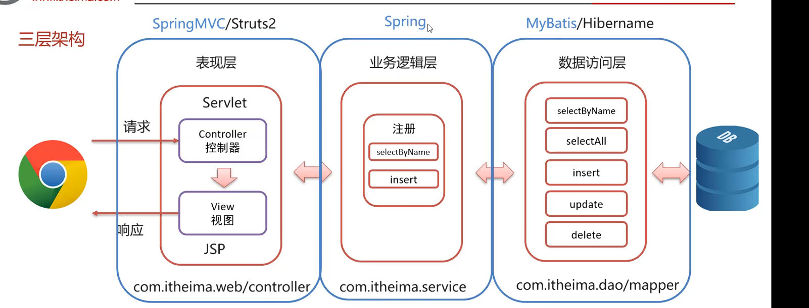

## 10.1 JSP(Java Server Pages)

​	JSP是一种动态的网页技术，其中既可以定义HTML、JS、CSS等静态内容，还可以定义`Java`代码的动态内容。

例：

```jsp
<%@ page contentType="text/html;charset=UTF-8" language="java" %>
<html>
<head>
    <title>Title</title>
</head>
<body>
  <h1>JSP,Hello,World</h1>

  <%
    System.out.println("hello,jsp");
  %>
</body>
</html>

```

​	它可以使Java代码嵌入到网页中。

​	

​	JSP技术相对于2026年来说，过于陈旧，现代化的开发中使用前后端分离的开发模式，由后端处理数据，前端渲染页面，这种在网页中写后端代码的模式已经不再受欢迎。

​	


## 10.2 MVC模式

 	MVC是一种分层的开发模式，其中：

- M: Model，业务模型，处理业务
- V:View ，视图，界面暂时
- C: Controller,控制器，处理请求，调用模型和视图。

​	

​	三层架构：

- 数据访问层：对数据库的CRUD基本操作，在项目结构中表现为: 包名`dao或mapper`
- 业务逻辑层：对业务逻辑进行封装，组合数据访问层层中基本功能，形成复杂的业务逻辑功能。包名：`service`
- 表现层：接受请求，封装数据，调用业务逻辑层，响应数据




​	