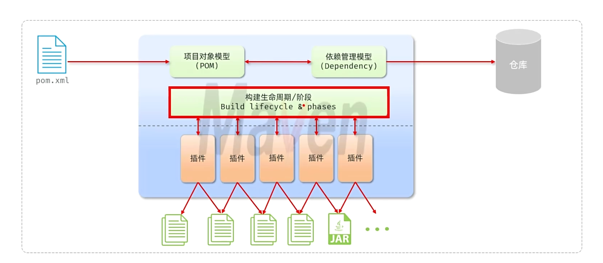
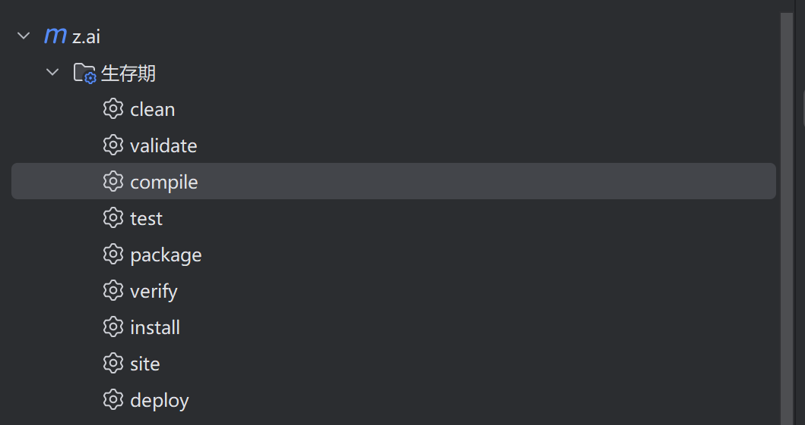
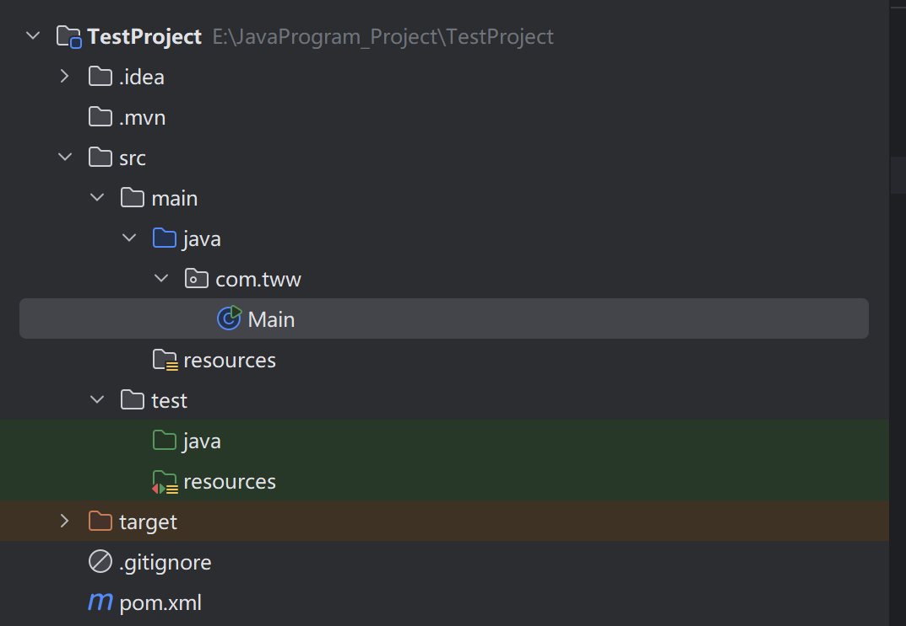
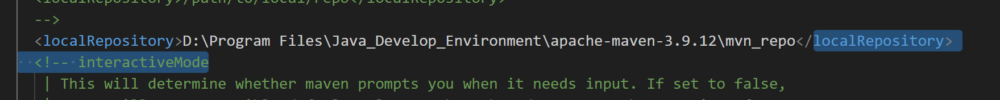
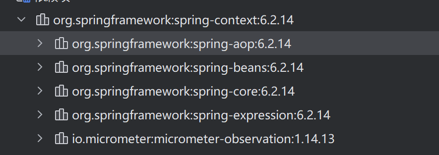
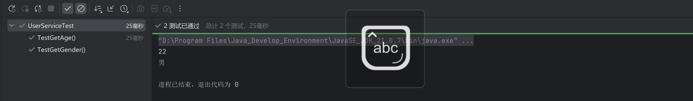
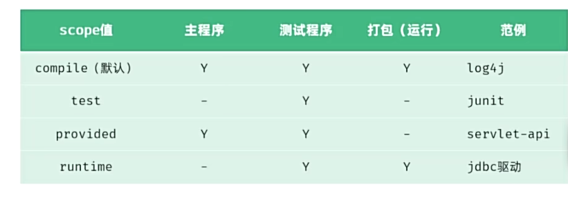
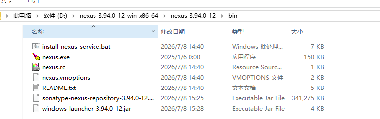

## 1.1 Maven

​	**Maven是管理和构建Java项目的工具**，是`apache`旗下的一个开源项目。

​	Maven的主要作用：依赖管理（jar包）、项目构建、统一的项目结构



#### 1.1.1 依赖管理

​	在之前，开发Java项目时，如果想要使用一些第三方的jar包，需要到对应的官网上下载，再到项目目录中创建一个lib文件夹，然后将jar包放在将lib文件夹内，才能使用

​	现在，使用Maven，可以很方便的导入jar包。比如如下：

```xml
<dependency>
	<groupId>commons-io</groupId>
    <artifactId>commons-io</artifactId>
    <version>2.11.0</version>
</dependency>
```

​	通过一个**POM.xml（Project Object Model 项目对象模型）文件**，声明这几段标签。Maven可以自动下载jar包，极大的优化了开发者的效率


#### 1.1.2 标准化项目构建

​	Maven提供了一些指令来帮助开发者进行编译、测试、打包以及发布等操作。在IDEA中打开Maven面板就可以看到。



- clean: 清理前一次构建生成的文件。
- validate: 验证项目是否正确且所有必要信息可用。
- compile: 编译项目的源代码。
- test: 使用单元测试框架测试编译后的代码，测试不需要打包或部署。
- package: 将编译后的代码打包成可分发的格式，如JAR、WAR。
- verify: 对集成测试的结果进行检查，以确保质量达标。
- install: 将包安装到本地仓库，供本地其他项目使用。
- site: 生成项目站点文档。
- deploy: 在构建环境中，将最终的包复制到远程仓库，供其他开发人员或项目共享。


#### 1.1.3 统一的项目结构

​	只要使用Maven构建的项目，目录结构都是统一的，可以跨平台使用




#### 1.1.4 Maven本地仓库的配置

1. 第一步，从官网中下载`bin`版本。
2. 再Maven文件夹中创建`mvn_repo`作为本地仓库文件夹。
3. 复制`mvn_repo`文件夹路径
4. 打开conf文件夹，修改`settings.xml`文件夹
5. 找到` <localRepository>/path/to/local/repo</localRepository>`
6. 将mvn_repo文件夹路径复制到该标签中，并移出注释。如下



​	

#### 1.1.5 配置阿里云的Maven私服

​	由于中央仓库在国外，有些jar包不一定能下载成功，还很缓慢，所以可以使用国内的私服。

​	同样的修改`settings.xml`文件，找到`<mirrors>`标签，将阿里云的私服标签复制进去

```xml
<mirror>
  <id>aliyunmaven</id>
  <mirrorOf>*</mirrorOf>
  <name>阿里云公共仓库</name>
  <url>https://maven.aliyun.com/repository/public</url>
</mirror>
```

​	要想在任意目录下使用Maven，就需要配置环境变量


## 1.2 POM文件解析

​	POM.xml是Maven的核心

```xml
<?xml version="1.0" encoding="UTF-8"?>
<project xmlns="http://maven.apache.org/POM/4.0.0"
         xmlns:xsi="http://www.w3.org/2001/XMLSchema-instance"
         xsi:schemaLocation="http://maven.apache.org/POM/4.0.0 http://maven.apache.org/xsd/maven-4.0.0.xsd">
    
    ......
    
</project>
```

1. <?xml version="1.0"?> - 声明使用XML 1.0标准                                                                                                                                             
2. encoding="UTF-8" - 指定文件使用UTF-8字符编码     	
3. `<project></project`是POM文件的根元素，其他所有标签都写在这个标签里面
4. **`xmlns` 等**：声明 POM 的命名空间和 XML Schema，确保 Maven 能正确解析文件。

```xml

	<modelVersion>4.0.0</modelVersion>

    <groupId>org.example</groupId>
    <artifactId>z.ai</artifactId>
    <version>1.0-SNAPSHOT</version>
    <packaging>jar</packaging>
```

​	上面这些标签用来描述当前项目的信息

- **`<modelVersion>`**：POM 模型的版本，Maven 2 及以后固定为 `4.0.0`。
- **`<groupId>`**：项目所属组织的唯一标识，通常采用反向域名，如 `com.example`。
- **`<artifactId>`**：项目的唯一名称，对应构建产物的文件名（如 `my-app.jar`）。
- **`<version>`**：项目版本号，`SNAPSHOT` 表示开发中的不稳定版本。`RELEASE`表示功能趋于稳定，可以发行的版本
- **`<packaging>`**：项目的打包方式，常见值：`jar`（默认）、`war`、`pom`（父模块）等。

```xml
<properties>
    <maven.compiler.source>11</maven.compiler.source>
    <maven.compiler.target>11</maven.compiler.target>
    <project.build.sourceEncoding>UTF-8</project.build.sourceEncoding>
</properties>
```

​	这些也是用来描述当前项目的信息

- **`<maven.complier.source>`** ：基于JDK哪个版本开发
- **`<maven.complier.target>`**：最终运行的时候基于哪个版本运行
- **` <project.build.sourceEncoding>`** ：当前项目的字符集

​	上面介绍的这些标签，都属于`Project Object Model`**POM**的范围。


#### 1.2.1 Dependency （依赖管理模型）

​	依赖信息统一写进`<dependencies>`标签中，用来描述当前项目的依赖信息。

```xml
<dependencies>
		
        <dependency>
            <groupId>commons-io</groupId>
            <artifactId>commons-io</artifactId>
            <version>2.14.0</version>
        </dependency>
    
          <!-- 3. 日志实现 -->
        <dependency>
            <groupId>org.slf4j</groupId>
            <artifactId>slf4j-simple</artifactId>
            <version>2.0.17</version>
            <scope>runtime</scope>
        </dependency>

</dependencies>
```

​	一个依赖管理模型可以写入多个依赖的信息。

​	依赖通过仓库进行下载。它首先会在本地仓库中寻找该jar包，如果本地仓库没有，就会到中央仓库中下载。 

​	


## 1.3 依赖管理

​	依赖：指当前项目运行所需要的`jar`包，一个项目中可以引入多个依赖。

​	配置：

1. 在`pom.xml`中编写`<dependencies>`标签
2. 在`<dependencies>` 标签中，使用`<dependency>`引入坐标
3. 定义坐标的`gropId,artifactId,version`
4. 点击Maven刷新

​	例如：

```xml
     <dependency>
            <groupId>org.springframework</groupId>
            <artifactId>spring-context</artifactId>
            <version>6.2.14</version>
        </dependency>
```

​	如果导入的依赖还需要其他的依赖运行，则会自动导入其他依赖，这叫做**依赖传递**



#### 1.3.1 排除依赖

​	如果不想要某个依赖，可以使用`<exclusion>` 来指定要排除哪个依赖。比如

```xml
<dependency>
            <groupId>org.springframework</groupId>
            <artifactId>spring-context</artifactId>
            <version>6.2.14</version>
            <scope>compile</scope>

            <exclusions>
                <exclusion>
                    <groupId>io.micrometer</groupId>
                    <artifactId>micrometer-commons</artifactId>
                </exclusion>
            </exclusions>
        </dependency>
```

​	被排除的依赖不需要指定版本


#### 1.3.2 可选依赖

​	默认依赖的依赖是可以传递的，可以通过`<optional>`来关闭这样的行为。

```xml
        <!-- MyBatis本体 -->
        <dependency>
            <groupId>org.mybatis</groupId>
            <artifactId>mybatis</artifactId>
            <version>3.5.19</version>
            <optional>true</optional>
        </dependency>
```

​	mybaits包将被阻止传递到依赖当前项目的下游项目中


#### 1.3.3 聚合

​	聚合：将多个模块组织称一个整体，同时进行项目构建的过程称为聚合。

​	聚合工程：通常是一个不具有业务功能的“空工程”（有且仅有一个pom文件）

​	作用：使用聚合工程可以将多个工程编组，通过对聚合工程进行构建，实现对所包含的模块进行同步构建

​	下面是聚合工程的pom文件：

```xml
<project xmlns="http://maven.apache.org/POM/4.0.0" xmlns:xsi="http://www.w3.org/2001/XMLSchema-instance"
  xsi:schemaLocation="http://maven.apache.org/POM/4.0.0 http://maven.apache.org/maven-v4_0_0.xsd">
  <modelVersion>4.0.0</modelVersion>
  <groupId>com.tww</groupId>
  <artifactId>maven_parent</artifactId>
  <version>1.0-SNAPSHOT</version>

  <!-- 聚合工程打包方式设置为pom -->
  <packaging>pom</packaging>
  <name>maven_parent Maven Webapp</name>

<!--  设置管理的模块名称-->
  <modules>
    <module>../dao</module>
    <module>../entity</module>
    <module>../Spring_mvc_quickstart</module>
  </modules>
</project>

```

​	设置聚合工程后，可以在maven管理中该工程有root标记


#### 1.3.4 继承

​	继承描述的是两个工程间的关系，子工程可以继承父工程的配置信息，常见于依赖关系的继承。可以简化重复的配置信息，减少版本冲突。子工程要想继承父工程，需要在子工程里面描述坐标：

```xml
  <parent>
    <groupId>com.tww</groupId>
    <artifactId>maven_parent</artifactId>
    <version>1.0-SNAPSHOT</version>
    <relativePath>../maven_parent/pom.xml</relativePath> <!--父工程pom文件位置-->
  </parent>
```

​	子工程就可以继承父工程里的`dependencies`里面的全部依赖

​	

​	如果出现一个依赖，部分子工程要用，部分子工程不用。则可以使用依赖管理

```xml
<!--  定义依赖管理-->

  <dependencyManagement>
    <dependencies>
      <dependency>
        <groupId>junit</groupId>
        <artifactId>junit</artifactId>
        <version>4.13.1</version>
        <scope>test</scope>
      </dependency>
    </dependencies>
  </dependencyManagement>
```

​	处于依赖管理的依赖，不会强制继承到子工程。如果子工程需要使用这个依赖，则需手动声明，注意，不要声明版本

```xml
  <dependency>
      <groupId>junit</groupId>
      <artifactId>junit</artifactId>
      <scope>test</scope>
    </dependency>
```

​	版本由父工程统一管理。


​	下面是一个父工程的例子，父工程的依赖一般拥有大部分子工程需要的依赖，只要继承它就可以使用

```xml
<project xmlns="http://maven.apache.org/POM/4.0.0" xmlns:xsi="http://www.w3.org/2001/XMLSchema-instance"
  xsi:schemaLocation="http://maven.apache.org/POM/4.0.0 http://maven.apache.org/maven-v4_0_0.xsd">
  <modelVersion>4.0.0</modelVersion>


  <groupId>com.tww</groupId>
  <artifactId>maven_parent</artifactId>
  <version>1.0-SNAPSHOT</version>

  <!-- 聚合工程打包方式设置为pom -->
  <packaging>pom</packaging>
  <name>maven_parent Maven Webapp</name>

<!--  设置管理的模块名称-->
  <modules>
    <module>../dao</module>
    <module>../entity</module>
    <module>../Spring_mvc_quickstart</module>
  </modules>

  <properties>
    <maven.compiler.source>17</maven.compiler.source>
    <maven.compiler.target>17</maven.compiler.target>
    <project.build.sourceEncoding>UTF-8</project.build.sourceEncoding>
    <!-- 统一管理所有 Spring 模块版本 -->
    <spring-framework.version>6.1.14</spring-framework.version>
  </properties>

  <dependencies>

    <!-- Spring MVC 6.x (Jakarta EE 9+，兼容 Tomcat 10.x) -->
    <dependency>
      <groupId>org.springframework</groupId>
      <artifactId>spring-webmvc</artifactId>
      <version>${spring-framework.version}</version>
    </dependency>
    <!-- Jakarta Servlet API (Tomcat 10 已内置，设为 provided) -->
    <dependency>
      <groupId>jakarta.servlet</groupId>
      <artifactId>jakarta.servlet-api</artifactId>
      <version>6.0.0</version>
      <scope>provided</scope>
    </dependency>

    <dependency>
      <groupId>com.fasterxml.jackson.core</groupId>
      <artifactId>jackson-databind</artifactId>
      <version>2.19.2</version>
    </dependency>


    <!-- MyBatis 与 Spring 的整合桥接 -->
    <dependency>
      <groupId>org.mybatis</groupId>
      <artifactId>mybatis-spring</artifactId>
      <version>3.0.4</version>  <!-- 配合 MyBatis 3.5.x 和 Spring 6.x 使用 -->
    </dependency>


    <dependency>
      <groupId>com.alibaba</groupId>
      <artifactId>druid</artifactId>
      <version>1.2.23</version>
    </dependency>

    <!-- Source: https://mvnrepository.com/artifact/org.springframework/spring-jdbc -->
    <dependency>
      <groupId>org.springframework</groupId>
      <artifactId>spring-jdbc</artifactId>
      <version>${spring-framework.version}</version>
    </dependency>

    <dependency>
      <groupId>com.mysql</groupId>
      <artifactId>mysql-connector-j</artifactId>
      <version>9.3.0</version>
    </dependency>


    <dependency>
      <groupId>org.springframework</groupId>
      <artifactId>spring-test</artifactId>
      <version>${spring-framework.version}</version>
      <scope>test</scope>
    </dependency>

  </dependencies>

<!--  定义依赖管理-->

  <dependencyManagement>
    <dependencies>
      <dependency>
        <groupId>junit</groupId>
        <artifactId>junit</artifactId>
        <version>4.13.1</version>
        <scope>test</scope>
      </dependency>
    </dependencies>
  </dependencyManagement>
</project>

```

​	

#### 1.3.5 属性

​	 下面介绍如何在pom中定义一个属性：

```xml
<!-- 定义属性-->
	<properties>
    <maven.compiler.source>17</maven.compiler.source>
    <maven.compiler.target>17</maven.compiler.target>
    <project.build.sourceEncoding>UTF-8</project.build.sourceEncoding>
    <!-- 统一管理所有 Spring 模块版本 -->
    <spring-framework.version>6.1.14</spring-framework.version>
  </properties>
```

​	上面定义了四个属性，分别是`maven.comiler.source、maven.compiler.target、project.build.sourceEncoding、spring-framework.version`。要想引用也很简单，使用如下格式：

​	`${属性名}`

​	如：

```xml
 <dependency>
      <groupId>org.springframework</groupId>
      <artifactId>spring-jdbc</artifactId>
      <version>${spring-framework.version}</version>
    </dependency>
```

​	属性适合做统一版本管理。


#### 1.3.6 资源文件中加载pom属性

​	资源文件中可以去引用pom的一些版本属性，方便版本管理，第一步。在pom中定义属性：

```xml
  <properties>
    <!-- 统一管理所有 Spring 模块版本 -->
    <spring-framework.version>6.1.14</spring-framework.version>
  </properties>
```

​	第二步，让Maven在打包时，扫描并替换文件中的\${}占位符。

```xml
<build>
    <resources>
        <resource>
            <!-- 匹配相对路径 -->
            <directory>src/main/resources</directory>
            <filtering>true</filtering>
            <!-- 只针对文本文件进行过滤，避免图片、字体等二进制文件损坏 -->
            <includes>
                <include>**/*.properties</include>
                <include>**/*.yml</include>
                <include>**/*.yaml</include>
                <include>**/*.xml</include>
            </includes>
            <!-- 继承自父POM的编码，但也可以显式写上确保万无一失 -->
            <encoding>UTF-8</encoding>
        </resource>
    </resources>
</build>
```

​	外部`properties`使用占位符表示属性：

```properties
spring-framework.version=#{spring-framework.version}
```

​	注意，该过滤配置，只适用于自己工程的`properties`文件。

​	

​	

#### 1.3.7 多环境开发 

​	通过下面的pom来配置多个环境

```xml
<profiles>

    <!-- 开发环境 -->
    <profile>
        <id>dev</id>

        <properties>
            <env>dev</env>
        </properties>

        <activation>
            <!-- 默认激活 -->
            <activeByDefault>true</activeByDefault>
        </activation>
    </profile>


    <!-- 测试环境 -->
    <profile>
        <id>test</id>

        <properties>
            <env>test</env>
        </properties>
    </profile>


    <!-- 生产环境 -->
    <profile>
        <id>prod</id>

        <properties>
            <env>prod</env>
        </properties>
    </profile>

</profiles>
```


## 1.4 Maven生命周期

​	Maven中有3套互相独立的生命周期：

- clean :清理工作
- default : 核心工作，如，编译、测试、打包、按照、部署等。
- site：生成报告、发布站点。

​	在同一套生命周期中，运行后面的阶段时，前面的阶段都会运行。


## 1.5 单元测试

​	测试：是一种用来促进鉴定软件的正确性、完整性、安全性和质量的过程。

​	阶段划分：单元测试、集成测试、系统测试、验收测试。


​	单元测试：就是针对最小的功能单元（方法），编写测试代码对其正确性进行测试

​	`JUnit` :  最流行的JAVA测试框架，提供了一些功能，方便程序进行单元测试。

```java
public class UserService {

    /**
     * 给定一个身份证号, 计算出该用户的年龄
     * @param idCard 身份证号
     */
    public Integer getAge(String idCard){
        if (idCard == null || idCard.length() != 18) {
            throw new IllegalArgumentException("无效的身份证号码");
        }
        String birthday = idCard.substring(6, 14);
        LocalDate parse = LocalDate.parse(birthday, DateTimeFormatter.ofPattern("yyyyMMdd"));
        return Period.between(parse, LocalDate.now()).getYears();
    }

    /**
     * 给定一个身份证号, 计算出该用户的性别
     * @param idCard 身份证号
     */
    public String getGender(String idCard){
        if (idCard == null || idCard.length() != 18) {
            throw new IllegalArgumentException("无效的身份证号码");
        }
        return Integer.parseInt(idCard.substring(16,17)) % 2 == 1 ? "男" : "女";
    }

}
```

​	下面编写单元测试代码对这两个方法进行测试。

​	第一步：导入依赖

```xml
        <dependency>
            <groupId>org.junit.jupiter</groupId>
            <artifactId>junit-jupiter</artifactId>
            <version>5.9.1</version>
        </dependency>
```

​	第二步：在test/java目录下编写测试类，并编写对应的测试方法，并在方法上声明@Test注解。一般约定，测试类的名字是要测试类的名字+Test

​	第三步：编写测试方法。测试方法的名字是对应方法的前面+test。方法声明必须@Test，方法被public修饰，返回值为void

```java
public class UserServiceTest {
        @Test
        public void TestGetAge(){
                Integer age = new UserService().getAge("522225200312119034");
                System.out.println(age);
        }

        @Test
        public void TestGetGender(){
                String gender = new UserService().getGender("522225200312119034");
                System.out.println(gender);
        }
}

```

​	第四步：点击运行。或点击Maven中的test




​	 

#### 1.5.1 断言

​	1. 普通断言

| 方法                                      | 说明                                               |
| :---------------------------------------- | :------------------------------------------------- |
| `assertEquals(expected, actual)`          | 判断两个值是否相等（对对象调用 `equals()` 比较）。 |
| `assertEquals(expected, actual, message)` | 可自定义失败信息。                                 |
| `assertNotEquals(unexpected, actual)`     | 判断两个值不相等。                                 |
| `assertSame(expected, actual)`            | 判断两个对象引用指向同一个对象（`==`）。           |
| `assertNotSame(unexpected, actual)`       | 判断两个对象引用不同。                             |
| `assertTrue(condition)`                   | 判断条件为 `true`。                                |
| `assertFalse(condition)`                  | 判断条件为 `false`。                               |
| `assertNull(object)`                      | 判断对象为 `null`。                                |
| `assertNotNull(object)`                   | 判断对象不为 `null`。                              |
| `fail(message)`                           | 直接使测试失败，常用于标记未完成的测试或异常分支。 |

**示例：**

java

```
@Test
void testAssertions() {
    assertEquals(5, calculator.add(2, 3), "加法结果应为5");
    assertTrue(list.isEmpty(), "列表应该为空");
    assertNotNull(user, "用户对象不应为null");
}
```


------

2. 数组断言

| 方法                                            | 说明                                           |
| :---------------------------------------------- | :--------------------------------------------- |
| `assertArrayEquals(expectedArray, actualArray)` | 判断两个数组内容是否相等（依次比较每个元素）。 |

**示例：**

java

```
@Test
void testArray() {
    int[] expected = {1, 2, 3};
    int[] actual = new int[]{1, 2, 3};
    assertArrayEquals(expected, actual);
}
```


------

3. 异常断言

| 方法                                     | 说明                                                         |
| :--------------------------------------- | :----------------------------------------------------------- |
| `assertThrows(expectedType, executable)` | 执行代码块，预期抛出指定类型的异常，返回异常对象供进一步断言。 |
| `assertDoesNotThrow(executable)`         | 执行代码块，预期不抛出任何异常。                             |

**示例：**

java

```
@Test
void testException() {
    Exception exception = assertThrows(IllegalArgumentException.class, 
        () -> userService.register(null));
    assertEquals("用户信息不能为空", exception.getMessage());
}

@Test
void testNoException() {
    assertDoesNotThrow(() -> userService.register(validUser));
}
```


------

4. 超时断言

| 方法                                              | 说明                                                         |
| :------------------------------------------------ | :----------------------------------------------------------- |
| `assertTimeout(duration, executable)`             | 在指定时间内执行完成，超时则失败（执行完成后才判断）。       |
| `assertTimeoutPreemptively(duration, executable)` | 在指定时间内执行完成，超时则立即中断执行并失败（在单独线程中运行）。 |

**示例：**

java

```
@Test
void testTimeout() {
    assertTimeout(Duration.ofMillis(100), 
        () -> Thread.sleep(50)); // 通过
    assertTimeoutPreemptively(Duration.ofMillis(100), 
        () -> Thread.sleep(200)); // 失败，超时立即中断
}
```


#### 1.5.2 注解

1. 核心测试注解

| 注解                 | 说明                                                         |
| :------------------- | :----------------------------------------------------------- |
| `@Test`              | 标记一个方法为测试方法。                                     |
| `@ParameterizedTest` | 标记一个方法为参数化测试，需要配合参数来源注解（如 `@ValueSource`）使用。 |
| `@RepeatedTest`      | 标记一个方法为重复测试，可指定重复次数。                     |
| `@TestFactory`       | 标记一个方法为动态测试工厂，返回 `DynamicNode` 实例（如 `Stream<DynamicTest>`）。 |
| `@TestTemplate`      | 用于定义测试模板，通常与 `@TestTarget` 等扩展结合使用。      |

------

2. 生命周期注解

用于在测试执行前后执行特定代码。

| 注解          | 说明                                                  |
| :------------ | :---------------------------------------------------- |
| `@BeforeEach` | 在每个测试方法执行前运行。                            |
| `@AfterEach`  | 在每个测试方法执行后运行。                            |
| `@BeforeAll`  | 在所有测试方法执行前运行一次（方法必须是 `static`）。 |
| `@AfterAll`   | 在所有测试方法执行后运行一次（方法必须是 `static`）。 |

------

3. 显示名称注解

控制测试类/方法在报告中的显示名称。

| 注解                     | 说明                                                         |
| :----------------------- | :----------------------------------------------------------- |
| `@DisplayName`           | 为测试类或方法声明一个自定义显示名称（支持空格、中文、表情等）。 |
| `@DisplayNameGeneration` | 使用 `DisplayNameGenerator` 生成显示名称，例如 `ReplaceUnderscores` 可将下划线替换为空格。 |


## 1.6 依赖范围

​	依赖的jar包，默认情况下，可以在任何地方使用。可以通过`<scope>...</scope>`设置起作用范围。

​	作用范围：

- 主程序范围有效（main文件夹范围内）
- 测试程序范围有效（test文件夹范围内）
- 是否参与打包运行（package指令范围内）

如:

```xml
        <dependency>
            <groupId>org.junit.jupiter</groupId>
            <artifactId>junit-jupiter</artifactId>
            <version>5.9.1</version>
            <scope>test</scope>
        </dependency>
```

​	使该jar包只在test文件夹内有效




## 1.7 私服介绍与安装

​	私服是替代中央服务器存放第三方jar包的地方，一般用于公司内部。

​	在下载完绿色版并解压后，放在不包含中文路径及空格的文件夹内。找到bin文件夹

​	

cmd运行下面这条命令

```cmd
nexus.exe run SonatypeNexusRepository
```

​	`nexus`解压完有两个文件夹，一个是`nexus-3.x`，一个是`sonatype-work`，其中`sonatype-work`是数据库和仓库，也就是实际存放第三方依赖的地方。

​	

​	

#### 1.7.1 仓库的分类

​	仓库主要可以分为三大类：

- 代理仓库（Proxy）：当一个依赖不在本地时，Nexus会向远程（如中央仓库）去下载，下载一次后， 它会把jar包缓冲到`blogs`目录里，下次再来访问，直接本地给。
- 托管仓库（Hosted）：存放自己团队（公司）开发的jar包，或者手动上传的第三方jar包（比如说中央仓库没有的）。
- 组仓库（Group）：把上面的多个代理仓库和托管仓库打包在一起，对外只暴露这一个组仓库的URL。开发者在`settings.xml`里配置这个组的地址，`Nexus`就会自动按顺序去找；先去托管理看有没有，没有就去代理下


#### 1.7.2 资源上传于下载

​	在上传于下载之前，首先需要配置一些东西，

第一步：先配置本地仓库`Maven`对私服的访问，找到`maven`里的`settings.xml`文件，找到`<servers>`标签

```xml
  <servers>
    <!-- server
     | Specifies the authentication information to use when connecting to a particular server, identified by
     | a unique name within the system (referred to by the 'id' attribute below).
     |
     | NOTE: You should either specify username/password OR privateKey/passphrase, since these pairings are
     |       used together.
     |
    <server>
      <id>deploymentRepo</id>
      <username>repouser</username>
      <password>repopwd</password>
    </server>
    -->

    <!--配置访问私服的权限-->
    <server>
      <id>maven-releases</id>
      <username>admin</username>
      <password>119034Nexus</password>
    </server>

    <server>
      <id>maven-snapshots</id>
      <username>admin</username>
      <password>119034Nexus</password>
    </server>

    <!-- Another sample, using keys to authenticate.
    <server>
      <id>siteServer</id>
      <privateKey>/path/to/private/key</privateKey>
      <passphrase>optional; leave empty if not used.</passphrase>
    </server>
    -->
  </servers>
```

​	id是私服仓库的名字。

第二步：配置私服路径，找到`<mirror>`标签

```xml
   <!--私服仓库组路径-->
    <mirror>
      <id>maven-public</id>
      <mirrorOf>*</mirrorOf>
      <url>http://localhost:8088/repository/maven-public/</url>
    </mirror>
```

第三步：到工程中pom文件去配置链接的私服

```xml
<!--  配置当前工程保存在私服中的具体配置-->
  <distributionManagement>
    <snapshotRepository>
      <id>maven-snapshots</id>
      <url>http://localhost:8088/repository/maven-snapshots/</url>
    </snapshotRepository>
  </distributionManagement>
```

​	现在，该工程使用`deploy`命令来把自己的jar包上传到私服的`maven-snapshots`库中


