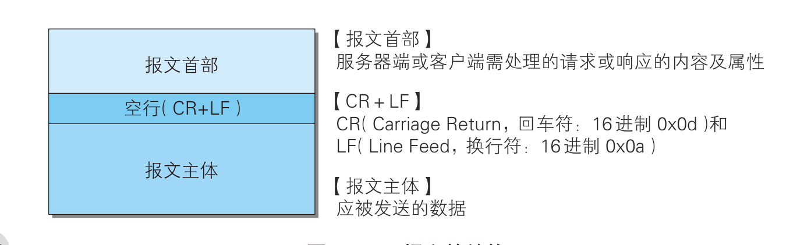
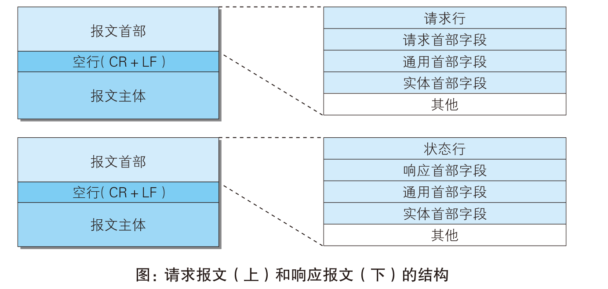
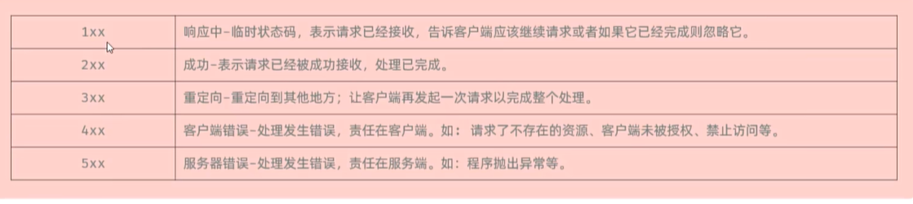
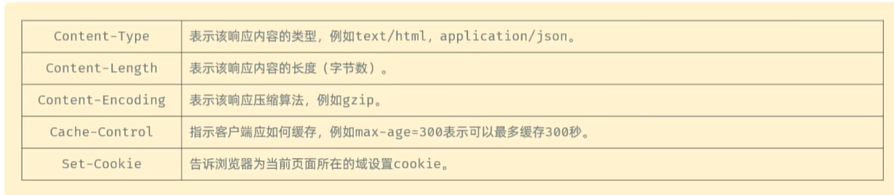

## 2.2 HTTP协议

 	**HTTP（`Hyper Test Transer Protocol`）, 超文本传输协议**，规定了浏览器和服务器之间数据传输的规则。

特点：

1. 基于TCP协议：面向连接，安全
2. 基于请求-响应模型的：一次请求对应一次响应
3. HTTP协议是无状态的协议：对于事务处理没有记忆能力。每次请求-响应都是独立的。
   1. 缺点：多次请求间不能共享数据
   2. 优点：速度快。


#### 2.2.1 HTTP报文

​	用于HTTP协议交换的信息被称为HTTP报文。请求端（客户端/网页端）的HTTP报文叫做请求报文，响应端（服务器端）的叫做响应报文。HTTP报文本身是由多行（用CR+LF做换行符）数据构成的字符串文本。

​	HTTP报文大致可分化报文首部和报文主题两块组成。通常，并不一定要有报文主体。



​	

#### 2.2.2 请求报文及响应报文的格式

​	我们来看一下请求报文和响应报文的格式：



```
GET /hello?name=tianweiwei HTTP/1.1    **请求行**
Accept: text/html,application/xhtml+xml,application/xml;q=0.9,image/avif,image/webp,image/apng,*/*;q=0.8,application/signed-exchange;v=b3;q=0.7
Accept-Encoding: gzip, deflate, br, zstd
Accept-Language: zh-CN,zh;q=0.9,en-GB;q=0.8,en-US;q=0.7,en;q=0.6
Connection: keep-alive
Host: localhost:8080
Sec-Fetch-Dest: document
Sec-Fetch-Mode: navigate
Sec-Fetch-Site: none
Sec-Fetch-User: ?1
Upgrade-Insecure-Requests: 1
User-Agent: Mozilla/5.0 (Windows NT 10.0; Win64; x64) AppleWebKit/537.36 (KHTML, like Gecko) Chrome/145.0.0.0 Safari/537.36
sec-ch-ua: "Not:A-Brand";v="99", "Google Chrome";v="145", "Chromium";v="145"
sec-ch-ua-mobile: ?0
sec-ch-ua-platform: "Windows"
```

1. 第一行GET表示请求方法。后面的字符串表示资源路径，HTTP/1.1是协议的版本。该行称为请求行。
2. 从第二行开始，以键值对开始，格式：`key:value`。称之为请求头。下面接收这些请求头的含义
3. Host：请求的主机名
4. User-Agent：浏览器的版本
5. Accept：表示浏览器能接收的资源类型。
6. Accept-Language：表示浏览器编好的语言，服务器可以据此返回不同的语言的网页
7. Accept-Encoding : 表示浏览器可以支持的压缩类型，如gzip，deflate等。
8. Content-Type : 请求主题的数据类型
9. Content-Length ：请求主体的大小（单位字节）
10. 请求体：POST请求，存放请求参数，用一个空行分隔


#### 2.2.3 请求数据的获取

​	Web服务器（Tomcat）对HTTP协议的请求数据进行分析，并进行了封装（`HttpServletRequest`），在调用`Controller`方法的时候传递给了该方法。

```java
package com.tww;

import jakarta.servlet.http.HttpServletRequest;
import org.springframework.web.bind.annotation.RequestMapping;
import org.springframework.web.bind.annotation.RestController;
import org.springframework.web.context.support.HttpRequestHandlerServlet;

@RestController
public class RequestController {


    @RequestMapping("/request")
    public String request(HttpServletRequest request){
        //1. 获取请求方式
        String method = request.getMethod();
        System.out.println("请求方法："+method);
        //2. 获取请求url路径
        String path = request.getRequestURL().toString(); //完整路径
        System.out.println("完整路径URL："+path);
        String path_uri = request.getRequestURI(); //资源路径 ： /request
        System.out.println("资源路径URI："+path_uri);
        //3. 获取版本格式
        String version = request.getProtocol();
        //4. 获取请求参数 -name,age
        String argument = request.getParameter("name");
        String age = request.getParameter("age");
        System.out.println("name:"+argument+" age:"+age);


        //5. 获取请求头-Accept
        String accept = request.getHeader("Accept");
        System.out.println("请求头："+accept);
        return "OK";
    }
}
```

以下是代码中使用的 `HttpServletRequest` 方法总结：

| 方法                        | 描述                                            | 示例输出                                                     |
| :-------------------------- | :---------------------------------------------- | :----------------------------------------------------------- |
| `getMethod()`               | 获取HTTP请求方式（如 GET、POST）                | `GET`                                                        |
| `getRequestURL()`           | 获取完整的请求URL（包括协议、主机、端口、路径） | `http://localhost:8080/request`                              |
| `getRequestURI()`           | 获取请求的资源路径（不包括协议和主机）          | `/request`                                                   |
| `getProtocol()`             | 获取请求使用的协议及版本                        | `HTTP/1.1`                                                   |
| `getParameter(String name)` | 根据参数名获取请求参数值（如 `name`、`age`）    | `name:张三` `age:25`                                         |
| `getHeader(String name)`    | 获取指定名称的请求头（如 `Accept`）             | `Accept: text/html,application/xhtml+xml,application/xml;q=0.9,*/*;q=0.8` |


#### 2.2.4 响应数据

​	下面我们来分析响应数据的格式：

```java
HTTP/1.1 200
Content-Type: text/html;charset=UTF-8
Content-Length: 2
Date: Wed, 04 Mar 2026 02:47:44 GMT
Keep-Alive: timeout=60
Connection: keep-alive
    
    
.....
//响应体
```

1. 第一行为响应行（协议，状态码，描述）
2. 从第二行开始，格式:`key:value`
3. 响应体。最后一部分，存放响应数据

​	

​	常见的响应状态码：



 


​	

​	**响应数据设置**

​	Web服务器对HTTP协议的响应数据进行了封装（`HttpServletResponse `）,并在调用`Controller`方法的时候传递给了该方法。

​	基于C/S模型，网页向服务器发送请求数据，服务器端可以获取这个请求数据。反过来，服务器端向网页端发送响应数据，那么服务器端也基于设置响应数据。

```java
package com.tww;
import jakarta.servlet.http.HttpServletResponse;
import org.springframework.web.bind.annotation.RequestMapping;
import org.springframework.web.bind.annotation.RestController;

import java.io.IOException;

@RestController
public class ResponseController {

    /*
    * 方式一：基于HttpServletResponse 设置响应数据
    * */
    @RequestMapping("/response")
    public void response(HttpServletResponse response) throws IOException {
         //1. 设置响应状态码
        response.setStatus(401);
        //2. 设置响应头
        response.setHeader("name","itcast");

        //2. 设置响应体
        response.getWriter().write("<h1>Hello response<h1>");
    }
}

```

​	网页端发送请求后，服务器端就会返回响应数据，而响应数据被我们修改了一些。可以在浏览器看见改变。

```java
    /*
    * 方式二 ： 基于 ResponseEntity  设置响应数据
    * */

    @RequestMapping("/response2")
    public ResponseEntity<String> response2(){
        return ResponseEntity.status(401).header("name","tww").body("<h1>Hello Response2<<h1>");
    }
```

​	Spring框架提供了一个类`ResponseEntity<T>`，可以更方便的设置响应数据。

​	
