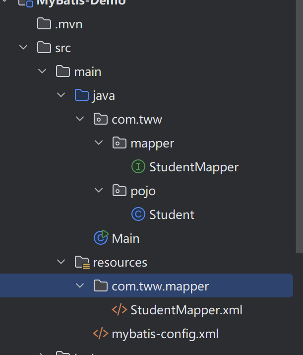

## 8.1 什么是Mybatis

​	`MyBatis`是一款优秀的持久层框架，用于简化JDBC开发。**持久层：负责将数据保存到数据库的那一层代码**。JavaEE三层架构：表现层（页面）、业务层（逻辑）、**持久层**（数据存储）。

​	JDBC的缺点比较明显的就是**硬编码**，像连接参数、SQL语句，都是使用字符串形式保存在变量中的。那如果后续想要修改他们，就需要重新编译、打包。比较麻烦。MyBatis可以很好的简化这些操作。

​	


## 8.2 快速入门

​	同样我们使用`Maven`坐标导入第三方jar包，下面是`Mybatis`对应的坐标

```java
  <!-- mybatis依赖 -->
        <dependency>
            <groupId>org.mybatis</groupId>
            <artifactId>mybatis</artifactId>
            <version>3.5.6</version>
        </dependency>
```

​	每个基于`MyBatis`的应用都是以一个`SqlSessionFactory`的实例为核心。而该实例通过`SqlSessionFactoryBuilder`获得，`SqlSessionFactoryBuilder`则是通过**XML配置文件**或者是**一个预先配置的`Configuration`实例**来构建出`SqlSessionFactory`实例。

​	从`XML`文件中构建出`SqlSessionFactory`实例非常简单，可以使用类路径下的资源文件配置，也可以使用输入流实例配置。我们首先介绍`XML`配置文件中对`Mybatis`系统的核心设置：比如**获取数据库连接实例的数据源（DataSource），以及决定事务作用域和控制方式的事务管理器**

```xml
<?xml version="1.0" encoding="UTF-8" ?>
<!DOCTYPE configuration
  PUBLIC "-//mybatis.org//DTD Config 3.0//EN"
  "http://mybatis.org/dtd/mybatis-3-config.dtd">
<configuration>
  <environments default="development">
    <environment id="development">
      <transactionManager type="JDBC"/>
      <dataSource type="POOLED">
        <property name="driver" value="${driver}"/>
        <property name="url" value="${url}"/>
        <property name="username" value="${username}"/>
        <property name="password" value="${password}"/>
      </dataSource>
    </environment>
  </environments>
  <mappers>
    <mapper resource="org/mybatis/example/BlogMapper.xml"/>
  </mappers>
</configuration>
```

​	${}里面是需要你填入的对应信息。比如`driver`是数据库连接的驱动，`url`是数据库的定位地址，如：` jdbc:mysql://localhost:3306/数据库名`，。一般来说，该`XML`文件的名字是：`mybatis-config.xml`。mappers 元素则包含了一组映射器（mapper），这些映射器的 XML 映射文件包含了 SQL 代码和映射定义信息

​	示例；
```xml
<?xml version="1.0" encoding="UTF-8" ?>
<!DOCTYPE configuration
        PUBLIC "-//mybatis.org//DTD Config 3.0//EN"
        "http://mybatis.org/dtd/mybatis-3-config.dtd">
<configuration>
    <typeAliases>
        <package name="com.tww.pojo"/>
    </typeAliases>
    <environments default="development">
        <environment id="development">
            <transactionManager type="JDBC"/>
            <dataSource type="POOLED">
                <!-- 数据库的连接信息 -->
                <property name="driver" value="com.mysql.cj.jdbc.Driver"/>
                <property name="url" value="jdbc:mysql://localhost:3306/teaching"/>
                <property name="username" value="root"/>
                <property name="password" value="119034"/>
            </dataSource>
        </environment>
    </environments>
    <mappers>
        <!--加载Sql映射文件-->
        <!--mapper resource="com/tww/mapper/StudentMapper.xml" -->
        <!-- Mapper代理方式 ：包扫描 -->
        <package name="com.tww.mapper"/>
    </mappers>
</configuration>
```


​	除此之外，我们还需要创建一个xml文件，该文件与执行SQL语句息息相关，文件名一般为：`表名+Mapper`。比如对Student表操作就取名`StudentMapper.xml`。下面是简单示例

```java
<?xml version="1.0" encoding="UTF-8" ?>
<!DOCTYPE mapper
        PUBLIC "-//mybatis.org//DTD Mapper 3.0//EN"
        "http://mybatis.org/dtd/mybatis-3-mapper.dtd">
<!-- namespace :命名空间  -->
<mapper namespace="test">
    <select id="selectAll" resultType="com.tww.pojo.Student">
        select * from student;
    </select>
</mapper>
```

​	下面是每个标签对应的含义

| 标签/属性                                  | 含义                                                         |
| :----------------------------------------- | :----------------------------------------------------------- |
| `<?xml version="1.0" encoding="UTF-8" ?>`  | XML 声明，定义版本和字符编码，非 MyBatis 特有。              |
| `<!DOCTYPE mapper ...>`                    | 文档类型声明，引用 MyBatis 的 DTD 文件，用于校验 XML 语法正确性。 |
| `<mapper namespace="...">`                 | **根标签**，定义一个 SQL 映射块。`namespace` 通常设为 Mapper 接口的全限定名（如 `com.tww.mapper.StudentMapper`），用于绑定接口和 XML，实现动态代理。这里示例为 `org.mybatis.example.test`。 |
| `<select id="selectAll" resultType="...">` | 定义**查询语句**。`id` 在该命名空间下唯一，对应 Mapper 接口中的方法名（如 `selectAll`）。`resultType` 指定结果集每行数据映射到的 Java 类型（这里是 `com.tww.pojo.Student`），MyBatis 自动将列名与对象属性对齐。 |
| `select * from student;`                   | 标签体中的 **SQL 语句**，实际执行的查询逻辑。                |
| `</select>`                                | 结束 select 标签。                                           |
| `</mapper>`                                | 结束 mapper 标签。                                           |

​	从XML中构建`SeqSessionFactory`：

```java
        // 加载mybatis的核心配置文件，获取SqlSessionFactory
        String resource = "mybatis-config.xml";
        InputStream inputStream = Resources.getResourceAsStream(resource);
        SqlSessionFactory sqlSessionFactory = new SqlSessionFactoryBuilder().build(inputStream);
```

​	获取到`SqlSessionFactory`后，就可以从该类中获取到`SqlSession`的实例了。**SqlSession**提供了在数据库执行SQL命令所需的所有方法`openSession()`，可以通过`SqlSession`实例来直接执行已映射的SQL语句。如：

```java
     SqlSession session = sqlSessionFactory.openSession();
        List<Student> arrayList  = session.selectList("test.selectAll");
        System.out.println(arrayList);
        session.close();
```

​	`selectList`方法是针对返回多条记录的SQL语句方法，它返回一个`List<E>`集合，E的类型通过映射文件中`resultType`指定。在这里，它指定为`com.tww.pojo.`包下的`Student`类。参数需指定该语句所在的`namespace`。和定义查询语句标签中指定的id，在这里表现为：`test.selectAll`


## 8.3 Mapper代理开发

​	在上面的调用中，我们通过`命名空间.id`去执行对应的SQL语句，还需要对SQL语句返回的结果做适应。现在，有了更快捷的方法，让我们像调用方法一样调用执行SQL语句：

```java
        StudentMapper mapper = session.getMapper(StudentMapper.class);
       List<Student> list = mapper.selectAll();
```

​	不过，在那之前，必须做一些准备工作，

1. 定义与SQL映射文件同名的`Mapper`接口（在这里SQL映射文件是StudentMapper.xml），并且让`Mapper`接口和SQL映射文件编译后放置在同一目录，具体做法是，现找到Mapper接口编译后在哪个文件夹下。在到`resource`创建同样的包结构，注意，`resource`李创建包，分层需要使用\符号，然后将SQL映射放到该包下，编译后。Mapper接口的class文件就与SQL映射在同一文件夹下了，才会生效。目录结构大概如下图：

   

​	

2. 设置SQL映射文件的`namespace`属性为Mapper接口全限定名（是指包名+类名的完整名称，用于唯一标识一个类，避免同名类的冲突）

   3. 在`Mapper`接口中定义方法， 方法名就是SQL映射文件的sql语句中的id，并保持参数类型和返回值类型一直。

      在这里，我们需要编写如下方法：

      ```java
      public interface StudentMapper {
          List<Student> selectAll();
      }
      ```

      为什么是List，因为`selectAll`id对应的SQL语句，返回的是一个多条记录，明显需要一个集合来存储。

4. 编码
   1. 通过SqlSession的getMapper方法获取Mapper接口的代理对象
   2. 调用对应方法完成sql的执行。

​	另外，如果SQL映射文件与`Mapper`接口同名，就比如我们上面的示例，那么可以使用包扫描的方式加载SQL映射，在之前，我们是通过：

```xml
      <!--加载Sql映射文件-->
        <mapper resource="com/tww/mapper/StudentMapper.xml"/>
```

​	的方式来加载SQL映射，如果有多个SQL映射，就需要一条一条标签去写。包扫描则可以更快捷的，一次性加载包下面所有的映射：

```xml
 <!-- Mapper代理方式 ：包扫描 -->
        <package name="com.tww.mapper"/>
```


#### **程序案例**：

​	xml的配置文件如下，该配置文件做了如下工作：

- 包扫描起别名（该别名默认为类名），这样在mapper映射文件中就不用使用全限定名
- 配置环境：
  - driver：8.0以上版本的路径为：com.mysql.cj.jdbc.Driver
  - url："jdbc:mysql://127.0.0.1:3306/sakila"表示连接本地的`sakila`数据库。`&`符号要用`&amp`代替，后面这一串是连接时的设置
  - username：配置用户名为root
  - password：密码为123456
- <\mappers\>: 用来配置执行语句的mapper.xml文件，有使用`resource`指定路径包含一个xml文件和使用包扫描下所有xml文件的方法。

```xml
<?xml version="1.0" encoding="UTF-8" ?>
<!DOCTYPE configuration
        PUBLIC "-//mybatis.org//DTD Config 3.0//EN"
        "http://mybatis.org/dtd/mybatis-3-config.dtd">

<configuration>

    <!-- 该包下的类自动起别名：默认为类名，在映射文件中就不用写全限定名了-->
    <typeAliases>
        <package name="com.tww.pojo"/>
    </typeAliases>

    <environments default="mysql">
        <environment id="mysql">
            <transactionManager type="JDBC"/>
            <dataSource type="POOLED">
                <property name="driver" value="com.mysql.cj.jdbc.Driver"/>
                <property name="url" value="jdbc:mysql://127.0.0.1:3306/sakila?useUnicode=true&amp;characterEncoding=utf-8&amp;serverTimezone=Asia/Shanghai&amp;allowPublicKeyRetrieval=true"/>
                <property name="username" value="root"/>
                <property name="password" value="123456"/>
            </dataSource>
        </environment>
    </environments>
    
    <mappers>
        <!-- 扫描该包下的映射文件-->
        <package name="com.tww.mapper"/>
    </mappers>
</configuration>
```

​	在该例子中，我们查询actor表的全部数据。所以，ActorMapper.xml文件内容如下：

```xml
<?xml version="1.0" encoding="utf-8" ?>
<!DOCTYPE mapper
        PUBLIC "-//mybatis.org//DTD Mapper 3.0//EN"
        "http://mybatis.org/dtd/mybatis-3-mapper.dtd">
<!-- namespace :命名空间  -->
<mapper namespace="com.tww.mapper.ActorMapper">
    <select id ="selectAll" resultType="Actor">
        select * from actor;
    </select>

    <select id = "FindById" parameterType="int" resultType="Actor" >
        select * from actor where actor_id =#{id}
    </select>
</mapper>
```

​	注意，该文件的位置要与接口的位置对应，如果Mapper接口的位置在：`com.tww.mapper`的路径下面，那么Mapper.xml文件则需要在`resources/com/tww/mapper`路径下。这样编译后，就能保证Mapper接口和Mapper.xml文件在同一文件夹	

​	对应的接口程序：

```java
package com.tww.mapper;

import com.tww.pojo.Actor;
import org.apache.ibatis.annotations.Param;

import java.util.List;

public interface ActorMapper {
    List<Actor> selectAll();

    Actor FindById(@Param("id") int id);
}

```

​	运行程序：

```java
import com.tww.mapper.ActorMapper;
import com.tww.pojo.Actor;
import org.apache.ibatis.io.Resources;
import org.apache.ibatis.session.SqlSession;
import org.apache.ibatis.session.SqlSessionFactory;
import org.apache.ibatis.session.SqlSessionFactoryBuilder;

import java.io.IOException;
import java.io.InputStream;
import java.util.List;

public class Main {
    public static void main(String[] args) throws IOException {
        String resource = "mybatis-config.xml";
        InputStream inputStream = Resources.getResourceAsStream(resource);
        SqlSessionFactory sqlSessionFactory = new SqlSessionFactoryBuilder().build(inputStream); //获取Session工厂

        SqlSession sqlsession = sqlSessionFactory.openSession();

        ActorMapper mapper=  sqlsession.getMapper(ActorMapper.class);
        List<Actor> actorList =  mapper.selectAll();
        actorList.forEach(System.out::println);
        System.out.println("查询id为150的演员信息："+mapper.FindById(150));

    }
}

```

​	pom文件坐标：

```xml

    <dependency>
      <groupId>org.mybatis</groupId>
      <artifactId>mybatis</artifactId>
      <version>3.5.16</version> <!-- 请使用最新稳定版 -->
    </dependency>


    <dependency>
      <groupId>com.mysql</groupId>
      <artifactId>mysql-connector-j</artifactId>
      <version>8.4.0</version>
    </dependency>
  </dependencies>
```

​	这表示运行Mybatis框架需要导入数据库的依赖


## 8.4 MyBatis核心配置文件详解

​	什么是`MyBatis`核心配置文件，其实就是`mybatis-config.xml`文件，可以通过配置里面的各项属性去影响MyBatis的行为

配置文档的顶层结构如下：

- configuration（配置）
  - [properties（属性）](https://mybatis.net.cn/configuration.html#properties)
  - [settings（设置）](https://mybatis.net.cn/configuration.html#settings)
  - [typeAliases（类型别名）](https://mybatis.net.cn/configuration.html#typeAliases)
  - [typeHandlers（类型处理器）](https://mybatis.net.cn/configuration.html#typeHandlers)
  - [objectFactory（对象工厂）](https://mybatis.net.cn/configuration.html#objectFactory)
  - [plugins（插件）](https://mybatis.net.cn/configuration.html#plugins)
  - environments（环境配置）
    - environment（环境变量）
      - transactionManager（事务管理器）
      - dataSource（数据源）
  - [databaseIdProvider（数据库厂商标识）](https://mybatis.net.cn/configuration.html#databaseIdProvider)
  - [mappers（映射器）](https://mybatis.net.cn/configuration.html#mappers)

​	在上面两节，简单介绍了`dataSource`和`mappers`。`dataSource`用来设置数据库连接的各项属性，而`mappers`映射器用来加载各类SQL映射文件。

​	


#### 8.4.1 enviroments

​	顾名思义，是用来配置数据库环境的标签，而且可以配置多个数据库环境。如：

```xml
<enviroments>
    <!--数据库1 -->
	<enviroment>
    ...
    </enviroment>
    
    <!-- 数据库2 -->
    <enviroment>
        ....
    </enviroment>
</enviroments>
```

​	不过，尽管可以配置多个环境，但每个`SqlSessionFactory`实例只能选择一种环境。所以，如果你想要连接两个数据库，就要创建两个`SqlSessionFactory`实例，每个数据库对应一个

​	为了指定创建哪种环境，只要将它的可选参数`id`传递给`SqlSessionFactoryBuilder`即可。如果忽略了`environment`这项参数，则会加载默认环境，默认环境由<environments default="development"\> 里的default选项指定。

​	**方法重载1**：

```xml
        // 加载mybatis的核心配置文件，获取SqlSessionFactory
String resource = "mybatis-config.xml";
InputStream reader = Resources.getResourceAsStream(resource);
String environment = "development"; //数据库环境的id
SqlSessionFactory factory = new SqlSessionFactoryBuilder().build(reader, environment);
```

​	`reader`就是从`mybatis-config.xml`文件中读取的文件流读取器，读取文件中的配置。而environment则是配置文件中的id，以便区分加载的是哪个数据库。

​	

​	**方法重载2**：

```xml
SqlSessionFactory factory = new SqlSessionFactoryBuilder().build(reader, environment, properties);
```

​	区别在`properties`，我们知道properties文件是Java里很常见的配置文件，用来提供各项参数，文件的内容通常以键值对出现：key=value。在这里，它主要负责给`environment`中的数据源里的占位符提供数据，例如有如下数据源：

```xml
  <environment id="development">
            <transactionManager type="JDBC"/>
            <dataSource type="POOLED">
                <property name="driver" value="${driver}"/>
                <property name="url" value="${url}"/>
                <property name="username" value="${username}"/>
                <property name="password" value="${password}"/>
            </dataSource>
        </environment>
```

​	占位符指的是`${}`里面的变量名，对应`properties`文件中key，而具体的值是`properties`的与key对应的`value`；我们假设已经有了一个`properties`文件。现在用Java代码来加载环境并运行代码。

```java
       // 加载mybatis的核心配置文件，获取SqlSessionFactory
        String resource = "mybatis-config.xml"; //配置文件
        InputStream inputStream = Resources.getResourceAsStream(resource); //加载配置文件
        Properties properties = new Properties(); //创建properties类
		//设置输入流
        InputStream proStream = Thread.currentThread().getContextClassLoader().getResourceAsStream("MysqlDataBaseSource.properties");	
        //通过输入流加载该类
		properties.load(proStream);
        SqlSessionFactory sqlSessionFactory = new SqlSessionFactoryBuilder().build(inputStream,"development",properties);
```

​	除了这个方法可以指定数据源的参数，还可以通过配置文件指定数据源

​	

​	**方法二**：

​	通过配置文件`<properties resource = "...">` 或`<properties url = "...">`加载的属性

​	第一种方式希望你通过**类路径**的方式来加载properties文件：

```xml
<properties resource="config/db.properties" />
```

​	第二种希望你通过url来加载`properties`文件：

```xml
<properties url="file:///G:/myconfig/db.properties" />
```

​	注意类路径和url不等同，他们是互斥的，只能使用其中一个。

​	**方法三**：配置文件`<properties>`子标签`<property>`中直接写死的属性。

​	当你使用build传入了`Properties`对象，而且配置文件中也有`<properties>`时，build传入的对象优先级更高。


#### 8.4.2 typeAliases

​	该标签可为Java类型设置一个缩写名字，它仅用于XML配置，意在降低冗余的全限定类目书写。例如：

```xml
<typeAliases>
	<typeAlias alias="Autor" type = "domain.blog.Autor"/>
    <typeAlias alias= "Blog" type = "domain.blog.Blog"/>
</typeAliases>
```

​	


## 8.5 XML映射器

​	`Mybatis`的强大在于它的语句映射，即`XXXMaper.xml`文件中的内容。它将近省掉了95%的代码。

​	`SQL`映射文件只有几个顶级元素：

- `cache` - 该命名空间的缓存配置
- `cache`- 引用其他命名空间的缓存配置
- `resultMap` - 描述如何从数据库结果集中加载对象。
- `sql`- 可被其他语句引用的可重用语句块。
- `insert`- 映射插入语句
- `update` - 映射更新语句
- `delete`- 映射删除语句
- `select`-映射查询语句


#### 8.5.1 select

​	查询语句是`Mybatis`中最常用的元素：

```xml
<select id="selectPerson" parameterType="int" result = "hashmap">
	SELECT * FROM PERSON WHERE ID = #{id};
</select>
```

​	该语句名为`selectPerson`，接受一个`int或Integer`类型的参数，并返回一个`HashMap`类型的对象，其中的键是列名（即字段），值便是结果行中对应的值。

​	其中`parameterType`，可以在使用`Mapper`代理后忽略掉，在Mapper接口中自动推断。

​	注意参数符号：

```xml
#{id}
```

​	这就告诉`Mybatis`创建一个预处理语句（`PreparedStatement`）参数，在JDBC中，这样的一个参数在SQL中会由一个“?”来标识，并传递到一个新的预处理语句中：

```java
String selectPerson = "SELECT * FROM PERSON WHERE ID =?";
PreparedStatement ps = conn.prepareStatement(selectPerson);
ps.setInt(1,id);
```

​	这样的工作被交给`Mybatis`，而我们用户只需要关注SQL逻辑即可

​	`select`元素允许你配置很多属性来配置每条语句的细节行为：

| 属性            | 描述                                                         |
| :-------------- | :----------------------------------------------------------- |
| `id`            | 在命名空间中唯一的标识符，可以被用来引用这条语句。           |
| `parameterType` | 将会传入这条语句的参数的类全限定名或别名。这个属性是可选的，因为 MyBatis 可以通过类型处理器（TypeHandler）推断出具体传入语句的参数，默认值为未设置（unset）。 |
| parameterMap    | 用于引用外部 parameterMap 的属性，目前已被废弃。请使用行内参数映射和 parameterType 属性。 |
| `resultType`    | 期望从这条语句中返回结果的类全限定名或别名。 注意，如果返回的是集合，那应该设置为集合包含的类型，而不是集合本身的类型。 resultType 和 resultMap 之间只能同时使用一个。 |
| `resultMap`     | 对外部 resultMap 的命名引用。结果映射是 MyBatis 最强大的特性，如果你对其理解透彻，许多复杂的映射问题都能迎刃而解。 resultType 和 resultMap 之间只能同时使用一个。 |
| `flushCache`    | 将其设置为 true 后，只要语句被调用，都会导致本地缓存和二级缓存被清空，默认值：false。 |
| `useCache`      | 将其设置为 true 后，将会导致本条语句的结果被二级缓存缓存起来，默认值：对 select 元素为 true。 |
| `timeout`       | 这个设置是在抛出异常之前，驱动程序等待数据库返回请求结果的秒数。默认值为未设置（unset）（依赖数据库驱动）。 |
| `fetchSize`     | 这是一个给驱动的建议值，尝试让驱动程序每次批量返回的结果行数等于这个设置值。 默认值为未设置（unset）（依赖驱动）。 |
| `statementType` | 可选 STATEMENT，PREPARED 或 CALLABLE。这会让 MyBatis 分别使用 Statement，PreparedStatement 或 CallableStatement，默认值：PREPARED。 |
| `resultSetType` | FORWARD_ONLY，SCROLL_SENSITIVE, SCROLL_INSENSITIVE 或 DEFAULT（等价于 unset） 中的一个，默认值为 unset （依赖数据库驱动）。 |
| `databaseId`    | 如果配置了数据库厂商标识（databaseIdProvider），MyBatis 会加载所有不带 databaseId 或匹配当前 databaseId 的语句；如果带和不带的语句都有，则不带的会被忽略。 |
| `resultOrdered` | 这个设置仅针对嵌套结果 select 语句：如果为 true，将会假设包含了嵌套结果集或是分组，当返回一个主结果行时，就不会产生对前面结果集的引用。 这就使得在获取嵌套结果集的时候不至于内存不够用。默认值：`false`。 |
| `resultSets`    | 这个设置仅适用于多结果集的情况。它将列出语句执行后返回的结果集并赋予每个结果集一个名称，多个名称之间以逗号分隔。 |


#### 8.5.2 inser，update和delete

​	数据变更语句`insert，update`和`delete`的实现非常接近。

​	下面的语句将一个`Author`对象插入到数据库，并根据数据库自增的`id`返回并设置到`Author`对象中。：

```xml
<insert id="insertAuthor" useGeneratedKeys="true"
    keyProperty="id">
  insert into Author (username,password,email,bio)
  values (#{username},#{password},#{email},#{bio})
</insert>
```

​	`useGenerateKeys= true` 用于获取数据库自动生成的主键。而`keyProperty = "id"`告诉把主键赋值给参数对象的`id`属性。

​	如果你的数据库还支持多行插入，可以传入一个`Author`数组或集合，并返回自动生成的主键。

```xml
<insert id="insertAuthor" useGeneratedKyes="true"
        keyProperty = "id">
	insert into Author(usename,password,email,bio) values
    <foreach item = "item" collection="list",separator =",">
    	( #{item.username},#{item.password},#{item.email},#{item.bio} )
    </foreach>
</insert>
```

​	`foreach`中的参数`collection`，其值取决于Mapper接口中的方法定义。当它没有使用`@Param()`注解时，有两种情况：

-  当参数是集合时，其值为`list`，如上例；

- 当参数是数组时，其值是`array`。

  在方法中使用了`@Param()`，那么其值就是`@Param("xxx")`，中的`xxx`。

​	参数`item`用于指代数组（集合）中的一个元素。`separator`指定分隔符。生成的SQL语句效果如下：
```sql
insert into tb_brand(status,brand_name,ordered,company_name,description) values (?,?,?,?,?) , (?,?,?,?,?) , (?,?,?,?,?) , (?,?,?,?,?) , (?,?,?,?,?)
```

​	

| 属性               | 描述                                                         |
| :----------------- | :----------------------------------------------------------- |
| `id`               | 在命名空间中唯一的标识符，可以被用来引用这条语句。           |
| `parameterType`    | 将会传入这条语句的参数的类全限定名或别名。这个属性是可选的，因为 MyBatis 可以通过类型处理器（TypeHandler）推断出具体传入语句的参数，默认值为未设置（unset）。 |
| `parameterMap`     | 用于引用外部 parameterMap 的属性，目前已被废弃。请使用行内参数映射和 parameterType 属性。 |
| `flushCache`       | 将其设置为 true 后，只要语句被调用，都会导致本地缓存和二级缓存被清空，默认值：（对 insert、update 和 delete 语句）true。 |
| `timeout`          | 这个设置是在抛出异常之前，驱动程序等待数据库返回请求结果的秒数。默认值为未设置（unset）（依赖数据库驱动）。 |
| `statementType`    | 可选 STATEMENT，PREPARED 或 CALLABLE。这会让 MyBatis 分别使用 Statement，PreparedStatement 或 CallableStatement，默认值：PREPARED。 |
| `useGeneratedKeys` | （仅适用于 insert 和 update）这会令 MyBatis 使用 JDBC 的 getGeneratedKeys 方法来取出由数据库内部生成的主键（比如：像 MySQL 和 SQL Server 这样的关系型数据库管理系统的自动递增字段），默认值：false。 |
| `keyProperty`      | （仅适用于 insert 和 update）指定能够唯一识别对象的属性，MyBatis 会使用 getGeneratedKeys 的返回值或 insert 语句的 selectKey 子元素设置它的值，默认值：未设置（`unset`）。如果生成列不止一个，可以用逗号分隔多个属性名称。 |
| `keyColumn`        | （仅适用于 insert 和 update）设置生成键值在表中的列名，在某些数据库（像 PostgreSQL）中，当主键列不是表中的第一列的时候，是必须设置的。如果生成列不止一个，可以用逗号分隔多个属性名称。 |
| `databaseId`       | 如果配置了数据库厂商标识（databaseIdProvider），MyBatis 会加载所有不带 databaseId 或匹配当前 databaseId 的语句；如果带和不带的语句都有，则不带的会被忽略。 |


#### 8.5.3 SQL

​	该元素用来定义可重用的SQL代码片段，以便在其他语句中使用。比如:

```xml
<sql id="userColumns"> ${alias}.id, ${alias}.username,${alias}.password</sql>
```

​	这里的`${alias}`一般用于指代表名，使用`<property/>`标签指定具体的值。如下：
```xml
<select id="selectUsers" resultType="map">
    select
    <include refid="userColumns"><property name="alias" values="t1"/></include>
    <include refid="userColumns"><property name="alias" values="t2"/></include>
    from some_table t1
     cross join some_table t2
</select>    
```

​	运行在数据库的具体语句如下：

```sql
select
  t1.id, t1.username, t1.password,
  t2.id, t2.username, t2.password
from some_table t1
  cross join some_table t2
```

​	

#### 8.5.4 结果映射（ResultMap）

​	==`resultMap`元素是`Mybatis`==中**最强大最重要**的元素，他可以让你从90%的JDBC`ResultSets`数据提取代码中解放出来。它主要解决如下问题：

1. 解决列名不一致：比如数据库字段是`user_name`，Java属性是`userName`。
2. 处理复杂嵌套查询：比如查询出来的“用户”数据，还包含一个“地址”对象。

​	之前已经见过简单的映射语句的示例，它们没有显示指定`resultMap`。比如：

```xml
<select id="selectUsers" resultType="map">
	select id,username,hashedPassword
    from some_table
	wheire id=#{id}
</select>
```

​	上述语句只是简单的将所有的列映射到`HashMap`的键上，这由`resultType`属性指定。虽然在大部分情况下都够用。

​	一般程序更可能使用`javaBean`或`POJO(老式Java对象)`作为领域模型，`Mybatis`对两者都提供了支持，请看下面这个`JavaBean`:

```xml
package com.someapp.model;
public class User {
  private int id;
  private String username;
  private String hashedPassword;

  public int getId() {
    return id;
  }
  public void setId(int id) {
    this.id = id;
  }
  public String getUsername() {
    return username;
  }
  public void setUsername(String username) {
    this.username = username;
  }
  public String getHashedPassword() {
    return hashedPassword;
  }
  public void setHashedPassword(String hashedPassword) {
    this.hashedPassword = hashedPassword;
  }
}
```

​	它含有`id,username,hashedPassword`三个字段，这样的一个JavaBean可以被映射到`ResultSet`：

```xml
<typeAlias type="com.someapp.model.User" alias="User"/>

<select id="selectUsers" resultType="User">
	select id,username,hashedPassword
    from some_table
	where id = #{id}
</select>
```

​	`Mybatis`会在幕后字段创建一个`ResultMap`，再根据属性名来映射到JavaBean的属性上，如果列名和属性名不能匹配上，可以在SELECT语句中设置别名来完成匹配：

```xml
<select id="selectUsers" resultType="User">
	select id,username,hashedPassword
    	user_id			as "id",
    	user_name 		as "userName",
    	hashed_password	as "hashePassword"
	from some_table
    where id = #{id}
</select>
```

​	什么是根据属性名映射到JavaBean的属性上。在常规JDBC中，这条语句会返回一条结果集，而我们会把这个结果集转化成一个对象。这个工作被`Mybatis`自动完成。他会自动创建一个`User`对象，并把对应的值填入该对象中。

​	你可以发现，上面的例子中没有一个显式配置`ResultMap`，这就是`ResultMap`的优秀之处——你完全可以不用显示的配置它们。但是为了讲解，我们将演示怎么在刚刚的示例中使用外部的显式`ResultMap`,这也是解决列名不匹配的另外一种方式。

```xml
<resultMap id="userResultMap" type="User">
	<id property="id" column="user_id"></id>
    <result property="username" column="user_name"></result>
    <result property="password" cloumn="hashed_password"></result>
</resultMap>
```

​	然后在引用它的语句中设置`resultMap`属性就行了（注意要去掉`resultType`属性，`resultType`和`resultMap`只能去其一）

```xml
<select id="selectUsers" resultMap="UserResultMap">
	select id,username,hashedPassword
    	user_id,user_name,hashed_password
	from some_table
    where id = #{id}
</select>
```


## 8.6 动态SQL

​	动态SQL可以解决为了根据不同条件拼接SQL语句的问题。**动态SQL就是指在程序运行时，根据你传入的参数不同，自动拼接出不同的SQL语句**

​	在目前的版本中，有下面几种动态SQL:

- if
- choose（when，otherwise）
- trim（where，set）
- foreach


#### 8.6.1 if

```xml
<select id="findActiveBlogWithTitleLike"
     resultType="Blog">
  SELECT * FROM BLOG
  WHERE state = ‘ACTIVE’
  <if test="title != null">
    AND title like #{title}
  </if>
</select>
```

​	`test`里面是条件表达式，如果条件为真，则传递的SQL语句包含if代码块的内容。所以这个映射器提供了可选的查找文本功能，如果不传入`title`，那么所有处于`ACTIVE`状态的BLOG都会返回，如果传入了`title`参数，那么就会对`title`一列进行模糊查找并返回对于的BLOG结果

​	也可以同时对两个参数进行可选搜索，只需要加入另外一个条件即可：

```xml
<select id="findActiveBlogLike"
     resultType="Blog">
  SELECT * FROM BLOG WHERE state = ‘ACTIVE’
  <if test="title != null">
    AND title like #{title}
  </if>
  <if test="author != null and author.name != null">
    AND author_name like #{author.name}
  </if>
</select>
```


#### 8.6.2 choose、when、otherwise

​	当年只是想从多个条件中选择一个使用，这种情况可以使用`choose`元素，它有点像Java中的`swtich`语句

```xml
<select id="findActiveBlogLike"
     resultType="Blog">
  SELECT * FROM BLOG WHERE state = ‘ACTIVE’
  <choose>
    <when test="title != null">
      AND title like #{title}
    </when>
    <when test="author != null and author.name != null">
      AND author_name like #{author.name}
    </when>
    <otherwise>
      AND featured = 1
    </otherwise>
  </choose>
</select>
```

​	`choose`元素提供一系列选择，这个选择是用`when`元素，包含的，当他满足`when里面的test`条件时，就会插入这个SQL语句。而`otherwise`只有在没有可匹配的when时，才会插入。

​	

#### 8.6.3 trim、where、set

​	下面介绍一个问题，以及怎么解决它

```xml
<select id="findActiveBlogLike"
     resultType="Blog">
  SELECT * FROM BLOG
  WHERE
  <if test="state != null">
    state = #{state}
  </if>
  <if test="title != null">
    AND title like #{title}
  </if>
  <if test="author != null and author.name != null">
    AND author_name like #{author.name}
  </if>
</select>
```

​	如果没有匹配的条件，最终这条SQL会变成这样：

```xml
SELECT * FROM BLOG
WHERE
```

​	这会导致查询失败，如果匹配的只是第二个条件呢，这条SQL会是这样：

```xml
SELECT * FROM BLOG
WHERE
AND titile like 'someTitle'
```

​	在这里，只需要一处简单的改动：

```xml
<select id="findActiveBlogLike"
     resultType="Blog">
  SELECT * FROM BLOG
  <where>
    <if test="state != null">
         state = #{state}
    </if>
    <if test="title != null">
        AND title like #{title}
    </if>
    <if test="author != null and author.name != null">
        AND author_name like #{author.name}
    </if>
  </where>
</select
```

​	*where* 元素只会在子元素返回任何内容的情况下才插入 “WHERE” 子句。而且，若子句的开头为 “AND” 或 “OR”，*where* 元素也会将它们去除。

​	

​	如果 *where* 元素与你期望的不太一样，你也可以通过自定义 trim 元素来定制 *where* 元素的功能。比如，和 *where* 元素等价的自定义 trim 元素为：

```
<trim prefix="WHERE" prefixOverrides="AND |OR ">
  ...
</trim>
```

*prefixOverrides* 属性会忽略通过管道符分隔的文本序列（注意此例中的空格是必要的）。上述例子会移除所有 *prefixOverrides* 属性中指定的内容，并且插入 *prefix* 属性中指定的内容。


​	用于动态更新语句的类似解决方案叫做 *set*。*set* 元素可以用于动态包含需要更新的列，忽略其它不更新的列。比如：

```
<update id="updateAuthorIfNecessary">
  update Author
    <set>
      <if test="username != null">username=#{username},</if>
      <if test="password != null">password=#{password},</if>
      <if test="email != null">email=#{email},</if>
      <if test="bio != null">bio=#{bio}</if>
    </set>
  where id=#{id}
</update>
```

这个例子中，*set* 元素会动态地在行首插入 SET 关键字，并会删掉额外的逗号（这些逗号是在使用条件语句给列赋值时引入的）。

​	


#### 8.6.4 foreach

动态 SQL 的另一个常见使用场景是对集合进行遍历（尤其是在构建 IN 条件语句的时候）。比如：

```
<select id="selectPostIn" resultType="domain.blog.Post">
  SELECT *
  FROM POST P
  WHERE ID in
  <foreach item="item" index="index" collection="list"
      open="(" separator="," close=")">
        #{item}
  </foreach>
</select>
```

​	*foreach* 元素的功能非常强大，它允许你指定一个集合，声明可以在元素体内使用的集合项（item）和索引（index）变量。它也允许你指定开头与结尾的字符串以及集合项迭代之间的分隔符。这个元素也不会错误地添加多余的分隔符，看它多智能！

​	**提示** 你可以将任何可迭代对象（如 List、Set 等）、Map 对象或者数组对象作为集合参数传递给 *foreach*。当使用可迭代对象或者数组时，index 是当前迭代的序号，item 的值是本次迭代获取到的元素。当使用 Map 对象（或者 Map.Entry 对象的集合）时，index 是键，item 是值。

​	
