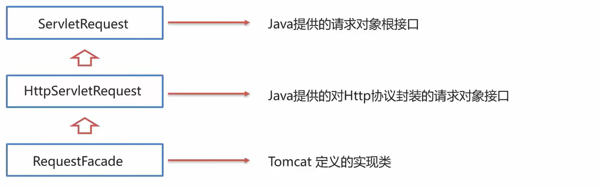
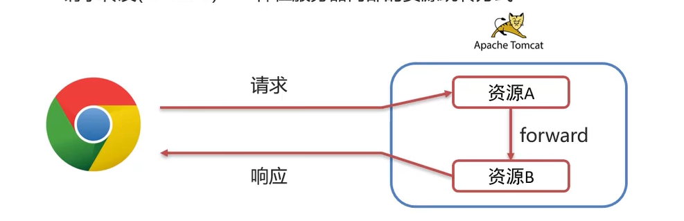
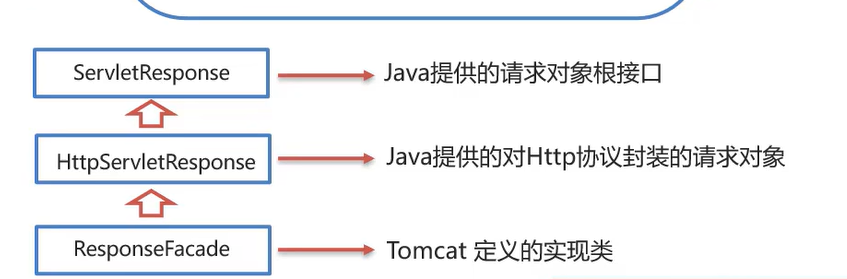
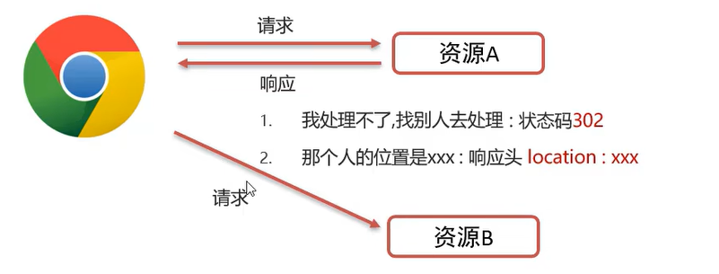
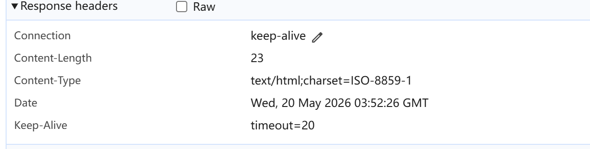

## 9.1 Tomcat

​	Tomcat是一个开源的Java Web应用服务器，具有轻量级、高度可配置的特点。它的核心功能是作为`Servlet`容器，能够接收来着Web客户端的请求。


​	

## 9.2 Servlet

​	Servlet是Java提供的一门动态web资源开发技术。`Servlet`是一个规范接口，将来我们定义Servlet类实现Servlet接口，并由web服务器运行Servlet。

​	

​	在使用Servlet之前，必须使用`Maven`导入对应的坐标：

```xml
    <dependency>
      <groupId>javax.servlet</groupId>
      <artifactId>javax.servlet-api</artifactId>
      <version>3.1.0</version>
      <scope>provided</scope>
    </dependency>
```

​	然后定义一个类，实现Servlet接口，并重写接口中的所有方法

```java
public class ServletDemo1 implements Servlet{
	public void service(){}
    ....
}
```

​	并且在类上使用`@WebServlet`注解，里面写上该`Servlet`的访问路径，当服务器向这个路径发起访问后，就会调用里面的方法。

```java
@WebServlet("/demo1");
public class ServletDemo1 implements Servlet{
    ...
}
```

​	最后，就可以在浏览器输入对应的URL，访问该Servlet了

```java
http://localhost:8080/web-demo/demo1
```

​	

#### 9.2.1 Servlet生命周期

​	Servlet运行在Servlet容器（web服务器）里，其生命周期由容器管理，可分为四个阶段：

1. **加载和实例化：** 默认情况下，当Servlet第一次被访问时，由容器创建Servlet对象
2. **初始化：** 在Servlet实例化后，容器将调用Servlet的`init()`方法初始化这个对象，完成一些初始化的工作，这个方法只调用一次
3. **请求终止**：每次请求Servlet时，Servlet容器都会调用Servlet的`service()`方法对请求进行处理。
4. **服务终止：** 当需要释放内存或容器关闭时，容器会调用`Servlet`实例的`destory()`方法完成资源的释放。在`destory()`方法调用之后，容器会释放这个`Servlet`实例，该实例随后会被`Java`的垃圾收集器回收。

​	

​	下面的方法可以获取一个`ServletConfig`对象

```java
ServletConfig getServletConfig()
```

​	同样的，`getServletInfo()`能获取Servlet相关信息

```java
String getServletInfo()
```

​	

​	`HttpServlet`实现了`GenericServlet`这个抽象类，而这个抽象类继承了`Servlet`，将来开发B/S架构的web项目，都是针对HTTP协议的，使用后面会高频的使用这个`HttpServlet`

​	HttpServlet中有两个基本方法:`doGet和doPost`


#### 9.2.2 Servlet urlPattern配置

​	Servlet要想被访问，必须配置其访问路径（urlPattern）

​	一个`Servlet`，可以配置多个`urlPattern`

```java
@WebServlet(urlPatterns = {"/demo1","/demo2"})
```

​	而`urlPattern`有多种匹配规则，上面使用的就是精确匹配

1. 精确匹配：
   - 配置路径：`@WebServlet("/user/select")`
   - 访问路径：`localhost:8080/web-demo/user/select`
2. 目录匹配：
   - 配置路径：`@WebServlet("/user/*")`
   - 访问路径：`localhost:8080/web-demo/user/(任意多个字符)`

3. 扩展名匹配：
   - 配置路径：`@WebServlet("*.do")`
   - 访问路径：`localhost:8080/web-demo/aaa.do`
4. 任意匹配：
   - 配置路径：`@WebServlet("/")、@WebServlet("/*")`
   - 访问路径：`localhost:8080/web-demo/hehe` 


## 9.3 Request

​	`Request`是一个请求对象，当浏览器向服务器发送请求后，会发送一些HTTP协议所包含的信息，而这些信息，被服务器解析成一个对象，这个对象就是`Request`

​	在`Servlet`接口中，方法`Service`就建议接收这些信息，然后通过`Request`对象获取一些信息。

​	例：

```java
   protected void doGet(HttpServletRequest req, HttpServletResponse resp) throws ServletException, IOException {
        //使用request对象，获取请求数据
        String name = req.getParameter("name"); //获取参数行的name数据

        //使用response对象，设置响应数据
        resp.setHeader("content-type","text/html;charset=utf-8");
        resp.getWriter().write("<h1>"+name+",欢迎您！</h1>");
    }
```

​	下面是`Request`的继承体系：



​	其中，请求数据可根据HTTP协议分为三部分：

1. **请求行**：`GET/request-demo/req1?username=zhangsan HTTP/1.1`
   - `String getMethod()`:获取请求方式，如`GET`
   - `String getContextPath()`:获取虚拟目录（项目访问路径）：`/request-demo`
   - `StringBuffer getRequestURL()`:获取URL（统一资源定位符）：`htttp://localhost:8080/request-demo/req1`
   - `String getRequestURI():`获取URI(统一资源标识符):`/request-demo/req1`
   - `String getQueryString():`获取请求参数（GET方式）：`username=zhangsan&password=123`
2. **请求头**：`User-Agent:Mozilla/5.0 Chrome/91.0.4472.106`，请求体以`key:value`的形势存在
   - `String getHeader(String name)`:根据请求头名称，获取值
3. **请求体：**请求体是`Post`请求来提交数据的单位，通常在表单中提交。例如：

```html
  <form action="/Tomcat_Web_war/demo3" method="post">
        <input type="text" name = "username">
        <input type="password" name="password">
        <input type="submit">
    </form>
```

​	提交后，这些input输入的数据会以post方式提交到对应的映射服务器文件中。我们在`doPost`方法中可以获取到这些数据:

- `ServletInputStream getInputStream()`:获取字节输入流
- `BufferedReader getReader()`:获取字符输入流


#### 9.3.1 通用方式获取请求参数

​	前面介绍，对于`GET`方式的请求参数，使用`getQueryString()`，而对于`Post`的请求参数，可以使用输入流来获取。在之后的工程代码中，`doGet和doPost`的代码重合度是相当高的

​	所以，如果能有一种通用的方式来获取请求参数，可以很明显的降低代码量。Java提供了下面的方法来获取所有参数

- `Map<String,String[]> getParameterMap()`:获取所有参数Map集合
- `String[] getParameterValues(String name)`:根据名称获取参数值

- `String getParameter(String name)`:根据名称获取单个值

 

#### 9.3.2 请求转发

​	请求转发（`forward`）:一种在服务器内部的资源跳转方式。



​	使用下面的方法实现：

```java
req.getRequestDispatcher("资源B路径").forward(req,resp)
```

​	对于路径，一般是写转发对象的`@WebServlet("")`注解中的名称

​	请求转发可以分享共享数据，使用`Request`对象，下面的方法使`Request`对象携带数据：

- `void setAttribute(String name,Object o)`: 存储数据到`request`对象中

​	转发对象接收数据后，使用`getAttribute`方法获取：

- `Object getAttribute(String name)`：根据key ，获取值

​	如果想删除reqeust对象中的某个键值对，那么就使用下面的方法：

- `void removeAttribute(String name)` 根据key，删除该键值对。


​	下面是某个服务器类A，当浏览器向服务器发起数据请求时，会访问这个服务器类A，而这个服务器类A它会把请求转发给服务器类B

```java
@WebServlet("/reqA")
public class RequestA extends HttpServlet {
    @Override
    protected void doGet(HttpServletRequest req, HttpServletResponse resp) throws ServletException, IOException {
        System.out.println("ServletClass A....");
        req.setAttribute("mes","Hello");
        req.getRequestDispatcher("/reqB").forward(req,resp);
    }
}

/*另一个文件*/
@WebServlet("/reqB")
public class RequestB extends HttpServlet {
    @Override
    protected void doGet(HttpServletRequest req, HttpServletResponse resp) throws ServletException, IOException {
        System.out.println("ServletClass B....");
        System.out.println("From A request:");
        Object o = req.getAttribute("mes");
        System.out.println(o);
    }
}
```

​	控制台输出：

```java
ServletClass A....
ServletClass B....
From A request:
Hello
```

​	请求转发不需要添加虚拟目录


## 9.4 Response

​	`Servlet`接口，通过`Request`和`Response`来和浏览器交互数据，而`Reqeust`负责获取从浏览器发起的请求附带的数据。**`Response`则负责从服务器中返回数据给浏览器**

​	通常的流程是这样的，假设有一个登录场景：

1. 用户从浏览器页面中输入数据，如账号和密码。
2. 服务器通过`Request`接收到用户的数据，在内部进行处理
3. 服务器内部类通过数据库比对用户输入的数据是否正确
4. 如果正确，通过`Response`返回登录成功的数据
5. 如果不支持，通过`Response`返回登录失败的数据。

​	这一节我们介绍`Response`对象。它与`Request`对象的体系结构差不多，都是由`ServletResponse`的顶层接口实现而来。平时使用的最多的，则是`HttpServletResponse`对象。

​                                                            	

​	下面介绍响应数据的格式，分为三部分：

1. **响应行**：`HTTP/1.1 200 OK`

   方法：`void setStatus(int sc)`:设置响应状态码

2. **响应头：**`Content-Type:text/html`

   方法：`void setHeader(String naem,String value)`:设置响应头键值对

3. **响应体：**`<html>....</html>`

   方法：`PrintWriter getWriter()`:获取字符输出流

   ​	：`ServletOutputStream getOutputStream():`获取字节输出流


#### 9.4.1 Response完成重定向

​		重定向：一种资源跳转方式。



​		实现方式：

```java
resp.setStatus(302);
resp.setHeader("location","资源B的路径");
```

​	实例代码：

```java
@WebServlet("/resp1")
public class ResponseDemo1 extends HttpServlet {
    @Override
    protected void doGet(HttpServletRequest req, HttpServletResponse resp) throws ServletException, IOException {
        System.out.println("resp1....");

        //重定向到resp2中
        resp.setStatus(302);
        resp.setHeader("Location","/Tomcat_web_war/resp2");
    }
}


@WebServlet("/resp2")
public class ResponseThere extends HttpServlet {
    @Override
    protected void doGet(HttpServletRequest req, HttpServletResponse resp) throws ServletException, IOException {
      System.out.println("resp2....");
    }
}

```

​	在`Demo1`中，`resp.setStatus(302)`告诉了浏览器，接下来要临时重定向，然后`resp.setHeader()`告诉了它现在要去哪里，所以，当浏览器访问`/resp1`的时候。控制台会先访问到`/resp1`，在访问到`/resp2`。输出如下：

```java
resp1....
resp2....
```

​	`Servlet API`还提供了一个专门的方法简化重定向，一行代码就可以解决：

```java
//resp.setStatus(302);
//resp.setHeader("Location","/Tomcat_web_war/resp2");
resp.sendRedirect("/Tomcat_web/resp2");
```

​	只需要传入重定向目标的路径即可。

​	重定向的特定如下：

- 浏览器地址路径发生变化
- 可以定向到任意位置的资源（服务器内部、外部均可）
- 两次请求，不能在多个资源使用`request`共享数据 

​	重定向需要添加虚拟目录


#### 9.4.2 响应字符数据

​	首先可以通过`Response`对象获取字符输出流，利用这个字符输出流向网页输出数据，如网页标签：

```java
PrintWriter writer = resp.getWriter();
writer.write("aaa");
 writer.write("<h1>Hello World</h1>"); //普通文本
```

​	 但是这样传输的数据，浏览器只会把它当做普通文本处理，并不会当成网页标签处理，我们需要在响应头中设置响应体的类型：

```java
resp.setHeader("content-type","text/html");
```

​	响应头告诉了，响应体的数据类型是`html`，浏览器就会正确处理`HTML`标签了

​	也可以在浏览器中看见响应头的数据包含了数据类型：


​	可以回注意到`Content-Type`的文本包含了：`charset=ISO-8859-1`，这代表，如果我传输的数据是中文，那么可能会参数乱码：

```java
writer.write("你好");
```

​	浏览器解析：


​	 所以，我们先需要设置`ContentType`的内容，调用下面的方法：

```java
resp.setContentType("text/html;charset=utf-8");
```

​	注意要在获取流之前设置，因为流也是通过`resp`来获取的。

​	完整代码：

```java
@WebServlet("/resp3")
public class ResponseChars extends HttpServlet {
    @Override
    protected void doGet(HttpServletRequest req, HttpServletResponse resp) throws ServletException, IOException {
        resp.setContentType("text/html;charset=utf-8");  //设置响应头
        PrintWriter writer = resp.getWriter();
        //告诉浏览器，响应的数据是html格式的，否则默认就是普通字符串
        resp.setHeader("content-type","text/html");

        writer.write("你好");
        writer.write("<h1>Hello World</h1>");
    }
}
```

​	


#### 9.4.3 响应字节数据

​	字节输出流，适用于向浏览器返回二进制数据，比如图片、PDF文件、Excel文件、视频、音频等。

​	使用`Response`对象获取字节输出流：

```java
ServletOutputStream outputStream = resp.getOutputStream();
outputStream.write(字节流);
```

​	


​	

## 9.5 SqlSessionFactory工具类抽取

​	我们知道，使用`Mybatis`的流程是这样的：

1. 创建`mybatis-config.xml`
2. 使用`Resources.getResourceAsStream("mybatis-config.xml")`获取字节流
3. 把这个字节流传入`SqlSessionFactoryBuilder().build()`。
4. 通过`sqlSessionFactory`获取`session`对象
5. 使用`session`对象获取`Mapper`代理对象
6. 使用`Mapper`代理对象执行Sql方法

​	但是我们需要在每次使用sql方法的时候都这样走一遍吗？不，重复创建`SqlSessionFactory`的代价是巨大的，它里面包含连接池，可以创建多个`session`。所以我们只需要创建一个`SqlsessionFactory`，通过它来获取`session`。怎么做？

​	我们可以创建一个工具类，这个类里面有一个静态块，它只在第一次被创建时执行，我们把创建工厂对象（`SqlSessionFactoyr`）的代码放在里面。

```java
    static {
        try (InputStream inputStream = Resources.getResourceAsStream("mybatis-config.xml")) {
            sqlSessionFactory = new SqlSessionFactoryBuilder().build(inputStream);
        } catch (IOException e) {
            throw new RuntimeException("加载 MyBatis 配置文件失败", e);
        }
    }

```

​	随后，对外开放一个方法，哪个类想要获得`session`,就调用这个方法：

```java
 public static SqlSession getSqlSession() {
        return sqlSessionFactory.openSession();
}
```

​	当然，也要提供关闭session的方法。

```java
    public static void close(SqlSession sqlSession) {
        if (sqlSession != null) {
            sqlSession.close();
        }
    }
```

​	最后，我们创建了高效的工具类`DBUtils`

```java
public class DBUtils {

    private static SqlSessionFactory sqlSessionFactory;

    static {
        try (InputStream inputStream = Resources.getResourceAsStream("mybatis-config.xml")) {
            sqlSessionFactory = new SqlSessionFactoryBuilder().build(inputStream);
        } catch (IOException e) {
            throw new RuntimeException("加载 MyBatis 配置文件失败", e);
        }
    }

    public static SqlSession getSqlSession() {
        return sqlSessionFactory.openSession();
    }

    public static void close(SqlSession sqlSession) {
        if (sqlSession != null) {
            sqlSession.close();
        }
    }
}
```

​	

​	
