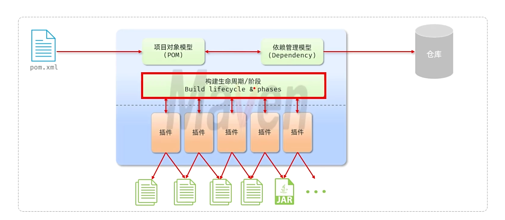
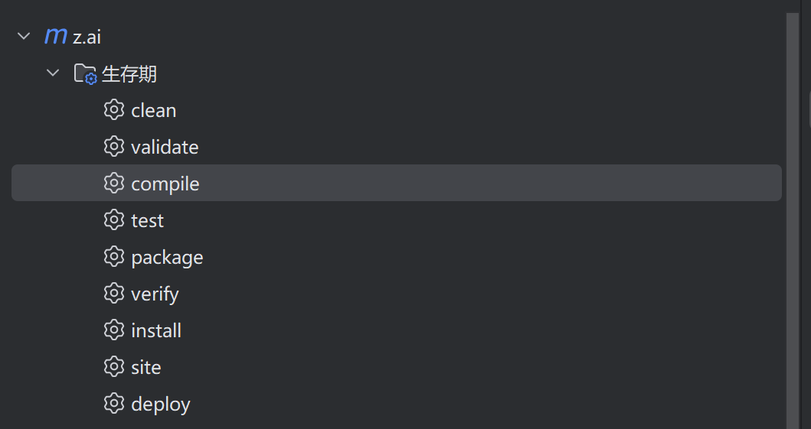
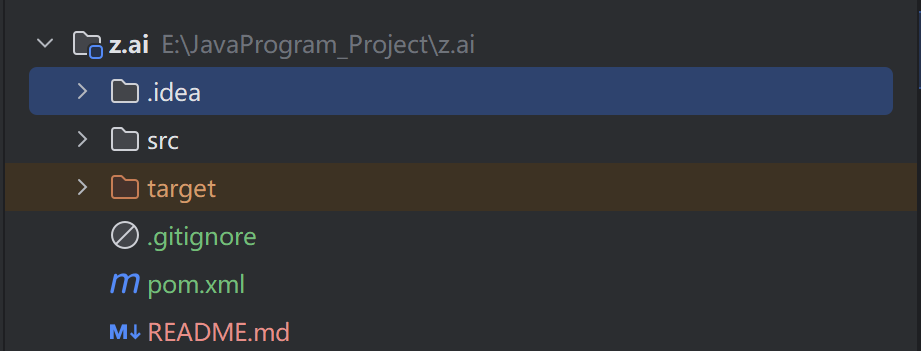

## 1.1 Maven

​	**Maven是管理和构建Java项目的工具**，是`apache`旗下的一个开源项目。

​	Maven的主要作用：依赖管理（jar包）、项目构建、统一的项目结构



#### 1.1.1 依赖管理

​	在之前，开发Java项目时，如果想要使用一些第三方的jar包，需要到对应的官网上下载，再到项目目录中创建一个lib文件夹，然后将jar包放在将lib文件夹内，才能使用

​	现在，使用Maven，可以很方便的导入jar包。比如如下：

```xml
<dependency>
	<groupId>commons-io</groupId>
    <artifactId>commons-io</artifactId>
    <version>2.11.0</version>
</dependency>
```

​	通过一个**POM.xml（Project Object Model 项目对象模型）文件**，声明这几段标签。Maven可以自动下载jar包，极大的优化了开发者的效率


#### 1.1.2 标准化项目构建

​	Maven提供了一些指令来帮助开发者进行编译、测试、打包以及发布等操作。在IDEA中打开Maven面板就可以看到。



- clean: 清理前一次构建生成的文件。
- validate: 验证项目是否正确且所有必要信息可用。
- compile: 编译项目的源代码。
- test: 使用单元测试框架测试编译后的代码，测试不需要打包或部署。
- package: 将编译后的代码打包成可分发的格式，如JAR、WAR。
- verify: 对集成测试的结果进行检查，以确保质量达标。
- install: 将包安装到本地仓库，供本地其他项目使用。
- site: 生成项目站点文档。
- deploy: 在构建环境中，将最终的包复制到远程仓库，供其他开发人员或项目共享。


#### 1.1.3 统一的项目结构

​	只要使用Maven构建的项目，目录结构都是统一的，可以跨平台使用




#### 1.1.4 Maven本地仓库的配置

1. 第一步，从官网中下载`bin`版本。
2. 再Maven文件夹中创建`mvn_repo`作为本地仓库文件夹。
3. 复制`mvn_repo`文件夹路径
4. 打开conf文件夹，修改`settings.xml`文件夹
5. 找到` <localRepository>/path/to/local/repo</localRepository>`
6. 将mvn_repo文件夹路径复制到该标签中，并移出注释。如下


​	

#### 1.1.5 配置阿里云的Maven私服

​	由于中央仓库在国外，有些jar包不一定能下载成功，还很缓慢，所以可以使用国内的私服。

​	同样的修改`settings.xml`文件，找到`<mirrors>`标签，将阿里云的私服标签复制进去

```xml
<mirror>
  <id>aliyunmaven</id>
  <mirrorOf>*</mirrorOf>
  <name>阿里云公共仓库</name>
  <url>https://maven.aliyun.com/repository/public</url>
</mirror>
```

​	要想在任意目录下使用Maven，就需要配置环境变量

## 1.2 POM文件解析

​	POM.xml是Maven的核心

```xml
<?xml version="1.0" encoding="UTF-8"?>
<project xmlns="http://maven.apache.org/POM/4.0.0"
         xmlns:xsi="http://www.w3.org/2001/XMLSchema-instance"
         xsi:schemaLocation="http://maven.apache.org/POM/4.0.0 http://maven.apache.org/xsd/maven-4.0.0.xsd">
    
    ......
    
</project>
```

1. <?xml version="1.0"?> - 声明使用XML 1.0标准                                                                                                                                             
2. encoding="UTF-8" - 指定文件使用UTF-8字符编码     	
3. `<project></project`是POM文件的根元素，其他所有标签都写在这个标签里面
4. **`xmlns` 等**：声明 POM 的命名空间和 XML Schema，确保 Maven 能正确解析文件。

```xml

	<modelVersion>4.0.0</modelVersion>

    <groupId>org.example</groupId>
    <artifactId>z.ai</artifactId>
    <version>1.0-SNAPSHOT</version>
    <packaging>jar</packaging>
```

​	上面这些标签用来描述当前项目的信息

- **`<modelVersion>`**：POM 模型的版本，Maven 2 及以后固定为 `4.0.0`。
- **`<groupId>`**：项目所属组织的唯一标识，通常采用反向域名，如 `com.example`。
- **`<artifactId>`**：项目的唯一名称，对应构建产物的文件名（如 `my-app.jar`）。
- **`<version>`**：项目版本号，`SNAPSHOT` 表示开发中的不稳定版本。
- **`<packaging>`**：项目的打包方式，常见值：`jar`（默认）、`war`、`pom`（父模块）等。

```xml
<properties>
    <maven.compiler.source>11</maven.compiler.source>
    <maven.compiler.target>11</maven.compiler.target>
    <project.build.sourceEncoding>UTF-8</project.build.sourceEncoding>
</properties>
```

​	这些也是用来描述当前项目的信息

- **`<maven.complier.source>`** ：基于JDK哪个版本开发
- **`<maven.complier.target>`**：最终运行的时候基于哪个版本运行
- **` <project.build.sourceEncoding>`** ：当前项目的字符集

​	上面介绍的这些标签，都属于`Project Object Model`**POM**的范围。


#### 1.2.1 Dependency （依赖管理模型）

​	依赖信息统一写进`<dependencies>`标签中，用来描述当前项目的依赖信息。

```xml
<dependencies>
		
        <dependency>
            <groupId>commons-io</groupId>
            <artifactId>commons-io</artifactId>
            <version>2.14.0</version>
        </dependency>
    
          <!-- 3. 日志实现 -->
        <dependency>
            <groupId>org.slf4j</groupId>
            <artifactId>slf4j-simple</artifactId>
            <version>2.0.17</version>
            <scope>runtime</scope>
        </dependency>

</dependencies>
```

​	一个依赖管理模型可以写入多个依赖的信息。

​	依赖通过仓库进行下载。它首先会在本地仓库中寻找该jar包，如果本地仓库没有，就会到中央仓库中下载。 

​	