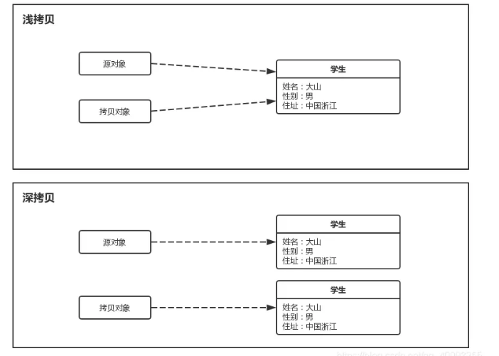

## 1.数据类型

​	八种基础类型：

- byte (1字节)
- short (2字节)
- int  (4字节)
- long （8字节）
- float （4字节）
- double（8字节）
- boolean （通常为1字节，无明确大小）
- char （2字节）


### 1.1 数据类型转换方式

1. 自动类型转换（隐式转换）：小转大
2. 强制类型转换（显示转换）： int a = (int)3.15  结果为3，大转小丢失精度。
3. 字符串转换：每个基础类型都包装类提供将值转换为字面字符串的方法。通常为`Parse*()`


## 2. 面向对象

​	面向对象是一种编程范式，**它将事物的共同特征抽象为对象，对象具有属性和方法。以对象为中心，通过对象之间的交互来完成程序的功能**


​	Java面向对象的三大特性：封装、继承、多态：

- **封装**：将对象的属性和方法结合到一起，对外隐藏对象的内部细节，通过对象提供的接口与外界交互。封装的目的是增强安全性和简化编程，使对象更近独立
- **继承**：继承可以使子类自动共享父类的字段和方法，它是代码复用的重要手段。
- **多态**： **多态是指同一个行为，在不同对象中表现出不同的效果，主要有**


### 2.1 多态体现在哪几个方面

1. **方法重载** ：同一类中有多个同名方法，区别在于不同的参数列表（参数类型、数量或顺序不同）

2. **方法重写**：方法重写是多态的主要实现方式。指子类能够对父类中同名方法的重写，JVM会根据对象的实际类型确地调用哪个版本

3. **接口与实现**：多态也体现在接口的使用上，多个类可以实现同一个接口。并且一个接口可以引用它的实现类。

4. **向上转型和向下转型** ： 

   1. 向上转型：父类类型引用指向子类对象，执行的方法实际上是子类对象的方法，通过这种方式，可以在运行时采用不同的子类实现
   2. 向下转型：父类引用转换为子类类型。执行前需使用`instanceof`检查其类型，避免出现`ClassCastException`。如Employee是Manage的父类

   ```java
   Employee e = new Employee(...);
   if(e instanceof Manager){
       e = (Manager)e;
   }
   ```

   


### 2.2 抽象类和普通类区别

- 实例化：普通类可以直接实例化，而抽象类不能被实例化，只能被继承
- 方法实现：抽象类的方法可以有实现（默认实现）也可以没有实现。
- 继承：这一点上两者没有区别。都只能被单继承（即只能继承一个父类，都可以实现多个接口）。


### 2.3 Java抽象类和接口的区别是什么

​	两者的特点：

- 抽象类用于描述类的共同特性和行为，可以有成员变量、构造方法和具体方法。适用于有明显继承关系的场景
- 接口用于定义行为规范，可以多实现，**只能有常量和抽象方法（Java8后可以有默认方法和静态方法）**。适用于定义类的能力或功能


​	两者的区别：

- 实现方式：实现接口的关键字为`implements`，继承抽象类的关键字为`extends`。一个类可以实现多个接口，但一个类只能继承一个抽象类。
- 方法方式：接口只有定义，不能有实现的方法。`java 1.8`中可以定义`default`方法体，而抽象类可以有定义与实现，方法可在抽象类中实现。
- 访问修饰符：
  - 接口变量成员默认为`public static final`，必须赋初值，不能被修改；接口中的抽象方法默认是`public abstract`。从Java8起接口可以定义`default`和`static`方法（带方法体）,从`java9`起还可以定义`private`方法用于辅助`default`方法的实现。
  - 抽象方法成员变量默认为default访问权限，可在子类中被重新定义，也可以重新赋值。抽象方法被`abstract`修饰，不能被`private、static,synchronized和native`等修饰，必须以分号结尾，不带花括号。
- 变量：抽象类可以包含实例变量和静态变量，而接口只能包含常量（即静态常量）。


### 2.4 Java中final的作用是什么

​	`final`关键字主要有以下三个方面的作用：用于修饰类、方法和变量

- **修饰类：** 当`final`修饰一个类时，表示这个类不能被继承，是类继承体系中的最终形态。例如，Java中的String类就是用final修饰的，这保证了`String`类的不可变性和安全性，防止其他类通过继承来改变`String`类的行为和特性
- **修饰方法**：用`final`修饰的方法不能再子类中被重写。比如`java.lang.Object`类中的`getClass`方法就是`final`，因为这个方法的行为是由Java虚拟机底层实现来保证的。
- **修饰变量**：当`final`修饰基本数据类型的变量时，该变量一旦被赋值就不能再改变。对于引用数据类型，**final修饰意味着这个引用变量不能在指向其他对象**


### 2.5 Java中static的作用是什么？

​	`static`关键字主要用于修饰类的成员（变量、方法、代码块）和内部类。**其核心作用是将成员和类本身关联，而非与类的实例（对象）关联** 


**1. 修饰变量**

​	被`static`修饰的变量属于类本身，而非类的某个实例，所有对象共享同一份静态变量，内存中只存在一份副本。可以通过`类名.变量名`直接访问（也可以通过对象方法，但不对象。）


**2. 修饰方法**

​	**静态方法同样属于类本身**。不属于任何实例，因此不能访问类中的非静态成员，但可以访问静态成员。通常应用与工具类，工厂方法等，不需要依赖对象状态即可完成操作。


**3.修饰代码块**

​	**静态代码块在类初始化阶段执行，且只执行一次（优于对象构造方法），用于初始化静态变量或执行类级别的预处理操作** 。JVM的类声明周期为：

​	加载—->链接—–>初始化。**静态代码块属于初始化阶段而非加载阶段**

​	多个静态代码块按定义顺序执行


**4. 修饰内部类**

​	静态内部类不依赖外部类的实例，可以独立存在。不能直接访问外部类的非静态成员。当内部类与外部类的实例无关时使用，避免内部类持有外部类的引用导致的内存泄漏。


### 2.6 深拷贝和浅拷贝



​	浅拷贝对于字段全身基本类型的类没有问题，但是一旦成员中包含其他引用，就会出现问题，因为**浅拷贝只是创建一个新的对象，然后将原对象的字段值复制到新对象中，如果原对象内部有引用类型的字段，只是将引用复制到新对象中，两个对象指向同一个引用对象**

​	**而深拷贝是指在复制对象的同时，将对象内部的所有引用类型字段的内容也复制一份，而不是共享引用**

#### 

#### 2.6.1实现深拷贝的三种方式

**1.方式1 ：实现`Cloneable`接口并重写`clone`方法**

​	该方法要求对象及其引用类型字段都实现`Cloneable`接口，并重写`clone()`方法，在`clone()`方法中，通过递归克隆引用字段来实现深拷贝。

​	