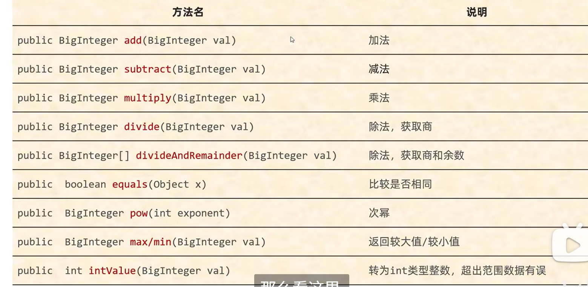

## 1、Math

Math类提供各种数学计算工具，它是一个被`final`修饰的类，也就是不能被继承的类。其中，==所有的方法都是静态的==。

#### 1.1静态成员

```java
static double E;  //常数
static double PI; //圆周率π
```

#### 1.2静态方法

```java
public static int abs(int a);   //获取参数绝对值
public static double ceil(double a);      //向上取整
public static double floor(double a);     //向下取整
public static int round(float a);  //四舍五入
public static int max(int a,int b);    //返回两个参数中较大值
public static double pow(double a,double b);   //返回a的b次幂的值
public static double random();   //返回值为double的随机值，范围[0.0,1.0);
```

#### 1.3 方法示例

```java
public class MathDemo1 {

    public static void main(String[] args) {
       //输出绝对值
        System.out.println(Math.abs(-88));

        //向上取整,只要有小数点，都会向上取一位
        System.out.println(Math.ceil(5.3));
        //向下取整
        System.out.println(Math.floor(5.9));

        //四舍五入
        System.out.println(Math.round(6.6));

        //幂运算
        System.out.println(Math.pow(2,3));

        //输出，0.0到 1.0（不包含）的随机值
        System.out.println(Math.random());
    }
}
```


##### 1.3.1 判断一个数是否为一个质数

之前的做法，效率较低

```java
    //判断一个数是否为质数
    public static boolean isPrime(int number){
        for(int i=2 ;i<number;i++){
            if(number %i ==0)
                return false;
        }

        return true;
    }
```


​	一个整数可以又两个数相乘得出，而这两个数就叫做因子。一个因子必定小于平方根，另一个因子必定大于平方根。例如，16的平方根是4，那么它的因子分别有：

1	16

2	8

4	4

​	而质数的定义是只能被本身和一整除。还是以16为例，如果它能被2整除，那么它一定能被8整除。**==所以我只需要遍历该数平方根之前的数是否能整除，如果都不能，即代表它是质数==**。

```java
    //判断一个数是否为质数(提升效率版)
    public static boolean isPrime(int number){
        for(int i=2 ;i<=Math.sqrt(number);i++){
            if(number %i ==0)
                return false;
        }
        
        return true;
    }
```


##### 1.3.2 自幂数

一个n位自然数等于自身各个位数上数字的n次幂之和。举例：

$1^3+5^3+3^3=153$

如果自幂数是一位数，也叫做独身数

三位自幂数：水仙花数	 四位自幂数：四叶玫瑰数

五位自幂数：五角星数	六位自幂数：六合数

七位自幂数：北斗七星数	八位自幂数：八仙数

九位自幂数：九九重阳数	十位自幂数：十全十美数

先获取这个数字有多少位,再获取每一位数字的n次幂加起来做判断即可

```java
 package Practice_API;

public class MathDemo1 {

    public static void main(String[] args) {

        //输出所有的水仙花数、四叶玫瑰数、五角星数
        for(int i=9;i<100000;i++){
           if(isShuiXianHua(i))
               System.out.print(i+" ");
        }
    }
    public static boolean isShuiXianHua(int number) {
        //先获取这个数字的位数
        int temp = number;
        int sum = 0;
        int length=0;
        while (temp > 0)
        {
            temp/=10;
            length++;
        }

        //循环获取该数字的最后一位的length次方之和
        temp = number;
        while(temp>0){
            sum+=Math.pow(temp%10,length);
            temp /=10;  //抛弃最后一位
        }

        //根据获取的总和，判断是否与传入的数字相等
        if(number==sum)
            return true;
        else
            return false;
    }
}

```


## 2 、System

System是Java类库中的一个工具类，提供一些关于系统的方法，下面是一些常用的方法

```java
public static void exit(int status);           // 终止当前运行的java虚拟机
public static long currentTimeMillis();        //返回当前系统的时间毫秒值形式
public static void arraycopy(数据源数组，起始索引，目的地数组，起始索引，拷贝个数);    //数组拷贝
```

方法示例:

```java
   public static final int ERROR = 0;
    public static void main(String[] args) {

        System.out.println("返回当前系统的时间毫秒值形式："+System.currentTimeMillis());

        if(ERROR ==0){
            System.exit(0);//终止运行虚拟机
        }
		
        
        int[] arr = {1,2,3,4};
        int[] arrTo={5,6,7,8};

        System.arraycopy(arr,0,arrTo,0,4);
        System.out.println("拷贝之后的数组：");
        for (int i = 0; i < arrTo.length; i++) {
            System.out.print(arrTo[i]+" ");
        }
        //输出1234
    }

//输出：返回当前系统的时间毫秒值形式：1755050134588
```

​	currentTimeMillis（）返回的值叫做**时间戳**。时间戳是从1970年1月1日开始经过的秒数，用于描述一个时间点，而我国在东八区，有八小时时差，所以具体时间原点是**1970年1月1日 08：00**。


而上面这个时间戳的单位为ms（毫秒）。


## 3、Runtime

`Runtime`表示当前虚拟机的运行环境，下面是这个类的一些方法

```java
public static Runtime getRuntime()    //当前系统的运行环境对象
public void exit(int status);     //停止虚拟机
public int availableProcessors();       //获取CPU的线程数
public long maxMemory();          //JVM能从系统中获取总内存大小（单位byte)
public long totalMemory();       //JVM已经从系统中获取总内存大小（单位byte)
public long freeMemory();		//JVM剩余内存大小（单位byte)
public Process exec(String command)        //运行cmd命令
```

方法示例：

```java
  public static void main(String[] args) throws IOException {

        Runtime r = Runtime.getRuntime();   //获取Runtime对象

        //停止虚拟机
        //r.exit(0);

        //获取CPU的线程数
        System.out.println("CPU线程："+r.availableProcessors());

        //获取系统中总内存大小
        System.out.println("能从系统中获取的内存："+r.maxMemory()/1024/1024+"mb");

        //已经获取的总内存大小
        System.out.println("已经从内存中获取的内存："+r.totalMemory()/1024/1024+"mb");

        //剩余内存大小
        System.out.println("剩余内存："+r.freeMemory()/1024/1024+"mb");

        //运行cmd命令 如shutdown -s -t 1200 在20分钟后关机
        Runtime.getRuntime().exec("notepad");
    }
```


## 4、Object和Objects

​	Object是Java中的顶级父类，所有的类都直接或间接的继承于Object类。**Object类中的方法可以被所有子类访问**。


### 4.1 Object的构造方法

```	java
public Objectx();
```

​	为什么是空参构造？在继承中，只有拥有相同的属性可以被抽取出来放在父类中。但Object是所有类的父类，没有这样一个属性是所有类都拥有的属性。


### 4.2 Object的成员方法

```java
public String toString()
    返回对象的字符串表示形式
public boolean equalse(Object obj)
    比较两个对象是否相等
protected Object clone(int a)
    对象克隆
```

代码示例

```java
//toString()  
public static void main(String[] args){
        Student st =new Student("张三","五班");

        System.out.println(st.toString());
        //默认输出：Test.Student@2f4d3709 包名.类名.地址值的形式。
        //如果想按照自己的方式输出只需重写这个方法即可
    }

//equalse(Object obj)
    public static void main(String[] args){
        Student st =new Student("张三","五班");
        Student st2=new Student("张三","五班");


        boolean result = st.equals(st2);
        //结果为假，在Object.equals中，它们比较的是地址值。
        System.out.println(result);
}
```

假设有一些`Student`类，下面是我们重写后的方法

```java
    @Override
    public String toString(){
        return this.name+" "+this.classes;
    }

    @Override
    public boolean equals(Object o){
        if(this == o)
            return true;
        if(o==null || getClass()!=o.getClass())
            return false;
        Student student =(Student) o;
        return name.equals(student.getName()) && Objects.equals(student.getClasses());
     }
```


### 4.3 浅克隆和深克隆

​	clone方法时Object父类自带的方法。它可以把一个对象的属性拷贝给另外一个对象。假设我们有下面这样的一个对象

```java
public class Student {
    private int age;
    private String name; //名字
    private String homeAddress; //家庭地址
    private int arr[]; //各科的成绩
}
```

​	想要使用clone方法，就必须实现Cloneable接口，该接口里没有抽象方法，是一个标记性接口。下面是浅克隆的一般实现方式

```java
    @Override
    public Student clone() throws CloneNotSupportedException{
        return (Student)super.clone();
    }
```

​	浅克隆直接调用父类（object）的clone方法。该克隆方法对于基本数据类型没有问题，但是当该对象中有引用数据类型或对象时，就会出现问题，我们知道引用数据类型和对象实际上是一个地址值。浅克隆会把该地址值拷贝过去，就会导致两个Student对象引用同一个地址值，当一个对象修改该地址上面的值时，另一个对象的值也会被改变。

​	注意，虽然Sgring也是对象，但它时不可变，被final关键字修饰的对象，所以不受影响，但int数组会受到浅克隆的影响。

​	

​	深克隆就是对这种问题的解决，对于单独的对象和引用，不单纯的去复制它的地址，而去对它地址值上的值进行操作。下面是比较经典的实现方法

```java
    @Override
    protected Student clone() throws CloneNotSupportedException{
        Student st = (Student)super.clone(); //先克隆对象的全部属性
        //对数组进行深拷贝
        if(this.arr !=null)
            st.arr = this.arr.clone(); //数组的clone方法单纯的传递值
        return st;
    }
```

​	先对整体的对象进行一个浅拷贝，再对引用数据类型进行修改，进行一次拷贝。返回学生对象。


### 4.4 Objects

​	Objects是一个工具类，提供了一些方法去完成一些功能。

|                      方法名                      |                    说明                    |
| :----------------------------------------------: | :----------------------------------------: |
| public static boolean equals(Object a, Object b) |         先做非空判断，比较两个对象         |
|     public static boolean isNull(Object obj)     |   判断对象是否为null，是则返回true，反之   |
|    piblic static boolean nonNull(Object obj)     | 先判断对象是否为非null，是则返回true，反之 |

​	在底层equals会直接判断两个对象的地址值是否相等。如果相等，返回true，如果不相等，则返回false。


## 5、BigInteger

​	BigInteger用于表示大型整数的类

### 5.1BigInteger构造方法

| 方法名                                     | 说明                                   |
| ------------------------------------------ | -------------------------------------- |
| public BigInteger(int num,Random rnd)      | 获取随机大整数：范围$[0 到 2^{num-1}]$ |
| public BigInteger(String val)              | 获取指定大的整数                       |
| public BigInteger(String val, int radix)   | 获取指定进制的大整数                   |
| public static BigInteger valueOf(long val) | 获取值为val的BigInteger对象            |

​	**BigInteger对象一但创建，内部记录的值是不能发生改变的**。且构造方法中的字符串参数必须是整数，注意的三个构造方法，当你指定进制后，前面的字符串参数必须是对应的进制。

​	


### 5.2 BigInteger 常见成员方法




## 6、Date

​	在Java中，Date类表示时间，它的基本格式为：

```java
周 月 日 时:分：秒 CST 年
```

​	如下程序将会输出：

```java
    public static void main(String[] args) {
        Date now =new Date();
        System.out.println(now);
    }
/**
输出：Sun Nov 02 15:16:32 CST 2025
**/
```

​	第一个表示是周几，第二个表示月份，第三个表示第几天，然后就是今天的时间。其中CST表示中国时区，全称为`China Standard Time`(中国标准时间)

​	Date有两个构造方法

```java
public Date();  // 创建一个表示当前时间的对象
public Date(long milliseconds);      //用指定的毫秒值创建时间对象
```

​	需要先解释一下，为什么要用指定的毫秒值创建时间对象，毫秒是怎么表示时间的。**这是因为Java的时间起点是`1970年1月1日08:00:00 GMT (格林威时间)`。**

​	每个`Date`对象内部都存储着一个long类型的数字：**格林威治时间**。**所以这个毫秒值代表着，从1970年1月1日到该时间点之间的毫秒数。**

​	我们知道1000毫秒才等于1秒。所以下面我们是试着输出一个时间起点后10秒，使用第二个构造方法，传递10000毫秒进去：

```java
public static void main(String[] args) {
        Date now =new Date(10000L);
        System.out.println(now);
}
/*
输出：Thu Jan 01 08:00:10 CST 1970
也就是1970年1月1日8点0分十秒，那天是星期二
*/
```

​	该类大多数方法都已过时，在这只是做一个了解，下面这个方法返回日期的时间戳（也就是从格林威治起的毫秒值）：

```java
public static void main(String[] args) {
        Date now =new Date(10000L);
        System.out.println(now.getTime());
}
```

​	

## 7 SimpleDateFormat

​	`SimpleDateFormat`类是一个非常常用的日期格式化与解析工具类。属于`java.text`包。它主要有两个用途：

1. **格式化（fomat）**

​	把`Date`类型的对象（日期时间）转换成指定格式的字符串。

2. **解析（parse）**

​	把符合指定格式的字符串转换成`Date`对象

例:

```java
import java.text.SimpleDateFormat;
import java.util.Date;

public class Main {

    public static void main(String[] args) {
        // 1. 创建SimpleDateFormat对象，并指定格式
        SimpleDateFormat sdf = new SimpleDateFormat("yyyy-MM-dd HH:mm:ss");

        // 2. 获取当前时间
        Date now = new Date();
        // 3. 格式化日期 → 字符串
        String formattedDate = sdf.format(now); //该类的format方法返回Date日期的字符串
        System.out.println("格式化后的时间：" + formattedDate);

        // 4. 解析字符串 → 日期对象
        try {
            Date parsedDate = sdf.parse("2025-11-02 08:00:00");
            System.out.println("解析后的时间：" + parsedDate);
        } catch (Exception e) {
            e.printStackTrace();
        }
    }
}
```

​	注意，该类`SimpleDateFormat`不是线程安全的。在多线程环境下建议使用`java.time.format.DateTimeFormatter`(线程安全的替代品，推荐在Java8+使用)

​	

**例题: 日期换算。**

已知，纽约时间比北京时间慢12小时，请根据用户输入的北京时间输出相应的纽约时间，若用户输入错误的月份或日期等信息则将其顺加。例如用户输入2021 13 32 14 43 54则生成北京时间为：2022-02-01 14:43:54 纽约时间为：2022-02-01 02:43:54

**输入描述：**

一组字符串，年，月，日，时，分，秒用空格隔开，如果用户数据输入不正常，应输出“您输入的数据不合理”

**输出描述：**

北京时间为：年-月-日 时:分:秒

纽约时间为：年-月-日 时:分:秒

```java
   public static void main(String[] args) throws ParseException {
        SimpleDateFormat simpleDateFormat = new SimpleDateFormat("yyyy-MM-dd HH:mm:ss");
        Scanner in = new Scanner(System.in);
        String str1 = in.nextLine(); //获取一行输入
        String str_date = ""; //用来存储转换为时间格式的字符串
        //时间格式用-分隔，但输入却要用空格隔开，我要把输入的字符串处理成时间格式
        //首先使用正则表达式分隔字符串，分隔字符串的结果是一个字符串数组，所以需要用数组来接受
        String[] arr = str1.split(" ");
        //分隔后的字符串应该用6个，分别是年、月、日、时、分、秒、
        if(arr.length!=6){
            System.out.println("您输入的数据不合理");
        }else{
            //拼接字符串
             str_date=arr[0]+"-"+arr[1]+"-"+arr[2]+" "+arr[3]+":"+arr[4]+":"+arr[5];
        }

        Date str1_Date = simpleDateFormat.parse(str_date);
        //输出北京时间：
        System.out.println("北京时间为："+simpleDateFormat.format(str1_Date) );
        //输入一个北京日期时间，输出一个纽约日期时间
        Date NyDate = new Date(str1_Date.getTime() - (1000*60*60*12));
        System.out.println("纽约时间为："+simpleDateFormat.format(NyDate));
    }
```


## 8 String(重要)

​	String类是Java中最常用，最重要的一个类，熟悉它的构造方法和公共方法是了解java最好的途径。在Java中，String类表示字符串，它是被`final`修饰的类，它是不可变的，不可被继承的类。

​	为什么说它是不可变的对象，下面的例子就让它改变了：

```java
String st1="Hello";
str1="Word";
```

​	它从`Hello`变成了“Word”，是这样吗，不然。本质上，**它只是从一个引用转到另一个引用**。**在Java中，字符串常量本质也是一个对象。只是它的创建方式、存储位置和生命周期与普通对象略有不同。**

​	字符串常量是由Java虚拟机（JVM）在程序加载时自动创建并存放在**字符串常量池**的一个`String`对象。例如：

```java
String s ="hello"
```

​	这行代码其实会：

1. 在字符串常量池中查找是否存在 `"hello"`；
2. 如果没有，就创建一个新的 `String` 对象放入常量池；
3. 然后让变量 `s` 引用这个对象。

例子说明：

```java
public class StringLiteralDemo {
    public static void main(String[] args) {
        String s1 = "abc";
        String s2 = "abc";
        String s3 = new String("abc");

        System.out.println(s1 == s2); // true，指向同一个常量池对象
        System.out.println(s1 == s3); // false，new 创建的新对象在堆中
        System.out.println(s1.equals(s3)); // true，内容相同
    }
}

```

​	`abc`在常量池中只存在一份。而`new String("abc")`会在堆中创建一个副本对象，实际上s1和s2引用的是同一个对象。所以我们说，字符串是不可变的。

​	而我们用`final`关键字去修饰它时，它的作用是时阻止它引用其他字符串。如下：

```java
final String str1 ="Hello";
str1="World"; //ERROR
```

​	

​	在Java中，使用`Unicode`字符集表示字符串，每个字符通常占2字节（16位），`Unicode`字符集包含了几乎所有语言文字、符号、表情符号等。这就是为什么Java命名规则支持大多数字符，甚至支持中文（通常不推荐这么做，但可以）

```java
public class 示例 {
    public static void main(String[] args) {
        int 年龄 = 20;
        String 名字 = "田韦韦";
        System.out.println(名字 + "的年龄是" + 年龄);
    }
}
```

​	同时，下面的程序将演示字符串的本质：

```java
    public static void main(String[] args){
       String str = "Hello";
       for(int i=0;i<str.length();i++){
           System.out.println(i+": "+str.charAt(i)+" "+str.codePointAt(i));
       }
    }
//输出：
0: H 72
1: e 101
2: l 108
3: l 108
4: o 111

```

​	`charAt`方法返回指定位置的字符（从0开始），而`codePointAt()`返回指定位置字符的Unicode码。

###  8.1 String常用方法

#### 1.基本信息
| 方法                     | 说明             | 示例                        |
| ------------------------ | ---------------- | --------------------------- |
| `int length()`           | 返回字符串长度   | `"Hello".length()` → 5      |
| `char charAt(int index)` | 返回指定位置字符 | `"Hello".charAt(1)` → `'e'` |
| `boolean isEmpty()`      | 判断是否为空     | `"".isEmpty()` → `true`     |

#### 2.比较方法
| 方法                                   | 说明             | 示例                                     |
| -------------------------------------- | ---------------- | ---------------------------------------- |
| `boolean equals(Object obj)`           | 比较内容是否相等 | `"abc".equals("ABC")` → `false`          |
| `boolean equalsIgnoreCase(String str)` | 忽略大小写比较   | `"abc".equalsIgnoreCase("ABC")` → `true` |
| `int compareTo(String another)`        | 字典顺序比较     | `"apple".compareTo("banana")` → -1       |

#### 3.查找方法
| 方法                                | 说明                 | 示例                              |
| ----------------------------------- | -------------------- | --------------------------------- |
| `int indexOf(String str)`           | 子串第一次出现位置   | `"banana".indexOf("na")` → 2      |
| `int lastIndexOf(String str)`       | 子串最后一次出现位置 | `"banana".lastIndexOf("na")` → 4  |
| `boolean contains(CharSequence s)`  | 是否包含子串         | `"hello".contains("ell")` → true  |
| `boolean startsWith(String prefix)` | 是否以指定前缀开头   | `"hello".startsWith("he")` → true |
| `boolean endsWith(String suffix)`   | 是否以指定后缀结尾   | `"hello".endsWith("lo")` → true   |
| `boolean matches(String regex)`     | 是否匹配正则表达式   | `"abc123".matches("\\w+")` → true |

#### 4、截取与拼接
| 方法                                                         | 说明                 | 示例                                                     |
| ------------------------------------------------------------ | -------------------- | -------------------------------------------------------- |
| `String substring(int beginIndex)`                           | 从指定索引截取到末尾 | `"abcdef".substring(2)` → `"cdef"`                       |
| `String substring(int beginIndex, int endIndex)`             | 截取指定范围         | `"abcdef".substring(1, 4)` → `"bcd"`                     |
| `String concat(String str)`                                  | 拼接字符串           | `"Hello ".concat("World")` → `"Hello World"`             |
| `String join(CharSequence delimiter, CharSequence... elements)` | 使用分隔符拼接       | `String.join("-", "2025","11","02")` → `"2025-11-02"`    |
| `String format(String format, Object... args)`               | 格式化输出           | `String.format("Hi %s, %d", "Tom", 20)` → `"Hi Tom, 20"` |

#### 5.大小写与空白处理
| 方法                   | 说明                    | 示例                              |
| ---------------------- | ----------------------- | --------------------------------- |
| `String toUpperCase()` | 转大写                  | `"java".toUpperCase()` → `"JAVA"` |
| `String toLowerCase()` | 转小写                  | `"JAVA".toLowerCase()` → `"java"` |
| `String trim()`        | 去除首尾空格            | `"  hello  ".trim()` → `"hello"`  |
| `String strip()`       | 去除所有 Unicode 空白符 | `" hi ".strip()` → `"hi"`         |

#### 6.替换与修改
| 方法                                                 | 说明     | 示例                                       |
| ---------------------------------------------------- | -------- | ------------------------------------------ |
| `String replace(char old, char new)`                 | 替换字符 | `"banana".replace('a','o')` → `"bonono"`   |
| `String replace(CharSequence old, CharSequence new)` | 替换子串 | `"abcabc".replace("ab","xy")` → `"xycxyc"` |

#### 7.转换与拆分
| 方法                           | 说明                 | 示例                                   |
| ------------------------------ | -------------------- | -------------------------------------- |
| `String[] split(String regex)` | 按正则拆分           | `"a,b,c".split(",")` → `["a","b","c"]` |
| `char[] toCharArray()`         | 转字符数组           | `"Hi".toCharArray()` → `['H','i']`     |
| `byte[] getBytes()`            | 转字节数组           | `"ABC".getBytes()`                     |
| `String valueOf(任意类型)`     | 将任意类型转为字符串 | `String.valueOf(123.45)` → `"123.45"`  |


## 9 Random

​	Random是用于生成随机数的类。

1. 种子：如果不指定种子，则使用当前时间的毫秒数作为种子，这样每次运行会得到不同的随机序列。
2. 常用方法：
   - nextInt(): 返回一个随机整数（整个int范围）
   - nextInt(int bound): 返回一个[0, bound)之间的随机整数
   - nextLong(): 返回一个随机长整数
   - nextFloat(): 返回一个[0.0, 1.0)之间的随机浮点数
   - nextDouble(): 返回一个[0.0, 1.0)之间的随机双精度浮点数
   - nextBoolean(): 返回一个随机布尔值
   - nextBytes(byte[] bytes): 生成随机字节并填充到字节数组中

生成指定范围的代码如下：

```java
int randNumber = rand.nextInt(MAX-MIN+1)+MIN;
```

 	将会生成[MIN,MAX]区间内的数。


​	


## 9 Map接口

​	使用键值映射计算字符个数：

```java
    public static void main(String[] args){
        //创建链表键值映射
        Map<Character,Integer> map = new LinkedHashMap<>();
		
        Scanner in = new Scanner(System.in);
        String str = in.nextLine();
        str= str.strip(); //去除空格字符
        for(int i=0;i<str.length();i++){
            //如果str.charAt(i)在集合中不存在，则它的值是1，
            //反之它的值应用sum函数。
            map.merge(str.charAt(i),1,Integer::sum);
        }

        Set<Map.Entry<Character, Integer>> entry = map.entrySet();
        for(Map.Entry<Character,Integer> entry1 :entry){
            Character c = entry1.getKey();
            Integer I = entry1.getValue();
            System.out.println(c+":"+I);
        }
    }
```


