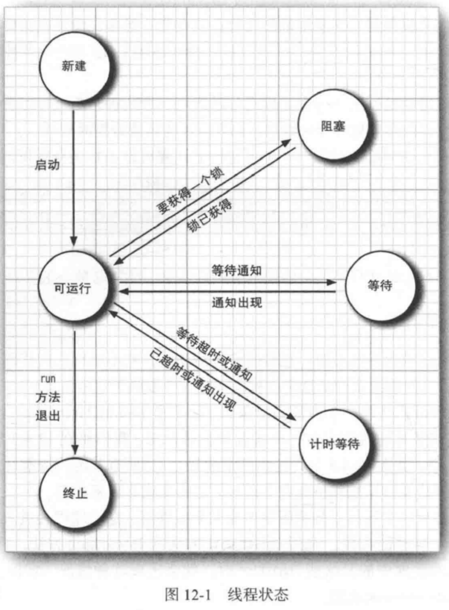
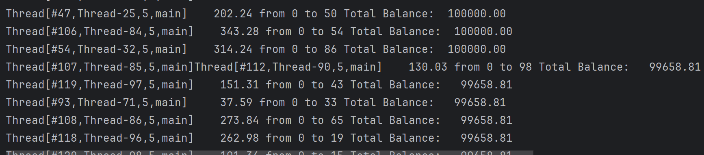
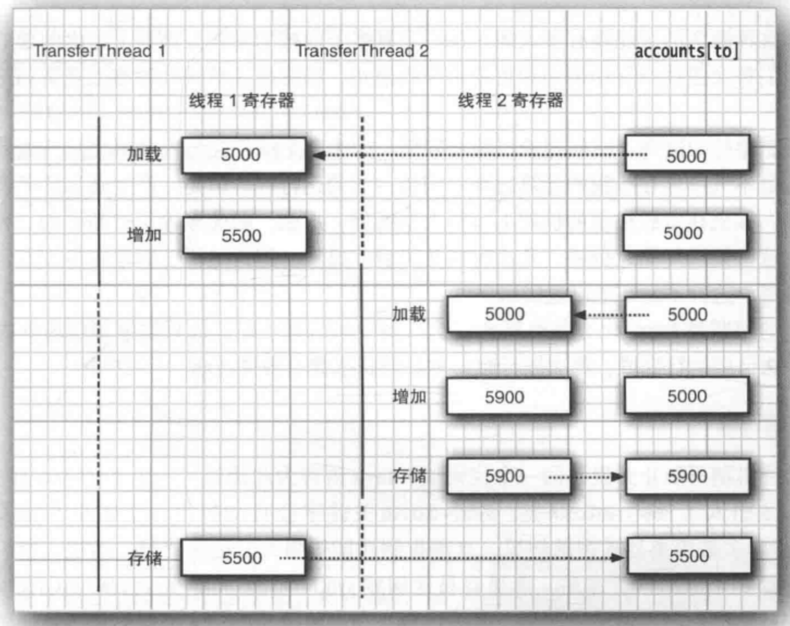

- 	多线程程序在更低一层扩展了多任务的概念：==单个程序看起来在同时完成多个任务。每个任务在一个线程（thread）中执行，线程是控制线程的简称。如果一个程序可以同时运行多个线程，则称这个程序在多线程程序（multithreaded）==。


​	多进程（process）与多线程有什么区别？ ==**本质的区别在于每个进程都拥有自己的一整套变量，线程则共享数据**==。这会有一些风险，稍后介绍这个问题。不过，**共享变量使线程之间通信比进程之间的通信更高效、更容易**。此外，在有些操作系统中。与进程相比较，线程更“轻量级”，创建、撤销单个线程比启动新进程的开销要小得多。

​	在实际应用中，多线程非常有用。例如，一个浏览器应该能够同时下载多个图片、一个Web服务器需要能够同时服务并发的请求。本章将介绍如何为Java应用添加多线程功能。


## 12.1 什么是线程

​	线程是操作系统能够进行运算调度的最小单元，**它被包含在进程之中，是进程中的实际运作单位。而进程是程序的基本执行实体。**

​	首先来看一个使用了两个线程的简单程序。这个程序可以在银行账户之间完成资金转账。我们使用一个Bank类，它可以储存给定数目的账户的余额。transfer方法将一定金额从一个账户转账到另外一个账户

​	在第一个线程中，我们将前从账户0转移到账户1。第二个线程将前从账户2转移到账户3。

​	

​	下面是一个单独的线程中运行一个任务的简单过程

1. ==**将执行这个任务的代码放在一个类的run方法中，这个类要实现Runnable接口。Runnable接口非常简答，只有一个方法**==：

```java
public interface Runnable{
    void run();
}	
```

​	由于Runnable是一个函数式接口，可以用一个lambda表达式创建实例。

```java
Runnable r = ()-{
    take code
};
```

2. ==**Thread构造方法需要一个实现了Runnable接口的类**==：

```java
Thread t = new Thread(r);
```

3. **启动线程**，它会执行Runnable接口中的run方法。

```java
t.start();
```

​	为了创建单独的线程来完成转账，我们将转账代码放在一个Runnable接口中的run方法里，然后启动一个线程:

```java
        Runnable r = ()->{
            try{
                //user0给user1转账500，总共5次，每次间隔2秒
                for(int i=0;i<5;i++){
                    user0.transfer(user1,500);
                    Thread.sleep(2000); //1秒等于1000ms
                    System.out.println("wait....");
                }
            }catch(InterruptedException e){
            }
        };
	
		//创建一个线程，该线程构造方法要求传入一个Runnable接口的实现类
        Thread t = new Thread(r);/
        t.start();//启动线程

```

​	`Thread.sleep`方法会延迟毫秒时间，这个方法可能抛出`InterruptedException`（中断）异常，这里使用try...catch语句捕获该异常。


​	下面是这个程序的完整代码：

```java
package ThreadTest;

import java.util.Arrays;
import java.util.NoSuchElementException;
import java.util.concurrent.locks.Lock;
import java.util.concurrent.locks.ReentrantLock;

public class Bank {
    private final double[] accounts; //账户资金
    Lock lock;
    public Bank(int n,double initialBalance){
        accounts =new double[n];
        Arrays.fill(accounts,initialBalance); //将数组的每个余额都填充为同一个值
         lock = new ReentrantLock();
    }

    //让数组下标为from的向下标为to的转账amount
    public void transfer(int from,int to,double amount) {

        //如果余额小于转账金额就停止
        if(accounts[from] < amount)
            return;

        System.out.print(Thread.currentThread().getName());
        accounts[from]-=amount;
        System.out.print("账户"+from+"向账户"+to+"转账"+amount+"元");
        accounts[to]+=amount;
        System.out.println(" 银行总余额:"+getTotalBalance());
    }

    /*
    * 获得银行的剩余余额总额
    * @return 总余额
    * */
    public double getTotalBalance(){
        double sum=0;
        if(accounts==null)
            return sum;

        for(double a:accounts)
            sum+=a;

        return sum;
    }

    //返回用户的个数，即数组中的元素个数
    public int size(){
        return accounts.length;
    }

    //查看银行所有账户中的金额
    public void show(){
        if(accounts==null)
            throw new NoSuchElementException("数组为空");
        for(int i=0;i< accounts.length;i++){
            System.out.print(accounts[i]+" ");
        }
    }


}

```

​	两个线程的输出是交错的，这说明它们在并发运行，需要记住，线程是并发的，它的运行顺序由系统决定，

**`Java.lang.Thread`**

```java
Thread(Runnable target)
    构建一个新线程，它会调用Runnable接口中的run（）方法
void start()
    启动这个线程,该线程变为RUNNABLE状态，从而调用run()方法，这个方法将立即返回。新线程会并发运行
void run()
    调用相关Runnable的run方法
static void sleep(long millis)
    休眠指定的毫秒数
```

​	需要注意的是，调用`start()`方法才会启动线程，使线程变为**RUNNABLE状态**，而`run`方法只是`Runnable`接口中的实例方法，并不会并发执行，只有线程才会并发执行

​	而类似于`Thread.sleep()`等属于类的静态方法，它的操作对象，都是当前正在运行的RUNNABLE状态

**Java.lang.Runnbale**

```java
void run()
    必须覆盖这个方法，提供希望执行的任务指令。
```

​	实际上，我们经常使用的`main`方法，也是一个线程，而我们在main方法里写的线程，可以叫做main方法的子线程。你创建一个线程后，该线程就会和main线程抢夺CPU时间片，所以看起来执行是无序的，这种执行状态就叫做并发。

#### 12.1.1 共享的变量

​	存在于**堆和方法去**的变量，所有线程都能通过引用找到并修改它。

- 实例变量：存储在堆内存的实例对象中，只要多个线程持有同一个对象的引用，就能访问该变量。
- 静态变量：存储在方法区（元空间）的类信息中，它们属于类，不属于某个对象，全局唯一，所有线程共享。
- 数组元素：数组对象同样存储在堆中，其内部元素对所有持有该数组引用的线程可见。


## 12.2 线程状态

线程可以有如下6种状态：

- **New (新建)**
- **Runnable （可运行）**
- **Blocked （阻塞）**
- **Waiting （等待）**
- **Timed waiting （计时等待）**
- T**erminated （终止）**

​	要确定一个线程的当前状态，只需要调用`getState`方法。

1. 当一个线程新建后，此时没有调用*start*方法，此时处于*New*状态。
2. 当调用`t.start()`后，处于`Runnable`，在Java层级，不区分就绪和运行中。即便线程正在等待CPU分配时间片，或者正在执行代码，状态均为RUNNABLE。 即使是调用`Thread.yield()`。线程状态仍然保存RUNNBALE
3. 线程视图进入`synchronized`修饰的代码块或方法，但该对象的`Monitor`锁被其他线程所持有时，该线程为BLOCKED状态。
4. **WAITING**。触发条件：线程需要等待其他线程执行特定动作。
5. TIMED WAITING(计时等待)： 线程进入等待状态，但在指定时间后会自动被唤醒。
6. Terminated(终止) ：触发条件，run()方法正常执行结束，或因为未捕获的异常导致方法非正常退出。


#### 12.2.1 新建线程

​	当用new操作符创建一个新线程时，如`new Thread(new Runnable(){})`, 这个线程还没有开始运行。此时它的状态是新建（new）。


#### 12.2.2 可运行线程

​	**一旦调用start()方法**，线程就处于可运行状态。

​	一旦一个线程开始运行，它不一定始终保存运行。事实上，**运行中的线程有时需要暂停，让其他线程有机会运行**。线程调度的细节依赖于操作系统提供的服务。

​	抢占式调度系统给每一个可运行线程一个时间片来执行任务。当时间片用完时，操作系统会剥夺该线程的运行全，并给另一个线程一个机会运行。当选择下一个线程时，操作系统会考虑线程的优先级。

​	==**在任何给定时刻。一个可运行的线程可能正在运行也可能没有运行（正是出于该原因，这个状态称为“可运行”而不是“正在运行”**==

**`java.lang.Thread`**

```java
static void yield()
    使当前正在执行的线程交出运行权。
```

​	基本上，线程的运行，是由**线程调度器**指挥，什么时候执行哪个线程，都由它负责，那么这个方法就表示，我（正在执行的线程）愿意交出我的运行权，上交组织，由组织分配资源。


#### 12.2.3 阻塞和等待线程

​	**当线程处于阻塞或等待状态时，它暂时是不活动的。它不执行任何代码，并且消耗最少的资源**。

- ==**当一个线程试图获取一个内部的对象锁，而这个锁目前被其他线程占有，该线程就会被阻塞。当其他线程都释放了这个锁，并且线程调度器允许该线程持有这个锁时，它将变成非阻塞状态。**==
- **当线程等待另一个线程通知调度器出现某个条件时，这个线程会进入等待状态**。调用`Object.wait`方法或`Thread.join`方法，或是等待`java.util.concurrent`库中的`Lock`或`Condition`时,就会出现这种情况。**实际上，阻塞状态与等待状态没有太大区别**
- 有几个方法有超时参数，**调用这些方法会让线程进入计时等待（timed waiting ) 状态。这一状态将一直保持到超时期满或接收到适当的通知。**带超时参数的方法有`Thread.sleep`和计时版的`Object.wait`、`Thread.join`、`Lock.tryLock`以及`Condition.await`;


#### 12.2.5 终止线程

​	线程会由于以下两个原因之一而终止：

- 由于run方法正常退出，线程自然终止。
- 因为一个没有捕获的异常终止了run方法，使线程意外终止。



​	具体的说，可以调用线程的stop方法杀死一个线程。该方法抛出一个`TheadDeath`错误对象，这会杀死线程。不过stop方法已经废弃。

**`java.lang.Thread`**

```java
void join()
    让当前线程（调用该方法的线程）等待被调用join()方法的线程执行完毕，然后再继续执行当前线程。
void join(long millis)
    使当前正在执行的线程进入阻塞状态，被阻塞线程最多等待millis秒，或者该线程（实例线程调用者）执行完毕。
Thread.State getState()
    得到这个线程的状态：取值尾NEW、RUNNABLE、BLOCKED、WAITING、TIMED_WAITING或TERMINATED。
void stop()
    停止该线程。这个方法已经废弃
void suspend()
    暂停这个线程的执行。这个方法已经废弃。
void resume()
    恢复线程。这个方法只能再调用suspend()之后使用。这个方法已经废弃。
```


##  12.3  线程属性

​	下面几节将讨论线程的各种属性，包括中断的状态、守护线程、未捕获异常的处理器以及不应使用的遗留特性。


#### 12.3.1 中断线程

​	当一个线程的run方法返回时，或出现了方法中未出现的异常，这个线程将终止。

​	除了已经废弃的stop方法，没有办法强制一个线程终止。不过，==interrupt方法可以用来**请求**终止一个线程==

​	对一个线程调用`interrupt`方法时，**就会设置线程的中断状态（interrupted status)** 。这是每个线程都有一个boolean标志，各个线程都应该不时的检查这个标准，已判断线程是否被中断

​	**要确定是否被设置了中断状态，首先调用静态方法Thread.currentThread获得当前线程，然后调用isInterrupted方法**：

```java
        if(!(Thread.currentThread().isInterrupted())){
            System.out.println("当前线程为中断状态");
        }
```

​	或者调用线程的`isInteerupted`方法

```java
  	if(!t.isInterrupted()){
            System.out.println("当前线程为中断状态");
        }else{
            System.out.println("当前线程不是中断状态");
        }
```

​	但是，==如果线程被阻塞，就无法检查中断状态==。**在一个被sleep或wait调用阻塞的线程上调用interrupt方法时,那个阻塞调用（即sleep或wait调用）被一个InterruptedException异常中断**

```java
   Thread  t = new Thread(()->{
            try{
                System.out.println("子线程t：我要休息10秒了");
                Thread.sleep(10000);
            }catch(InterruptedException e){
                System.out.println("子线程：被打断信号异常中断");
                System.out.println("子线程：当前中断标志位是 "+ Thread.currentThread().isInterrupted());
            }
        }, "t");

        t.start();
        t.interrupt();
    }
```

​	在抛出`InterruptException`异常时，JVM会自动清除重置中断位标识，设置为false。

​	

​	==Java语言并没有要求中断的线程应当终止。中断一个线程只是要引起它的注意。被中断的线程可以决定如何响应中断==。普遍的情况是,线程只希望将中断解释为一个终止请求。这个线程的run方法有如下形式：

```java
Runnable r = ()->{
    try{
        ...
        while(!Thread.currentThread().isInterrupted())
            //do more work
    }catch(InterruptedException e){
       //线程在睡眠或等待期间被中断
    }finally{
        //清理，如有必要
    }
}
```

​	==如果在每次工作迭代之后都调用了sleep方法（或者其他可中断方法），`isInterrupted`检查既没有必要也没有用处==。如果设置了中断状态，此时倘若调用sleep方法，它不会休眠。实际上，它会清楚中断状态并抛出`InterruptedException`。==**因此，如果你的循环调用了sleep，不要检查中断状态，而应当捕获InterruptedException异常**==。

```java
Runnable r = ()->{
    try{
        ...;
        while(){
            Thread.sleep(delay);
        }
    }catch(InterruptedException e){
        
    }finally{
        //清理，如有必要
    }
}
```

​	看到这里，是否就认为 ，只要涉及到sleep等阻塞方法，就应该捕获`InterruptedException`，这样做虽然是可以的，但要知道，当中断信号发出时，本意是想让这个线程停止，但因为线程是阻塞的，JVM选择抛出异常，抛出异常之后呢？这个中断标识位又设置为false了。

​	所以，我**们应该在捕获后做一些合理的处理，比如，重新设置中断标识位，**调用`interrupt`方法如下：

```java
Thread t = new Thread(()->{
    try{
        Thread.sleep(1000);
    }catch(InterruptException e)
    {
        ....
        //重新调用中断
        Thread.currentThread().interrupt();
    }
})
```

​	或者将该异常向上传递，也就是在方法出声明抛出异常

```java
void myTask() throws InterruptException{
    sleep(delay)
}
```

​	总之，有异常，就要处理。


```java
注释：有两个非常类似的方法， interrupted和isInterrupted。
    isInterrupted()方法，是一个实例方法，用于检查调用该方法的线程实例的中断状态。它不会清除中断状态，即只是查询中断状态，不会改变中断标识
    interrutped()方法，是一个静态方法。属于Thread类，用于检查当前正在执行的线程是否被中断。调用Thread.interrupted()会返回当前线程的中断状态，并且会清除中断状态。
```

**`java.lang.Thread`**

```java
void interrupt()
    想线程发送中断请求。线程的中断状态将被设置为true。如果当前该线程被一个sleep调用阻塞，则抛出一个InterruptedException异常
static boolean interrupted()
    测试当前线程（即正在执行这个指令的线程）是否被中断。这个调用有一个副作用，会清除中断状态
boolean isInterrupted()
    测试一个线程是否被中断。与static interrupted方法不同，这个调用不改变线程的中断状态
static Thread currentThread()
    返回表示当前正在执行的线程的Thread对象。
```


#### 12.3.2 守护线程

调用

```java
t.setDaemon(true); // 将t线程设置为守护线程，前提是t没有启动
```

​	将一个线程转换为守护线程**。守护线程唯一的用途是为其他线程提供服务**。计时器线程就是一个例子，它定时地向其他线程发送“计时器滴答”信号，另外清空过时缓存项的线程也是守护线程。只剩下守护线程时，虚拟机就会退出。==因为如果只剩下守护线程，就没必要继续运行程序了==。

**`java.lang.Thread`**

```java
void setDaemon(boolean isDaemon)
    标记该线程为守护线程或用户线程。这一方法必须在线程启动之前调用。比如线程A.setDaemon(true),那么线程A则为守护线程。守护线不能是正在执行的线程。
```

​	如果你视图将这个方法应用在启动后的线程上，那`JVM`

#### 12.3.3 线程名

​	默认情况下，线程有容易记的名字，如Thread-2。可以用setName方法为线程设置如何名字：

```java
    public static void main(String[] args){

        Runnable r = ()->{ //实现一个接口
            System.out.println("SB");
        };

        Thread t = new Thread(r);

       System.out.println("线程t默认的名字："+t.getName());

       t.setName("SB线程");
       System.out.println("线程t更改后的名字："+t.getName());
    }
/*
输出：
线程t默认的名字：Thread-0
线程t更改后的名字：SB线程
*/
```

​	这在线程转储时可能有用


#### 12.3.4 未捕获异常的处理器。

​	线程的run方法不能抛出任何检查型异常，但是，非检查型异常（Error或RuntimeException）可能会导致线程终止。在这种情况下，线程会死亡。

```java
public class UncaughtExceptionHandlerDemo {
    public static void main(String[] args) {
        // 1. 创建一个线程
        Thread thread = new Thread(() -> {
            System.out.println("线程开始运行...");
            
            // 模拟一段时间后抛出一个运行时异常（非检查型异常）
            try {
                Thread.sleep(1000);
            } catch (InterruptedException e) {
                e.printStackTrace();
            }
            
            // 这个异常没有被内部的 try-catch 捕获，将会导致线程终止
            throw new RuntimeException("一个模拟的运行时异常！");
        });

        // 2. 为该线程设置 UncaughtExceptionHandler
        thread.setUncaughtExceptionHandler(new Thread.UncaughtExceptionHandler() {
            @Override
            public void uncaughtException(Thread t, Throwable e) {
                // 这是异常线程的“临终遗言”处理地
                System.err.println("捕获到线程 '" + t.getName() + "' 中的未捕获异常: " + e.getMessage());
                // 这里通常进行日志记录，例如使用 log4j:
                // logger.error("Uncaught exception in thread: " + t.getName(), e);
            }
        });

        System.out.println("启动线程...");
        thread.start();

        // 3. 主线程等待子线程结束（无论是正常结束还是因异常死亡）
        try {
            thread.join();
        } catch (InterruptedException e) {
            e.printStackTrace();
        }

        System.out.println("子线程状态: " + thread.getState()); // 将是 TERMINATED
        System.out.println("主线程结束。");
    }
}     
```

​	实际上，在线程死亡之前，异常会传递一个用于处理**未捕获异常的处理器**。当线程由非检查型异常导致结束时，那么此时**未捕获异常的处理器是最后一道安全防线**。可以防止线程静默死亡，同时提供诊断异常和回复的可能性

​	这个处理器必须实现属于一个实现了`Thread.UncaughtExceptionHandler`接口的类。这个接口只有一个方法：

```java
void uncatghtException(Thread t, Throwable e)
```

​	使用**setUncaughtExceptionHandler**方法为任何线程安装一个**未捕获异常的处理器**。也**可以用Thread类的静态方法`setDefaultUncaughtExceptionHandler`为所有线程安装一个默认的处理器。**替代处理器可以使用日志API将未捕获异常的报告发送到一个日志文件。如果没有安装默认处理器，默认处理器则为null。


​	但是，**如果没有为单个线程安装处理器，那么这个线程的处理器就是该线程的ThreadGroup对象**

​	ThreadGroup类实现了`Thread.UncaughtExceptionHandler`接口。它的`uncaughtException`方法执行以下操作：

1. 如果该线程组有父线程组，那么调用父线程组的uncaughtException方法
2. 否则，如果`Thread.getDefaultcaughtExceptionHanlder`方法返回一个非null的处理器，则调用该处理器。
3. 否则，如果Throwable是一个ThreadDeath（代表正常死亡）一个实例，什么都不做
4. 否则，将线程的名字以及Throwable的栈轨迹输出到Sytem.err。

​	非受查异常处理流程： 寻找是否有单独的处理器------->调用所属线程组的`uncaughtException`方法，如果有父线程组，就调用父组的这个方法如果没有就-------->寻找默认处理器，也没有--------> 打印到标准错误流(System,err)。

**`java.lang.Thread`**

```java
static void setDefaultUncaughtExceptionHandler(Thread.UncaughtExceptionHandler handler)
    为所有线程设置为未捕获异常的处理器
static Thread.UncaughtExceptionHandler getDefaultUncaughtExceptionHandler()
    获得所有线程未捕获异常的处理器。
void setDefaultUncaughtExceptionHandler(Thread.UncaughtExceptionHandler handler)
    为一个线程设置未捕获异常的处理器
Thread.UncaughtExceptionHandler getUncaughtExceptionHandler()
    设置或获得未捕获异常的处理器。如果没有按照处理器，则将线程组对象作为处理器。
```

**`java.lang.Thread.UncaughtExceptionHandler`**

```java
void uncaughtException(Thread t, Throwable e)
    当线程因一个未捕获异常而终止时，要记录一个定制报告。
```

**`java.lang.ThreadGroup`**

```java
void uncaughtException(Thread t,Throwable e)
    如果有父线程组，调用父线程组的这个方法，或者，如果有默认处理器，就调用Thread类的默认处理器，否则，将栈轨迹打印到标准错误流。
```


#### 12.3.5 线程优先级

​	在Java程序设计语言中，每一个线程有一个优先级。默认清空下，一个线程会继承构造它的那个线程的优先级。可以使用`setPriority`方法提高或讲题任何一个线程的优先级。如可以设置为`MIN_PRIORITY(1)`或`MAX_PRIORITY(10)`之间的任何值

​	每当线程调度器有机会选择新线程时，它首先选择有较高优先级的线程。但是，==线程优先级高度依赖系统。当虚拟机依赖于主机平台的线程实现时，Java线程的优先级会映射到主机平台的优先级==。

​	总的来说，在Liunx的Oracle JVM中，会完成忽略线程优先级，即所有线程都有相同的优先级。

**`java.lang.Thread`**

```java
void setPriority(int newPriority)
    设置这个线程的优先级。优先级必须在Thread.MIN_PRIORITY与Thread.MAX_PRIORITY之间。
staitc int MIN_PRIORITY
    最小的优先级，值为1;
static int NORM_PRIORITY
    默认的优先级，值为5;
static int MAX_PRIORITY
    最大的优先级，值为10;
```


## 12.4 同步

​	在大多数实际的多线程应用中，两个或两个以上的线程需要共享存取相同的数据。如果两个线程存取同一对象，**并且每个线程分别调用了一个修改该对象状态的方法**。这两个线程会相互覆盖。取决于线程访问数据的次序，可能会导致对象被破坏。这种情况通常称为**竞态条件**


#### 12.4.1 竞态条件的一个例子

​	为了避免多线程破坏共享数据，必须学习如何**同步存取（synchronize the access)**。在本节，你会看到如果没用使用同步会发生什么

​	在下面的测试程序中，还是考虑我们模拟的银行。我们要随机地选择从哪个源账户转账到哪个目标账户。这会产生问题

```java
public void transfer(int from,int to,double amount)
{
    System.out.print(Thread.currentThread()); //输出当前正在执行的线程
    accounts[from] -=amount;
    System.out.printf("%10.2f from %d to %d",amount,from,to);
    accounts[to]+=amount;
    System.out.printf("Total Balance:%10.2f\n",getTotalBalance());
}
```

​	下面是Runnbale实例的代码，run方法不断地从一个给定银行账户取钱，在每次迭代中，run方法选择一个随机的目标账户和一个随机金额，调用bank对象的transfer方法。然后休眠。

```java
Runnbale r = ()->{
    try{
        while(true){
            int toAccount = (int)(bank.size()*Math.random());
            double amount=MAX_AMOUNT*Math.random();
            bank.transfer(fromAccount,toAccount,amount);//fromAccount必须在数组下标范围内
            Thread.sleep((int)(DELAY*Math.random()));//计时等待随机毫秒
        }
    }catch(InterruptedException e){ //只是捕获，什么都不做
    }
}
```

​	在这个模拟程序运行时，我们不清楚在某一个时刻某个银行账户中有多少钱，但我们知道所有账户的总金额应该保持不变。

下面是一个有问题的程序:

```java
package ThreadTest;

public class Main {
    public static void main(String[] args){
        Bank bank = new Bank(100,10000);
        System.out.println("银行总余额："+bank.getTotalBalance());
        bank.show();

        //循环100次，创建100个线程
        for(int i =0;i<100;i++){
            int fromAccount=i;

            Thread task1 = new Thread(()->{
                try{
                    while(true){
                        int toAccount = (int)(bank.size()*Math.random()); //
                        double amount=1000*Math.random();
                        bank.transfer(fromAccount,toAccount,amount);//fromAccount必须在数组下标范围内
                        Thread.sleep((int)(10*Math.random()));//计时等待随机毫秒

                    }
                }catch(InterruptedException e)
                {
                    Thread.currentThread().interrupt(); //重新设置中断状态
                }
            },"task"+i);
            task1.start();
        }
    }
}

```

在执行一定次数后，银行的总金额会被修改：




#### 12.4.2 竞态条件详解

​	12.4.1节中运行了一个出现，其中有多个线程更新银行账户余额。一段时间后，不知不觉中就出现了错误，可能有些钱会丢失，也可能凭空有钱进账。==当两个线程试图同时更新同一个账户时，就会出现这个问题。==

​	假设两个线程同时执行指令：

```java
accounts[to]+=amount;
```

​	问题在于这不是**原子操作**。这个指令可能如下处理：

1. 将accounts[to]加载到寄存器。
2. 增加amount。
3. 将结果写会accounts[to]。

​	现在，假定第1个线程执行步骤1和步骤2，然后，它的运行权被抢占。再假设第2个线程被唤醒，更新account中的同一个元素。然后，第1个线程被唤醒并完成第3步，

​	这个动作会抹去第2个线程所做的修改，这样一来，总金额就不再正确。



​	主要的问题是transfer方法可能会在执行到中间时被中断。如果能够确保线程失去控制权之前方法已经完成，那么银行账户对象的状态就不会被破坏。

​	

#### 12.4.3 锁对象（重入锁）

​	**有两种机制可防止并发访问一个代码块。**Java语言为此提供了一个`synchronized`关键字，另外Java5引入了`ReentrantLock`类。`synchronized`关键字会自动提供一个锁以及相关的“条件”，对于大多数需要显式锁的情况，这种机制很强大。`java.util.concurrent`框架为这些基础机制提供了单独的类。在12.4.5节介绍`synchronized`关键字

​	==**用ReentrantLock保护代码块的基本结构如下：**==

```java
myLock.lock();  // myLock is a ReentrantLock object
try{
    
}finally{
    myLock.unlock();
}
```

​	==这个结构确保任何时刻只有一个线程进入临界区。一旦一个线程锁定了锁对象，任何其他线程都无法通过lock语句。当其他线程调用lock时，它们会暂停，直到第一个线程是否了这个锁对象==。

```java
警告：必须要把Unlock操作包在finally字句中，这一点至关重要，如果临界区的代码库出现了一个异常，必须释放锁。否则其他线程将永远阻塞
```

​	下面使用一个锁来保护Bank类的transfer方法

```java
public class Bank{
    private Lock BanLock = new ReentrantLock();
    ....
    public void transfer(int from,int to, int amount){
        bankLock.lock();
        try{
            System.out.print(Thread.currentThread());
            accounts[from]-=amount;
            System.out.printf("%10.2f from %d to %d",amount,from,to);
            accounts[to]+=amount;
            System.out.printf("Total Balance:%10.2f\n",getTotalBalance());
        }finally{
            bankLock.unlock();
        }
    }
}
```

​	假设一个线程调用了transfer，但在执行结束前被抢占。再假设第二个线程也调用了transfer，由于第二个线程不能获得锁，将在调用lock方法时被阻塞。它会暂停，必须等待第一个线程执行完transfer方法。当第一个线程释放锁时，第二个线程才能开始运行。

​	现在，银行余额绝对不会有误。

​	这个锁被称为**重入(reentrant)锁** ，**因为线程可以反复获得已拥有的锁**，锁有一个**持有计数器（hold count）**来跟踪对lock方法的嵌套调用。线程每次调用lock

​	例如，为`getTotalBalance`方法加重入锁后，tranfer方法调用该方法，也会锁定banklock对象 ，此时bankLock对象的持有计数为2，当getTotalBalance方法退出后，持有计数变回1，当transfer方法退出后，持有计数为2。


**`java.util.concurrent.locks.Lock`**

```java
void lock()
    获得这个锁；如果锁当前被另一个线程占用，则阻塞。
void unlock()
    释放这个锁
```

**`java.util.concurrent.locks.ReentrantLock`**

```java
ReentrantLock()
    构造一个重入锁，可以用来保护一个临界区
ReentrantLock(boolean fair)
    构造一个采用公平策略的锁。一个公平锁倾向于等待时间最长的线程。不过，这种公平保证可能严重影响性能。所以，默认情况下，不要去锁时公平的。
```


#### 12.4.4 条件对象

​	通常，线程进入临界区后却发现只有满足了某个条件之后它才能执行。**可以使用一个条件对象（condition object）来管理那些已经获得了一个锁却不能有效工作的线程**。在本节中。将会介绍Java库中条件对象的实现（由于历史原因，条件对象经常被称为条件变量）

​	我们可以把条件对象理解为：一个与锁绑定、用于线程间精细通信的等待/通知机制。可以解决“占用锁但条件不满足的问题”，它让线程可以主动释放锁并等待，在条件被满足时再被其他线程通知唤醒。从而避免了线程的忙等待（busy-waiting）和死锁，极大地提高了效率。

​	==**核心思想：“不要占着茅坑不拉屎，条件不满足就先出来，等好了再通知你”**==。

​	锁和条件对象结合使用，构成了复杂多线程程序（如线程池、阻塞队列）的基石。

​	现在来优化银行的模拟程序。如果一个账户没有足够的资金用于转账，则我们不希望从这样的账户转出资金。注意**不能使用类似下面的代码**：

```java
//判断转账方的余额是否大于转账金额，如果是，才执行转账方法
if(bank.getBalance(from)>=amount){
    bank.transfer(from,to,amout)
}
```

​	在成功地通过这个测试之后，但在调用transfer方法之前，当前线程完全有可能被中断。

```java
if(bank.getBalance(from)>=amout)
    bank.transfer(from,to,amount);
```

​	在这个线程再次运行时，账户余额可能已经低于提款金额。**必须确保检查余额与转账动作之间没有其他线程修改余额**。

​	为此，我们使用一个锁来保护这个测试和转账动作。

```java
public void transfer(int from,int to,int amount){
    bankLock.lock();
    try{
        //当账户的余额少于转账金额时
        while(accounts[from]<amount){
            //wait
        }
        //transfer funds
    }finally{
        bankLock.unlock();//释放锁
    }
}
```

​	**现在，当账户中没有足够的资金时，会一直等待。直到另一个线程增加了该账户的资金**。但是，这里线程刚刚获得了对bankLock的独占访问权，因此别的线程没有了存款的机会。从而陷入了忙等待。这里就要引入条件对象。

​	==一个锁对象可以有一个或多个关联的条件对象。可以使用newCondition方法获得一个条件对象==。在这里我们建立一个条件对象来表示“资金充足”条件。

```java
class Bank{
    private Condition sufficientFunds; //一个条件对象
    public Bank(){
        ....
        sufficientFunds = bankLock.newCondition(); //获得锁bankLock的条件对象。
    }
}
```

​	如果transfer方法发现资金不足，它会调用：

```java
sufficientFund.await();
```

​	现在当前线程暂停，并放弃锁。这就允许另一个线程执行。

​	等待获得锁的线程和调用了await方法的线程存在本质上的不同。**一但一个线程调用了await方法，它就进入了这个条件的等待集。当锁可用时，该线程并不会变为可运行状态，实际上，它仍保持非活动状态，直到另一个线程在同一条件上调用signalAll方法。**

​	**当另一个线程完成转账时，它应该调用**

```java
sufficientFunds.signalAll();
```

​	这个调用会重新激活等待这个条件的所有线程。当这些线程从等待集中移除时，它们再次变为可运行状态，调度去最终将它们再次激活。同时，它们会尝试重新进入该对象。**一但锁可用，它们中的某个线程从await调用返回，得到这个锁，并从之前暂停的地方继续执行**。

​	此时，线程应当再次测试条件。不能保证现在一定满足条件——signaAll方法仅仅是通知等待的线程：现在有可能满足条件，有必要再次检查条件。

```java
注释：通常，await调用应该放在如下形式的一个循环中：
    while(!(OK to proceed))
        condition.await();
```

​	最终需要有某个其他线程调用signalAll方法，**当一个线程调用await时，它没有办法自行重新激活。它寄希望于其他线程。如果没有其他线程来重新激活这个等待的线程，它就再也不能运行了**。这就导致了**死锁（deadlock）**线下。如果所有其他线程都被阻塞了，最后一个活动线程调用了await方法但没有先解除另外某个线程的阻塞，现在这个线程也会阻塞，此时没有线程可以解除其他线程的阻塞状态。程序会永远挂起。

​	应该什么时候调用signalAll? 从经验上来将，只要一个对象的状态有变化，而且可能有利用正在等待的线程，就可以调用signalAll。例如，当一个账户余额发生改变时，就应该再给等待的线程一个机会来检查余额。在这个例子中，完成转账时，我们就会调用signalAll方法。

```java
public void transfer(int from,int to,int amount){
    bankLock.lock();
    try{
        while(account[from]<amout)
            sufficientFunds.await()
        //transfer funds
         sufficientFunds.signalAll();
    }finally{
        bankLock.unlock()
    }
}
```

​	**注意signalAll调用不会立即激活一个等待的线程。它只是解除等待线程的阻塞**，使这些线程可以在当前线程释放锁之后竞争访问对象。

```java
警告：只有当线程拥有一个条件的锁时，它才能在这个条件上调用await、signalAll或signal方法
```

​	另一个方法signal只是随机选择等待集中的一个线程，并解除这个线程的阻塞状态。这比解除所有线程的阻塞更高效，但也存在危险。如果随机选择的线程发现自己仍然不能运行，它就会再次阻塞。如果没有其他线程再次调用signal，系统就会进入死锁。

​	下面是完整的程序示例，该程序不会有任何错误，任何账户都不会出现负的余额。这个程序可能运行起来要慢一些——这是为实现同步机制所涉及的额外工作付出的代价。

​	注意，条件对象依赖于锁，没有锁就没有条件对象。条件对象是由锁创建的

```java
package ThreadTest;

import java.util.Arrays;
import java.util.concurrent.locks.Condition;
import java.util.concurrent.locks.Lock;
import java.util.concurrent.locks.ReentrantLock;

public class Bank {
    private final double[] accounts; //账户资金
    private Lock bankLock; //锁对象
    private Condition sufficientFunds; //条件对象，当资金不足时等待
    public Bank(int n,double initialBalance){
        accounts =new double[n];
        Arrays.fill(accounts,initialBalance); //将initialBalance填充入数组
        bankLock = new ReentrantLock(); //构造锁对象
        sufficientFunds = bankLock.newCondition(); //锁对象关联条件对象
    }

    //让数组下标为from的向下标为to的转账amount
    public void transfer(int from,int to,double amount) throws InterruptedException{
        //当线程进入该方法时，获得一个锁。
        bankLock.lock();
        try{
            //当余额小于转账金额时，让该线程进入等待状态并释放锁
            while(accounts[from]<amount){
                System.out.println(Thread.currentThread()+"线程的锁对象条件不满足"
                +"已让该线程进入等待集");
                sufficientFunds.await();
            }

            //执行转账方法
            System.out.print(Thread.currentThread());
            accounts[from]-=amount;
            System.out.printf("账户%d向账户%d转账%f元 ",from,to,amount);
            accounts[to]+=amount;
            System.out.printf("账户%d：%f元,账户%d：%f元\n",from,accounts[from],to,accounts[to]);
            System.out.printf("Total Balance:%10.2f\n",getTotalBalance());
            //当账户余额发生改变时，就应该重新激活在等待集的线程
            System.out.println("现在，账户余额已经发生改变,可以尝试激活等待集的线程");
            sufficientFunds.signalAll();
        }finally{
            bankLock.unlock(); //释放一个锁。
        }
    }

    /*
    * 获得银行的剩余余额总额
    * @return 总余额
    * */
    public double getTotalBalance(){
        //第一个线程进入该方法时，给它一个锁对象，使其他线程获得该锁时进入阻塞状态
        bankLock.lock();
        try{
            double sum=0;
            for(double s:accounts)
                sum+=s;
            return sum;
        }finally {
            //最终释放掉该锁，让其他线程访问
            bankLock.unlock();
        }

    }

    //返回用户的个数，即数组中的元素个数
    public int size(){
        return accounts.length;
    }

}

```

**`java.util.concurrent.locks.Lock`**

```java
Condition newCondition()
    返回一个与这个锁关联的条件对象
```

**`java.util.concurrent.locks.Condition`**

```java
void await()
    将该线程放在这个条件的等待集中。
void signalAll()
    解除该条件等待集中的所有线程的阻塞状态
void signal()
    从该条件的等待集中随机选择一个线程，解除其阻塞状态。
```

​	由于概念过于抽象，下面使用AI讲解的锁对象和条件对象的作用，先使用一个程序举例

```java
package ThreadTest;

import java.util.LinkedList;
import java.util.Queue;
import java.util.concurrent.locks.Condition;
import java.util.concurrent.locks.Lock;
import java.util.concurrent.locks.ReentrantLock;

//一个生产者和消费者的例子。
/*
* 锁对象用来保证只有一个线程去访问共享资源
* 条件对象：让线程在特定情况下等待。并在条件改变时被唤醒
* */
public class ProducerConsumerExample {
    private final Queue<String> messagQueue = new LinkedList<>(); //共享的消息队列
    private final int maxSize = 5; //队列的最大容量

    //锁对象：控制对消息队列的访问
    private final Lock lock = new ReentrantLock();

    //条件对象1.:队列不满（生产者关系这个条件）
    private final Condition notFull = lock.newCondition();

    //条件对象2：队列不空）消费者关系这个条件
    private final Condition notEmpty = lock.newCondition();

    /*
    生产者方法，向队列添加消息。
    * */
    public void produce(String message )throws  InterruptedException{
        lock.lock();//获取锁，保证只有一个线程访问共享资源
        try
        {
            while(messagQueue.size()==maxSize)
            {
                System.out.println("队列已满，生产者等待....");
                notFull.await();//释放锁，等待“队列不满的条件”
            }

            //生产消息
            messagQueue.offer(message); //将字符串插入到队列中
            System.out.println("生产消息："+message+",队列大小:"+messagQueue.size());

            //通知消费者：队列不为空了，可以消费了
            notEmpty.signal();
        }finally {
            lock.unlock();
        }
    }

    //消费者方法，从队列取出消息
    public String consume() throws InterruptedException{
        lock.lock();//获取锁
        try{
            //如果队列为空，消费者需要等待
            while(messagQueue.isEmpty()){
                System.out.println("队列为空，消费者等待...");
                notEmpty.await();//释放锁，等待队列不空的条件通知
            }

            //消费消息
            String message = messagQueue.poll(); //从队列中取出一个消息
            System.out.println("消费消息："+message+",队列大小"+messagQueue.size());

            //通知生产中：队列不满了，可以生产了。
            notFull.signal();

            return  message;
        }finally {
            lock.unlock();//释放锁
        }
    }

    //测试方法
    public static void main(String[] args){
        ProducerConsumerExample queue = new ProducerConsumerExample(); //创建一个消费者生产者对象。

        //创建生产者线程
        Thread producer = new Thread(()->{
            try {
                for(int i=1;i<10;i++){
                    queue.produce("消息-"+i);
                }
            }catch(InterruptedException e){
                Thread.currentThread().interrupt(); //出现异常，设置中断状态
            }
        });

        //创建消费者线程
        Thread consumer = new Thread(()->{
           try{
               for (int i = 1; i <= 10; i++) {
                   queue.consume();
                   Thread.sleep(300); //模拟消费时间
               }
           }catch(InterruptedException e){
                Thread.currentThread().interrupt();
           }
        });


        //启动线程,两个线程共享的一个对象
        producer.start();
        consumer.start();

        //等待线程结束
        try{
            producer.join();
            consumer.join();
        }catch(InterruptedException e){
            e.printStackTrace();
        }

        System.out.println("生产消费完成");
    }
}

```

关键点总结：

1. **锁对象的作用**：确保同一时间只有一个线程能访问共享资源
2. **条件对象的作用**：让持有锁的线程在特定条件下等待，并释放锁，并在条件改变时被唤醒
3. **await() 和 signal() 的配合**：
   - `await()`: 释放锁并等待
   - `signal()`: 唤醒等待的线程
4. **while循环的重要性**：防止虚假唤醒，确保条件真正满足
5. **try-finally模式**：确保锁总是被释放，避免死锁

这个例子清晰地展示了锁对象和条件对象如何协同工作，解决多线程环境下的同步问题。


#### 12.4.5 synchronized（同步）关键字

​	在进一步深入之前，先对锁和条件的要点做一个总结：

- 锁用来保护代码段，一次只允许一个线程执行被保护的代码。
- 锁可以管理视图进入被保护代码段的线程。
- 一个锁可以有一个或多个关联的条件对象。
- 每个条件对象管理那些已经被保护代码段但还不能运行的线程。

​	Lock和Condition接口允许程序员充分控制锁定。不过，大多数情况下，并不需要那样控制。完全可以使用Java语言内置的一种机制。==从1.0版开始，Java中的每个对象都有一个内部锁（instrinsic lock）。如果一个方法声明时有synchronized关键字，那么对象的锁将保护整个方法。也就是或，要调用这个方法，线程必须获得内部锁==。

​	换句话说

```java
public synchronized void method(){
    method body
}
```

​	等价于

```java
public void method(){
    this.instrinsicLock.lock();
    try{
        method body
    }finally{
        this.instrinsicLock.unlock();
    }
}
```

​	**内部对象锁只有一个关联条件**。wait方法将一个线程增加到等待集中，**notifyAll/notify方法可以解除等待线程的阻塞**。

​	例如，可以用Java如下实现Bank类：

```java
class Bank{
    private double accounts;
    
    public synchronized void transfer(int from,int to,int amount)
    	throws InterruptedException
    {
        while(accounts[from]<amout)
            wait(); //线程进入等待集
        accounts[from]-=amount;
        accounts[to]+=amount;
        notifyAll();//唤醒所有在等待集的线程
	}
}
```

​	将静态方法声明为同步是合法的，例如，如果Bank类有一个静态同步方法，调用这个方法时，会锁定Bank.class对象的锁。

​	内部锁和条件存在一些限制。包括：

- 不能中断一个正在尝试获得锁的线程。
- 不能指定尝试获得锁的超时时间。
- 每个锁只有一个条件，这很低效。

**`java.lang.Object`**

```java
void notifyAll()
    解除在这个对象上调用wait方法的那些线程的阻塞状态。该方法只能在同步方法或同步块中调用。如果当前线程不是锁的所有者，该方法会抛出一个IllegalMonitor-StateException异常。
void notify()
    随机选择一个在这个对象上调用wait方法的线程，解除其阻塞状态。
void wait()
    导致一个线程进入等待状态，直到它得到通知。
void wait(long millis)
    导致一个线程进入等待状态，直到它得到了通知或经过了指定的时间。该方法只能在同步方法或同步块中调用。如果当前线程不是锁的所有者，该方法会抛出一个IllegalMonitor-StateException异常。
```


#### 12.4.6 同步块

​	**每个Java对象都有一个锁。线程可以通过同步方法获得这个锁**。还有另一种机制可以获得这个锁：**即进入一个同步块（synchronized block）**。当线程进入如下形式一个块时：

```java
synchronized(obj){
    critical section //临界区
}
```

​	它会获得obj的锁，当线程进入同步块时，锁自动关闭，里面的代码全部执行完毕，线程出来，锁自动打开。例如

```java
public class MyThread extends Thread {

    static int ticket=0;
    static Object object=new Object();
    @Override
    public void run() {
        //卖票行为
        while (true) {
            //这里的锁对象，可以是任意的对象，但必须是唯一的
            synchronized (object){
                if (ticket < 100) {
                    try {
                        Thread.sleep(100);
                    } catch (InterruptedException e) {
                        e.printStackTrace();
                    }

                    ticket++;
                    System.out.println(getName()+"正在卖第"+ticket+"张票");
                }else
                    break;
            }
        }
    }
}	
```

​		对于同步方法，锁对象是隐式的。如果是实例方法，锁是this；如果是静态方法，锁是`YourClass.class`；**对于同步块，锁对象由你指定，你可以使用任何对象作为锁**(锁对象不能为空)

​	有时我们会看到一些“专用”锁。例如

```java
public class Bank
{
	private double[] accounts;
    private Lock lock =new Object(); //将锁对象私有化
    
    public void transfer(int from,int to,int amount){
        synchronized(lock){
            accounts[from]-=amount;
            accounts[to]+=amount;
        }
        System.out.println(...);
    }
}
```

​	“专用锁”锁指专门为同步目的而创建的对象，它不承担其他业务功能，只用作同步对象，专用锁是一个普通的Java对象，==但它唯一的作用就是作为同步块的锁对象==。

​	所以，在使用同步块时，我们指定锁对象，这个锁对象必须是唯一的。我们可以使用本来的字节码文件，字节码文件对象一定是唯一的。如下：

```java
public class MyThread extends Thread {

    static int ticket=0;
    static Object object=new Object();
    @Override
    public void run() {
        //卖票行为
        while (true) {
            //这里的锁对象，可以是任意的对象，但必须是唯一的
            synchronized (MyThread.class){
                if (ticket < 100) {
                    try {
                        Thread.sleep(100);
                    } catch (InterruptedException e) {
                        e.printStackTrace();
                    }

                    ticket++;
                    System.out.println(getName()+"正在卖第"+ticket+"张票");
                }else
                    break;
            }
        }
    }
}	
```


#### 12.4.7 监视器概念

​	监视器是并发编程中的一个核心同步机制，它提供了一种结构化的方式来控制对共享资源的访问。监视器有如下属性：

- 监视器是只包含私有字段的类
- 监视器类的每个对象都有一个关联的锁
- 所有方法由这个锁锁定。
- 锁可以有任意多个关联的条件。


#### 12.4.8 volatile

​	volatile关键字为实例字段的同步访问提供了一种免锁机制。**如果声明为一个字段为volaite，那么编译器和虚拟机就会考虑到该字段可能被另一个线程并发更新。**

​	例如，假设一个对象有一个boolean标记done，它的值由一个线程设置，而由另一个线程查询，可以使用锁：

```java
private boolean done;
public synchronized boolean isDone(){return done};
public synchronized void setDeon(){done=true};
```

​	同样的，要实现同步访问，可以将字段声明为volatile

```java
private volatile boolean done;
public  boolean isDone(){return done};
public  void setDeon(){done=true};
```

​	编译器会插入适当的代码，==以确保如果一个线程中对done变量做了修改，这个修改对读取这个变量的所有其他线程都可见==。


#### 12.4.9 final变量

​	除非使用锁或volatile修饰符，否则无法从多个线程安全地读取一个字段。还有一种情况可以安全地访问一个共享字段，即这个字段声明为final时。考虑以下声明：

```java
final var accounts = new HashMap<String,Double>();
```

​	其他线程会在构造器完成构造之后才看到这个accounts变量。由于final修饰词的特性，被final修饰后的变量在初始化后变得不可变。**在多线程中，不可变=线程安全**


#### 12.4.10 原子性

​	假设对共享变量除了赋值之外并不做其他操作，那么可以将这些共享变量声明为`volatile`。

​	原子性：**原子性是指一个操作或一组操作要么全部成功执行，要么完全不执行，不会出现部分执行的情况**

​	`java.util.concurrent.atomic`包中有很多类使用了高效的机器级指令来保证其他操作的原子性（而没有使用锁） 。例如，`AtomicInteger`类提供了方法`incrementAndGet`和`decrementAndGet`,它们分别以原子方式对一个整数完成自增或自减操作。下面这段代码可以安全的生成一个数值序列：

```java
package ThreadTest;

import java.util.Map;
import java.util.concurrent.atomic.AtomicInteger;

public class Main {
    // 使用 AtomicInteger 替代普通的 int
    private final AtomicInteger nextValue = new AtomicInteger(0);

    /**
     * 安全地生成下一个数值
     * @return 自增后的序列值
     */
    public int getNext() {
        // incrementAndGet() 内部通过 CAS 保证原子性
        // 相当于原子化的 ++nextValue
        return nextValue.incrementAndGet();
    }

    public static void main(String[] args) {
        Main generator = new Main();

        // 模拟多线程并发调用
        for (int i = 0; i < 10; i++) {
            new Thread(() -> {
                System.out.println(Thread.currentThread().getName() +
                        " 获得的序列值: " + generator.getNext());
            }).start();
        }
    }
}

```

​	**`incrementAndGet`方法以原子方式将 AtomicInteger 自增，并返回自增的值。也就是说，获得值、增1，设置值和生成新值的操作不会被中断，可以保证即使是多个线程并发地访问一个实例，也会计算并发返回正确的值。**

​	有很多方法可以以原子方式设置和增减至，不过，**如果希望完成复杂的更新，就必须使用`compareAndSet`方法**。下面的代码是不可行的，无法保证原子性：

```java
public static AtomicLong largest = new AtomicLong(100);
// in some thread...
largest.set(Math.max(largest.get(),2000)); //ERROR 
```

​	虽然set和get方法是原子性的，但这种复合操作，它并不是原子性的，在汇编底层是有执行顺序的。它不是一步完成的，如果一个操作是多步完成的，那就有可能被其他线程抢占导致错误。

​	下面的方法可以解决这个问题，`updateAndGet`方法采用CAS原则（`Compare And Swap`）相比于`set`的直接赋值，该方法类似于：

​	“我读到旧值是 A，计算出新值是 B。现在我准备把 A 改成 B，但在改之前，我会检查内存里的值是否还是 A。如果不是 A（说明被别人抢先改了），那我就**放弃这次计算，重新读取最新的值再算一遍**，直到成功为止。” 它内部实现的逻辑如下：

```java
public void safeUpdate(long observed) {
    long oldValue;
    long newValue;
    
    // 这是一个死循环，直到更新成功
    do {
        oldValue = largest.get();             // 1. 获取当前快照
        newValue = Math.max(oldValue, observed); // 2. 调用 Math 方法计算
        
        // 3. 核心：compareAndSet(期望值, 目标值)
        // 如果当前内存值 == oldValue，则更新为 newValue 并返回 true
        // 如果当前内存值 != oldValue，说明被别人动过了，返回 false，进入下一次循环重试
    } while (!largest.compareAndSet(oldValue, newValue));
}
```

​	实际上，可以提供一个`lambda`表达式更新变量。如下：

```java
// Math.max返回其中一个较大值
largest.updateAndGet(x->Math.max(x,observed))
```

​	该方法的函数式接口：`UnaryOperator`只接受一个参数，适合只涉及当前值，如加减乘除。或另一个方法`accmulateAndGet`，这个方法的原理是一样的，都遵循CAS原则，只不过该方法的函数式接口是`BinaryOperator`接受两个参数

```java

// current为largest内部的值，而newObsered为方法传递的observed值，该方法的作用一样，更新较大值
largest.accumulateAndGet(observed, (current, newObserved) -> Math.max(current, newObserved));
//更简略的形式：
largest.accumulateAndGet(observed,Math::max)
```

