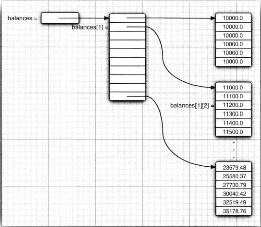

## 3.1 一个简单的Java程序

​	下面是一个最简单的Java程序，只发送一条消息到控制台窗口中：

```java
public class Hello {
    public static void main(String[] args) {
        System.out.println("Hello World");
    }
}
```

​	Java区分大小写，如果将main写成了Main,程序将无法执行。public称为访问修饰符，这些修饰符用于控制程序的其他部分对这段代码的访问级别。关键字`class`表明`java`程序中的全部内容都包含在类中。

​	关键字`class`后紧跟类名。`Java`中定义类名的规则很宽松。**名字必须以字母开头，后面可以跟字母和数字的任意组合。长度基本没有限制。但是不能使用`java`保留字（如`public`或`class`）作为类名**。

​	标准的命名规范：**类名是以大写字母开头的名词。如果名字由多个单词组成，每个单词的第一个字母都应该大写**，这种在一个单词中间使用大写字母的方式成为**驼峰命名法**。如`HelloWorld`

​	**源文件的文件名必须与公共类的名字相同**，并用`.java`作为扩展名。因此，储存这段代码的文件名必须为`Hello.java`

​	如果已经正确命名了这个文件，且源代码中没有录入错误，在编译这段源代码后就会得到一个包含这个类字节码的文件。`java`编译器将字节码文件自动的命名为`Hello.class`,并与源文件储存在同一个目录下。最后，使用这行命令运行这个程序：

`java Hello`

程序执行后，将在控制台显示`"Hello World"`

`Hello World`


接下来，研究一下这段代码：

```java
{
     System.out.println("Hello World");
}
```

​	一对大括号表示方法体的开始与结束。在java中，**每个句子必须用分号结束**。在这里，使用了`System.out`对象并调用了它的`println`方法。点号(.)用于调用方法。Java使用的通用语法是：

```java
object.method(parameters);
```

这等价于函数调用。

​	每次调用`println`都会在新的一行上显示输出。Java和C++一样，都采用双引号分割字符串。在java的方法中，可以没有参数，也可以有一个或多个参数。不带参数的`println`方法只打印一个空行。

```java
System.out.println();
```

`System.out`还有一个`print`，它在输出之后不换行


## 3.2 注释

`java`和大多数语言一眼，有单行注释和多行输出

单行注释：//

多行注释：/**/


## 3.3数据类型

​	Java是一种强类型语言。这意味着必须为每一个变量声明一种类型。一个有8种基本类型，其中有4种整型、2种浮点类型、1种用于表示`Unicode`编码的字符单元的字符类型`char`。和1种用于表示真只的`boolean`类型。

#### 3.3.1 整型

​	整型用于表示没有小数部分的数值，它允许是负数。java提供了4种整型：

##### 										表 3-1 java整型

| 类型  | 储存需求 | 取值范围               |
| ----- | -------- | ---------------------- |
| int   | 4字节    | -21亿 ~ 21亿           |
| short | 2字节    | - 32768 ~ 32767        |
| long  | 8字节    | -9223372亿 ~ 9223372亿 |
| byte  | 1字节    | -128~ 127              |

​	**长整型数字有一个后缀L或l如（560000L）。十六进制数值有一个前缀0x或0X（如0x12CD）。八进制有一个前缀0，例如，010对应八进制8。**

​	**从Java7开始，加上前缀0b或0B就可以写二进制数**。例如0b1001就是9。另外可以为数字字母量加下划线。如（0b1111_0101）下划线只是为了让人更易读。

```java
 int c = 0b1001;
 System.out.println(c);//输出9
```


#### 3.3.2 浮点类型

​	浮点类型用于表示有小数部分的数值。在Java中有两种浮点类型 

#####                                                                             表3-2 浮点类型

| 类型   | 储存需求 | 取值范围       |
| ------ | -------- | -------------- |
| float  | 4字节    | 有效位数6~7位  |
| double | 8字节    | 有效位数为15位 |

float类型的数值有一个后缀F或f，double类型的数值有一个后缀D或d（3.14d）


#### 3.3.3 char类型

​	char类型用于表示单个字符。char类型的字面量值要用单引号扩起来。例如：'A'是编码值为65所对应的字符常量。char类型的值可以表示为十六进制值，其范围从\u0000到\uffff。例如：\u2122表示注册符号, \u03c0表示希腊字母π。

​	转义字符\u可以出现在加引号的字符常量或字符之外。下面是一些常用的转义字符

| 转义序列 | 退格   | Unicode值 |
| -------- | ------ | --------- |
| \b       | 退格   | \u0008    |
| \t       | 制表   | \u0009    |
| \n       | 换行   | \u000a    |
| \r       | 回车   | \u000d    |
| \\"      | 双引号 | \u0022    |
| \\'      | 单引号 | \u0027    |
| \\\      | 反斜杠 | \u005c    |


#### 3.3.4 boolean类型

​	boolean(布尔)类型有两个值:false和true，用来判定逻辑条件。**整型值和布尔值之间不能互相转换**

​	在C++中，数值甚至指针可以代替boolean值，值0相当于false，非0值相当于布尔值true。在Java中则不是这样。**整数表达式不能转换为布尔值**


## 3.4变量

在java中，每个变量都有一个类型（tyoe）。在声明变量时，变量的类型位于变量名之前：

```java
double salary;
int vacation;
boolean done;
```

每个声明以分号结束。由于声明是一条完整的Java语句，所以必须以分号结束。

​	**变量名必须是以字母开头并由字母或数字构成的序列**。Java中"字母"和"数字"的范围更大。字母包括'``A'~'Z',``'``a'~'z',`` `'_',`  `'$'`或在某种语言中表示字母的任何Unicode字符。 也就是说java可以用任何字符作为变量名，甚至是中文。

```java
  int 中文 = 50,b;
        b=6;
        System.out.println(中文);
```

​	但是'+'和空格的符号不能出现在变量名中，变量名中所有的字符都是有意义的，并且大小写敏感。变量名的长度基本没有限制。另外，可以在一行中声明多个变量：

```java
int i,j;
```


#### 3.4.1 变量初始化

**声明一个变量后，必须用赋值语句对变量进行显式初始化，千万不要使用未初始化的变量**：

```java
int vacationDays;
System.out.println(vacationDays);
```

java编译器认为上面的语句是错误的。


下面对变量进行赋值：

```java
int vacationDays;
vacationDays=12;
```

也可以将变量的声明和初始化放在同一行：

```java
int vacationDays=12;
```

最后，在Java中可以将声明放在代码中的任何地方。**在java中，变量的声明尽可能靠近变量第一次使用的地方，这是一种良好的程序编写风格**


#### 3.4.2 常量final

在Java中，利用关键final指示常量：

```java
public class Constans {
    public static void main(String[] args) {

      final double CM=2.45;
      double paperWidth=8.5;
      double paperHeight=11;
      System.out.println("Paper size: "+paperWidth*CN);
    }
}
```

**关键字final表示这个变量只能被赋值一次。一旦被赋值之后，就不能再更改了**。习惯上，常量名使用全大写。

在Java中，经常希望某个常量可以在一个类中多个方法使用，这些常量成为**类常量**。可以用关键字`static final`设置一个类常量：

```java
public class Constans {
    public static final double CM=2.54;
    public static void main(String[] args) {

      final double CM=2.45;
      double paperWidth=8.5;
      double paperHeight=11;
      System.out.println("Paper size: "+paperWidth*CN);
    }
}
```

​	类常量的定义位于main方法的外部。如果一个常量被声明为`public`，那么其他类的方法也可以使用这个常量。

​	注意，在C/C++中，与作用相同的const关键字不同的是，**被`final`关键字修饰的变量不是必须初始化的，它可以不初始化，但必须在使用前赋值一次**。而C/C++中的被const关键字修饰后的变量必须初始化。

_C++注释_：const是Java保留的关键字，但目前并没有使用。在java 中，必须使用`final`定义常量


#### 3.4.4 枚举类型

​	枚举类型包括有限个命名值，例如：

```java
enum Size{SMALL,MEDIUM,LARGE,EXTRA_LARGE};
```

​	现在，可以声明这种类型的变量

```java
Size s  = Size.MEDIUM;
```

​	枚举类型的变量只能存储这个类型声明中所列的某个值，或特殊值null。


## 3.5 运算符

​	在Java中，使用算数运算符：+、-、*、/表示加减乘除运算。当参与/运算的两个操作数都是整数时，表示整数除法；否则，表示浮点除法。整数的求余操作（取模）用%表示。

​	注意，整数被0除会产生一个异常，而浮点数被0除会得到无穷大或NaN结果。


#### 3.5.1 数学函数与常量

在Math类中，包含了各种各样的数学函数。想要计算一个数值的平方根，可以使用sqrt方法：

```java
double x=4;
double y=Math.sqrt(x);
System.out.println(y); //输出2.0；
```

在Java中，没有幂运算，需要借助Math类的pow方法：

```java
double y=Math.pow(10,2); //y=100;
```

Math类提供一些常用的三角函数：

```java
Math.sin;
Math.cos;
Math.tan;
Math.atan;
Math.atan2;
```

指数函数以及它的反函数---自然对数以及以10为底的对数：

```java
Math.exp;
Math.log;
Math.lon10;
```

最后，Java还提供了两个用于表示π和e常量的近似值：

```java
Math.PI;
Math.E;
```

不必在数学方法名和常量名前添加前缀“Math”,只要在源文件的顶部加上这段代码：

```java
import static java.lang.Math.*;
public class Hello {
    public static void main(String[] args) {
        System.out.println(E); //输出2.7182818284...
    }
}
```


#### 3.5.2 数值类型之间的转换

经常需要将一种数值类型转换为另一种数值类型

使用两个变量进行二元操作时，先要将两个操作上转换为同一种类型，然后再计算。

- 如果两个操作数中有一个是double类型，另一个操作数就会转换为double类型
- 否则，如果其中一个操作数是float乐享，另一个操作数将会转换为float类型
- 否则，如果其中一个操作数是long类型，另一个操作数将会转换为long类型
- 否则，两个操作数都将被转换为Int类型。


#### 3.5.3 强制类型转换

​	在有必要的时候，int类型的值将会自动地转换为double类型。但另一方面，有时也需要将double转换为int。在Java中，通过**强制类型转换(cast)**实现这个操作。强制类型转换的语法格式是在圆括号中给出想要转换的目标类型，后面紧待转换的变量名。例如：

```java
double x=9.997;
int nx=(int)x;
```

此时，变量nx的值为9，强制类型转换通过截断小数部分将浮点值转换为整型。


#### 3.5.4 结合赋值和运算符

可以在赋值中使用二元运算符：

```java
x+=4;
//等价于
x=x+4
```

注意，如果运算符得到一个值，其类型与左侧操作数的类型不同，就会发生强制类型转换。例如，如果x是一个Int，则以下语句

```java
x+=3.5;
```

是合法的，将把x设置为(int)(x+3.5)


#### 3.5.5 自增与自减运算符

n++将变量n的当前值加1，n--则将n的值减1。

```java
int n=12;
n++;
```

将n的值改为13，由于这些运算符会改变变量的值，所以它们的操作数不能是数值。4++就不是一个合法的语句。


这些有两种形式：上面介绍的是运算符放在操作数后面的后缀形式。还有一种前缀形式：++n。前缀和后缀形式都会使变量值加1或减1。但是在表达式中，二者就有区别了。前缀形式会先完成加1；而后缀形式会使用变量原来的值。

```java
int m=7;
int n=7;
int a=2* ++m; // a=16, m=8
int b=2*n++; //b=14, n=8
```

建议不要在表达式中使用++，这样的代码容易让人迷惑，而且会带来烦人的bug。


#### 3.5.6 关系运算符和boolean运算符

Java包含丰富的关系运算符。如两个等号检测是否相等：

```java
3==4; //值为false
```

也可以使用！=检测不想等。

```java
3!=7//值为true
```

最后还有经常使用的<、>、<=和>=运算符

Java沿用了C++的做法，使用&&表示逻辑与运算，使用||表示逻辑或运算，感叹号！表示逻辑非运算。&&和||是按照短路的方式来求值的：如果第一个操作数语句能够确定表达式的值，第二个操作数就不必计算了。如：

```java
expression1 && expression2
```

如果已经计算得到了表达式1的值为false，那么结果不可能为true。因此，第二个表达式就不必计算了。


#### 3.5.7 枚举类型

有时候，变量的取值只在一个有限的集合内。枚举类型包括有限个命名的值：

```java
enum Size{SMALL,MEDIUM,LARGE,EXTRA_LARGE};
```

现在，可以声明这种类型的变量：

```java
Size s=Size.MEDIUM;
```


#### 3.5.8 运算符优先级

以下表格按优先级从高到低列出 Java 运算符（同一行内的运算符优先级相同）：

| 优先级 | 运算符                                                       | 名称/描述                 | 结合性 |
| ------ | ------------------------------------------------------------ | ------------------------- | ------ |
| 1      | `()` `[]` `.` `::`                                           | 括号/方括号/点号/方法引用 | 左→右  |
| 2      | `++` `--` `+` `-` `~` `!` `(type)`                           | 一元运算符/类型转换       | 右←左  |
| 3      | `new`                                                        | 对象创建                  | 右←左  |
| 4      | `*` `/` `%`                                                  | 乘/除/取模                | 左→右  |
| 5      | `+` `-`                                                      | 加/减                     | 左→右  |
| 6      | `<<` `>>` `>>>`                                              | 位移运算符                | 左→右  |
| 7      | `<` `<=` `>` `>=` `instanceof`                               | 关系运算符                | 左→右  |
| 8      | `==` `!=`                                                    | 相等运算符                | 左→右  |
| 9      | `&`                                                          | 按位与                    | 左→右  |
| 10     | `^`                                                          | 按位异或                  | 左→右  |
| 11     | `|`                                                          | 按位或                    | 左→右  |
| 12     | `&&`                                                         | 逻辑与                    | 左→右  |
| 13     | `||`                                                         | 逻辑或                    | 左→右  |
| 14     | `?:`                                                         | 条件运算符(三元运算符)    | 右←左  |
| 15     | `=` `+=` `-=` `*=` `/=` `%=` `&=` `|=` `^=` `<<=` `>>=` `>>>=` | 赋值运算符                | 右←左  |
| 16     | `->` `=>`                                                    | Lambda 表达式箭头         | 右←左  |


## 3.6 字符串

​	从概念上讲，**Java字符串就是Unicode字符序列**。例如，串"Java"由4个Unicode字符J、a、v、a。Java没有内置的字符串类型，而是在标准Java类库中提供了一个预定义类，叫做String。每个用双引号扩起来的字符串都是String类的一个实例。

```java
String greet="Hello";
```


#### 3.6.1 子串

String类的`substring`方法可以从一个较大的字符串提取出一个子串。

```java
String greeting="Hello";
String s=greeting.substring(0,3);// s="Hel"
```

`substring`方法的第二个参数是不想复制的第一个位置。这里要复制位置0、1和2的字符。在`substring`中从0开始计数，直到3为止，但不包含3。


#### 3.6.2 拼接字符串

Java语言允许使用+号连接两个字符串

```java
String exp="Expletive";
String PG13="Delete";
String message=exp+PG13;
```

上述代码将"ExpletiveDeleted"赋给变量message。

当将一个字符串与一个非字符串的值进行拼接时，后者将被转换成字符串（任何一个Java对象都可以转换成字符串）：

```java
int age=13;
String rating="PG"+age;
```

rating被设置为"PG13";这种特性通常用在蔬菜语句。例如：

```java
System.out.println("The answer is "+answer);
```

如果需要把多个字符串放在一起，用一个定界符分隔，可以使用静态join方法：

```java
String all = String.join("/","S","M","L","XL");
System.out.println(all); //输出S/M/L/XL
```

join方法的第一个参数用于指定分隔符。可以指定使用容易字符分隔

```java
 String all = String.join("|","S","M","L","XL");
 System.out.println(all); //S|M|L|XL
```


#### 3.6.3 不可变字符串

String类没有提供用于修改字符串的方法。如果希望将greeting的内容修改为"Help!"，不能直接地将greeting的两个位置修改为'p'和'!'。在java中实现这项操作非常容易。首先提取需要的字符，然后拼接上替换的字符串：

```java
greeting = greeting.substring(0,3)+"p!";
```

在Java文档中将String类对象成为不可变字符串。如果数字3永远是数字3一样，字符串"Hello"永远包含字符串H、e、l、l、和o的代码单元序列，而不能修改其中的任何一个字符。但是，可以修改字符串变量greeting，让它引用另外一个字符串。


#### 3.6.4 检测字符串是否相等

可以使用`equals`方法检测两个字符串是否相等。对于表达式：

```java
s.equals(t);
```

如果字符串s与字符串t相等，则返回true；否则返回false。

equals方法也可以比较字符串字面量，下面的表达式是合法的：

```java
"Hello".equals(greeting);
```

要想检测两个字符串是否相等，而不区分大小写，可以使用`equalsIgnoreCase`方法：

```java
"Hello".equalsIgnoreCase("hello");
```


#### 3.6.5 空串和Null串

空串""是长度为0的字符串。下面的代码可以检查一个字符串是否为空：

```c
if(str.length()==0)
    或
if(str.equals(""))
```

空串是一个Java对象，有自己的串长度（0）和内容（空）。

String变量还可以存放一个特殊的值，名为Null，这表示目前没有任何对象与该变量关联。要检查一个字符串是否为null，要使用以下条件：

```c
if(str==null)
```


#### 3.6.6 StringAPI

Java中的Stirng类包含了50多个方法。下面的API注释汇总了一部分最常用的方法。

**char charAt(int index);**

返回给定位置的代码单元。除非对底层的代码单元感兴趣，否则不需要调用这个方法。示例

```c
 String t="Hello";
 System.out.println(t.charAt(0)); //输出H
```

**int codePointAt(int index) 5.0**

返回从给定位置开始的ACSII码点

```c
 String t="Hello";
 System.out.println(t.charAt(0)); //输出72
```

**int compareTo(String other) **

按照字典顺序，如果字符串位于other之前，返回一个负数；如果字符串位于other后，返回一个正数；如果两个字符串相等，返回0

```c
 String t="Hello";
 System.out.println(t.compareTo("Hello"));//输出0
```

**boolean equalsIgnoreCase(String other)**

如果字符串与other相等(忽略大小写)，返回true

**boolean startWith(String prefix)**

如果字符串以prefix开头，则返回true

**boolean endsWith(String suffix)**

如果字符串以suffix结尾，返回true

**int length() **

返回字符串的长度

**String substring(int beginIndex)**

返回一个新字符串，这个字符串包含原始字符串从beginIndex到串尾：

```java
String a="Hello";
String t=a.substring(2);
System.out.println(t);// t="llo"
```

**String substring(int beginIndex,int endIndex)**

返回一个新字符串，这个字符串包含原始字符串从beginIndex到endIndex-1：

```java
String a="Hello";
String t=a.substring(0,3);
System.out.println(t);// t=Hel
```


**String toLowerCase()**

**String toUpperCase()**

返回一个新字符串。这个字符串将原始字符串中的大写字母改为小写，或将原始字符串的所有小写字母改为大写


**String trim()**

返回一个新字符串。这个字符串将删除了原始字符串头部和尾部的空格


**String join(CharSequence delimiter,CharSequence... elements)**

返回一个新字符串，用给定的定界符连接所有元素:

```java
String all = String.join("/","S","M","L","XL");
System.out.println(all); //输出S/M/L/XL
```


#### 3.6.7 构建字符串

​	采用字符串连接的方式达到目的的效率比较低。每次连接字符串，都会构建一个新的**String**对象，即耗时，又浪费空间。使用`StringBuilder`类就可以避免这个问题发生。

如果需要用许多小段的字符串构建一个字符串，那么应该按照下列步骤进行。首先，构建一个空的字符串构建器：

```java
StringBuilder builder = new StringBuilder(); //构建一个空的字符串构建器
builder.append("Hello"); 
builder.append("World");
System.out.println(builder.toString());
```

当每次需要添加一部分内容时，就调用append方法。在需要`构建字符串`时就调用`toString`方法，将会得到一个String对象，其中包含了构建器中的字符序列。

下面的API注释包含了StringBuilder类中的重要方法。

**StringBuilder()**

构建一个空的字符串构建器

**int length() **

返回构建器或缓冲器中的代码单元数量

**StringBuilder append(String str)**

追加一个字符串并返回this

**StringBuilder append(String str)**

追加一个代码单元并返回this

**StringBuilder appendCodePoint(int cp)**

追加一个代码点（Unicode），并将其转换为一个或两个代码单元（字符）并返回this

**void setCharAt(int i,char c)**

将第i个代码单元设置为c

**StringBuilder intsert(int offset,String str)**

在offset位置插入一个字符串并返回this

**StringBuilder intsert(int offset,Char c)**

在offset位置插入一个代码单元并返回this

**StringBuilder delete(int startIndex,int endIndex)**

删除偏移量从startIndex到endindex-1的代码单元并返回this。

```java
StringBuilder builder = new StringBuilder(); //构建一个空的字符串构建器
builder.append("Hello");
builder.append("World");
builder.delete(1,3); //删除了下标为1,2的代码单元
System.out.println(builder.toString()); //输出"HloWorld"
```

**String toString()**

返回一个与构建器内容相同的字符串（String对象）


#### 3.6.10 文本块

​	`Java15`新增的文本块（text block）特性，可以很容易地提供跨多行的字符串字面量。==文本块以`"""`开头，后面是一个换行符，并以另一个`"""`结尾:

```java
String greeting ="""
    Hello
    World
    """;
```

​	这个文本块对应之前的字符串字面量为：

```java
"Hello\nWorld\n";
```

​	如果不想要最后一行后面的换行符，可以让结束`"""`紧跟在最后一个字符后面：

```java
String prompt="""
    Hello,my name is Hal.
    Please enter your name: """;
```

​	文本块特别适合包含其他语言编写的代码，如SQL或HTML。可以直接将那些代码粘贴到一对三重引号之间：

```java
String html = """
    <div class = "Warning">
        Baware of those who say "Hello" to the world
    </div>
     """;
```


## 3.7 输入输出

​	程序能够接收输入，并以适当的格式输出。现代的程序都使用GUI收集用户的输入，然后，编写这种界面的程序需要使用较多的工具与技术。第10章~第12章详细介绍GUI程序设计。


#### 3.7.1 读取输入

想要通过控制台进行输入，首先需要构造一个`Scanner`对象，并与"标准输入流"System.in关联

```java
Scanner in =new Scanner(System.in);
```

现在，就可以使用Scanner类的各种方法实现输入操作。例如，nextLine方法将输入一行：

```java
System.out.println("What is your name?");
String name = in.nextLine();
```

想要读取一个单词（以空白作为分隔符）。就调用

```java
String firstName=in.next();
```

想要读取一个整数，就调用nextInt方法。

```java
int age=in.nextInt();
```

类似的，想要读取一个浮点数，就调用nextDouble方法。

注意，Scanner类定义在Java.util包中。当使用的类不是定义在基本java.lang包中时，一定要使用import指示字将相应的包加载进来。

```java
package TWW;
import java.util.*;
public class Plane {
    public static void main(String[] args) {
        Scanner in =new Scanner(System.in); //定义scanner对象
        //获取字符串输入
        System.out.println("What is your name？");
        String name=in.nextLine();

        //获取整型输入
        System.out.println("How old are you？");
        int age = in.nextInt();

        //输出
        System.out.println("Hello"+name+". Next year, you'll be"+(age+1));
    }
}
```

因为输入是可见的，所以Scanner类不适用与从控制台读取密码。Java SE6特别引入了Console类实现这个目的。要读取一个密码。可以采用下列代码：

```java
Console cons = System.console();
String username = cons.readline("User name:");
char[] passwd=cons.readPassword("Password:");
```

##### API `Java.util.Scanner`

**Scanner(InputStream in)**

用给定的输入流创建一个Scanner对象

**String nextLine()**

读取输入的下一行内容。

**String next()** 

读取输入的下一个单词（以空格作为分隔符）

**int nextInt()**

**double nextDouble()**

读取并转换下一个表示整数或浮点数的字符序列


#### 3.7.2 文件输入与输出

想要对文件进行读取，就想要一个用File对象构造一个Scanner对象：

```java
Scanner in =new Scanner(Paths.get("myfile.txt"),"UTF-8");
```

如果文件名中包含反斜杠符号，就要记住在反斜杠之前再加一个额外的反斜杠：

```java
"c:\\mydirectory\\myfile.txt"
```

现在，就可以利用前面介绍的任何一个Scanner方法对文件进行读取。

想要写入文件，就需要构造一个`PrintWirter`对象,在构造器中，只需要提供文件名：

```java
PrintWriter out =new PrintWriter("myfile.txt","UTF-8");
```

如果文件不存在，创建该文件。


## 3.8 控制流程

与任何程序设计语言一样，Java使用条件语句和循环结构确定控制流程。


#### 3.8.1 块作用域

块（即复合语句）是指由一对大括号括起来的若干条简单的Java语句。块确定了变量的作用域，一个块可以嵌套在另一个块中：

```java
public static void main(String[] args)
{
    int n;
    ....
    {
        int k;
    }
    //k在这里不存在
}
```

但是，不能在嵌套的两个块中声明同名的变量。下面的代码有错误：

```java
public static void main(String[] args)
{
    int n;
    ....
    {
        int k;
        int n; //Error
        ... 
    }
    //k在这里不存在
}
```


#### 3.8.2 条件语句

在Java中，条件语句的格式为

```java
if(condition)
    statement
```

与大多数程序设计语言一样，Java常常希望在某个条件为真时执行多条语句。在这种情况下，应使用块：
```
{
	statement1;
	statement2;
}
```

例如：

```java
if(Sales >= target)
{
    performance="Satisfactory";
    bonus=100;
}
```

更一般的条件语句格式如下：

```java
if(condition)
    satatement1;
else
    statement2;
```

其中else部分是可选的。else子句与最邻近的if构成一组。


#### 3.8.3 循环

当条件为true时，while循环执行一条语句（或块）。一般格式为：

```java
while(condition)
	statement;
```

如果开始循环条件的值就为false，则while循环体一次也不执行


#### 3.8.4 确定循环

for语句是支持迭代的一种通用结构，利用每次迭代之后更新的计数器或类似的变量来控制迭代次数。

```java
for(int i=1;i<=10;i++)
    System.out.println(i);
```

for语句的第1部分通常用于对计数器初始化；第二部分给出每次新一轮循环执行前要检测的循环条件；第3部分指示如何更新计数器。


#### 3.8.5 多重选择：switch语句

在处理多个选项时，使用if/else结构显得有些繁琐。Java和C/C++使用完全一样的switch语句。

例如，如果建立一个包含4个选项的菜单系统，可以使用下列代码：

```java
Scanner in =new Scanner(System.in);
System.out.println("Select an option(1,2,3,4)");
int choice = in.nextInt();
switch(choice)
{
    case 1:
        ...
        break;
    case 2:
        ...
        break;
    case 3:
        ...
        break;
    case 4:
        ...
        break;
    default:
        ...
      
}
```

`switch`语句将从选项值相匹配的case标签处开始执行知道遇到break语句，或执行到switch语句的结束处为止。如果没有相匹配的case标签，而有default子句，就执行这个字句。

如果你更喜欢使用switch语句，编译代码时可以考虑加上`-Xlint:fallthrough`选项：

```java
javac -Xlint:fallthrough Test.java
```

这样一来，如果某个分钟最后缺少一个break语句。编译器就会给出一个警告消息

case标签可以是：

- 类型为char、byte、short或int的常量表达式
- 枚举常量。
- 从Java SE7开始，case标签还可以是字符串字面量。
- 多个字符串，用逗号分隔。

从Java14开始，switch有了新的特性，假如建立一个菜单系统。可以这样做

```java
Scanner in = new Scanner(System.in);
System.out.println("Select an option(1,2,3,4)");
int choice = in.nextInt();
switch(choice){
    case 1 ->
        ....;
   	case 2 ->
        ...;
    case 3 ->
        ...;
    default->
}
```

​	这种特性叫做无直通式行为，也就是说，选择哪个标签就执行哪个标签，不会接着执行后面的标签。在有直通式的形式中，每个case以一个冒号结束。如果case 以->箭头结束，则没有直通行为。不能在一个switch语句中混合使用冒号和箭筒。

switch表达式的每一个分支可以返回一个值。各个值跟在箭头->后面

```java
 String seanName= switch(seasonCode){
     case 0-> "Spring";
     case 1 -> "Summer";
     case 2 -> "Fall";
     case 3 -> "winter";
     default -> "???"
 }
```

​	switch会隐式返回case分支，比如这里选择1，就会返回summer给变量seanName。但如果分支是多条语句，此时就需要手动返回，我们使用yield关键字。yield关键字会终止执行并返回一个值  

```java
int numLetters = switch(seasonNmae){
        case "Spring" ->
        {
            System.out.println("spring time");
            yield 6; //手动返回数值，并停止执行
        }
        case "Summer" -> 6;
        Case "Fall" ->4;
        default -> -1;
}
```


#### 3.8.6 中断控制流程语句

​	使用goto语句被认为是一种拙劣的程序设计风格。无限制第使用goto语句确实是导致错误的根源，但在有些情况下，偶尔使用goto语句跳出循环还是有益处的。Java设计者同意这种看法，甚至在Java语言中增加了一条待标签的break。以此来支持这种程序设计风格。

​	

下面首先看一下不带标签的break语句。它可以用于退出循环语句：

```java
while(years<=100)
{
    if(years==50)
        break;
    years++;
}
```

循环体在years==50时跳出循环。


Java还提供了一种带标签的break语句。用于跳出多重嵌套循环语句。

```java
read_data:
while(...){
    ...
    for(...)
    if(n<0)
        break read_data;
}

```

在满足某种条件之后，就跳到read_data处。标签必须放在希望跳出的最外层循环之前。而且必须紧跟一个冒号。另外，只能跳出语句块，而不能跳入语句块。


最后，还有一个continue语句。它的作用是跳过本次循环，而继续下一次循环。


## 3.9 大数值

​	如果基本的整数和浮点数精度不能够满足需求，那么可以使用Java.math包中的两个很有用的类：`BigInteger`和`BigDecimal`。这两个类可以处理包含任意长度数字序列的数值

​	使用静态的valueOf方法，可以将普通的数值转换为大数值：

```java
BigInteger a = BigInteger.valueOf(100);
```

​	遗憾的是，不能使用人们熟悉的算术运算符（如+-*/）处理大数值。而需要使用大数值类中的方法：

```java
BigInteger c = a.add(b); //c=a+b
BigInteger d = c.multiply(b.add(BigInteger.valueOf(2))); // d=c*(b+2)
```


## 3.10 数组

数组是一种数据结构，用来存储同一类型值的集合。通过一个整型下标可以访问数组中的每一个值。

在声明数组变量时，需要指出数组类型和数组变量的名字。下面声明了整型数组a；

```java
int a[];
```

这条语句只声明了变量a，并没有将a初始化为一个真正的数组。**应该使用new运算符创建数组**。

```\
int a[] = new int[100];
```

这条语句创建了一个可以存储100个整数的数组。数组长度不要求必须是常量，如：

```java
int n=150;
int a[]=new int[n]
```

上面创建了长度为n的数组，这个数组的下标是从0~n-1。注意，数组的下标是从0开始计数。可以这样使用数组：

```java
int a[] =new int[100];
for(int i=0; i<100;i++)
    a[i]=i;
```

这个循环依次给数组赋值。想要获取数组中的元素个数，可以使用`array.length`：

```java
for(int i=0;i<a.length;i++)
    System.out.println(a[i]);
```

​	一旦创建了数组，就不能改变它的大小（尽管可以改变每一个数组元素）。如果经常需要在运行过程中扩展数组的大小，就应该使用另一种数据结构——数组列表。

​	根据JVM规范，任何数组都是对象，数组对象的头部包含一个专用的**length**字段，保存数组长度。

#### 3.10.1 for each循环

Java有一种功能很强的循环结构，可以用来依次处理数组中的每个元素（其他类型的元素集合亦可）而不必为指定下标值而分心。

这种增强的for循环的语句格式为：

```java
for(uariable:collection) statement
```

**定义一个变量用于暂存集合中的每一个元素，并执行相应的语句（或语句块）**。collection这一集合表达式必须是一个数组或者是一个实现了Iterable接口的

类对象（例如ArrayList）：

```java
for(int element:a)
    System.out.println(element);
```


#### 3.10.2 数组初始化以及匿名数组

在Java中，提供了一种创建数组对象并同时富裕初始值的简化书写形式：

```java
int[] small={2,3,5,7,11,13};
```

注意，在使用这种语句时，不需要调用new。

**甚至还可以初始化一个匿名的数组**：

```java
new int[] {17,19,23,17,31,37}
```

数组的大小就是初始化值的个数。使用这种语法形式可以在不创建新变量的情况下重新初始化一个数组。例如：

```java
small = new int[] {17,19,13,29,31};
```


#### 3.10.3 数组拷贝

在Java中，允许将一个数组变量拷贝给另一个数组变量。**这时，两个变量将引用同一个数组**：

```java
in[] lucky = samll;
for(int element:Lucky)
      System.out.println(element); //输出同样的结果
```


#### 3.10.5 数组排序

要想对数值型数组进行排序，可以使用`Arrays`类中的`sort`方法：

```java
int a[] = new int[100];
...
Arrays.sort(a);
```

**API**  `java.util.Arrays`

**static String toString(type[] a)**

返回包含a中数据元素的字符串，这些数据元素被放在括号内，并用逗号分隔。

```java
import java.util.*;
public class Plane {
    public static void main(String[] args){
        int[] small={2,3,5,7,11,13};
        String str=Arrays.toString(small);
        System.out.println(str); //输出：[2, 3, 5, 7, 11, 13]
    }
}

```

**static boolean equals(type[] a, type[] b)**

如果两个数组大小相同，并且下标相同的元素都对应相等，返回true


#### 3.10.6 多维数组

多维数组将使用多个下标访问数组元素，它适用于表示表格或更加复杂的排列形式

在Java中，声明一个二维数组相当简单：

```java
double [][]balances;
```

与一维数组一样，在调用new对多维数组进行初始化之前不能使用它。可以这样进行初始化：

```java
balances = new double[10][10];
```

另外，如果知道数组元素，就可以不调用new，而直接使用简化的书写形式对多维数组进行初始化。

```java
int[][] magic=
{
    {13,3,6,8},
    {5,10,15,20},
    {9,6,10,8},
    {5,14,3,1}
};
```

数组一旦被初始化，就可以利用两个方括号访问每个元素，例如，balances\[i]\[j]

```java

import java.util.*;
public class Plane {
    public static void main(String[] args){
        double[][] balances = new double[5][5];
        for(int i=0;i< balances.length;i++){
            for(int j=0;j< balances[i].length;j++){
                balances[i][j] = (i+1)*(j+1);
                System.out.printf("%.0f ",balances[i][j]); //使用格式化输出
            }
            System.out.println();
        }
    }
}
```


#### 3.10.7 不规则数组

到目前为止，所看到的数组与其他程序设计语言提供的数组没有多大的区别。但实际上存在着一些细微的差异，而这正是Java的优势所在：Java实际上没有多维数组，而只有一维数组。多维数组被解释为**"数组的数组"**


表达式balances[i]引用第i个子数组，也就是二维表的第i行，它本身也是个甚至。balances\[i][j]引用这个数组的第j项


由于可以单独地存取数组的某一行，所以可以让两行交换

```java
double[] temp = balance[i];
balances[i] = balances[i+1];
balances[i+1] = temp;
```

还可以方便地构造一个**"不规则"数组**，即数组的每一行有不同的长度。想要创建一个不规则的数组，首先需要分配一个具有所含行数的数组。

```java
int[][] odds = new int[9][];
```

接下来，分配这些行。

```java
for(int n=0; n<odds.length;n++)
    odds[n]=new int[n+1];
```

在分配数组之后，就可以采用通常的方式访问其中的元素了。

```java
public static void main(String[] args){
        //创建不规则数组
        int[][] odds=new int[9][];
        for(int n=0; n<odds.length;n++)
            odds[n] = new int[n+1];
        //访问不规则数组
        for(int i=0;i<odds.length;i++){
            for(int j=0;j<odds[i].length;j++){
                odds[i][j]=j+1;
                System.out.print(odds[i][j]+" ");
            }
            System.out.println();
        }
    }
```

下面给出了完整的程序

```java
package TWW;

public class LotteryArray {
    public static void main(String[] args){
        final int NMAX=10;  //创建常量

        //创建不规则数组
        int[][] odds=new int[NMAX+1][]; //11行
        for(int n=0; n<=NMAX;n++)
            odds[n] =new int[n+1];

        //填充不规则数组
        for(int n=0; n<odds.length;n++){
            for(int k=0;k<odds[n].length;k++){
                int lotteryOdds=1;
                for(int i=1;i<=k;i++)
                    lotteryOdds = lotteryOdds*(n-i+1)/i;
                odds[n][k]=lotteryOdds;
            }
        }

        //打印该数组
        for(int[] row: odds)
        {
            for(int odd:row)
                System.out.printf("%4d",odd);
            System.out.println();
        }


    }
}

```

输出：

```java
   1
   1   1
   1   2   1
   1   3   3   1
   1   4   6   4   1
   1   5  10  10   5   1
   1   6  15  20  15   6   1
   1   7  21  35  35  21   7   1
   1   8  28  56  70  56  28   8   1
   1   9  36  84 126 126  84  36   9   1
   1  10  45 120 210 252 210 120  45  10   1
```

现在，已经基本了解了Java语言的基本程序结构。


## 3.11 编程训练


#### 3.11.1 回文数

判断一个整数x是否是回文数，如果是打印true，反之打印false。回文数是指正序和倒序读都是一样的整数。里，121 ，131, 12521等。

```java
    public static boolean isPalindrome(int x) {
        String str = String.valueOf(x);//将数字转换为字符串
        for(int i=0,j =str.length()-1;i<j;i++,j--){
            if(str.charAt(i)!=str.charAt(j))
                return false;
        }
        return true;
    }
```


#### 3.11.2 求商和余数

给定两个整数，被除数和除数（正数）。将两数相除，要求不适用乘法、除法和%运算符。得到商和余数

```java
    //求商和余数,num1被除数，num2除数
    public static void isShangAndYu(int num1,int num2){
        int shang=0;
        int yu=0;
        int temp=num1;
       for(shang =0; num1>=num2;shang++){
           num1-=num2;
       }
       yu=num1;
       System.out.println(temp+"/"+num2+"="+shang+"..."+yu);
    }
```


#### 3.11.3 用辗转相除法求两个整数的最大公因数

```java
    //辗转相除法求两个整数的最大公因数
    public static int bigYingShu(int a,int b){
       //首先交换两者最大值，让a为较大值
        if(a<b){
            int temp = a;
            a=b;
            b=temp;
        }
        /*用较小数除以最大数，得到余数
        * 若余数为0，则较小数即为最大公因数
        * 若余数不为0，则用较小数替换最大数，用余数替换小鼠，再重复步骤。
        */
        while(b!=0){
            int temp = b;
            b = a%b; //获取余数
            a=temp; //较小值替换较大值
        }
        //循环结束时，此时的除数为最大公因数
        return a;
    }
```


#### 3.11.4 输出斐契那波数列

```java
    public static int fibonacci(int n){
        int a=0; //第n-2项
        int b=1; //第n-1项
        int c=0;

        for(int i=2;i<n;i++)
        {
            c=a+b;// 每个数字等于前两项之和
            a=b; //让n-2等于n-1项;
            b=c; //让n-1项等于n项
            System.out.println(c);
        }
        return c;
    }
```


#### 3.11.5 统计一个字符数组中每个字符的个数

```java
package JavaBasics;

import java.util.HashMap;
import java.util.Map;
import java.util.Set;

public class CharLetterCount {

    public static void main(String[] args) {
            char[] arr=new char[30]; //被查找的字符数组
        //生成大写字母
        int index = 0;
        for(int i=65;index<26;i++){
            arr[index++]=(char)i;
        }
        HashMap<Character,Integer> charMap = new HashMap<>();
        charLetterCount(arr,charMap);
        Set<Map.Entry<Character,Integer>> entry = charMap.entrySet();

        for(Map.Entry<Character,Integer> temp:entry){
            Character k = temp.getKey();
            Integer v = temp.getValue();
            System.out.println(k+" "+v);
        }
    }

    //统计一个字符数组中每个字母出现的次数
    public static void charLetterCount(char [] arr,HashMap<Character,Integer> map){
        //字符由\0结束
        //获取大小写字母数组
        char[] chars = charArray();
        //将该字符数组存入一个map映射中
        for(int i=0;chars[i]!='\0';i++){
            map.put(Character.valueOf(chars[i]),Integer.valueOf(0));
        }

        //获取键值视图
        Set<Map.Entry<Character,Integer>> entry =	 map.entrySet();

        for(int i=0;arr[i]!='\0';i++){

            for(Map.Entry<Character,Integer> temp :entry){
                //获取键
                Character k  = temp.getKey();
                //获取字符数组的一个元素，依次与键做比对
                if((Character.valueOf(arr[i])) ==k)
                {
                    //通过集合键唯一的特性，进行覆盖更新，
                    /*
                    * getOrDefault获取k键对应的值，如果没在map中找到
                    * 该键，则返回defaultValue值
                    * 这里就会获取该键的值然后+1,即可实现计数功能
                    * */
                    map.put(k,map.getOrDefault(k,0)+1);
                }

            }
        }

    }

    //生成所有包含字母的数组
    public static char[] charArray(){
        char[] arr = new char[52+1];
        //生成大写字母
        int index = 0;
        for(int i=65;index<26;i++){
            arr[index++]=(char)i;
        }


        //生成小写字母
        for(int i=97;index<52;i++){
            arr[index++]=(char)i;
        }
        return arr;
    }
}

```

