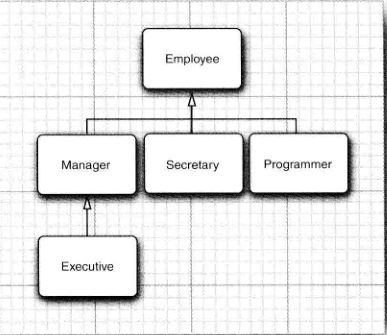
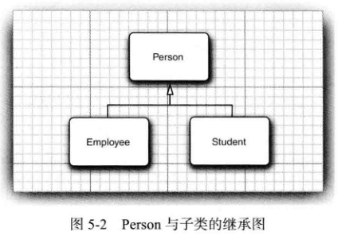

		xxxxxxxxxx1 1    xxxxxxxxxx1 1本章将学习面向对象程序设计的另一个基本概念：继承。利用继承，人们可以给予已存在的类构造一个新类。继承已存在的类就是复用这些类的方法和域。在此基础上，还可以添加一些新的方法和域，以满足新的需求。这是Java程序设计中的一项核心技术。

​	另外。还将阐述反射的概念。反射是指在程序运行期间发现更多的类及其属性的能力。这是一个功能强大的特性，使用起来比较复杂，主要用于开发软件工具。


## 5.1 类、超类和子类

​	普通雇员在完成本职任务之后仅领取薪水。而经理在完成了预期的业绩之后还能得到讲解。这种关系就需要使用继承，将经理定义为一个新类Manager，以便增加一些新供能。可以重用Employee类中已经编写的部分代码，并将其中的所有与保留下来。


#### 5.1.1 定义子类

下面是由Employee类来定义Manager类的格式，==**关键字`extends`表示继承**==

```java
public class Manager extend Employee
{
 ...   
}
```

**关键字extends表明正在构造的新类派生于一个已存在的类。已存在的类称为`超类`、`基类`或`父类`；而新类称为`子类`、派生类。**

在Manager类中，增加了一个用于存储奖金信息的域，以及一个用于设置这个域的新方法：

```java
public class Manager extend Employee
{
    private double bonus;
    
    public void setBonus(double bonus)
    {
        this.bonus=bonus;
    }
}
```

由于setBonus方法并不是在Employee类中定义的，所以属于Employee类的对象不能使用它。**也就是==父类无法使用子类方法==。****

​	然而，尽管Manager类中没有显式的定义getName等方法，但属于Manager类的对象却可以使用它们。**Manager类自动地继承类父类Employee中的这些方法和属性。**

​	**在通过扩展超类定义子类的时候，仅需指出子类与超类的不同之处。因此在设计类的时候，应该将通用的方法放在超类中，而将具有特殊用途的方法放在子类中**。这种将通用的功能放到超类的做法，在面向对象程序设计中非常普遍。


#### 5.1.2 覆盖方法

父类中的有些方法对子类Manager不一定适用。此时，需要提供一个新的方法来覆盖（override）父类中的方法：

```java
public class Manager extend Employee
{
    private double bonus;
    
    public void setBonus(double bonus)
    {
        this.bonus=bonus;
    }
    public double getSalary()
    {
        ...
    }
}
```

​	Manager类中的getSalary（）方法应该返回薪水和奖金的总和。**但Manager类的getSalary方法不能直接地方法父类的私有成员。只有Employee类的方法才能够访问私有部分。如果Manager类的方法一定要访问私有域，那么就必须借用父类的公有接口,我们使用关键字super来调用属于父类的方法**：

```java
    public double getSalary()
    {
       double baseSalary=super.getSalary(); //调用父类方法访问Salary
       return baseSalar+bonus;
    }
```

也就是说，==**子类无法直接访问父类的私有成员，但可以通过父类的方法来间接访问**==。


#### 5.1.3 子类构造器

同样的，使用**super关键字可以使用父类的构造器**。

```java
public Manager(String name,double salar,int year,int month,int day)
{
    super(name,salar,year,month,day);
    bonus=0;
}
```

​	由于Manager类的构造器不能访问Employee类的私有成员。所以必须利用Employee的构造器进行初始化，**通过`super`实现对父类构造器的调用。使用super调用构造器的语句必须是子类构造器的第一条语句**。

​	

下面创建一个经理对象，并设置它的奖金：

```java
Manager Hr =new Manager("王五",15000,2009,12,06);
Hr.setBonus(5000);
```

定义一个包含3个雇员的数组：

```java
Employee[] arr =new Employee[3];
```

把经理和雇员都放到数组中：

```java
arr[0]=Hr;
arr[1]=new Employee("李四",12000,1989,10,1);
arr[2]=new Employee("张三",13000,1987,3,15);
```

输出每个人的薪水：

```java
 for(Employee e:employees)
       System.out.println("姓名："+e.getName()+" 工资："+e.getSalary());
```

输出结果：

```java
现在，每位员工的信息是
姓名：王五 工资：20000.0
姓名：李四 工资：4000.0
姓名：张三 工资：4500.0
```

​	尽管e声明为Employee类型，但e既可以引用Employee类型的对象，也可以引用子类Manager类型的对象。虚拟机知道e实际引用的对象类型，因此能够正确的调用相应的方法。也就是说，**父类对象可以引用子类对象**，是实现多态的关键。

当父类对象引用了子类对象时：

1. 若子类重写了父类的方法，通过父类引用调用该方法时，实际执行的是子类的方法。这是运行时多态的体现
2. 父类引用无法直接调用子类独有的方法，需通过向下转型，且转型前需确保对象确实是子类实例


**一个对象变量可以指示多种实际类型的现象被称为多态。在运行时能够自动地选择调用哪个方法的现象称为动态绑定**。

```java
package TWW;

import java.time.*;
public class EmployeeTest {
    public static void main(String[] args)
    {
        Manager Hr =new Manager("王五",15000,2009,12,06);
        Hr.setBonus(5000);
        //创建一个类数组，存储3位员工的信息
        Employee[] employees = new Employee[3];

        //使用构造方法
        employees[0]=Hr; //父类对象引用子类对象，多态经典表现
        employees[1]=new Employee("李四",4000,1991,8,16);
        employees[2]=new Employee("张三",4500,1998,1,21);
        
        System.out.println("现在，每位员工的信息是");
        for(Employee e:employees)
            System.out.println("姓名："+e.getName()+" 工资："+e.getSalary());

    }
}

/**
 * @author TIAN
 * @version 0.1
 * @since 0.1
 *
 * */
class Employee
{
    //私有成员
    private String name; //名字
    private double salary;//薪水
    private LocalDate hireDay; //雇佣日期

    //构造方法
    public Employee(String n,double s ,int year,int month,int Day)
    {
        name = n;
        salary = s;
        hireDay=LocalDate.of(year,month,Day);
    }

    //提供方法访问私有化成员
    public String getName()
    {
        return name;
    }

    public double getSalary()
    {
        return salary;
    }

    public LocalDate getHireDay()
    {
        return hireDay;
    }

    /**
     这个方法用于提高员工的工资
     @param byPercent 提高工资的百分比
     @return 返回加薪的金额
     */
    public void raiseSalary(double byPercent)
    {
        double raise = salary*byPercent /100;
        salary +=raise;
    }
}

/**
	Employee类的子类：Manager
	@author TIAN
	@version 0.0.1
*/
class Manager extends Employee{
    double bonus;

    public Manager(String name,double salary,int year,int month,int day)
    {
        super(name,salary,year,month,day);
        bonus=0;
    }

    public void setBonus(double bonus){
        this.bonus=bonus;
    }
    public double getSalary(){
        double Salary=super.getSalary();
        return Salary+bonus;
    }
}
```


#### 5.1.4 继承层次

继承并不限于一个层次。例如，可以由Manager类派生Executive类。由一个公共父类派生出来的所有类的集合被称为继承层次。通常，一个祖先类可以拥有多个子孙继承链。例如，可以由Employee类派生出子类Programmer或Secretary，它们与Manager类没有任何关系。如图




#### 5.1.5 多态

**可以将一个子类对象赋给父类对象**

```java
Employee e;
e=new Emoloyee(...);
e=new Manager(...);
```

在Java程序设计语言中，**对象变量是多态的。一个Employee变量既可以引用一个Employee类对象，也可以引用一个Employee类的任何一个子类对象。**

```java
        Manager boss =new Manager("王五",15000,2009,12,06);
        Hr.setBonus(5000);
        //创建一个类数组，存储3位员工的信息
        Employee[] employees = new Employee[3];
        employees[0]=boss;
```

这个例子中，`boss`和`employees[0]`引用同一个对象，但编译器将employees[0]看成Employee对象。

这意味着，可以这样调用

```java
boss.setBonus(5000); //ok
```

但不能这样调用

```java
employees[0].setBonus(5000); //Error
```

**不能将一个父类的引用赋给子类变量。下面的赋值是非法的**

```java
Manager m=employees[0];
```


#### 5.1. 7 阻止继承：final类和方法

不允许被扩展的类称为final类。如果在定义类的时候使用final修饰符就表明这个类是final类

```java
public final class Manager
{
    ...
}
```

类中的特定方法也可以被声明为`final`。子类不能覆盖这个方法

```java
public class Employee
{
    public final String name()
    {
        return name;
    }
}
```

**final类中的所有方法自动成为final方法**。

将方法或类声明为final的主要目的是：确保它们不会再子类中改变语义。


#### 5.1.8 强制类型转换

将一个类型强制转换成另外一个类型的过程被称为类型转换。Java程序设计语言提供了一种专门用于进行类型转换的表示法。

```java
double x=3.45;
int nx=(int)x;
```

将表达式x的值转换成整数类型，舍弃了小数部分。


同样的。对象引用的转换语法域数值表达式的类型转换类似：

```java
Employee[] staff=new Employee[3];
staff[0]=new Employee(...);
Manager boss=(Manager) staff[0];//将Employee对象转换为Manager
```

将一个子类的引用赋给一个超类变量，编译器是运行的。但将一个超类的引用赋给一个子类变量，必须进行类型转换。

但是在进行父类转换成子类之前，需要使用`instanceof`操作符进行检查吗，**必须确保对象实际类型兼容**了，否则运行时抛出`ClassCastException`。

```java
if(staff[0] instanceof Manager)
{
    boss=(Manager) staff[0];
}
```

- **只能在继承层次内进行类型转换**
- **在将超类转换成子类之前，应该使用instanceof进行检查**

如，下面这个转换将会产生错误(ClassCastException异常)。因为staff并不是String的子类

```java
String c=(String) staff[1];
```

在一般情况下，应该尽量少用类型转换和instanceof运算符

**instanceof运算符**

instanceof是Java中的二元[运算符](https://so.csdn.net/so/search?q=运算符&spm=1001.2101.3001.7020)，左边是对象，右边是类；当对象是右边类或子类所创建对象时，返回true；否则，返回false。

#### 5.1.9 抽象类

​	每个人都有一些诸如姓名这样的属性，学生与雇员都有姓名属性。因此可以将getName方法放置在位于继承关系较高层次的通用超类中。



而抽象类满足了这样的需求，在抽象类中定义抽象方法，由抽象类的子类去具体实现。使用`abstract`定义抽象类

```java
publuc abstract class Person
{
    public abstract String getDescription();//抽象方法，由子类具体实现
}
```

抽象类可以包含具体数据和具体方法。

```java
public abstract class Person
{
    private String name;
    public Person(String name)
    {
        this.name=name;
    }
    public String getName()
    {
        return name;
    }
    public abstract String getDescription();//抽象方法，由子类具体实现
}
```

==**当抽象类的子类也为抽象类时，可以不实现父类的抽象方法。但非抽象类继承抽象类，就必须定义全部的抽象方法**==。

类即使不含抽象方法，也可以将类声明为抽象类；**抽象类不能被实例化**。如：

```java
new Person("Vie");//error
```

但可以创建一个具体子类的对象。**需要注意的是，可以定义一个抽象类对象变量，但是它只能引用非抽象子类的对象**。如

```java
Person p =new Student("vince","Economis");
```

Person引用了一个非抽象子类的实例。


下面扩展了抽象类Person的具体子类Student：

```java
public class Student extends Person{
    private String major;
    public Student(String name,String major)
    {
        super(name);
        this.major=major;
    }

    public String getDescription()
    {
        return super.getName()+"的专业是"+major;
    }
}
```

下面将雇员和学生对象填充到Person引用数组中

```java
Person[] people=new Person[2];
people[0]=new Employee(...);
people[1]=new Student(...);
```

然后输出这些对象的姓名和信息描述

```java
for(Person p:people)
    p.getDescription();
```

由于Person是抽象类，不能创建对应的实例，所以它只能引用它的非抽象子类对象。

下面是几个完整的类，它们都创建在abstractClasses包下

>  abstractClasses/PersonTest

```java
package abstractClasses;

public class PersonTest {
    public static void main(String[] args){
        Person[] people =new Person[2];

        people[0]=new Employee("张三",5000,1998,12,11);
        people[1]=new Student("宋江","计算机科学与技术");

        for(Person p:people)
            System.out.println(p.getDescription());
    }

}
```

>  abstractClasses/Person

```java
package abstractClasses;

public abstract class Person{ //抽象类
    String name;
    Person(String name)
    {
        this.name=name;
    }
    public String getName()
    {
        return name;
    }

    public abstract String getDescription(); //抽象方法
}
```

>  abstractClasses/Student

```java
package abstractClasses;

public class Student extends Person{ //子类继承抽象类
    private String major;
    public Student(String name,String major)
    {
        super(name);
        this.major=major;
    }

    public String getDescription() //实现抽象方法
    {
        return "学生"+super.getName()+"的专业是"+major;
    }
}
```

>  abstractClasses/Employee

```java
package abstractClasses;

import java.time.LocalDate;

public class Employee extends Person
{
    //私有成员
    private double salary;//薪水
    private LocalDate hireDay; //雇佣日期

    //构造方法
    public Employee(String n,double s ,int year,int month,int Day)
    {
        super(n);
        salary = s;
        hireDay=LocalDate.of(year,month,Day);
    }

    //提供方法访问私有化成员
    public String getName()
    {
        return name;
    }

    public double getSalary()
    {
        return salary;
    }

    public LocalDate getHireDay()
    {
        return hireDay;
    }

    /**
     这个方法用于提高员工的工资
     @param byPercent 提高工资的百分比
     @return 返回加薪的金额
     */
    public void raiseSalary(double byPercent)
    {
        double raise = salary*byPercent /100;
        salary +=raise;
    }
    @Override
    public String getDescription() {
        return super.getName()+"雇员的工资为"+salary;
    }
}
```

@Override表示该方法为实现抽象父类的抽象方法。


#### 5.1.10 受保护访问

有时，超类中的某些方法或成员需要被子类访问。为此，将这些方法和成员声明为`protected`。此时，子类方法就可以访问该成员了

```java
class Person
{
    protected String name;
    private int age;
    private String gender;
}

class Studen extends Person
{
    String major;
    
    public String getDescription(){
        return name+"的专业是"+major; //合法
    }
}
```

##### 4个访问修饰符

下面归纳一下Java用于控制可见性的4个访问修饰符

1. 仅对本类可见——`private`
2. 对所有类可见——`public`
3. 对本包和所有子类可见——`protected`
4. 对本包可见——默认（不需要修饰符）


## 5.2 Object：所有类的超类

Object类是Java中所有类的始祖。在Java中每个类都是由它扩展而来的，所以可以使用Object类型的变量引用任何类型的对象：

```java
Object obj =new Employee("Harry",3500);
```

但想对其中的内容进行具体操作，还需要进行相应的类型转换：

```java
Employee e=(Employee)obj;
```

在Java中，只有基本类型不是对象。如数值、字符、和布尔类型的值都不是对象。

所有的数组类型，不管是对象数组还是基本类型的数组都扩展了Object类


#### 5.2.1 equals方法

​	Object类中的equals方法用于检测一个对象是否等于另一个对象。而Object类的这个方法将判断两个对象是否具有相同的引用，如果两个对象具有相同的引用，它们一定是相等的。

​	但实际上我们需要检测两个对象状态的相等性。如两个对象的成员变量的属性是否一样。下面演示equals方法的实现机制

```java
    public boolean equals(Object otherObject)
    {
        //判断引用是否相等
        if(this == otherObject)
            return true;
        if(otherObject==null)
            return false;

        //判断是否为同一个类
        if(getClass()!=otherObject.getClass())
            return false;

        Employee other = (Employee) otherObject;

        //判断成员属性是否相等
        return name.equals(other.name) &&salary==other.salary&&hireDay.equals(other.salary);
    }
```

getClass方法将返回一个对象所属的类。在检测中，只有两个对象同属一个类时，才有可能相等。


#### 5.2.2 相等测试与继承

如果隐式和显式的参数不属于同一个类，equals方法将返回false。

Java语言规范要求equals方法具有下面的特性：

1. 自反性：对于任何非空引用x，x.equals(x)应该返回true
2. 对称性：对于任何引用x和y，当且仅当y.equals(x)返回true，x.equals(y)也应该返回true。
3. 传递性：对于任何引用x、y和z。如果x.equals(y)返回true，y.equals(z)返回true，x.equals(z)也应该返回true
4. 一致性：如果x和y引用的对象没有发生变化，反复调用x.equals(y)应该返回同样的结果
5. 对于任意非空引用x,x.equals(null)应该返回false。

下面给出编写一个完美的 equals 方法的建议：
1 ) 显式参数命名为 otherObject, 稍后需要将它转换成另一个叫做 other 的变量。
2 ) 检测 this 与 otherObject 是否引用同一个对象：

```java
if (this = otherObject) return true;
```

这条语句只是一个优化。实际上，这是一种经常采用的形式。因为计算这个等式要比一
个一个地比较类中的域所付出的代价小得多。

3 ) 检测 otherObject 是否为 null, 如 果 为 null, 返 回 false。这项检测是很必要的。

```java
if (otherObject = null) return false;
```

4 ) 比较 this 与 otherObject 是否属于同一个类。如果 equals 的语义在每个子类中有所改
变，就使用 getClass 检测：

```java
    if (getClass() != otherObject.getCIassO) return false;
```

如果所有的子类都拥有统一的语义，就使用 instanceof 检测：

```java
if (!(otherObject instanceof ClassName)) return false;
```

5 ) 将 otherObject 转换为相应的类类型变量：

```
ClassName other = (ClassName) otherObject
```

6 ) 现在开始对所有需要比较的域进行比较了。使用==比较基本类型域，使用 equals 比
较对象域。如果所有的域都匹配，就返回 true; 否 则 返 回 false。


警告：下面是实现equals方法的一种常见错误：

```java
    public boolean equals(Employee other)
    {
        return other!=null &&getClass()==other.getClass()
                && Objects.equals(name,other.name)
                &&salary==other.salary
                &&Objects.equals(hireDay,other.hireDay);
    }
```

这个方法声明的显式参数是Employee，并没有覆盖父类Object类的equals方法，而是定义了一个全新的方法。

为了避免发送错误**，可以使用`@Override`对覆盖超类的方法进行标记**：

```java
@Override
public boolean equals(Object other)
```

但如果覆盖的是一个新的方法，父类并没有定义这样的方法，就会发送错误如：

```java
@Override
public boolean equals(Employee other)
```

##### **API**`java.util.Arrays`

**static Boolean equals(type[] a, type[] b)**

如果两个数组长度相同，并且在对应的位置上数据元素也均相同，将返回true。元素类型可以是Object、int、long、short等类型

##### API`java.util.Objects`

**static boolean equals(Object a,Object b)**

如果a和b都为null，返回true；如果只有其中之一为null，则返回false。否则返回a.equals(b)；


#### 5.2.3 hashCode方法

散列码（hash code)是由对象到处的一个整型值。散列码是没有规律的，如果x和y是两个不同的对象，x.hashCode()与y.hashCode（）基本不会相同。

如果重新定义equlas方法，就必须定义hashCode方法，以便用户可以将对象插入到散列表中。hashCode方法应该返回一个整型数值，并合理地组合实例域的散列码。下面是Employee类的hashCode方法。

```java
    @Override
    public int hashCode()
    {
        return 7*name.hashCode()+11*Double.hashCode(salary)+13*hireDay.hashCode();
    }
```

还有更好的做法，需要组合多个散列值是，可以调用`Objects.hash`并提供多个参数。

```java
    @Override
    public int hashCode()
    {
       return Objects.hash(name,salary,hireDay);
    }
```

##### API` java.util`

**int hashCode()**

返回对象的散列码

**static int hash(Object....  object)**

返回一个散列码，由提供的所有对象的散列码组合而得到

**staitc int hashCode(Object a)**

如果a为null返回0，否则返回a.hashCode()

**static int hashCode(type[] a)**

计算数组a的散列码。

##### API`java.lang`

**static int hashCode((int11ong|short|byte|double|f1oat|char|boolean) value)**
返回给定值的散列码。


#### 5.2.4 toString方法

Object的一个重要方法，toString方法，它用于返回表示对象值的字符串。

下面是Employee类中的toString方法实现

```java
public String toString()
{
    return "Employee[name="+name+",salary="+salary+",hireDay="+hireDay+"]";
}
```

实际上，最好通过调用getClass().getName()获得类名字符串：

```java
public String toString()
{
    return getClass().getName()+"[name="+name+",salary="+salary+",hireDay="+hireDay+"]";
}
```

子类也应该定义自己的toString方法。并将子类与的描述添加进行。

```java
public String toString()
{
    return super.toString()+"[bonus="+bonus+"]";
}
```

如果x是任意一个对象，并调用

```java
System.out.println(x);
```

println方法会直接调用x.toString()，并打印输出得到的字符串。

Object类定义了toString方法，用来打印输出对象所属的类名和散列码。如：

```java
System.out.println(System.out);
```

将输出：

```java
java.io.PrintStream@b4c966a
```

强烈建议为自定义的每一个类增加toString方法。

##### API `java.lang.Object`

**class getClass()**

返回包含对象信息的类对象。稍后会看到 Java 提供了类运行时的描述， 它的内容被封装在 Class 类中。

**boolean equals(Object otherObject)**

比较两个对象是否相等， 如果两个对象指向同一块存储区域， 方法返回 true ; 否则方法返回 false。在自定义的类中， 应该覆盖这个方法。

**String toString( )**

返冋描述该对象值的字符串。在自定义的类中， 应该覆盖这个方法。


##### API`java.lang.Class 1.0`

**String getName( )**

返回这个类的名字。

**Class getSuperclass( )**

以 Class 对象的形式返回这个类的超类信息。


## 5.3 泛型数组列表

一旦确定了数组的大小，想要改变它就不太容易。在Java中，我们使用一个称为`ArrayList`的类。它使用起来有点像数组，**但在添加或删除元素使，具有自动条件数组容量的功能**。

ArrayList是一个采用类型参数的泛型类。为了指定数组的元素类型，需要用一对尖括号将类名括起来加在后面。如：

```java
ArrayList<Employee> staff= new ArrayList<Employee>();
```

**在Java SE 7中可以省去右边的类型参数**：

```java
ArrayList<Employee> staff= new ArrayList<>();
```

**使用add方法将元素添加到数组列表中**

```java
staff.add(new Employee("田",....))
```

如果调用add且内部数组已经满了，数组列表就将自动创建一个更大的数组，并将所有的对象从较小的数组拷贝到较大的数组中。

如果已经清楚数组可能存储的元素数量，可以在填充数组之前调用`ensureCapacity`方法

```java
staff.ensureCapacity(100);
```

该方法调用将分配一个包含100个对象的内部数组。然后调用100次add，而不用重新分配空间

另外，还可以把初始容量传递给ArrayList构造器:

```java
ArrayList<Employee> staff= new ArrayList<>(100);
```

size方法返回数组列表中包含的实际元素数目

```java
staff.size();
```

一旦能够确定数组列表的大小不再发送变化，就应该调用trimToSize方法。这个方法将存储区域的大小调整为当前元素数量所需要的存储空间数目。垃圾回收器将回收多余的存储空间。


##### API`java.util.ArrayList<E>`

**ArrayList\<E>()**

构造一个空数组列表

**ArrayList\<E>(int initialCapacity)**

用指定容量构造一个空数组列表

**boolean add(E obj)**

在数组列表的尾端添加一个元素，永远返回true

**int size() **

返回存储在数组列表中的当前元素数量。

**void ensureCapacity(int capacity)**

确保数组列表在不重新分配存储空间的情况下就能够保存给定数量的元素

**void trimToSize()**

将数组列表的存储容量削减到当前尺寸。


#### 5.3.1 访问数组列表元素

ArraryList类是由某些人编写且放在标准库中的一个使用类，所以使用**get和set方法实现访问或改变数组元素的操作**。

例如，要设置第i个元素：

```java
ArrayList<Employee> staff= new ArrayList<Employee>(); //创建数组列表
staff.set(i,harry); //harry为Employee对象
```

注意：**i值只能小于或等于数组列表的大小**，下面这段代码是错误的

```java
        ArrayList<Employee> list = new ArrayList<>(100); //创建一个容量为一百的数组列表
        list.set(0,x);
```

这个数组的容量为100，但数组的大小为0，其中没有任何元素，**set方法只能替换数组中已存在的元素内容**。

**使用get方法获得数组列表的元素**：

```java
Employee e =staff.get(i);
```


下面展示一个技巧可以一举两得，即可以灵活地扩展数组，又可以方便地访问数组元素。

首先创建一个数组列表，添加所有的元素。

```java
ArrayList<X> list =new ArrayList();
while(...)
{
    x=...;
    list.add(x);
}
```

执行上述操作后，使用toArray方法将数组元素拷贝到一个数组中。

```java
x[] a=new x[list.size()];
list.toArray(a);
```


下面的程序将Employee[]替换成了ArrayList\<Employee\>。请注意下面的变化：

- **不必指出数组的大小**
- **使用add将任意多的元素添加到数组中**
- **使用size（）替代length计算元素的数目。**
- **使用a.get(i)替代a[i]访问元素。**

```java
package ArrayList;

import java.util.*;
public class ArrayListTest {
    public static void main(String args[])
    {
        /*创建数组列表*/
        ArrayList<Employee> staff = new ArrayList<>();

        staff.add(new Employee("Carl Cracker",7000,1987,12,15));
        staff.add(new Employee("Harry Hacker",5000,1989,10,1));
        staff.add(new Employee("Tony Tester",4000,1990,3,15));

        //给每个人提薪百分之30
        for (Employee e:staff)
            e.raiseSalary(30);
		
        for (Employee e:staff)
           System.out.println("name="+e.getName()+", salary="+e.getSalary()+",hireDay= "+e.getHireDay());
    }
}

```


##### API `java.util.ArrayList`

**void set(int index ,E obj)**

设置数组列表指定位置的元素值， 这个操作将覆盖这个位置的原有内容。

参数： index    位置 （必须介于 0 ~ size()-l 之间）
	    obj         新的值


 **E get(int index)**
获得指定位置的元素值。
参数： index   获得的元素位置（必须介于 0 ~ size()-l 之间）


**void add(int index,E obj)**
向后移动元素， 以便插入元素。
参数： index     插入位置（必须介于 0 〜 size()-l 之间）
	     obj	新元素


**E removed(int index)**
删除一个元素，并将后面的元素向前移动。被删除的元素由返回值返回。
参数：index     被删除的元素位置（必须介于 0 〜 size()-l 之间）


#### 5.3.2 类型化与原始数组列表的兼容性

原始数组列表是指在java 5 引入泛型之前，集合类（如ArrayList）都是原始类型，该数组不会指定泛型类型，为了向后兼容，java仍然允许使用原始数组列表

**原始ArrayList的特点**：

1. **没有类型参数**：声明时直接使用`ArrayList`，而不是`ArrayList<ElementType>`。
2. **可以存储任意类型的对象**：因为元素类型是`Object`，所以可以添加任何对象（但不能添加基本类型，除非使用其包装类）。
3. **检索元素时需要强制类型转换**：由于编译器不知道元素的具体类型，从原始ArrayList中取出的元素都是`Object`类型，需要手动转换成实际类型。
4. **没有编译时类型检查**：可以添加任何对象，但如果取出来时转换的类型与实际类型不匹配，会导致运行时`ClassCastException`。

这一节将了解如何与没有使用参数类型（即原始数组列表）的遗留代码交互操作，假设有下面这个类

```java
public class EmployeeDB
{
    public void update(ArrayList list) { . . . }
	public ArrayList find(String query) { . . . }
}
```

可以**将一个类型化的数组列表（即泛型）传递给updata方法**,不需要任何类型转换。

```java
ArrayList<Employee〉staff = . . .;
employeeDB.update(staff);
```

相反的，将一个原始ArrayList赋给一个类型化ArrayList会得到一个警告

```java
ArrayList<Employee> result = employeeDB.find(query); // yields warning
ArrayList<Employee> result = (ArrayList<Employee>)employeeDB.find(query);
```

而且使用类型转换并不能避免警告，将会得到另一个警告信息，指出类型转换有误。


## 5.4 对象包装器与自动装箱。

​	有时，需要将int这样的基本类型转换为对象。**所有的基本类型都有一个与之对应的类，这些类称为包装器（wrapper)**。它们是：Integer、Long、Float、Double、Short、Byte、Character、Void和Boolean。前6个类派生于公共的超类Number。包装器类是不可变的，同时，对象包装器类还是final，因此不能定义它们的子类。

​	假设想定义一个整型数组列表。尖括号中的参数类型不允许是基本类型，不允许写成ArrayList\<int\>。这里就需要用到包装器类

```java
ArrayList<Integer> list =new ArrayList<>();
```


有一个特性让int元素更方便的添加到ArrayList<Integer\>中

```java
list.add(3);
```

将自动转换为：

```java
list.add(Integer.valueOf(3));
```

这种变换叫**自动装箱（autoboxing)**


相反的，**将一个包装器类对象赋给一个基本类型值时，会自动地拆箱**。

```java
int n = list.get(i);
```

翻译成：

```java
int n=list.get(i).intValue();
```

在算数表达式中也能够自动地装箱与拆箱

```java
Integer n =3;
n++;
```

编译器将自动地插人一条对象拆箱的指令， 然后进行自增计算， 最后再将结果装箱。


注意，不要使用==运算符来判断包装器类的值是否相等，通常运算的结果不会成立，因为它判断的是对象是否指向同一个储存区域。

```java
Integer a=100;
Integer b=100;
if(a==b) ... //不成立
```

两个包装器对象比较时调用equals方法


由于包装器类引用可以为null，所以自动装箱可能会抛出一个NullPointerException异常：

```java
Integer n=null;
System.out.println(2*n); //Throws NullPointerException
```


如果想要将一个数字字符串转换为数值。可以使用下面这条语句。

```java
int x=Integer.parseInt(s);
```

API 注释说明了 Integer 类中包含的一些重要方法。 其他数值类也实现了相应的方法。


##### API `java.lang.Integer` 

**int intValue()**

返回对象的int值

**static String toString(int i)**

以一个String对象的形式返回给定数值i的十进制表示

**static int parseint(String s)**

**static int parseint(String s, int radix)**

返回字符串s表示的整型数值，给定字符串表示的十进制整数或是radix参数进制的整数。

**Number parse（String s）**

返回数值值，假设s字符串表示的是一个数值。


## 5.5 参数数量可变的方法

在 Java SE 5.0 以前的版本中， 每个 Java 方法都有固定数量的参数。然而，现在的版本提供了可以用可变的参数数量调用的方法（有时称为“ 变参” 方法)。

例如printf方法，下面的方法调用：

```java
System.out.printf("%d",n);
System.out.printf("%d %s",n,"widgets");
```

第一个调用包含两个参数，另一个调用包含三个参数，但它们调用的都是同一个方法。

printf方法是这样定义的：

```java
public class PrintStream
{
    public PrintStream printf(String fmt,object... args)
    {
        return format(fmt,args);
    }
}
```

**这里的省略号...是java代码的一部分，它表明这个方法可以接受任意数量的对象**（除fmt参数之外）。

实际上，printf 方法接收两个参数， 一个是格式字符串， 另一个是 Object ] 数组， 其中保存着所有的参数 （如果调用者提供的是整型数组或者其他基本类型的值， 自动装箱功能将把它们转换成对象 )。


用户自己也可以定义可变参数的方法， 并将参数指定为任意类型， 甚至是基本类型。下面是一个简单的示例： 其功能为计算若干个数值的最大值。

```java
    public static double max(double... values)
    {
        double largest = Double.NEGATIVE_INFINITY; //让这个数等于负无穷大
        for (double v : values) if (v > largest) largest = v;
        return largest;
    }
```

可以把传入的参数当做一个数组去处理，可以这样调用这个方法

```java
double m = max(3.1,40.4,-5);
```


## 5.6枚举类

下面是一个典型的枚举类

```java
public enum Size{SMALL,MEDIUM,LARGE,EXTRA_LARGE};
```

这个声明定义的类型是一个类，在比较两个枚举类型的值时，直接使用" == "就可以

​	所有的枚举类型都是Enum类的子类。它们继承了这个类的许多方法。比如toString，这个方法能够返回枚举常量名。Size.SMALL.toString()将返回字符串"SMALL"。

​	toString的逆方法是静态方法valueOf：

```java
Size s = Enum.valueof(Size.class,"SMALL"); //枚举类型s的值为SMALL;
```

每个枚举类型都有一个静态的values方法，它将返回一个包含全部枚举值的数组：

```java
Size[] values = Size.values();
```

`ordinal`方法返回enum声明中枚举常量的位置，位置从0开始计数，例如：MEDIUM.ordinal()返回1


## 5.7 密封类

​	除非一个类声明为`final`，否则任何人都可以派生这个类的子类。如果想对他有更多的控制权限，下面介绍密封类，先举一个例子，什么时候使用密封类。

​	例如，你要编写自己的JSON库，JSON标准指出，JSON的值可以是一个数组、数值、字符串、布尔值、对象或`null`。对此，可以创建一个抽象类`JSONValue`，由它扩展出`JSONArray、JSONNumber`等类。

```java
public abstract class JSONValue{
    //abstract method
    //....
}

public final class JSONArray extends JSONValue{
    .....
}

public final class JSONNumber extends JSONValue{
    ....
}
```

​	通过`JSONArray、JSONnumber`等类声明为`final`，可以确保没有人可以派生它们的子类，但**无法阻止人们派生JSONValue**的另一个子类。

​	为什么要控制这一点。考虑下面的代码：

```java
JSONValue v=...;
if (v instanceof JSONArray a)
    .....
else if(v instanceof JSONNumber n)
	....
else if(v instanceof JSONString s)
    ....
else if(v instanceof JSONBoolean b)
    ....
else if(v instanceof JSONObject o)
    ....
else 
    ....
```

​	如果这不是一个开放性的结构，JSON标准不会改变，如果确实有改变，作为库实现者，完全可以增加第7个子类，我们不希望别人搅乱这个类的层次结构。

​	

​	在Java中，**密封类（sealed class）会控制哪些类可以继承它，Java15作为一个预览特性增加了密封类，并在Java17中最终确定类这个特性**

​	可以如下将`JSONValue`类声明为密封类：

```java
public abstract sealed class JSONVlaue
    permits JSONArry,JSONNumber,JSONString,JSONBoolean,JSONObject,JSONNull{
    ...
}
```

​	如果试图定义一个未经允许的子类，那么将是一个错误：

```java
public class JSONComment extends JSONValue{....} //Error
```

​	所以，密封类可以准确地描述领域约束。**一个密封类允许的子类必须是可访问的。它们不能是嵌套在另一个类的私有类，也不能是位于另一个包中的包可见类**

​	对于允许的公共子类，规则更为严格，它们必须要与密封类在同一个包中。

​	密封类的子类必须指定它是`sealed、final`，还是允许继续派生子类。如果密封类的子类想继续派生，必须声明为`non-sealed`。

​	


## 5.8 反射

​	**反射（reflection library)提供了一个非常丰富且精心设计的工具集，以便能够动态操纵java代码的程序**。这项功能被大量地应用于JavaBeans中，它是Java组件的体系结构。使用反射，java可以支持Visual Basic用户习惯使用的工具。

​	**能够分析类能力的程序称为反射(reflective)**。反射机制的功能极其强大，反射机制可以用来：

- 在运行时分析类的能力。
- 在运行时查看对象，例如，编写一个toString方法供所有类使用。
- 实现同样的数组操作代码
- 利用Method对象，这个对象很像C++中的函数指针

反射是一种功能强大且复杂的机制。使用它的主要人员是工具构造者。


#### 5.7.1 Class类

​	**Object类中的`getClass()`方法会返回一个`Class`类型的实例。`Class`类用于跟踪每个对象所属的类**。

```java
Person p;

Class c1 = p.getClass();
System.out.println(c1);//输出：class Test.Person
```

​	==`Class`对象会描述一个特定类的属性。`Class`的`getName`会返回对象所属类的名字==：例如：

```java
package Test;

public class EnumTest {
    public static void main(String[] args) {
        Person p = new Person(1,"李四");
        System.out.println(p.getClass().getName()+" "+p.getName());
        //输出：Test.Person 李四
		
    }

}
```

​	如果该类在一个包里，会以包名.类名的格式输出，输出表明`Person`类处于`Test`包下

​	

​	还可以使用静态方法`forName`获得类名对应的Class对象。

```java
        String className="java.util.Random";
        System.out.println(Class.forName(className));
```

​	这个方法会可能会抛出`ClassNotFoundException`异常

​	

​	下面也是一种获取`Class`类对象的方法, **T.class将获得T类型的Class对象**

```java
    public static void main(String[] args) {
        Class c1= Random.class;
        Class c2=int.class;
        Class c3=Double[].clasds;
    }
```

​	**虚拟机为每个类型管理一个唯一的Class对象**。因此，==可以使用\==运算符比较两个类对象==。
```java
Employee e = new Employee();
if(e.getClass == Employee.class) //true
	....
```

​	`类名.class`返回一个跟踪该类的`Class`对象

​	与条件`e instanceof Employee`不同，如果`e`是某个子类（如`Manager`）的实例，这个测试将失败。即下面的测试将失败：

```java
Employee e = new Manager(); // e 是一个 Manager 实例，但被声明为 Employee 类型

if (e.getClass() == Employee.class) { 
    // 这个判断结果是：false。
    // 因为 e.getClass() 返回的是 Manager.class
    // 而 Manager.class == Employee.class 是不相等的 (它们的Class对象是不同的内存地址)。
}
```

​	

​	下面介绍了如何通过`Class`类型的对象构造类的实例；

​	如果有一个`Class`类型的对象，可以用它构造类的实例。调用`getConstructor`方法将得到一个`Constructor`类型的对象，然后使用`newInstance`方法来构造一个实例。

```java
    public static void main(String[] args) throws ClassNotFoundException, NoSuchMethodException, InvocationTargetException, InstantiationException, IllegalAccessException {
        var className = "java.util.Random";

        Class cl = Class.forName(className);
        Object obj = cl.getConstructor().newInstance();
		
        //检查obj在内存中是否真的是random实例
        if(obj instanceof Random){
            Random r;
            r = (Random)obj;//父类转化为子类
            System.out.println(r.nextInt());//调用方法输出随机数
        }
    }
```

​		如果这个类没有无参构造器，则`getConstructor`方法会抛出一个异常。

​		

**`Java.util.class`**

```java
static Class forNmae(String className)
    返回一个Class对象，表示名为className的类;
Constructor getConstructor(Class... ParameterTypes)
    生成一个对象，描述有指定产生类型的构造器

```

**`Java.lang.reflect.Constructor`**

```java
Object newInstance(Object... params)
    将params传递到构造器，来构造这个构造器声明类的一个实例
```

**`Java.lang.Throwable`**

```java
void printStackTrace()
    将Throwable对象和栈轨迹打印到标准错误流。
```


#### 5.7.2  声明异常入门

​	当运行发生错误时，程序就会抛出一个异常。可以提供一个处理器捕获这个异常并处理。如果没有提供处理器，程序就会终止

，并在控制台打印一条消息，给出异常的类型。

​	异常有两种类型：**非检查型异常和检查型异常**。==对于检查型异常，编译器会检查你是否知道这个异常并做好准备来处理后果==。非检查型异常编译器并不期望你处理。应该集中精力避免这些错误的发生。

​	大多数`JAVA API`都会抛出一个检查型异常。如`Class.forName`方法，没有办法确保有指定名字的类一定存在。

​	如果一个方法包含一条检查型异常的语句，则在方法名增加一个throws子句：

```java
public static void doSomethingWithClass(String name) 
	throws RelectivePerationException
{
    Class cl = Class.forName(Name); //可能会抛出异常
    
}
```

​	调用这个方法的任何方法也需要一个throws声明，包括`main`方法。当异常出现时，main方法将终止并提供一个栈轨迹。这种方法叫做异常向上传播，代表当前这个方法的异常我无法处理，将异常传给调用者处理。

​	

#### 5.7.3 资源

​	类通常有一些关联的数据文件：

- 图像和声音文件
- 包含消息字符串和按钮标签的文本文件

​	在Java中，这些关联的文件被称为资源（resource）。

​	

​	Class类提供了一个服务，用于查找资源文件。下面给出必要的步骤：

1. 获取拥有资源的类的Class对象，例如`ResourceTest.class`  ，即使用了外部资源的对象
2. 用些方法（如ImageIcon类的getImage方法）接受描述资源位置的URL。那么可以调用

```java
URL url = cl.getResource("about.gif");
```

3. 否则，使用`getResourceAsStream`方法得到一个输入流来读取文件中的数据。


​	程序示例：

```java 
package reflect;

import javax.swing.*;
import java.io.IOException;
import java.io.InputStream;
import java.net.URL;
import java.nio.charset.StandardCharsets;

public class ResourceTest {
    public static void main(String[] args) throws IOException {
        Class c1 = ResourceTest.class; //获取拥有资源的类的Class对象
        URL aboutURL = c1.getResource("clove.jpeg");//相对路径，在reflect包下查找
        var icon = new ImageIcon(aboutURL);

        InputStream stream = c1.getResourceAsStream("data/about.txt");//相对路径，在reflect包下查找
        var about = new String(stream.readAllBytes(),"UTF-8");

        InputStream stream2=c1.getResourceAsStream("/corejava/title.txt");//绝对路径，在类路径下查找
        var title = new String(stream2.readAllBytes(), StandardCharsets.UTF_8);

        //显示图片
        JOptionPane.showMessageDialog(null,about,title,JOptionPane.INFORMATION_MESSAGE,icon);

    }
}

```

​	主要观察资源文件的路径的描述，可以看到，`aboutURL`和`stream`的路径描术都是相对路径，所以它会在`package reflect`包下寻找该文件。

​	而`stream2`的路径描述则是绝对路径，这标识了它会在类路径下查找，默认的类路径是**你运行 `java` 命令时所在的当前目录（即 `.`）**

​	我的文件目录结构是这样的：


​	需要在这一层级进入命令行，输入打包命令：

```cmd
jar cvfe ResourceTest.jar reflect.ResourceTest reflect/*.class reflect/data/*.txt reflect/*.jpeg corejava/*.txt
```

​	最后，可以使用命令运行得到的jar包：

```cmd
java -jar ResourceTest.jar
```

​	现在，无论你将jar包移动到哪个位置，这个程序都可以正确的显示图片，这是因为**Java 的类加载器（ClassLoader）在查找资源时，并不依赖“文件系统路径”，而是依赖“类路径（Classpath）内部的结构”。**

​	此时,jar包的内部结构变成了：

```cmd
ResourceTest.jar/
├── reflect/
│   ├── ResourceTest.class
│   ├── data/
│   │   └── about.txt
│   └── clove.jpeg
└── corejava/
    └── title.txt
```

​	

​	


**`java.lang.class`**

```java
URL getResouce(String name)
InputStream getResourceAsStream(String name)
    找到与类唯一同一位置的资源，然后返回一个URL或输入流，用来加载这个资源，如果没有找到资源，则返回null
```


#### 5.7.4 利用反射分析类的能力

​	反射机制最重要的内容，==允许你检查类的结构==。

​	`java.lang.reflect`包中的三个类==`Field`、`Method`和`Constructor`==，分别用于描述类的字段、方法和构造器。这三个类都有一个getName的方法，用来返回字段、方法或构造器的名字。

​	`Field`类有一个getType方法，用来返回描述字段类型的一个对象，这个对象的类型同样是Class。

​	Method和Constructor类有报告参数类型的方法，`Method`类还有一个报告返回类型的方法。**这三个类都有一个名为`getModifiers`的方法，它将返回一个整数，用不同的0/1为描述所使用的修饰符**，如`public 和static`。然后使用`java.lang.reflect`包中的`Modifier`类的静态方法分析`getModifiers`返回的这个整数。

​	比如。`Modifier`类中的`isPublic、isPrivate`或`isFinal`判断一个方法或构造器是`public、private还是final`。我们需要做的就是在`getModifiers`返回的整数上调用`Modifier类`中适当的方法。还可以利用`Modifier.toString()`方法打印修饰符。

​	`Class`类中的`getFields、getMethods和getConstructors`方法将分别返回这个类支持的公共字段、方法和构造器的数组，其中包括从父类继承下来的公共成员（方法、字段）。

​	`Class`类的`getDeclaredFields、getDeclaredMethod、getDeclaredConstructors`方法将返回这个类中声明的全部字段、方法和构造器组成的数组，其中包括私有成员、包成员、受保护的成员，以及有包访问权限的成员，但不包括超类的成员。

​	

​	下面的程序示例显示了如何打印一个类的全部信息，这个程序提示用户输入一个类名，然后输出类中的所有方法和构造器的前面，以及全部实例字段：

```java
package reflect;

import java.lang.reflect.Constructor;
import java.lang.reflect.Field;
import java.lang.reflect.Method;
import java.lang.reflect.Modifier;
import java.util.Scanner;

public class ReflectionTest {
    public static void main(String[] args) throws ClassNotFoundException {
        //类名字通过命令行参数由用户输入
        String name;
        if(args.length>0)
            name = args[0]; //读入第一个命令行参数
        else{
            //从标准输入读入
            var in = new Scanner(System.in);
            System.out.println("Enter class name:(e.g. java.util.Date):");
            name = in.next();
        }

        //获取对象的Class对象
        Class<?> cl =Class.forName(name);
        String modifiers = Modifier.toString(cl.getModifiers());//获取这个类的修饰符
        if(!modifiers.isEmpty())
        {
            System.out.print(modifiers+" ");
        }

        if(cl.isSealed()){
            System.out.print("sealed ");
        }
        if(cl.isEnum())
            System.out.print("enum "+name);
        else if(cl.isRecord())
            System.out.print("record "+name);
        else if(cl.isInterface())
            System.out.print("interface "+name);
        else
            System.out.print("class "+name);

        printInterfaces(cl); //输出所有实现的接口
        printPermittedSubclasses(cl); //输出其密封类指定的子类
        System.out.print("\n{\n");
        printConstructors(cl);//输出构造方法
        System.out.println();
        printFields(cl); //输出所有的公共成员
        System.out.println();
        printMethods(cl);
        System.out.println("}");

    }


    //输出Class跟踪的类的所有的构造器
    public static void printConstructors(Class<?> cl){
        System.out.println(cl.getName()+"的构造方法：");
        Constructor<?>[] constructors  = cl.getConstructors();// 获取构造器数组

        for(Constructor<?> c:constructors){
            String name = c.getName(); //获取构造器的名字（与类相同）
            System.out.print("   ");
            String modifiers = Modifier.toString(c.getModifiers()); //获取修饰符
            if(!modifiers.isEmpty()) //只要不为空，则输出
                System.out.print(modifiers+" ");

            System.out.print(name+"(");
            //输出参数类型
            Class<?>[] paramTypes = c.getParameterTypes();
            for(int j=0;j<paramTypes.length;j++){
                //第一次不输出逗号
                if(j>0)
                    System.out.print(", ");
                System.out.print(paramTypes[j].getName());
                //最后一次不符合条件，不会进入if代码块
            }
            System.out.println(");");
        }
    }

    //输出该类的所有的方法
    public static void printMethods(Class<?> cl){
        System.out.println(cl.getName()+"的公开方法:");
        Method[] methods = cl.getMethods();

        //遍历这个数组，输出每一个方法
        for(Method m:methods){
            Class<?> retType = m.getReturnType(); //获取返回类型,这个类型也是Class
            String name = m.getName(); //获取方法名
            System.out.print("   ");

            //根据修饰符返回的整数返回修饰符字符串
            String modifiers = Modifier.toString(m.getModifiers());
            //输出修饰符
            if(!modifiers.isEmpty())
                System.out.print(modifiers+" ");

            //输出返回类型+方法名字
            System.out.print(retType.getName()+" "+name+"(");

            //输出参数
            Class<?>[] paramTypes = m.getParameterTypes();
            for(int j=0;j<paramTypes.length;j++){
                if(j>0)
                    System.out.print(",");
                System.out.print(paramTypes[j].getName());
            }
            System.out.println(");");
        }
    }

    //输出所有的字段
    public static void printFields(Class<?> cl){
        System.out.println(cl.getName()+"的所有公共成员");
        Field[] fields = cl.getFields();

        //遍历字段类
        for(Field f:fields){
            Class<?> type = f.getType(); //获取字段类型
            String name = f.getName(); //获取字段名字
            System.out.print("   ");
            String modifiers = Modifier.toString(f.getModifiers());//获取修饰符
            if(!modifiers.isEmpty())
                System.out.print(modifiers+" ");
            System.out.println(type.getName()+" "+name+";");
        }
    }

    // Prints all permitted
    //打印一个密封类（Sealed Class）所允许的直接子类列表。
    public static void printPermittedSubclasses(Class<?> cl){

        if(cl.isSealed()){
            Class<?>[] permittedSubclasses = cl.getPermittedSubclasses();
            for(int i=0;i<permittedSubclasses.length;i++){
                if(i==0)
                    System.out.print(" permits ");
                else{
                    System.out.print(", ");
                }
                System.out.print(permittedSubclasses[i].getName());
            }
        }
    }

    public static void printInterfaces(Class<?> cl){
        System.out.println(cl.getName()+"");
        Class<?>[] interfaces = cl.getInterfaces();
        for(int i=0;i<interfaces.length;i++){
            if(i==0)
                System.out.print(cl.isInterface()? "extends":"implements");
            else
                System.out.print(",");
            System.out.print(interfaces[i].getName());
        }
    }
}

```

**`java.lang.Class`**

```java
Field[] getFields()
    getFields将返回一个包含Field对象的数组，这些对象对应这个类或其父类的公共字段
Field[] getDeclaredFileds()
    这个方法也返回一个包含Field对象的数组，只不过这些对象对应这个类的全部字段（不包含其父类的）。如果类中没有这样的字段，或者Class对象表示基本类型或数组类型，则这些方法返回一个长度为0的数组

Method[] getMethods()
    返回一个包含Method对象的数组；getMethods将返回所有的公共方法，包括从父类继承来的公共方法
Method[] getDeclaredMethonds()
    getDeclareMethods返回这个类或接口的全部方法，但不包括从父类继承来的方法

Constructor[] getConstructors()
    返回类中所有的public构造器
Constructor[] getDeclaredConstructors()
    由于构造器是不能被继承，所以这里是返回当前类声明中的所有构造器，不限制访问修饰符

IsInterface()
    如果这个Class对象描述一个interface，则返回true
isEnum()
    如果这个Class对象描述一个enum，则返回true
isRecord()
    如果这个Class对象描述一个record，则返回true
RecordComponent[] getRecordComponnets()
    返回一个包含RecordComponent对象的数组，这些对象描述了记录字段，如果这个类不是一个记录，则返回null
String getPackageName()
    得到包含这个类型的包的包名，如果这个类型是一个数组类型，则返回元素类型所属的包，或者如果这个类类型是一个基本类型，则返回"java.lang"
```

**`java.lang.reflect.Field`**
**`java.lang.reflect.Method`**

**`java.lang.reflect.Constructor`**

```java
Class getDeclaringClass()
    返回一个Class对象，表示定义了这个构造器、方法或字段的类。
Class[] getExceptionTypes() // 只对Method和Constructor对象作用
    返回一个Class对象数组，其中各个对象表示这个方法所抛出的异常的类型
int getModifiers()
    返回一个整数，描述这个构造器、方法或字段的修饰符。使用Modifier类中的方法来分析这个返回值
String getName()
    返回一个表示构造器名（与类同名）、方法名、字段名的字符串
Class[] getParameterTypes() //只对Method和Constructor对象作用
    返回一个Class对象数组，其中各个对象表示参数的类型
Class getReturnType() //只对Methon对象作用
	返回一个表示返回类型的Class对象
```

**java.lang.reflect.Modifier**

```java
static String toString(int modifiers)
    返回一个字符串，包含modifiers设置的二进制位所对应的修饰符
static boolean isAbstract(int modifiers)
static boolean isFinal(int modifiers)
static boolean isInterface(int modifiers)
static boolean isNative(int modifiers)
static boolean isPrivate(int modifiers)
static boolean isProtected(int modifiers)
static boolean isPublic(int modifiers)
static boolean isStatic(int modifiers)
static boolean isStrict(int modifiers)
static boolean isSynchronized(int modifiers)
static boolean isVolatile(int modifiers)
	这些方法将检测modifiers值与方法名中修饰符对应的二进制位
```

​	

#### 5.7.5 使用反射在运行时分析对象

​	从前面一节中，我们已经知道如何查看任意对象实例字段的名字和类型：

- 获取对应的Class对象
- 在这个Class对象上调用`getDeclaredFileds`

​	本节将进一步查看具体字段的内容。

​	要做到这一点，关键方法是`Field`类中的`get`方法，如果`f`是一个Field类型的对象（通过`getDeclaredFields`得到的对象），`obj`是某个包含`f`字段的类的对象，则`f.get(obj)`将返回一个对象，其值为`obj`的当前字段值

```java
    public static void main(String[] args) throws NoSuchFieldException, IllegalAccessException {
       var harry = new Employee("Harry Hacker",50000,1989,10,1);
       Class<?> cl = harry.getClass(); //获取这个类的Class对象

        Field f = cl.getDeclaredField("name");// 获取指定字段的Filed
        Object v = f.get(harry);
        //the String object "Harry Hacker"

        
    }
```

​	不仅可以获得值，还可以设置值，调用`f.set(obj,value)`把对象`obj`中`f`表示的字段设置为新值

​	实际上，这段代码存在一个问题，由于`name`是私有字段，所以`get`和`set`方法会抛出一个`IllegalAccessException`。只能对可以访问的字段使用`get`和`set`方法。

​	反射机制的默认行为受限于`Java`的访问控制。不过，可以调用`Field、Methon或Constructor`对象的`setAccessible`方法覆盖Java的控制访问。

```java
f.setAccessible(true);
```

​	`setAccessible`方法是`AccessibleObject`类的一个方法，它是`Filed、Method和Constructor`类的公共父类。

​	

​	现在来做一个可用于任意类的通用`toString()`。这个通用`toString`方法将使用`getDeclaredFields`获取类的所有字段。然后使用`setAccessible`便利方法将所有字段设置为可访问的。对于每个字段，将获得名字和值。通过递归调用`toString`方法，将每个值转换为字符串

​	下面给出程序示例：

```java
package reflect;

import java.lang.reflect.Array;
import java.util.ArrayList;
import java.lang.reflect.*;
public class ObjectAnalyzer {
    //内部维护的对象列表
    private ArrayList<Object> visited = new ArrayList<>();

    public String toString(Object obj) throws IllegalAccessException {
        if(obj==null)
            return "null";
        if(visited.contains(obj))
            return "...";

        visited.add(obj);

        Class cl = obj.getClass();

        //如果cl是字符串，那么直接返回它
        if(cl==String.class)
            return (String)obj;
        //如果cl是数组
        if(cl.isArray()){
            //cl.getComponentType返回数组的类型
            String r = cl.getComponentType() +"[]{";
            for(int i=0; i< Array.getLength(obj);i++){
                if(i>0)
                    r+=",";//拼接逗号
                Object val = Array.get(obj,i);
                if(cl.getComponentType().isPrimitive())
                    r+=val;
                else
                    r+=toString(val);
            }
            return r+"}";

        }

        String r = cl.getName();

        do{
            r+="[";
            Field[] fields= cl.getDeclaredFields();
            //AccessibleObject.setAccessible(fields,true); 已过期

            for(Field f:fields){

                if(!Modifier.isStatic(f.getModifiers())){
                    f.setAccessible(true);
                    //不是静态
                    if(!r.endsWith("["))
                        r+=",";
                    r+=f.getName()+"=";
                    Class t = f.getType();
                    Object val = f.get(obj);
                    if(t.isPrimitive())
                        r+=val;
                    else
                        r+=toString(val);
                }
            }
            r+="]";
            cl = cl.getSuperclass();
        }while(cl!=null);
        return r;
    }
}

```

```java
package reflect;

import java.util.ArrayList;

public class ObjectAnalyzerTest {
    public static void main(String[] args) throws IllegalAccessException {
        var squares = new ArrayList<Integer>();
        for(int i=1;i<=5;i++){
            squares.add(i*i);
        }
        System.out.println(new ObjectAnalyzer().toString(squares));
    }
}
```

​	上例程序仅在特定版本内可运行。

**`java.lang.reflect.AccessibleObject`**

```java
void setAccessible(boolean flag)
设置或取消这个可访问对象的可访问标志，如果拒绝访问则抛出一个 IllegalAccessException 异常。

boolean trySetAccessible()
为这个可访问对象设置可访问标志，如果拒绝访问则返回 false。

boolean canAccess(Object obj)
检查调用者是否可以通过这个字段、方法或构造器对象访问 obj。对于静态字段或方法传入 null，另外对于构造器也要传入 null。

static void setAccessible(AccessibleObject[] array, boolean flag)
这是一个便利方法，用于设置一个对象数组的可访问标志。
```

**`java.lang.Class`**

```java
Field getField(String name)
Field[] getFields()
得到指定名的公共字段，或所有字段的一个数组。
Field getDeclaredField(String name)
Field[] getDeclaredFields()
得到类中声明的指定名的字段，或者所有字段的一个数组。

```

**`java.lang.reflect.Field`**

```java
Object get(Object obj)
返回 obj 对象中用这个 Field 对象描述的字段的值。

void set(Object obj, Object newValue)
将 obj 对象中这个 Field 对象描述的字段设置为一个新值。
```


#### 5.7.6 调用任意方法和构造器

​	在C和C++中，可以通过一个函数指针执行任意函数。从表明上看，Java没有提供方法指针，也就是说，Java没有提供途径将一个方法的存储地址传给另一个方法。**不过，反射机制允许你调用任意的方法**

​	`Field`类的`get`方法可以查看一个对象的字段。与之类似：**`Method`类有一个`invoke`方法，允许调用包装在当前Method对象中的方法**，方法前面为：

```java
Object invoke(Object obj,Object.... args);
```

​	第一个参数是隐式参数（即调用这个方法的对象），其余的对象提供显示参数。

​	对于静态的方法（Method对象对应的方法），第一个参数会忽略，即可以将它设置为null,假设m3对应一个静态方法

```java
        Method m3= cl.getMethod("printStatic", String.class, int.class);
        m3.invoke(null,"田韦韦",23);
//这个静态方法printStatic会输出两个参数。
```

​	

​	假设，用m1表示`Employee`类的`getName`方法，下面这条语句显示了如何调用这个方法：

```java
Method m1=  cl.getMethod("getName");
String n = (String)m1.invoke(harry);
System.out.println(n);
```

​	

​	如果返回类型是基本类型，则`invoke`方法会返回其包装器对象，例如，假设`m2`表示`Employee类`的`getSalary`方法，那么返回的对象实际上是一个`Double`。但`invoke`声明的返回类型是`Object`，实际对象却是一个`Double`，**所以必须相应地完成强制类型转化，然后会自动拆箱将它转化一个double**

```java
double s = (Double) m2.invoke(harry);
```

​	

​	`getDeclaredMethods`方法可以得到一个`Method`数组，也可以调用`Class`类的`getMethod`方法，获取指定的方法，不过需要注意的是，方法允许重名，所以你除了指定方法的名字之外，还需要指定方法的参数类型及个数。`getMethod`方法的签名如下：

```java
Method getMethod(String name,Class<?>... parameterTypes);
```

​	例如，下面暂时了如何获得`Employee`类的`getName`方法和`raiseSalary`方法的方法指针：

```java
Method m1 = Employee.class.getMethod("getName");
Method m1 = Employee.class.getMethod("raiseSalary",double.class);
```

​	

​	可以使用类似的方法调用任意的构造器，由于构造器的名字与类名相同，所以不用指定构造器的名字，只需将构造器的类型参数提供给`Class.getConstructor`方法，并为`Constructor.newInstance`方法提供参数值：

```java
Class cl = Random.class ;//
Constructor cons = cl.getConstructor(long.class); //获取参数类型为long的构造器
Object obj = cons.newInstance(42L); //使用构造器构造实例
```

​	

​	下面给出一个示例程序，它会打印一个数学函数的取值表。在这里，`f`是一个`Method`类型的对象，由于我们调用的方法是一个静态方法，所以`invoke`的第一个参数是null。

​	要打印`Math.sqrt`函数都取值表，可以如下设置`f`:

```java
Math.class.getMethod("sqrt",double.class);
```

​	这是一个`Math`类的一个方法，名为`sqrt`，有一个double类型的参数

```java
package reflect;

import java.lang.reflect.*;

public class MethodTableTest {
    public static void main(String[] args) throws ReflectiveOperationException {
        Method square = MethodTableTest.class.getMethod("square", double.class);
        Method sqrt = Math.class.getMethod("sqrt",double.class);

        printTable(1,10,10,square);
        printTable(1,10,10,sqrt);
    }

    public static double square(double x){
        return x*x;
    }

    public static void printTable(double from, double to, int n, Method f) throws InvocationTargetException, IllegalAccessException {
        System.out.println(f);

        double dx = (to-from)/(n-1);

        for(double x= from;x<=to;x+=dx){
            double y = (Double) f.invoke(null,x);
            System.out.printf("%10.4f | %10.4f%n",x,y);
        }
    }
}

```

​	这个例子清楚地表明，利用`Method`对象可以实现C语言中函数指针所能完成的所有操作。如果在调用方法的时候提供了错误的参数，`invoke`方法将会抛出一个异常。

​	

**`java.lang.reflect.Method`**

```java
public Object invoke(Object implicitParameter,Object[] explicitiParameters)
    调用这个对象描述的方法，传入给定参数，并返回那个方法的返回值，对于静态方法，传入null作为隐式参数，使用包装器传递基本类型值。基本类型的返回值必须拆包。
```

