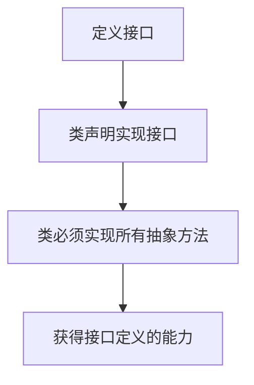
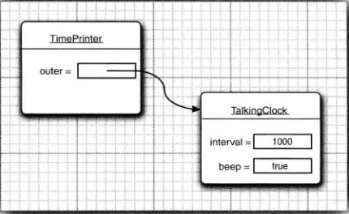
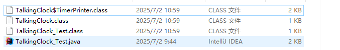

## 6.1 接口

​	接口（英文：Interface），在JAVA编程语言中是一个抽象类型，是抽象方法的集合，接口通常以interface来声明。一个类通过继承接口的方式，从而来继承接口的抽象方法。


#### 6.1.1 接口概念

​	接口不是类，而是类对一组需求的描述。它是抽象方法的集合，但不包含方法的实现。**接口定义了一组行为规范，而类可以实现一个或多个接口，从而提供这些行为的具体实现**。

​	假设现在定义一个Comparable接口，里面包含一个compareTo方法，用于比较大小，如x.compareTo(y)，当x小于y时返回负数，反之返回一个正数，如果x等于y返回0；

```java
public interface Comparable
{
    int compareTo(Object other);
    
}
```

​	接口中的所有方法自动地被隐式声明为`public abstract`。在接口中声明方法时，不必提供关键字`public`。如果提供了其他修饰符则会报错。接口通常包含一个或多个方法。而且接口中可以含有变量，但是接口中的变量会被隐式的指定为`public static final`变量（也就是常量）

实现方法的任务应该由实现接口的那个类来完成。如果Employee类想通过compareTo方法进行排序，那么Employee类就必须实现Comparable接口

让类实现一个接口，通常需要两个步骤：

1. **让类声明为实现给定的接口。**
2. **对接口中的所有方法进行定义。**

要让类声明为实现某个接口，需要使用关键字`implements`:

```java
class Employee implements Comparable
```

此时，该类就需要提供compareTo方法的实现，假设根据雇员的薪水进行比较，下面是compareTo方法的实现：

```java
public int compareTo(Object otherObject)
{
    Employee other = (Employee)otherObject;
    return Double.compare(salar,other.salary);
}
```

在这里，我们使用了静态 `Double.compare` 方法， 如果第一个参数小于第二个参数， 它会返回一个负值；如果二者相等则返回 0; 否则返回一个正值

**接口是独立于类的，遵循“谁想使用，谁就实现”的原则，且一旦声明实现，必须实现接口中的所有方法**。下面这个图很好的解释了接口的应用：



​	在Array类中有一个sort方法，Employee要是想用它就必须实现Comparable接口（Comparable接口是在java标准库中已存在的，所以直接使用implements实现它即可）

注意：在java SE5.0中，Comparable接口已经改进为泛型类型

```java
public interface Comparable<T>
{
    int compareTo(T other);
}
```

这里的T代表这个接口可以接受任意参数类型，在实现它时需要指定类型，如Employee类。泛型是java5引入的重要特性。

对比非泛型接口，泛型接口的好处有很多

```java
// 非泛型版本（Java 5 之前）
public class Employee implements Comparable {
    public int compareTo(Object other) {
        // 需要手动类型检查和转换
        if (!(other instanceof Employee)) 
            throw new ClassCastException();
        Employee e = (Employee) other;
        return Double.compare(salary, e.salary);
    }
}
```

而泛型接口能在编译时自动检查，无需类型转换且编译时能捕获错误

```java
// 泛型版本（现代写法）
public class Employee implements Comparable<Employee> {
    public int compareTo(Employee other) {
        // 直接使用 Employee 类型参数
        return Double.compare(salary, other.salary);
    }
}
```


一个类要使用排序服务必须让他实现compareTo方法，因为要向sort方法提供比较对象的方式。sort方法中可能存在下面的语句：

```java
if(a[i].compareTo(a[j])>0)
{
    ....
}
```

为此，想要使用sort的类就必须实现Comparable接口中的方法。

下面的程序提供了完整的代码

```java
//EmployeeSortTest
package interfaces;
import java.util.*;

public class EmployeeSortTest {

    public static void main(String args[])
    {
        /*创建数组列表*/
        Employee[] staff = new Employee[3];


        staff[0] = new Employee("Carl Cracker",7000);
        staff[1]=new Employee("Harry Hacker",8000);
        staff[2]=new Employee("Tony Tester",4000);

        Arrays.sort(staff);
        //给每个人提薪百分之30
        for (Employee e:staff)
            e.raiseSalary(30);

        for (Employee e:staff)
            System.out.println("name="+e.getName()+", salary="+e.getSalary());
    }
}
```

```java
//Employee
package interfaces;

import java.time.temporal.Temporal;

//实现Comparable接口并且泛型指定为Employee类
public class Employee implements Comparable<Employee> {

    private String name;
    private double salary;

    public Employee(){}
    public Employee(String name,double salary)
    {
        this.name=name;
        this.salary=salary;
    }

    public String getName() {
        return name;
    }

    public void setName(String name) {
        this.name = name;
    }

    public double getSalary() {
        return salary;
    }

    public void setSalary(double salary) {
        this.salary = salary;
    }

    public void raiseSalary(double byPercent)
    {
        double raise = salary *(byPercent/100); //提薪金额；
        salary+=raise;
    }
    
    /**
    * 实现Comparable接口中的compareTo方法
    *
    */
    @Override
    public int compareTo(Employee other) {
        /*比较两者薪水*/
        return Double.compare(salary,other.salary);
    }
}
```


##### API 

**int compareTo(T other)    //java.lang.Comparable\<T\>**

用这个对象与other进行比较。如果这个对象小于other则返回负值；如果相等返回0；否则返回正值

**static void sort(Object[] a )   //java.util.Arrays ** 

使用mergesort(合并排序)算法对数组a中的元素进行排序。要求数组中的元素必须属于实现了Comparable接口的类，并且元素之间必须是可比较的。

**stiatic int compara(int x,int y)**

如果x<y返回一个负数；如果x和y相等返回0；否则返回一个正数。


#### 6.1.2 接口的特性

**接口不是类，不能使用new运算符实例化一个接口**：

```java
x = new Comparable(...); //ERROR
```

**但是能声明接口的变量**；

```java
Comparable x; //ok
```

==**接口变量必须引用实现了接口的类对象**==，如上例的Employee类：

```java
x=new Employee(...);  //ok
```

接下来， 如同使用 instanceof 检查一个对象是否属于某个特定类一样， **也可以使用instanceof检查一个对象是否实现了某个特定的接口**：

```java
if(anObject instanceof Comparable){...}
```


与可以建立类的继承关系一样，**接口也可以被扩展**。假设有一个被称为Moveable的接口：

```java
public interface Moveable
{
    void move(double x,double y);
}
```

可以以它为继承扩展一个叫做Powered的接口

```java
public interface Powered extends Moveable
{
    double milePerGallon();
}
```


接口中不能包含成员和静态方法，但可以包含常量：

```java
public interface Powered extends Moveable
{
  double milesPerGallon();
  double SPEED_LIMIT=95;
}
```

​	==**接口中的成员将被自动设置为public static final**==;

​	==**任何实现接口的类都会自动继承这些常量，并可以在方法中直接的引用该常量。每个类只能拥有一个父类，但却可以实现多个接口**==。这就为定义类的行为提供了极大的灵活性。

​	例如，==Java 程序设计语言有一个非常重要的内置接口， 称为 Cloneable。如果某个类实现了这个 Cloneable 接口，Object 类中的 clone 方法就可以创建类对象的一个拷贝。 如果希望自己设计的类拥有克隆和比较的能力， 只要实现这两个接口就可以了==； 使用逗号将实现的各个接口分隔开。

```java
class Employee implements Cloneable,Comparable
```


#### 6.1.3 接口与抽象类

如果知道了抽象类的内容，会产生为什么不直接将Comparable这样的接口设计为抽象类的疑问。

```java
abstract class Comparable //why not?
{
    public abstract int compareTo(Object other);
}
```

然后，Employee类再直接扩展这个抽象类，并提供compareTo方法的实现：

```java
class Employee extends Comparable
{
    public int compareTo(Object other){...}
}
```

这是因为，使用抽象类表示通用属性存在一个问题：**每个类只能扩展于一个类**。假设Employee已经扩展于一个类，例如Person，它就不能再扩展第二个类

```java
class Employee extends Person,Comparable //Error
```

但**每个类可以实现多个接口**：

```java
class Employee extends Person implements Comparable //ok
```

​	有些程序设计语言允许一个类有多个超类， 例如 C++。我们将此特性称为多重继承( multiple inheritance)。而 Java 的设计者选择了不支持多继承，其主要原因是多继承会让语言本身变得非常复杂（如同 C++)， 效率也会降低 

​	实际上， 接口可以提供多重继承的大多数好处，同时还能避免多重继承的复杂性和低效性。

​	在Java SE8中，允许在接口中增加静态方法。


#### 6.1.5 默认方法

可以为接口方法提供一个默认实现。用default修饰符标记这样一个方法。

```java
public interface Comparable<T>
{
    default int compareTo(T other)
    {
        return 0;
    }
}
```

当然，这并没有太大用处，因为Comparable的每一个实际实现都要覆盖这个方法。不过有些情况下，默认方法可能有用。例如，如果希望在发生鼠标点击事件时得到通知，就要实现一个包含5个方法的接口：

```java
public interface MouseListener
{
    void mousedieked(MouseEvent event);
	void mousePressed(MouseEvent event);
	void mouseReleased(MouseEvent event);
	void mouseEntered(MouseEvent event);
	void mouseExited(MouseEvent event)
}
```

在 Java SE 8 中， 可以把所有方法声明为默认方法。

```java
public interface MouseListener
{
    default void mousedieked(MouseEvent event) {}
	default void mousePressed(MouseEvent event) {}
	default void mouseReleased(MouseEvent event) {}
	default void mouseEntered(MouseEvent event) {}
	default void mouseExited(MouseEvent event) {}
}
```

这样一来，实现这个接口的程序员只需要为他们真正关心的事件覆盖相应的监听器。


#### 6.1.6 解决默认方法冲突

如果现在一个接口中奖一个方法定义为默认方法，然后又在超类或另一个接口中定义了同样的方法。java会有相应的规则：

1. 超类优先。如果超类提供了一个具体方法，同名而且有相同参数类型的默认方法会被忽略。
2. 接口冲突。如果一个超接口提供了一个默认方法，另一个接口提供了一个同名且参数类型相同的方法，必须覆盖这个方法来解决冲突。


下面考虑一个包含getName的接口：

```java
interface Named
{
    default String getName(){return ....};
}
```

一个类同时实现了两个接口

```java
class Student implement Person,Named
{
    ...
}
```

类会继承Person和Named接口提供的两个不一致的getName方法。Java编译器会报告一个错误，让程序员来解决这个二义性。**只需在类中提供一个同样的方法**。

```java
class Student implement Person,Named
{
   public String getName(...);
}
```


## 6.2 接口示例

接下来的 3 节中， 我们将给出接口的另外一些示例， 可以从中了解接口的实际使用。


#### 6.2.1 接口与回调

​	**回调（callback)是一种常见的程序设计模式。==这种模式中，可以指定某个特定事件发生时应该采取的动作==**。例如，指出在按下鼠标或选择某个菜单项时应该采取什么行动。

​	在java.swing包中有一个Timer类，可以使用它在达到给定的时间间隔时发出通告。

​	在构造定时器时，需要设置一个时间间隔，并告之定时器，当到达时间间隔时需要做什么操作。

​	如何告之定时器做什么呢？在Java标准类库中的类采用的是面向对象方法。它将某个类的对象传递给定时器，然后定时器调用这个对象的方法。由于对象可以携带一些附加的信息，所以传递一个对象比传递一个函数灵活得多。

​	当然，**定时器需要知道调用哪个方法，==并要求传递的对象所属的类实现了java.awtevent包的ActionListener接口==**。下面是这个接口：

```java
public interface ActionListener
{
    void actionPerformed(ActionEvent event);
}
```

**当到达指定的时间间隔时，定时器就调用actionPerformed方法**

假设希望每隔 10 秒钟打印一条信息“At the tone, the time is . . .”， 然后响一声， 就应该定义一个实现 ActionListener 接口的类， 然后将需要执行的语句放在 actionPerformed 方法中。

```java
class TimePrinter implements ActionListener
{
    public void actionPerformed(ActionEvent event)
    {
        System.out.println("At the tone,the time is" + new Date());
        Toolkit.getDefaultToolkit().beep(); //蜂鸣器
    }
}
```

接下来，构造这个类的一个对象，并将他传递给Timer构造器

```java
ActionListener listener = new TimePrinter();
Timer t = new Timer(10000,listener);
```

Timer构造器的第一个参数是发出通过的时间间隔，它的单位是毫秒，这里希望每隔10秒通告一次，第二个参数是监听器对象。

最后，启动定时器：

```java
t.start();
```

下面的程序给出了定时器和监听器的操作行为。

```java
package timer;

import java.awt.*;
import java.awt.event.*;
import java.util.*;
import javax.swing.*;
import javax.swing.Timer;
public class TimerTest {
    public static void main(String[] args) {
        // 接口引用指向实现类实例
        ActionListener listener = new TimePrinter();
		
        Timer timer = new Timer(10000, listener);
        timer.start();
        JOptionPane.showMessageDialog(null, "Exit program?"); //打印退出窗口
        System.exit(0);
    }
}

class TimePrinter implements ActionListener
{
    @Override
    public void actionPerformed(ActionEvent event)
    {
        System.out.println("At the tone,the time is" + new Date());
        Toolkit.getDefaultToolkit().beep(); //蜂鸣器
    }
}
```

​	无需关心实现方法中的参数ActionEvent event。目前并没有使用它。注意定时器Timer类要求所传递对象所属的类必须实现了java.awtevent包的ActionListener接口。	

##### API

**static void showMessageDialog(Component parent,Object message)  //javax.swing.JOptionPane **

显示一个包含一条消息和OK按钮的对话框。这个对话框将位于其parent组件的中央。如果parent为null，对话框将显示在屏幕的中央。


<em>**javax.swing.Timer**</em>

**Timer(int interval, ActionListener listener)**

构造一个定时器，每隔interval毫秒通告listener一次。listener类必须实现java.awtevent包的ActionListener接口。（1s=1000ms）

**void start()**

启动定时器。一旦启动成功，定时器将调用监听器的actionPerformed;

**void stop()**

停止定时器。一旦停止成功，定时器将不再调用监听器的actionPerformed;


<em>**java.awt.Toolkit**</em>

**static Toolkit getDefaultToolkit()**

获得默认的工具箱。工具箱包含有关GUI环境的信息。

**void beep()**

发出一声领响。


​	注意Timer的构造方法参数`ActionListener listener`，这是一个接口参数，==当一个方法的参数是一个接口，那么可以传入任何实现了该接口的类的实例==，如：

1. 直接实现该接口的类的实例。
2. 继承了实现该接口的父类的子类的实例（如果父类实现了接口，子类也相当于实现了该接口）。
3. 匿名内部类实现接口的实例。
4. Lambda表达式（如果接口是函数式接口，即只有一个抽象方法）。
5. 方法引用（同样要求接口是函数式接口）。

此外，还可以传入该接口的子接口的实例


#### 6.2.2 Comparator 接口

​	想要使用Arrarys.sort对一个对象数组排序,那么该对象所属的类就必须实现了Comparable接口。可以对一个字符串数组进行排序，因为String类已经实现了

Comparable\<String\>。

​	假设希望按长度递增的顺序对字符串进行排序，而不是按字典顺序进行排序。要处理这种情况，Arrays.sort方法还有第二个版本。参数为一个数组和一个比较器（comparator)

​	比较器是实现了Comparator接口的类的实例

```java
public interface Comparator<T>
{
    int compare(T first ,T second);
}
```

要按长度比较字符串，可以如下定义一个实现Comparator\<String>的类

```java
class LengthComparator implements Comparator<String>
{
    public int compare(String first,String second)
    {
        return first.length() - second.length();
    }
}
```

要对一个数组排序，需要为Arrays.sort方法传入一个实现了Comparator接口的实例，也就是LengthComparator类对象：

```java
String[] friends={"Peter","paul","May"};
Arrays.sort(friends,new LengthComparator());
```

下面是一个程序

```java
package CompareString;

import java.util.Comparator;
import java.util.Arrays;
public class CompareStringTest {
    public static void main(String args[])
    {
        String[] friends={"Peter","paul","May","PerterPlus","TW","LGBTQ"};
        System.out.println("排序前：");
        for(String s:friends)
            System.out.print(s+" ");
        Arrays.sort(friends,new LengthCompareString());
        System.out.printf("\n排序后：\n");
        for(String s:friends)
            System.out.print(s+" ");
    }
}

class LengthCompareString implements Comparator<String>
{
    LengthCompareString(){}
    public int compare(String first,String second)
    {
        return first.length() -second.length();
    }
}
```


#### 6.2.3 对象克隆

先回忆为一个包含对象引用的对象建立副本时会发生什么，原变量和副本都是同一个对象的引用，这说明，任何一个变量改变都会影响另一个变量。

```java
      Employee original = new Employee("田韦韦",7000,2029,10,12);
      //copy变量和original变量引用的是同一个对象
      Employee copy = original;

      copy.raiseSalary(10);
      System.out.println(original.toString()); //当改变其copy变量的值后，original也会改变
```

如果希望copy是一个新对象，它的初始状态与original相同，但是之后它们会有各自会有自己不同的状态，这种情况下就需要使用clone方法。

```java
Employee copy = original.clone();
copy.raiseSalary(10); //不会影响到original变量
```

​	clone方法是Object的一个protected方法。如果这个对象的所有数据都是基本数据类型，那么这行代码没有问题。**但是如果对象包含其他对象的引用，那么clone会同样会拷贝这个引用，也就是说在原对象和克隆对象仍然会共享一些信息。这种拷贝称为浅拷贝**

​	==浅拷贝会有什么影响？如果原对象和浅克隆对象共享的子对象是不可变的，那么这种共享就是安全的。不过，通常子对象都是可变的，必须重新定义clone方法来建立一个深拷贝==。在这个例子中，hireDay域是一个Date对象，这是可变的，所以它也需要克隆。

​	对于每一个类，需要确定：

 	1. 默认的clone方法是否满足需求；
 	2. 是否可以在可变的子对象上调用clone来修补默认的clone方法；
 	3. 是否不该使用clone

​	实现上第3个选项是默认选项。如果选择第1项或第2项，类必须：

1. 实现Cloneable接口
2. 重新定义clone方法，并指定public访问修饰符。

​	如果一个对象请求克隆，但没有实现这个接口，就会生成一个受查异常。**即使clone的默认（浅拷贝）实现能够满足需求，还是需要实现Cloneable接口，将clone程序定义为public，再调用super.clone()**

```java
class Employee implements Cloneable
{
    public Employee clone() throws CloneNotSupportedException
    {
        return (Employee)super.clone(); //父类为Object
    }
}
```

要建立深拷贝，还需要做更多的工作，克隆对象中可变的实例域。

```java
class Employee implements Cloneable
{
    public Employee clone() throws CloneNotSupportedException
    {
        Employee cloned= (Employee)super.clone(); //clone全部属性
        cloned.hireDay = (Date)hireDay.clone();  //克隆对象属性，防止引用同一个地址
        
        return cloned;
    }
}
```


## 6.3 lambda表达式

​	lambda表达式是这些年来java语言最让人激动的一个变化。了解如何使用lambda表达式采用一种简洁的语法定义代码块，以及如何编写处理lambda表达式的代码是本节的主要任务。


#### 6.3.1 为什么引入lambda表达式

​	**lambda表达式是一个可传递的代码块，可以在以后执行一次或多次**。它是一种简洁地表示匿名函数的方式，它允许你将函数作为参数传递、赋值给变量，或作为返回值使用。

观察一下我们在java中的哪些地方用过这种代码块。

如按指定时间间隔完成工作。将这个工作放在一个ActionListener的acitonpPerformed方法中：

```java
class Worker implements ActionListener
{
    public void actionPerformed(ActionEvent event)
    {
        do some work
    }
}
```

想要反复执行这个代码时，可以构造一个Woker类的实例，然后把这个实例提交到一个Timer对象。

或者可以考虑如何用一个定制比较器完成排序。如果想按长度而不是默认的字典顺序对字符串排序， 可以向 sort 方法传人一个 Comparator 对象：

```java

class LengthCompareString implements Comparator<String>
{
    LengthCompareString(){}
    //实现接口方法
    public int compare(String first,String second)
    {
        return first.length() -second.length();
    }
}
... 
Arrays.sort(Strings,new LengthCompareString);
```


#### 6.3.2 lambda表达式的语法

基本语法：

```java
(参数列表) ->{函数体}
```

如：

```java
(String first,String second)
-> first.length() - second.length()
```

**lambda表达式就是一个代码块**。如果代码要完成的计算无法放在一个表达式中，就可以像写方法一样，把这些代码放在{}中，并包含显示的return语句。

```java
(String first,String second)->
{
    if(first.length() < second.length() )
        return -1;
    else if(first.length() > second.length())
        return 1;
    else 
        return 0;
}
```

**即使lambda表达式没有参数，仍然要提供空括号**：

```java
()->{
    for(int i=100; i>=0; i--)
        System.out.println(i);
}
```

**如果可以推导出一个lambda表达式的参数类型，则可以忽略其类型**：

```java
Comparator<Stirng> comp = 
    (first,second)->
    first.length()-second.length();
```

这里，编译器可以推导出first和second必然是字符串，因为lambda表达式将赋值给一个字符串比较器。


**如果方法只有一个参数，而且这个参数的类型可以推导得出，那么可以省略小括号**

```java
ActionListener listener = 
    event ->System.out.print("The time is"+new Date());
// Instead of (event) event为参数
```

**无需指定lambda表达式的返回类型。lambda表达式的返回类型会由上下文推导得出**。

```java
(String first,String second)->
    first.length() - second.length() //return int类型
```


下面的程序显示了如何在一个比较器和一个动作监听器中使用lambda表达式

```java
//LambdaTest.java
package lambda;
import java.awt.*;
import java.util.*;
import javax.swing.*;
import javax.swing.Timer;
public class LambdaTest {
    //比较器使用lambda表达式
   public static void main(String args[])
   {

       
       String[] planets = new String[] { "Mercury", "Venus", "Earth", "Mars",
               "Jupiter", "Saturn", "Uranus", "Neptune" }; //使用匿名数组进行初始化

       System.out.println(Arrays.toString(planets));//输出该字符串数组的内容
       System.out.println("Sorted in dictionary order:") ;//按字典顺序排序：
       Arrays.sort(planets); //排序
       System.out.println(Arrays.toString(planets));
       System.out. println("Sorted by length:");//按长度排序
       Arrays.sort(planets, (first,second)->first.length()-second.length()); //使用lambda表达式实现comparable接口
       System.out.println(Arrays.toString(planets)); //输出

       //定时器使用lambda表达式
       Timer t =new Timer(5000,event->
               System.out.println("The time is "+new Date())); //每隔5000毫秒（5秒）运行一次传入的lambda表达式
       t.start(); //Timer启动器

       JOptionPane.showMessageDialog(null,"Quit program?"); //退出窗口
       System.exit(0); //程序结束。
   }
}


```


#### 6.3.3 函数式接口

​	java中已经有很多封装代码块的接口，如ActionListener或Comparator。==**lambda表达式与这些接口是兼容的**。**对于只有一个抽象方法的接口，需要这种接口的对象时，就可以提供一个lambda表达式。这种接口称为函数式接口（function interface)**==


Arrays.sort方法的第二个参数需要一个Comparator实例，而Comparator就是只有一个方法的接口，所以可以提供一个lambda表达式：

```java
Arrays.sort(words, (first,second)->first.length()-second.length()); 
```

​	底层中，Arrays.sort方法会接收某个实现了Comparator<String\>类的对象。在这个对象上调用compara方法会执行这个lambda表达式。由于方法的第一个参数是string类，所以第二个参数lambda表达式并不需要指定参数类型，lambda表达式会通过上下文推导其参数的类型。

​	**最好把lambda表达式看作是一个函数，而不是一个对象，lambda表达式可以传递到函数式接口。lambda表达式可以转换为接口**。

```java
        Timer t =new Timer(1000,event->
        {
            System.out.println("At the tone, the time is "+new Date()); //输出此时时间。
            Toolkit.getDefaultToolkit().beep(); //蜂鸣声
        });
```

​	Timer构造器的第二个参数就是lambda表达式。同样event的类型由上下文推导出为Timer类，且只有一个参数，所以不需要小括号。与使用实现ActionListener接口的类相比，此代码的可读性好很多。

在实际应用中，对lambda表达式所能做的也只能是转换为函数式接口。

注意：如果一个类不是一个函数式接口，那么则不能把lambda表达式赋给该类。


#### 6.3.4 方法引用

如果你希望只要出现一个定时器事件去打印这个时间对象：

```java
Timer t =new Timer(1000,event->System.out.pirntln(event));
```

现在有个方法，能直接把println方法传递到Timer构造器：

```java
Timer t = new Timer(1000,System.out::println);
```

**表达式System.out::println是一个方法引用**。它等价于lambda表达式 x->System.out.println(x)。

如果你想对字符串排序，不考虑字母的大小，可以传递以下方法表达式：

```java
Arrays.sort(strings,String::compareToIgnoreCase)
```

**这种使用：：操作符分隔方法名与对象或类名的方法叫做方法引用，它们等价于lambda表达式**，用于替代实现接口的类。

`object::instanceMethod`

`Class::staticMethod`

这两种情况中，方法引用等价于提供方法参数的lambda表达式。

`Class::instanceMethod`

而对于这种情况，第1个参数会称为方法的目标，如Arrays.sort(strings,String::compareToIgnoreCase)；


也可以在方法引用中使用this参数。例如，**this::equals等同与x->this.equals(x)。使用super也是合法的**。

```java
class Greeter
{
    public void greet()
    {
        System.out.println("Hello,World!");
    }
    
}

class TimedGreeter extends Greeter
{
 	public void greet()
    {
        Timer t = new(1000, super::greet);
        t.start();
    }
}
```

当调用TimedGreeter的greet方法时，会构造一个Timer，每隔一秒执行super::greet方法。


#### 6.3.5 构造器引用

​	构造器引用与方法引用很相似，底层实现与对应的Lmabda表达式完全等价，**它们必须赋值给一个匹配的函数式接口，或是在需要函数式接口实例的地方使用**。 如果一个Lambda表达式里只做了一件事——调用某个方法（或构造器），那么就可以考虑使用：：操作符把它替换成更简洁的方法引用或构造器引用，它让你能够**直接引用一个类的构造方法**，代替功能相同的 Lambda 表达式

```java
// 传统 Lambda 写法
Function<Integer, String[]> arrayCreator1 = size -> new String[size];

// 构造器引用写法
Function<Integer, String[]> arrayCreator2 = String[]::new;

// 使用
String[] namesArray = arrayCreator2.apply(5);  // 创建长度为 5 的字符串数组
```

其中Function为函数式接口，第一行代码使用了lambda表达式来实现该接口，而第二行代码则使用构造器引用实现该接口。

​	总结，不管是方法引用，还是lambda表达式。都是为了实现函数式接口，也就是只有一个方法的接口，Timer类的构造方法需要一个实现了java.awtevent包的ActionListener接口的类。或者是Arrays.sort方法要求实现Comparable接口，这都比较麻烦，对于一个简单的需求，我们使用类似于匿名函数的代码，把它们需要的代码传入进去。只不过是选择传入哪些方法，方法引用是传入已有的方法，而lambda表达式是传入自定义的方法。


#### 6.3.6 变量作用域

==**lambda表达式能够访问外围方法或类中的变量**==。如：

```java
public static void repeatMessage(String text,int delay)
{
    ActionListener listener = event ->
    {
        System.out.println(text); //lambda表达式访问外围方法变量
        Toolkit.getDefalutToolkit().beep();  //蜂鸣声
    }
    new Timer(delay,listener).start(); //每个delay毫秒，执行一次listener中的接口
}
repeatMessage("Hello",1000);
```

这里lambda表达式中的变量text，就可以捕获到字符串“Hello”。

lambda表达式可以捕获外围作用域中变量的值。**在lambda表达式中，只能引用值不会改变的变量**，下面的做法是不合法的

```java
public static void countDown(int start,int delay)
{
    Actionlistener listener = event ->
    {
        start--;  //Error;
        System.out.println(start);
    }
}
```

如果在lambda表达式中改变变量，并发执行多个动作时就会不安全。**另外如果在lambda表达式中引用变量，而这个变量可能在外部改变，这也是不合法的**。

```java
public static void repeat(String text,int count)
{
    for(int i=1; i<=count; i++){
        ActionListener listener = event->{
             System.out.println(i+":"+text) //Error
        }
       new Timer(1000,listener).start();
    }
}
```

​	**lambda表达式中捕获的变量必须实际上是最终变量（effectively final)**。最终变量是指，这个变量初始化之后就不会再为它赋新值。在这里,text总是指示同一个String对象，所以捕获这个变量是合法的。而i的值会改变，因此不能捕获i。

在lambda表达式中声明与一个局部变量同名的参数或局部变量是不合法的。

```java
path first = Paths.get("/usr/bin");
Comparator<String> comp = (first,second)
    ->frist.length - second.length(); //Error
```


在一个lambda表达式中使用this关键字时，是指创建这个lambda表达式的方法的this参数。

```java
public class Application()
{
    public void init()
    {
        ActionListener listener = event->
        {
            
            System.out.println(this.toString());
        }
    }
}
```

​	表达式this.toString()会调用Application对象的toString方法，而不是ActionListener示例的方法。在 **lambda 表达式中， this 的使用并没有任何特殊之处lambda 表达式的作用域嵌套在 init 方法中， 与出现在这个方法中的其他位置一样， lambda 表达式中 this 的含义并没有变化。**


#### 6.3.7 处理lambda表达式

​	到目前为止， 你已经了解了如何生成 lambda 表达式， 以及如何把 lambda 表达式传递到需要一个函数式接口的方法。下面来看如何编写方法处理 lambda 表达式。

​	使用lambda表达式的重点是延迟执行。希望以后再执行代码，有很多原因，如：

- 在一个单独的线程中运行代码
- 多次运行代码；
- 在算法的适当位置运行代码；
- 发生某种情况时执行代码；
- 只在必要时才运行代码；

如，想要重复一个动作n次，将这个动作和重复次数传递到一个repeat方法：

```java
repeat(10,()->System.out.println("Hello,World"));
```

要接受这个lambda表达式，需要选择一个函数式接口。表中列出了Java API提供的最重要的函数式接口。在这里，我们可以使用Runnable接口：

```java
public static void repeat(int n,Runnable action)
{
    for(int i=0; i<n;i+++) action.run();
}
```

调用action.run时会执行这个lambda表达式的主体。

##### 										                   表6-1 常用函数式接口

| 函数式接口             | 参数类型 | 返回类型 | 抽象方法名 | 描述                          | 常用默认方法               |
| ---------------------- | -------- | -------- | ---------- | ----------------------------- | -------------------------- |
| **Runnable**           | 无       | void     | run        | 无参、无返回值的任务执行接口  | —                          |
| **Supplier\<T>**       | 无       | T        | get        | 提供一个T类型的结果           | —                          |
| **Consumer\<T>**       | T        | void     | accept     | 接受并处理一个T类型的输入     | andThen                    |
| **BiConsumer\<T,U>**   | T,U      | void     | accept     | 接受并处理T和U两个输入参数    | andThen                    |
| **Function\<T,R>**     | T        | R        | apply      | 将T类型输入映射为R类型输出    | compose, andThen, identity |
| **BiFunction\<T,U,R>** | T,U      | R        | apply      | 将T和U类型输入映射为R类型输出 | andThen                    |
| **UnaryOperator\<T>**  | T        | T        | apply      | 对T类型进行一元操作并返回结果 | compose, andThen, identity |
| **BinaryOperator\<T>** | T,T      | T        | apply      | 对T类型进行二元操作并返回结果 | andThen, maxBy, minBy      |
| **Predicate\<T>**      | T        | boolean  | test       | 对T类型进行条件判断           | and, or, negate, isEqual   |
| **BiPredicate\<T,U>**  | T,U      | boolean  | test       | 对T和U类型进行条件判断        | and, or, negate            |

##### 										                   	

#####                                                                                                表 6-2 基本类型的函数式接口

| 函数式接口             | 参数类型 | 返回类型  | 抽象方法名     |
| ---------------------- | -------- | --------- | -------------- |
| `BooleanSupplier`      | none     | `boolean` | `getAsBoolean` |
| `<P>Supplier`          | none     | `P`       | `getAsP`       |
| `<P>Consumer`          | `P`      | `void`    | `accept`       |
| `Obj<P>Consumer<T>`    | `T, P`   | `void`    | `accept`       |
| `<P>Function<T>`       | `P`      | `T`       | `apply`        |
| `<P>To<Q>Function`     | `P`      | `Q`       | `applyAsQ`     |
| `To<P>Function<T>`     | `T`      | `P`       | `applyAsP`     |
| `To<P>BiFunction<T,U>` | `T, U`   | `P`       | `applyAsP`     |
| `<P>UnaryOperator`     | `P`      | `P`       | `applyAsP`     |
| `<P>BinaryOperator`    | `P, P`   | `P`       | `applyAsP`     |
| `<P>Predicate`         | `P`      | `boolean` | `test`         |


#### 6.3.8 再谈Comparator

Comparator接口包含很多方便的静态方法来创建比较器，这些方法可以用于lambda表达式或方法引用。

静态方法comparing方法根据对象的某个属性（键）创建一个Comparator，它接受一个函数，该函数从对象中提取一个可比较的键，然后返回一个根据该键进行比较的Comparator

```java
Arrays.sort(people,Comparing(Person::getName)); //Comparing接受一个函数，而Person::getName是一个方法引用
```

现在该数组按照人名来进行比较排序。


## 6.4 内部类

内部类（inner class）是定义在另一个类中的类。使用内部类的主要原因有以下三点：

- 内部类方法可以访问该类定义所在的作用域中的数据，包括私有的数据。

- 内部类可以对同一个包中的其他类隐藏起来。

- 当想要定义一个回调函数且不想编写大量代码时，使用匿名（anonymous)内部类比较便捷。


#### 6.4.1 使用内部类访问对象状态

​	内部类的语法比较复杂。下一步通过程序来抽象出一个TalkingClock类讲解内部类的特点。构造一个语音时钟需要提供两个参数：时间间隔和开关铃声的标志。

```java
public class TalkingClock
{
    private int interval;
    private boolean beep;
    public TalkingClcock(int interval,boolean beep){...};
    
    //inner class
    public class TimerPrinter implements ActionListener
    {
        ...
    }
}
```

下面是内部类的具体实现

```java
public class TimerPrinter implements ActionListener
{
    public void actionPerformed(ActionEvent event){
        System.out.println("the time is"+new Date());
        if(beep)
            Toolkit.getDefaultToolkit().beep();
    }
}
```

​	注意内部类TimerPrinter并没有beep成员，**这里的beep引用了创建TimerPrinter的TalkingClock对象的域**。==**内部类既可以访问自身的数据域，也可以访问创建它的外围类对象的数据域。==**

​	**内部类的对象总是有一个隐式引用指向创建它的外部类对象**,能让内部类访问外部类的数据域



这个引用在内部类的定义中是不可见的，为了说明这个概念，将外围类对象的引用称为outer。于是actionPerformed方法等价于下列形式：

```java
    public void actionPerformed(ActionEvent event){
        System.out.println("the time is"+new Date());
        if(outer.beep)
            Toolkit.getDefaultToolkit().beep();
    }
```

而外围的引用在构造器中设置。因为TimerPrinter类没有定义构造器，所以编译器为这个类生成一个默认的构造器：

```java
public TimerPrinter(TalkingClock clock)
{
    TalkingClock outer = clock;
}
```

注意，**outer不是java的关键字，只是用它说明内部类的机制**。


​	下面是一个测试内部类的完整程序，如果TimerPrinter是一个常规类，它就需要通过TalkingClock类的公有方法访问beep标志，而使用内部类可以给予改进。

```java
package InnerClass;

import javax.swing.*;
import java.awt.*;
import java.awt.event.*;
import java.util.Date;
import java.util.*;
import javax.swing.Timer;


public class TalkingClock_Test {
    public static void main(String args[]){
        TalkingClock TC = new TalkingClock(1000,true);
        TC.start();
        JOptionPane.showMessageDialog(null,"Quit program?");
        System.exit(0);
    }
}

class TalkingClock
{
    private int interval;
    private boolean beep;
    public TalkingClock(int interval,boolean beep){
        this.interval = interval;
        this.beep =beep;
    };

    public int getInterval()
    {
        return this.interval;
    }


    //inner class
    public class TimerPrinter implements ActionListener
    {
        @Override
        public void actionPerformed(ActionEvent e) {
            System.out.println("the time is "+new Date());
            if(beep) //访问外部类的成员
                Toolkit.getDefaultToolkit().beep();
        }
    }
    
    
    //在对象中定义方法
    public void start()
    {
        ActionListener listener = new TimerPrinter();
        Timer t = new Timer(interval,listener);
        t.start();
    }
}
```


#### 6.4.2 内部类的特殊语法规则

上一节讲述内部类有一个外围类的引用outer，事实上，使用外围类引用的正规语法还要复杂一些,表达式:

**`OuterClass.this`表示外围类引用**

```java
public void actionPerformed(ActionEvent event)
{
    ...
        if(TalkingClock.this.beep)
            Toolkit.getDefaultToolkit().beep
}
```

反过来，可以采用下列语法格式更加明确地编写内部对象的构造器：

`OuterObject.new InnerClass(construction parameters)`

例如：

```java
ActionListener listener = this.new TimerPrinter();
```

需要注意，**在外围类的作用域之外，可以这样引用内部类**：

```java
OuerClass.InnerClass
```


#### 6.4.3 内部类特性

​	内部类是一种编译现象，与虚拟机无关。编译器将会把内部类翻译成用$（美元符号）分隔外部类名与内部类名的常规类文件，而虚拟机对此一无所知。

例如，在TalkingClock类内部的TimePrinter类将被翻译成类文件TalkingClock$TimePrinter.class




#### 6.4.4 局部内部类

**如果一个内部类只在某个方法中使用了一次，当遇到这种情况时，可以在一个方法中定义局部类**

```java
public void start()
{
    //局部内部类
    class TimerPrinter implements ActionListener
    {
        public void actionPerformed(ActionEvent event)
        {
            System.out.println("At the tone, the time is "+new Date());
            if(beep)
                Toolkit.getDefaultToolkit().beep();
        }
    }
    
    ActionListener listener = new TimerPrinter();
    Timer t = new Timer(interval,listener);
    t.start();
}
```

​	==**局部类不能用public或private访问说明符进行声明。它的作用域被限定在这个声明这个局部类的块中**==。局部类对于外部世界可以完全地隐藏起来。即外部类的其他代码不能访问它。除了它所处的方法之外，没有任何方法指导TimerPrinter类的存在。


#### 6.4.5 由外部方法访问变量

**局部类还有一个优点，它们不仅能访问包含它们的外部类，还可以访问局部变量**。不过，那些局部变量必须事实上为final。

下面是一个典型的示例。这里将TalkingClock构造器的参数interval和beep移至start方法中

```java
  public void start(int interval,boolean beep)
    {
        //inner class
        class TimerPrinter implements ActionListener
        {

            @Override
            public void actionPerformed(ActionEvent e) {
                System.out.println("the time is "+new Date());
                if(beep) //访问外部类的成员
                    Toolkit.getDefaultToolkit().beep();
            }
        }

        ActionListener listener = new TimerPrinter();
        Timer t = new Timer(interval,listener);
        t.start();
    }
```

这时TalkingClock类不再需要储存实例变量beep了，它只是引用start方法中的beep参数变量。

为了能够清除地看到内部的问题，仔细地观察一下运行流程

1) 调用start方法
2) 调用内部类TimePrinter的构造器，以便初始化对象变量listener
3) 将listener引用传递给Timer构造器，定时器开始计时，start方法结束。此时start方法的beep参数变量不再存在
4) 然后，actionPerformed方法执行if(beep)。

为了能让actionPerformed方法工作，TimerPrinter类在beep域释放之前将beep域用start方法的局部变量进行备份。


#### 6.4.6 匿名内部类

**假如只创建这个类的一个对象，就不必命名了。这种类被称为匿名内部类(anonymous inner class)**

```java
public void start(int interval,boolean beep)
{
   ActionListener listener = new ActionListener() 
   {//匿名类实现ActionListener接口
       public void actionPerformed(ActionEvent event)
       {
           System.out.println("At the tone, the time is "+ new Date());
          	if(beep)
                Toolkit.getDefaultToolkit().beep();
       }
   };
    Timer t =new Timer(interval,listener);
    t.start();
}
```

它的含义是：创建一个实现ActionListener接口的类的新对象，需要实现的方法actionPerformed定义在括号{}内

通常的语法格式为：

```java
new SuperType(construction parameters)
{
    inner class methods and date
}
```

其中，SuperType可以是ActionListener这样的接口，于是内部类就要实现这个接口。SuperType也可以是一个类，于是内部类就要扩展它。

​	==**由于构造器的名字必须与类名相同，而匿名类没有类名，所以匿名类不能有构造器**==。确取而代之的是，将构造器传递给父类（superclass)构造器，尤其是在内部类实现接口的时候，不能有任何构造参数。不仅如此，还要像下面这样提供一组括号：

```java
new InterfaceType()
{
    methods and date
}
```

​	多年来，java程序员习惯的做法是用匿名内部类实现事件监听器和其他回调。如今最好还是使用lambda表达式。例如，这一节前面给出的start方法用lambda表达式来写会简洁得多，如下所示：

```java
class TalkingClock
{
    //在对象中定义方法
    public void start(int interval,final boolean beep)
    {
        //inner class

        Timer t = new Timer(interval,(actionEvent)->
        {
            System.out.println("the time is "+ new Date());
            if(beep)
                Toolkit.getDefaultToolkit().beep();
        });
        t.start();
    }
}
```

完整程序：

```java
package anonymousInnerClass;

import java.awt.*;
import java.awt.event.*;
import java.util.*;
import javax.swing.*;
import javax.swing.Timer;
public class AnonymousInnerClassTest {
    public static void main(String args[]){
        TalkingClock TC = new TalkingClock();
        TC.start(1000,true);

        JOptionPane.showMessageDialog(null,"Quit program?");
        System.exit(0);
    }
}

class TalkingClock
{
    //在对象中定义方法
    public void start(int interval,final boolean beep)
    {
        //inner class

        //lambda写法更简洁
        Timer t = new Timer(interval,(actionEvent)->
        {
            System.out.println("the time is "+ new Date());
            if(beep)
                Toolkit.getDefaultToolkit().beep();
        });

        //匿名内部类写法
        Timer T = new Timer(interval, new ActionListener() {
            public void actionPerformed(ActionEvent e) {
                System.out.println("the time is "+ new Date());
                if(beep)
                    Toolkit.getDefaultToolkit().beep();
            };
        });
        t.start();

    }
}
```


**技巧**：下面的技巧称为"双括号初始化"，这里利用了内部类语法。假设你想构造一个数组列表，并将它传递到一个方法：

```java
ArrayList<String> friends = new ArrayList<>();
friends.add("Harry");
friends.add("Tony");
invite(friends);
```

如果在此之后不再需要这个数组列表，最好让他作为一个匿名列表。不过作为一个匿名列表，该如何为它添加元素呢，方法如下：

```java
invite(new ArrayList<String>(){{add("Harry");add("Tony")}});
```

外层括号建立了一个ArrayList的匿名子类。内层括号则是一个对象构造块。


#### 6.4.7 静态内部类

​	有时，**使用内部类只是为了把一个类隐藏在另一个类的内部，并不需要内部类引用外围对象。为此，可以将内部类声明为static，以便取消产生的引用。**

​	下面是一个使用静态内部类的典型例子。考虑一下计算数组中最小值和最大值的问题。当然， 可以编写两个方法， 一个方法用于计算最小值， 另一个方法用于计算最大值。在调用这两个方法的时候， 数组被遍历两次。 如果只遍历数组一次， 并能够同时计算出最小值和最大值，那么就可以大大地提高效率了。

```java
double min = Double.POSITIVE_INFINITY; //double正无穷大的常量
double max = Double.NEGATIVE_INFINITY;  //double负无穷大的常量。
if(double v :value)
{
    if(min>v)
        min = v;
    if(max < v)
        max = v;
}
```

然而，这个方法必须返回两个数值，为此，可以定义一个包含两个值的类Pair:

```java
    class Pair
    {
        private double first;
        private double second;

        public Pair(double f,double s)
        {
            first = f;
            second = s;
        }

        public double getFirst(){return first;};
        public double getSecond(){return second;};
    }
```

minmax方法返回一个Pair类型的对象，这个对象包含了传入数组的最大值和最小值

```java
class ArrayAlg
{
    public static Pair minmax(double[] values)
    {
        ...;
        return new Pair(min,max)
    }
}
```

这个方法的调用者可以使用getFrist和getSecond方法获得答案：

```java
Pair p = ArrayAalg.minmax(d);
System.out.println("min = "p.getFrist());
System.out.println("max = "p.getSecond());
```

Pair是一个大众化的名字。在**大型项目中，为避免参数名字冲突，可以将Pair定义为ArrayAlg的内部公有类，通过ArrayAlg.Pair访问它**：

```java
ArrayAlg.Pair p = ArrayAlg.minxmax(d);
```

不过，与前面的例子不同，Pair对象不需要引用任何其他的对象，为此，可以将这个内部类声明为static:

```java
class ArrayAlg
{
    public static class Pair
    {
        ...
    }
    ...
}
```

下面是使用静态内部类的完整程序：

```java
package StaticInnerClassTest;

import java.util.*;
public class StaticInnerClassTest {
    public static void main(String[] args){
        double[] D_Array = new double[10];
        /*生成随机数代码*/
        long seed = System.currentTimeMillis();  //获取当前时间（毫秒为单位）作为种子
        Random rand = new Random(seed); //将seed作为种子
        for(int i=0; i<10;i++){
            D_Array[i] = rand.nextDouble(1000);//生成0~999
            System.out.println(D_Array[i]+" ");
        }
        ArrayAlg.Pair p = ArrayAlg.minmax(D_Array); //接受方法返回的Pair引用
        System.out.println("min = "+p.getFirst());
        System.out.println("max = "+p.getSecond());
    }


}

class ArrayAlg
{

    //Inner class
    public static class Pair
    {
        private double first;
        private double second;

        public  Pair(double f,double s)
        {
            first = f;
            second = s;
        }

        public double getFirst(){return first;};
        public double getSecond(){return second;};
    }

    public static Pair minmax(double[] values){
        double min = Double.POSITIVE_INFINITY;
        double max = Double.NEGATIVE_INFINITY;
        for(double v:values){
            if(min> v)
                min = v;
            else if(max<v)
                max = v;
        }
        return new Pair(min,max);
    }
}

```

​	静态内部内和内部类的核心区别技术，静态内部类不会持有外部类的引用，无法访问外部类的成员，并且与静态变量不同，可以跟随外部内实例化多个。


## 6.5 使用接口

​	本节将总结接口的使用方式，包括如何定义接口，如何实现接口。以及实现接口后如何去使用它。本节的内容会脱离上下文联系，也就是说没有看过其他内容，只看本节也能学会使用接口。这是我个人的总结

​	前面说过，**接口是一组行为规范，而类可以实现一个或多个接口。从而提供这些行为的具体实现**。


#### 6.5.1 定义接口

​	定义接口与定义类类似，关键字从`class`变为`interface`，如下：

```java
public interface MyInterface{
    void dosomeThing(){
    }
}
```

​	**接口若不指定修饰符`public`，则默认权限为包内可使用，也就是被`private`所修饰**。下面列举出接口中可以拥有的方法，根据需求定义接口

```java
public interface 接口名 {
    // 常量（默认：public static final）
    数据类型 常量名 = 值;

    // 抽象方法（默认：public abstract）
    返回类型 方法名(参数列表);

    // 默认方法（Java 8+）
    default 返回类型 方法名(参数列表) {
        // 方法体
    }

    // 静态方法（Java 8+）
    static 返回类型 方法名(参数列表) {
        // 方法体
    }

    // 私有方法（Java 9+）
    private 返回类型 方法名(参数列表) {
        // 方法体
    }
}

```

​	**接口类可以定义常量，常量默认被`public static final`所修饰。而抽象方法默认被`public abstract`所修饰。**默认方法是接口的默认实现。

​	

#### 6.5.2 继承接口

​	**接口可以继承一个或多个接口，**继承时，会继承父类的所有抽象方法、默认方法、常量和静态方法。如下：

```java
interface Flyable {
    void fly(); //飞
}

interface Swimmable {
    void swim();//游泳
}

// Bird 继承了两个接口
interface Bird extends Flyable, Swimmable {
    void chirp(); // 鸟叫
}
```

​	如果有一个类要实现继承了两个接口的接口，那么它必须实现子接口本身的抽象方法以及两个父类的抽象方法：

```java
// 实现类 麻雀（Sparrow）
class Sparrow implements Bird {
    @Override
    public void fly() {
        System.out.println("麻雀在飞");
    }

    @Override
    public void swim() {
        System.out.println("麻雀也能漂");
    }

    @Override
    public void chirp() {
        System.out.println("麻雀叽叽喳喳");
    }
}
```

​	**一个类可以实现多个接口，实现类必须实现接口中所有的抽象方法。且抽象类可以实现接口，抽象类实现接口时，不是必须写具体实现，该实现交给继承抽象类的非抽象子类去实现。比如**

```java
// 定义一个接口
interface Flyable {
    void fly();  // 接口中的抽象方法
}

// 抽象类实现接口
abstract class Animal implements Flyable {
    abstract void eat(); // 抽象类自己的抽象方法

    // 可以实现接口方法，也可以不实现（这里先不实现）
    // public void fly() { System.out.println("Animal is flying"); }
}

// 非抽象子类继承抽象类
class Bird extends Animal {
    @Override
    public void eat() {
        System.out.println("Bird is eating worms");
    }

    @Override
    public void fly() {
        System.out.println("Bird is flying high in the sky");
    }
}

// 测试类
public class Main {
    public static void main(String[] args) {
        Bird b = new Bird();
        b.eat();
        b.fly();
    }
}

```

​	**抽象类可以实现接口也可以不实现接口。**

​	**为了模块化和封装，有些接口只能在某个类或组件内部用，不希望被乱用，就可以定义为内部接口**。如：

```java
public class Button{
    public interface OnClickListener{
        void onClick();
    }
}
```

​	顶层接口，也就是定义的接口，它的抽象方法默认是`public static abstract`。而内部接口的修饰符可以是`public、private、protected`，默认为包级权限（无修饰符）


#### 6.5.3 实现接口

​	实现接口有多种方式，一般为类实现，这是最普通的实现方法。比如我们定义一个接口`Comparable`（这在Java标准库中有具体定义），里面有一个抽象方法`compareTo()`，该接口赋予两个类比较大小的能力

```java
public interface Comparable<T>{
    int compareTo(T o);
}
```

​	`Comparable<T>`代表了它是一个泛型接口，可以接受任意类，比如说现在有一个学生类，我们根据学生成绩比较大小。那么它的具体实现应该是这样的：

```java
public class Student implements Comparable<Student> {
    private String name;
    private String job;
    private int age;
    private int score;
	.....
    //构造方法，get、set方法
        
    .....
    @Override
    public int compareTo(Student o) {
        return this.score-o.score;
    }

}
```

​	可以看见，实现泛型接口时，需要指定类。下面是这个实现类的使用：

```java
    public static void main(String[] args){
        Student tww = new Student("田韦韦","计算机科学与技术",21,98);
        Student wwx = new Student("汪文学","数控技术与应用",20,87);

        if(tww.compareTo(wwx)>0){
            System.out.println(tww.getName()+"的成绩要高");
        }else if(tww.compareTo(wwx)<0){
            System.out.println(wwx.getName()+"的成绩要高");
        }else
            System.out.println("两个人的成绩相等");
    }
```

​	这是一般实现方法，**为一个类提供比较大小的能力**。

​	

##### 1.匿名内部类实现接口

​	当一个接口只有一个抽象方法时，该接口被叫做函数式接口。这种接口可以被匿名内部类和`lambda`表达式实现。我们先讲匿名内部类实现接口。

​	`Runnable接口`有一个无参无返回值的抽象方法，仅表示一个动作。

```java
    public static void main(String[] args){
        //用匿名内部类实现接口
       Runnable r = new Runnable() {
           @Override
           public void run() {
               System.out.println("这是一个匿名内部类实现的接口");
           }
       };
       r.run();
    }
```

​	匿名内部类是没有名字的类，通常用来临时实现一个接口或继承一个类，我们来看一个方法：`Arrays.sort()`，下面是它的原型声明：

```java
public static <T> void sort(T[]a,Comparetor<? super T> c)
```

​	`public static `后面的\<T>表明它是一个泛型方法，`T[] a`表明它接受任意类型的数组，`Comparator<? super T> c` 代表它需要一个实现了该接口的类，通过该接口对数组a进行排序。而`<? super T>`表示它限定为T的父类（包括本身）。

​	所以，要使用`Arrays.sort`方法，必须传入一个实现`Comparetor`接口的类，但是当我们只对这个数组排序一次时。专门为该方法去定义一个实现类，似乎有点浪费。所以这时候匿名类就起到了作用，它可以这样使用：

```java
    public static void main(String[] args){
        //用匿名内部类实现接口
       Student[] sts = new Student[10]; //定义数组，存储10个学生

        Arrays.sort(sts,new Comparator<Student>(){
            @Override
            public int compare(Student o1, Student o2) {
                return o1.score-o2.score;
            }
        });
    }
```

​	同样的，我们可以定义一个接口变量去接收这个匿名内部类。然后将这个比较器传入该方法

```java
    public static void main(String[] args){
        //用匿名内部类实现接口
       Student[] sts = new Student[10]; //定义数组，存储10个学生
		Comparator<Student> comparator = new Comparator<Student>(){
            
        }
        Arrays.sort(sts,new Comparator<Student>(){
            @Override
            public int compare(Student o1, Student o2) {
                return o1.score-o2.score;
            }
        });
    }
```

​	我们多举一点例子。现在我们来看一个`Timer`类，我们不做深入了解。简单的了解它的功能。先看它的一个构造器

```java
Timer(int delay,ActionListener listener);
```

​	该构造函数将设置事件间延迟为`delay`毫秒，调用`start()`方法后每隔`delay`毫秒调用一次listener接口。同样的，我们需要实现`ActionListener`接口。该接口同样为一个函数式接口，它的抽象方法是

```java
void actionPerformed(ActionEvent event);
```

​	现在，我们通过使用`Timer`类和`ActionListener`接口去定义一个每个n秒做一件事的程序。

```java
    public static void main(String[] args){
        ActionListener act = new ActionListener() {
            @Override
            public void actionPerformed(ActionEvent e) {
                System.out.println("事件执行第"+(++count)+"次");
            }
        };
        //每隔两秒执行一次事件
        int second = 1000;
        Timer timer = new Timer(2*second,act);

        timer.start();
        JOptionPane.showMessageDialog(null, "Exit program?"); //打印退出窗口
        System.exit(0);
    }
```

​	注意，我们需要Swing的事件一直执行，但`main（）`方法执行完就退出了，`Timer`线程也被回收。所以需要一个阻塞语句，不让JVM退出


##### 2. lambda表达式实现接口

​	`lambda`表达式是Java8引入的一种语法糖，**它能极大的简洁实现函数式接口（也只适用于函数式接口）**，如`ActionListener、Runnable、Comparator`这些接口都是函数式接口。

​	可以把`lambda`表达式看作一个省略了参数类型、函数名、的一种代码块。下面是它的标准形式：

```java
(参数列表) ->{方法体}
```

​	`lambda`表达式的省略规则：

1. 参数类型可以省略（编译器自动推断）；
2. 一个参数时可省括号；
3. 方法体只有一句时可省略`{}`，且里面的语句是`return语句`，也可以省略`return`关键字;
4. 语法不能混乱：一旦省略了`{}`，就不能再写分号和多行语句。

​	如：下面的`lambda`表达式表示将两个参数相加并返回和。

```java
(x,y)->x+y;
//完整写法：
(int x,int y)-> { return x+y;};
```

​	下面列举常见6种`lambda`表达式形式：

###### 🧩 Lambda 的六种常见形态

| 场景               | **完整写法**                                                 | **简略写法**                                | 说明                                         |
| ------------------ | ------------------------------------------------------------ | ------------------------------------------- | -------------------------------------------- |
| 无参数，无返回值   | `() -> { System.out.println("Hello Lambda!"); }`             | `() -> System.out.println("Hello Lambda!")` | 对应 `Runnable`、`ActionListener` 等无参接口 |
| 一个参数，无返回值 | `(String s) -> { System.out.println(s); }`                   | `s -> System.out.println(s)`                | 参数类型、括号、花括号都可省略               |
| 两个参数，有返回值 | `(int a, int b) -> { return a + b; }`                        | `(a, b) -> a + b`                           | 类型可推断，可省 `{}` 与 `return`            |
| 单参数有返回值     | `(int x) -> { return x * x; }`                               | `x -> x * x`                                | 对应 `Function<Integer, Integer>`            |
| 布尔表达式返回     | `(int x) -> { return x > 0; }`                               | `x -> x > 0`                                | 对应 `Predicate<Integer>`                    |
| 多语句方法体       | `(a, b) -> { int c = a + b; System.out.println(c); return c; }` | ✖（不可省略）                               | 多语句必须保留 `{}` 和 `return`              |

​	我们说过，`lambda`表达式能极大的简洁实现函数式接口。也就是说，它能完全的代替匿名内部类实现函数式接口。下面有几个匿名内部类实现的程序，将它们转换为`lambda`表达式实现：

​	匿名内部类1

```java
    public static void main(String[] args){
        //用匿名内部类实现接口
       Student[] sts = new Student[10]; //定义数组，存储10个学生

        Arrays.sort(sts,new Comparator<Student>(){
            @Override
            public int compare(Student o1, Student o2) {
                return o1.score-o2.score;
            }
        });
    }
```

​	用`lambda表达式`实现为：

```java
    public static void main(String[] args){
        //用lambda表达式实现接口
       Student[] sts = new Student[10]; //定义数组，存储10个学生

        Arrays.sort(sts,(o1,o2)-> o1.score-o2.socre);
    }
```

​	匿名内部类2：

```java
    public static void main(String[] args){
        ActionListener act = new ActionListener() {
            @Override
            public void actionPerformed(ActionEvent e) {
                System.out.println("事件执行第"+(++count)+"次");
            }
        };
        //每隔两秒执行一次事件
        int second = 1000;
        Timer timer = new Timer(2*second,act);

        timer.start();
        JOptionPane.showMessageDialog(null, "Exit program?"); //打印退出窗口
        System.exit(0);
    }
```

​	用`lambda`表达式实现

```java
    public static void main(String[] args){
        //每隔两秒执行一次事件
        int second = 1000;
        Timer timer = new Timer(2*second,e->System.out.println("事件执行第"+(++count)+"次"));
        timer.start();
        JOptionPane.showMessageDialog(null, "Exit program?"); //打印退出窗口
        System.exit(0);
    }
```

​	可以看到极大的简略了代码，使用`lambda`表达式固然方便，但对使用者有这较大的要求。在编写`lambda`表达式时，需要根据所实现的接口编写。

​	如果接口的方法是无参无返回值的。那么编写的lambda表达式应该是这样：

```java
()->{方法体};
```

​	等等，前面已经列举了`lambda`表达式的六种形态、

​		

