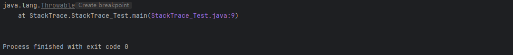

在理想状态下，用户输入数据的格式永远都是正确的， 选择打开的文件也一定存在，并且永远不会出现 bug。迄今为止，本书呈现给大家的代码似乎都处在这样一个理想境界中。然而，在现实世界中却充满了不良的数据和带有问题的代码，现在讨论java中处理这些问题的机制。

​	在程序发生错误的时候，至少做到以下几点：

- ​	向用户通告错误；
- ​	保存所有工作结果；
- ​	允许用户以妥善的形式退出程序；

对于异常情况，例如，可能造成程序崩溃的错误输入，java使用一种称为异常处理（exception handing)的错误捕获机制处理。

在测试期间，需要大量的检测以验证程序操作的正确性。在测试完成后也不必保留它们。本章第2部分会介绍如何使用断言来有选择地启动检测。

当程序出现错误时，并不总是能够与用户或终端进行沟通。此时，可能希望记录下出现的问题，以备日后进行分析。本质的第3部分将讨论标准java日志框架。


## 7.1 处理错误

如果由于出现错误而使得某些操作没有完成，程序应该：

- 返回到一种安全状态，并能够让用户执行一些其他的命令；或者
- 允许用户保存所有操作的结果，并以妥善的方式终止程序。

​	要做到这些不是一件很容易的事情。其原因是检测错误条件的代码通常里那些能够让数据恢复安全状态，或者能够保存用户的操作结果，并正常地退出程序的代码很远。**异常处理的任何就是将控制权从错误产生的地方转移给能够处理这种情况的错误处理器。**为了能够在程序中处理异常情况，必须知道程序中会出现那几张错误和问题，如下：

1. **用户输入错误**

​	除了那些不可避免的键盘输入错误外，有些用户喜欢不遵守程序的要求。例如，假设有一个用户请求连接URL，而语法却不正确。在程序代码中应该对此进行检查，如果没有检查，网络层就会给出警告。

2. **设备错误**

   硬件并不总是让它做什么，它就做什么。例如，打印机可能被关掉了。网页可能临时性地不能浏览。在一个任务的处理过程中，硬件经常出现问题，

3. **物理限制**

​	磁盘满了，可用存储空间已被用完。

4. **代码错误**

​	程序方法有可能无法正确执行。例如，方法可能返回了一个错误的答案，或者错误地调用了其他方法。

​	**对于方法中的一个错误，传统的做法是返回一个特殊的错误码，由调用方法分析。例如，对于一个从文件中读取信息的方法来说，返回值通常不是标准字符，而是一个-1，表示文件结束。错误状态下常用返回值是null引用。**但并不是任何情况下都能返回一个错误码。一个返回整型的方法就不能简单地通过返回-1表示错误，因为-1很可能是一个完全合法的结果。

​	**如果某个方法不能够采用正常的途径完整它的任何，就可以通过另外一个路径退出方法。在这种情况下，方法并不会返回任何值，而是抛出（throw）一个封装了错误信息的对象**。需要注意的是，这个方法将会立刻退出，并不返回任何值。此外，调用这个方法的代码也将无法继续执行，取而代之的是，异常处理机制开始搜索能够处理这种异常情况的异常处理器（exception handler)。

​	异常具有自己的语法和特定的继承结构。下面介绍一下语法。


#### 7.1.1 异常分类

​	**在 Java 程序设计语言中， 异常对象都是派生于 Throwable 类的一个实例**。 稍后还可以看到， 如果 Java 中内置的异常类不能够满足需求，用户可以创建自己的异常类。

图 7-1 是 Java 异常层次结构的一个简化示意图。


**所有的异常都是由Throwable继承而来**，下一次分解为两个分支：Error和Exception

​	Error类层次结构描述了java运行时系统的内部错误和资源耗尽错误。应用程序不应该抛出这种类型的对象。如果出现了这样的内部错误，除了通告给用户，并尽全力使程序安全地终止之外，再也无能为力了。

​	**在设计java程序时，==需要额外关注Exception层次结构==。这个层次结构又分解为两个分支：RuntimeException和其他异常**。**由程序错误导致的异常属于RuntimerException；而程序本身没有问题，但由于像I/O错误这类问题导致的异常属于其他异常**。

​	派生于RuntimeException的异常包括下面几种情况：

- 错误的类型转换。
- 数组访问越界。
- 访问null指针。

​	不是派生于RuntimeException的异常包括：

- **试图在文件尾部后面读取数据**
- **试图打开一个不存在的文件。**
- **试图根据给定的字符串查找Class对象，而这个字符串表示的类并不存在。**

​	**"如果出现RuntimeException异常，那么就一定是你的问题"是一条相当有道理的规则。应该通过检测数组下标是否越界来避免ArrayIndexOutOfBoundsException异常；应该通过在使用变量之前检测是否为null来杜绝NullPointerException异常发生。**

​	==**java语言规范将派生于Error类或RuntimeException类的所有异常称为非受查（unchecked）异常，所有其他异常称为受查（checked）异。编译器将核查是否为所有的受查异常提供了异常处理器。**==

​	简单来说，非受检查异常是程序逻辑出了问题，如上面所说，数组越界，访问null指针。而受查异常则代表外部环境出了问题，也就是用户使用时，错误的使用了该程序。

​	对于受查异常，它们是程序完全无法控制的（比如网络断了、文件没了），而设计者的逻辑是：既然这些事可能发送，就必须在写代码时准备好备选方案（try-catch）。


#### 7.1.2 声明受查异常

​	一个方法，不仅需要告诉编译器将要返回什么值，**还要告诉编译器有可能发生什么错误**。例如，一段读取文件的代码知道有可能读取的文件不存在，或者内容为空，因此，试图处理文件信息的代码就需要通知编译器可能会抛出IOException类的异常。

​	方法应该在其首部声明所有可能抛出的异常。例如，下面是标准类库中提供的FileInputStream类的一个构造器声明：

```java
public FileInputStream(String name) throws FileNotFoundException
```

​	这个声明表示构造器将根据给定的String参数产生一个FileInputStream对象，但也可能抛出一个FileNotFoundException异常。如果发生了这种糟糕情况， 构造器将不会初始化一个新的FileInputStream对象， 而是抛出一个 FileNotFoundException 类对象。 如果这个方法真的抛出了这样一个异常对象， 运行时系统就会开始搜索异常处理器， 以便知道如何处理FileNotFoundException 对象„

​	遇到下面4种情况时应该抛出异常：

1. 调用一个抛出受查异常的方法，例如，FileInputStream构造器
2. 程序运行过程中发现错误，并且利用throw语句抛出一个受查异常。
3. 程序出现错误，例如，a[-1] =  0 会抛出一个ArrayIndexOutOfBoundsException这样的非受查异常。
4. Java虚拟机和运行时库出现的内部错误。

出现前两种情况之一，则必须告诉调用这个方法的程序员有可能抛出异常，因为任何一个抛出异常的方法都可能导致程序停止运行。


对于那些可能被他人使用的java方法，应该根据**异常规范**在方法的首部声明这个方法可能抛出的异常

```java
class MyAnimation
{
    ...
    public Image loadImage(String s) throws IOException
    {
        ...
    }
}
```

**如果一个方法有可能抛出多个受查异常类型，那么就必须在方法的首部列出所有的异常类。每个异常类之间用逗号隔开**。

```java
class MyAnimation
{
    ...
    public Image loadImage(String s) throws FileNotFoundException,EOFException
    {
        ...
    }
}
```


​	但是，==不需要声明java的内部错误，即从Error继承的错误==。任何程序代码都具有抛出那些异常的潜能，而我们对其没有任何控制能力。同样，也不应该声明从RuntimeException继承的那些非受查异常。

```java
class MyAnimation
{
    ...
    void drawImage(int i) throws ArrayIndexOutOfBoundsException //bad style
    {
        ...
    }
}
```

这种运行时错误完全在我们的控制之下。如果特别关注数组下标引发的错误，就应该将更多的时间话费在修正程序中的错误上。

总之，一个方法必须声明所有可能抛出的受查异常，而非受查异常要么不可控制（Error），要么就应该避免发生。如果方法没有声明所有可能发生的受查异常，编译器就会发出一个错误消息。

除了声明异常之外，还可以捕获异常，这样会使异常不被抛到方法之外，也不需要throws规范。


**警告**：如果在子类中覆盖了超类的一个方法，子类方法中声明的受查异常不能比超类方法中声明的异常更通用（也就是说，子类方法中可以抛出更特定的异常，或者根本不抛出任何异常）。特别需要说明的是，如果超类方法没有抛出任何受查异常，子类也不能抛出任何受查异常。


#### 7.1.3 如何抛出异常

假设在程序代码中发生了一些错误。一个名为readData的方法正在读取一个首部具有下列信息的文件：

```java
Content-length: 1024
```

然而，读到733个字符之后文件就结束了。出现了不正常的情况，此时就要抛出异常。上述异常可以归结为IOException，在仔细的阅读了Java API文档之后会发现：EOFException异常的描述是"在输入过程中，遇到了一个未逾期的EOF后的信号”。下面是抛出这个异常的语句：

```java
throw new EOFException();
```

或者这样抛出异常：
```
EOFException e = new EOFException();
throw e;
```


下面将这些代码放在一起。

```java
String readData(Scanner in) throws EOFException  //声明可能出现的异常
{
    while(...)
    {
        if(!in.hasNext()); //遇到EOF时处理
        {
            if(n<len)
                throw new EOFException();
        }
		...        
    }
    return s;
}
```

对于一个已经存在的异常类，将其抛出非常容易。在这种情况下：

1. 找到一个合适的异常类
2. 创建这个类的一个对象
3. 将对象抛出

一旦方法抛出了异常，这个方法就不可能返回到调用者。


#### 7.1.4 创建异常类

​	标准异常类可能无法充分地满足需求。此时就应该创建一个自己的异常类。**这个异常类可以是继承于Exception，或者是继承于Exception子类的类。**

**习惯上，定义异常类应该包含两个构造器，一个默认的构造器**；另一个是带有详细描述信息的构造器（超类Throwable的toString方法将会打印这些详细信息）。

```java
class FileFormatException extends IOException
{
    public FileFormatException(){}
    public FileFormatException(String gripe)
    {
        super(gripe);
    }
}
```

现在，就可以抛出自己定义的异常类了。

```java
String readData(BufferedReader in) throws FileFormatException
{
    ...
    while(...)
    {
        if(ch==-1)
        {
            if(n<len)
                throw new FileFormatException();
        }
    }
    return s;
}
```

##### `API java.lang.Throwable 1.0`

**Throwable()**

构造一个新的Throwable对象，这个对象没有详细的描述信息。

**Throwable(String message)**

构造一个新的throwable对象，这个对象带有特定的详细描述信息。习惯上，所有派生的异常类都支持一个默认的构造器和一个带有详细描述信息的构造器。

**String getMessage()**

获得Throwable对象的详细描述信息


## 7.2 捕获异常

现在已经知道如何抛出一个异常。只要将其抛出就不用理睬。但有些代码必须捕获异常


#### 7.2.1捕获异常 

​	如果某个异常发生的时候没有在任何地方进行捕获，那么程序就会停止执行，并在控制台上打印异常信息，其中包括异常的类型和堆栈的内容。对于图形界面程序，在捕获异常之后，也会打印出堆栈的信息。

​	想要捕获一个异常，必须使用try/catch语句块。最简单的try语句块如下所示：

```java
try{
    code
    more code;
}catch(ExceptionType e){
    handler for this type
}
```

如果在try语句块中的代码抛出了在catch子句的说明的异常类，那么：

1. 程序将跳过try语句块的其余代码。
2. 程序将执行catch子句中的处理器代码。

如果在try语句块中的代码没有抛出任何异常，那么程序将跳过catch子句。

如果方法中的任何代码抛出了一个在catch子句中没有声明的异常类型，那么这个方法就会立刻退出。

为了演示捕获异常的处理过程，下面给出一个读取数据的典型程序代码：

```java
public void read(String filename)
{
    try{
        InputStream in =new FileInputStream(filename); //打开文件
        int b;
        while((b = in.read()) !=-1)
        {
            process input
        }
    }catch(IOException exception)
    {
        exception.printStackTrace();
    }
}
```

​	try语句的代码表示：读取并处理字节，直到遇见文件结束符为止。read方法有可能抛出一个IOException异常。在这种情况下，将跳出整个while循环，进入catch子句，并生成一个栈轨迹。

​	通常，最好的选择是将异常传递给调用者。如果read方法出现了错误，就让read方法的调用者去操心。这样就必须声明这个方法可能会抛出一个IOException。

```java
public void read(String filename) throws IOException
{
    
        InputStream in =new FileInputStream(filename); //打开文件
        int b;
        while((b = in.read()) !=-1)
        {
            process input
        }
    
}
```

​	如果调用了一个抛出受查异常的方法，就必须对它进行处理，或者传递。通常，应该捕获那些知道如何处理的异常，而将那些不知道怎样处理的异常继续进行传递。

​	如果想传递一个异常，就必须在方法的首部添加一个throws说明符，以告知调用者这个方法可能会抛出异常。


#### 7.2.2 捕获多个异常

​	**在一个try语句块中可以捕获多个异常类型，并对不同类型的异常做出不同的处理**。可以按照下列方式为每个异常类型使用一个单独的catch子句：

```java
try
{
    code that might throw exceptions;
}catch(FileNotFoundException e){
    emergency action for missing files;
}catch(UnKnownHostException e){
    emergency action for unknown hosts;
}catch(IOException e)
{
   emergency action for all ohter I/O problems
}
```

异常对象可能包含于异常本身有关的信息，想要获得对象的更多信息，可以试着用：

```java
e.getMessage()
```

在javaSE 7中，**同一个catch子句中可以捕获多个异常类型**。例如，假设对应缺少文件和未知主机异常的动作是一样的，就可以合并catch子句：

```java
try{
    code that might throw exceptions
}catch(FileNotFoundException | UnKnownHostException e)
{
    emergency action for missing file and unknown hosts
}catch(IOException e)
{
    emergency action for all other I/O problems
}
```

只有当捕获的异常类型彼此之间不存在子类关系时才需要这个特性。

**捕获多个异常时，异常变量隐含为final变量**。


#### 7.2.3 再次抛出异常与异常链

在catch子句中可以抛出一个异常，这样做的目的是改变异常的类型，下面给出了捕获异常并将他再次抛出的基本方法：

`````java
try
{
	access the database
}catch(SQLException e)
{
    throw new ServletException("database error: "+e.getMessage());
}
`````


#### 7.2.4 finally子句

​	当代码抛出一个异常时，就会终止方法中剩余代码的处理，并退出这个方法的执行。如果方法获得了一些本地资源，并且只有这个方法自己知道，由如果这些资源在退出方法之前必须被回收，那么就会产生资源回收问题。

​	java有一种很好的解决方案，就是finally子句。**不管是否有异常被捕获，finally子句中的代码都被执行**。

​	下面这个程序在有情况下关闭文件

```java
InputStream in = new FileInputStream(...);
try{
    code that might throw exceptions
}catch(IOException e){
    show error message
}finally{
    in.close();
}
```

不管catch有没有捕获异常，最终finally子句都会被执行，以关闭获取的资源。

**try语句可以只有finally子句，而没有catch子句**：

`````
InputStream in  = ...;
try{
	code that might throw exceptions
}finally{
	in.close();
}
`````


事实上，在需要关闭资源时，用这种方式使用finally子句是一种不错的选择。下面的提示将给出具体接受。

提示：==*这里，强烈建议解耦合try/catch和tryfinally语句块。这样可以提高代码的清晰度*==。例如：

```java
InputStream in = ...;
try{
    try{
        code that might throw exceptions
    }finally{
        in.close();
    }
}catch(IOException e){
    show error message
}
```

内层的try语句块只有一个职责，那就是确保关闭输入流。外层的try语句块也只有一个职责，就是确保报告出现的错误。这种设计方法不仅清楚，而且还具有一个功能，就是将会报告finally子句中出现的错误。


有时，finally子句也会带来麻烦。例如，清理资源的方法也有可能抛出异常。假设希望能够确保在流处理代码中遇到异常时将流关闭。

```java
InputStream in =...;
try{
    code that might throw exceptions //可能引发异常的代码
}finally{
    in.close();
}
```

​	现在，假设在try语句块中的代码抛出了一些非IOException的异常，这个异常只有方法的调用者才能处理。执行finally语句块，并调用close方法。而close方法也有可能抛出IOException异常。当出现这种情况时，原始的异常将会丢失，转换抛出close方法的异常。

​	如果想适当的处理，重新抛出原来的异常，代码会变得极其繁琐。

```java
InputStream in =...;
Exception ex = null; //提前声明一个异常变量
try
{
    try{
        code that might throw exceptions
    }catch(Exception e){
        ex = e; //ex引用捕获的异常 
        throw e; //抛出被捕获的异常，程序结束
    }
}finally{
    try{
        in.close(); //可能出现异常
    }catch(Exception e){ //当异常出现时，捕获并抛出它
        if(ex == null ) // 只有ex异常为空时，才证明上面的try语句块没有异常，
            //现在抛出，close可能会出现的异常
            throw e
    }
}
```

幸运的是，下一节将了解到在Java SE 7中关闭资源的处理会容易得多。


#### 7.2.5 带资源的try语句

对于以下代码模式：

```java
open a resource;  //打开一个资源
try{
    work with the resource
}finally{
    close the resource
}
```

==假设资源属于一个实现了AutoCloseable接口的类==，Java SE 7为这种代码模式提供了一个很有用的快捷方式。AutoCloseable接口有一个方法：

```java
void close throws Exception
```

注释：还有一个Closeable接口，是AutoCloseable的子接口，也包含一个close方法。这个方法声明为抛出一个IOException


**带资源的try语句的最简形式为：**

```java
try(Resource res=...)
{
    work with res
}
```

==**try块退出时，会自动调用res.close()**==。下面给出一个典型的例子，这里要读取一个文件中的所有单词：

```java
try(Scanner in =new Scanner(new FileInputStream("/usr/share/dict/words")),"UTF-8"){
	while(in.hasNext()){
        System.out.println(in.next());
    }
}
```

==**这个块正常退出时，或者存在一个异常时，都会调用in.close()方法。就好像使用了finally块一样**==。

还可以指定多个资源。例如：

```java
try(Scanner in = new Scanner(new FileInputStream("/usr/share/dict/words")),"UTF-8");
	PrintfWriter out =new PrintWriter("out.txt"))
    {
        while(in.hasNext())
            out.println(in.next.toUpperCase());
    }
```

无论这个块是正常退出，还是因为异常退出，in和out都会关闭。

注释：带资源的try 语句自身也可以有 catch子句和一个finally 子句。这些子句会在关闭资源之后执行。不过在实际中。一个 try 语句中加入这么多内容可能不是一个好主意。 


#### 7.2.6 捕获输入异常

​	很多时候用户并不会按照预期去输入，比如需要一个整型，用户却输入了字符串或其他类型，此时就需要对可能出现异常的代码做出处理,去捕获异常InputMismatchException

```java
    public static int IntException(){
        Scanner in = new Scanner(System.in);
        int Int_Test;
        while(true){
            try {
                 Int_Test = in.nextInt(); //可能会出现异常的代码
                break;
            }catch (InputMismatchException e){
                System.out.println("出现错误输入，请重新输入");
                Int_Test=-1;
                in.nextLine(); //清空输入缓冲区。
                continue; //跳过这次循环，继续下一次循环
            }
        }
        return Int_Test;
    }
```

当用户错误输入时，就会捕获该异常，并执行catch语句块的代码。为了避免留在缓冲区的字符影响后续输入，我们使用in.nextline()读取并丢弃，然后继续下一次循环，直到输入正确的数值。


#### 7.2.7 分析栈轨迹元素

​	栈轨迹（stack trace）是程序执行过程中某个特定点上所有挂起的方法调用的一个列表。==当Java程序因为一个未捕获的异常而终止时，就会显示栈轨迹==。

可以调用Throwable类的printStackTrace方法访问栈轨迹的文本描述信息。

```java
var t =new Throwable();
var out= new StringWriter(); //用于接受访问栈轨迹的文本描述信息
t.printStackTrace(new PrintWriter(out));//
String description = out.toString();
```

输出信息如下：




## 7.3 使用异常的技巧

1. **异常处理不能代替简单的测试**

​	下面是一个检查栈是否为空的测试，不为空这执行弹出操作

```java
if(!s.empty())
    s.pop();
```

​	第二种做法，使用try catch捕获可能出现的异常

```java
try{
    s.pop();
}catch(EmptyStackException e){
}
```

IsEmpty的版本运行时间是646毫秒，而使用try catch语句却花费了21739毫秒。(1秒=1000毫秒)


**2. 不要过分的细化异常 **

很多程序员把每一条语句都分装在一个单独的try语句块中

```java
PrintSteam out;
Stack s;
for(int i=0;i<100;i++){
    try{
        n=s.pop();
    }catch(EmptyStackException e)
    {
        //stack was empty
    }
    
    try{
        out.writeInt(n);
    }catch(IOException e){
        //problem writing to file
    }  
}
```

这种编程方式将导致代码量的急剧膨胀。合理的做法是将整个任务包在一个try语句块中。

```java
    try{
        for(int i=0;i<100;i++){
             n=s.pop();
       		 out.writeInt(n);
        }
    }catch(EmptyStackException e)
    {
        //stack was empty
    }catch(IOException e){
        //problem writing to file
    }
    
```


## 7.4 使用断言

在一个具有自我保护能力的程序中，断言很常用。


#### 7.4.1 断言的概念

假设你却行满足某个特定属性，并且代码依赖于这个属性。例如，可能需要计算

```java
double y = Math.sqrt(x);
```

你确信这里的x是一个非负数。原因可能是：x是另外一个计算的结果，而这个计算机的结果不可能为负；或者x是一个方法的参数，这个方法要求它的调用者只能提供一个正数输入。不过，你可能还是想再做一次检查，不希望计算中潜入让人困惑的"不是一个数"浮点值。当然，也可以抛出一个异常

```java
if(x<0)
    throw new IllegelArgumentException("x<0");
```

**即使测试完后，这个测试代码还一直保留在程序中。如果程序中含有大量这种检查，程序运行起来会比应有的速度慢一些**。

==**断言（assertion）机制允许你在测试期间在代码插入一些检查，而在生产代码中自动删除这些检查**==。java有一个关键字assert。这个关键字有两种形式：

```java
assert condition;
and
assert condition:expression;
```

 	**两个语句都会计算条件(condition)，如果结果为false，则抛出一个AssertionError异常**。第二个语句中，表达式（expression）将传入AssertionError构造器，并转换成一个消息字符串。

要想断言x是一个非负数，只需要使用下面这条语句：

```java
assert x>=0;
```

或者将x的具体指传递给AssertionError对象：

```java
assert x>=0 : x;
```

当条件为false时，x的值会传递给`AssertionError`对象。


#### 7.4.2 启用和禁用断言

在默认情况下，断言是禁用的。可以在运行程序时用-enableassertions或-ea选项启用断言：

```java
java -enableassertion MyApp
```

​	这里的myApp为类名，**不必重新编译程序来启用或者禁用断言。启用或禁用是类加载器（class loader)的功能，禁用断言时，类加载器会去除断言代码**。因此，不会降低程序运行的速度。

甚至可以在特定的类或整个包中启用断言，例如：

```java
java -ea:MyClass -ea:com.mycompany.mylib MyApp
```

在idea中，可以通过设置VM option选项启用断言，选择Eidt Configurations，在VM option中输入-ea或-enableassertion


#### 7.4.3 使用断言完成参数检查

在Java语言中，提供了3种处理系统错误的机制：

- 抛出一个异常。
- 记录日志。
- 使用断言。

什么时候使用断言，记住下面几点：

- 断言失败是致命的、不可恢复的错误。
- 断言检查只在开发和测试阶段打开。

​	因此，不应该使用断言向程序的其他部分通知发生了可恢复性的错误，或者，不应该利用断言与程序用户沟通问题。==断言只应该用于在测试阶段确定程序内部错误的位置==。

​	

下面看一个常见的场景：检查方法的参数。是否应该使用断言来检查非法的索引值或null引用。首先来看这个方法的文档。

```java
static void sort(int[] a, int fromIndex,int toIndex)
```

​	文档指出，如果索引值不正确，这个方法会抛出一个异常。所以这里使用断言不太合适，是否断言a不是null呢。这也不太合适，这个方法的文档没有指出a是null时应该采取什么行为。

​	不过，假设对这个方法的约定做一点微小的改动：

```java
@param a the array to be sorted(must not be null)
```

现在，这个方法的调用者就必须注意：对null数组调用这个方法是不合法的。这样一来就可以在这个方法的开头使用断言：

```java
assert a != null;
```

​	计算机科学家将这种约定称为**前置条件（Precondition）**。原先的方法对参数设置没有前置条件，它承诺在任何情况下都有明确的行为。修改后的方法有一个前置条件，即a非null。如果调用者没有满足这个前置条件，断言就会失败。

​	事实上，由于有这个断言，当方法被非法调用时，它的行为是难以预料的。有时会抛出一个断言错误，有时会产生一个null指针异常，这完全取决于它的类加载器如何配置。


#### 7.4.4 使用断言提供假设文档。

很短程序员使用注释来提供底层假设：

```java
if(i%3==0)
    ...;
else if(i%3==1)
    ...;
else //(i%3==2)
    ...
```

在这种情况下，使用断言会更合适

```java
if(i%3==0)
    ...;
else if(i%3==1)
    ...;
else 
{
    assert i%3==2;
}
```

如果假设i是非负值。最好在if语句之前使用以下断言：

```java
assert i>=0;
```

##### `API java.lang.ClassLoader` 

**void setDefaultAssertionSatus(boolean b)**

为通过这个类加载器加载的所有类（没有显示的类或包断言状态）启用或禁用断言。

**void setClassAssertionStatus(String className,boolean b)**

为给定的类和它的内部类启用或禁用断言。

**void setPackageAssertionStatus(String PackageName,boolean b)**

为给定包及其子包中的所有类启用或禁用断言。

**void clearAssertionStatus()**

删除所有显示的类和包断言状态设置，并禁止断言。


## 7.5 日志（JUL)

​	每个Java程序员都很熟悉在有问题的代码中插入一些System.out.println方法调用来帮助观察程序的行为。当然，一旦发现问题的根源，就要将这些print语句从代码中删去。如果接下来由出现了问题，只好再出入几个print语句。日志API就是为了解决这个问题而设计的。日志有下面几个主要优点：

- 可以很容易的抑制全部日志记录，或者只抑制某个级别以下的日志，而且再次打开这些日志也很容易。
- 被抑制的日志开销低廉，因此，将这些日志代码留在应用中只有很小的开销。
- 日志记录可以定向到不同的处理器，如控制台显示，写至文件等等。
- 日志记录器和处理器都可以对记录进行过滤。过滤器可以根据实现过滤器的程序员提供的标准丢弃那些无用的日志记录。
- 日志记录可以采用不同的方法格式化，例如，纯文本或XML。
- 应用程序可以使用多个日志记录器，它们使用与包名类似的有层次的名字，例如com.mycompany.myapp。
- 日志系统的配置由配置文件控制。

```html
注释:很多应用会使用其他日志框架，如Log4J 2(https://logging.apache.org/log4j/2.x/index.html)和Logback()，它们能提供比标准Java日志框架更高的性能。这些框架的API稍有区别。在本书中，我们至介绍标准Java日志框架，即JUL：java.lang.logging;
```


#### 7.5.1 基本日志

对于简单的日志记录，可以使用**全局日志记录器（global logger）并调用其into方法**：

```java
Logger.getGlobal.info("File->Open menu item selected");
```

在默认情况下，会打印如下记录：

```java
7月 21, 2025 2:50:50 下午 Logger1.Logger_Test main
信息: File->Open menu item selected
```

但是，如果在适当的地方调用，如main的最前面：

```java
public static void main(String[] args) {
     Logger.getGlobal().setLevel(Level.OFF);
     Logger.getGlobal().info("File->Open menu item selected");
  }
```

将会抑制所有日志。


#### 7.5.2 高级日志

在一个专业的应用程序中，你肯定不想将所有的日志都记录到一个全局日志记录器中。你 可以定义自己的日志记录器。

可以调用getLogger方法创建或获取一个日志记录器：

```java
private static final Logger myLogger = logger.getLogger("com.mycompany.myapp");
```

```java
提示：未被任何变量引用的日志记录器可能会被垃圾回收。为防止这种情况发生，要用静态变量存储日志记录器的一个引用。
```

日志记录器名也有层次。日志记录器的层次性更强。通常，有以下7个日志级别

- **SEVER（服务）**
- **WARNING（警告）**
- **INFO（信息）**
- **CONFIG（配置）**
- **FINE（）**
- **FINER（）**
- **FINEST（）**

在默认情况下，实际上只记录前3个级别，也可以设置一个不同的级别，例如：

```java
logger.setLevel(Level.FINE);
```

现在，会记录FINE以及所有更高级别的日志。

另外，还可以使用Level.ALL开启所有级别的日志记录。或者使用Level.OFF关闭所有日志。

所有级别都有日志记录方法，如：

```java
logger.warning(message);
logger.fine(message);
```

或者，还可以使用log方法并指定级别，例如：

```java
logger.log(Level.FINE,message);
```

