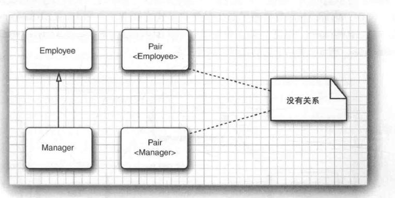

		泛型类和泛型方法有类型参数，这使得它们可以准确地描述用于特定类型实例化时会发生什么。而在有泛型类之前，程序员必须使用Object编写适用于多种类型的代码。很繁琐也很不安全。

​	泛型允许设计者详细地描述变量和方法的类型要如何变化。对于简单的情况，实现泛型代码很任意，但对于更复杂和高级的情况下，对于实现者来说会相当复杂。

​	

## 8.1 为什么要使用泛型程序设计

​	==**泛型程序设计（*generic programming*）意味着编写的代码可以对多种不同类型的对象重用**==。例如，可以使用ArrayList类收集任何类的对象。这就是泛型程序设计的一个例子

​	实际上，在Java有泛型类之前已经有一个ArrayList类。下面来研究泛型程序设计的机制是如何演变的。


#### 8.1.1 类型参数的好处

在Java中增加泛型类之前，泛型程序设计是用继承（inheritance）实现的。ArrayList类只维护一个Object[]引用的数组，因为Object是所有类的父类，而父类变量可以引用子类：

```java
public class ArrayList  //before generic classes
{
    private Object[] elementData;
    
    public Object get(int i){...}
    public void add(Object o){...}
}
```

这种方法存在两个问题。获取一个值时必须进行类型转换：

```java
ArrayList files = new ArrayList();
String filename = (String)files.get(0);
```

此外，可以向数组列表中添加任何类的值，没有对可能发生的错误进行检查：

```java
files.add(new File("...."));
```


所以，泛型提供了一个更好的解决方案：==类型参数（type parameter）==。ArrayList类现在有一个类型参数来指示元素的类型：

```java
var files = new ArrayList<String>();
```

可以很明确的看出这个数组列表包含的是String对象。

此时，调用get的时候就不再需要强制类型转换。编译器知道返回值类型为String，而不是Object：

```java
String filename = files.get(0);
```

同样的，编译器也会知道add方法的一个类型为String的参数。现在，编译器会检查，防止你插入错误类型的对象。

```java
files.add(new File("...")); //ERROR;
```

```java
注释：如果用一个明确的类型而不是var声明一个变量，则可以通过使用"菱形"语法省略构造器中的类型参数：
    ArrayList<String> files = new ArrayList<>();
省略的类型从变量的类型推断得出。
    Java9扩展了菱形语法的使用范围，原先不接受这种语法的地方现在可以使用了。例如，现在可以对匿名子类使用菱形语法：
    ArrayList<String> password = new ArrayList<>(){ //该语法创建了一个ArrayList的匿名子类，并重写了get方法,然后赋值给了password
    	//password是ArrrayList的匿名子类实例
    	public String get(int n) {return super.get(n).replaceAll(".","*");}
	}
```


## 8.2 定义泛型类

​	**泛型类（generic class）就是有一个或多个类型变量的类**。下面是泛型Pair类的代码：

```java
package Generic;

//泛型类
public class Pair<T>
{
    private T first;
    private T second;

    public Pair(){};
    public Pair(T first, T second) {
        this.first = first;
        this.second = second;
    }

    public T getFirst() {
        return first;
    }

    public void setFirst(T first) {
        this.first = first;
    }

    public T getSecond() {
        return second;
    }
    
    public void setSecond(T second) {
        this.second = second;
    }
}
```

​	Pair类引入了一个类型变量T，用尖括号（<>）括起来，放在类名的后面。==泛型类可以有多个类型变量==。可以定义Pair类，其中第一个字段和第二个字段使用不同的类型：

```java
public class Pair<T,U>{...}
```

**类型变量在整个类中定义用于指定方法的返回类型以及字段和局部变量的类型**。

```java
Private T first;
```

用具体的类型替换类型变量来实例化泛型类：

```java
Pair<String>
```

之后可以把结果想象成一个普通类，它有以下构造器：

```java
Pair<String>();
Pair<String>(String,String);
```

以及以下方法

```java
String getFirst()
void setFirst(String first)
String getSecond()
String void setSecond(String second)
```


下面的程序具体使用了Pair类。静态方法minmax会便利数组并同时计算出最大值和最小值。它用一个Pair对象同时返回两个结果。

```java
package Generic;

//泛型类
 class Pair<T>
{
    private T first;
    private T second;

    public Pair(){};
    public Pair(T first, T second) {
        this.first = first;
        this.second = second;
    }

    public T getFirst() {
        return first;
    }

    public void setFirst(T first) {
        this.first = first;
    }

    public T getSecond() {
        return second;
    }

    public void setSecond(T second) {
        this.second = second;
    }
}

public class PairTest1{
    public static void main(String args[]){
        String[] words = {"Marry","had","a","little","lamb"};
        Pair<String> mm = ArrayAlg.minmax(words);
        System.out.println("min="+mm.getFirst());
        System.out.println("max="+mm.getSecond());
    }
}

class ArrayAlg{
    /**
     *
     *
     * @param a 遍历该数组，获取最大的字符串和最小的字符串
     * @return a 通过pair类返回两个值
     */
     public static Pair<String> minmax(String[] a){
        //当这个a串为空时返回null
         if(a==null || a.length==0){
            return null;
         }
         String min =a[0];
         String max =a[0];
        //循环比较大小,从第2个开始比
         for(int i=1;i<a.length;i++){
            if(min.compareTo(a[i]) >0) //串1大于串2返回正数
                min=a[i];//把较小数赋给min
            if(max.compareTo(a[i])<0) //串1小于串2返回负数
                max=a[i]; //把较大数赋给max
         }
        return new Pair<String>(min,max); //返回一个Pair类
     }
}
```

​	这里的comparTo方法，是String类实现了comparable接口获得的能力，在Java标准中String默认实现了该接口。还有许多类都实现了该接口。如基本类型对应的包装类。


## 8.3 泛型方法

上一节介绍了如何定义一个泛型类。**还可以定义一个带有参数类型的方法**

```java
class ArrayAlg{
    public static <T> T getMiddle(T...a)
    {
        return a[a.length/2]; //返回该数组的中间值
    }
}
```

​	注意 `<T>` 表示这个方法是一个泛型方法，它可以使用T来代表特定的类型，却不建议在泛型类中使用。如果泛型类也是`<T>`, 则会出现泛型遮蔽，方法的T会覆盖掉泛型类的T。	

​	**泛型方法可以在泛型类中定义，也可以在普通类中定义。注意，==类型变量是放在修饰符的后面，并且在返回类型前面==。这里的\<T>是参数类型。而后面那个T为返回值类型。**

​	**当调用一个泛型方法时，可以把具体类型包围在尖括号中，放在方法名前面**：

```java
String  middle = ArrayAlg.<String>getMiddle("John","Q","Public");
```

​	大多数情况下，方法调用中可以省略\<String>类型参数。编译器有足够的信息推断出具体参数。可以简单的调用：

```java
String middle = ArrayAlg.getMiddle("John","Q","Public");
```

但是如果参数里的类型不一，编译器会提出错误：

```java
ArrayAlg.<String>getMiddle(3.14,1729,0);
```

​	


## 8.4 类型变量的限定

有时，类或方法对类型变量加以约束。下面是一个典型的例子。我们要计算数组中最小的元素：

```java
class ArraAlg{
    public static <T> T min(T[] a)
    {
        if(a==null || a.length==0)
            return null;
        
        T smallest = a[0];
        for(int i=1;i<a.length;i++)
        {
            if(smallest.compareTo(a[i])>0)
                smallest = a[i];
        }
    }
}
```

​	smallest的类型是T，意外着它可以是任何一个类的对象。请注意，这个方法的核心是调用comparTo方法，我们不知道这个类是否有这么一个compareTo方法。但是，可以明确的是，如果该类实现了Comparable接口，那么它就一定有compareTo方法。

​	所以，解决这个问题的办法是通过限制T只能是实现了Comparable接口的一类。可以通过对类型变量T设置一个限定（bound）来实现这一点：

```java
 public static <T extends Comparable> T min(T[] a)...
```

现在，泛型方法min只能在实现了Comparable接口的类的数组上调用。如果该类数组没有实现该接口，将会得到一个编译错误。


为什么使用关键字extends而不是implements? 毕竟，Comparable是一个接口。下面的记法

```java
<T extends BoundingType>
```

​	**==表示T应该是限定类型（*bounding type*）的子类型（*subtype*）==。T和限定类型可以是类，也可以是接口**。选择关键字extends的原因是它更接近子类型的概念。并且Java的设计中也不打算在语言中添加一个新的关键字。

​	按照Java继承机制，可以根据需要拥有多个接口超类型，**但是最多有一个限定可以是类。如果有一个类作为限定，它必须是限定列表中的第一个限定。**

​	一个类型变量或通配符可以有多个限定，例如

```java
// 类型T限定为实现了Comparable ,
T extends Comparable & Serializable
```

​	限定类型用 `&`分隔，而多个类型变量用逗号分隔，如T,V。表示该类需传入两个类型。

在下面的程序中，我们把minmax重写为一个泛型方法。这个方法可以计算泛型数组的最大值和最小值，并返回一个Pair<T>

```java
    //<T>表示这个方法是泛型方法，返回值是T泛型，参数为多个参数T，且限定为实现了接口的类
        public static <T extends Comparable> Pair<T> minmax(T...a){
            //检查数组,当数组为空和数组长度为0时返回null
            if(a==null || a.length==0){
                return null;
            }
            T max =a[0];
            T min =a[0];
            //遍历该数组,从第2个开始
            for(int i=1;i<a.length;i++){
                if(min.compareTo(a[i]) >0)
                    min = a[i];
                if(max.compareTo(a[i])<0)
                    max=a[i];
            }
            return new Pair<T>(min,max);
        }
```


## 8.5 泛型代码和虚拟机

​	==虚拟机没有泛型类型对象——所有对象都属于普通类==。在泛型实现的早期版本中，甚至能够将使用泛型的程序编译为1.0虚拟机上运行的类文件。在下面的小节中你会看到编译器如何"擦除"类型参数，以及这个过程对Java程序员有什么影响。


#### 8.5.1 类型擦除

​	==无论何时定义一个泛型类型，都会自动提供一个相应的原始类型（raw type)==。**这个原始类型的名字就是去掉类型参数后的泛型类型名。类型变量会被擦除（erased），并替换为期限定类型（对于无限定的变量则替换为Object）**

​	例如，对于一个普通的泛型类Pair\<T>的原始类型如下：

```java
//泛型类
public class Pair
{
    private Object first;
    private Object second;

    public Pair(){};
    public Pair(Object first, Object second) {
        this.first = first;
        this.second = second;
    }

    public Object getFirst() {
        return first;
    }

    public void setFirst(Object first) {
        this.first = first;
    }

    public Object getSecond() {
        return second;
    }

    public void setSecond(Object second) {
        this.second = second;
    }
}
```

​	因为T是一个无限定的类型变量，所以直接替换为Object。其结果就是一个普通类。在程序中可以包含不同类型的Pair，例如，Pair\<String>或Pair\<LocalDate>。不过擦除类型后，它们都会变成原始的Pair类型。

​	==**原始类型用第一个限定来替换类型变量，或者，如果没有给定限定，就替换为Object**==。例如，类Pair\<T>中的类型变量没有显示的限定，因此，原始类型用Object替换T。下面用有限定的类型变量举例：

```java
public class Interval<T extends Comparable &Serializable> implements Serializable{
    private T lower;
    private T upper;
    
    public Interval(T first,Tsecond){
        if(first.compareTo(second)<=0){
            lower = first;
            upper=second;
        }else{
            lower=second;
            upper=first;
        }
         
    }
}
```

原始类型Interval如下所示：

```java
public class Interval implements Serializable{
	private Comparable lower;
    private Comparable upper;
    public Interval(Comparable first,Comparablesecond){...}
}
```


#### 8.5.2 转换泛型表达式

**编写一个泛型方法调用时，如果擦除了返回类型，编译器会插入强制类型转换**：

```java
Pair<Employee> buddies = ....;
Employee buddy = buddies.getFirst();
```

getFirst擦除类型后的返回类型是Object。编译器自动插入转换到Emloyee的强制类型转换。也就是说，编译器把这个方法调用转换为两条虚拟机指令：

- 调用原始方法Pair.getFirst。
- 将返回的Object类型强制转换为Employee类型。

访问一个泛型字段时也会插入强制类型转换。假设Pair类的first成员和second成员都是公共的：

```java
Employee buddy = buddies.first;
//相当于
Employee buddy = (Employee)buddies.first;
```


#### 8.5.3 转换泛型方法（桥方法）

类型擦除也会出现在泛型方法中： 

```java
public static <T extends Comparable> T min(T[] a);
```

擦除类型之后，只剩下一个方法：

```java
public static Comparable min(Comparable[] a);
```

类型参数已经被擦除，只留下了它的限定类型Comparable。


方法的擦除带来两个复杂问题。考虑下面这个示例：

```java
 class Pair<T>
{
    private T first;
    private T second;

    public Pair(){};
    public Pair(T first, T second) {
        this.first = first;
        this.second = second;
    }

    public T getFirst() {
        return first;
    }

    public void setFirst(T first) {
        this.first = first;
    }

    public T getSecond() {
        return second;
    }

    public void setSecond(T second) {
        this.second = second;
    }
}


class DateInterval extends Pair<LocalDate>{
   
    //重写setSecond方法
    //但并没真正的重写父类的方法，因为父类的方法是setSecond(Object)
    public void setSecond(LocalDate second){
        if(second.compareTo(getFirst()) >=0) //保证second小于First
            supper.setSecond(second);
    }
}
```

日期区间是一对LocalDate对象，通过覆盖这个方法来确保第二个值永远不小于第一个值。这个类擦除后变成

```java
class DateInterVal extends Pair{
    public void setSecond(LocalDate second){....}
}
```

但是，还有另一个从Pair继承的setSecond方法，即

```java
//泛型类Pair擦除为普通类后的set方法。
public void setSecond(Object second);
```

这显然是另一个方法，它有一个不同类型的参数——Object，而不是LocalDate。不过它不应该不一样。考虑下面的语句序列；

```java

DateInterval interval = new DateInterval(); //新建对象
Pair<LocalDate> pair = interval; //父类引用子类对象。
/*按照多态概念，应该调用DateInterval重写的方法，但
因为类型擦除后父类有一个setSecond(Obejct)的方法，子类继承
后并没有真正的重写该方法，所以编译器会自动生成一个桥方法去调用
重写之后的方法。
*/
pair.setSecond(aDate);
```

​	我们希望setSecond调用具有多态性。因为Pair引用了子类DateInterval对象，所以应该调用DateInterval.setSecond。**==问题在于类型擦除与多态发生了冲突==**。编译器不知道该调用该对象的哪个方法，为了解决这个问题，**编译器在DateInterval类中生成了一个桥方法（bridge method）**：

```java
public void setSecond(Object second){
    //将second强制转换后调用预期的方法
    setSecond((LocalDate) Second);
}
```

现在详细分析下面的语句：

```java
pair.setSecond(aDate);
```

​	pair已经声明为类型Pair\<LocalDate>，并且这个类型只有一个名为setSecond()的方法，即setSecond(Obejct) 。虚拟机在Pair引用的对象上调用这个方法。这个对象是DateInterval类型，因此将会调用DateInterval.setSecond(Object)方法。这个方法是合成的桥方法。它会调用DateInterval.setSecond(LocalDate)，这正是我们想要的

​	

​	假设DateInterval类覆盖了getSecond方法

```java
class DateInterval extends Pair<LocalDate>
{
    //编译器自动生成桥方法
    public LocalDate getSecond(){
        //返回父类的second值并转为LocalDate类
        return (LocalDate) super.getSecond();
    }
    
}
```

​	在DateInterval类中，有两个getSecond方法：

```java
LocalDate getSecond();
Object getSecond();//父类继承
```

​	但是你不能真的编写这样的代码（两个方法有相同的参数类型是不合法的，在这里，两个方法都没有参数）。但是，**在虚拟机中，会由参数类型以及返回类型共同指定一个方法。因此，编译器可以为两个仅返回不同的方法生成字节码，虚拟机能够正确地处理这种情况**。

```java
注释：桥方法不只是用于泛型类型，一个方法覆盖另一个方法时，可以指定一个更严格的返回类型，这合法的：
 public class Employee implements Cloneable{
     public Employee clone() throws CloneNotSuppertedExceptipn(){...}
 }
实际上，Employee类有了两个克隆方法
    Employee clone();
	Object clone();
合成的桥方法会调用新定义的方法。
```

总之，对于Java泛型的转换，需要记住以下几点：

- **虚拟机中没有泛型，只有普通的类和方法**。
- **所有的类型参数都会替换为它们的限定类型**。
- **会合成桥方法来保持多态**。
- **为保持类型安全性，必要时会强制插入类型转换**。


## 8.6 限制与局限性

 大多数限制都是由类型擦除导致的。

#### 8.6.1 不能用基本类型实例化类型参数

​	不能用基本类型代替类型参数。因此，没有Pair\<double>，只有Pair\<Double>。**其原因就在于类型擦除。擦除之后，Pair类含有Object类型的字段，而Object不能存储double等基础类型值**。


#### 8.6.2 运行时类型查询只适用于原始类型

​	如果试图查询一个对象是否属于某个泛型类型，你会得到一个编译器错误（使用instanceof时）

```java
if(a instanceof Pair<String>) //ERROR
if(a instanceof Pair<T>)//ERROR
```

​	或者得到一个警告（使用强制类型转换时）

``` java
Pair<String> p = (Pair<String>) a;  //Warning
```

​	**因为虚拟机中的对象总是有一个特定的非泛型类型。所有的类型查询只生成原始类型**（比如Pair就是Pair\<Sring>的原始类型）。

​	同样的，**getClass方法总是返回原始类型**：

```java
Pair<String> stringPair=...;
Pair<Employee> employeePair=...;

if(stringPair.getClass() == employeePair.getClass());  //true
```

​	比较的结果是true，因为两个getclass调用都返回Pair.class


#### 8.6.3 不能创建参数化数组

不能实例化参数化类型的数组，例如：

```java
Pair<String> []table = new Pair<String>[10];//ERROR
```

擦除之后，table的类型是Pair[]。可以把它们转换为Object[]:

```java
Object[] objarray=table;
```

**数组会记住它的元素类型，如果试图存储不正确的元素，就会抛出一个ArrayStore-Exception异常**：

```java
objarray[0]="Hello"; //ERROR
```

​	尽管能通过数组存储的检查，**但仍会导致一个类型错误，所以不允许创建参数化类型的数组**。

```java
提示：如果需要收集参数化类型对象。可以直接使用ArrayList:
	ArrayList<Pair<String>>
也很安全有效
```

​	但转念一想，ArrayList实际上就是通过维护一个`Ojbect`类数组来实现泛型的特质，Object类是所有的父类，在。因为泛型是不允许创建参数化类型的数组的。所以我们可以通过下面来实现泛型数组

```java
public class SeqList<T> {
   private Object[] data;
   ....
    public  void InsertList(int i,T data){
        ...
        this.data[i] = data;// 父类引用子类实例，允许
        ...
    }
    
     public  T getDataForIndex(int i) {
        return (T)this.data[i]; //强制转换为T类型
    }
```

​	这种做法可以骗过编译器，ArrayList就是这样做的。但需注意，不能返回整个数组`T[]`，如果这样做，实际上是返回Object数组，这种做法会引发类型错误，如果参数类型T，指定为String。那么这该方法擦除后会要求返回String类型的数组，但实际上却是返回Object数组。

​	

#### 8.6.4 Varargs警告

向参数个数可变的方法传递一个泛型类型的实例，会发生什么。考虑下面这个简单的方法，它的参数个数是可变的：

```java
public static <T> void addAll(Collection<T> coll,T... ts)
{
    for(T t:ts){
        coll.add(t);
    }
}
```

实际上，参数ts是一个数组，包含提供的所有实参。考虑以下调用。

```java
Collection<Pair<String>> table =...;  //Collection是一个泛型集合，为了收集Pair<String>类
Pair<String> pair1=...;
Pair<String> pari2=...;
addAll(table,pair1,pair2);
```

​	**为了调用这个方法，Java虚拟机必须创建一个Pair\<String>数组，这就违反了上一节讨论的规则：不允许创建参数化数组。**不过，对于这种情况，你只会得到一个警告，而不是错误。

​	可以采用两种方法来抑制这个警告。第一种是为包含addAll调用的方法增加注解@SuppressWarning("unchecked")。或者在Java7中，还可以使用@SafeVarargs来直接注解addAll方法：

```java
@Safevarargs
public static <T> void addAll(Collection<T> coll,T... ts){}
```

**@SafeVarargs只能用于声明static、final或private的构造器和方法。所有的其他方法都可能被覆盖，这会使这个注解失去意义**。


#### 8.6.5 不能实例化类型变量

**不能再类似new T(...)的表达式中使用类型变量。例如，下面的Pair\<T>构造器是非法的**：

```java
public Pair()
{
    //本意希望Pair<String>泛型对两个变量实例化为String。但类型擦除将导致错误
    first = new T();
    second = new T();
}//ERROR;
```

类型擦除将T变成Object。肯定不希望调用new Object（）。

在Java8之后，最好的解决办法是让调用者提供一个构造器表达式。例如：

```java
Pair<String> p =Pair.makePair(String::new);
```


#### 8.6.6 不能构造泛型数组

**就像不能实例化泛型实例一样，也不能实例化数组**。考虑下面的例子：

```java
public static <T extends Comparable> T[] minmax(T..a)
{
    T[] mm = new T[2]; //ERROR
}
```

类型擦除会让这个方法总是构造Comparable[2]数组


#### 8.6.7 泛型类的静态上下文中类型变量无效

**不能再静态字段或方法中引用类型变量**。

```java
public calss Singletion<T>{
    private static T singleInstance; //ERROR
    public static T getSinleInstance(){ //ERROR 这里把类型变量T当成了返回值
        if(singleInstance == null)
            return singleInstance;
    }
}
```

==**带有类型变量的静态字段和方法是完全非法的**==。


#### 8.6.8 不能抛出或捕获泛型类的实例

既不能抛出也不能捕获泛型类的对象，实际上，甚至泛型类扩展Throwable都是不合法的。以下定义无法编译：

```java
public class Problem<T> extends Exception{...}; //ERROR--- can't extend Throwable
```


catch子句中不能使用类型变量。以下方法无法编译：

```java
public static <T extends Throwable> void doWork(Class<T> t){
    try{
        //do work;
    }catch(T e){ //Error;
        Logger.getGlobal().info(...);
    }
}
```

不过在异常规范中使用类型变量是允许的。

```java
public static <T extends Throwable> void doWork(T t) throws T{ //OK
    try{
        //do work;
    }catch(Throwable realCause){ //Error;
        t.initCause(realCause);
        throw t;
    }
}
```


#### 8.6.9 可以取消对检查型异常的检查

Java异常处理的一个基本原则是，**必须为所有检查型异常提供一个处理器。不过可以利用泛型取消这个机制**。关机在于以下方法：

```java
@SuppressWarnings("unchecked")
static <T extends Throwable> void throwAs(Throwable t) throws T{
    throw (T) t;
}
```

假设这个方法包含在接口Task中。如果有一个检查型异常e，并调用。

```java
Task.<RuntimeException>throwAs(e);
```

编译器就会认为e是一个非检查型异常。以下代码会把所有异常都转换为编译器所认为的非检查型异常：

```java
try{
    do work
}catch(Throwable t){
    Task.<RuntimeException>throwAs(t);
}
```


#### 8.6.10 注意擦除后的冲突

擦除泛型类型后，不允许创建引发冲突的条件。下面来看一个实例，假定为Pair类增加一个equals方法：

```java
public class Pair<T>
{
    public boolean equals(T value){
        return first.equals(value) &&second.equals(value);
    }
}
```

考虑一个Pair\<String>。从概念上讲，它有两个equals方法：

```java
boolean equals(String); //define in Pair<T>
boolean equals(Object); //inherited from Obejct
```

但是，方法

```java
boolean equals(T)
```

擦除之后就是

```java
boolean equals(Object)
```

**这会与Object.equals方法发生冲突。**

泛型规范还指出了另外一个规则：**"为了支持擦除转换，施加了一个限制：倘若两个接口类型是同一个接口的不同参数化，一个类或类型变量就不能同时作为这两个接口类型的子类"**。例如，下面的代码是非法的：

```java
class Employee implements Comparable<Employee>{...}
class Manager extends Employee implements Comparable<Manager>{...} Error
```


## 8.7 泛型类型的继承规则

​	使用泛型类时，需要了解有关继承和子类型的一些规则。考虑一个类和子类，如Employee和Manager。Pair\<Manager>是Pair\<Employee>的子类型吗？答案为”不是“。下面的代码不能编译成功

```java
Pair<Employee> buddies = new Pair<Manager>(ceo,cfo); //illegal
```

一般来讲，**无论S与T有什么关系，Pair\<S>与Pair\<T>都没有任何关系**。



这是一个很严格的限制，对于类型安全非常必要。


## 8.8 通配符类型

严格的泛型系统使用起来并不那么愉快，Java的设计者发明了一种巧妙（但很安全的）"逃生出口"：**通配符类型（wildcar type）**。


#### 8.8.1 通配符概念

在通配符类型中，允许类型参数变化。如：

```java
Pair<? extends Employee>
```

==**表示泛型Pair的类型参数限定为Employee的子类（包括本身）**==，如Pair\<Manager>。

假设编写了一个打印员工的方法：

```java
public static void printBuddies(Pair<Employee> p){
    ....
}
```

现在是不能将Pair\<Manager>传递给这个方法的，因为Pair\<Employee>和Pair\<Manager>无继承关系。不过解决这个方法很简单——可以使用一个通配符类型：

```java
public static void printBuddies(Pair<? extends Employee> p)
```

类型Pair\<Manager>是Pair<? extends Employee>的子类型


使用通配符会通过Pair<? extends Employee>的引用破坏Pair<Manager吗？

```java
Pair<Manager> managerBuddies = new Pair<Manager>(ceo,cfo); 
Pair<? extends Employee> wildcardBuddies = managerBuddies; //OK
wildcardBuddies.setFrist(lowlyEmployee); //error;
```

这不可能引起破坏。对setFirst调用有一个类型错误。类型Pair\<? extends Employee>。它的方法如下：

```java
? extends Employee getFirst();
void setFirst(? extends Employee);
```

​	不可能调用setFirst方法。编译器需要setFirst的参数有某个特定的类型，但这个类型扩展了Employee，编译器无法确定这个特定的类型是哪个，是Employee,还是Manager，还是另外某个子类。因此，编译器不能接受lowlyEmployee。**除了null，编译器必须拒绝传入setFirst的所有参数**。

​	getFirst方法则可以继续工作。getFirst的返回值是某个特定类型的实例，这是Employee的一个子类型，编译器不知道这个特定类型是什么，**但它可以保证对Employee引用的赋值是安全的。**

​	

#### 8.8.2 通配符的超类型限定。

```java
? super Manager
```

==这个通配符限制为Manager的所有超类型（父类）==。**与上一节通配符的行为正好相反。可与为方法提供参数，但不能使用返回值**。

​	下面是一个典型的示例。有一个经理数组，将奖金最高和最低的经理放在Pair对象中。Pair的类型是什么，在这里，Pair\<Employee>是合理的.或者Pair\<Object>也是合理的。下面的方法将接受任何合适的Pair

```java
public satatic void minmaxBouns(Manager[] a, Pair<? super Manager> result)
{
    if(a.length==0) 
        return;
    Manager min =a[0];
    Manager max =a[0];
    for(int i=1;i<a.length; i++){
        if(a[i].getBouns()> max.getBouns())
        	max = a[i];
        if(a[i].getBouns()< min.getBouns())
            min=a[i];
    }
    result.setFirst(min);
    result.setSecond(max);
}
```

直观地讲**，==带有超类型限定的通配符允许你写入一个泛型对象，而带有子类型限定的统配符允许你读取一个泛型对象==**。


#### 8.8.3 无限定通配符

无限定通配符可以接受任意类型。例如，Pair\<?>。这好像与原始的Pair\<T>一样，实际上，这两种有很大的不同。类型Pair<?>有以下方法：

```java
? getFirst();
void setFirst(?);
```

​	getFirst（）的返回值只能赋给一个Object。而setFirst不能调用。甚至不能用Object调用。Pair\<?>和Pair本质的不同在于：你可以用任意Object对象调用原始Pair类的setFirst方法。


#### 8.8.4 通配符捕获

下面编写一个方法来交换对组的元素：

```java
public static void swap(Pair<?> p)
```

通配符不是类型变量，因此不能编写使用？作为一种类型的代码。下面的代码是非法的：

```java
? t =p.getFirst();
p.setFirst(p.getSecond());
p.setSecond(t);
```

问题是，在交换的时候必须临时保存第一个元素。因此我们可以写一个辅助方法swapHelper：

```java
public static <T> void swapHelper(Pair<T> p)
{
    T t = p.getFirst();
    p.setFrist(p.getSecond);
    p.setSecond(t);
}
```

现在可以由swap调用swapHelper

```java
public static void swap(Pair<?> p){
    swapHelper(p);
}
```

在这种情况下，swapHelper方法的参数T将捕获通配符。


程序清单8-3的测试程序中奖前几节讨论的各种方法综合在一起，以便我们了解他们的具体使用：

```java
package Pair3;

import jdk.nio.mapmode.ExtendedMapMode;

import java.time.LocalDate;

public class PairTest3 {
    public static void main(String[] args) {
        var ceo = new Manager("Gus Greedy",800000,2003,12,15);
        var cfo = new Manager("Sid Sneaky",600000,2003,12,15);

        var buddies = new Pair<Manager>(ceo,cfo);
        printBuddies(buddies);
        Manager[] managers ={ceo ,cfo};

        var result = new Pair<Employee>();
        minmaxBounds(managers,result);

        System.out.println("first: "+result.getFirst().getName()
        +",second: "+result.getSecond().getName());
        maxminBouns(managers,result);
        System.out.println("first: "+result.getFirst().getName()
                +",second: "+result.getSecond().getName());
    }

    //静态方法
    public static void printBuddies(Pair<? extends Employee> p){
        //extends运行使用访问器。 只要是泛型Pair的类型参数为Employee的子类都可以传入
        Employee first =p.getFirst();
        Employee second =p.getSecond();
        System.out.println(first.getName()+" and "+ second.getName()+" are buddies.");
    }

    public static void minmaxBounds(Manager[] a,Pair<? super Manager> result)
    {
        if(a.length==0)
            return;
        Manager min =a[0];
        Manager max =a[0];
        for(int i=1;i<a.length; i++){
            if(a[i].getBounds()> max.getBounds())
                max = a[i];
            if(a[i].getBounds()< min.getBounds())
                min=a[i];
        }
        result.setFirst(min);
        result.setSecond(max);
    }

    public static void maxminBouns(Manager[] a,Pair<? super Manager> result){
        minmaxBounds(a,result);

    }
}

//泛型类
class Pair<T>
{
    private T first;
    private T second;

    public Pair(){};
    public Pair(T first, T second) {
        this.first = first;
        this.second = second;
    }

    public T getFirst() {
        return first;
    }

    public void setFirst(T first) {
        this.first = first;
    }

    public T getSecond() {
        return second;
    }

    public void setSecond(T second) {
        this.second = second;
    }
}

//雇员类
/**
 * @author TIAN
 * @version 0.1
 * @since 0.1
 *
 * */
class Employee
{
    //私有成员
    private String name; //名字
    private double salary;//薪水
    private LocalDate hireDay; //雇佣日期

    public Employee(){}
    //构造方法
    public Employee(String n,double s ,int year,int month,int Day)
    {
        name = n;
        salary = s;
        hireDay=LocalDate.of(year,month,Day);
    }

    //提供方法访问私有化成员
    public String getName()
    {
        return name;
    }

    public double getSalary()
    {
        return salary;
    }

    public LocalDate getHireDay()
    {
        return hireDay;
    }

    /**
     这个方法用于提高员工的工资
     @param byPercent 提高工资的百分比
     @return 返回加薪的金额
     */
    public void raiseSalary(double byPercent)
    {
        double raise = salary*byPercent /100;
        salary +=raise;
    }
}

//经理类
class Manager extends Employee {
    private double Bounds;

    public Manager(){}
    public Manager(String name,double salary,int year,int month,int day){
        super(name,salary,year,month,day);
    }
    public void setBounds(double Bounds){
        this.Bounds=Bounds;
    }
    public double getBounds(){
        return this.Bounds;
    }


}

class PairAlg{
    public static boolean hasNull(Pair<?> p)
    {
        return p.getFirst()==null && p.getSecond()==null;
    }

    public static void swap(Pair<?> p)
    {
        swapHelper(p);
    }
    public static <T> void swapHelper(Pair<T> p)
    {
        T t =p.getFirst();
        p.setFirst(p.getSecond());
        p.setSecond(t);
    }
}
```

