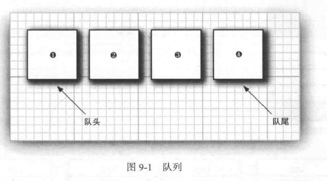
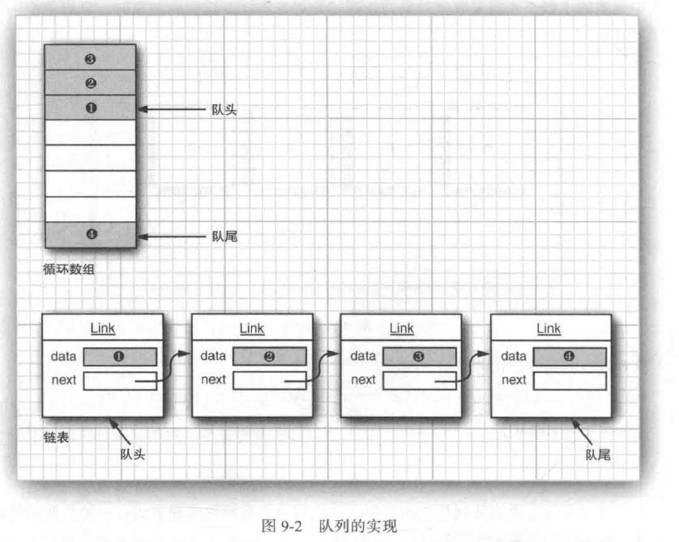
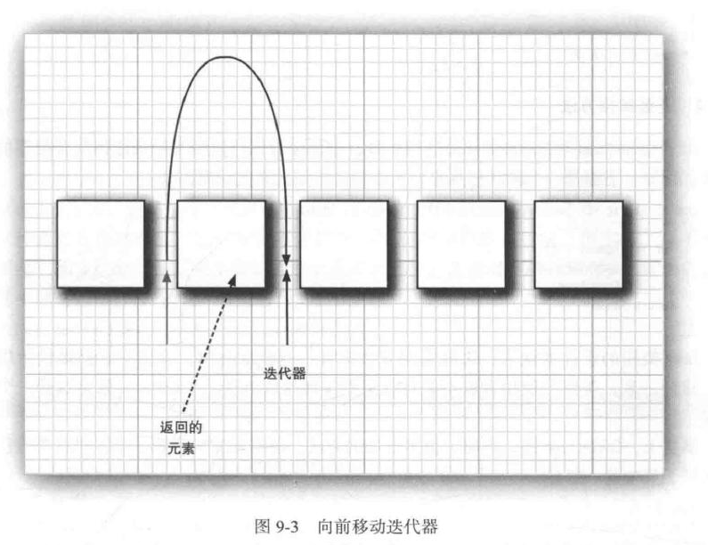
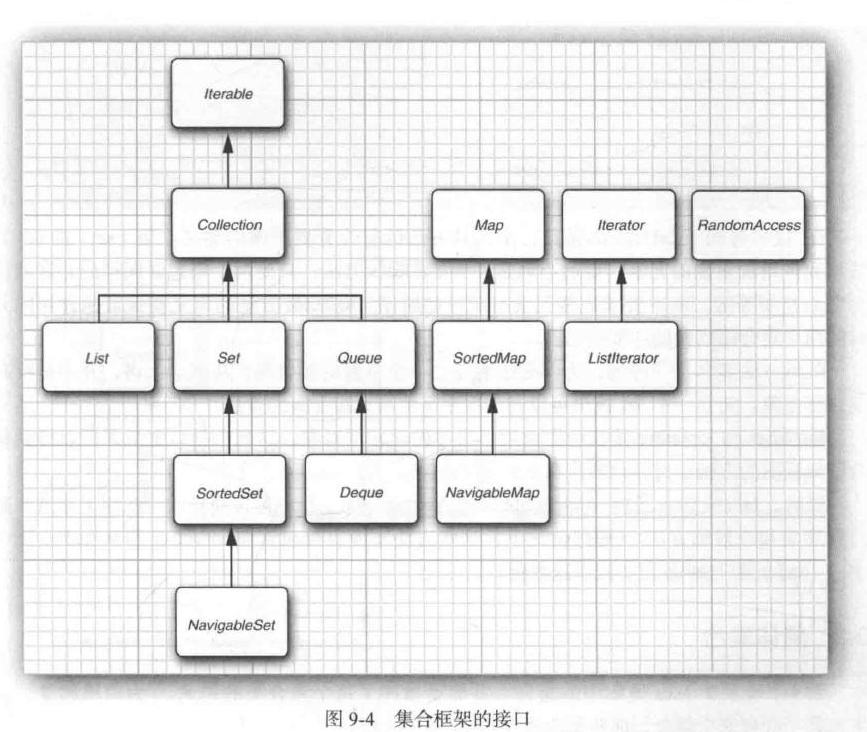
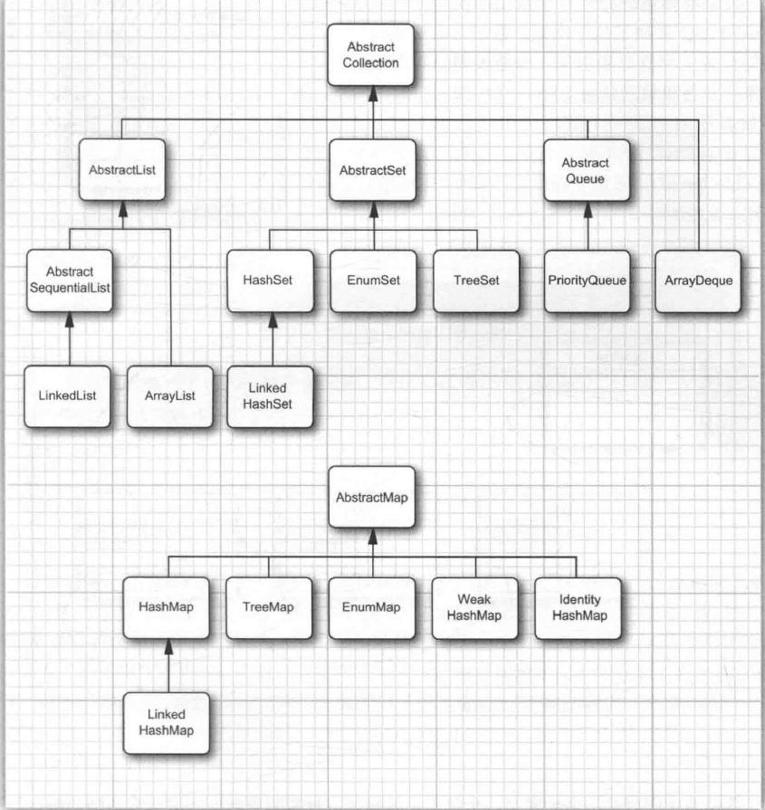
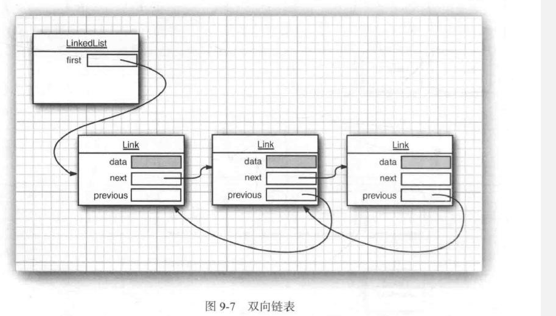
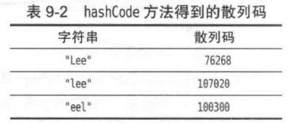

本章将介绍如何利用Java类库帮助我们实现程序设计所需的传统数据结构。与大学课程（数据接口）所讲述的内容不同，这里将跳过理论部分，仅介绍如何使用标准库中的集合类


## 9.1 Java集合框架

这一节将介绍集合框架的基本设计，展示如何使用，并解释一些颇具争议的特性背后的考虑。


#### 9.1.1 集合接口与实现分离

​	==**Java集合类库是将接口（interface）与实现（implementation）分离**==，比如ArrayList是List（顺序表）接口的一个实现类。下面利用一个数据结构——队列（queue）来说明接口与实现如何分离。

​	**队列接口（queue interface）指出可以在队尾添加元素，队头删除元素。并且可以查找队列中元素的个数**。当需要收集对象并按照"先进先出"方式获取对象时，就应该使用队列



队列接口的最简形式可能如下：

```java
public interface Queue<E>
{
    void add(E element);
   	E remove();
    int size;
}
```

这个接口并没有说明队列是如何实现的。队列通常有两种实现方式：一种是使用循环数组；另一种使用链表。

每个实现都可以一个实现了Queue接口的类表示。示例：

```java
////循环数组队列实现队列接口
public class CircularArrayQueue<E> implements Queue<E>
{
    private int head;//队头
    private int tail;//队尾
    
    
    CircularArryaQueue(int capacity){
        // 构造方法初始化循环数组
    }
    public void add(E element){...}
    public E remove(){...}
    public int size(){...}
    
    //数据存储地
    private E[] elemets;
}

//链表队里实现队列接口
public class LinkedListQueue<E> implements Queue<E> //不是实际的库类
{
    private int head;//队头
    private int tail;//队尾
    
    
    CircularArryaQueue(int capacity){}
    public void add(E element){...}
    public E remove(){...}
    public int size(){...}
   
}
```



```java
注释：Java类库没有上面两个类，只是用这些类为例来解释集合接口和实现在概念上的区分。如果需要一个循环数组队列，使用ArrayDeque类。链表队列直接使用LinkedList类。
```

​	在程序中使用队列时，一旦已经构造了集合，不需要知道究竟使用了哪种实现，因此，只是在构造集合对象时，才会使用具体的类。==可以使用接口类型存放集合引用==。

```java
/*Queue表示接口，类型参数为Customer类。接受一个实现了Queue接口的类引用。
这个类引用是使用循环数组实现的队列。因为CircularArrayQueue实现了集合框架
Queue队列，所以可以用集合的语法创建该类。后面的泛型参数空着是因为编译器可以推导出来
同样需要的是Customer类
*/
Queue<Customer> expressLane = new CircularArrayQueue<>(100);
expresslane.add(new Customer("Harry"));
```

利用这种方法，可以很轻松地使用另外一种不同的实现。

```java
Queue<Customer> expressLane = new LinkedListQueue<>(100);
expresslane.add(new Customer("Harry"));
```

根据需要来选择不同的实现是明智的。循环数组是一个有界（bounded）集合，它的容量有限。如果程序中要手机的对象数量没有上限，就最好使用链表实现。


#### 9.1.2 Collection接口

在Java类库中，集合类的基本接口是Collection接口。接口有两个基本方法：

```java
public interface Collection<E>
{
    boolean add(E element);
    Iterator<E> iterator(); //返回一个迭 代器：Iterator
    ...
}
```

还有几个方法稍后介绍。

​	**add方法用于向集合中添加元素**。如果添加元素确实改变了集合就返回true；如果集合没有发生变化就返回false。**iterator方法用于返回一个实现了Iterator接口的对象。可以使用这个迭代器对象依次访问集合中的元素**。


#### 9.1.3 迭代器

Iterator接口包含4个方法

```java
public interface Iterator<E>
{
    E next();
    boolean hasNext();
    void remove();
    //接口默认实现方法
    default void forEachRemaining(Consumer<? super E> action);
}
```

1. **迭代器访问集合元素**

​	**通过方法调用next方法，可以逐个访问集合中的每个元素**。到达了集合的末尾，next方法将会抛出一个NoSuchElementException。**因此，在调用next之间需要调用hasNext()方法，如果迭代器对象还有更多可以访问的元素，这个方法就返回true**。如果想要查看集合中的所有元素，就请求一个迭代器。当hasNext返回true时就反复地调用next方法。例如：

```java
Collection<String> c =...;
Iterator<String> iter =c.iterator();//从集合c中返回一个迭代器
while(iter.haxnext()){
    String element = iter.next();
}
```

可以更简洁地将这个循环写为"for each"循环

```java
for(String element: c){
    //do something with element
}
```

==编译器会把"for each "循环转换为一个带迭代器的循环==。

"for each "循环可以处理任何实现了Iterable接口的对象。这个接口只有一个抽象方法：

```java
public interface Iterable<E>
{
	Iterator<e> iterator();
  	...
}
```

​	==**Coolection接口扩展了（即继承）Iterable接口。因此，对标准库中的任何集合都可以使用"for each"循环**==。也可以不写循环，而是调用forEachRemaining方法并提供一个lambda表达式（它会处理每一个元素）。将对迭代器的每一个元素调用这个lambda表达式，知道再没有元素为止。


2. **迭代器删除集合元素**

​	Java迭代器在查找操作与位置变化紧密耦合。**查找一个元素的唯一方法是调用next，而在执行查找操作的同时，迭代器的位置会随之向前移动**。因此，可以认为Java迭代器位于两个元素之间。当调用next时，迭代器就会越过这下一个元素，next也会返回被越过的这个元素。



​	==**Iterator接口的remove方法会删除上次调用next方法返回的元素**==。想要删除指定位置上的元素，仍然需要越过这个元素。例如，可以删除字符串集合中的第一个元素：

```java
Iterator<String> it = c.iterator();
it.next();
it.remove(); //删除该元素
```

重要的是，**next方法和remove方法调用之间存在依赖性。调用remove之前没有调用next将是不合法的**。如果这样做将会抛出一个IllegaStateException异常。

想删除两个相邻的元素，不能直接这样调用：

```java
it.remove();
it.remove(); //ERROR
```

**必须先调用next越过将要被删除的元素**：

```java
it.remove();
it.next();
it.remove(); //OK
```


#### 9.1.4 泛型实用方法

​	**由于Collection与Iterator都是泛型接口，这意味着你可以编写处理任何集合类型的使用方法**，例如，下面是一个检测任意集合是否包含指定元素的泛型方法：

```java
public static <E> boolean contains(Collection<E> c , Object obj)
{
    for(E element: c)
        if(element.equals(obj))
            return true;
    return false;
}
```

事实上，Collection接口声明了很多有用的方法，所有的实现类都必须提供这些方法。下面列举其中的一部分：

```java
int size();
boolean isEmpty();
boolean contanis(Object obj);
boolean containsAll(Collection<?> c)
boolean equals(Object other)
boolean addAll(Collection<? extends E> from)
boolean remove(Object obj)
boolean removeAll(Collection<?> c)
void clear()
boolean retainAll(Collection<?> c)
Object[]] toArray()
```

​	当然，如果实现Collection接口的每一个类都要提供如此多的例行方法，这将是一件很烦人的事。为了让实现者更轻松一些，**Java类库提供了一个类AbstractCollection，其中保持基础方法size和iterator仍为抽象方法，但是为实现者实现了其他例行方法**。例如：

```java
public abstract class AbstractCollection<E> implements Collection<E>
{
    ...
    public abstract Iterator<E> iterator();
    
    public boolean contanis(Object obj)
    {
        for(E element:this)
        {
            if(element.equals(obj))
                return true;
        }
        return false;
    }
}
```

这样一类，具体集合类可以扩展AbstractCollection类。现在要由具体的集合类提供iterator方法，而其他方法已由AbstractCollection超类提供。


##### `Java.util.Collection<E>`

```java
Iterator<E> iterator()
    返回一个迭代器，用于访问集合中的元素;
int size()
    返回当前存储在集合中的元素个数;
boolean isEmpty()
    如果集合中没有元素，返回true;
boolean contains(Object obj)
    如果集合中包含一个与obj相等的对象，返回true;
boolean contains(Collection<?> other) 
    如果这个集合中包含other集合中的所有元素，返回true;
boolean add(E element)
    将一个集合添加到集合中。如果这个调用改变了集合，返回true。
boolean addAll(Collection<? extends E> other)
    将other集合中所有的元素添加到这个集合。如果由于这个调用改变了集合，返回true;
boolean remove(Object obj)
    从这个集合中删除等于obj的对象。如果有匹配的对象被删除，返回true;
boolean removeAll(Collection<?> other)
    从这个集合中删除other集合中的所有元素。如果由于这个调用改变了集合，返回true;
default boolean removeIf(Predicate<? super E> filter)
    从这个集合删除让filter返回true的所有元素，如果由于这个调用改变了集合，则返回true;
void clear()
    从这个集合中删除所有元素
boolean retainAll(Collcetion<?> other)
    从这个集合中删除所有与ohter集合元素不同的元素，如果由于这个调用改变了集合，返回true。
object[] toArray()
    返回这个集合中的对象的数组。
```

##### `Java.util.Iterator<E>`

```java
boolean hashNext()
    如果存在另一个可访问的元素，返回true;
E next()
    返回将要访问的下一个对象，如果已经到达了集合的末尾，将抛出一个NoSuchElementException。
void remove()
    删除上传访问的对象。这个方法必须紧跟在访问一个元素之后，如果访问上一个元素集合之后已经发生了变化，这个方法将抛出一个IllegalStateException
default void forEachRemaining(Consumer<? super E> action)
   访问元素，并传递到指定的动作，直到再没有更多的元素，或者这个动作抛出一个异常。
```


## 9.2 集合框架中的接口

Java集合框架为不同类型的集合定义了大量接口，==集合有两个基本接口： Collection和Map==。可以用下面的方法在Collection集合中插入元素：

```java
boolean add(E element)
```

不过**，映射（mapping）集合包含键/值对，要用put方法在映射中插入元素**：

```java
V put(K key, V value);
```

要从映射集合读取元素，可以用迭代器访问元素。不过，可以使用get方法从映射中读取值：

```java
V get(K key);
```



 	List是一个有序集合。元素会增加到容器中的特定位置。**可以采用两种方式访问元素：使用迭代器访问，或使用一个整数索引来访问。**后面这种方法称为随机访问。

List接口定义了多个用于随机访问的方法：

```java
void add(int index ,E element);
void remove(int index);
E get(int index);
E set(int index,E element);
```

ListIterator接口是Iterator的一个子接口。它定义了一个方法用于在迭代器位置前面增加一个元素：

```java
void add(E element);
```


## 9.3 具体集合

下表展示了Java类库中的集合。并简要描述了每个集合类的用途（这里省略了线程安全集合，那些集合将在第12章中介绍）

| 集合类型        | 描述                                                 |
| --------------- | ---------------------------------------------------- |
| ArrayList       | 可以动态增长和缩减的一个索引序列                     |
| LinkedList      | 可以在任意位置高效插入和删除的一个有序序列           |
| ArrayDeque      | 实现为循环数组的一个双端队列                         |
| HashSet         | 没有重复元素的一个无序序列                           |
| TreeSet         | 一个有序集                                           |
| Enumset         | 一个包含枚举类型值的集                               |
| LinkedHashSet   | 一个可以记住元素插入次序的集                         |
| ProrityQueue    | 允许高效删除最小元素的一个集合                       |
| HashMap         | 存储键/值关联的一个数据结构                          |
| TreeMap         | 键有序的一个映射                                     |
| EnumMap         | 键属于枚举类型的一个映射                             |
| LinkedHashMap   | 可以记住键/值添加次序的一个映射                      |
| WeakHashMap     | 这个映射中的值如果不在别处使用，就会被垃圾回收器回收 |
| IdentityHashMap | 用==而不是用equals比较键的一个映射                   |

上述表中，除了以Map结尾的类之外，其他类都实现了Collection接口，而以Map结尾的类实现了Map接口，下图显示了这些类之间的关系




#### 9.3.1 链表

​	数组和数组列表都有一个重大的缺陷。**从数组中间删除和插入一个元素开销很大**。原因是位于被删除元素之后的所有元素都要向数组前端移动。插入一个元素也是如此。

​	而链表（linked list）解决了这个问题。数组是在连续的存储位置存放对象引用，而链表则是将每个对象存放在单独的链接（link）中。每个链接还存放着序列中下一个链接的引用。在Java程序设计语言中，所有链表实际上都有双向链接(doubly linked)，即每个链接还存储着其前驱的引用。



​	从链表中间删除一个元素是一个很轻松的操作，只需要更新所删除元素周围的链接即可。

​	也许在学习链表时，为绕来绕去的指针域而感到麻烦。那么Java集合类库提供了一个可以直接使用的LinkedList类给你使用。在下面的代码实例中，先添加3个元素，再将第2个元素删除：

```java
        /*声明一个集合，该集合的形式是链表，存储元素类型为String
        * LinkedList<>()为它的构造方法*/
        LinkedList<String> staff = new LinkedList<>();
        /*为集合添加元素*/
        staff.add("Amy");
        staff.add("Bob");
        staff.add("Carl");

        /*获取该集合的迭代器*/
        Iterator<String> iter = staff.iterator();
        String first = iter.next(); //获取第一个元素并且元素指针指向第二个
        System.out.println(first);
        String second = iter.next(); //获取第一个元素并且元素指针指向第3个
        System.out.println(second);
        iter.remove();//remove会删除上次next调用返回的元素，所以Bob会被删除
```

​	不过，链表与泛型集合之间有一个很重要的区别，链表是一个有序集合，每个对象的位置十分重要。==LinkedList.add方法将对象添加到链表的尾部==。但是，常常需要将元素添加到链表的中间。因为迭代器描述了集合中的位置，所以这种依赖于位置的add方法将由迭代器负责。

​	不过，只有对自然有序的集合使用迭代器来添加元素才有意义，下一节要讨论的集（set）数据类型中，元素是完全无序的。因此`Iterator`接口中才没有add方法。实际上，==集合类库提供了一个子接口ListIterator，其中包含add方法==。

```java
interface ListIterator<E> extends Iterator<E>{
    void add(E element);
}
```

​	与`Collection.add`不同，这个方法不返回boolean类型的值，它假定add操作总会改变链表。另外，==ListIterator接口有两个方法可以用来反向遍历链表==。

```java
E previous()
boolean hasPrevious()
```

​	与next方法一样，`previous`方法会返回越过的对象。可以把`previous`看作引用前一个元素的对象，先通过next将链表遍历到表尾，再通过previous遍历到表头

```java
package gather;

import javax.annotation.processing.SupportedSourceVersion;
import java.util.*;

public class LinkedList_Test {
    public static void main(String[] args) {

        /*声明一个集合，该集合的形式是链表，存储元素类型为String
        * LinkedList<>()为它的构造方法*/
        LinkedList<String> staff = new LinkedList<>();
        /*为集合添加元素*/
        staff.add("Amy");
        staff.add("Bob");
        staff.add("Carl");
        /*获取该集合的ListIterator迭代器
        * 迭代器初始状态：| Amy Bob Carl
        *
        * */
        ListIterator<String> listIterator = staff.listIterator();

        System.out.println("被越过的元素："+listIterator.next());//新元素被插入到迭代器的前方，现在迭代器状态：Amy Juliet | Bob Carl
        listIterator.add("Juliet");//迭代器状态： Amy Juliet | Bob
        System.out.println("被越过的元素："+ listIterator.previous()); // 迭代器状态: Amy | Juliet Bob 返回 Juliet
        System.out.println("被越过的元素："+ listIterator.previous()); //迭代器状态： | Amy Juliet Bob 返回Amy

        System.out.printf("[");
        while(listIterator.hasNext()){ /*从第一个元素遍历到最后一个元素*/
            String st =  listIterator.next();
            System.out.print(st+",");
        }
        System.out.print("]\n");
        System.out.printf("[");
        while(listIterator.hasPrevious()){  /*从最后一个元素遍历到第一个元素*/
            String st = listIterator.previous();
            System.out.print(st+",");
        }
        System.out.print("]\n");
    }
}

/*
输出：
被越过的元素：Amy
被越过的元素：Juliet
被越过的元素：Amy
[Amy,Juliet,Bob,Carl,]
[Carl Bob Juliet Amy ]
*/
```


**LinkedList类的listIterator方法返回一个实现了ListIterator接口 的迭代器对象**。

```java
ListIterator<String> iter = staff.listIterator();
```

==列表迭代器（ListIterator）的add方法在迭代器位置*之前*添加一个对象==。例如，下面的代码将越过链表中第一个元素，在第二个元素之前添加"Juliet"：

```java
    public static void main(String[] args) {

        /*声明一个集合，该集合的形式是链表，存储元素类型为String
        * LinkedList<>()为它的构造方法*/
        LinkedList<String> staff = new LinkedList<>();
        /*为集合添加元素*/
        staff.add("Amy"); //LinkedList类的add方法
        staff.add("Bob");
        staff.add("Carl");
        /*获取该集合的ListIterator迭代器*/
        ListIterator<String> listIterator = staff.listIterator();
        listIterator.next();//越过第一个元素。
        listIterator.add("Juliet"); //ListItertor接口的add方法
        System.out.println(staff);
    }

//输出如下：[Amy, Juliet, Bob, Carl]
```

​	如果多次调用add方法，将按照提供元素的次序把元素添加到链表中。**它们被依次添加到迭代器当前位置之前**。

​	当用一个刚由listIterator方法返回并指向链表表头的迭代器来调用add操作时，新添加的元素将变成列表的新表头。当迭代器越过表的最后一个元素时（即hasNext返回false时)，添加的元素将成为列表的新表尾。

​	如果链表有n个元素，会用n+1个位置可以添加新元素。这些位置与迭代器的n+1个可能的位置相对于。例如，如果链表包含3个元素。A、B、C，就有4个位置（标记为|）可以插入新元素：

```java
|ABC
A|BC
AB|C
ABC|
```

​	最后需要说明，set方法会用一个新元素替换调用next或previous方法返回的上一个元素：

```java
ListIterator<String> iter = list.listIterator();
String oldValue = iter.next();  //迭代器越过第一个元素，并返回给oldValue
iter.set(newValue); //替换掉被越过的元素
```


​	如果某个迭代器修改集合时，另一个迭代器却在遍历这个集合，可能会出现混乱。例如，假设一个迭代器指向一个元素前面的位置，而另一个迭代器刚刚删除了这个元素，现在前一个迭代器就是无效的。链表迭代器设计可以检测到这种修改，**==如果一个迭代器发现它的集合被另一个迭代器修改了，或是被该集合自身某个方法修改了，就会抛出一个`ConcurrentModificationException`异常==：**

```java
List<String> list =...;
ListIterator<String> iter1 = list.listIterator();
ListIterator<String> iter2= list.listIterator();
iter1.next();
iter1.remove();
iter1.next(); //throws ConcurrentModificationException
```

​	为避免发生这样的并发修改异常，需要遵循一个简单的规则：**可以根据需要为一个集合关联多个迭代器，前期是这些迭代器只能读取集合。或者，可以管理一个能同时读写的迭代器 **

​	

​	LinkedList类提供了一个get方法，用来访问某个特定的元素：

```java
LinkedList<String> list = ...;
String obj = list.get(n);
```

​	避免使用这样的方法来访问元素，因为这个方法效率不高，下面这段代码的效率极低：

```java
for(int i=0; i<list.size(); i++)
    do something with list.get(i);
```

​	列表迭代器接口（ListIterator）还有一个方法，可以告诉你当前位置的索引。从概念上讲，因为Java迭代器指向两个元素之间的位置，所以可以有两个索引：**`nextIndex`返回下一次调用next方法时所返回元素的整数索引**；**`previousIndex`方法返回下一次调用previous方法时所返回元素的整数索引**

```java
    public static void main(String[] args) {

        /*声明一个集合，该集合的形式是链表，存储元素类型为String
        * LinkedList<>()为它的构造方法*/
        LinkedList<String> staff = new LinkedList<>();
        /*为集合添加元素*/
        staff.add("Amy");
        staff.add("Bob");
        staff.add("Carl");
        /*获取该集合的ListIterator迭代器
        * 迭代器初始状态：| Amy Bob Carl
        *
        * */
        ListIterator<String> listIterator = staff.listIterator();
        System.out.println("迭代器初始状态时，nextIndex索引值："+listIterator.nextIndex());
        System.out.println("迭代器初始状态时，previousIndex索引值："+listIterator.previousIndex());

        System.out.println("被next()越过的元素："+listIterator.next());//迭代器状态： Amy| Bob, 返回Amy
        System.out.println("第一次调用next()后，nextIndex索引值："+listIterator.nextIndex());
        System.out.println("nextIndex索引值："+listIterator.nextIndex());
        System.out.println("previousNext()所返回的索引值："+listIterator.previousIndex());
        listIterator.add("Juliet");//新元素被插入到迭代器的前方，现在迭代器状态：Amy Juliet | Bob Carl


    }
输出：
/*
迭代器初始状态时，nextIndex索引值：0
迭代器初始状态时，previousIndex索引值：-1
被next()越过的元素：Amy
第一次调用next()后，nextIndex索引值：1
nextIndex索引值：1
previousNext()所返回的索引值：0
*/
```

简而言之，nextIndex会返回迭代器后面元素的索引，而previousIndex会返回前一个元素的索引。例：

```java
// |指代迭代器
| Amy Bob   //nextIndex返回0 ，previousIndex返回-1
Amy | Bob   //nextIndex返回1 ，previousIndex返回0
```

​	这两个方法的效率非常高，因为迭代器会维护当前位置的计数值。最后说明一点，如果有一个整数索引n，**`list.listIterator(n)`将返回一个迭代器，这个迭代器指向索引为n的元素前面的位置**。


​	下面的程序具体使用了链表。它创建了两个列表，将它们合并在一起，然后从第二个列表中每隔一个元素删除一个元素，最后测试removeAll方法。要特别注意迭代器，可以画出迭代器位置示意图：

```java
|ACE |BDFG
A|CE |BDFG
AB|CE B|DFG
...
```

注意以下调用：

```java
System.out.println(a);
```

这会调用AbstractCollection类中的toString方法打印链表a中的所有元素。

```java
package gather;
import java.util.*;

/*
*  This program demonstrates operations on linked lists.
* @version 1.12 2025-08-06
* @ author Tian Weiwei
* */
public   class LinkedListTest {
    public static void main(String[] args){

        var a = new LinkedList<String>(); //创建一个链表类，存储的类型是字符串
        /*添加元素*/
        a.add("Amy");
        a.add("Carl");
        a.add("Erica");

        var b = new LinkedList<String>(); //创建第二个链表，并添加元素
        b.add("Bob");
        b.add("Doug");
        b.add("Frances");
        b.add("Gloria");

        //获取两个链表的迭代器
        ListIterator<String> aIter=a.listIterator(); //列表迭代器
        Iterator<String> bIter = b.iterator();//普通迭代器 注意：listIterator接口是Iterator的子接口

        /*
        * 功能：将两个表合并,每隔一个元素从表b中添加一个元素到表a
        * 逻辑：判断b是否为空，再判断a是否为空
        *       如果a，b都不为空，表a越过一个元素，再从表b中获取一个元素添加到表a
        * */
        while(bIter.hasNext()){
            if(aIter.hasNext())
                aIter.next();
            aIter.add(bIter.next());//listIterator的add方法是在迭代器之前添加元素
        }

        System.out.println("a表与b表合并之后："+a);

        bIter = b.iterator(); //获取第二个迭代器
        while(bIter.hasNext()){ //循环往复
            bIter.next(); //越过第一个元素
            if(bIter.hasNext()){
                bIter.next(); //越过第二个元素
                bIter.remove(); //删除被越过的第二个元素
            }
        }
        System.out.println("每隔一个元素就删除一个元素之后的链表b："+b);

        a.removeAll(b); //从a表中删除b的所有元素
        System.out.println("从a表中删除b的所有元素"+a);
    }
}
输出：
  /*
    a表与b表合并之后：[Amy, Bob, Carl, Doug, Erica, Frances, Gloria]
	每隔一个元素就删除一个元素之后的链表b：[Bob, Frances]
	从a表中删除b的所有元素[Amy, Carl, Doug, Erica, Gloria]
  */  
```


##### `Java.util.List<E>`

```java
ListIterator<E> listIterator()
    返回一个列表迭代器，用来访问列表中的元素;
ListIterator<E> listIterator(int index)
    返回一个列表迭代器，用来访问列表中的元素，第一次调用这个迭代器的next会返回给定索引的元素
void add(int i,E elememt)
    在指定位置添加一个元素，假设想要在第n个位置添加元素，实际上i值需输入n-1，i可看为索引值
void addAll(int i,Collection<? extends E> elements)
    将一个集合中的所有元素添加到指定位置，集合参数只接受E和E的子类，比如List list<String>, list.add( 3, list2);其中list2的类型参数也必须为Sting
E remove(int i)
    删除并返回指定位置的元素，同样的，这里i值为索引值，比如i值为3，实际被删除的元素是第4个元素
E get(i)
    获取指定位置的元素，i为索引值：
E set(int i,E element)
    用一个新元素替换指定位置的元素，并返回原来那个元素; i为索引值
int indexOf(Object element)
    返回与指定元素相等的元素在列表中第一次出现的位置，如果没有匹配的元素将返回-1;
int lastIndexOf(Object element)
    返回与指定元素相等的元素在列表中最后一次出现的位置，如果没有匹配的元素将返回-1
```

##### `Java.util.ListIterator<E>`

```java
void add(E newElement)
    在当前位置前添加一个元素
void set(E newElement)
    用一个新元素替换next或previous访问的上一个元素，如果在上一个next或previous调用之后列表结构被修改了，将抛出一个IllegalStateException异常;
boolean hasPrevious()
    当反向迭代处理列表时，如果还有可以访问的元素，返回true。换言之，迭代器的前面还有元素就返回true。
E previous()
    返回迭代器前一个对象，如果已经到达列表开头，就抛出一个NoSuchElementException异常
int nextIndex()
   	返回下一次调用next方法时将返回的元素的所有。换言之，将返回迭代器下一个元素的索引;
int previousIndex()
    返回下一次调用previous方法时将返回的元素的索引。换言之，将返回迭代器上一个元素的索引。

```

##### `Java.util.LinkedList<E>`

```java
LinkedList()
    构造一个空列表;
LinkedList(Collection<? extends E> elements)
    构造一个列表，并将一个集合中所有的元素添加到这个链表中。且泛型限定为同类或其子类
void addFirst(E element)
void addLast(E element)
    将某个元素添加到列表的开头或末尾;
E getFrist()
E getLast()
    返回列表开头或末尾的元素。
E removeFirst()
E removeLast()
    删除并返回列表开头或末尾的元素
```


#### 9.3.2 数组列表

​	在上一节中，我们了解了List接口和实现了这个接口的LinkedList类，List接口描述了一个有序集合，其中每个元素的位置都很重要。有两种描述访问元素的协议：一种是通过迭代器，另一种通过get和set方法随机访问。**集合类库提供了我们熟悉的ArrayList类，这个类也实现了List接口**。ArrayList封装了一个动态再分配的对象数组。


#### 9.3.3 散列表

​	链表和数组允许你根据意愿指定元素的次序。但是，**如果想要查找某个特定的元素，却不记得它的位置，就需要访问所有元素，直到找到匹配的元素为止。如果集合包含的元素很多，这会很耗费时间**。如果不在意元素的顺序，还有几种数据结构允许你更快速地查找元素。缺点是，**这些数据结构不允许你控制元素出现的次序**，它们会按照对自己最方便的方式组织元素。

​	有一种数据结构，可以用于快速地查找对象，这就是**散列表(hash table)**。==散列表为每个对象计算一个整数，称为散列码（hash code）散列码是以某种方式由对象的实例字段得出的一个整数，这种方式尽可能保证有不同数据的对象将生成不同的散列码==。下表列出了几个散列码的示例，它们是用String类的hashCode方法得到的。



​	如果定义你自己的类，你就要负责实现自己的hashCode方法。==注意，你的实现应该与equals方法兼容，即如果`a.equals(b)`为true，那么a与b必须有相同的散列码==。

​	现在，重要的是要能够快速地计算出散列码，并且这个计算只要与计算散列的那个对象状态有关，与散列表中的其他对象无关。

​	==**在Java中，散列表实现为链表数组。每个列表被称为桶。想要查找一个对象在表中的位置，就要先计算它的散列码，然后与桶的总数区域，所得到的数就是保存这个元素的那个桶的索引**==。例如，某个对象的散列码为76268，总共有128个桶，那么这个对象应该保存在108号桶中（76268%128的余数是108）

​	散列表可以用于实现很多重要的数据结构，其中最简单的是集类型，**集是没有重复元素的元素集合**。**集的add方法首先尝试在这个集中查找要添加的对象，只有这个元素不存在时才会添加这个对象。**

​	**Java集合类库提供了一个HashSet类，它基于散列表实现了一个集**。可以用add方法添加元素，contains方法被重新定义，以便可以快速查找一个元素是否在集中。它只查看一个桶中的元素，而不必查看集合中所有的元素。

​	散列表迭代器将依次访问所有的桶，因为散列元素分散存放在表中，所以会以一种看起来随机的顺序访问元素。**只有不关心集合中元素的顺序时才应该使用Hashset**

​	本节末尾的示例程序将从System.in读取单词，然后将它们添加到一个集中，最后再打印出集中的前20个单词。例如，可以输入*Alice in Wonderland*的文本，然后从命令行shell运行这个程序：`java SetTest < alice30.txt`

```java

import java.util.*;

public class hashTable_Test {
    public static void main(String[] args) {
        var words = new HashSet<String>();//创建一个散列表集合
        long totalTime =0;

        //带资源的try语句，无论正常与否，都会释放资源
        try( var in = new Scanner(System.in)){
            while(in.hasNext()){
                String word=in.next();//获取一个字符串
                long callTime = System.currentTimeMillis(); //获取当前时间，单位为毫秒
                words.add(word);//将字符串添加到集中
                callTime = System.currentTimeMillis() - callTime; //这一步的操作时间
                totalTime +=callTime;//将操作时间记录到totalTime中
            }
        }

        Iterator<String> iter = words.iterator(); //获取散列表的迭代器

        //遍历输出散列表的20个元素，随机访问
        for(int i=1; i<=20&& iter.hasNext();i++){
            System.out.println(iter.next());
        }
        System.out.println(". . .");
        System.out.println(words.size()+"不同的词"+totalTime+" milliseconds");
    }
}

```

​	这个程序将读取输入的所有单词，并将它们添加到散列集中。然后迭代处理散列集中不同的单词，最后打印出单词的数量。单词以随机的顺序出现。


##### `API Java.util.HashSet<E>`

```java
HashSet()
    构造一个散列集;
HashSet(collcetion<? extends E> elements)
    构造一个散列集，并将一个集合中的所有元素添加到这个散列集中。
HashSet(int initialCapacity)
    构造一个具有指定容量（桶数）的空散列集;
HashSet(int initialCapacity,float loadFactor)
    构造一个有指定的容量和装填因子的空散列集。如果大写/容量比大于这个装填因子，散列表会再散列为一个更大的散列表
```

##### `API Java.lang.Object`

```java
int hashCode()
    返回这个对象的散列码。散列码可以是任何整数，包括正数和负数。equals和hashCode的定义必须兼容，即如果x.equals(y)为true，x.hashCode()必须等于y.hashCode()
```


#### 9.3.4 树集

​	`TreeSet`类与散列集十分类似，不过，它比散列集有所改进。 ==**树集是一个有序集合（sorted collection）。可以以任意顺序将元素插入集合中。在对集合进行遍历时，值将自动地按照排序后的顺序出现**==。例如，假设插入3个字符串，然后访问添加的所有元素。

```java
var sorter = new TreeSet<String>();
sorter.add("Bob");
sorter.add("Amy");
sorter.add("Carl");
for(String s:sorter)
  System.out.println(s);
/*
输出：
Amy
Bob
Carl
*/
```

​	这时，值将按照有序顺序打印`Amy Bob Carl`。TreeSet类的排序，是用一个数据结构——树（当前实现使用的是红黑树(red-black tree)） 完成的。每次将一个元素添加到树中，都会将其放置在正确的排序位置上。因此，迭代器总是以有序的顺序访问每个元素。


​	下面的程序中创建了两个Item对象的两个树集。第一个按照部件编号排序，这是Item对象的默认排序顺序。第二个使用一个定制比较器按照描述信息排序

```java
package gather;


import java.util.*;
public class TreeSet_Test {
    public static void main(String[] args) {
        //创建一个树集永远存储Item对象
        var parts = new TreeSet<Item>();
        parts.add(new Item("Toaster",1234));
        parts.add(new Item("Widget",4562));
        parts.add(new Item("Modem",9912));
        System.out.println(parts);

        //这个集合会按照Item对象的description属性排序
        /*
        * Comparator.comparing()是java8引入的静态工厂方法，用于创建基于对象属性的比较器。
        * Item::getDescription 方法引用，等价于(Item item) ->item.getDescription();
        * */
        var sortByDescription = new TreeSet<Item>(Comparator.comparing(Item::getDescription));

        sortByDescription.addAll(parts);
        System.out.println(sortByDescription);
    }
}

class Item implements Comparable<Item>
{
    private String description;//描述
    private int partNumber;//成员号码

    public Item(String de,int pa){
        this.description=de;
        this.partNumber=pa;
    }

    public Item(){}

    public String getDescription(){
        return this.description;
    }

    public int getPartNumber(){
        return this.partNumber;
    }

    public void setDescription(String de){
        this.description=de;
    }

    public void setPartNumber(int pa){
        this.partNumber=pa;
    }


    @Override
    public String toString(){
        return "[description = "+description+"],[partNumber = "+ partNumber+"]";
    }

    @Override
    public boolean equals(Object obj) {
        if(this == obj)
            return true;
        if(obj == null)
            return false;
        if(getClass() != obj.getClass())
            return false;

        var other = (Item) obj;
        return Objects.equals(description,other.description) && partNumber ==other.partNumber;
    }

    @Override
    public int hashCode(){
        return Objects.hash(description,partNumber);
    }

    @Override
    public int compareTo(Item other) {

        /*
        * Integer.compare将判断两个整数是否相同。
        * 如果相同返回0值，如果数1小于数2则返回小于0的值，反之返回大于0的值
        * */
        int diff = Integer.compare(partNumber,other.partNumber);

        /*
        * 将返回
        * 如果diff不等于0，即两数不相等，则返回diff，
        * 如果两数相等。再返回比较两个字符串是否相等的值
        * */
        return diff!=0 ? diff : this.description.compareTo(other.description);
    }
}

```


##### `Java.util.TreeSet<E>`

```java
TreeSet()
TreeSet(Comparator<? extends E> elements)
     构造一个空数集。
TreeSet(sortedSet<E> s)
TreeSet(Collction<? extends E> elements)
    构造一个树集，并增加一个集合或有序集合的所有元素
```

##### `Java.util.sortedSet<E>`

```java
Comparator<? super E> comparator()
    返回用于对元素进行排序的比较器。如果元素用Compareble接口的compareTo方法进行比较则返回null。
E first()
E last()
    返回有序集中的最小元素或最大元素。
```


#### 9.3.5 队列与双端队列

​	队列允许高效的在队尾添加元素，并在队头删除元素。双端队列（deupe）在队头和队尾都能高效第地添加或删除元素。不支持在队列中间添加元素。Java6中引入了Deque接口。ArrayDeque和LinkedList类实现了这个接口。这两个类都可以提供双端队列，其大小根据需要扩展。


##### `API Java.util.Queue<E>`

 ```java
 boolean add(E element)
 boolean offer(E element)
 	如果队列没有满，将给定的元素添加到这个队列的队尾并返回true。如果队列已满，第一个方法将抛出一个IllegaStateException，而第二个方法返回false。
 E remove()
 E poll()
     如果队列不为空，删除并返回这个队列队头的元素。如果队列是空的，第一个方法抛出NuSuchElementException，而第二个方法返回null。
 E element()
 E peek()
     如果队列不为空，返回这个队列队头的元素，但不删除这个元素。如果队列为空，第一个方法抛出NuSuchElementException，而第二个方法返回null
  
 ```

##### `API Java.util.Deque<E>`

```java
void addFirst(E element)
void addLast(E element)
boolean offerFirst(E element)
boolean offerLast(E element)
    将给定的对象添加到双端队列的队头或队尾。如果这个双端队列已满，前面两个方法将抛出一个IllegalStateException,而后面两个方法返回false。
E removeFirst()
E removeLast()
E pollFirst()
E pollLast()
    如果这个双端队列不为空，删除并返回双端队列队头元素。如果双端队列为空，前面两个方法将抛出一个NoSuchElementException，后面两个方法返回null
E getFirst()
E getLast()
E peekFirst()
E peekLast()
如果这个双端队列非空, 返回双端队列队头的元素，但不删除这个元素。如果双端队列为空，前面两个方法将抛出一个NoSuchElementException，后面两个方法返回null
```


#### 9.3.6 优先队列

​	**优先队列(priority queue)中的元素可以按照任意的顺序插入，但是会按照有序的顺序获取**。也就是说，调用remove方法时，总会获得当前优先队列中最小的元素。**优先队列使用了一个精巧且高效的数据结果，称为堆（heap）。堆是一个自组织的二叉树，其添加（add）和删除（remove）操作会让最小的元素移动到根**。

​	与TreeSet一样，优先队列即可以包含实现了Comparable接口的类对象，也可以包含构造器中提供的Comparator对象。

​	优先队列的典型用法就是任务调度。每一个任务有一个优先级，任务以随机顺序添加到队列中。每当启动一个新任务，时，将从队列中删除优先级最高的任务（因为习惯将1作为“最高“优先级，所以remove操作将删除最小的元素）。

​	下面的程序显示了一个优先队列的具体使用。删除操作和删除剩余元素中总是最小的那个元素

```java

import java.util.*;
import java.time.*;
public class priorityQueueTest {
    public static void main(String[] args) {
        //创建一个优先队列，其存储的元素为LocalDate
        var pq = new PriorityQueue<LocalDate>();
        //添加元素
        pq.add(LocalDate.of(1906,12,9));
        pq.add(LocalDate.of(1815,12,10));
        pq.add(LocalDate.of(1903,12,3));
        pq.add(LocalDate.of(1910,6,22));

        System.out.println("Iterating over elements...(迭代元素...)");
        for(LocalDate date:pq)
            System.out.println(date);

        System.out.println("Removing elements...");
        while(!pq.isEmpty())
            System.out.println("被删除的元素"+pq.remove());
    }
}
/*
输出：
Iterating over elements...(迭代元素...)
1815-12-10
1906-12-09
1903-12-03
1910-06-22
Removing elements...
被删除的元素1815-12-10
被删除的元素1903-12-03
被删除的元素1906-12-09
被删除的元素1910-06-22
*/
```

##### `API Java.util.PriorityQueue`

```java
PriorityQueue()
PriorityQueue(int initialCapacity)
    构造一个存放Comparable对象的优先队列。
PriorityQueue(int initialCapacity,Comparator<? super E> c)
    构造一个优先队列，并使用指定的比较器对元素进行排序。
```


## 9.4 映射

​	作为一个集合，集允许你快速地查找现有的元素。通常，**我们知道某些关键信息，希望查找与之关联的元素。映射（map）数据结构就是为此设计的。映射用来存放键/值对。如果提供了键，可以查找一个值**。例如，存储一个员工记录表，其中键为员工ID，值为Emoloyee对象。


#### 9.4.1 基本映射操作

​	**Java类库为映射提供两个通用的实现：==HashMap和TreeMap==。这两个类都实现了Map接口**

​	散列映射对键进行散列，树映射根据键的顺序将它们组织为一个搜索树。散列或比较函数只应用于键。与键关联的值不进行散列或比较。**散列要稍微快一些，如果不需要按照有序的顺序访问键，最好还是选择散列映射**。

​	下面建立一个散列映射来存储员工信息：

```java
        //创建一个散列映射集来存储员工信息
        HashMap<String,Employee> staff = new HashMap<>();
        Employee harry = new Employee("Harry Hacker");
        //将这个员工放入散列映射集中，并设置键值
        staff.put("987-98-9996",harry);
```

​	==**每当向映射中添加一个对象时，必须同时提供一个键**==。在这里，键是一个字符串，对应的值是Employee对象。

​	要获取一个对象，必须使用键（因此必须记住键）

```java
  		var id = "987-98-9996";
        Employee e= staff.get(id);
        System.out.println(e);//输出[Harry Hacker,0.0,null,null]
```

​	**如果映射中没有存储与指定键对应的信息，get将返回null**。有时可能不希望返回null值而返回其他值，**`getOrDefault`方法同样会获取与键对应的值，但如果这个映射中没有与键对应的值，则会返回第二个指定的参数**。

```java
        Map<String,Integer> scores = new HashMap<>();
        //如果在这个映射集中没有对应的键值，则返回0
        int score = scores.getOrDefault(id,0);
```

​	下面是`getOrDefault`方法的参数列表：

```java
hashmap.getOrDefault(Object key, V defaultValue);
```


​	==键必须是唯一的==。不能对同一个键存放两个值，**如果用同一个键调用两次put方法，第二个值就会取代第一个值。实际上，put将返回与这个键参数关联的上一个值**。

​	remove方法从映射中删除给定键对应的元素。**size方法方法返回映射中的元素数。**

​	**要迭代处理映射的键和值，最容易的方法是使用forEach方法。可以提供一个接受键和值的lambda表达式。映射中的每一项会依次调用这个表达式。**

```java
        //创建一个散列映射集来存储员工信息
        HashMap<String,Employee> staff = new HashMap<>();
        Employee harry = new Employee("Harry Hacker");
        //将这个员工放入散列映射集中，并设置键值
        staff.put("987-98-9996",harry);
        staff.put("987-98-9997",new Employee("Mark"));
        staff.put("987-98-9998",new Employee("trup"));

        staff.forEach((k,v)->{
            System.out.println("key = "+k+",value = "+v.getName());
        });

//输出
key = 987-98-9998,value = trup
key = 987-98-9996,value = Harry Hacker
key = 987-98-9997,value = Mark
```


​	下面的程序显示了映射的具体使用。首先将键/值对添加到映射中，然后从映射中删除一个键，同时与之关联的值也会删除。接下来修改与某一个键关联的值，并调用get方法查找一个值。最后，迭代处理元素集。

```java
package MappingPractice;

import java.util.HashMap;

public class MapTest {
    public static void main(String[] args) {
        //创建散列映射集合
        var staff = new HashMap<String,Employee>();
        //给映射中添加元素
        staff.put("144-25-5465",new Employee("Amy lee"));
        staff.put("567-24-2545",new Employee("Harry Hacker"));
        staff.put("157-62-7935",new Employee("Gary Cooper"));
        staff.put("456-62-5527",new Employee("Francesca Cruz"));

        //输出所有元素
        System.out.println(staff);

        //删除一个元素
        staff.remove("567-24-2546");

        //替换一个元素
        staff.put("456-62-5527",new Employee("Francesca Miller"));

        //根据键查找一个元素
        System.out.println(staff.get("157-62-7935"));

        staff.forEach((k,v)->{
            System.out.println("key = "+k+",value = "+v.getName());
        });
    }
}

```


##### `Java.util.Map<K,V> (Interface)`

```java
V get(Object key)
    获得与键关联的值；返回与键关联的对象，如果没有在映射中找到这个键，则返回null;
default V getOrDefault(Object key,V defaultValue)
    获得与键关联的值；返回与键关联的对象，或者如果在映射中没有找到这个键，则返回defaultValue。
V put(K key, V value)
    将关联的一对键和值放到映射中。如果这个键已经存在，新对象将取代这个与这个键关联的对象。这个方法将返回键对应的旧值。如果之前没有这个键，则返回null。
void putAll(Map<? extends K, ? extends V> entries)
    将指定的映射中的所有映射条目添加到这个映射中。
boolean containsKey(Object Key)
    如果映射中有这个键，返回true。
boolean containValue(Object value)
    如果映射中有这个值，返回true。
default void forEach(BiConsumer<? super K,? super V> action)
    对这个映射中的所有键/值应用这个动作
    
```

##### `Java.util.HashMap<K,V>`

```java
HashMap()
HashMap(int initialCapacity)
HashMap(int initialCapacity,float loadFactor)
    构造一个空散列映射，它具有指定的容量和装填因子（装填因子是一个0.0~1.0之间的数。这个数确定散列表填充到多大比例时就要遭散列到一个更大的散列表）。默认的装填因子是0.75
```


#### 9.4.2 更新映射条目

​	处理映射的一个难点是更新映射条目。正常情况下，**可以得到与一个键关联的旧值，更新这个值，再放回更新的值**。

```java
Map<String,Integer> map = new HashMap<>();
map.put("apple",10);

//更新"apple",的值
map.put("apple",20);
```

​	不过，必须考虑一个特殊情况，**即键第一次出现**。下面来看一个例子，考虑使用映射来统计一个单词在文件中出现的频度。看到一个单词（word）时，我们将计数器增1。如下所示：

```java
/*
代码逻辑：
  1. 从映射counts中获取当前单词word对应的计数值（旧值）。
  2. 将这个计数值加1。
  3. 将新的计数值放回映射中，覆盖旧值。
  可以这么理解，count是一个映射集，它们的键为一个单词，与之对应的值是一个整数，用作计数。
  正常逻辑：
  1.从该映射中获取键word对应的值，然后+1,
  2.put方法会更新word键对应的值，这个值就是旧值+1，从而达到了计数的功能
*/
counts.put(word,counts.get(word)+1);
/*
问题：这条语句是先执行counts.get(word)。假设word没在该映射中，那么get会返回一个null，此时：
	count.put(word,null+1); 会出现空指针异常
    
   */
```

​	但是，有一个问题：在映射count第一次执行counts.get(word)时,而映射集中没有word键，在这种情况下，get会返回null。因此会出现一个`NullpointerException`异常。下面有一种简单的补救方法，使用`getOrDefault`方法：

```java
//假设能从一个文件循环获取一个单词，这个单词就是word
/*
	现在映射的框架大概是这样： var counts = new HashMap<String,int>();
	一个单词（键）对应一个计数器（值）
	首先拿着从文件中获取的word，去counts映射中查找。如果有，则返回这个键（word）对应的值
	如果是第一次，counts映射中肯定没有该键，那么getOrDefault会返回0，第二个参数的值为1
	此时就相当于把这个word设为了键，它的值是1，放入了该映射。解决了之前代码空指针的异常。
	如果再次遇见这个键，那么它的值会更新+1，因为映射的键是唯一的，put遇见重复的键会替换旧值，
	放入新值。而这个值是旧值+1
*/
counts.put(word, counts.getOrDefault(word,0)+1);
```

​	另一种方法是首先调用`putIfAbsent`方法，只有当键原先不存在（或者映射到null）时才放入一个值。

```java
//如果该键word在映射中不存在，则将word键与值0进行关联
counts.putIfAbsent(word,0);
//counts.get(word)获取word键对应的值0，然后+1，put方法放入映射中，更新键所对应的值
counts.put(word,counts.get(word)+1);
```

​	还有一种更好的方法。merge方法可以简化这个常见操作。如果键原先不存在，下面调用：

```java
//如果word键不存在，则将键word与值1关联，否则将该键关联的值与1求和。
counts.merge(word,1,Integer::sum);
```

​	把word与1关联。否则使用`Integer::sum`函数组合原值和1（也就是将原值与1求和），下面是代码示例

```java
   public static void main(String[] args) throws IOException {
        //创建一个映射
        var counts = new HashMap<String,Integer>();

        //打开该文件
        var contents = Files.readString(Path.of("src\\MappingPractice\\Alice.txt")); //Read file into String

        List<String> words = List.of(contents.split("\\PL+"));

        for(String word :words){
            counts.merge(word,1,Integer::sum);
        }
		
       //遍历该映射
        counts.forEach( (k,v)->{
            System.out.println("[Key = "+k+"] [Value = "+v+"]");
        });
    }
```


​	

##### `API Java.util.Map<K,V> (Interface)`

```java
default V merge(K key,V value, BiFunction<? super V,? super V ? extends V> remappingFunction)
    如果key与一个非null值v关联，将函数（这里指Bifunction接口中的函数接口）应用到v和value，将key与结果关联，或者如果结果为null，则删除这个键，否则，将key与value关联，返回 get(key);

default V compute(K key, BiFunction<? super V,? super V ? extends V> remappingFucntion)
    将函数应用到key和get(key)。将key与结果关联，或者如果结果为null，则删除这个键，返回get(key)；简单来，通过Key的旧值计算新值，并将新值与key关联

default V computeIfPresent(K key, BiFunction<? super V,? super V ? extends V> remappingFucntion)
    如果key与一个非null值v关联，将函数应用到key和v，将key与结果关联，或者如果为null，则删除这个键，返回get(key);简单来说，同样是通过key的旧值更新新值，不过前提是key的值不能为空。

default V computeIfAbsent(K key,Function<? super K,? super V ,? extends V> mappingFunction)
    将这个函数应用到key，除非key与一个非null值关联。将key与结果关联，或者如果结果为null，则删除这个键。返回get(key)；同样的，也是通过key的旧值更新新值，不过前提是仅当Key不存在或值为null时更新

default void replaceAll(BiFunction<? super V,? super V ? extends V> function ){
    在所有映射条目上调用这个函数。将键与非null结果关联，如果结果为null，则将相应的键删除。

default V putIfAbsent(Key,V value)
        如果key不存在或者与null关联，则将它与value关联，并返回null。否则返回关联的值
```


#### 9.4.3 映射视图

​	==集合框架不认为**映射**本身是一个集合==。在Java的Map接口中。**"映射视图"是指三种特殊的集合视图，它们提供了访问Map内容的特定视角**。映射的视图（view——实现了Collection接口或某个子接口的对象）

分别是：键集、值集合以及键/值对集合。键和键/值对可以构成一个集，因为映射中一个键只能有一个副本。下面的方法：

```java
Set<K> keySet();  //获取Map中所有键的集合
Collection<V> values(); //获取Map中所有值的集合
Set<Map,Entry<K,V>> entrySet(); //获取Map中所有键值对的集合（Entry对象）
```

​	会分别返回这三个视图。（映射条目集的元素是实现了Map.Entry接口的类的对象。就是说，键值对用实现了Entry的类的对象保存）

​	下面通过键集视图来访问一个集合的键值，**因为Set接口扩展了Collection接口，因此可以像使用任何集合一样使用keySet**：

```java
    public static void main(String[] args) {
       var stringMap = new HashMap<String,Integer>();

       stringMap.put("A",1);
       stringMap.put("B",2);
       stringMap.put("C",3);
       stringMap.put("D",4);
       stringMap.put("E",5);

       //获取该集合的键试图
       Set<String> keys = stringMap.keySet();

       //通过键试图来输出该集合的所有键
       for(String key:keys){
           System.out.println(key);
       }
    }
```

​	

如果想同时查看键和值，应该使用键/值视图：

```java
    public static void main(String[] args) {
        //通过键值集视图访问键和值
       var stringMap = new HashMap<String,Integer>();

       stringMap.put("A",1);
       stringMap.put("B",2);
       stringMap.put("C",3);
       stringMap.put("D",4);
       stringMap.put("E",5);

       /*
       * 获取该集合的键值视图,键值视图需要一个键集合来保存它
       这就是键和键值对视图可以构成一个集合的意思。因为映射中一个键只能有一个副本。
       * */
        Set<Map.Entry<String, Integer>> entry = stringMap.entrySet();
		/*
		Map.Entry是用来保存键值对的对象。它是单个对象，并不是一个集合
		*/
        for(Map.Entry<String, Integer> temp: entry){
            String k = temp.getKey();
            Integer v = temp.getValue();

            System.out.println("key = "+k+" value = " + v);
        }
    }
```

​	**Map.Entry是用来保存键值对的对象。它是单个对象，并不是一个集合**

​	下面是通过values方法获取一个集合中的所有值

```java
   public static void main(String[] args) {
        //通过键值集视图访问键和值
       var stringMap = new HashMap<String,Integer>();

       stringMap.put("A",1);
       stringMap.put("B",2);
       stringMap.put("C",3);
       stringMap.put("D",4);
       stringMap.put("E",5);

       /*
       * 获取该集合的键值视图,键值视图需要一个键集合来保存它
       * */
        Collection<Integer> value = stringMap.values();

        for(Integer temp:value){
            System.out.println(temp);
        }
    }
```

```java
提示：通过使用var声明可以避免Map.Entry这样的声明
	for(var entry: map.entrySet())
    {
        do something with entry.getKey ,entry.getValue()
    }
	或者使用forEach方法：
    map.forEach((k,v)->{
        do something with k,v
    })
```

​	如果在键集试图上调用迭代器的remove方法，实际上会从映射中删除这个键和与它关联的值。不过，不能想键集视图中添加元素。另外，如果只添加一个键而没有同时添加值也是没有引用的。如果试图调用add方法，它会抛出一个UnsupportedOperationException。

##### `Java.util.Map<K,V>`

```java
Set<Map.Entry<K,V>> entrySet()
    返回Map.Entry对象（映射中的键值对）的一个集视图。可以从这个集中删除元素，它们也将从映射中删除，但是不能添加任何元素。
Set<K> keySet()
    返回映射中所有键的一个集视图。可以从这个集中删除元素，这些键和相关联的值也将从映射中删除，但是不能添加任何元素。
Collection<V> values()
    返回映射中所有值的一个集合视图。可以从这个集合中删除元素，所删除的值及相应的键也将从映射中删除，不过不能添加任何元素
```

##### `Java.util.Map.Entry<K,V>`

```java
k getKey()
v getValue()
返回这个映射条目的键或值
V setValue(V newValue)
    将关联映射中的值该为新值，并返回原来的值
static <K,V> Map.Entry<K,V> copuOf(Map.Entry<? extends K, ?extends V> map)
    生成给定映射条目的副本。不同于映射条目集的元素，这个副本不是"活动的"。调用setvalue不会更新任何映射
```


#### 9.4.4 弱散列映射


 

#### 9.4.5 链接散列集与映射。

​	LinkedHashSet和LinkedHashMap类会记住插入元素项的顺序，所以可以使用迭代器来访问

```java
        //创建一个链接散列映射
        var staff = new LinkedHashMap<String,Employee>();
        staff.put("144-25-5464",new Employee("Amy Lee"));
        staff.put("567-24-2546",new Employee("Harry Hacker"));
        staff.put("157-62-7935",new Employee("Gray Cooper"));
        staff.put("456-62-5527",new Employee("Francesca Cruz"));

```

​	然后，`staff.keySet().iterator()`获取到该映射中键集的迭代器，进行访问：

```java

         //先获取该映射的集，该集存储着映射中所有的键，再获取该集的迭代器
        Iterator<String> iterator = staff.keySet().iterator();
        //staff.keySet()返回一个集，这个集存着映射中的键。而每一个集都有返回迭代器的方法
        //通过这个迭代器访问该键

        while(iterator.hasNext()){
            System.out.println(iterator.next());
        }
```

​	`staff.values().iterator()`获取该映射中值集的迭代器进行访问：

```java
        Iterator<Employee> iterator = staff.values().iterator();
        //staff.keySet()返回一个集，这个集存着映射中的键。而每一个集都有返回迭代器的方法
        //通过这个迭代器访问该键

        while(iterator.hasNext()){
            System.out.println(iterator.next());
        }
```


## 9.5 副本与视图

​	**视图**是一种特殊的数据结构，它并不存储实际数据，而是**提供对底层数据结构的特定访问方式或表示**。视图本身不包含数据，而是"查看"或"映射"到另一个数据结构，并提供特定的接口来操作这些数据。

​	

#### 9.5.1 小集合

​	==Java9引入了一些静态方法，可以生成给定元素的集或列表，以及给定键/值对的映射==。

```java
    public static void main(String[] args){
        List<String> names = List.of("Peter","Paul","Mary");//Of方法生成列表
        Set<Integer> numbers = Set.of(2,3,5); //生成集合

        //生成映射
        Map<String,Integer> scores = Map.of("Peter",2,"Paul",3,"Mary",5);

    }
```

​	元素、键或值不能为null。集和映射键不能重复。

​	List和Set接口有11个of方法，分别有0到10个参数，还有另外一个参数个数可变的of方法。对于Map接口，则无法提供参数可变的of方法。不过==它有一个静态方法ofEntries，能接受任意多个Map.Entry<K,V>对象（用静态方法entry创建Entry对象）==。

```java
        Map<String,Integer> scores = Map.ofEntries(
                Map.entry("Peter",2),
                Map.entry("Paul",3),
                Map.entry("Mary",5)
        );
```

​	**使用of和ofEntries方法生成的集合对象是不可修改的。如果试图改变它们的内容，会导致`UnsupportedOperationException`异常**

​	如果需要一个可更改的集合，可以把这个不可修改的集合传递到构造器：

```java
var names =new ArrayList<>(List.of("Peter","Paul","Mary"));
```

​	

```java
Collections.nCopies(n,anObject)
```

**会返回一个实现了List接口的不可变对象**。例如，下面调用将创建包含100个字符串的List，每个串动设置为“DEFAULT”;

```java
var settings = Collections.nCopies(100,"DEFAULT");
```

​	

#### 9.5.2 不可修改的副本和视图

 ==集合类型的copyOf方法会创建该集合不可修改的副本==。

```java
ArrayList<String> names=...;
Set<String> nameSet = Set.copyOf(names);
List<String> nameList = List.copyOf(names);
```

​	每个copyOf方法会建立集合的一个副本。==如果修改了原集合，这个副本不受影响。如果原集合恰好是不可修改的，且类型正确，copyOf会直接返回原集合==：

```java
Set<String> names = Set.of("Peter","Paul","Mary");
Set<String> nameSet = Set.copyOf(names);
```

​	Collection类有一些方法可以生成集合的不可修改的视图。这些视图对现有集合增加一个运行时检查。如果检测到视图修改不可修改的集合，就抛出一个异常。

​	不过，如果原集合改变，视图会反映这些变化。这正是视图与副本的区别。

​	使用下面8个方法来获得不可修改的视图：

```java
Collections.unmodifiableCollection;
Collections.unmodifiableList;
Collections.unmodifiableSet;
Collections.unmodifiableSortedSet;
Collections.unmodifiableNavigableSet;
Collections.unmodifiableMap;
Collections.unmodifiableSortedMap;
Collections.unmodifiableNavigableMap;
```

​	每个方法都可以处理对应的集合接口。例如，==`Collections.unmodifiableList`可以处理ArrayList、LinkedList或实现了List接口的任何其他类==。

​	例如，假设想要让你的某些代码查看（但不修改）一个集合的内容，可以如下实现：

```java
    public static void main(String[] args){
        var staff = new LinkedList<String>();
        staff.add("my");
        staff.add("Home");
        var unmodifiableList= Collections.unmodifiableList(staff); //返回一个列表，仅只读
        unmodifiableList.add("ddd"); //抛出异常
    }
```

​	该方法会返回实现了List接口的一个类的对象。该对象为不可变。所有的更改器方法（如add）已经重新定义为抛出一个`UnsupportedOperationException`异常。而不是将调用传递给底层集合。

​	**不可修改的视图并不会让集合本身变不可变。仍然可以通过集合的原始引用修改这个集合**。

​	**视图只是包装了接口而不是具体的集合对象，所有只能访问集合接口中定义的方法。如LinkedList类有一些便利方法，如addFrist和addLast，它们不是List接口方法，不能通过不可修改的视图访问这些方法**

​	


#### 9.5.3 子范围

​	可以为很多集合建立子范围（subrange）视图。假设有一个列表staff，想要从中取出第1个到第个元素。==可以使用subList方法来获取这个列表子范围的视图==。

```	java
    public static void main(String[] args){
        //获取一个从1到100的列表
        List<Integer> arr = Stream.iterate(1, n->n+1).limit(100).collect(Collectors.toList());

        //获取从10~19的视图
        List<Integer> group = arr.subList(10,20);
    }
```

​	**第一个索引包含在内，而不包含第二个索引。可以对子范围应用任何操作，而且这些操作会自动反映到整个列表**。例如，可以删除正个子范围：

```java
group.clear();
```

​	这些元素会自动地从staff列表清除，并且group变为空

​	

​	对于有序集和映射，可以使用排序顺序而不是元素位置建立子范围。`SoredSet`接口声明了3个方法：

```java
SoredSet<E> subSet(E from, E to) //返回此集合中元素范围从`from`（包括）到`to`（不包括）的部分的视图
SoredSet<E> headSet(E to)//返回此集合中元素小于`to`的部分的视图。
SoredSet<E> tailSet(E from)// 返回此集合中元素大于等于`from`的部分的视图。
```

​	注意参数，包含from但不包含to

​	有序映射也有类似的方法：

```java
SortedMap<K,V> subMap(K form ,K to)//返回此映射的部分视图，其键的范围从 fromKey（包括）到 toKey（不包括
SortedMap<K,V> headMap(K to)// 返回此映射的部分视图，其键严格小于 toKey。
SortedMap<K,V> tailMap(K form) // 返回此映射的部分视图，其键大于等于 fromKey。
```

​	这些方法会返回映射的视图，其中包含落在指定范围内的键相应的所有元素。


#### 9.5.4 检查型视图

​	检查型视图用于对泛型类型可能出现的问题提供调试支持。实际上，将错误类型的元素混入泛型集合中的情况即有可能发生。

```java
    public static void main(String[] args){
        var strings = new ArrayList<String>(); // 创建泛型为String的ArrayList
        ArrayList rawList = strings;           // 赋值给原始类型ArrayList
        rawList.add(new Date());             // 向原始类型列表添加Date对象
    }
```

​	这个错误的add命令在运行时检测不到，因为泛型列表已经被赋值为原始列表了，而原始列表是支持传入任何对象的。所有add通过了编译。只有当另一部分调用get方法，并将结果强制转换为String时，才会出现一个类强制转换异常。

​	检查型视图可以探测这类问题，下面定义了一个安全列表：

```java
var strings = new ArrayList<String>();
List<String> safeStrings = Collections.checkedList(strings,String.class);
```

​	这个视图的add方法将检查插入的对象是否属于给定的类。如果不属于给定的类，就立即抛出一个`ClassCastException`。这样做的好处是会在正确的位置报告错误；

```java
ArrayList rawList = safeStrings;
rawList.add(new Date()); //ERROR
```


#### 9.5.5 同步视图	

​	**果从多个线程访问集合，就必须确保集合不会被意外的破坏**。例如，一个线程视图为散列表增加原始，同时另一个线程正在对元素进行再散列，其结果是灾难性的

​	`Collections`类的静态方法`synchronizeMap`方法可以将任何一个映射转换成有同步访问方法的map:

```java
var map = Collections.synchronizeMap(new HashMap<String,Employee>());
```

​	现在就可以从多线程访问这个map对象了。get和put方法是同步的，即每个方法调用必须完全结束，另一个线程才能调用另一个方法。


#### 9.5.6 集合API总结

**`java.util.List`**

```java
static <E> List<E> of()
static <E> List<E> of(E e1);
.....
static <E> List<E> of(E e1,E e2,E e3,....,E e10);
static <E> List<E> of(E ...elements);
	生成给定元素的一个不可修改的列表，元素不能为null
static <E> List<E> copyOf(Collection<? extends E> coll)
	生成给定集合的一个不可修改的副本
```

**`java.util.Set`**

```java
static <E> Set<E> of()
static <E> Set<E> of(E e1);
.....
static <E> Set<E> of(E e1,E e2,E e3,....,E e10);
static <E> Set<E> of(E ...elements);
	生成给定元素的一个不可修改的列表，元素不能为null
static <E> List<E> copyOf(Collection<? extends E> coll)
	生成给定集合的一个不可修改的副本
```

**`java.util.Map`**

```java
static <K,V> Map<K,V> of();
static <K,V> Map<K,V> of(K k1, V v1);
...
static <K,V> Map<K,V> of(K k1, V v1,K k2,V v2,K k3,V v3,......K k10, V v10);
生成给定键和值的一个不可修改的映射，键和值不能为null；
 
static <K,V> Map.Entry<K,V> entry(K k, V v)
    生成给定键和值的一个不可修改的映射条目，键和值不能为null。
static <K,V> Map<K,V> ofEntries(Map.Entry<? extends K, ? extends V>...entries)
    生成给定映射粜米的一个不可修改的映射。
static <K,V> Map<K,V> copyOf(Map<? extends K, ? extends V> map)
    生成给定映射的一个不可修改的副本
```

**`java.util.Arrays`**

```java
public static <T> List<T> asList(T....a)
    返回由指定数组支持的固定大小列表,可以修改该列表的元素，但不能添加元素，试图添加元素将抛出UnsupportedOperationException
```

