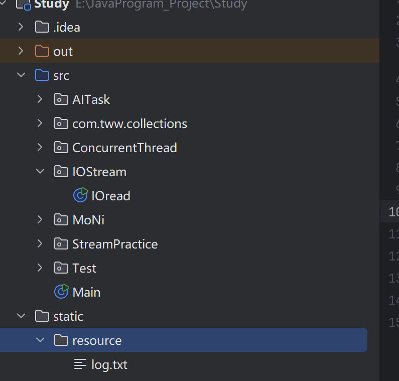

	本章将介绍Java中用于输入和输出的各种应用编程接口（API）。将学习如何访问文件和目录，以及如何以二进制格式和文本格式来读写数据。还要学习对象序列化机制，它可以使存储对象像存储文本和数值数据一样容易。然后将介绍如何使用文件和目录，最后本章节会讨论正则表达式（它处理字符串很有用）


## 2.1 输入输出流

​	在`Java API`中，可以从来源中读取一个字节序列的对象称作输入流，而可以向其中写入一个字节序列的对象称作输出流。这些来源可以是：文件、网络连接甚至是内存块。抽象类`InputStream`和`OutputStream`构成了输入/输出（`I/O`）类层次结构的基本。

> ​	注意，输入输出流与前一章的流没有任何关系

​	因为面向字节的输入/输出流不便处理以Unicode形式存储的信息（Unicode每个字符都使用了多个字节来标识），所以从抽象类`Reader、Writer`中继承出来了一个专门用于处理`Unicode`字符的单独的类层次结构。这些类用于的读入和写出操作都是基于梁子杰的Char值（即Unicode码元），而不是基于byte值。


#### 2.1.1 读取字节_read()_

​	`InputStream`类与一个抽象方法：

```java
abstract int read();
```

​	这个方法读入一个字节，并返回读入的字节，或者在遇见输入源结尾时返回-1。

​	在实现类`FileInputStream`中，这个方法将从某个文件中读入字节。而`System.in`(它是`InputStream`的一个子类的预定义对象)却是从“标准输入”中读取信息，即从控制台或重定向的文件中读入信息。

​	`InputStream`类与一个非常有用的可以读取流中所有字节的方法：

```java
//in是首先抽象类InputStream的子类
byte[] bytes = in.readAllBytes();
```

​	还有多个用来读取给定数量字节的方法，参见API说明。而这些方法都要调用抽象的`read()`方法，因此各个子类只需要覆盖这一个方法。


​	与`InputStream`类似，`Output`类定义了下面的抽象方法：

```java
abstract void write(int b)
```

​	它可以向输出位置写出一个字节。如果我们有一个字节数组，那么就可以一次性地写出它们：

```java
byte[] values = ....;
out.write(values);
```

​	`transferto`方法可以将所有字节从一个输入流传递到输出流：

```java
in.transferto(out);
```

​	`read`和`write`方法在执行时都将阻塞，read方法直至字节确实被读入，write方法直至字节确实被写出。这样意味着流不能被立即访问，那么当前线程将被阻塞。这使得在这两个方法等待的指定的流变为可用的这段时间里，其他的线程就有集合去执行有用的工作。

​	

​	`available`方法可以去检查当前可读入的字节数量。下面的代码不可能被阻塞：

```java
int bytesAvailable = in.available();
if(bytesAvailable >0)
{
    var data = new byte[bytesAvailable];
    in.read(data);
}
```

​	首先检查可读入的字节数量是否大于0，大于0才创建`byte`输出去存储要读入的字节，最后用`in.read(data)`将输入源中的一个字节读入`data`数组。


​	当你完成对输入/输出流的读写时，应该通过调用`close`方法来关闭它。关闭一个输出流的同时还会冲刷改输出流的缓冲区。还可以用`flush`方法来人为地冲刷这些输出。

​	即时某个输入/输出流提供了原生的`read`和`write`功能的某些具体方法，应用系统的程序员还是很少使用它们，因为更多处理的数据可能包含数组、字符串和对象，而不是原生字节。

​	我们可以使用众多的构建于基本的`InputStream`和`OutputStream`两个抽象类之上的某个输出/输出字类，而不是直接使用字节。

​	

**`java.io.InputStream`**

```java
abstract int read()
    从数据源中读入一个字节，并返回该字节,碰到输入流的结尾时返回-1.
int read(byte[] b)
    读入一个字节数组，并返回实际读入的字节数。这个read方法最多读入b.length个字节。碰到输入流的结尾时返回-1.
int read(byte[] b, int off, int len)
int readNBytes(byte[] b, int off, int len) 9
如果未阻塞（read），则读入由 len 指定数量的字节，或者阻塞至所有的值都被读入（readNBytes）。读入的值将置于 b 中从 off 开始的位置。返回实际读入的字节数，或者在碰到输入流的结尾时返回 -1。

byte[] readAllBytes() 9
产生一个数组，包含可以从当前流中读入的所有字节。

long transferTo(OutputStream out) 9
将当前输入流中的所有字节传送到给定的输出流，返回传递的字节数。这两个流都不应该处于关闭状态。

long skip(long n)
尝试在输入流中跳过 n 个字节，返回实际跳过的字节数（出于某种原因，可能会小于 n）。

long skipNBytes(long n) 12
在输入流中跳过 n 个字节，返回实际跳过的字节数（如果碰到输入流的结尾，则可能小于 n）。

int available()
返回在不阻塞的情况下可获取的字节数（回忆一下，阻塞意味着当前线程将失去它资源的占用）。

void close()
关闭这个输入流。

void mark(int readLimit)
在输入流的当前位置打一个标记（并非所有的流都支持这个特性）。如果从输入流中已经读入的字节多于 readLimit 个，则这个流允许忽略这个标记。

void reset()
返回到最后一个标记，随后对 read 的调用将重新读入这些字节。如果当前没有任何标记，则这个流不被重置。

boolean markSupported()
如果这个流支持打标记，则返回 true。

static InputStream nullInputStream() 11
返回一个不包含任何字节的输入流。
```

**`java.io.OutputStream`**

```java
abstract void write(int n)
写出一个字节的数据。
void write(byte[] b)
写出字节数组中的所有字节。
void write(byte[] b, int off, int len)
写出字节数组中从 off 开始、长度为 len 的字节。
void close()
冲刷并关闭输出流。
void flush()
冲刷输出流，将缓冲数据发送到目的地。
static OutputStream nullOutputStream()
返回一个会丢弃所有字节的输出流。
```


#### 2.1.2  完整的流家族

​	Java拥有一个流家族，包含各种输入/输出流类型，其数量超过60个。

​	以使用方法来划分，就形成了**处理字节**和**字符**两个单独的层次结构，`InputStream`和`OutputStream`类可以读写单个字节或字节数组。想要读写字符串和数字，就需要功能更强大的字类。如：**`DataInputStream`和`DataOutputStream`**可以以二进制格式读取所有的基本Java类型。还有很多输出输出流，`ZipInputStream`和`ZipOutputStream`可以读取常见的`zip`压缩格式的文件。

​	

​	对于`Unicode`文本（即字符），可以使用抽象类`Reader`和`Write`的子类。他们有下面两个抽象方法

```java
abstract int read(); // Reader
abstract void write(int c); //Writer
```

​	其中，`read`方法将返回一个`UTF-16`码元（一个在0~65535之间的整数）。`write`方法在被调用时，需要传递一个`Unicode`码元。

​	

​	这几个接口：`Closeable、Flushable、Readable和Appendable`。

​	**`Closeable`接口**几乎所有的I/O类都实现了该接口，用于关闭资源。抽象方法如下：

```java
void close() throws IOException
```

​	

​	**`Flushable`接口**被输出流（`OutputStream`和`Writer`）实现了该接口。用于刷新缓冲区

```java
void flush() throws IOException
```

​	

​	**`Readable`接口**只有一个方法：

```java
int read(CharBuffer cb)
```

​	注意参数里的`CharBuffer`类，它拥有按顺序和随机地进行读写访问的方法，它表示一个内存中的缓冲区或者一个内存映像的文件。它是装字符的一个容器

​	实现了`Readable`接口的类就可以拥有吧字符读入`CharBuffer`中。


​	**`Appendable`**接口有两个添加单个字符和字符序列的方法：

```java
Appendable append(char c);
Appendable append(CharSequence s)
```

​	`CharSequence`接口描述了一个`char`值的基本属性，`String、CharBuffer、StringBuilder和StringBuffer`都实现类它。

​	在I/O流家族中，只有`Writer(即输出字符流的顶层抽象类)`实现了`Appendable`。

**`java.io.Closeable`**  

```java
void close()
    用来关闭实现类的资源
```

**`java.io.Flushable`**

```java
void flush()
    该方法用来刷新缓冲区。只有输出流类可以实现，所以，该方法是用来刷新输出流的缓冲区
```

**`java.lang.Readable`**

```java
int read(CharBuffer cb)
    常识将字符读入cb缓冲区，返回读入的char值的数量，或者当从这个Readable(接口的实现类)中无法再获得更多值时返回-1。
```

**`java.lang.Appendable`**

```java
Appendable append(char c)
Appendable append(CharSequence s)
    向这个Appendable中追加给定的码元或给定的序列的所有码元。返回this（指带该接口的实现类）
```

**`java.lang.CharSequence`**

```java
char charAt(int index)
    返回给定索引的码元（UTF-16码元）。对于99%的字符，该方法返回的char值就是该字符的Unicode码点（十进制数值）。而对于增补字符（Emoji表情、生僻汉字、特殊符号），chatAt返回的知识半个字符的编码字段，因为增补字符一般用两个Unicode码点表示。所以对于增补字符，chatAt(0)代表高代理项，charAt(1)代表低代理项
int length()
    返回这个序列中的码元的数量。
CharSequence subSequence(int startIndex,int endIndex)
    返回由存储在startIndex到endIndex-1处的所有码元构成的CharSequence
String toString()
    返回这个序列中所有码元构成的字符串
default IntStream chars()
    返回一个由UTF-16码元组成的流，每个值是一个int值。对于基本的字符，流的一个元素代表一个完整字符。但对于增补字符不能正确的处理，只是将构成增补字符的两个码元当成独立的int值放入流，不做任何处理
default IntStream codePoints()
    基于Unicode码点的流。将字符序列中的完整的Unicode字符(即码点)作为一个Int值，生成一个IntStream。对于基本字符，和chars一样，流的一个元素代表一个完整字符。对于增补字符，它会智能地组成对的代理型，并将其解码成最终的Unicode码点值。
default int codePointAt(int index)
    正确获取字符串中指定位置的完整Unicode码点值
```

​	`CharSequence`该接口代表着一种**可随机访问的、只读的字符序列的能力**，它本身也代表这一个字符串序列，所有的字符串类都实现了该接口。

​	对于Unicode字符集，码点代表着每个字符的唯一的数字。例如英文字符“A”的码点是U+0041，Unicode标准定义了多种编码方式，如`UTF-8、UTF-16和UTF-32`，其中UTF-8是最常用的编码方式。但需注意，这里chars以及charAt()方法采用的是UTF-16标准。

​	Java中的char类型和`charAt()、chars()`等方法均基于UTF-16标准。要正确的处理所有`Unicode字符`，应使用`codePointAt()`和`codePoints()`方法。

​	

#### 2.1.3 组合输入/输出流过滤器

​	大多数输入输出流类的构造器都需要传入一个文件，通常使用本地文件的路径来指定文件，下面介绍在Windows中路径的用法：

​	路径分为两类：绝对路径和相对路径。

​	绝对路径：从盘符根目录开始的完整路径，固定且唯一。缺点是不可以移植，因为每个人电脑上的目录结构都是不一样的，不能保证同样的路径下有相同的文件，所以大多数时候都是使用相对路径

​	**相对路径**：相对于当前工作目录的路径，不包含盘符跟目录，而是通过`.(当前目录)和..（上级目录）来定位文件`。下面来举一个比较经典的例子，在项目中，需要一个文件输入流来访问文件中的内容。项目结构如下：



​	假设，我们在IOread类中去访问resource文件夹下的log。那么相对路径为：

```java
"../../static/resource/log.txt"
```

​	但需要注意，**从IDEA运行项目时，工作目录就是项目本身，即项目根目录。**在上面的示例中，可以直接访问`static/resource/log.txt`；

​	可以运行下面这行代码，查看当前项目的工作目录：

```java
System.out.println("当前工作目录: " + System.getProperty("user.dir"));
```

> 由于反斜杠字符“ \ ”在Java字符串中是转义字符，因此要确保在Windows风格的路径名中使用`\\`（例如，C:\\Windows\\win.ini）。Windows中也可以使用反斜杠字符`/`。但是并不推荐这样做，对于可移植的程序来说，应该使用程序所运行平台的文件分隔符，可以通过常量字符串`java.io.File.separator`来获得它。示例：
>
> ```
> import java.io.*;
> ...
> String path = "data" + File.separator + "file.txt";
> // Windows 下自动变成: data\file.txt
> // Linux 下自动变成:   data/file.txt
> ...
> ```


​	`FileInputStream`和`FileOutputStream`可以提供附着在一个磁盘文件上的输入流和输出流，只需要向其构造器提供文件名或文件的完整路径名。例如：

```java
var fin = new FileInpuStream("employee.dat");
```

​	运这行代码可以查看用当前文件夹下名为“employee.dat”的文件。

​	这两个类是由抽象类`InputStream`和`OutputStream`一样，这些类只支持在字节级别上的读写，也就是说，**我们只能从fin对象中读入字节和字节数组**

```java
byte b = (byte)fin.read();
```

​	`DataInputStream`只能读入数值类型

```java
DataInputStream din = ...;
double x = din.readDouble();
```

​	正如`FileInputStream`没有任何读入数值类型方法一样，`DataInputStream`也没有任何方法从文件中获取数据的方法。

​	`Java`使用这样的机制分离了这两种职责。例如，为了从文件中读入数字，首先需要创建一个`FileInputStream`，然后将其传递给`DataInputStream`的构造器。

```java
var fin = new FileInputStream("employee.dat");
var din = new DataInputStream(fin);
double x = din.readDouble();
```


​	**可以通过嵌套过滤器来添加多重功能**：

```java
DtaInputStream din = new DataInputStream(
	new BufferdInputStream(
    	new FileInputStream("emoloyee.dat")));
```

​	第一层`FileInputStream`类提供从文件读取单个字节的基本能力，第二层`BufferdInputStream`增加内部缓冲区，将多次小读取合并为少量大读取，提升性能，第三层`DataInputStream`增加读取基本数据类型的方法，能从字节流中直接解析出结构化数据。

​	顺序不能换， 必须先有字节流，再在它的基础上叠加缓冲、数据解析等。

​	

​	有时多个输入流链接在一起时，需要跟着各个中介输入流。例如，当读入输入时，经常需要预览下一个字节，了解它是否是你想要的值，使用`PushbackInputStream`类来实现此目的：

```java
var pbin = new PushbackInputStream(
	new BufferInputStream(
    	new FileInputStream("employee.dat")));
```

​	现在可以预读一个字节，如果是并非期望的值，将其推回流中。

```java
int b = pib.read();
if(b!= '<')
    pbin.unread(b);
```

​	如果你希望能够预先浏览并且还可以读入数字。那么就需要一个既是一个可回推输入流，又是一个数据输入流的引用。

```java
var pbin = new PushbackInputStream(
	new BufferInputStream(
    	new FileInputStream("employee.dat")));
var bping = new DataInputStream(pbin);
```

​	

**`java.io.FileInputStream`**

```java
FileInputStream(String name)
    通过给定的文件路径名字符串创建文件输入流。路径可以是绝对路径，也可以是相对于虚拟机工作目录的相对路径。
FileInputStream(File file)
    通过 File 对象所指定的文件创建文件输入流。路径解析规则与 FileInputStream(String name) 一致。
int read()
    从文件中读入一个字节。	
```

**`java.io.FileOutputStream`**

```java
FileOutputStream(String name)
FileOutputStream(String name, boolean append)
FileOutputStream(File file)
FileOutputStream(File file, boolean append)
使用由 name 字符串或 file 对象指定路径名的文件创建一个新的文件输出流（File 类在本章结尾处描述）。如果 append 参数为 true，那么数据将被添加到文件尾，而具有相同名字的已有文件不会被删除；否则，这个方法会删除所有具有相同名字的已有文件。
```

**`java.io.BufferedInputStream`**

```java
BufferedInputStream(InputStream in)
    创建一个带缓冲区的输入流，带缓冲区的输入流在从输入流中读入字符，不会每次都产生一次设备访问操作。当缓冲区为空时，会向缓冲区读入一个新的数据库
```

**`java.io.PushbackInputStream`**

```java
PushbackInputStream(InputStream in)
PushbackInputStream(InputStream in, int size)
构建一个可以预览一个字节或者具有指定尺寸的回推缓冲区的输入流。

void unread(int b)
回推一个字节，它可以在下次调用 read 时被再次获取。
```


#### 2.1.4 文本输入与输出（OutputStreamWriter、InputStreamReader）

​	在保存数据时，可以选择二进制格式或文本格式。例如，整数1234存储成二进制时，会被写为由字节00 00 04 D2构成的序列，而存储成文本格式时，则会被存成字符串`"1234"`。

​	现在先讨论文本格式的IO。

​	在存储文本字符串时，需要考虑字符编码方式。在Java内部使用的是`UTF-16`编码。但许多程序希望文本文件按照其他方式编码。`UTF-8`是互联网上最上用的编码方式。

​	`OutputStreamWriter`类使用选定的字符编码方式，把`Unicode`码元的输出流转化为字节流。

​	而`InputStreamReader`类将包含字节的输入流转化为可以产生的Unicode字符流，最后，我们通过将码点转化为字符输出在控制台

```java
    public static void main(String[] args) throws IOException {

        InputStreamReader in =  new InputStreamReader(new FileInputStream("static/resource/log.txt"), StandardCharsets.UTF_8);

        //现在in是一个包含Unicode码点流
        int ch;
        while((ch=in.read()) !=-1){
            //将它强制转化为char
            System.out.print((char)ch);
        }
    }
```

​	对于增补字符的码点，需要进行特殊处理，可以通过将码点读入数组，再输出，就可以正确输出增补字符了：

```java
       InputStreamReader in =  new InputStreamReader(new FileInputStream("static/resource/log.txt"), StandardCharsets.UTF_8);

        //现在in是一个包含Unicode码点流
        char []ch = new char[1024];
        int len;
        while(( len=in.read(ch)) !=-1 ){
            System.out.print(new String(ch,0,len));
        }
```

​	`OutputStreamWriter`可以直接将字符写入文件。由于在Java内部的字符串使用Unicode的UTF-16标准表示，所以可以直观的把字符串看成Unicode字符流，`OutputStreamWriter`将这个Unicode流转化为字节流，最后通过`FuleOutputStream`类赋予的能力，将字节写入文件。

```java
try (OutputStreamWriter writer = new OutputStreamWriter(
        new FileOutputStream("static/resource/OutTest.txt"), 
        StandardCharsets.UTF_8)) {
    
    // writer 的作用域：仅在这个 try 块内部
    writer.write("你好，世界！🌍");
    
} // 此处自动调用 writer.close()
```


#### 2.1.5 如何写出文本输出（PrintWriter）

​	对于文本输出，可以使用`PrintWriter`。

```java
    public static void main(String[] args) throws IOException {
        PrintWriter out = new PrintWriter("employee.txt", StandardCharsets.UTF_8);
        String name = "Harry Hacker";
        double salary = 75000;
        out.print(name);
        out.print(" ");
        out.print(salary);

        out.close();
    }
```

​	这里的`out.print`方法其实和`System.out.print`类似，只不过输出目标修改成了`PrintWriter`类。另外，需要使用`close()和flush()`方法才能在文件中看见输出，如果没有这个方法，那么输出很可能待在缓存区。

​	上面的代码把`Harry Hacker 75000`输出到写出器`out`，之后这些字符将会转化成字节并最终写入`employee.txt`中。

​	如果写出器设置为自动冲刷模式，那么只要`println`被调用，缓存区中的所有字符都将被发送到它们的目的地（打印写出器总是带缓冲区的）。**默认情况下，自动冲刷机制是禁用的**，可以通过构造器`PrintWriter(Writer writer,boolean autoFlush)` 都参数设置启用或禁用：

```java
var out = new PrintWriter(
	new OutputStream(new FileOutputStream("employee.txt"),StandardCharsets.UTF_8),
	true); //autoflush
```

​	在这行代码中，通过嵌套过滤器的方式赋予这个类灵活的能力。第一层赋予了它向文件写入字节的能力，第二层赋予了它把字节转化为Unicode编码（等同于字符）的能力，并且指定类字符编码方式`UTF_8`。最后在第三层，也就是`PrintWriter`的构造器里，将它的第二个参数`boolean autoFlush`设置为了`true`。

​	所以这个实例，拥有了将字符输出到文件的能力，并且每次`println、printf()`被调用就会把缓冲区清空，把字符以字节形式发送文件。

**`java.io.PrintWriter`**

```java
//构造方法
PrintWriter(Writer out)
	通过传入 Writer 的不同子类（或装饰后的 Writer 实例），可以控制 PrintWriter 的输出目的地、字符编码、缓冲策略等底层行为，从而灵活地适应各种输出场景;
PrintWriter(String filename,String encoding)
PrintWriter(File file,String encoding)
   创建一个向指定文件（路径名或 File 对象）写入的 PrintWriter，使用给定的字符编码。该构造器内部会自动创建 OutputStreamWriter 和 FileOutputStream，从而具备将字符按指定编码转换为字节并写入文件的能力;
//公开方法
void print(Object obj)
    打印obj.toString参数的字符串
void print(String s)
    打印一个包含Unicode码元的字符串;
void println(String s)
    打印一个字符串，后面紧跟一个行终止符。如果流出于自动冲刷模式，那么就会冲刷这个流。
void print(char[] s)
    打印一个数组中的所有Unicode码元;
void print(char c)
    打印一个Unicode码元;
void print(xxx n) //xxx是基本类型
    以文本格式打印给定的值
void printf(String format,Object... args)
    按照格式字符串指定的方式打印给定的值。
boolean checkError()
    用于刷新当前流并检查是否发生过错误（如 IO 异常、编码异常等）。如果发生任何错误，返回 true；否则返回 false。
```


#### 2.1.6 如何读入文本输入

​	最简单的读入文本就是`Scanner`类，可以从任何输出流中构建Scanner对象。

​	或者，也可以将短小的文本文件读入到一个字符串中：

```java
String content = Files.readString(path,charset);
```

​	但是，如果想要将这个文件一行行地读入，可以调用：

```java
List<String> lines = Files.readAllLines(path,charset);
```

​	如果文件太大，可以将行惰性（终端操作才执行）处理为一个`Stream<String>`对象：

```java
try(Stream<String> lines = Files.lines(path,charset))
{
    ....
}
```

​	

​	`useDelimiter`方法可以设置分隔符，字符串默认的分隔符可能是空白，换行。还可以将分隔符修改为任意的正则表达式：

```java
Scanner in = new Scanner(....);
in.useDelimiter("\\PL+");
```

​	将接收任何非Unicode字母作为分隔符，之后，这个扫描器（in）将只接收`Unicode`字母。比如面对输入：`Hello123World`，将被分为`[Hello,World]`;

​	调用`next`方法获得分隔之后的元素：

```java
String word = in.next(); //Hello
```

​	或者调用`tokens()`获取包含所有符号的流。

```java
Stream<String> words = in.tokens(); //Hello World
```

​	

​	在早期的`Java`版本中，处理文本输入的唯一方式是通过`BufferedReader类`，它有着读入一行文本的能力，内部通过维护一个字节大小为`8192（16kb）`大小的缓冲区。它的`readLine()`方法会从文件中读入一行文本，在无法获取更多的输入是返回null。

​	如果想通过`BufferedReader`读入文件中的 所有字符，典型的输入循环看起来像这样。

```java
InputStream inputStream = ....; //基础输入抽象类，提供read()方法读入一个字节
try(var in = new BufferedReader(new InputStreamReader(inputStream,charset))){
    //InputStreamReader将字节流转化为字符流
    boolean done = false;
    while(!done){ //done为true时停止循环
        String line = in.readLine();
        if(line==null)
            done = true;
        else
        {
            do something with line
        }
    }
}
```

​	如果，`BufferedReader`类又有类一个`Lines`方法。可以产生一个`Stream<String>`对象。但与`Scanner`不同，`BufferedReader`没有任何用于读入数字的方法。

​	


#### 2.1.7 以文本格式存储对象

​	下面介绍一个示例程序，它将一个Employee记录数组存储成了一个文本文件。其中每条记录都保存成单独的一行。而实例字段彼此之间使用一个竖线（|）作为分隔符。

​	下面是一个记录的样本：

```java
Harry Hacker|3550|1989-10-01
Carl Cracker|75000|1987-12-15
Tony Tester|38000|1990-03-15
```

​	我们使用`PrintWriter`类负责向文件输出。每个字段跟着一个|，而最后一个字段后面跟着一个换行符。这项工作是在下面添加到`Employee`类的`writeEmployee`方法里完成的：

```java
public static void writerEmployee(PrintWriter out ,Employee e)
{
    out.println(e.getName+"|"+e.getSalary()+"|"+e.getHireDay());
}
```

​	为了读入记录，每次读入一行，将这一行使用`String.split`方法将这一行断开成一组符号。

```java
public static Employee readEmployee(Scanner in){
    String line = in.nextLine();
    String[] tokens = line.split("\\|");
    String name = tokens[0];
    double salar = Double.paeseDouble(tokens[1]);
    LocalDate hireDate = LocalDate.parse(tokens[2]);
    int year = hireDate.getYear();
    int month = hireDate.getMonthValue();
    int day = hireDate.getDayOfMonth();
    return new Employee(name,salary,year,month,day);
}
```

​	`spilit`方法的参数是一个描述分隔符的正则表达式，碰巧的是，竖线在正则表达式中具有特殊的含义，因此需要用\字符来专业，而这个\又需要用另一个来\来转移，就产生了`\\|`表达式。

​	下面是程序示例：

```java
package IOStream;

import java.io.FileInputStream;
import java.io.IOException;
import java.io.PrintWriter;
import java.nio.charset.StandardCharsets;
import java.time.LocalDate;
import java.util.Scanner;

public class File_in {
    public static void main(String[] args) throws IOException {
        var staff = new Employee[3];
        staff[0] = new Employee("Carl cracker",75000,1987,12,15);
        staff[1] = new Employee("Harry Hacker",50000,1989,10,1);
        staff[2] = new Employee("Tony Tester",40000,1990,3,15);

        //将程序内存中的数据写入文件
        try(var out =new PrintWriter("employee.dat", StandardCharsets.UTF_8)){
            writeDate(staff,out);
        }

        try(var in = new Scanner(new FileInputStream("employee.dat"),"UTF-8")){
            Employee[] newStaff = readDate(in);
            //输出这个数组
            for(Employee e:newStaff)
                System.out.println(e);
        }
    }


    //先写入这个数组的长度，在写入每个数组元素的属性
    public static void writeDate(Employee[] employee, PrintWriter out) throws IOException{
        out.println(employee.length);

        for(Employee e:employee)
            writeEmployee(out,e);
    }

    private  static Employee[] readDate(Scanner in){
        int n = in.nextInt();
        in.nextLine();//清空缓冲区
        var employees = new Employee[n];
        for(int i=0;i<n;i++){
            employees[i] = readEmployee(in);
        }

        return employees;
    }

    //将Employee以特定格式写入
    public static void writeEmployee(PrintWriter out,Employee e)
    {
        out.println(e.getName()+"|"+e.getSalary()+"|"+e.getHireDate());
    }

    //从键盘读入Employee类的竖线
    public static Employee readEmployee(Scanner in){
        String line = in.nextLine();
        String[] tokens = line.split("\\|");
        String name = tokens[0];
        double salary = Double.parseDouble(tokens[1]);
        LocalDate hireDate = LocalDate.parse(tokens[2]);
        int year = hireDate.getYear();
        int month = hireDate.getMonthValue();
        int day = hireDate.getDayOfMonth();
        return new Employee(name,salary,year,month,day);
    }
}

```


#### 2.1.8 字符编码方式

​	Java针对字符使用的是`Unicode`标准。

​	`StndardCharsets`类具有类型为`Charset`的静态变量，用于表示每种Java虚拟机都必须支持的字符编码方式：

```java
StandardCharsets.UTF_8
StandardCharsets.UTF_16
StandardCharsets.UTF_16BE
StandardCharsets.UTF_16LE
StandardCharsets.ISO_8859_1
StandardCharsets.US_ASCII
```

​	为了获取另一种编码方式的`Charset`，可以使用静态的`forName`方法：

```java
Charset shiftJIS = Charset.forName("Shift-JIS");
```

​	可以像下面一样将一个字节数组转化为字符串：

```java
var str = new String(bytes,StandardCharsets.UTF_8);
```

​	


## 2.2 读写二进制数据

​	文本格式对于测试和调试而言会更方便，因为它是人类可阅读的，**但它并不像以二进制格式传递数据那样高效**。下面将学习如何用二进制数据来完成输入和输出。


#### 2.2.1 `DataInput`和`DataOutput`接口

​	`DataOutput`接口定义下面用于以二进制格式写数组、字符、boolean值和字符串的方法：

```java
writerChars  writeFloat
wirteByte    wirteDouble
writeInt     writeChar
writeShort   writeBoolean
writeLong    writeUTF
```

​	`writeInt`总是将一个整数写出为4字节的二进制数量值，而不管它有多少位，这样产生的结果并非人可阅读的，但对于给定类型的每个值，使用的空间都是相同的。

​	为了读回数据（即输入），可以使用`DataInput`接口中定义的方法：

```java
readInt   readDouble
readShort readChar
readLong  readBoolean
readFloat readUTF
```

​	

​	`DataInputStream`类实现类`DataInput`接口，为了从文件中读入二进制数据，可以将`DataInputStream`与某个字节源相组合，例如`FileInputStream`:

```java
var in = new DataInputStream(new FileInputStream("data.dat"));
```

​	与此类似，想要写出二进制数据，可以使用实现类`DataOutput`接口的`DataOutputStream`类：

```java
var out = new DataOutputStream(new FileOutputStream("data.dat"));
```

​	下面是一个简单的示例程序：

```java
    public static void main(String[] args) throws IOException {
        var out = new DataOutputStream(new FileOutputStream("static/resource/data.dat"));

        //向文件写入整数
        out.writeInt(100);

        var in = new DataInputStream(new FileInputStream("static/resource/data.dat"));

        int number = in.readInt();

        System.out.println("从data.dat读入的数据："+number);
    }
```

​	


#### 2.2.3 随机访问文件

​	`RandomAccessFile`类可以在文件中的**任何位置读取或写入数据**。可以打开 一个随机访问文件，在构造器都第二个参数指定模式：

> 随机访问文件：指**可以在文件中的任意位置直接进行读取或写入操作**的文件，通过`RandomAccessFile`类创建

- `"r"`: 只读模式
- `"rw"`:读写模式（若文件不存在则创建）

```java
var in = new RandomAccessFile("employee.dat","r");
var inOut = new RandomAccessFile("employee.dat","rw");
```

​	当年将已有文件作为`RandomAccessFile`打开时，这个文件不会删除


​	随机访问文件**有一个表示下一个将被读入或写入的字节所处位置的文件这种**，`seek`方法可以用来将这个文件指针设置到文件中的任意字节位置。`seek`的参数是一个long类型的数，它的值位于0到文件按照字节来度量的长度之间。

​	`getFilePointer`方法将返回文件指针的当前位置。

​	

​	`RandomAccessFile`类同时实现了`DataInput`和`DataOutput`接口，为了读写随机访问文件，可以使用在前面小节中讨论过的诸如：

`readInt/WriteInt和readChar/writeChar`之类的方法。

​	现在剖析一个将雇员记录存储到随机访问文件中的示例程序，其中每条记录都拥有相同的大小，这样很容易地读入任何记录。假设你希望将文件指针置于第三条记录处，那么只需要将文件指针置于恰当的字节位置，就可以开始读入了

```java
long n=3;
in.seek((n-1)*RECORD_SIZE); //移动文件指针至第三条记录处
var e = new Employee();
e.readDate(in);//将文件存储的数据读入对象
```

​	

​	如果希望修改文件中的记录，然后将其存到相同的位置，那么就要将文件指针置于这条记录的开始处：

```java
in.seek((n-1)*RECORE_SIZE);
e.writeDate(out);
```

​	可以把随机访问文件理解为一个数组。文件指针是下标，从0开始。元素是事先约定好的字节，比如这里的元素就是RECORE_SIZE个字节。写入后会覆盖原处的记录，达到修改的目的。

​	

​	要确定文件的字节总数，可以使用`length`方法，而记录的总数则等于用字节数除以每条记录的大小：

```java
long nbytes = in.length();
int nrecords = (int)(nbytes/RECORD_SIZE);
```

​	

​	整数和浮点数在二进制中都有固定的大小，整数是4字节，浮点数是8字节。而字符串的字节数却不是固定大小，会随着字符串长度的增大而增大。所以在可以在`DateIo`助手类的内部有两个方法来读写具有固定尺寸的字符串：

​	`writeFiexdString`写出字符串开头开始的指定数量的码元（如果码元过少，将用0值来补齐字符串）

```java
public static void writeFixedSring(String s, int size,DataOutput out)
	throws IOException
{
    for(int i=0;i<size;i++){
        char ch=0;
        if(i<s.length())
            ch = s.charAt(i);
        out.writeChar(ch);
    }
}
```

​	`readFiexdString`方法从输入流中读入字符，直至读入`size`个码元，或者直至遇到具有0值的字符值，然后跳过输入字段中剩余的0值。为了提高效率，这个方法使用了`StringBuilder`类来读入字符串

```java
public static String readFiexdString(int size,DataInput in)
    throws IOException
{
    var b = new StringBuilder(size);
    int i=0;
    var done = false;
    while(!done && i<size){
        char ch = in.readChar(); //获取字符
        i++;
        if(ch==0) 
            done = true;
        else 
            b.append(ch);
    }
    in.skipBytes(2*(size-i)); //跳过剩余的填充零字符
    return b.toString(); //返回字符串
}
```


​	为了在文件中写出一条固定尺寸的记录，我们直接以二进制方式写出所有的字段：

```java
DataIO.writeFixedString(e.getName,Emploee.NAME_SIZE,out);
out.writeDouble(e.getSalary());
LocalDate hireDay = e.getHireDay();
out.writeInt(hireDay.getYear());
out.writeInt(hireDay.getMonthValue());
out.writeInt(hireDay.getDayofMonth());
```

​	读回数据也很简单：

```java
String name = DataIO.readFixedString(Employee.NAME_SIZE.in);
double salar = in.readDouble();
int y = in.readInt();
int m = in.readInt();
int d = in.readInt();
```

​	现在计算每条记录的大小，我们将使用40个字符来表示字符串。因此，每条记录包含100个字节：

- 40字符=80字节，用于项目
- 1double = 8字节，用于薪水。
- 3int = 12字节，用于日期。


​	下面的程序将三条记录写到了一个数据文件中，然后以逆序将它们从文件中读回。为了高效地执行，这里需要使用随机访问。因为我们需要首先读入第三条记录：

```java
package IOStream;

import java.io.*;
import java.time.LocalDate;

public class Test_RandomAccessFile {
    public static void main(String[] args) throws IOException {
        var staff = new Employee[3];
        staff[0] = new Employee("Carl cracker",75000,1987,12,15);
        staff[1] = new Employee("Harry Hacker",50000,1989,10,1);
        staff[2] = new Employee("Tony Tester",40000,1990,3,15);

        //通过DataOutputStream（负责将数据转化为字节序列），FileOutputStream将这些字节写入目的地
        try(var out = new DataOutputStream(new FileOutputStream("employee.dat"))){
            for(Employee e:staff)
                writeData(out,e);
        }

        //读取该文件中的内容，可以从任意位置开始读取
        try(var in = new RandomAccessFile("employee.dat","r")){
            int n = (int)(in.length()/Employee.RECORD_SIZE);
            var newStaff = new Employee[n];
            //逆序访问文件，从最后一条记录开始
            for(int i=n-1;i>=0;i--){
                newStaff[i] = new Employee();
                in.seek((long) i *Employee.RECORD_SIZE);//跳到最后一个记录开始处
                newStaff[i] = readData(in); //读取这条记录
            }

            for(Employee e: newStaff){
                System.out.println(e);
            }
        }


    }


    //将employee对象写入输出器
    public static void writeData(DataOutput out ,Employee e) throws  IOException{
        //写入固定大小字符串
        DataIO.writeFixedString(e.getName(),Employee.NAME_SIZE,out);
        out.writeDouble(e.getSalary());
        LocalDate hireDay = e.getHireDate();
        out.writeInt(hireDay.getYear());
        out.writeInt(hireDay.getMonthValue());
        out.writeInt(hireDay.getDayOfMonth());

    }

    //从文件中读入对应数值，根据数组返回实例
    public static Employee readData(DataInput in) throws  IOException{
        String name = DataIO.readFiexdString(Employee.NAME_SIZE,in); //
        double salary = in.readDouble();
        int y = in.readInt();
        int m = in.readInt();
        int d = in.readInt();
        return new Employee(name,salary,y,m,d);
    }
}


class DataIO{

    //向文件写入固定大小字符串
    public static void writeFixedString(String s, int size, DataOutput out)
            throws IOException
    {
        for(int i=0;i<size;i++){
            char ch=0;
            if(i<s.length())
                ch = s.charAt(i);
            out.writeChar(ch);
        }
    }


    //从文件中读入固定大小的字符串
    public static String readFiexdString(int size,DataInput in)
            throws IOException
    {
        var b = new StringBuilder(size);
        int i=0;
        var done = false;
        while(!done && i<size){
            char ch = in.readChar(); //获取字符
            i++;
            if(ch==0)
                done = true;
            else
                b.append(ch);
        }
        in.skipBytes(2*(size-i)); //跳过剩余的填充零字符
        return b.toString(); //返回字符串
    }
}
```

​	这个程序首先把数组的内容以二进制格式写入到文件中（也就是输出），然后使用随机访问文件从最后一处记录开始访问，把从文件中获取的记录存入newstaff数组。每访问一次回退一次文件指针，回退的大小是`100`字节，也就是实现约定好的记录大小。最后使用`for-Each`语法方式这个逆序数组。


#### 2.2.4 ZIP文档

​	`ZIP`文档以压缩格式存储了一个或多个文件，每个ZIP文档都有一个头，包含诸如每个文件的名字和所使用的压缩方法等信息。在Java中，可以使用`ZipInputStream`来读入`ZIP`文档。

​	当你需要浏览文档中每个单独的项，`getNextEntry`方法就可以返回一个描述这些项的`ZipEntry`对象。`ZipEntry` 对象代表 ZIP 文档中的一个条目（entry），每个条目通常对应一个被压缩的文件，也可以是目录（以 `/` 结尾）。该方法会从流中读入数据直至末尾。

​	每次调用完`getNextEntry`后，都应该调用一次`closeEntry`关这个项，然后继续读入下一项。

```java
package IOStream;

import java.io.FileInputStream;
import java.io.IOException;
import java.nio.charset.Charset;
import java.util.zip.ZipEntry;
import java.util.zip.ZipInputStream;

public class Test_Zip {
    public static void main(String[] args) throws IOException {
        var zin = new ZipInputStream(new FileInputStream("static/resource/MarkDown_Java_Note.zip"), Charset.forName("GBK"));
        boolean done = false;
        while(!done){
            ZipEntry entry = zin.getNextEntry();
            if(entry==null)
                done=true;
            else{
                System.out.println(entry.getName());
                zin.closeEntry();;
            }
        }
        zin.close();
    }
}

```

​	该程序会输出ZIP文档里面的条目名字。

​	`ZipEntry`对象并不存储文件中的实际数据，存储的是该文件的元数据，它通过一些方法获取关键数据，比如：条目名称（目录用\结尾）、压缩大小、未压缩大小、压缩方法等待

> 元数据：描述数据的数据，用于说明数据的结构、来源、属性和使用方式
>
> 

​	要写出到`ZIP`文件，需要使用`ZipOutputStream`，而对于你希望放入到ZIP文件中的每一项，都要创建一个`ZipEntry`对象，并将文件名传递给`ZipEntry`的构造器，它将设置其他诸如文件日期和解压缩方法等参数。

​	然后，需要调用`ZipOutStream`的`putNextEntry`方法来写出新文件，并将这些文件数据发送到输出流中，完成后，需要调用`closeEntry`。下面是代码框架：

```java
//输出的压缩文档
var fout = new FileOutputStream("test.zip");
var zout = new ZipOutputStream(fout);
//for all files
{
    var ze = new ZipEntry(filename);
    zout.putNextEntry(ze);
    
    try (FileInputStream fin = new FileInputStream(filename)) {
        byte[] buffer = new byte[8192];
        int len;
        while ((len = fin.read(buffer)) != -1) {
            zout.write(buffer, 0, len);   // 把数据写入压缩流
        }
	}
    zout.closeEntry();
}
zout.close;
```

​	下面给出一个压缩文件的示例程序：

```java
package IOStream;

import java.io.FileInputStream;
import java.io.FileOutputStream;
import java.io.IOException;
import java.util.zip.ZipEntry;
import java.util.zip.ZipOutputStream;

public class Test_Zip {
    public static void main(String[] args) throws IOException {
       String sourceFile = "static/resource/OutTest.txt";
       String zipFile = "static/resource/data.zip";

       try(var fis = new FileInputStream(sourceFile)){
           var zout = new ZipOutputStream(new FileOutputStream(zipFile));
           //为文件创建一个ZipEntry
           ZipEntry entry = new ZipEntry(sourceFile);
           //将entry放入压缩包
           zout.putNextEntry(entry); //

           //从原始文件读入字节，直接写入zout压缩流（会自动压缩）
           byte []bytes = new byte[8192];
           int len;
           while((len =fis.read(bytes))!=-1){
               zout.write(bytes,0,len);
           }
       }
        
    }
}

```


**`java.util.zip.ZipInputStream`**

```java
ZipInputStream(InputStream in)
    创建一个ZipInputStream，使得我们可以从给定的InputStream向其中填充数据
ZipEntry getNextEntry()
    为下一项返回ZipEntry对象，或者在没有更多的项时返回null
void closeEntry()
    关闭这个ZIP文件当前打开的项，之后可以通过使用getNextEntry()读入下一项
```

**`java.util.zip.ZipOutputStream`**

```java
ZipOutputStream(OutputStream out)
    创建一个将压缩数据写出到指定的Ouputstream的ZipOutputStream
void putNextEntry(ZipEntry ze)
	将给定的ZipEntry中的信息写出到输出流中，并定位用于写出数据的流，然后这些数据可以通过write()写出这个输出流中
void closeEntry()
    关闭这个Zip文件中打开的项，使用putNextEntry方法可以开始下一项
void setLevel(int vel)
    将后续的各个DEFALTED项的默认压缩级别设置为从Deflater.NO_COMPRESSION到Delater.BEST_COMPRESSION中的某个值，默认值是Deflater.NO_COMPRESSION，如果级别无效，则抛出IllegalArgumentException
void setMethod(int method)
    设置用于这个ZipOutputStream的默认压缩方法，这个压缩方法会作用于所有没有指定压缩方法的项，methond可以是DEFLATED或STORED
```

**`java.util.zip.ZipEntry`**

```java
ZipEntry(String name)
    用给定的名字构建一个 ZIP 项。

long getCrc()
    返回用于这个 ZipEntry 的 CRC32 校验和的值。

String getName()
    返回这一项的名字。

long getSize()
    返回这一项未压缩的尺寸，或者在未压缩的尺寸不可知的情况下返回 -1。

boolean isDirectory()
    当这一项是目录时返回 true。

void setMethod(int method)
    设置用于这一项的压缩方法，必须是 DEFLATED 或 STORED。

void setSize(long size)
    设置这一项的尺寸，只有在压缩方法是 STORED 时才是必需的。

void setCrc(long crc)
    给这一项设置 CRC32 校验和，这个校验和是使用 CRC32 类计算的。只有在压缩方法是 STORED 时才是必需的。
```

**`java.util.zip.ZipFile`**

```java
ZipFile(String name)
    创建一个 ZipFile，用于从给定字符串所表示的**文件路径**中读入数据（即打开该 ZIP 文件）。
ZipFile(File file)
    创建一个 ZipFile，用于从给定的 File 对象读入数据。
Enumeration entries()
    返回一个 Enumeration 对象，它枚举了描述这个 ZipFile 中各个项的 ZipEntry 对象。
ZipEntry getEntry(String name)
    返回给定名字所对应的项，或者在没有对应项的时候返回 null。
InputStream getInputStream(ZipEntry ze)
    返回用于给定项的 InputStream。
String getName()
    返回这个 ZIP 文件的路径。
```


## 2.3 对象输入/输出流与序列化

​	Java语言支持一种称为**对象序列化（object serialization）**的非常通用的机制，它可以将任何对象写出到输出流中，并在之后将其读回。


#### 2.3.1 保存和加载序列化对象

​	为了保存（输出）对象数据，首先需要打开一个`ObjectOutputStream`对象：

```java
//创建一个可以快捷写入对象的输出流
var out = new ObjectOutputStream(new FileOutputStream("employee.dat"));
```

​	现在，使用`ObjectOutputStream`的`writeObject`方法，如下所示：

```java
//创建两个employee对象
var harry=new Employee("Harry Hacker",50000,1989,10,1);
var boss = new Manager("Carl Craker",80000,1987,12,15);
//写入文件
out.writeObject(harry);
out.writeObject(boss);
```

​	然后，使用`ObjectInputStream`对象去读入，方法是`readObject()`，由于该方法返回的是一个`Obejct`对象，所以需要强制转化为`Employee`

```java
//创建对象的输入流
var in = new ObjectInputStream(new FileInputStream("employee.dat"));
var e1=(employee) in.readObject();
var e2=(employee)in.readObject();
```

​	但是，希望使用序列化来输入输出对象，那么需要对该对象进行一下修改，**这些类必须实现`Serializable`接口**：

```java
class Employee implements Serializable{....}
```

​	`Serializable`接口中没有任何方法，因此你不需要对这些类做任何改动。该接口只是为了使类可序列化，不需要做任何事。

​	下面给出一个示例程序：
```java
package IOStream;

import java.io.*;

public class ObjectStreamTest {

    public static void main(String[] args) throws IOException,ClassNotFoundException{
        //普通职员harry
        var harry = new Employee("Harry Hacker",50000,1989,10,1);

        //管理职员carl
        var carl = new Manager("Carl Cracker",80000,1987,12,15);
        //设置秘书
        carl.setSecretary(harry);

        //创建另一个管理职员tony
        var tony = new Manager("Tony Tester",40000,1990,3,15);
        //同一个秘书服务两个管理
        tony.setSecretary(harry);

        //创建一个Employee数组，可以存储Employee类以及其子类
        Employee[] staff = new Employee[3];
        staff[0]=carl;
        staff[1]=harry;
        staff[2]=tony;

        try(var out =new ObjectOutputStream(new FileOutputStream("static/resource/employee.ser"))){
            //将对象写入文件中
            out.writeObject(staff);
        }

        try(var in = new ObjectInputStream(new FileInputStream("static/resource/employee.ser"))){
            //创建一个新的空间存储数组
            Employee[] newStaff = (Employee[])in.readObject();

            //提高秘书百分之十的薪资
            newStaff[1].raiseSalary(10);

            for(Employee e:newStaff)
                System.out.println(e);

        }
    }
}

```

**`java.io.ObjectOutputStream`**

```java
ObjectOutputStream(OutputStream out)
    创建一个可以将对象写出到指定的OutputStream
void writeObject(Object obj)
    写出指定的对象到ObjectOutputStream。
```

**`java.io.ObjectInputStream`**

```java
ObjectInputStream(InputStream in)
    创建一个从指定的InputStream中读回信息的对象
Object readObject()
    从ObjectInputStream中读入一个对象
```


## 2.4 操作文件

​	**`Path`接口和`Files`**类封装了在用户机器上处理文件系统所需的所有功能，例如，==`Files`类可以用来移除或重命名文件，或者查询文件最后被修改的时间。换句话说，输出/输出流类关心的是文件的内容，而在此讨论的类关系的是文件在磁盘上的存储。	

​	`Path`接口和`Files`类是在Java7中添加进来的，它们比自JDK1.0以来就一直使用的File类要方便很多。


#### 2.4.1 Path

​	Path(路径)表示的是一个目录名序列，其后还可以跟着一个文件名。路径中的第一个部件可以是*根部件*，例如`/`或是`C:\`。根部件取决于文件系统，**以根部件开始的路径是绝对路径，否则就是相对路径**。
​	下面，我们分别创建一个绝对路径和一个相对路径，其中对于绝对路径，我们假设计算机运行的是类`UNIX`的文件系统：

```java
Path absolute = Path.of("/home","harry"); //映射的路径：/home/harry
Path relative = Path.of("myprog","conf","user.properties");//映射的路径：myprog/conf/user.properties
```

​	在Java11之前，创建`Path`实例的标准方式一直是`Paths.get(...)`。两个方法创建路径的行为完全等价。但在Java11之和，`Paths.get()`的底层调用还是`Path.of`方法。

​	静态的`Paths.get`方法接受一个或多个字符串，并将它们用默认文件系统的路径分隔符连接起来。然后解析连接起来的结果，如果其表示的不是给定文件系统中的合法路径。那么就抛出`InvalidPathException`异常。而连接起来的结果，就是一个Path对象。

​	下面两行代码完全相同：

```java
// 这两行代码的效果完全相同
Path path1 = Paths.get("/home", "harry");
Path path2 = Path.of("/home", "harry");
```

​	

​	我们也可以从配置文件中读取路径：

```java
//假设properties文件中有：base.dir = /home/harry，props是一个配置类对象
String baseDir = props.getProperty("base.dir");
Path basePath = Path.of(baseDir); //创建路径
```


​	组合或解析路径是很常见的操作，通过调用`p.reslove(q)`将按照下面的规则返回结果：

- 如果传入的路径q是绝对路径，那么返回q
- 如果传入的路径q是相对路径，则把它拼接到原路径后面返回。用文件系统默认的分隔符连接

​	`reslove`方法可以接受一个字符串：

```java
Path workPath = basePath.reslove("work");s
```

​	还有一个很方便的方法`resolveSibling`，它通过解析指定路径的父路径产生其兄弟路径，例如，如果`workPath`是`opt/myapp/work`,那么下面的调用：

```java
Path tempPath = workPath.resolveSibling("temp");
```

​	将创建`/opt/myapp/temp`

​	

​	`relativiza`是`resolve`的逆运算，它的作用是计算当前路径（this）到目标路径（other）的相对路径，换句话说，计算出怎么从当前路径走到相对路径的路径。比如：

```java
Path base = Path.of("/a/b/c");
Path target = Path.of("/a/b/d/e");

Path relative = base.relativize(target);
// 结果是 ../d/e
```

​	或者：

```java
base = "/home/harry"
target = "/home/fred/input.txt"
base.relativize(target) → "../fred/input.txt"
```


​	normalize方法将移除所有冗余的.和..部分。例如`/home/harry/../fred/./input.txt`将产生`/home/fred/input.txt`。

​	`toAbsolutePath`方法将产生给定路径的绝对路径。

​	`Path`类还有许多方法用来获取路径的某一部分。

```java
Path p = Path.of("/home","fred","myprog.properties");
Path parent = p.getParent(); // path: /home/fred
Path file = p.getFileName(); //path : myprog.properties
Path root = p.getRoot(); //path: /
```

​	还可以利用Path对象让Scanner从指定文件中读取输入：

```java
var in = new Scanner(Path.of("/home/fred/input.txt"));
```

​	

**`java.io.file.Paths`**

```java
static Path get(String first,String... more)
	通过连接给定的字符串创建一个路径。
```

**`java.nio.file.Path`**

```java
Path resolve(Path other)
Path resolve(String other)
    如果other是绝对路径，那么就返回other；否则，返回通过连接this和ohter获得的相对路径
Path resolveSibling(Path other)
Path resolveSibling(String other)
	如果other是绝对路径，那么就返回Other，否则，就返回通过连接this的父路径和other获得的路径。
Path relativize(Path other)
	返回用this进行解析，相对于other的相对路径
Path normalize()
    移除诸如.和..等冗余的路径元素
Path toAbsolutePath()
    返回于该路径等价的绝对路径
Path getParent()
    返回父路径，或者在该路径没有父路径时，返回null。
Path getFileName()
    返回该路径的最后一个部件，或者在该路径没有任何部件时，返回null
Path getRoot()
    返回该路径的根部件，或者在该路径没有任何根部件时，返回null
```

**`java.io.File`**

```java
Path toPath()
    从该文件中创建一个Path对象。
```


#### 2.4.2 Files读写文件

​	`Files`类可以使得普通文件操作变得快捷。例如，可以很轻易的将文件的内容读入：

```java
byte[] bytes = Files.readAllBytes(path); //读入所有字节
String content = Files.readString(path,charset); //将所有内容以字符串格式读入
List<String> lines = Files.readAllLine(path,charset); //读入所有行
Stream<String> lineStream = F	iles.lines(path,charset);//读入所有行，存入stream流
```

​	相反，对于写出，可以调用：

```java
Files.write(path,bytes);
Files.writeString(path,content,charset);
Files.write(path,lines,charset);
```

​	上面的行为都会覆盖文件原有内容，如果要想向指定文件追加内容，可以调用：

```java
Files.write(path,content,charset,StandardOpenOption.APPEND);
```


​	下面的调用可以比较两个文件的内容：

```java
log pos = Files.mismatch(path1,path2);
```

​	如果两个文件完全相同，会返回-1，如果发现差异，它会返回**第一个不相同字节在文件中的位置索引（从0开始）**

​	

​	下面的方法可以获取文件的`MIME`类型（例如`text/html`或`image/png`）:

```java
String mineType = Files.probeContentType(path);
```

​	
