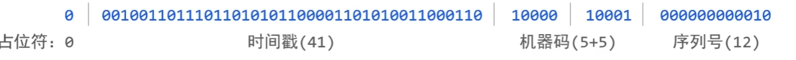
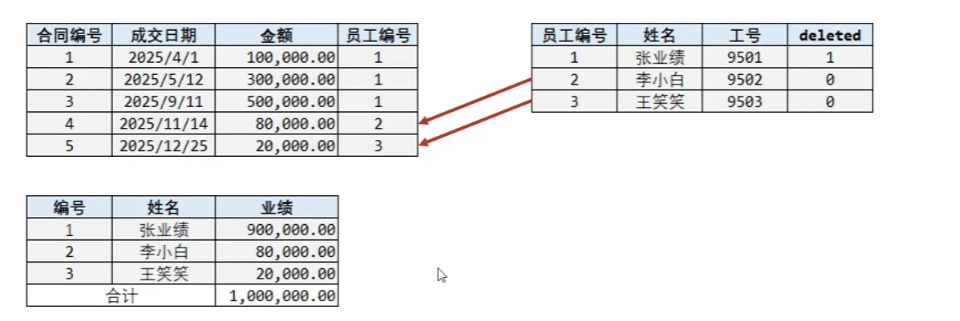
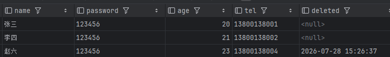

## 1 Mybatis-plus快速入门

​	Mybatis-plus是简化开发dao层接口的框架，非常强力。要在SpringBoot项目中使用，首先得导入对应的pom坐标

```xml
<dependency>
    <groupId>com.baomidou</groupId>
    <artifactId>mybatis-plus-boot-starter</artifactId>
    <version>3.5.7</version>
</dependency>
```

​	然后，直接在dao层接口继承`BaseMapper<T\>`类，这个类实现了许多dao层的功能，其中百分之90的sql代码都不用写，直接调用：

```java
@Mapper
public interface UserDao extends BaseMapper<User> {
}
```


### 1.1 CURD功能演示

```java
@SpringBootTest
public class TestDaoSample {

    @Autowired
    private UserDao userDao;

    @Test
    void testGetAll(){
        List<User> users = userDao.selectList(null);
        for (User user : users) {
            System.out.println(user);
        }
    }

    @Test
    void testSave(){
        User user  = new User(null,"田韦韦","123456",22,"17775866631");
        userDao.insert(user);
    }

    //删除功能测试
    @Test
     public void deleteById() {

        userDao.deleteById(3);
    }

    //更改测试
    @Test
    public void update(){
        User user = new User();
        user.setId(4L);
        user.setAge(88); //只会更新age为88
        userDao.updateById(user);

    }
	
}


```

​	其中注意更改功能，MP对其做了优化，上面的代码会根据id去更新数据，而且之后更新设置了的数据，如果其他成员变量为null，则不会更新，比如这里，只设置了该类的年龄，运行之后，数据库id为4的条目其中字段age就会被更新为88.

​	


### 1.2  分页功能

​	分页查询功能需要插件，也就是配置类，常见配置类如下：

```java
package com.tww.config;

import com.baomidou.mybatisplus.annotation.DbType;
import com.baomidou.mybatisplus.extension.plugins.MybatisPlusInterceptor;
import com.baomidou.mybatisplus.extension.plugins.inner.PaginationInnerInterceptor;
import org.mybatis.spring.annotation.MapperScan;
import org.springframework.context.annotation.Bean;
import org.springframework.context.annotation.Configuration;

@Configuration
@MapperScan("com.tww.dao")
public class MybatisPlusConfig {

    /**
     * 添加分页插件
     */
    @Bean
    public MybatisPlusInterceptor mybatisPlusInterceptor() {
        MybatisPlusInterceptor interceptor = new MybatisPlusInterceptor();
        interceptor.addInnerInterceptor(new PaginationInnerInterceptor(DbType.MYSQL)); // 如果配置多个插件, 切记分页最后添加
        // 如果有多数据源可以不配具体类型, 否则都建议配上具体的 DbType
        return interceptor;
    }
}
```

​	之后就可以分页查询

```java
    @Test
    void testGetByPage(){
        IPage<User> ipage = new Page<>(1,10);
        userDao.selectPage(ipage,null);
        System.out.println("当前页码值:"+ipage.getCurrent());
        System.out.println("每页显示数："+ipage.getSize());
        System.out.println("一共多少页"+ipage.getPages());
        System.out.println("一共多少条："+ipage.getTotal());
        System.out.println("数据:");
        for(User user:ipage.getRecords()){
            System.out.println(user);
        }
    }
```

​	`page<>(1,10)`参数表示当前页码为1的十条数据。

​	执行的sql类似这样：

```java
==>  Preparing: SELECT id,name,password,age,tel FROM users LIMIT ?
==> Parameters: 10(Long)
```

​	如果是`page<>(2,10)`，则表示第2页的10条数据

```java
==>  Preparing: SELECT id,name,password,age,tel FROM users LIMIT ?,?
==> Parameters: 10(Long),10(Long)
```


### 1.3  条件查询

​	在Mybatis-Plus中，`Wrapper`类是构建查询和更新条件的核心工具。下面是一个使用`Wrapper`的例子

```java
    @Test
    void testGetAll(){
        QueryWrapper wrapper = new QueryWrapper();
        wrapper.gt("age","18"); //查询条件：age大于18岁

        List<User> users = userDao.selectList(wrapper);
        for (User user : users) {
            System.out.println(user);
        }
    }
```

​	这个测试方法会查询所有age大于18岁的条目。

​	

​	第二种格式，使用`lambda格式`按条件查询，

```java
    @Test
    void testGetAll(){
        //方式二: lambda格式 按条件查询
        QueryWrapper<User> qw = new QueryWrapper<>();
        qw.lambda().gt(User::getAge,18);
        List<User> users = userDao.selectList(qw);
        for (User user : users) {
            System.out.println(user);
        }
    }

```

​	这种格式的好处是，能够避免字段名写错


​	第三种方式 ：`LambdaQueryWrapper`是基于Lambda表达式的查询条件构造器，它通过`Lambda`表达式引用实体类的属性，从而避免了硬编码字段名

```java
    @Test
    void testGetAll(){
    //        QueryWrapper wrapper = new QueryWrapper();
    //        wrapper.gt("age","18"); //查询条件：age大于18岁
        LambdaQueryWrapper<User> lqw = new LambdaQueryWrapper<>();
        lqw.gt(User::getAge,18); //age大于18岁
        List<User> users = userDao.selectList(lqw);
        for (User user : users) {
            System.out.println(user);
        }
    }
```

​	下面用该类查询10到30岁之间的用户

```java
    @Test
    void testGetAll(){
        LambdaQueryWrapper<User> lqw = new LambdaQueryWrapper<>();
        lqw.lt(User::getAge,30).gt(User::getAge,18);
        List<User> users = userDao.selectList(lqw);
        for (User user : users) {
            System.out.println(user);
        }
    }
```


​	下面的例子能够正确处理条件为空时的情况：

```java
    void testGetAll(){
        //模拟页面传过来的数据
        UserQuery query = new UserQuery();
        //query.setAge(10); //下限
        query.setAge2(30); //上限

        LambdaQueryWrapper<User> lqw = new LambdaQueryWrapper<>();
        lqw.lt(query.getAge2()!=null,User::getAge,query.getAge2());
        lqw.gt(query.getAge()!=null,User::getAge,query.getAge());
        List<User> users = userDao.selectList(lqw);
        for (User user : users) {
            System.out.println(user);
        }
    }
```

​	lg,gt方法的第一项都是`condition`接口，只有该接口的返回值为真时，才会连接该条件。如果不为真则不会连接条件


### 1.4 查询投影

​	查询投影是指：**查询数据库时，不查询完整的实体对象，而只是查询你需要的字段，或者对字段进行加工后返回**

​	例如，只查询用户id和名字

```java
void testGetAll(){
        LambdaQueryWrapper<User> lqw = new LambdaQueryWrapper<>();
        lqw.select(User::getId,User::getName);
        List<User> users = userDao.selectList(lqw);
        for (User user : users) {
            System.out.println(user);
        }
}
```

​	下面统计每个年龄的人数，我们知道，sql语句中是这样写：

```sql
SELECT age,ACOUNT(*)
FROM users
GROUP BY age;
```

​	对应java代码：

```java
QueryWrapper<User> qw = new QueryWrapper<>();

qw.select(
    "age",
    "COUNT(*) AS count"
);

qw.groupBy("age");

List<Map<String,Object>> list =
        userMapper.selectMaps(qw);
```


### 1.5 查询条件

​	sql语句中有各种各样的查询条件，Mybatis-plus也提供了一些里方法来实现添加查询条件。

​	比如，在sql语句中我们查询id为1的用户是这样写

```sql
SELECT *
FROM user
WHERE id =1
```

​	与上面等价的java代码是这样写：

```java
    @Test
    void testGetAll(){

        LambdaQueryWrapper<User> qw = new LambdaQueryWrapper<>();
        qw.eq(User::getId,1);
        User user = userDao.selectOne(qw);
        System.out.println(user);
    }
```

​	链式调用eq可以增加多个条件。例如

```java
qw.eq(User::getId,1).eq(User::getAge,22);
```

​	等价于：

```java
WHERE id =1 AND age =22
```

​	

​	`between`方法用来范围查询。比如年龄18到25之间

```java
    @Test
    void testGetAll(){
        LambdaQueryWrapper<User> qw = new LambdaQueryWrapper<>();
        qw.between(User::getAge,18,25);
        List<User> user = userDao.selectList(qw);
        System.out.println(user);
    }
```

​	`Like`方法用来模糊匹配

```java
    @Test
    void testGetAll(){
        LambdaQueryWrapper<User> qw = new LambdaQueryWrapper<>();
        qw.like(User::getName,"张"); //匹配姓张的用户
        List<User> user = userDao.selectList(qw);
        System.out.println(user);
    }
```

​	`likeRihgt`将模糊匹配的%加在右边

```java
    @Test
    void testGetAll(){
        LambdaQueryWrapper<User> qw = new LambdaQueryWrapper<>();
        qw.likeRight(User::getName,"张"); //匹配姓张%
        List<User> user = userDao.selectList(qw);
        System.out.println(user);
    }
```

​	`likeLeft`将模糊匹配的%加在左边

```java
    @Test
    void testGetAll(){
        LambdaQueryWrapper<User> qw = new LambdaQueryWrapper<>();
        qw.likeLeft(User::getName,"张"); //匹配姓 %张
        List<User> user = userDao.selectList(qw);
        System.out.println(user);
    }
```


### 1.6 映射匹配兼容性

​	有时，数据库表的字段名和实体类的字段名不一定一致，比如数据库中为`pwd`，实体类中为`password`。就会导致在序列化时出现问题。我们使用`@TableField`注解来解决这个问题。

```java
public class User
{
    private Long id;
    private String name;
    @TableField(value="pwd")
    private String password;
    private Integer age;
    private String tel;
}

```

​	把它标记在这个成员属性的上方，并写上当前属性对应数据库表的字段关系

​	

​	有些在java类中的属性，数据库中不一定需要。`@TableField(exist=false)`能够告诉`Mybatis-plus`,这个java属性在数据库表中不存在，不需要SQL映射

```java
public class User
{
    private Long id;
    private String name;
    @TableField(value="pwd")
    private String password;
    private Integer age;
    private String tel;
    private Integer online;
}
```

​	

​	在默认查询时，有些字段是不便向外开发的，比如`password`，银行账户等等，`@TableField()`可以设定属性，`select`为false，告诉Mybati-plus，这个字段不参与查询：

```java
public class User
{
    private Long id;
    private String name;
    @TableField(value="pwd",select=false)
    private String password;
    private Integer age;
    private String tel;
    @TableField(exsit=false)
    private Integer online;
}
```

​	 @`Table_Name`使类名和数据库名对应：

```java
@TableName("users")
public class User
{
    private Long id;
    private String name;
    @TableField(value="pwd",select=false)
    private String password;
    private Integer age;
    private String tel;
    @TableField(exsit=false)
    private Integer online;
}
```

​	

### 1.7  id生成策略

​	不同的表应用不同的id生成策略。Mybatis-plus提供，`@TableId`来指定主键和生成策略，该注解有两个值：

```java
public class User
{
    @TableId(value="id",type=IdType.AUTO)
    private Integer id;
}
```

​	value的默认值为空，如果不设置，将使用实体类的字段名做为数据库表的主键字段名。`type`的类型为`Enum`，默认值为`IdType.NONE`

​		

​	生成策略有以下几种：

- `IdType.AUTO`: 使用数据库自增ID作为主键

​	在这种情况下，插入新的数据，id为上一条记录的id+1。

- `IdType.NONE`：无特定生成策略，如果全局配置中有`IdType`相关配置，则会跟随全局配置。例如在`application.yml`文件中

```yaml
mybatis-plus:
  global-config:
    db-config:
      id-type: assign_id
```

​	这里显示，全局配置的id生成策略为使用雪花算法自动生成的id。、

- `IdType.INPUT`: 在插入数据前，由用户自行设置主键值。

​	这里是值在插入时，可以把id传入。

```java
User user = new User();
user.setId(10026L);
user.setUsername("张三");
userMapper.insert(user);
```

​	**注意，该策略要求数据库的主键不能设置为自增**,主键值应该由应用程序在插入之前主动提供。

- `IdType.ASSIGN_ID`: 自动分配ID，适用于`Long、Integer、String`类型的主键，默认使用雪花算法同`IdentifierGenerator`的`nextId`实现。

  ​	该类型会自动分配id，无需多余java代码，雪花算法生成64位二进制，即8Byte，一个Long的长度。

  ​	生成机制类似下面这样：

  

- `IdType.ASSIGN_UUID`：自动分配 `UUID`，适用于 `String` 类型的主键。默认实现为 `IdentifierGenerator` 的 `nextUUID` 方法。@since 3.3.0

​	

​	

## 2 逻辑删除

​	逻辑删除是一种优雅的数据管理策略，它通过在数据中标记记录为“已删除”而非物理删除，来保留数据的历史痕迹，同时确保查询的整洁性。`Mybatis-plus`提供了便捷的逻辑删除支持。

​	为数据设置是否可用状态字段，删除时设置状态字段为不可用状态，数据保留在数据库中

​            	

​	

​	逻辑删除字段支持所有数据类型，但推荐使用`Integer、Boolean或LocalDateTime。`如果使用`datetime`类型，可以配置逻辑未删除值为`null`。已删除值使用函数`now()`获取当前时间。

​	

### 2.1 使用方法

​	**1.配置全局逻辑删除属性**

​	在`application.yml`中配置`Mybatis-plus`的全局逻辑删除属性：

```java
mybatis-plus:
  global-config:
    db-config:
      logic-delete-field: deleted # 全局逻辑删除字段名
      logic-delete-value: now() # 逻辑已删除值
      logic-not-delete-value: null # 逻辑未删除值
```

​	**2. 在实体类中使用`@TableLogic`注解** 

​	在实体类中，对应数据库表的逻辑删除字段上添加`@TableLogic`注解：

```java
import com.baomidou.mybatisplus.annotation.TableLogic;

public class User {
    // 其他字段...

    @TableLogic
    private LocalDataTime deleted;
}
```

​	`@TableLogic`也可以指定“逻辑已删除值”和“逻辑未删除值”。

```java
import com.baomidou.mybatisplus.annotation.TableLogic;

public class User {
    // 其他字段...

    @TableLogic(value ="null",delval = "now()")
    private LocalDateTime deleted;
}
```

​	如果注解配置和全局配置同时出现。那么注解配置会覆盖全局配置，因为全局配置更被看为默认设置，而注解配置是针对特定场景下的配置

​	


### 2.2 逻辑删除的工作原理

​	Mybatis-Plus的逻辑删除功能会在执行数据库操作时自动处理逻辑删除字段，下面是它的工作方式：


**1. 删除**

​	将删除操作转换为更新操作，标记记录为已删除。例如，下面java语句删除id为3的数据。

```java
    @Test
     public void deleteById() {
        userDao.deleteById(3);
    }
```

​	那么实际执行逻辑是，将会更新逻辑删除字段，根据全局配置已删除值更新。

```java
==>  Preparing: UPDATE users SET deleted=now() WHERE id=? AND deleted IS NULL
==> Parameters: 3(Integer)
<==    Updates: 0
```

​	最后数据库中，该字段被标记为已删除，值是删除时间。




**2. 更新**

​	对于逻辑删除字段，遇见更新操作的时候，会**防止更新已删除的记录**。也就是说，**状态为已删除的字段不会被更新**。例如。下面更新所有记录的年龄为18岁。

```java
    public void update(){
        UpdateWrapper<User> uw = new UpdateWrapper<>();
        uw.set("age",18);

        userDao.update(uw);
    }
```

​	实际执行sql是：

```java
==>  Preparing: UPDATE users SET age=? WHERE deleted IS NULL
==> Parameters: 18(Integer)
<==    Updates: 9
```

​	可以看见，它把条件delete IS NULL加在了后面


**3.查找**

​	自动添加条件，过滤掉标记为已删除的记录，例如，我们查询全部用户

```java
    void testGetAll(){
        List<User> user = userDao.selectList(null);
        System.out.println(user);
    }
```

​	实际执行sql是：

```java
==>  Preparing: SELECT id,name,age,tel,deleted FROM users WHERE deleted IS NULL
==> Parameters: 
```

​	输出结果：

```java
<==    Columns: id, name, age, tel, deleted
<==        Row: 1, 张三, 18, 13800138001, null
<==        Row: 2, 李四, 18, 13800138002, null
<==        Row: 5, 陈强, 18, 13800138005, null
<==        Row: 6, 刘洋, 18, 13800138006, null
<==        Row: 7, 杨帆, 18, 13800138007, null
<==        Row: 8, 周杰, 18, 13800138008, null
<==        Row: 9, 吴敏, 18, 13800138009, null
<==        Row: 10, 郑凯, 18, 13800138010, null
<==        Row: 11, 田韦韦, 18, 17775866631, null
```

​	在大部分应用中，逻辑删除字段不需要被查询出来，可以用`@TableField`注解标记为`(select=false)`。


**4.插入**

​	逻辑删除字段的值不受限制，也就是说，可以选择插入这个值，也可以选择不插入这个值，因为在数据库表设计中，已经将这个字段设置了默认值为“未删除值”

​	插入会把逻辑删除字段按照普通字段处理。一般情况下，需要保证新增数据的逻辑删除字段是“未删除状态”。如果表设计已经设置了默认值，那么插入时则无需例会该字段。

​	下面是一个插入的例子

```java

    @Test
    void testInsert(){
        User user = new User();
        user.setName("李欣");
        user.setAge(23);
        user.setTel("17778966523");
        userDao.insert(user);
    }
```

​	如果设置了id生成策略，则无需指定id。

​	执行的sql如下：

```java
==>  Preparing: INSERT INTO users ( name, age, tel ) VALUES ( ?, ?, ? )
==> Parameters: 李欣(String), 23(Integer), 17778966523(String)
<==    Updates: 1
```

​	


## 3 乐观锁

​	乐观锁是一种并发控制机制，用于确保在更新记录时，该记录未被其他事务修改。

### 3.1 乐观锁实现原理：

​	乐观锁的实现通常包括以下步骤：

1. 读取记录时，获取当前的版本号（version）。
2. 在更新记录时，将这个版本号一同传递。
3. 执行更新操作时，设置 `version = newVersion` 的条件为 `version = oldVersion`。
4. 如果版本号不匹配，则更新失败。


​	乐观锁认为：**多个线程/用户同时修改同一条数据的概率较低，因此不提前加锁，而是在更新数据时检查数据有没有被修改过**

​	乐观锁将表增加一个版本字段：

```java
product

id   stock   version
1    10      1
```

​	此时，假设有A和B两个事务，同时进行购买。

​	事务A查询库存得到

```java
stock=10
version=1
```

​	事务B查询库存

```java
stock=10
version=1
```

​	此时，事务A更新：

```java
UPDATE product
SET stock = 9,
    version = version + 1
WHERE id=1
AND version=1;
```

​	将版本更号更新。

​	数据库的数据为：

```java
stock=9
version=2
```

​	事务B再更新：

```java
UPDATE product
SET stock = 9,
    version = version + 1
WHERE id=1
AND version=1;
```

​	此时它还是获取的旧版本id，就与数据库的数据对应不上，从而更新失败，影响行数为0，说明数据已经被别人修改了，于是事务B就可以重新查询和更新操作。

​	乐观锁的并发性能高，遇见冲突时失败重试，适合读多写少场景

​	

### 3.2 配置乐观锁插件

​	**MyBatis-Plus 提供了 `OptimisticLockerInnerInterceptor` 插件，使得在应用中实现乐观锁变得简单。**

​	SpringBoot注解配置方式如下，在`MybatisPlusInterceptor`bean中注册。

```java
@Configuration
public class MybatisPlusConfig {

    @Bean
    public MybatisPlusInterceptor mybatisPlusInterceptor() {
        MybatisPlusInterceptor interceptor = new MybatisPlusInterceptor();
        //配置乐观锁拦截器
        interceptor.addInnerInterceptor(new OptimisticLockerInnerInterceptor());
        return interceptor;
    }
}
```

​	第二步：在实体类字段上添加`@Version`注解

​	需要再表示版本号的字段上添加`@Version`注解

```java
import com.baomidou.mybatisplus.annotation.Version;

public class YourEntity {
    @Version
    private Integer version;
    // 其他字段...
}
```

​	当执行更新操作时：

```java
com.tww.dao.TestDaoSample#update
```

​	实际执行sql

```java
==>  Preparing: UPDATE users SET name=?, age=?, tel=?, version=? WHERE id=? AND version=? AND deleted IS NULL
==> Parameters: 李四(String), 18(Integer), 13800138005(String), 2(Integer), 5(Long), 1(Integer)
<==    Updates: 1
```

​	为：

```sql
UPDATE users
SET
name="李四",
age=18,
tel="13800138005"
version = 2,
WHERE
ID=5 AND version =1 AND deleted IS NULL
```

​	在这里，就检查了`version`是否等于数据库里的值，如果等于，说明它是第一个更新进行更新的，将version 的更新+1

​	


## 4. 代码生成器

​	代码生成器可以根据数据表生成大量的重复代码，如`dao、service、impl、controller`层的代码。

​	引入依赖：本体和模版引擎

```xml
<dependency>
    <groupId>com.baomidou</groupId>
    <artifactId>mybatis-plus-generator</artifactId>
    <version>3.5.7</version>
</dependency>
<!--模版引擎-->
<dependency>
    <groupId>org.apache.velocity</groupId>
    <artifactId>velocity-engine-core</artifactId>
    <version>2.4.1</version>
</dependency>
```

​	只需要创建一个普通类，在main方法执行下面的代码：

```java
FastAutoGenerator.create("url", "username", "password")
        // 全局配置
        .globalConfig(builder -> builder
                .author("Baomidou") // 设置作者
                .outputDir(Paths.get(System.getProperty("user.dir")) + "/src/main/java") // 输出目录
                .commentDate("yyyy-MM-dd") // 注释日期格式
        )

        // 包配置
        .packageConfig(builder -> builder
                .parent("com.tww") // 父包名
                .entity("entity") // 实体类包
                .mapper("mapper") // Mapper接口包
                .service("service") // Service接口包
                .serviceImpl("service.impl") // Service实现类包
                .xml("mapper.xml") // Mapper XML目录
        )

        // 策略配置
        .strategyConfig(builder -> builder
                .entityBuilder()
                .enableLombok() // 实体类开启Lombok
        )

        // 模板引擎
        .templateEngine(new FreemarkerTemplateEngine()) // 使用Freemarker模板

        // 执行生成
        .execute();
```


