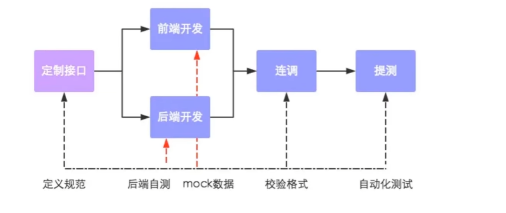
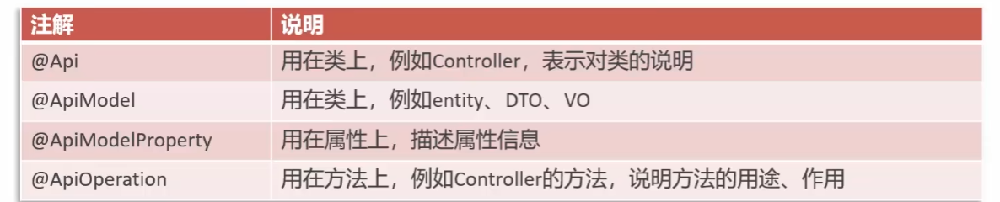

## 13.1 Swagger

​	在前后端分离开发中，第一步总是先定制接口，然后才进行后端开发，下面是一个项目的开发流程：



​		`Swagger`是一套用于设计、构建、文档化和测试`RESTful API`的开源工具集，提供了一种标准化的方式来描述API的结构、请求参数、响应格式等信息

​		只需要按照它的规范去定义接口机接口相关信息，就可以做到生成接口文档，以及在线接口调试页面，`Knife4j`是为Java MVC框架集成`Swagger`生成API文档的增强解决方案。依赖坐标如下：

```xml
        <dependency>
            <groupId>com.github.xiaoymin</groupId>
            <artifactId>knife4j-spring-boot-starter</artifactId>
        </dependency>
```

​		然后在配置类中加入`knife4kj`相关配置

```java
    /**
     * 通过knife4j生成接口文档
     * @return
     */
    @Bean
    public Docket docket() {
        ApiInfo apiInfo = new ApiInfoBuilder()
                .title("苍穹外卖项目接口文档")
                .version("2.0")
                .description("苍穹外卖项目接口文档")
                .build();
        Docket docket = new Docket(DocumentationType.SWAGGER_2)
                .apiInfo(apiInfo)
                .select()
                .apis(RequestHandlerSelectors.basePackage("com.sky.controller"))
                .paths(PathSelectors.any())
                .build();
        return docket;
    }
```

​		还需要设置静态资源映射，否则接口文档页面无法访问

```java
    /**
     * 设置静态资源映射
     * @param registry
     */
    protected void addResourceHandlers(ResourceHandlerRegistry registry) {
        registry.addResourceHandler("/doc.html").addResourceLocations("classpath:/META-INF/resources/");
        registry.addResourceHandler("/webjars/**").addResourceLocations("classpath:/META-INF/resources/webjars/");
    }
```


## 13.2 Swagger常用注解

​	 通过注解可以控制生成的接口文档，使接口文档拥有更好的可读性



​	

​	例如：

```java
@ApiModel(description = "员工登录时传递的数据模型")
public class EmployeeLoginDTO implements Serializable {

    @ApiModelProperty("用户名")
    private String username;

    @ApiModelProperty("密码")
    private String password;

}
```

​	