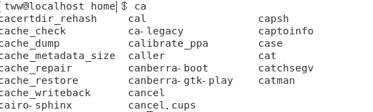
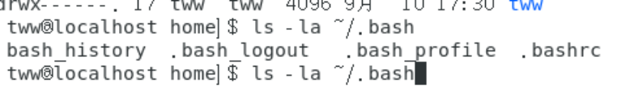
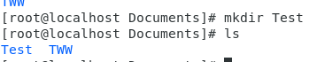
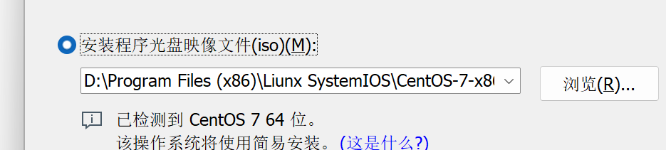

## 1.1Linux常用命令

| 命令            | 说明                                                        |
| :-------------- | :---------------------------------------------------------- |
| `ls`            | 列出目录内容（`-l` 详细列表，`-a` 显示隐藏文件，/指定路径） |
| `cd`            | 切换目录（`cd ~` 回家目录，`cd ..` 返回上级）               |
| `pwd`           | 显示当前工作目录                                            |
| `mkdir`         | 创建目录（`-p` 递归创建多层目录）                           |
| `rmdir`         | 删除空目录                                                  |
| `rm`            | 删除文件或目录（`-r` 递归删除，`-f` 强制删除）              |
| `cp`            | 复制文件或目录（`-r` 递归复制目录）                         |
| `mv`            | 移动或重命名文件/目录                                       |
| `touch`         | 创建空文件或更新文件时间戳                                  |
| `cat`           | 查看文件内容（`-n` 显示行号）                               |
| `less` / `more` | 分页查看文件内容                                            |
| `head`          | 查看文件头部（默认前10行，`-n 5` 指定行数）                 |
| `tail`          | 查看文件尾部（`-f` 实时追踪日志）                           |
| `find`          | 查找文件（`find /path -name "*.txt"`）                      |
| `grep`          | 文本搜索（`grep "keyword" file`，`-i` 忽略大小写）          |
| `tar`           | 打包/解压文件（`-czvf` 打包压缩，`-xzvf` 解压）             |
| `clear`         | 清除屏幕                                                    |


#### 1.1.1 命令一般格式

​	命令可分为几部分：指令、选项、参数1 参数2......

```java
[dmtasi@study ~] $ command [-options] parameter1 parameter2s
```

​	上述指令详细说明如下：

1. 一行指令中第一个输入的部分绝对是“指令 (command)”或“可执行文件”
2. command为指令的名称，如变换工作目录的指令为cd等待。
3. 中括号[]并不存在于实际的指令中，而加入选项设置时，通常选项会到-号，例如-h；有时会使用 选项的完整全名，则选项前带有--符号，例如--hlep;
4. parameter1 parameter2...为依附在选项后面的参数，或是command的参数；
5. 指令，选项，参数以空格来区分，无论空几格，都视为一格。
6. 按下[Enter]键后，该指令立即执行。[Enter]键代表这一行命令的启动
7. 指令太长的时候，使用反斜线（\）来跳脱[Enter]符号，只指令连续到下一行。注意！反斜线后就立刻接特殊字符，才能跳脱。
8. 在Liunx系统中，英文大小写字母是不一样的。如CD于cd并不同。


#### 1.1.2 几个主要的热键[Tab],[Ctrl]-c,[ctrl]-d

​	**1 . [Tab]键**

​	Tab键具有“命令补全”与“文件补全的功能”。如在命令行输入ca再按两次[tab]键：



​	会显示所有开头字母带ca的命令。在命令行输入`ls -al~/.bash`之后再按两次Tab键：



​		会补全所有文件。


​	**2 .Ctrl-c按键**

​	当你在Liunx下面输入了错误的指令或参数，或程序导致系统死循环。就可以按下Ctrl+C按键。当前运行的程序或指令就会被终止


​	**3 . Ctrl -d按键**

​	这个按键组合代表通常代表着: **键盘输入结束**的意思。另外 ，它也可以用来取代exit的输入。例如你想要直接离开命令行，可以直接按下Ctrl-D就能直接离开


#### 1.1.3. ls命令

​	ls命令列出指定目录的内容。例如：

```java
ls /
```

​	将列出根目录下的所有文件。

​	一般格式：

```java
ls [选项] [目录或文件]
```

​	若给出的参数是目录，则`ls`命令将列出其中所有的子目录与文件的信息；若给出的参数是文件，则将列出有关该文件属性的一些信息。

​	常用选项

​	`-a 或-all` : 显示指定目录下所有子目录和文件，包括以`.`开头的隐藏文件

​	`-l`: 以长格式显示文件的详细信息。输出的信息分成多列，它们依次是：

​	文件类型与权限	链接数	文件主	文件组	文件大小	建立或最近修改的时间	文件名

​	

#### 1.1.4 cd命令

​	cd命令用于改变工作目录

​	一般格式：

```java
cd [dirname]
```

​	`cd ../`可以把工作目录向上移动两级目录。不带任何参数的`cd`命令可以从系统任何地方返回主目录。


#### 1.1.5 mkdir 命令

​	mkdir命令用于创建目录

​	一般格式：

```java
mkdir [-options] dirname
```

​	`mkdir`命令创建由dirname命令的目录，若在目录名的前面没有加任何路径名，则在当前目录创建dirname目录：



​	也可以在指定路径下创建目录

```java
mkdir /home/tww/Documents/Test/cs; 将在指定路径创建cs文件
```

​	`-p或-parents`：可一次性创建多层目录，若新建目录所指定路径中的父目录不存在，则可以自动创建它们


#### 1.1.6 rmdir命令

​	`rmdir`命令可以从一个目录中删除一个或多个空子目录。rmdir只能删除空目录。一般格式

```bash
rmdir [选项] [目录]
```

​	`-p` :递归删除目录，当子目录删除后其父目录也为空时，父目录也被删除。若有非空的目录，该目录被保留。

```java
若我们先递归创建了一个目录：
    mkdir -p Test/Test1/Test2/Test3
我们在递归删除这个目录：
    rmdir -p Test/Test1/Test2/Test3
```


#### 1.1.7 rm命令

​	rm命令删除文件和目录，默认情况下不能删除目录。若没有给出选项`-f`或`-force`，则rm命令删除文件前会提示用户是否删除该文件；若用户没有回答y或Y。则不删除该文件。

​	一般格式：

```bash
rm [-选项] [文件或目录]
```


​	`-f或-force`: 忽略不存在的文件，并不给出提示信息。

​	`-r或 -R`：递归删除指定目录及其下属的各级子目录的相应的文件。

​	`i：`交互式删除文件

​	`-d 或--dir :`删除空目录。


#### 1.1.8 touch

​	touch命令在指定目录下用于创建文件，如：

```java
touch Test/Hello.c  将在Test目录下创建Hello.c文件
```

​	


#### 1.1.9 shutdowm

​	该命令用于关闭系统，并且再关机以前传送讯息给所有使用者正在执行的重新,shutdown也可以用来重开机（使用权限：系统管理者）

​	语法：

```bash
shutdown [-t seconds]  time [message]
```

​	**参数**

- -t seconds : 设定在几秒钟之后进行关机程序。
- -k : 并不会真的关机，只是将警告讯息传送给所有使用者。
- -r : 关机后重新开机。
- -h : 关机后停机。
- -n : 不采用正常程序来关机，用强迫的方式杀掉所有执行中的程序后自行关机。
- -c : 取消目前已经进行中的关机动作。
- -f : 关机时，不做 fsck 动作(检查 Linux 档系统)。
- -F : 关机时，强迫进行 fsck 动作。
- time : 设定关机的时间。
- message : 传送给所有使用者的警告讯息。

实例：

立马关机

```sql
# shutdown -h now
```

指定10分钟后关机

```sql
# shutdown -h 10
```

重新启动计算机

```sql
# shutdown -r now
```


#### 1.1.10 grep命令

​	该命令用于再文本文件中查找指定模式的单词或短语，并再标准输出上显示包括给定字符串模式的所有行。

​	一般格式 :

```sql
grep [options] pattern [files]
```

​	pattern: 表示要查找的字符串或正则表达式	

​	常用选项

- `-i`：忽略大小写进行匹配。
- `-v`：反向查找，只打印不匹配的行。
- `-n`：显示匹配行的行号。
- `-r`：递归查找子目录中的文件。
- `-l`：只打印匹配的文件名。
- `-c`：只打印匹配的行数
- `-F`：将样式视为固定字符串的列表
- `-E`：将样式为延伸的正则表达式来使用。


#### 1.1.11 login登录

​	`login`指令让用户登入系统，可以通过它的功能随时更换登录身份。可以再指令后面附加域登入的用户名，它会直接询问密码，等待用户输入。如，下面指令登录用户名为`tww`的用户。

​	

#### 1.1.12 logout退出系统

​	`logout`命令可以退出系统


#### 1.1.13 reboot

​	该命令用来重新启动计算机，若系统的`runlevel`为0或6，则重新开机，否则以shutdwon指令来（加上 -r参数）取代

​	语法

```bash
reboot [-n] [-w] [-d] [-f] [-i]
```

​	参数:

- -n : 在重开机前不做将记忆体资料写回硬盘的动作
- -w : 并不会真的重开机，只是把记录写到 /var/log/wtmp 档案里
- -d : 不把记录写到 /var/log/wtmp 档案里（-n 这个参数包含了 -d）
- -f : 强迫重开机，不呼叫 shutdown 这个指令
- -i : 在重开机之前先把所有网络相关的装置先停止


#### 1.1.14 halt

​	若系统的`runlevel`为0或6 ，则Liunx halt命令关闭系统，否则以shutdown指令（加上 -h参数）来取代。使用权限：系统管理者

​	语法

```bash
halt [-n] [-d] [-f] [-i] [-p]
```

​	参数：

- -n : 在关机前不做将记忆体资料写回硬盘的动作
- -w : 并不会真的关机，只是把记录写到 /var/log/wtmp 文件里
- -d : 不把记录写到 /var/log/wtmp 文件里（-n 这个参数包含了 -d） -f : 强迫关机，不呼叫 shutdown 这个指令
- -i : 在关机之前先把所有网络相关的装置先停止
- -p : 当关机的时候，顺便做关闭电源（poweroff）的动作


#### 1.1.15 passwd

​	该命令用来更改使用者的密码

​	语法：

```bash
passwd [-k] [-l] [-u [-f]] [-d] [-S] [username]
```

​	参数：

- -d 删除密码
- -f 强迫用户下次登录时必须修改口令
- -w 口令要到期提前警告的天数
- -k 更新只能发送在过期之后
- -l 停止账号使用
- -S 显示密码信息
- -u 启用已被停止的账户
- -x 指定口令最长存活期
- -g 修改群组密码
- 指定口令最短存活期
- -i 口令过期后多少天停用账户


#### 1.1. 16 vlock

​	vlock命令用于锁住虚拟终端。锁住虚拟终端后，需要输入密码才能继续操作指令。


#### 1.1.17 exit命令

​	该命令用于退出目前的shell。

​	


#### 1.1.18 useradd

​	该命令用于建立用户账户，一般格式

```bash
useradd [-mMnr][-c <备注>][-d <登入目录>][-e <有效期限>][-f <缓冲天数>][-g <群组>][-G <群组>][-s <shell>][-u <uid>][用户帐号]
```

​	说明：useradd可用来建立用户账户。账户建好之后，再passwd设定账号的密码，userdel删除账户。使用useradd指令所建立的账号，实际上保存在/etc/passwd中。

​	选项：

` -b, --base-dir BASE_DIR`       	新账户的主目录的基目录
` -c, --comment COMMENT `        	新账户的 GECOS 字段
  `-d, --home-dir HOME_DIR`    	新账户的主目录
  `-D, --defaults`                		显示或更改默认的 useradd 配置
` -e, --expiredate EXPIRE_DATE `	 新账户的过期日期
` -f, --inactive INACTIVE`   	   	新账户的密码不活动期
 ` -g, --gid GROUP`            	   	新账户主组的名称或 ID
 ` -G, --groups GROUPS  `		新账户的附加组列表
  ``-h, --help`               		显示此帮助信息并推出
  `-k, --skel SKEL_DIR`   		使用此目录作为骨架目录
  `-K, --key KEY=VALUE `         	 不使用 /etc/login.defs 中的默认值
 ` -l, --no-log-init `  	 		不要将此用户添加到最近登录和登录失败数据库
  `-m, --create-home`    		 创建用户的主目录
  `-M, --no-create-home `       	  不创建用户的主目录
 ` -N, --no-user-group` 	  	不创建同名的组
  `-o, --non-unique`              	允许使用重复的 UID 创建用户
  `-p, --password PASSWORD`               加密后的新账户密码
 ` -r, --system `              	  	 创建一个系统账户
  `-R, --root CHROOT_DIR `       	 chroot 到的目录
  `-s, --shell SHELL `         	   	新账户的登录 shell
 ` -u, --uid UID `              	 	 新账户的用户 ID
 ` -U, --user-group`              		创建与用户同名的组
 ` -Z, --selinux-user SEUSER             为 SELinux 用户映射使用指定 SEUSER

​	在创建完用户之后，使用如下命令直接切换账户，注意，root状态下切换普通权限用户无需输入密码

```bash
su [用户名]
```


#### 1.1.19 whoami

​	输出当前工作的用户。

## 1.2 Liunx文件层次结构

​	**Liunx文件采用树型目录结构组织管理文件，根目录为`/`。**

​	下面是一些常见的目录以及它的功能：

| 目录         | 功能                                                         |
| ------------ | ------------------------------------------------------------ |
| /            | 根目录                                                       |
| /bin         | 系统常用的目录位于该目录                                     |
| /home        | 用户的主目录                                                 |
| /mnt         | 用于存放挂载存储设备的挂载目录                               |
| /media       | 来挂载USB接口的移动硬盘、CD的目录                            |
| /opt         | 用来存放那些可选的程序                                       |
| /root Liunx  | 超级权限用户root的主目录                                     |
| /sbin        | 是root用户的常见命令目录                                     |
| /SeLiunx     | 对SEliunx的一些配置文件目录，SELiun可以让Liunx更加安全       |
| /srv         | 服务启动后，所需访问的数据目录。www服务启动读取的网页数据就可以放在/srv/www中 |
| /tmp         | 临时文件目录，用来存放不同程序执行时产生的零四文件。/var/tmp目录和这个目录相似 |
| /usr         | 用户的很多应用程序都存放在这个目录。                         |
| /usr/local   | 存放那些手动按照的软件。                                     |
| /usr/share   | 系统共用的文件存放地 ，比/usr/share/fonts是字体目录          |
| /lib         | 存放系统动态链接共享库。千万不要轻易对这个目录进行操作，一旦发生问题，系统将无法工作 |
| /var         | 这个目录的内容是经常变动的。 /var下有/var/log，存放系统日志的目录。 |
| /dev         | 这个目录包含了所有Liunx系统中使用的外部设备，Liunx操作系统把设备当作一个文件去访问 |
| /etc         | etc这个目录是Liunx系统中最重要的目录之一。这个目录下存放了系统管理时要用到的各种配置和子目录 |
| /locat+found | 系统意外崩溃或意外关机时，其而产生一些文件碎片放在这里。系统在启动的过程中fsck工具会检查这里，并修复已经损坏的文件系统。 |
| /sbin        | 存放系统管理员的系统管理程序。大多涉及系统管理命令的存放，是超级权限用户root的可执行命令存放地。普通用户无权限执行这个目录下的命令。 |
|              |                                                              |

```java
Red Hat Liux 根口令：
    Liunx119034@
账户：tww
全名；TWW
口令：123456789
    
CentOs 密码：
    119034
```


## 1.3 文件操作

​	为了更好的使用命令去操作文件。下面介绍几个**通配符**：

`*`：==与0个或多个任意字符相匹配（.开头的隐藏文件除外）==例如：`file*`可以代表`file`开头的任意文件（`file123、fileabc等等`）

`?`：==只与任意一个字符匹配，可以使用多个问号==。例如：`file?`可以与`file2、file1、file3、filea`匹配

`[]`：只与方括号中字符之一匹配，在方括号中如果以`!`开始，表示不与惊叹号匹配，如`[!abc]`表示不匹配abc。可以用短横代表一个范围内的字符`[a-z]`表示匹配从a到z的任意一个小写字母


### 1.3.1 文件显示命令


####  1. cat

​	cat命令命令连接文件并打印到标准输出设备上，经常用来显示文件的内容。

​	**语法格式**

```bash
cat [选项] [文件]
```

- `-n`：显示行号，会在输出的每一行前加上行号。
- `-b`：显示行号，但只对非空行进行编号。
- `-s`：压缩连续的空行，只显示一个空行。
- `-E`：在每一行的末尾显示 `$` 符号。
- `-T`：将 Tab 字符显示为 `^I`。
- `-v`：显示一些非打印字符。

​	**使用说明**：

- 显示文件内容：`cat filename` 会将指定文件的内容输出到终端上。
- 连接文件：`cat file1 file2 > combined_file` 可以将 file1 和 file2 的内容连接起来，并将结果输出到 combined_file 中。
- 创建文件：可以使用 `cat` 命令来创建文件，例如 `cat > filename`，然后你可以输入文本，按 `Ctrl+D` 来保存并退出。
- 在终端显示文件：可以将 `cat` 与管道（`|`）结合使用，用来显示其他命令的输出，例如 `ls -l | cat` 会将 `ls -l` 的输出通过 `cat` 打印到终端上


#### 2. more

​	more命令类似cat，不过会以一页一页的形式显示，最基本的指令是按空白键就往下一页显示。

​	一般形式：

```bash
more [options] filename
```

​	


#### 3. head

​	head命令用于查看文件的开头部分的内容。有一个常用参数`-n`用于指定要显示的行数，默认为10，即显示10行的内容。

​	一般形式：

```bash
head [options] filename
```

​	参数

- -q 隐藏文件名
- -v 显示文件名
- -c<数目> 显示的字节数。
- -n<行数> 显示的行数。


#### 4.tail

​	tail命令可以查看文件尾部的内容。有一个常用的参数`-f`常用于查阅正在改变的日志文件。

​	`tail -f filename`会把filename文件里最尾部的内容显示在屏幕上，并且不断刷新。只要filename更新就可以看到最新的文件内容。

​	命令格式：

```bash
tail [参数] [文件]
```

- -f 循环读取
- -q 不显示处理信息
- -v 显示详细的处理信息
- -c<数目> 显示的字节数
- -n<行数> 显示文件的尾部 n 行内容
- --pid=PID 与-f合用,表示在进程ID,PID死掉之后结束
- -q, --quiet, --silent 从不输出给出文件名的首部
- -s, --sleep-interval=S 与-f合用,表示在每次反复的间隔休眠S秒


## 1.4 网络命令


#### 1.4.1 Hostname

​	该命令用于显示活设置系统的主机名。如果无任何选项和主机名，则用于显示系统的主机名。一般格式为：

```bash
hostname [选项] [主机名]
```

​	选项：

`-F 活 --file文件名`：从文件名中读入主机名

`-V`:显示所有信息


#### 1.4.2 Ping

​	测试本主机与目标主机的连接性，一般格式为：

```bash
ping [选项] 主机名（或IP地址）
```


#### 1.4.3 host

​	改命令用于IP地址查找。有两种功能：一个用来查找指定IP的网络域名；另一个用来查找指定域名的IP地址。一般格式为

```bash
host [选项] 主机名活IP地址
```

​	选项：

`-T`:使用TCP/IP协议

`-I`:用AXFR格式列出一个域中的全部主机名


#### 1.4..4 ifconfig

​	该命令用于配置常驻内存的网络界面，如果不指定任何选项，则显示当前网络状态。一般格式为

```bash
ifconfig 网卡号 [选项] [ip地址]
```

​	选项

`-up`:激活网卡。

`-down`:激活网卡

`IP地址`：用于为指定网卡设置IP地址

`-a`:查看所有的网络信息 

1.IP地址可分为IPV4/IPV6。其中IPV4组成：4组，每组8位，共计32位（网络位+主机位）。

2.表示方法：点分十进制。例如，172.16.11.37。

3.IPV4分类

​	1.A类地址：1组网络位（8位），3组主机位（24位）。A类地址能支持的主机数量是(2^24)-2。子网掩码（255.0.0.0）二进制表示 0。范围（0~126）

​	2.B类地址：2组网络位（16位），2组主机位（16位）。B类地址支持的主机数量是(2^16)-2。二进制表示：1 。范围（128~191）

​	3.C类地址：3组网络位（24位），1组主机位（8位）。C类地址支持的主机数量是$2^8-2$。二进制表示：110。 范围（192~223）

​	4.D类地址: 作为保留地址 。范围（224~239）.

4.广播地址：==主机位全为1，就是广播地址==。英文为Bcast。如有一个ip地址：172.16.100.98。他的子网掩码是255.255.255.0。他的广播地址为：172.16.100.255

​	所有IP地址都属于逻辑地址。

5.特殊IP地址

​	A: 10.\*.\*.\*;

​	B: 172.16.\*.\* ---- 172. 31.\*.\*

​	C :192.168.\*.\* 

以上的地址属于内网地址。而本地环回地址是：127.\*.\*.1。起本地测试作用。内网地址怎么访问外网，使用NAT(网络地址转换)。

路由器：连接两个不同网段的终端设备。网络设备：中继器、网桥、路由器、网关。


#### 1.4.5 traceroute

​	该命令显示**本机到达目标主机的路由路径**。traceroute利用IP协议，通过数据包的TTL获取各个网关信息。一般格式：

```bash
traceroute 目标主机名或ip地址
```


#### 1.4.6 netstat

​	该命令用来显示各种各样的与网络相关的状态信息，主要包括查看网络的连接状态、检查接口的配置信息、检查路由表信息及取得统计信息。它的一般格式: 

```bash
netstat [选项]
```

​	选项

`-a`:显示所有配置的接口

`-i`:显示接口统计信息

`-n`:以数字形式显示IP地址。


#### 1.4.7  finger

​	该命令用于显示主机系统中用户的信息。一般格式：

```bash
finger [选项] [user@host..]
```


## 1.5 目录及操作命令

​	

#### 1.5.1 pwd

​	pwd命令不带任何选项或参数，用于显示当前工作目录的绝对路径


#### 1.5.2 In命令

​	该命令用于链接文件活目录。默认的情况下，In创建的链接是硬链接。该命令的一般格式

```bash
In [选项] 源文件 [目标]
```


#### 1.5.3 chomd

​	该命令改变或设置文件或目录的存取选项。


## 1.6 文件压缩命令

#### 1.6.1 gzip

​	gzip命令用于对文件进行压缩和解压缩。被压缩的文件扩展名是.gz。一般格式为

```bash
gzip [选项] 压缩文件名/解压缩文件名
```


## 1.其他命令


#### 1.5.1 clear

​	该命令用于清除屏幕上的信息。


#### 1.5.2 echo

​	该命令的功能是在屏幕上显示命令行中所给出的字符串。一般格式

```bash
echo [选项] 字符串
```

​	`-n`: 输出字符串之后光标不换行。


#### 1.5.3 date

​	用于在屏幕上显示或设置系统的日期和时间。


## 1.6 安装Centos系统

1. 打开VM软件
2. 点击新建虚拟机
3. 选择典型
4.  选择安装程序光盘映像文件



5. 设置虚拟机名、用户名和根密码
6. 进行简易安装，等待系统自动安装完成。

