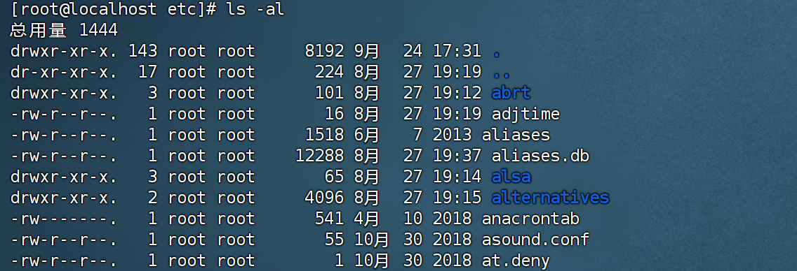

Liunx一般将文件可存取的身份分为三类：`owner`、`group`、`others`。且三种身份各有read/write/execute等权限

## 2.1 使用者与群组

#### 2.1.1 文件拥有者

​	由于Liunx是个多用户多任务的系统，因此会有多人同时使用这部主机。文件拥有者可以很好的保护每个人的隐私权。非该文件拥有者无法知道该文件的内容

#### 2.1.2 群组

​	在Liunx中，我们可以设置群组。群组里面有成员。可以通过设置成员的不同权限，去访问或修改群组的内容。

#### 2.1.3 Liunx使用者身份与群组记录的文件

​	在Liunx系统中，默认的情况下，所有的系统上的账号与一般身份使用者，还有root的相关信息，都记录在==/etc/passwd==这个文件夹内的。至于个人的密码则是记录在==/etc/shadow==文件下。此外，Liunx所有的群组名称都记录在==/etc/grop==内。

## 2.2 Liunx文件权限概念

#### 2.2.1 Liunx文件属性

​	当我们首次登录系统时，是以`dmtsai`身份登录。当我们使用`su -`切换为root用户后。输入命令`ls -al`查看

​	提示：exit可以回到普通用户身份

​	我们拿出一条记录

主机：CPU、内存