## 任务：测试30条Liunx常用命令


## 1.ls

显示指定bin下的所有文件，

```bash
ls bin -a
```

输出：

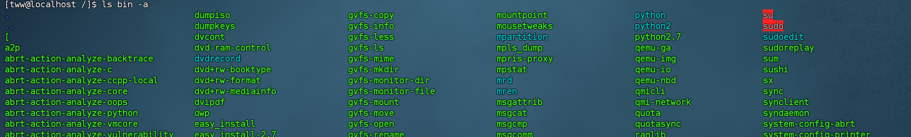


## 2.cd

将工作目录改到Documents文件夹下：

```bash
cd home/tww/Documents;
```

输出：


## 3.mkdir命令

在当前目录创建一个`task`目录

```bash
mkdir taks;
```

输出：


## 4 rmdir命令

删除当前目录的delete目录

```bash
rmdir delete
```

输出：


## 5.rm命令

删除task目录下的子目录及相应文件

```bash
rm -r task
```

输出：


## 6 touch

在Test目录下创建一个Hello.c文件

```bash
touch Test/Hello.c
```

输出：

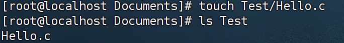


## 7. shutdown

指定Liunx系统在10分钟后关机，然后取消shutdown命令

```bash
shutdown -h 10
shutdown -c
```

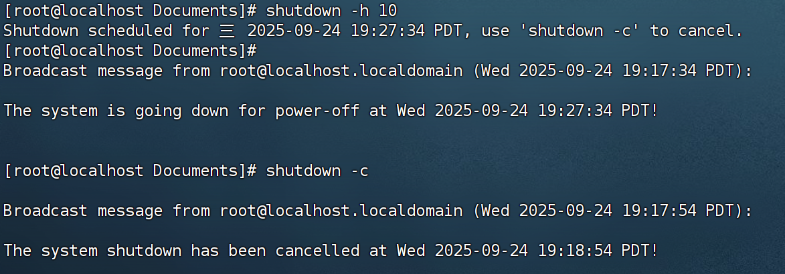


## 8.grep

在Hello.c文件中查找`Hello`单词,并显示行号

```bash
grep -n Hello Test/Hello.c
```

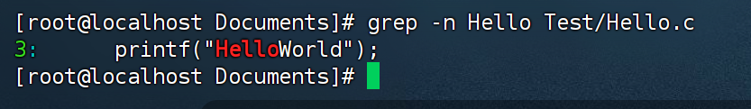

## 9.reboot

不真的重开机，将记录写到/var/log/wtmp档案里

```bash
reboot -w
```

输出：

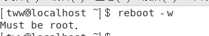


## 10.halt

在关机前先把所有网络相关装置先停止，并不会真的关机

```bash
halt -w -i
```

输出：


## 11 vlock

锁住终端后，输入密码解锁

```bash
vlock
password
```

输出：

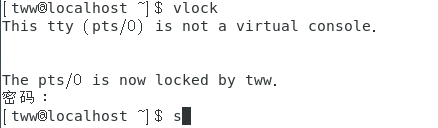


## 12 exit

退出终端

```bash
exit
```

输出：

该命令输入后，终端会关闭，回到桌面。


## 13 cat

显示Test目录下的Hello.c文件内容。并显示行号。

```bash
cat -b Test/Hello.c
```

输出：

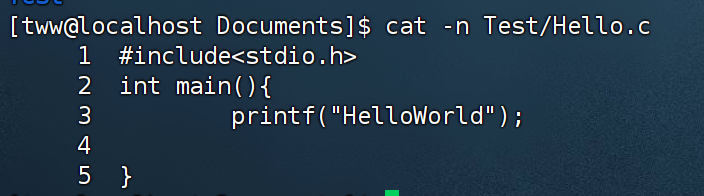


## 14 more

使用more命令显示文件内容。它会一页页的形式显示，但当文件内容过少时，它的作用与cat类似

```bash
more Test/Hello.c
```

输出：

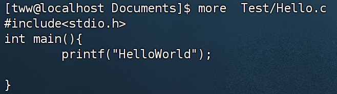


## 15 hostname

显示当前主机名的所有信息

```bash
hostname -V
```

输出：

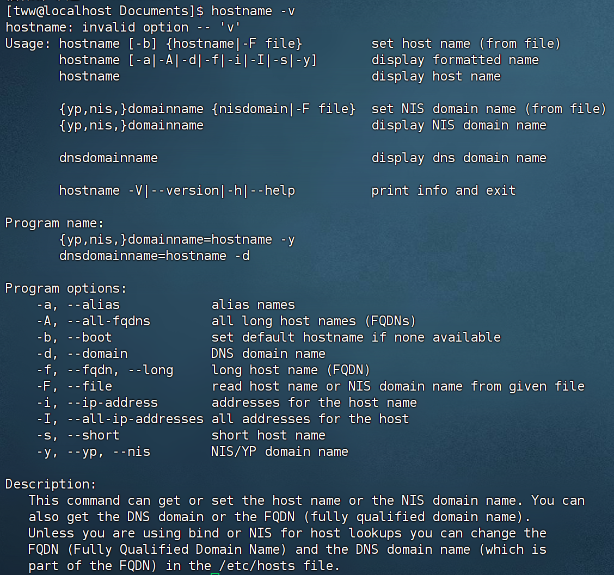


## 16ping

测试www.bilibili.com与主机的连接性：

```bash
ping www.bilibili.com
```

输出：

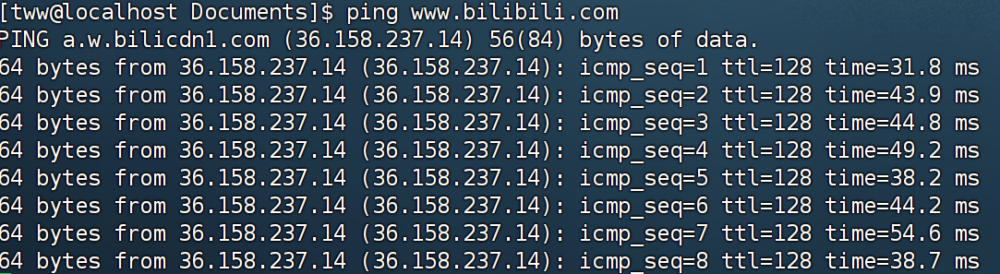


## 17 host

查找域名www.bilibili.com的IP地址

```bash
host www.bilibili.com
```

输出：


## 18 ifconfig

显示本机的所有的网络配置信息

```bash
ifconfig -a
```

输出


## 19 traceroute

​	显示由本机达到119.75.217.109(百度首页)的路由路径

```bash
traceroute 119.75.217.109
```

​	输出：

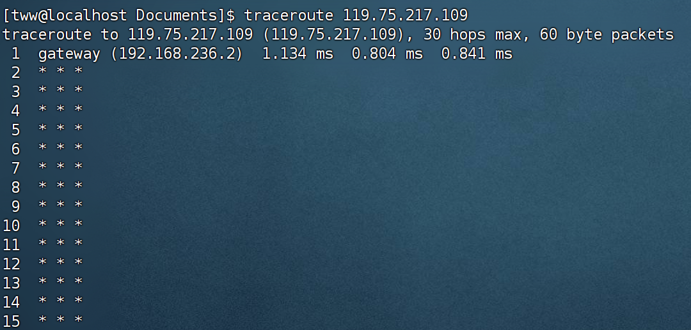


## 20 netstat

​	显示与网络相关的状态信息。并显示所有配置的接口，显示接口统计信息。以数字形式显示ip地址

```bash
netstat -a -i -n
```

输出：

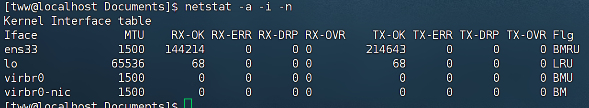


## 21 pwd

​	显示当前工作目录的绝对路径

```bash
pwd
```

输出：


## 22 gzip

​	压缩Test\Hello.c文件，保留原文件

```bash
gzip Test/Hello.c
```

输出：

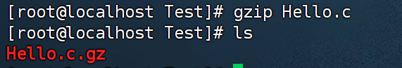


## 23 gunzip

​	解压缩后缀为.gz的压缩文件。

``` 
gunzip Hello.c.gz
```

​	输出：

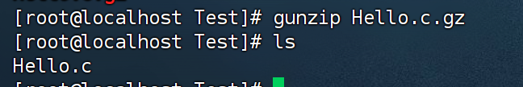


## 24 echo

在显示屏上显示指定字符串

```bash	
echo Hello
```


## 25 date

显示日期

```bash	
date
```

输出：


## 26 cal

​	显示日历

```bash	
cal 
```

​	输出：

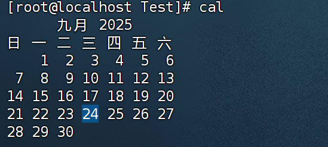

## 27 alias

​	显示系统中已经定义的别名

```bash	
alias
```

输出：

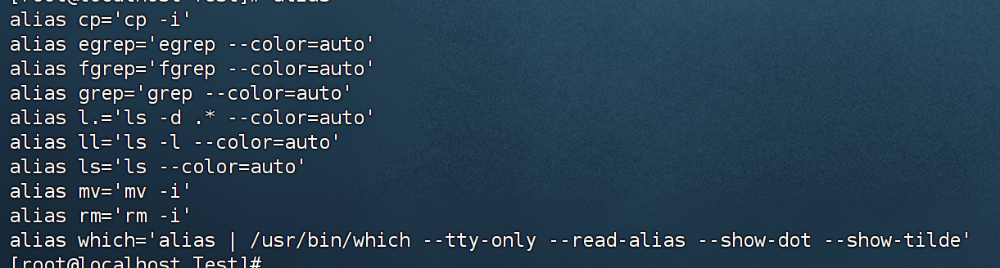


## 28 file

​	识别文件类型

```bash	
file Hello.c
```

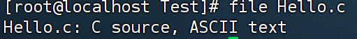


## 29.su

​	用于切换root用户。输入密码后，命令前变为#即代表root用户

```bash	
su
```

输出：


## 30 clear

​	清除终端屏幕信息

```bash	
clear
```

输出：

