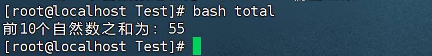

# 5-9

源程序

```bash
#!/bin/bash 
case  $1  in  
1) echo "month is January";; 
2) echo "month is February";; 
3) echo "month is March";; 
4) echo "month is April";; 
5) echo "month is May";; 
6) echo "month is June";; 
7) echo "month is July";; 
8) echo "month is August";; 
9) echo "month is September";; 
10) echo "month is October";; 
11) echo "month is November";; 
12) echo "month is December";; 
*) echo "Invalid parameter.";; 
esac
#end

```

执行结果：

```bash
[root@localhost Test]# bash example9 5
month is May
```


# 5-15

源代码：

```bash
#!/bin/bash
for  day  in  Monday  Wednesday  Friday  Sunday 
do 
echo  $day 
done 
#end 

```

执行结果：

```bash
[root@localhost Test]# bash example15
Monday
Wednesday
Friday
Sunday
```


# 5-21

```bash
#!/bin/bash
displaymonth(){ 
case $1 in 
1)echo "month is January";; 
2)echo "month is February";; 
3)echo "month is March";; 
4)echo "month is April";; 
5)echo "month is May";; 
6)echo "month is June";; 
7)echo "month is July";; 
8)echo "month is August";; 
9)echo "month is September";; 
10)echo "month is October";; 
11)echo "month is November";; 
12)echo "month is December";;   
*) echo "Invalid parameter";; 
esac 
} 
while  true 
do  
   echo  "input month's number; "
   read  mm 
   displaymonth   $mm 
   echo  "continue(y/n)? " 
   read  answer 
   if  [  "$answer" = "n" ]||[ "$answer" = "N" ];  
   then
       break
   fi
done
#end

```

执行结果：

```bash
[root@localhost Test]# bash example21
input month's number; 
1
month is January
continue(y/n)? 
y
input month's number; 
2
month is February
continue(y/n)? 
y
input month's number; 
11
month is November
continue(y/n)? 
y
input month's number; 
12
month is December
continue(y/n)? 
n
[root@localhost Test]# 
```


# 附加题

```shell
sum=0  # 初始化总和为0
for ((i=1; i<=10; i++))  # 循环1到10的自然数
do
    sum=$((sum + i))  # 累加每个数到总和
done
echo "前10个自然数之和为：$sum"  # 输出结果
```

执行结果：


