## 任务：测试20条vi命令


### 1.vi编辑文件

使用vi编辑器打开Hello.c文件

```bash
vi Hello.c
```

输出：

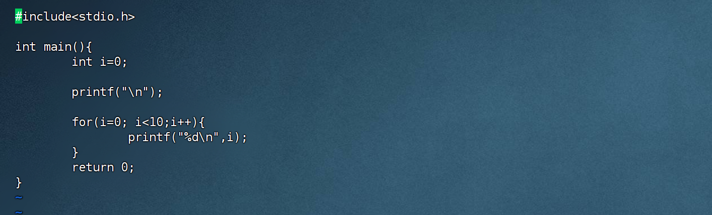


### 2.命令方式：i(插入命令)

该命令在光标前插入字符

```bash
命令方式下输入i。
```

输出：

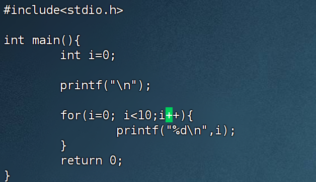

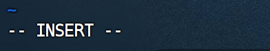


### 3 命令方式: a（附加命令）

该命令在光标后附加字符

```bash
命令方式下输入a
```

输出：

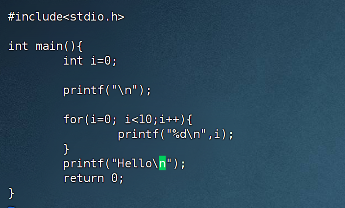


### 4 命令方式：o

该命令在光标下一行插入字符

```bash
命令方式下输入o
```

输出：

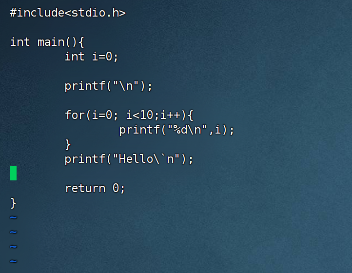

### 5 wq（保存并退出）

将缓冲区的内容写进指定文件，并退出编辑器：

```bash
:wq
```

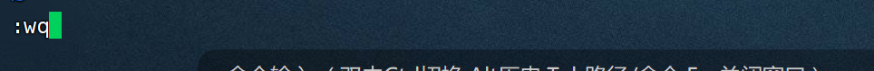

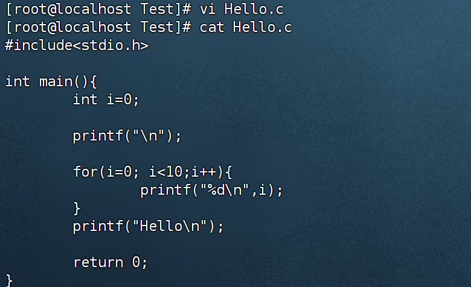


### 6 x（退出）

​	仅当对所编辑的内容做修改时，才将缓存区的内容写进文件（保存）

```bash
:ZZ
```

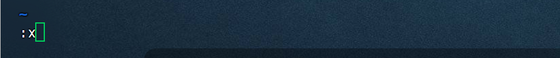

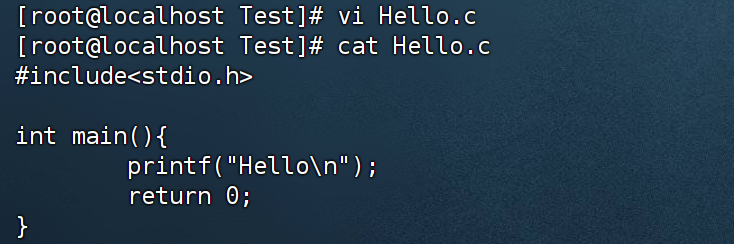


### 7 q!（强制退出）

​	强制退出vi编辑器。使用该条命令时，不会保存所编辑的内容

```bash
:q!
```

​	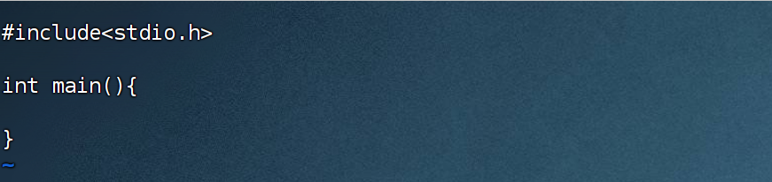

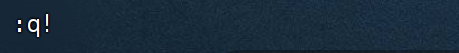

 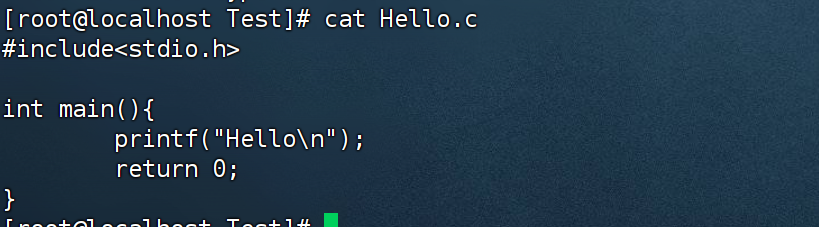

​	删除一些内容后，使用q!退出，该文件内容没有发生改变。


### 8 移动光标：l（向右移动）

​	光标向右移动一个字符。如下，在移动之前，光标处于c字母上

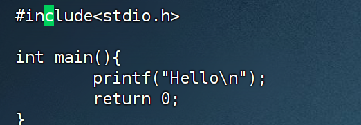

​	在命令方式下，输入l（L）。

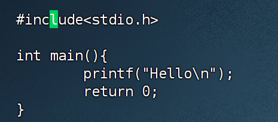


### 9 移动光标：h（向左移动）

​	光标向左移动一个字符。移动之前，光标处于字母t上

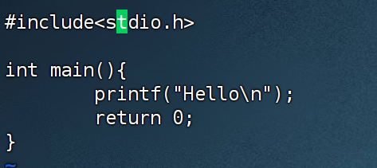

​	在命令方式下，输入h

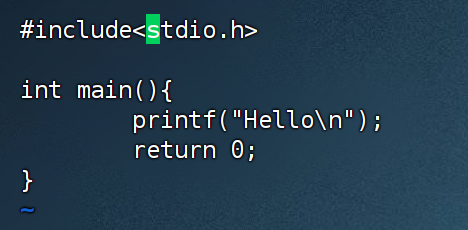


### 10 移动光标：k（向上移动）

​	光标向上移动一行。移动之前，光标处于第3行

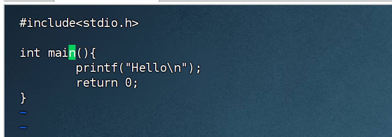

在命令模式下，输入k

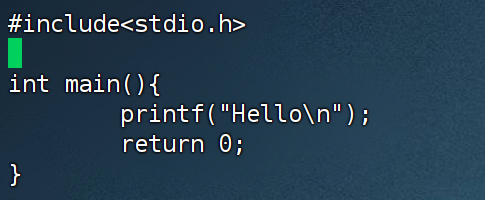


### 11 移动光标 j 、+、Enter、Ctrl+N (向下移动)

​	这几个命令功能相同，在命令模式下让光标向下移动一行。移动之前，光标处于第4行

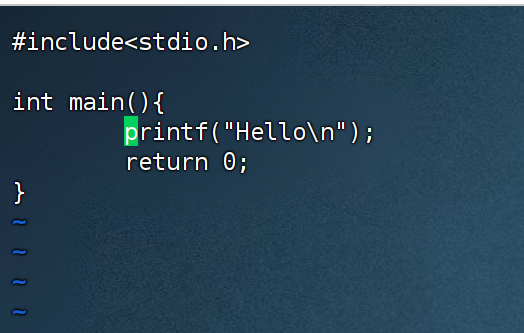

​	在命令模式下，输入j

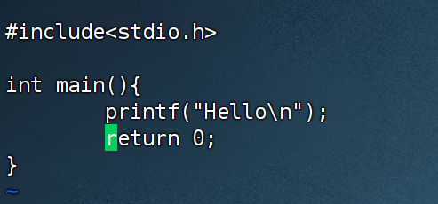


### 12.  0(数字,移动到行首) 

​	该命令将光标移动到当前行的第一个字符，不管它是否为空白字符，移动之前

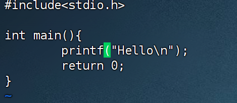

​	在命令模式下，输入数字0.

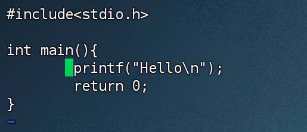


### 13 $ (移动到行尾) 

​	将光标移至当前行行尾，停在最后一个字符上。移动前：

​	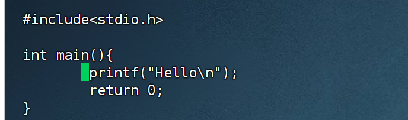

​	在命令模式下，输入$.

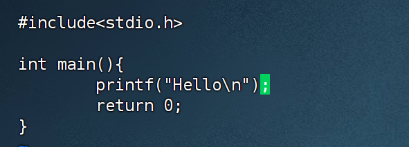


### 14.  w（移动至下一个单词首字母）

​	将光标移动至下一个单词首字母。移动前：

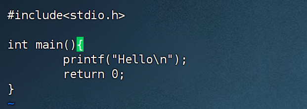

​	在命令模式下，输入w

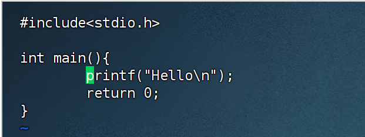


### 15 文本修改 x

​	删除光标所在字符。删除前


在命令模式下输入x。

​	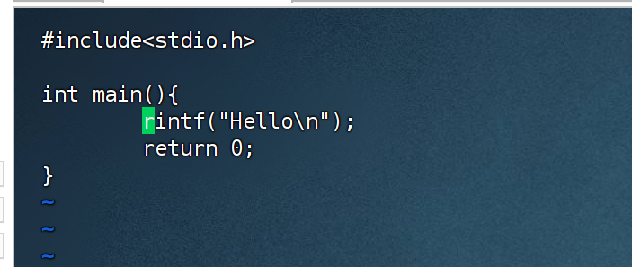


### 16 文本修改 $nX$（删除前n个字符，包括光标本身）

​	删除光标后5个字符。删除前

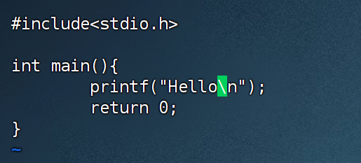

​	在命令模式下，输入5x

​	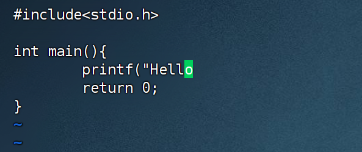


### 17 文本修改 dd（删除光标所在的整行）。

​	删除光标所在的整行。删除前：

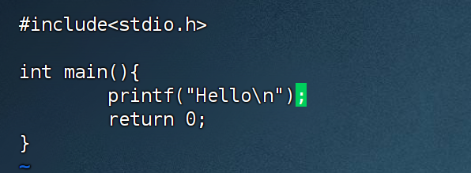

​	在命令模式下输入dd。

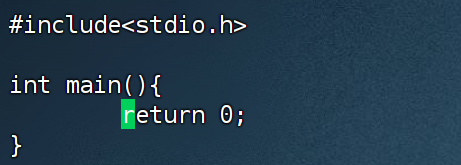


### 18 文本修改 D（从光标位置开始删除到行尾）

​	删除前：

​	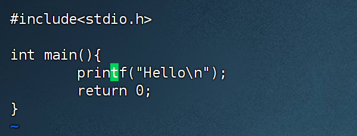

​	在命令模式下输入D

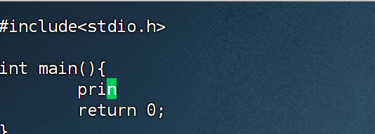


### 19 文本修改 u

​	复原命令，取消刚才的插入或删除命令，复原前：

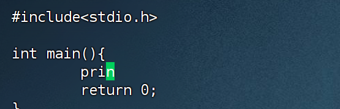

​	在命令模式下。输入u

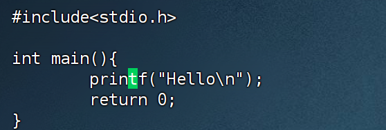


### 20 wq! 

​	保存文件并退出vi编辑器。强制执行该操作，忽略警告或条件。

​	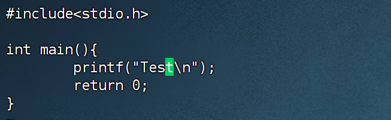

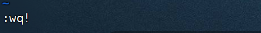

​	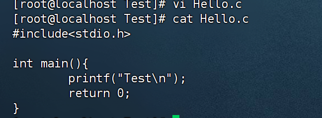