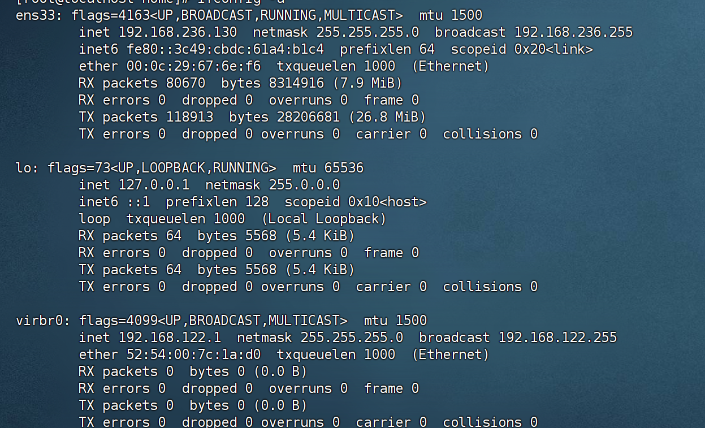
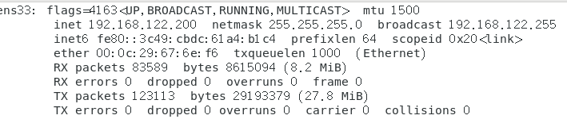
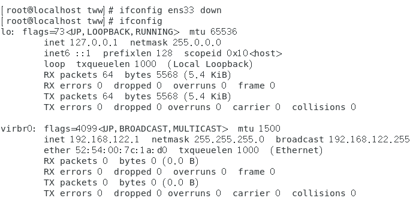
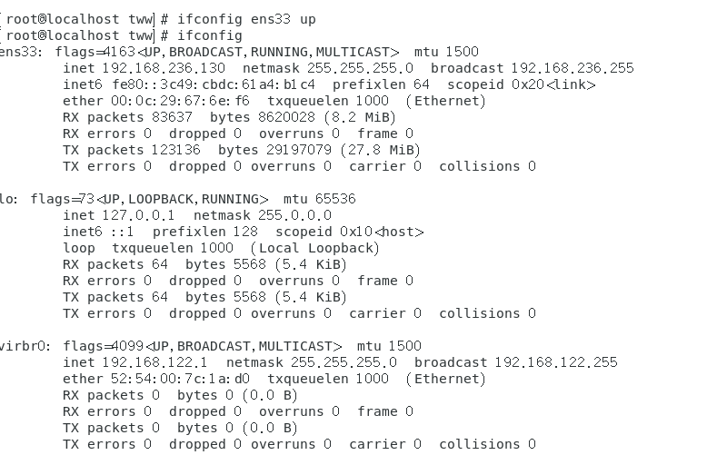
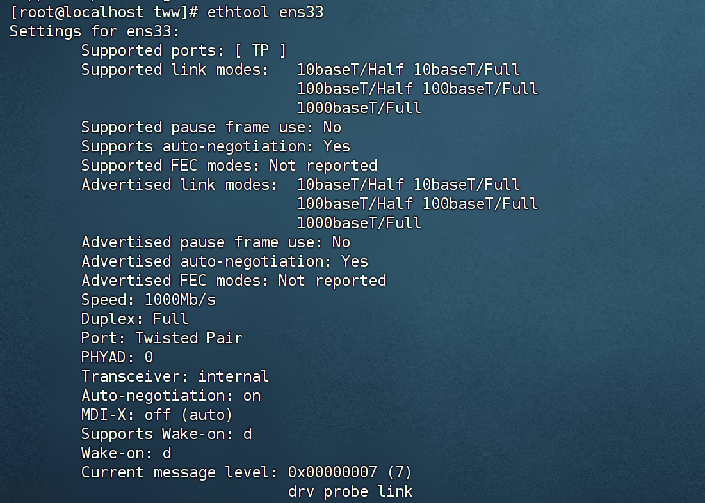
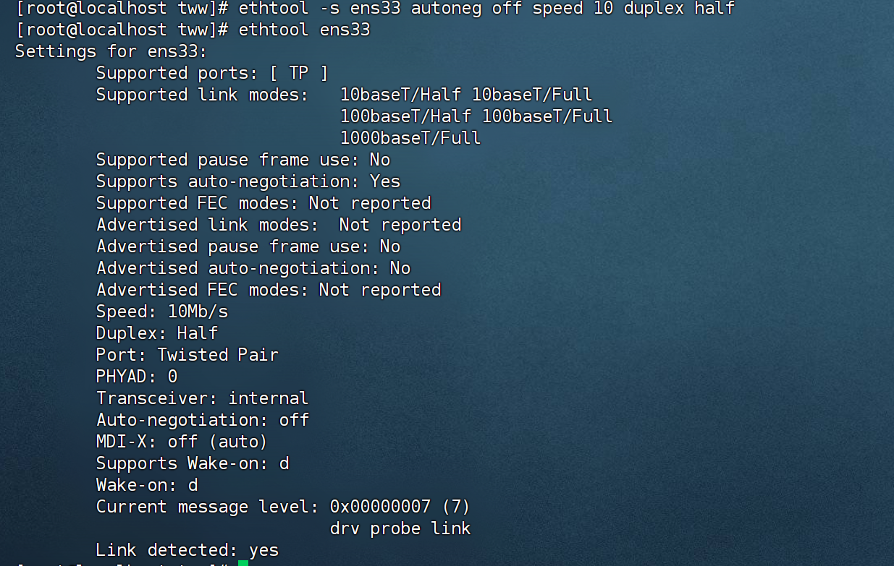
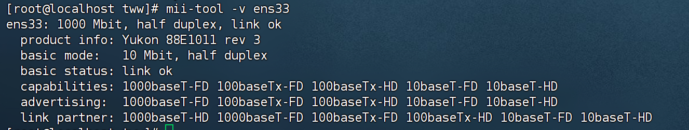
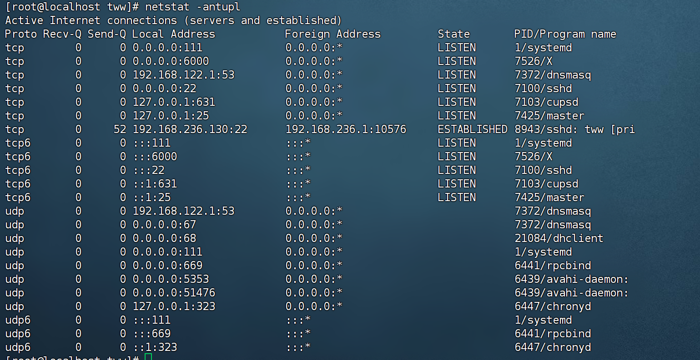
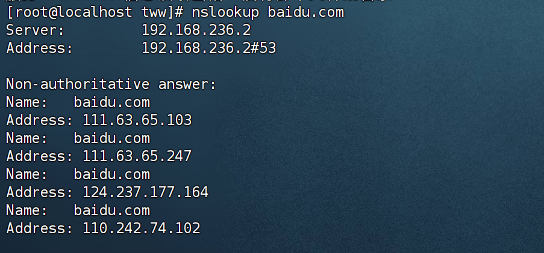
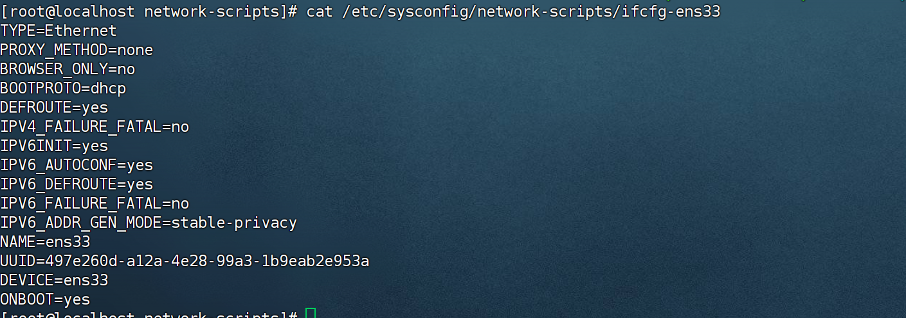

## 1. ifconfig

​	显式网卡的配置信息

```bahs
ifconfig 
```



#### 1.1 为网卡指定临时ip地址

​	将网卡ip地址设置为`192.168.122.200`,同时子网掩码设置为`255.255.255.0`。

```bahs
ifconfig ens33 192.168.122.200 netmask 255.255.255.0
```




#### 1.2 禁用网卡

​	用法`ifconfig 网卡设备名 down`



​	被禁用后无法查询到该网卡的相关信息

#### 1.3 启用网卡

​	用法`ifconfig 网卡设备名 up`




## 2.netconfig

 	在CentOs系统中没有该命令


## 3. ethtool

​	该命令用来查看和修改网卡传输速率、半双工、全双工、网卡连接状态、自适应工作方式等。




#### 3.1 修改网卡设置

​	将网卡自适应关闭，传输速率为10mb/s，工作模式为半双工

```bahs
ethtool -s ens33 autoneg off speed 10 duplex half
```




## 4.mii-tool

​	该命令同样用于查看、管理网卡的接口状态。




## 5.netstat

​	该命令用于监听及连接的情况。

​	用法:`netstate [参数选项]`

```bahs
netstat -antupl
```




## 6 nslookup

​	该命令用于检测域名对应的ip地址 或者根据ip地址检测出对应的域名




## 7. 网络配置文件

​	

#### 7.1 /etc/sysconfig/network-scripts/ifcfg-ens33

`/etc/sysconfig/network-scripts/ifcfg-eth0`网卡信息配置文件，包括网络接口设备、协议类型（静态、动态）、IP地址、子网掩码、网关、DNS服务器等。可以通过netconfig命令进行设置，也可直接编辑此配置文件进行更改。其中`ifcfg-eth0`该为自己主机上的网卡名




#### 7.2 /etc/sysconfig/network 

​	**主要用于设置Linux系统的主机名及系统启动时是否加载网卡信息**

