# 1.useradd

 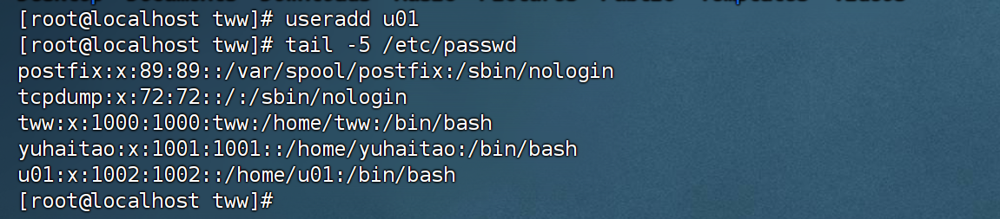

# 2.usermod

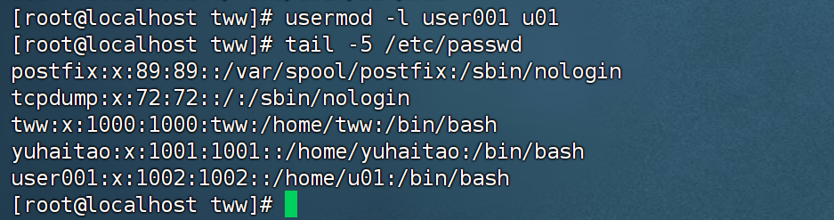

# 3.userdel

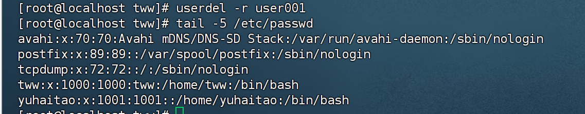

# 4.passwd

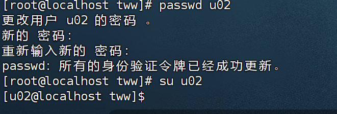

# 5.groupadd

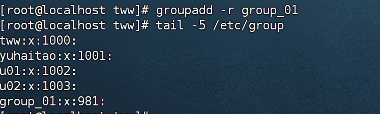

# 6.groupmod

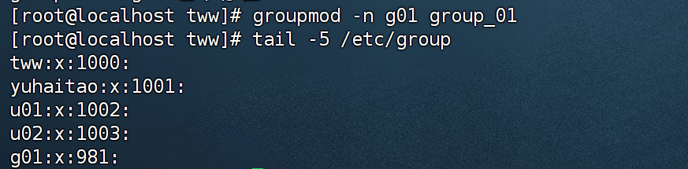

# 7. groupmod -g

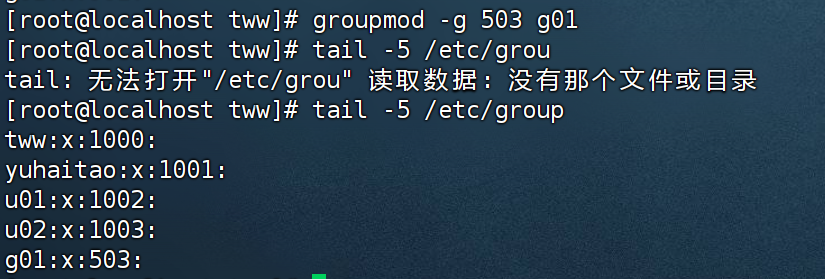

# 8.groupdel

​	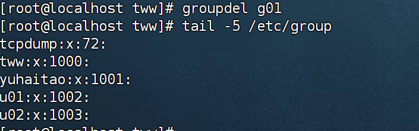

# 9.gpaaswd

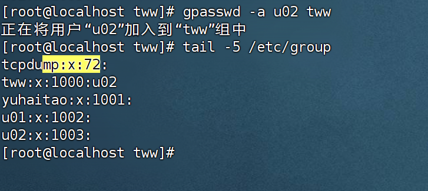

# 10 gpasswd -d

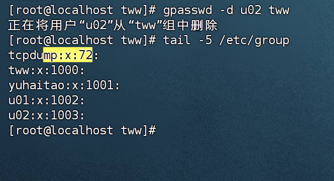

# 11. id

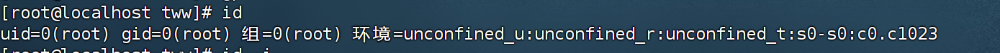

# 12. who

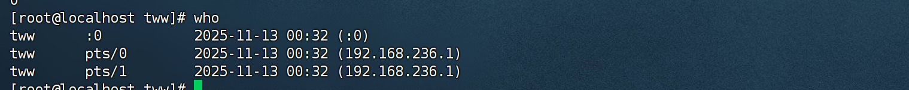

# 13 whoami

