## 1. useradd

​	创建用户u01和u02。并查看`/etc/passwd`文件夹

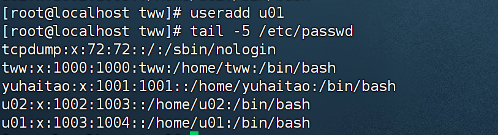


## 2.usermod

​	使用该命令修改用户名并修改所属用户组。

### 2.1 修改用户名

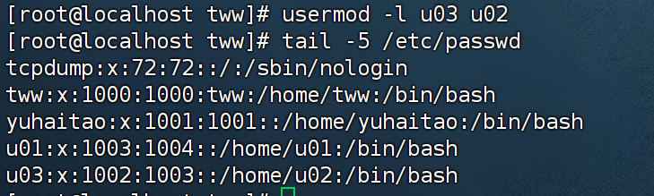

​	将u02用户名修改为u03，可选项使用`-l`


### 2.2 修改所属用户组

​	将u03的用户修改到u01用户组去。可选性使用`-g`

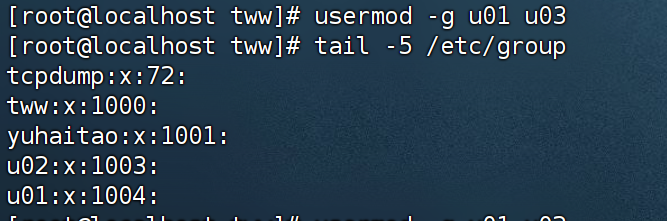


### 2.3 锁定账户

​	锁定后该账户暂时禁止登录系统。可选项`-L`。该用户在`/etc/shadow`密码配置文件中密码字段会出现“!”

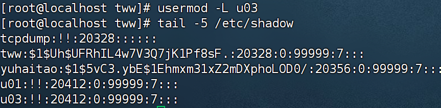


### 2.4 解除锁定

​	可选项`-U`，相反的，密码字段钱的`!`会消失。锁定账户后，若账户没设密码，会需要先设置密码再解除锁定


​	先使用`passwd`命令设置密码。

​	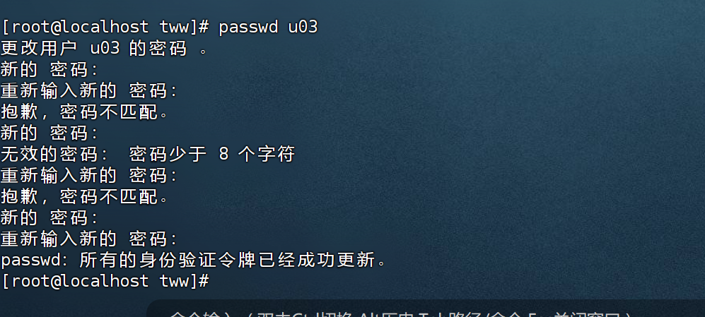

​	这里设置`242656LOVE`

​	在使用`usermod -U u03`解除锁定

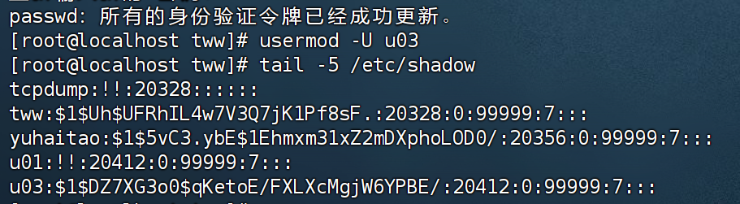

​	可以看见`u03`密码字段前面的“！”消失了。`u01密码为:24265601`


## 3. userdel

​	该命令用于删除用户，可选参数`-r`删除用户的同时删除该账户对应的主目录。

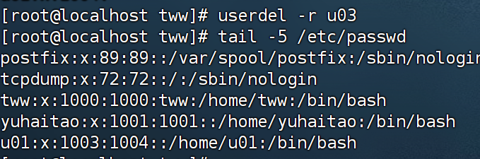


## 4.passwd

​	该命令用于设置账户密码等操作。


### 4.1 设置密码

​	

​	这里我将`u01`的密码设置为`242656LOVE`


### 4.2 锁定密码 

​	通过锁定密码，可暂时禁止用户登录系统。可选项`-l`

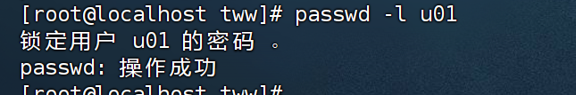


### 4.3 解除密码

​	解除密码锁定，可选项`-u`

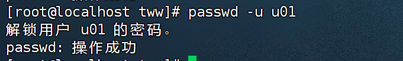


### 4.4 查询密码状态

​	`password locked`表示被锁定，`password set,MD5 cryt`则没有被锁定。可选性`-S`

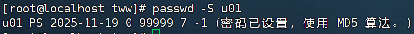


### 4.5 删除密码

​	可选性`-d`，用户密码被删除后，该账户不能再登录系统。

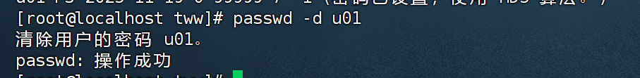


## 5. group

​	每个用户都有一个用户组。一个用户组可以包含多个用户，可以对它进行增删改查。


### 5.1 增加用户组(groupadd)

​	现在增加一个`normal`用户组，可选项`-r`。表示创建系统用户组，其组ID小于500；普通用户组ID大于或等于500

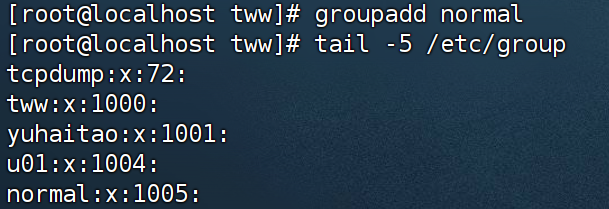

​	可以看见该用户组id为：`1005`


### 5.2 修改用户组名(groupmod)

​	可选参数`-n`。第一个名字表示新名字，第二个名字表示原用户组名。将`normal`用户组修改为`common`用户组

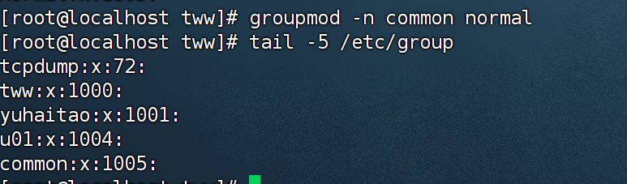

​	只是修改了用户组名。用户组id并没有修改。


### 5.3 设置用户组ID

​	可选项`-g`,用法：`groupmod -g NewGid groupname`

```bash
groupmod -g 1101 common
```

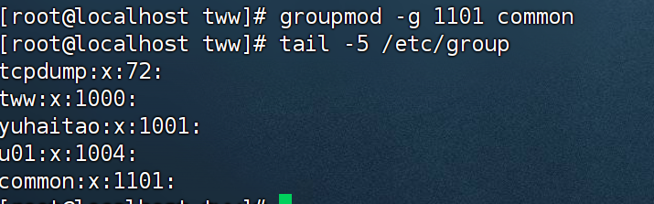


### 5.4 为用户组添加用户

​	可选项`-a`，用法：`gpasswd -a 用户名 用户组名`

```bash
gpasswd -a commonUser01 common
```

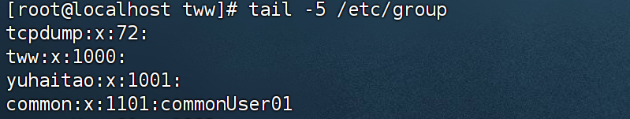


### 5.5 从用户组删除用户

​	可选项`-d`。用法`gpasswd -d 用户名 用户名`

```bash
gpasswd -d commonUser01 common;
```

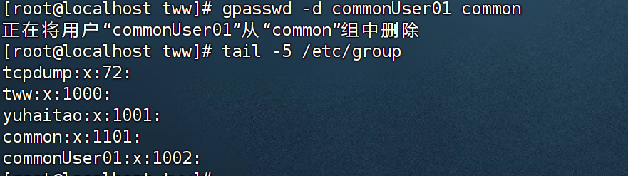


### 5.6 设置用户组管理员

​	可选项`-A`，用法`gpasswd -A 用户名 用户组名`

```bash
gpasswd -A commonUser01 common;
```

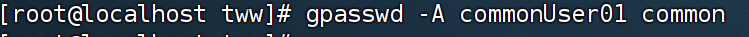


### 5.7 删除用户组

​	用法：`groupdel 用户组名`

```bash
groupdel common;
```

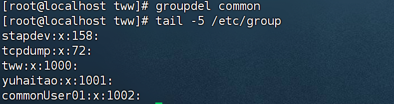


## 6. id

​	id命令会显式用户以及所属的群组的实际与有效id。用法

```bash
id [参数选项] [用户名称]
```

```bash
id  tww
```

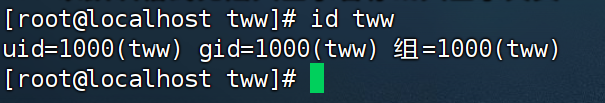


## 7 who

​	查看登录到本台机器的当前用户

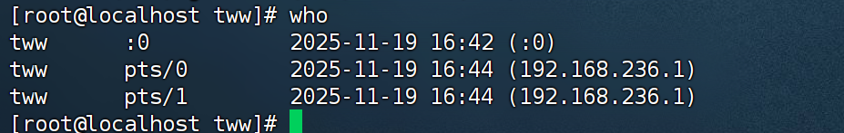


## 8. whoami

​	查看显式当前操作用户的用户名。

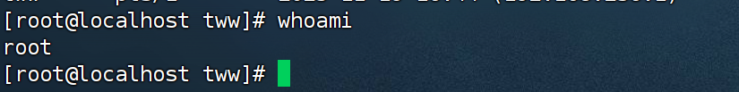