## 1.ls

​	列出目录内容:` ls [-a] [-l]`

​	参数：

1. `-a`: 显示所有文件
2. `-l`: 以详细信息列出文件


## 2.cd

​	切换工作目录，使用方式: `cd 绝对路径(或相对路径)`


## 3. mkdir

​	创建一个目录。使用方式：`mkdir 文件名(或指定路径下创建)`

​	


## 4.rmdir

​	删除目录。使用方式 :`rmdir [-p] 文件名(或指定路径下的某目录)`。注意rmdir只能删除空目录

​	参数：

1. `-p`：子目录被删除后使它也成为空目录的话，顺便一并删除。

​	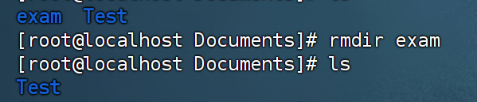


## 5.rm

​	删除一个文件或目录：`rm [options] 文件名`

​	参数：

1. `-i` :删除前逐一询问确认
2. `-f`:即使原文档属性设为唯读，也删除
3. `-r`:将目录及以下文件逐一删除


## 6. touch

​	创建一个文件：`touch （或指定目录下）文件名`


## 7.shutdown

​	关机命令，可以在关机以前传送讯息给所有使用者正在执行的程序。使用方式

```bash
shutdown [-t seconds] [-rkhncfF] time [message]
```

​	参数：

1. `-t seconds`:设定在几秒后进行关机程序
2. `-k:` 不会真的关机，只是将警告讯息传送给所有使用者。
3. `-r`:关机后重新开机。
4. `-h`:关机后停机。
5. `time`: 设定关机的时间
6. `-c`:取消关机动作
7. `message`:传送给所有使用者的警告讯息。

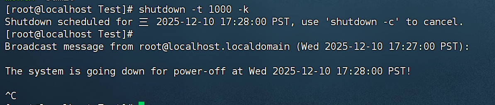


## 8. reboot

​	用来重启计算机。`reboot [options]` 

​	参数

1. `-w`:不会真的重启，只是把记录写到`/var/log/wtmp`里
2. `-f`: 强迫重开机


## 9.grep

​	用于在文件内查找指定的字符串。

```bash
grep [options] pattern [files]
```

​	`pattern` 表示要查找的字符串或正则表达式

​	`files`表示要查找的文件名。

​	参数：

1. `-i`:忽略大小写进行匹配
2. `-v`:反向查找
3. `-n`:显示匹配行的行号
4. `-i`:只打印匹配的文件名。
5. `-c`:只打印匹配的行数

在Test.txt文件里查找ABC字符串。


## 10. vlock

​	用于锁住终端。锁住终端后，输入密码解锁终端

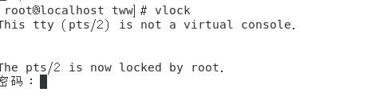


## 11 exit 	

​	退出终端，如果在root模式下，则会退出为普通用户


## 12.cat

​	显示文件内容。`cat [-options] 文件名`

​	参数

1. `-n`:显示行号。


## 13.more

​	逐页显式长文件内容。`more [-num]`

​	-num：一次显式的行数

​	一页显示5页，显示gunzip

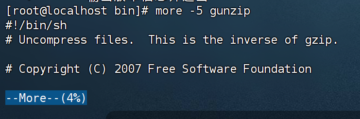


## 14. hostname

​	显式当前主机名。


## 15.ping

​	用于检测与另一个主机之间的网络连接，下面测试与www.bilibili.com的网络连接

​	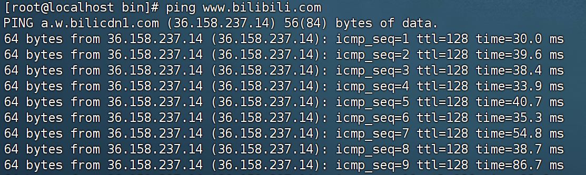


## 16. ifconfig

​	用于显示或设置网络设备

​	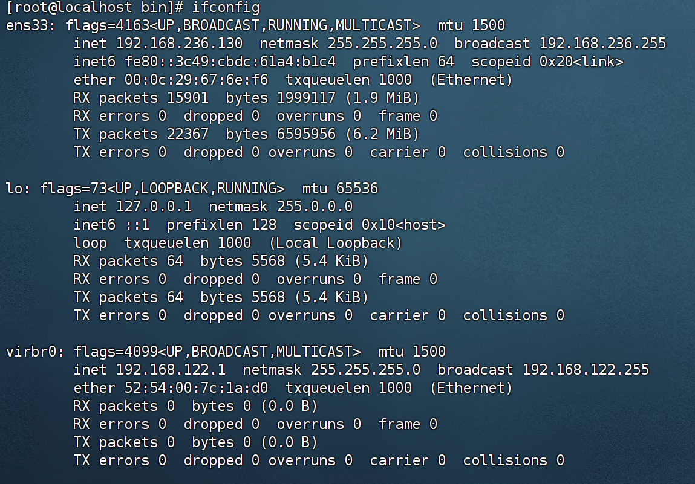


## 17 traceroute

​	用于显示数据包到主机间的路径：`tracetrout www.bilibili.com`

​	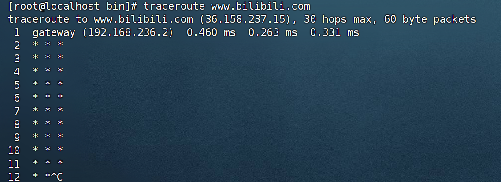


## 18 pwd

​	显式当前工作目录


## 19 gzip

​	将文件压缩为`.gz`文件：`gzip [options] [file]`。压缩后会默认删除原始文件

​	参数：

1. `-d`:解压缩.gz文件。相当于使用`gunzip`命令
2. `-k`: 保留原始文件，不删除
3. `-r`:递归压缩目录下的所有文件
4. `-v`：显式详细的压缩过程。

将Test.txt压缩为Test.txt.gz


## 20 gunzip 

​	解压缩`.gz`文件。`gunzip [option] 压缩文件`

​	参数：

1. `-v`:显示详细的解压缩信息。

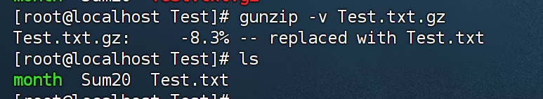


## 21 echo

​	输出字符串：`echo pattern`


## 22 date

​	输出日期


## 23 cal

​	输出日历


## 24 alias 

​	显示系统中的别名

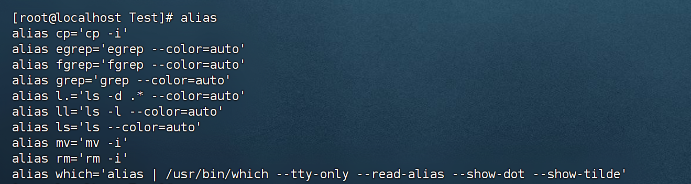


## 25 file

​	辨别文件类型 。`file [-options]`

​	参数

1. `-v` 显示版本信息

​	


## 26 su

​	切换root用户


## 27 clear

​	清除屏幕


## 28.vi

​	启用vi编辑器编辑文件：`vi 文件名`

​	操作命令：

1. `i`:插入
2. `a`:附加
3. `wq`:保存并退出
4. `q！`：强制退出


## 29 chmod

​	控制用户对文件的权限。

```bash
chomd [-option] 权限模式 文件名
```

​	参数

1. `u`:文件拥有者，g同组，o其他人，a三者皆是
2. +增加权限，-取消权限。=唯一设定权限
3. r可读取，w可写入，x可执行。

下面对Test.txt附加可执行权限。

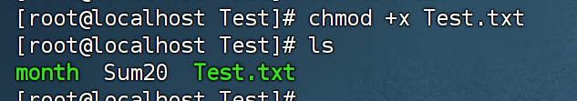


## 30 cp

​	将源文件或目录复制到目标目录中。

```bash
cp [options] 源文件或目录。目标文件或目录
```

​	


## 31 whoami

​	显式当且用户名

​	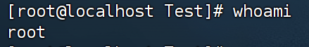

## 31 id

​	显式用户和组ID

​	

## 32 who

​	显式登录用户

​	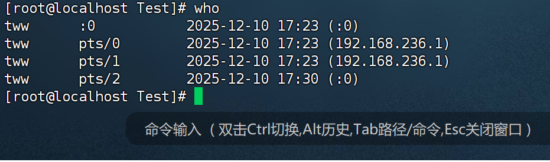


## 33 history

​	显式命令历史记录

​	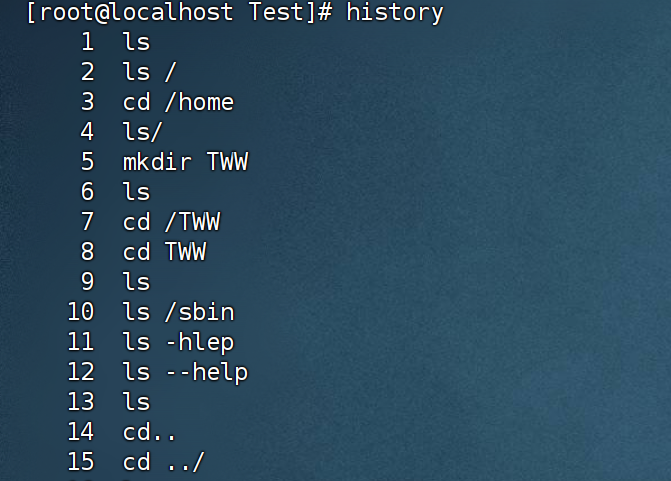


## 34 tail

​	支持从尾部查看文件内容。

```bash
tail [参数] [文件]
```

​	例如：`tail -5 Test.txt`

查看文件最后五行内容


## 35 diff

​	比较文本差异

```bash
diff [-options] [文件1] [文件2]
```

​	参数:

1. `-c`：显示全部内文，标出不同之处

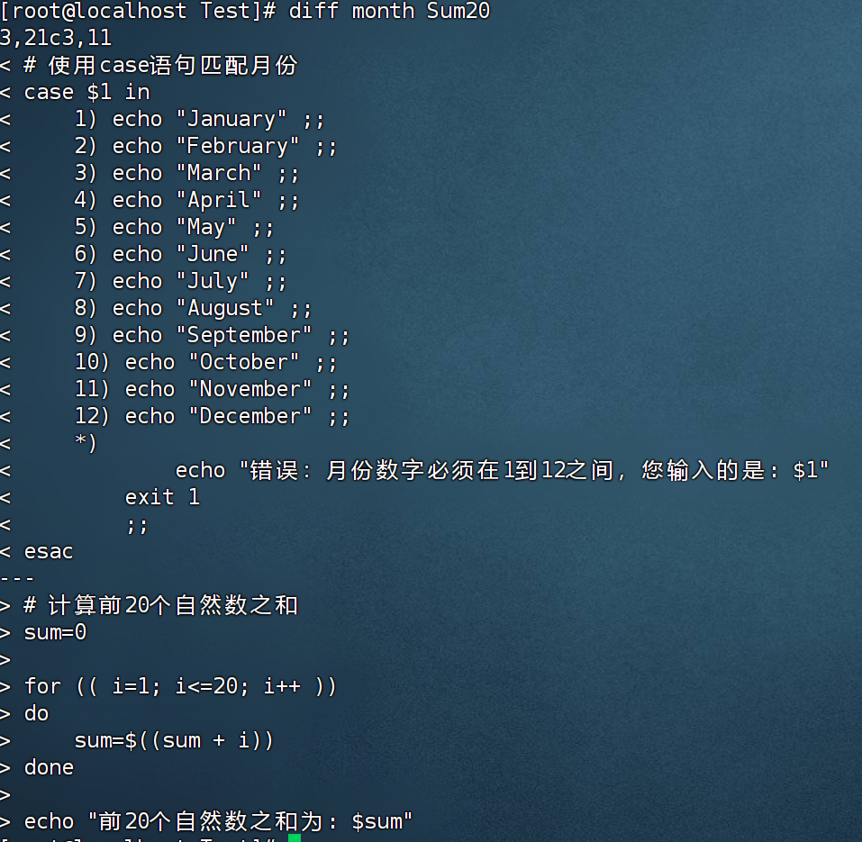


## 36 logname

​	显式当且登录名。


## 37 uptime

​	显示系统运行时间。

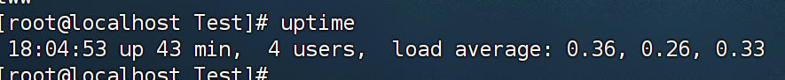


## 38 ethtool

​	查看和修改网络配置

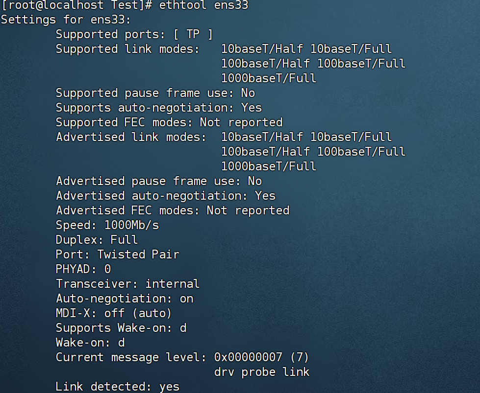


## 39 mii-tool

​	查看和管理网卡的接口状态

​	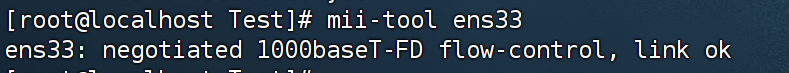


## 40 mv

​	移动文件


​			

