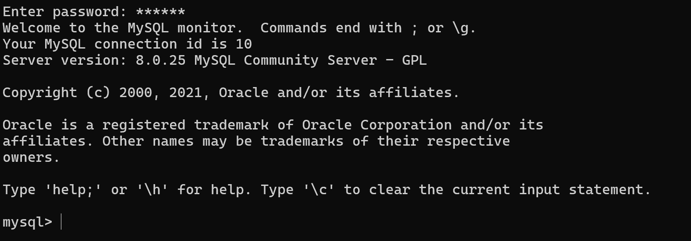
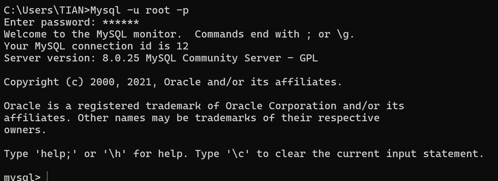
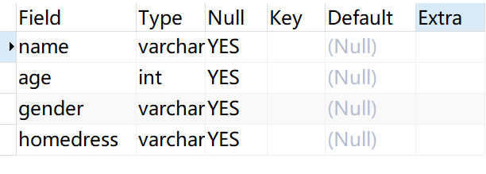
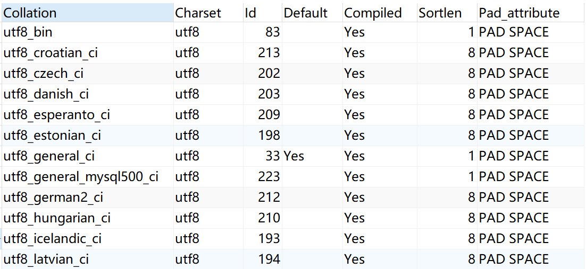
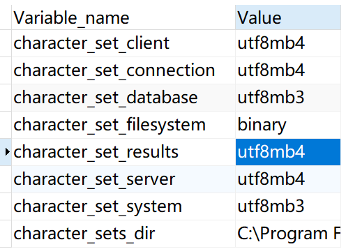
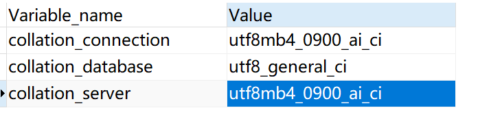

## 1.1 什么是SQL

​	SQL（Structured Query Language) 全名3结构化查询语言，SQL语法简单，命令少，简单易用。SQL按照实现的功能不同，主要分为四类：数据定义语言、数据查询语言、数据操纵语言和数据控制语言。

| SQL的4类语言 | 缩写 | 全称                       |
| ------------ | ---- | -------------------------- |
| 数据定义语言 | DDL  | Data Definition Language   |
| 数据操纵语言 | DML  | Data Manipulation Language |
| 数据查询语言 | DQL  | Data Query Language        |
| 数据控制语言 | DCL  | Data Control Language      |

​	注意：**SQL语言并不限制大小写，但通常的规范化变成都是将SQL语言大小**

#### 1.1.1 数据定义语言（DDL)

​	数据定义语言(DDL)是一组SQL命令，**主要用于创建和定义数据库对象，并将定义保存在数据字典中。数据定义语言主要包括CREATE、ALTER和DROP主要3个语句**。


#### 1.1.2 数据查询语言(DQL)

​	数据查询语言(DQL)，主要用于对数据库中的各种数据对象进行查询，**主要包括SELECT语句，是数据库学习的重点。其基本结构是由SELECT子句，FROM子句和WHERE字句组成的查询块**。


#### 1.1.3  数据操纵语言(DML)

​	数据操纵语言(DML)主要用于操纵数据库中的数据。**数据操作语言包括INSERT、UPDATA和DELETE3个语句，供用户对数据库中数据进行插入、更新和删除等操作**。


#### 1.1.4 数据控制语言（DCL）

​	数据控制语言（DCL）可以对数据房屋内权限进行控制，**用于修改数据库结构的操作权限，由GRANT和REVOKE两个语句组成。用户可以通过授权和取消授权语句来实现相关数据的存取控制**。


#### 1.1.5 SQL的主要特点

​	（1）SQL是一种一体化的语言。SQL包括数据定义、数据查询、数据操纵和数据控制等方面的功能，可以完成数据库活动中的全部工作。

​	（2）SQL是一种非过程化的语言

​	（3）SQL是一种面向集合的语言。

​	（4）SQL既是自含式语言，又是嵌入式语言，可以嵌入高级语言中使用。


## 1.2 Mysql的主要组件

​	==Mysql分为server层和存储引擎两部分==。其中，**Server层包括连接器、查询缓存、分析器、执行器**。Server层都是通用的组件。所有跨存储引擎的功能都是在Server层实现，如存储过程、触发器、视图等。**存储引擎主要负责数据的存储和提取**。

|   组件   |                        功能                         |
| :------: | :-------------------------------------------------: |
|  连接器  |     与客户端建立连接、获取权限、维持和管理连接      |
| 查询缓存 |  执行查询语句时，会先到缓存中查看是否执行过该语句   |
|  分析器  |                 分析SQL语法是否正确                 |
|  优化器  | SQL执行前会使用优化器进行优化，选择出最优的查询方案 |
|  执行器  |                  对SQL进行权限校验                  |


#### 1.2.1体验Mysql

​	在完成安装Mysql之后，可以通过MYSQL Version Command Line Client使用。在打开之后，首先要求输入密码。在输入密码之后会出现Mysql的各种信息：



​	可以看到，在输入光标之前有mysql > 的字样，之后的命令输入就只能接受SQL语句。

​	当你正确配置了环境变量后，可以在命令行的任意位置输入`mysql --version`查看mysql的版本。同理，也可以输入如下命令在任意位置登录Mysql

```java
mysql -u root -p
```

​	在输入这条语句之后，按下回车，输入密码即可使用Mysql数据库




​	==输入`SHOW DATABASES;`可以查询所有的数据库==。

```java
+--------------------+
| Database           |
+--------------------+
| information_schema |
| mysql              |
| performance_schema |
| sys                |
+--------------------+
```

​	==`show TABLES`可以查询一个数据库的所有表。使用这条命令之前，要先使用`USE 数据库名`进入数据库==

```java
mysql> USE information_schema
Database changed
mysql> SHOW TABLES;
+---------------------------------------+
| Tables_in_information_schema          |
+---------------------------------------+
| ADMINISTRABLE_ROLE_AUTHORIZATIONS     |
| APPLICABLE_ROLES                      |
| CHARACTER_SETS                        |
| CHECK_CONSTRAINTS                     |
| COLLATION_CHARACTER_SET_APPLICABILITY |
| COLLATIONS                            |
| COLUMN_PRIVILEGES                     |
| COLUMN_STATISTICS                     |
| COLUMNS                               |
.........
```

​	SHOW也可以显示表列，==SHOW COLUMNS要求给出一个表名。它对每个字段返回一行，行中包括字段名。数据类型，是否允许NULL、键信息、默认值以及其他信息==，如

```java
SHOW COLUMNS FORM customers; //查询customers表结构
```


## 1.3 DDL

​	DDL是数据定义语言，专门用于定义和修改数据库的框架。


#### 1.3.1 操作数据库

​	我们可以通过DDL对数据库进行查询、创建、删除等操作。下面依次介绍

1. **查询数据库**

```sql
SHOW DATABASES; //查询所有数据库
SELECT DATABASE(); //查询当前数据库
```

2. **创建数据库**

```sql
CREATE DATABASE [IF NOT EXISTS] 数据库名 [DEFAULT CHAREST 字符集] [COLLATE 排序规则]
```

​	`IF NOT EXISTS`代表如果这个数据库不存在，则创建，如果存在，则不创建。可以通过`DEFAULT CHARSET `设置字符集，如设置为`UTF-8`。但在UTF8字符集最多只支持3个字节，这里推荐使用`utf8mb4`字符集。使用中括号[]扩起的，都是可选的参数

​	下面将创建一个`utf8mb4`字符集的数据库，名为School，如果该数据库已经存在，则不创建，只有为School的数据库不存在时才创建

```sql
CREATE DATABASE IF NOT EXISTS School DEFAULT CHARSET utf8mb4 
```

​	也可以使用最简单的创建数据库形式：
```sql
CREATE DATABASES School;
```

​	不过这条语句不会检查该数据库是否已经存在，如果该数据库已经存放，那么将会返回错误信息；

​	下面是在创建数据库时指定字符集和校对规则的完整语法

```sql
CREATE DATABASE [IF NOT EXISTS] db_name [[DEFAULT] CHARACTER SET charset_name] [[DEFAULT] COLLATE collation_name]
```

​	例，创建名称为teaching的数据库，设置默认字符集为`uft8mb4`，设置默认校对规则为`utf8mb4_0900_ai_ci`;

```sql
CREATE DATABASE IF NOT EXISTS teaching DEFAULT CHARACTER SET utf8mb4 DEFAULT COLLATE utf8mb4_0900_ai_ci
```


3. **删除数据库**

```sql
DROP DATABASE [IF EXISTS] 数据库名
```

​	`IF EXISTS`参数代表，如果该数据库存在，则删除，如果不存在，则不删除。

4. **使用**

```sql
USE 数据库名
```

​	**在操作表之前，必须先进入一个数据库**


#### 1.3.2 数据库表的操作

​	对于Mysql来说，它管理着多个数据库。而每个数据库又管理着多张表。现在我们对表进行一些列的操作。注意，**在对表进行操作之前，必须先进入数据库，也就是使用`USE 数据库名`**

**表查询**

​	查询当前库的所有表

```sql
SHOW TABLES;
```

​	查询表结构，表结构包含这几个属性`Filed、Type、Null、Key、Default、Extra`

```sql
DESC 表名;
```

​	下面是一张表的表结构：



​	

​	查询指定表的建表语句

```sql
SHOW CREATE TABLE 表名
```


2. **表创建**

​	创建表的基本格式：

```sql
CREATE TABLE 表名(
	字段1 字段1类型[DEFAULT] [AUTO_INCREMENT]  [comment 字段注释] <列约束>,
	字段2 字段2类型 [DEFAULT] [AUTO_INCREMENT]  [comment 字段注释] <列约束>,
	字段3 字段3类型 [DEFAULT] [AUTO_INCREMENT]  [comment 字段注释] <列约束>,
	...
	字段n 字段n类型 [DEFAULT] [AUTO_INCREMENT]  [comment 字段注释] <列约束>
)[comment 表注释];
```

​	上述部分可选项说明如下

1. DEFAULT:若字段设置有默认值，则当该字段未被输入数据时，自动填入的设置默认值
2. AUTO_INCREMENT:设置自增类型，只有整型数据能够设置
3. COMMENT:注释字段名

​	创建表的同时，可以通过`ENGINE=存储引擎类型`来设置数据比爱的存储引擎。通过`DEFAULT CHARSET=字符集类型`设置表的字符集。通过`COLLATE=collation_name`设置校对集，指定排序规则。如下：

```sql
CREATE TABLE `s_null`(
	`sno` CHAR(10),
	`sn` VARCHAR(45) COMMENT '姓名',
	`sex` ENUM('男','女') DEFAULT '男',
	`age` INT,
	`maj` VARCHAR(45),
	`dept` VARCHAR(45) COMMENT '院系'
)ENGINE=INNODB DEFAULT CHARSET=utf8mb4 COLLATE=utf8mb4_0900_ai_ci;
```

​	一张表的结构，可以把字段看作表头，数据看做表体。比如下面这一张表

| 姓名   | 年龄 | 性别 | 家庭地址 |
| ------ | ---- | ---- | -------- |
| 田韦韦 | 21   | 男   | 贵州省   |
| 张三   | 24   | 男   | 北京市   |
| 李四   | 23   | 女   | 上海市   |

​	姓名、年龄、性别、家庭住址这几个属性即是一张表的几个字段。该表有4个字段，在Mysql中，每个字段都需要设置合理的类型。在Mysql中，表名一般使用小写字母加下划线命名。示例：

```sql
CREATE TABLE student(
	name varchar(20),
	age int,
	gender varchar(10),
	homedress varchar(20)
);
```

​	注意，==表结构使用括号括起，且最后一个字段后面不需要逗号==	

​	众所周知，Mysql是关系型数据库。在什么地方体现出关系呢，就在一个表中。==在关系型数据库理论中，“关系”是一个数学术语，它对应的是我们日常生活中所说的“表”。==

​	一个“关系”是一个二维的数据结构，由行和列组成。

​	**而表中的字段，对应了关系理论中的属于“属性”，它描述了实体某一方面的特征（如用户的“姓名”，“年龄”）。它有着这样一个对应关系**：

​	属性=列=字段。

3. **表修改**

​	当我们创建好了一张表后，发现表中的字段并不能满足我们所有的需求，这时候，就可以使用==添加字段==操作：

```SQL
ALTER TABLE 表名 ADD 字段名 类型(长度) [COMMENT 注释] [约束];
```

例，为student表添加一个字段“job”，类型为`varchar(20)`;

```sql
ALTER TABLE student ADD job varchar(20);
```


​	==不仅能添加字段，还能修改字段的数据类型==

```sql
ALTER TABLE 表名 MODIFY 字段名 新数据类型(长度);
```

​	如，将刚刚新添加的字段的数据类型，修改为`char(30)`;

```sql
ALTER TABLE student MODIFY job char(30);
```

​	==下面对字段名和字段类型同时进行修改==

```sql
ALTER TABLE 表名 CHANGE 旧字段名 新字段名 类型(长度) [COMMENT 注释] [约束];
```

​	比如，我们将字段`job`修改为`profession`,数据类型修改为`varchar(50)`;

```sql
ALTER TABLE student CHANGE job profession varchar(50);
```

​	

​	==能对字段进行修改，那么也能删除字段==

```sql
ALTER TABLE 表名 DROP 字段名;
```

​	如，删除student表中的homeaddress属性

```sql
ALTER TABLE student DROP homeaddress;
```


​	==下面是修改表名的模板==

```sql
ALTER TABLE 表名 RENAME TO 新表名
```


4. **表删除**

​	上面介绍了对表的所有操作，现在介绍最后一步。在数据库中，因为某些原因使一些表不再有效，该表中的数据已经毫无价值。就可以最该表进行删除。

```sql
DROP TABLE [IF EXISTS] 表名;
```

​	同样的，可选参数`IF EXISTS`代表只有该表存在时才进行删除操作。命令执行之后，==该表的结构和数据被全部删除==。

​	

​	还有另一种情况，==当我们想删除表中所有数据，但还想保留它的表结构时==，就可以使用下面的SQL语句。

```sql
TRUNCATE TABLE 表名;
```

​	这条语句，==会删除指定表，并重新创建该表==。

#### 1.3.3 Mysql数据类型

​	Mysql中数据类型主要分成 3类：==数值类型、字符串类型和日期类型==。

1. **数值类型**

| 类型         | 大小     | 有符号(SIGNED)范围                                    | 无符号(UNSIGNED)范围                                       | 描述               |
| ------------ | -------- | ----------------------------------------------------- | ---------------------------------------------------------- | ------------------ |
| TINYINT      | 1  byte  | (-128，127)                                           | (0，255)                                                   | 小整数值           |
| SMALLINT     | 2  bytes | (-32768，32767)                                       | (0，65535)                                                 | 大整数值           |
| MEDIUMINT    | 3  bytes | (-8388608，8388607)                                   | (0，16777215)                                              | 大整数值           |
| INT或INTEGER | 4  bytes | (-2147483648，2147483647)                             | (0，4294967295)                                            | 大整数值           |
| BIGINT       | 8  bytes | (-2^63，2^63-1)                                       | (0，2^64-1)                                                | 极大整数值         |
| FLOAT        | 4  bytes | (-3.402823466 E+38，3.402823466351  E+38)             | 0 和 (1.175494351  E-38，3.402823466 E+38)                 | 单精度浮点数值     |
| DOUBLE       | 8  bytes | (-1.7976931348623157 E+308，1.7976931348623157 E+308) | 0 和  (2.2250738585072014 E-308，1.7976931348623157 E+308) | 双精度浮点数值     |
| DECIMAL      |          | 依赖于M(精度)和D(标度)的值                            | 依赖于M(精度)和D(标度)的值                                 | 小数值(精确定点数) |

​	对于浮点型，可以限制它的精度和标度，比如12.3。它的精度是3，标度是1。对于一个分数，一般允许拥有一位小数，且不超过100，那么它的字段定义应该是这样的：

```sql
score double(4,1);
```

​	精度限制为4，标度限制为1，仅拥有一位小数。


2. **字符串类型**

| 类型       | 大小                  | 描述                         |
| ---------- | --------------------- | ---------------------------- |
| CHAR       | 0-255 bytes           | 定长字符串                   |
| VARCHAR    | 0-65535 bytes         | 变长字符串                   |
| TINYBLOB   | 0-255 bytes           | 不超过255个字符的二进制数据  |
| TINYTEXT   | 0-255 bytes           | 短文本字符串                 |
| BLOB       | 0-65 535 bytes        | 二进制形式的长文本数据       |
| TEXT       | 0-65 535 bytes        | 长文本数据                   |
| MEDIUMBLOB | 0-16 777 215 bytes    | 二进制形式的中等长度文本数据 |
| MEDIUMTEXT | 0-16 777 215 bytes    | 中等长度文本数据             |
| LONGBLOB   | 0-4 294 967 295 bytes | 二进制形式的极大文本数据     |
| LONGTEXT   | 0-4 294 967 295 bytes | 极大文本数据                 |

​	我们都字知道，在高级语言中ava、C++中使用双引号“”表示字符串，单引号表示字符。但是在Mysql却有着不同的用法。==单引号主要用于表示字符串常量。字符串常量包括文本数据、日期和时间数据等==。

​	而反引号在Mysql中主要用于标识标识符，例如列名、表名、别名等。

3. **日期类型**

| 类型      | 大小 | 范围                                       | 格式                | 描述                     |
| --------- | ---- | ------------------------------------------ | ------------------- | ------------------------ |
| DATE      | 3    | 1000-01-01 至  9999-12-31                  | YYYY-MM-DD          | 日期值                   |
| TIME      | 3    | -838:59:59 至  838:59:59                   | HH:MM:SS            | 时间值或持续时间         |
| YEAR      | 1    | 1901 至 2155                               | YYYY                | 年份值                   |
| DATETIME  | 8    | 1000-01-01 00:00:00 至 9999-12-31 3:59:59  | YYYY-MM-DD HH:MM:SS | 混合日期和时间值         |
| TIMESTAMP | 4    | 1970-01-01 00:00:01 至 2038-01-19 03:14:07 | YYYY-MM-DD HH:MM:SS | 混合日期和时间值，时间戳 |

​	时间戳的**定义**表示从 **1970年1月1日 00:00:00 UTC** (称为“Unix纪元”或“Unix Epoch”) 开始所经过的**秒数**（或毫秒数），**不考虑闰秒**。


4. **ENUM类型**

​	ENUM类型只允许在给定的集合中取一个值，例：

```sql
sex ENUM('男','女');
```

​	若输入与指定值不匹配的值，Mysql会插入一个空字符串。如果插入值大小写不一样，mysql会自动匹配为大小写一致


5. SET类型

​	SET类型可以在从给定集合获取多个值。若在SET类型字段中插入非给定集合的值，Mysql会插入一个空字符串，如果插入一个既有合法元素又有非法元素的记录，Mysql将会忽略非法元素，保留合法元素

#### 1.3.4 DDL小结

1. 数据库操作

```sql
SHOW DATABASES; //查看所有数据库
CREATE DATABASE;  //创建数据库
USE;  //使用数据库
SELECT DATABASE(); //查看当前使用的数据库
DROP DATABASE;   //删除数据库
```

2. 表操作

```sql
SHOW TABLES;  //查看当前数据库的所有表
CREATE TABLE;   //创建表
DESC;  //查看表结构
ALTER TABLE ADD/MODIFY/CHANGE/DROP/RENAMETO;  //对表中字段的一些列操作：增加、修改数据类型、重命名、删除等
DROP TABLE;  //删除表
```


## 1.4 DML

​	DML是数据操纵语言，==主要是功能是对表中的数据进行增删改==。


#### 1.4.1 插入数据

​	在创建完表结构后，就可以对其进行插入数据操作了，==它的关键字是`INSERT`==。下面是对应的语法：

1. 给指定字段添加数据。

```sql
INSERT INTO 表名(字段名1，字段名2,...) VALUES(值1，值2，....);
```

​	如对student表进行插入一条数据

```sql
INSERT INTO student(name,age,gender,profession) VALUE('田韦韦',21,'男','计算机科学与技术');
```

​	==Mysql没有指定必须把全部的字段添加数据。下面的语句是合法的==：

```sql
INSERT INTO student(name,age,gender) VALUE('王五',22,'男'); //合法
```

​	这个插入操作并没有对`profession`字段进行插入数据，但依然生效。需要注意的是，虽然Mysql允许只对部分字段操作，但不能允许参数错误，比如只指定了3个字段，却有4个值插入。

```sql
INSERT INTO student(name,age,gender) VALUE('王五',22,'男','计算机科学与技术'); //ERROR
```

​	或是指定了4个字段，却只有3个值插入。同样是不合法的。

```sql
INSERT INTO student(name,age,gender,profession) VALUE('王五',22,'男'); //ERROR
```

​	对于插入操作，有多种形式，如同时对所有字段进行插入记录、或者批量操作。下面介绍

​	为了查看是否插入成功，我们提前学习一条DQL语句。它可以查看表中的所有记录：

```sql
SELECT * FROM 表名;
```


2. **给全部字段添加数据**

​	下面的语句无需指定具体字段，只需要在VALUES()里写明数据

```sql
INSERT INTO 表名 VALUES(值1,值2,....);
```

​	需要注意，Mysql对参数检查非常严格，==每个字段必须有对应的值==。

​	

3. **批量添加数据**

​	批量添加数据也有两种形式，第一种形式需要指定具体字段，每一条记录使用(),隔开

```sql
INSER INTO 表名(字段名1,字段名2,...) VALUES(值1,值2,...),(值1,值2,...),....;
```

​	第二种形式，无需指定具体字段，而是对全部字段进行插入数据

```sql
INSER INTO 表名 VALUES(值1,值2,...),(值1,值2,...),...;
```

​	如：

```sql
INSERT INTO student VALUES('张三',22,'男','计算机科学与技术'),('李四',25,'男','计算机科学与技术');
```

​	这条语句将批量插入两条记录在student表中。==在插入数据时，指定的字段顺序需要与值的顺序是一一对应的==。

​	==在关系型数据库中，这样的一条数据（记录），把它称为元组==，平时我们叫它“行”或“记录”。它代表的是具体的数据实体，是“关系”这个集合中的一个成员。


#### 1.4.2 更新和删除

​	更新（修改）的关键字是`UPDATE` , 删除的关键字是`DELETE`; 


1. **修改数据**

下面是修改语句的语法：

```sql
UPDATE 表名 SET 字段名1=值1, 字段名2 = 值2, ... [WHERE 条件];
```

​	`[WHRERE 条件]`是一个非常主要的参数，它指明了我们要修改的是哪条记录。==如果没有这个条件，那么这条语句会修改整张表的数据==。这是非常危险的操作

​	如，下面将修改一条记录，这条记录中的name字段等于’李四‘，它将字段id的值修改为4：

```sql
UPDATE student SET id=4 WHERE name='李四';
```


2. **删除数据**

下面是删除语句的语法

```sql
DELETE FROM 表名 [WHERE 条件];
```

​	这条语句将删除某个记录，这个记录要符合`whERE条件`。==如果没有这个条件，那么整张表都将被删除==。例，下面删除名字叫王五的一条记录：

```sql
DELETE FROM student where name='王五';
```

​	DELETE语句不能删除某一个字段的值。要想删除某一个字段的值，可以使用UPDATE，将该字段的值置为空。

```sql
TRUNCATE table 表名
```

​	清空表的全部记录。


## 1.5Mysql的存储引擎

​	Mysql的核心就是存储引擎。Mysql默认配置了许多不同的存储引擎。不同的存储引擎应对着不同的应用场景。Mysql常用的存储引擎有`InnoDB、MyISAM、MEMORY和MERGE`等。

​	可以查看Mysql支持的存储引擎。命令如下：

```sql
SHOW ENGINES;
```

​	Mysql的默认存储引擎是InnoDB。可以把其他存储引擎设置为默认存储引擎：

```sql
SET DEFAULT STORAGE ENGINE = 存储引擎名
```

​	如果不确定Mysql当前默认的存储引擎，可以使用如下命令：

```sql
SHOW VARIABLES LIKE '%storage_engine%';
```

​	

#### 1.5.1 InnoDB 存储引擎

​	Mysql5.5之后，InnoDB是Mysql的默认存储引擎。==InnoDB是事务型数据库的首选引擎，具有提交、回滚和崩溃修复能力==

- InnoDB提供专门的缓冲池。缓冲池既能缓冲索引又能缓冲数据。常用的数据可以直接再内存中处理，处理速度比磁盘获取数据还快
- InnoDB支持外键约束，是Mysql上第一个提供外键约束的存储引擎。InnoDB检查外键、插入和更新。以确保数据的完整性。==存储表中的数据时，每张表的存储都按主键顺序存放，如果没有显式地再表定义时指定主键，InnoDB会为每行生成一个6字节的ROWID，并以此为主键。==


#### 1.5.2 MyISAM存储引擎

 	


#### 1.5.3 MEMORY存储引擎


#### 1.5.4 Mysql存储引擎的选择


## 1.6 Mysql数据库的字符集

​	


#### 1.6.1 Mysql字符集概述

​	针对数据的存储，Mysql提供了多种字符集；针对同一字符集内字符之间的比较，Mysql提供了与之对应的多种校对规则。其中，一个字符集对应至少一种校对规则（通常是一对多的关系）。两个不同的字符集不能有相同的校对规则。每个字符串都设置默认的校对规则

​	如下命令可以查看Mysql支持的所有字符集：

```sql
SHOW CHARACTER SET;
```

​	或使用系统表`information_schema`中的`CHARACTER_SETS`。命令如下：

```sql
USE information_schema;
SELECT *FROM CHARACTER_SETS;
```

​	使用如下命令查看Mysql支持的校对规则：

```sql
SHOW COLLATION;
```

​	或同样使用系统表查看

```sql
SE information_schema;
SELECT * FROM COLLATIONS;
```

​	==如果需要查看某一种特定的字符集，例如utf8的校对规则==，可以使用下面的命令：

```sql
SHOW COLLATION WHERE Charset ='utf8';
```



​	上面截取了uf8的部分校对规则。其中校对规则结尾的`ci`表示大小写不敏感；`cs`则是表示大小写敏感；如果是`bin`，则是按编码值进行比较


#### 1.6.2 Mysql字符集设置

​	Mysql对于字符集的设置分为4个级别:  ==服务器（server）、数据库（database）、数据表（Table）和连接（Connection）==。

下面的命令查看**Mysql字符集再各个级别上的默认设置**。

```sql
SHOW VARIABLES LIKE 'character%';
```

​	可以得到下图



​	**也可以单独查看某个特定级别的字符集默认设置**,下面的命令查看服务器级的字符集默认设置

```sql
SHOW VARIABLES LIKE 'character_set_server';
```

​	下面的命令查看各个级别的默认校对规则设置。

```sql
SHOW VARIABLES LIKE 'collation%';
```



​	同样可以单独查看某个特定级别的校对规则默认设置。例如，查看服务器的校对默认设置：

```sql
SHOW VARIABLES LIKE 'collation_server';
```


## 1.7 字符集常见问题及解决方案

​	在 MySQL 数据库使用中，字符集问题是导致乱码、数据存储异常、性能损耗的常见原因。理解字符集的核心概念（如character_set与collation）及常见问题的解决方案，是保障数据一致性和系统稳定性的关键。以下将从**核心概念**、**常见问题与解决**、**最佳实践**三方面展开，覆盖开发与运维中高频场景。


#### 1.7.1 Mysql字符集核心概念

​	在解决问题前，需先明确两个基础概念：

1. **字符集（Character Set****）**：定义数据库可存储的字符范围（如字母、中文、特殊符号），如utf8、utf8mb4、gbk。
2. **校对规则（Collation****）**：定义字符的比较规则（如大小写是否敏感、排序逻辑），必须与字符集绑定（如utf8_general_ci、utf8mb4_unicode_ci，ci表示不区分大小写）。

​	*校对规则（Collation**）是与字符集绑定的 “**隐藏规则”**，它决定了字符如何比较、排序和匹配，直接影响查询结果的准确性和业务逻辑的正确性。*

​	


#### 1.7.2 Mysql字符集常见问题与解决方案


##### 问题1：中文/特殊字符（如emoji）插入时乱码或报错

1. 插入中文时显示`???`或乱码；
2. 插入emoji表情时报错：`Incorrect string value: '\xF0\x9F\x98\x8A' for column 'content' at row 1`

==原因==：

1. **字符集不支持**：传统utf8（MySQL 中实际是utf8mb3）仅支持 3 字节字符，无法存储 4 字节的 emoji 或部分生僻中文；
2. **层级配置不一致**：数据库 / 表 / 列的字符集为latin1或gbk，与应用传入的utf8数据不兼容；
3. **连接字符集不匹配**：应用与 MySQL 建立连接时，未指定正确的字符集（如默认用latin1），导致数据传输过程中编码转换错误。

==解决方案==：

1. **统一使用utf8mb4字符集**

步骤1：修改数据库字符集（已存在的库需手动执行，新库创建时指定）：

```sql	
-- 查看当前数据库字符集
SHOW CREATE DATABSE your_db;
-- 修改数据库字符集（需先确保无乱码数据，或已备份）
ALTER DATABASE your_db CHARACTER SET utf8mb4 COLLATE utf8mb4_unicode_ci;
```

步骤2：**修改表和列字符集（针对已存在的表）**

```sql	
-- 修改表字符集
ALTER TABLE your_table CONVERT TO CHARACTER SET uft8mb4 COLLATE utf8mb4_unicode_ci;
-- 单独修改某列（若表级修改未生效）
ALTER TABLE your_table MODIFY COLUMN content VARCHAR(255) CHARACTER SET uft8mb4 COLLATE uft8mn4_unicode_ci;
```


2. **确保连接字符集正确**

​	应用连接Mysql时，显式指定字符集（以Java JDBC为例）

```sql	
jdbc:mysql://localhost:3306/your_db?useUnicode=true&characterEncoding=utf8mb4
```

​	临时验证连接字符集（Mysql客户端执行）：

```sql	
-- 查看当前连接字符集
SHOW VARIABLES LIKE 'character_set_%';
-- 若连接字符集不是utf8mb4,临时设置（重启后失效）
SET NAMES utf8mb4;
```


3. **修改Mysql全局配置（永久生效，需重启服务）**

​	编辑Mysql配置文件（my.cnf或my.ini），添加以下内容。

```sql	
[mysqld]
character-set-server = utf8mb4
collation-server = utf8mb4_unicode_ci
init_connect = 'SET NAMES utf8mb4'  # 确保新连接默认字符集
[client]
default-character-set = utf8mb4
[mysql]
default-character-set = utf8mb4

```


##### 问题2 ：字符集相关排序/比较结果不符合预期

1. 按中文排序时，结果混乱（如“北京”排在“上海”之后，不符合拼音顺序）；
2. 大小写查询时不区分（如`SELECT *FROM user WHERE name='Tom'`与`name='tom'`返回结果相同）

==原因==：

1. 校对规则不符合业务需求：例如使用`uft8mb4_general_ci`（通用校对，排序精度低），而在`utf8mb4_unicode_ci`(支持更精准的多语言排序)。
2. 大小写敏感配置错误：校对规则中`ci`(Case-insensitive)表示不区分大小写。`cs`（Case-Sensitive）表示区分，若业务需要区分大小写但用了`ci`规则，会导致比较结果异常。

**解决方案**：

​	选择合适的校对规则：

| 校对规则           | 特点                                      | 适用场景                 |
| ------------------ | ----------------------------------------- | ------------------------ |
| utf8mb4_unicode_ci | 支持多语言精准排序（如中文拼音、德语）    | 多语言业务、需精准排序   |
| utf8mb4_general_ci | 排序精度较低，但性能略优                  | 纯英文、对排序精度要求低 |
| utf8mb4_bin        | 按字符二进制值比较（区分大小写 / 全半角） | 需严格区分大小写的场景   |

​	修改表/列的校对规则

```sql	
-- 修改表的校对规则(支持中文拼音排序)
ALTER TABLE user CONVERT TO CHARACTER SET uft8mb4 COLLATE utf8mb4_unicode_ci;
-- 单独修改列的校对规则（如用户名需区分大小写）
ALTER TABLE user MODIFY COLUNM username VARCHAR(50) CHARACTER SET utf8mb4 COLLATE utf8mb4_bin;
```

​	查询时临时指定校对规则（无需修改表结构）

```sql	
-- 按中文拼音排序（临时使用utf8mb4_unicode_ci)
SELECT name FROM user ORDER BY name COLLATE uft8mb4_unicode_ci;
-- 区分大小写查询（临时使用utf8mb4_bin)
SELECT *FROM user WHERE username ='Tom' COLLATE utf8mb4_bin;
```


##### 问题3：导入/导出时字符集不兼容导致乱码

1. 使用mysqldump导出数据后，用文本编辑器打开显示乱码；

2. 从其他数据库（如 Oracle）导入数据到 MySQL 后，部分字符变成�（替换字符）。

==原因==：

1. **导出时未指定字符集**：mysqldump默认使用连接字符集导出，若连接字符集与数据实际字符集不匹配，会导致乱码；
2. **导入时字符集转换错误**：导入文件的字符集（如gbk）与 MySQL 目标表的字符集（如utf8mb4）不兼容，且未指定转换规则。

**解决方案**

​	**导出数据时显式指定字符集**：

```sql	
# 导出时指定utf8mb4，确保与数据字符集一致
mysqldump -u root -p --default-character-set=utf8mb4 your_db your_table > your_table.sql
```

​	**导入数据时匹配字符集**：

​	方式1：导入前先设置会话字符集为导出文件的字符集

```sql	
# 先登录MySQL，设置会话字符集
mysql -u root -p
SET NAMES utf8mb4;  # 与导出文件的字符集一致
USE your_db;
SOURCE your_table.sql;  # 执行导入
```

​	方式2：导入时通过命令行指定字符集

```sql	
mysql -u root -p --default-character-set=utf8mb4 your_db < your_table.sql
```

​	**转换导入文件的字符集**（若导出文件字符集错误）：

​	使用工具（如 Notepad++、iconv）将文件转换为目标字符集（如utf8mb4）后再导入。


#### 1.7.3 Mysql字符集最佳实践

1. **优先使用utf8mb4:**

避免使用`utf8(utf8mb3)`和`gbk`。而`utf8mb4`支持所有Unicode字符（包括emoji、生僻字），是跨语言、跨平台的最佳选择

2. **统一全链路字符集：**

确保应用编码（如Java的UTF-8)-->连接字符集--->数据库/表/列字符集完全一致，避免中间环境的编码转换。

3. **创建库/表时显示指定字符集：**

不要依赖Mysql默认配置（可能为latin1），创建时明确字符集：

```sql	
-- 创建数据库
CREATE DATABASE your_db CHARACTER SET utf8mb4 COLLATE utf8mb4_unicode_ci;
-- 创建表
CREATE TABLE your_table (
  id INT PRIMARY KEY AUTO_INCREMENT,
  content VARCHAR(255) NOT NULL
) ENGINE=InnoDB DEFAULT CHARSET=utf8mb4 COLLATE=utf8mb4_unicode_ci;

```

4. **定期检查字符集设置**：

通过以下SQL检查各层字符集是否一致，及时发现配置异常：

```sql	
-- 查看数据库字符集
SHOW CREATE DATABASE your_db;
-- 查看表字符集
SHOW CREATE TABLE your_table;
-- 查看当前连接字符集
SHOW VARIABLES LIKE 'character_set_%';
```

5. **谨慎处理历史乱码数据**：

​	若已存在乱码数据，不要直接修改字符集（可能导致乱码不可逆），需先备份数据，通过iconv等工具转换编码后重新导入。

​	通过以上内容，可解决 MySQL 字符集的绝大多数常见问题。核心原则是**统一编码、避免转换、显式配置**，从源头减少字符集相关的异常。


## 1.8 表约束

​	在定义数据表时可以定于与此表有关的完整性约束条件，如主码、空值等约束。==数据库表的约束分为列约束和表约束。==其中，**列约束是对其中某一个特定字段的约束，包含在字段定义中，直接跟在该字段的定义之后。** 表约束与字段定义相互独立，不包含在字段定义中，**通常用于对多个字段一起进行约束，与字段定义用逗号分隔，定义表约束时必须指定要约束的字段的名称。**

​	列约束只能约束单一字段，且在字段后面进行定义。而表约束可以约束多个列，而且表约束定义在所有列之后。所有，简单的单一约束可以使用列约束，而复杂的复合约束使用表约束。

​	约束主要包括`NULL\NOT NULL`(非空约束)、`UNIQUE`（唯一约束）、`PRIMARY KEY`（主码约束）、`FOREIGN KEY`(外码约束)和`CHECK`（检查约束）


#### 1.8.1 NULL\NOT NULL(非空约束)

​	非空约束只能用于定义列约束（字段约束），不指定约束时，默认允许为空。其语法格式为

```sql
<字段名> <数据类型> [NULL|NOT NULL];
```

​	例，建立学生表`s_null`,其中学号sno设置为NOT NULL 约束

```sql
CREATE TABLE `s_null`(
	`sno` CHAR(10) NOT NULL,
	`sn` VARCHAR(45) COMMENT '姓名',
	`sex` ENUM('男','女') DEFAULT '男',
	`age` INT,
	`maj` VARCHAR(45),
	`dept` VARCHAR(45) COMMENT '院系'
)ENGINE=INNODB DEFAULT CHARSET=utf8mb4 COLLATE=utf8mb4_0900_ai_ci;
```

​	反引号``一般用户表名和列名（即字段名）。

​	为sno字段设置非空约束后，在s_null表录入数据时，如果sno为空，系统将给出错误信息。


#### 1.8.2 UNIQUE（唯一约束）

​	UNIQUE约束指所有记录中字段的值不能重复出现，用于**保证数据表在某一个字段或多个字段的组合上取值必须唯一**。定义了UNIQUE约束的字段称为**唯一码**

​	**UNIQUE约束可以用于表约束与列约束**，下面是它的语法

```sql
<字段名> <数据类型> UNQUE
```

​	例，建立学生表s_unique，其中姓名设置为唯一码：

```sql
CREATE TABLE `s_unique`(
	`sno` CHAR(10) NOT NULL,
	`sn` VARCHAR(45) UNIQUE COMMENT '姓名',
	`sex` ENUM('男','女') DEFAULT '男',
	`age` INT,
	`maj` VARCHAR(45),
	`dept` VARCHAR(45) COMMENT '院系'
)ENGINE=INNODB DEFAULT CHARSET=utf8mb4 COLLATE=utf8mb4_0900_ai_ci;
```

​	UNIQUE用于定义表约束时，语法格式如下：

```sql
UNIQUE (字段名1,字段名2,...);
```

​	例，建立学生表sunique，定义sn+sno为唯一码，其约束为表约束：

```sql
CREATE TABLE `s_unique`(
	`sno` CHAR(10) NOT NULL,
	`sn` VARCHAR(45) UNIQUE COMMENT '姓名',
	`sex` ENUM('男','女') DEFAULT '男',
	`age` INT,
	`maj` VARCHAR(45),
	`dept` VARCHAR(45) COMMENT '院系',
    UNIQUE(`sn`,`sno`)
)ENGINE=INNODB DEFAULT CHARSET=utf8mb4 COLLATE=utf8mb4_0900_ai_ci;
```


#### 1.8.3 PRIMARY KEY（主码约束）

​	==`PRIMARY KEY`约束用于定义基本表的主码，起到唯一标识作用。==其值不能为NULL，不能重复。以此保证实体的完整性。一张表只能有一个主码约束。

​	`PRIMARY KEY`支持表、列约束。

​	例，建立一个学生表s_primary,定义学号sno为表的主码

```sql
CREATE TABLE `s_primary`(
	`sno` CHAR(10) NOT NULL PRIMARY KEY,
	`sn` VARCHAR(45) UNIQUE COMMENT '姓名',
	`sex` ENUM('男','女') DEFAULT '男',
	`age` INT,
	`maj` VARCHAR(45),
	`dept` VARCHAR(45) COMMENT '院系',
    UNIQUE(`sn`,`sno`)
)ENGINE=INNODB DEFAULT CHARSET=utf8mb4 COLLATE=utf8mb4_0900_ai_ci;
```

​	PRIMARY KEY用于定义表约束时，**即将某些字段的组合定义为主码时**。例如，下面将学号sno和课程号cno组合为表的主码

```sql
CREATE TABLE `sc_primary`(
	`sno` CHAR(10) NOT NULL  COMMENT '学号',
	`cno` CHAR(10) NOT NULL,
	`socre` DECIMAL(5,2) COMMENT '成绩',
	PRIMARY KEY(`sno`,`cno`)
)ENGINE=INNODB DEFAULT CHARSET=utf8mb4 COLLATE=utf8mb4_0900_ai_ci;
```

​	`PRIMARY KEY`约束于`UNIQUE`约束类似，通过建立唯一索引来保证基本表在主码字段取值的唯一性，但它们之间存在区别：

1. 在一个基本表中只能定义一个`PRIMARY KEY`约束，但可定义多个`UNIQUE`约束。
2. 对于指定为`PRIMARY KEY`的一个字段或多个字段的组合，其中任何一个字段都不能出现NULL值，而对于UNIQUE所约束的唯一码，则允许为NULL，但只能有一个NULL值。
3. 不能为同一个字段或一组字段，既定义UNIQUE约束，又定义`PRIMARY KEY`约束。


#### 1.8.4 FOREIGN KEY（外码约束）

​	==外码约束主要用于在数据表A和B之间建立连接==，指定A表中的某一个字段或几个字段作为外码，**其取值是B表中的某一个主码值或唯一码值，或者取空值。其中，包含外码的表A称为从表，包含外码所引用的唯一码的表B称为主表**。其语法格式如下：

```sql
[CONSTRAINT <约束名>]FOREIGN KEY (外码1,外码2...) REFERENCES 主表表名 (主码或主码组合) [ON DELETE {RESTRICT|CASCADE|SET NULL|NO ACTION}] [ON UPDATA {RESTRICT|CASCADE|SET NULL|NO ACTION}]
```

​	在对主表进行删除和更新时，若从表中有一个或多个对应匹配行外码，则主表的删除或更新行为取决于定义从表的外码时指定的`ON DELETE/ON UPDATE`子句。上述语法格式中，部分项目的解释如下：

1. RESTRICT:拒绝对主表的删除或更新操作。若有一个相关的外码值在主表B中，不允许删除或更新B表的主码值。
2. CASCADE:在主表B中删除或更新时，会自动删除或更新从表A中对应的记录
3. SET NULL:在主表B中删除或更新时，将子表中对应的外码值设置为NULL
4. NO ACTION：拒绝对主表的删除和更新操作。

例，下面创建一个选课表sc_foreign，定义学号sno和课程号cno为表的外码

```sql
CREATE TABLE `sc_foreign`(
	`sno` CHAR(10) NOT NULL  COMMENT '学号',
	`cno` CHAR(10) NOT NULL,
	`socre` DECIMAL(5,2) COMMENT '成绩',
	FOREIGN KEY (`sno`) REFERENCES `sc_primary` (`sno`),
	FOREIGN KEY (`cno`) REFERENCES `c` (`cno`)
)ENGINE=INNODB DEFAULT CHARSET=utf8mb4 COLLATE=utf8mb4_0900_ai_ci;
```

​	这张表创建了两个外码（外键），分别关联了两张表的主码。`sc_foregin`从表中的外键`sno`关联了主表`sc_primary`中的主键`sno`。同样的另一个外键关联了另一个主表`c`中的主键`cno`

​	


#### 1.8.5 CHECK（检查约束）

​	CHECK约束用来检查数据表中字段值所允许的范围，如月份只能输入整数，而且是限定1~12的整数。同样的，检查约束支持表约束和列约束。

​	语法如下：
```SQL
CHECK (<条件>)
```

​	示例：

```SQL
CREATE TABLE `sc_check`(
	`sno` char(10) NOT NULL,
	`cno` char(10) NOT NULL,
	`score` DECIMAL(5,2) CHECK(score>=0 AND score<=100),
	PRIMARY KEY(`sno`,`cno`)
);
```

​	当插入数据时，就会检查分数是否在0~100之间


## 1.9 修改数据表

​	在Mysql中，ALTER TABLE语句不仅能修改表明，字段数据类型、字段名等待操作。还能对表约束进行修改一些列操作。


#### 1.9.1 ADD

​	==ADD关键字可以对表增加新字段和新完整性约束==。其语法格式如下：

```SQL
ALTER TABLE <表名> [<新字段名> <数据类型>] [<完整性约束>] [FIRST|ALTER 已有字段名]
```

​	其中，`FIRST`选项代表将新字段设置为表的第一个字段。`ALTER 已有字段名`会将新字段添加到指定已有字段名之后。

​	例，在学生表s中增加一个班号`class_no`字段

```SQL
ALTER TABLE s ADD (class_no VARCHAR(6));
```

​	添加多个字段时用逗号隔开，必须使用括号括起被添加的新字段

​	在学生表中增加完整性约束定义，使年龄在15~60岁之间

```SQL
ALTER TABLE ADD CONSTRAINT s_chk CHECK(age BETWEEN 15 AND 60);
```

​	其中，s_chk为用户定义的CHECK约束名。，CONSTRAINT s_chk 可以省略，省略后系统字段为CHECK约束提供一个约束名。

​	在增加NOT NULL约束时，语法结构有所不同：

```SQL
ALTER TABLE <表名> CHANGE [COLUNM] <字段名> <字段名> <数据类型> NOT NULL;
```


#### 1.9.2 RENAME

​	==RENAME用于修改表名==，语法如下：

```SQL
ALTER TABLE <旧表名> RENAME [TO] <新表名>;
```

​	例，把学生表s名修改为student

```SQL
ALTER TABLE s RENAME TO student;
```


#### 1.9.3 CHANGE

​	==CHANGE用于修改字段名，在指定新字段名时==，也可以指定新字段的数据类型。

```SQL
ALTER TABLE <表名> CHANGE <旧字段名>  <新字段名> <新数据类型>
```

​	即使不修改字段的数据类型，也不能省略<新数据类型>


#### 1.9.4 MODIFY

​	==MODIFY可用于修改字段数据类型和字段排序==，语法如下：

```SQL
ALTER TABLE <表名> MODIFY <字段名1><数据类型> [FIRST|AFTER 字段名2]；
```

​	<数据类型>值修改后的新数据类型。在修改字段排序时，若使用FIRST，则将“字段名1”修改为表第一个字段，若使用AFTER,则把字段名1插入到字段名2之后

​	例：

```SQL
ALTER TABLE S MODIFY sex ENUM('男','女') AFTER age;
```

​	将修改s表中的sex字段类型为ENUM，且放在age字段后面


#### 1.9.5 ENGINE

​	==ENGINE用于修改表的存储引擎==。语法如下：

```sql
ALTER TABLE <表名> ENGINE =<修改后的存储引擎名>
```

​	例，把学生表s的存储引擎该为MYISAM

```sql
ALTER TABLE s ENGINE=MyISAM;
```

​	注意，若被修改的表有外键，则存储引擎不能由InnoDB修改为MyISAM，因为MyISAM不支持外码。


#### 1.9.6 DROP

​	==DROP用于删除字段和完整性约束==

1. 删除字段的语法格式如下：

```sql
ALTER TABLEE <表名> DROP <字段名>;
```

例如，删除学生表s中的字段class_no

```sql
ALTER TABLE s DROP class_no;
```

2. 删除完整性约束的语法格式如下。

```sql
ALTER TABLE <表名> DROP CONSTRAINT <约束名>
```

​	删除主码约束时，由于一个表中只能有一个主码约束，因此不需要指定主码名就可以删除，语法如下：

```sql
ALTER TABLE <表名> DROP PRIMARY KEY
```

​	删除NOT NULL约束的语法如下：

```sql
ALTER TABLE <表名> CHANGE [COLUMN] <字段名> <字段名> <数据类型> NULL;
```

​	若在定义完整性约束或添加完整性约束时没有指定约束名，可以通过SHOW CREATE TABLE 语句查看创建表的代码。

