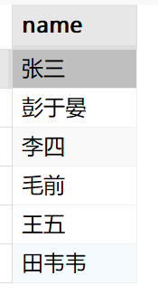
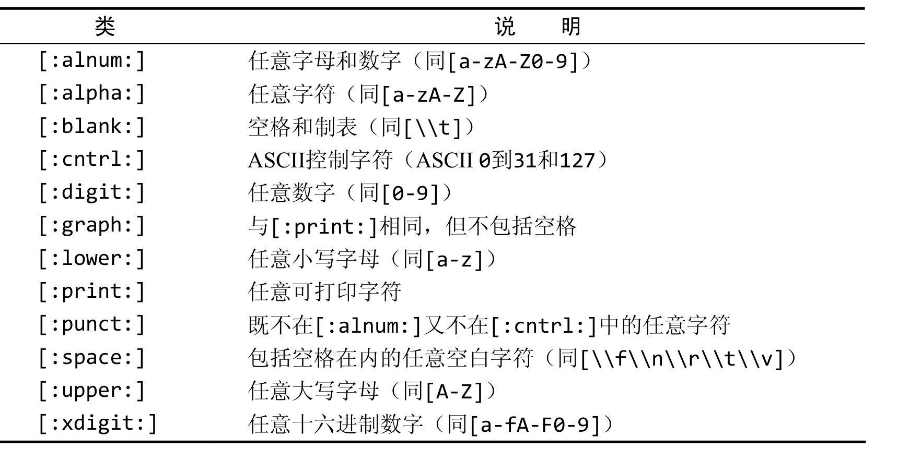

## 2.1 SELECT 语句

​	SELECT查询语句是Mysql最重要的部分，要学会Mysql，必须掌握SELECT查询语句。SELECT属于DQL


#### 2.1.1检索单个列 

​	SELECT可以查询表中某个字段的所有值。格式如下

```sql
SELECT 字段名 from 表名
```

​	例：查询student表中的name字段

```sql
SELECT name from student
```


#### 2.1.2 检索多个列

​	SELECT可以同时查询多个字段的所有值，在SELECT关键字后给出多个列名，列名之间必须以逗号分隔。

```sql
SELECT 字段名1,字段名2,字段名3,.... from 表名
```


#### 2.1.3 检索所有列

​	除了指定所需的列外，SELECT语句还可以检索所有列，在实际列名的位置用*（通配符）号代替，如下所示：

```sql
SELECT * FROM 表名
```


#### 2.1.4 检索不同的行

​	SELECT返回所有匹配的行，但是有时并不需要每个值每次都出现。让每个值只出现一次，也就是检索不同值的列表**。我们使用`DISTINCT`关键字，该关键字指示Mysql只返回不同的值。**

```sql
SELECT DISTINCT 字段名 FROM 表名。
```

​	例，我们查询studetn表中name字段，并且限定只返回不同的值

```sql
SELECT DISTINCT name FROM student
```


#### 2.1.5 限制结果

​	LIMIT子句可以限制返回的行数，也可以指定返回的行数区间。如下

```sql
SELECT 字段 FROM 表名 LIMIT n;
```

​	例，查询student表中name字段，并且限定返回的结果最多5行

```sql
SELECT name FROM student LIMIT 5;
```

​	下面的语句从第5行开始查询，查询后面5行。实际上就是查询第6~10行。

```sql
SELECT name FROM student LIMIT 5,5;
```

​	LIMIT的第一个参数表示从第几行开始查询，第二个参数表示要查询几行。比如，LIMIT 4,3表示从第4行开始，查询后3行。

```
注意：检索出来的第一行为行0而不是行1， 因此 LIMIT 1,1将检索出第二行而不是第1行。
```

​	可以把LIMIT第一个参数看作从0开始，0代表第1行，1代表第 2行。**该查询是包括起始行的**。如LIMIT 0,1 从第一行开始，返回一行。而，LIMTI 1,1 则是从第2行开始，返回一行。


#### 2.1.6 使用完全限定的表名、别名

​	所谓完全限定，就是将从属关系写清楚，那个列名是哪个表下的，这个表是那个数据库下的。如下：

```sql
SELECT 表名.列名 FROM 表名。
```

​	表名也可以是完全限定的

```sql
SELECT 表名.列名 FROM 数据库名.表名。
```

​	例，查询school数据库下的student表的name字段

```sql
SELECT student.name FROM school.student;
```

​	效果与前面的查询是一直的，不过是写清楚了从属关系。


​	我们在查询的时候，可以为所查询的字段名其别名。可以为单个字段其别名，也可以为多个字段起别名

```sql
SELECT 字段名1 as 别名1, 字段名2 as 别名2 FROM 表名 
```

​	例，为name字段起别名“名字”，为age字段起别名“年龄” 

```sql
SELECT name as 名字, age as 年龄 from student;
```


## 2.2 排序检索数据（ORDER BY）

​	在前一节查询的数据，其输出是没有特定的顺序的。其实，检索出的数据并不是以纯粹的随机顺序显示，如果不排序，数据一般以它在底层表中出现的顺序显示。可以是数据最初添加到表中的顺序。

​	**子句（clause）** SQL语句由子句构成，有些子句是必须的，如FROM。有的是可选的，如LIMTI。

​	为了明确地排序用SELECT语句检索出来的数据，可使用ORDER BY子句。ORDER BY 子句取一个或多个列的名字，据此队输出进行排序。

```sql
SELECT 列名 FROM 表名 ORDER BY 列名
```

​	例，查询student表中的name字段，通过name字段进行排序。下面的语句查询的结果通过字母顺序进行排序

```sql
SELECT name FROM student ORDER BY name;
```

​	查询结果：



```sql
扩展：ORDER BY 子句中使用的列是为显示所选择的列。但是，实际上并不一定要这样，用非检索的列排序数据是完全合法的
```


#### 2.2.1 按多个列排序

​	在查询多个列时，只对一个列排序就有点不合理了，所以可以通过多个列进行排序。

​	为了按多个列排序，只要指定列名，列名之间用逗号分开即可。

```sql
SELECT 字段1,字段2,字段3 FROM 表名 ORDER BY 字段1,字段2,字段3
```

​	例

```sql
SELECT name,age,profession FROM student ORDER BY name,age,profession
```

​	排序规则优先通过`name`字段进行排序，如果name字段值全部相同，才会通过`age`进行排序。如果一个字段是字符串形式，则按字母大小排序，如果是数字形式，则按大小进行排序。


#### 2.2.2 指定排序方向

​	数据排序不限于升序排序（从A到Z ）。这是默认的排序顺序，还可以使用ORDER BY以降序（从Z到A）顺序排序，使用DESC关键字。

```sql
SELECT 字段名 FROM 表名 ORDER BY 字段名 DESC。
```

​	查询出来的结果使用降序排序。例，查询student表中的name字段，使用降序排序（从Z到A）

```sql
SELECT name FROM student ORDER BY name DESC;
```

​	与`DESC`相反的关键字是ASC（*ASCENDING*），在升序排序是可以指定它，但实际上，ASC没有多大用处，因为升序是默认的（即不指定DESC，则默认为ASC）；


​	使用`ORDER BY`和`LIMIT`的组合，能找出一个列中最高的或最低的值。下面的语句找出年龄最大的记录

```sql
SELECT * FROM student ORDER BY age DESC LIMIT 1
```

​	因为是降序排序，所以第一条语句必定是最大的一个值，而LIMIT又限定了仅返回一行。


## 2.3 过滤数据

​	过滤数据又叫条件查询，查询符合条件的记录，过滤掉不符合条件的记录。在SELECT语句中，数据根据WHERE子句中指定的添加进行查询。WHERE子句在表名（FROM）子句之后给出。如下所示：

```sql
SELECT * FROM 表名 WHERE 条件
```

​	如，查询表中age字段为20的记录

```sql
SELECT * FROM stduent WHERE age=20;
```

```
提示：在同时使用ORDER BY和WHERE子句时，应该让ORDER BY位于 WHERE之后，否则会产生错误
```

​	

#### 2.3.1 WHERE子句操作符

​	WHERE子句操作符类似与高级语言中的逻辑运算。下表列出了常见的子句操作符

|    操作符     |        说明        |
| :-----------: | :----------------: |
|       =       |        等于        |
|      <>       |       不等于       |
|      !=       |       不等于       |
|       <       |        小于        |
|      <=       |      小于等于      |
|       >       |        大于        |
|      >=       |      大于等于      |
| BETWEEN   AND | 在指定的两个值之间 |


#### 2.3.2 不匹配检查

​	将会输出所有年龄不等于20的记录

```sql
SELECT * FROM student WHERE age!=20;
```


#### 2.3.3 范围检查

​	BETWEEN AND 操作法可以检查在某个范围内的值。

```sql
SELECT 字段名 FROM  表名 WHERE 字段名 BETWEEN 起始值 AND 终止值
```

​	例如，检查表中age为20到50的记录

```sql
SELECT * FROM student WHERE age BETWEEN 20 AND 50
```


#### 2.3.4 空值检查

​	在创建表时，可以指定其中列是否可以不包含值。在一个列不包含值时，称其为包含空值NULL。

​	**NULL** 无值（no value），它与字段包含0、空字符串或仅仅包含空格不同。

​	WHERE IS NULL 子句用来筛选空值的字段。

```sql
SELECT 字段名 FROM 表名 WHERE 字段名 IS NULL;
```

​	


#### 2.3.4 AND 操作符

​	AND操作符限制两边条件同时满足，例如：

```sql
SELECT * FROM student WHERE age>=18 AND age<=30
```

​	这条语句查询年龄在18到30的记录。AND操作符可以用&&替代。


#### 2.3.5 OR操作符

​	OR操作符表示两边条件满足其一即可。例如，

```sql
SELECT * FROM student WHERE age<18 OR age>30
```

​	该语句查询年龄小于18或年龄大于30的记录，`OR`操作符可用`||`代替。


#### 2.3.6 IN操作符

​	IN操作符可以查询指定条件范围，范围中的每个条件都可以进行匹配。例如

```sql
SELECT * FROM student WHERE age IN(22,23,25);
```

​	该语句查询年龄为22,23,25的记录。

​	同样的功能可以使用OR操作符实现，上面的语句等价于：

```sql
SELECT * FROM student WHERE age=22 OR age =23 or age =25
```

​	对于OR操作符，IN操作符的语法更清楚更直观


#### 2.3.7 NOT操作符

​	WHERE子句中的NOT操作符有且只有一个功能，那就是否定它之后所跟的任何条件。例如

```sql
SELECT * FROM student WHERE age NOT IN(22,23,25);
```

​	这条语句查询除了年龄等于23,22,25之外的所有记录。

​	NOT否定是跟在条件之前的。

​	


#### 2.4 使用通配符进行过滤

​	下面将介绍什么是通配符、如何使用通配符以及怎样使用LIKE操作符进行通配搜索。


#### 2.4.1 LIKE 操作符

​	LIKE操作符将对后面的关键字进行模糊匹配。如：	

```sql
SELECT * FROM student where name LIKE '田韦韦';
```

​	这条语句等同于：

```sql	
SELECT * FROM student where name = '田韦韦';
```

​	这种语句只能对name字段为田韦韦的记录进行查询。这样的查询很有限，但可以通过使用通配符进行非常灵活的匹配，下面介绍MySql中的几种通配符。

| 通配符 |           功能           |                实例                 |
| :----: | :----------------------: | :---------------------------------: |
|   %    |    代表0个或多个字符     | ‘ab%’, 可以匹配以ab开头的任意字符串 |
|   __   |       代表1个字符        |   ‘a_b’，a与b之间可有一个任意字符   |
|   []   |   表示在某一范围的字符   |       [0~9]，0 ~ 9 之间的字符       |
|  [^]   | 表示不在某一范围内的字符 |     [^0~9] ,不在0~ 9 之间的字符     |

​	在这几种通配符中，最常用的就是%，它配合LIKE操作符使用，进行模糊匹配。下面举几个例子

```sql
SELECT * FROM class WHERE cname LIKE '%程序';
```

​	这条语句查询课程名字以程序结尾的所有记录。

```sql
SELECT * FROM class WHERE cname LIKE '程序%';
```

​	这条语句查询课程名字以程序开头的所有记录。

```sql
SELECT * FROM class WHERE cname LIKE '%程序%';
```

​	这条语句查询课程名字包含程序的所有记录

​	最后，**LIKE操作符只使用与对字符串进行模糊匹配**。


## 2.4 正则表达式

​	正则表达式可以用来匹配文本的特殊的串。可以从一个文本文件中提取电话号码，还可以在一个文本快中找到所有重复的单词。


#### 2.4.1 基本字符匹配

​	从一个简单的例子开始，下面的语句检索列name包含文本‘韦’的所有行：

```sql
SELECT * FORM student WHERE name REGEXP '韦';
```

​	REGEXP关键字后所跟的东西作为正则表达式处理。

​	在正则表达式中，`.`是一个特殊的字符，它表示匹配任意一个字符。例如

```sql
SELECT prod_name FROM products WHERE prod_name REGEXP '.000';
```

​	这条正则表达式能匹配以任意一个字符开头，后面跟上000的字符，如`1000`，`2000`等。


**提示**：Mysql中的正则表达式匹配不区分大小写。为区分大小写，可使用BINARY关键字。如`WHERE prod_name REGEXP BINARY 'JAtPack .000'`。


#### 2.4.2 进行OR匹配

​	为搜索两个串之一，使用|。如下所示：

```sql
WHERE REGEXP '1000|2000';
```

​	将匹配串为1000或2000的串。

​	使用|从功能上类似于在SELECT语句中使用OR语句，多个OR条件可并入单个正则表达式。


#### 2.4.3 匹配几个字符之一。

​	匹配任何单一字符，可以指定一组用[]括起来的字符。如：

```sql
WHERE REGEXP '[1234]';
```

​	将匹配字符串里包含1、2、3、4之间任意一个字符的字符串，它的意思是匹配1或2或3或4。所以1tong 、2tong 、ton3g这样的字符串都符合。

​	**在集合的开始出放置一个`^`，表示否定集合中的字符**。如`[^123]`匹配至少一个不是1、2、3的字符。


#### 2.4.4 匹配范围

​	集合可用来定义要匹配的一个或多个字符。例如，下面的集合将匹配数字0~9：

```sql
[0123456789]
```

​	**通过使用`-`来定义一个范围**。可以简化为下面的样子：

```sql
[0-9]; 
```

​	也可以匹配任意字母字符

```sql
[a-z];
```

​	举一个例子：

```sql
WHERE 列名 REGEXP '[1-5] Ton'
```

​	[1-5]定义了一个范围，这个表达式的意思是匹配1到5 后面跟上` Ton`


#### 2.4.5 匹配特殊字符

​	正则表达式语言由具体特定含义的特殊字符构成，如`.`、`[]`、`|`和`-`等，还有一些其他字符。但是如果我们需要匹配这些字符，怎么办。如果要找出包含`.`字符的值

```sql
WHERE name REGEXP '\\.'
```

​	为了匹配特殊字符，必须用`\\`为前导。如`\\-`表示查找`-`。`\\.`表示查找`.`;


#### 2.4.6 匹配字符类

​	Mysql有预定义的字符集，称为字符类。如下表。




​	