```sql
MYSQL必知必会第10章 ----第18章内容
```

# 3.1 创建计算字段

​	下面介绍什么是计算字段，如何创建计算字段以及怎么从应用程序中使用别名引用它们


### 3.1.1 计算字段

​	一般来说，储存在数据库中的数据，我们需要对它进行一些计算，来获得我们所需要的值。比如：需要总数、平均数等等。

​	我们可以直接从数据库中检索出转换、计算或格式化过的数据，而不是检索出数据。这就是计算字段发挥作用的所在了。**计算字段并不实际存在于数据库表中，计算字段是在运行时的SELECT语句中创建的**。

​	**字段（field）**基本上与列（column）的意思相同，经常互换使用，一般数据库中称为列，在计算中称为字段。

​	重要的是，只有数据库知道SELECT中哪些列是实际的表列，哪些列是计算字段。从客户机（如应用程序）的角度来看，计算字段的数据是以其他列的数据相同的方式返回的。

​	总之，**计算字段是一种通过在查询结果添加一个计算的字段，将原始数据进行转换或计算，并将结果作为新的字段显示出来的功能。**


### 3.1.2 拼接字段

​	现在有一个`vendors`表包含供应商名和位置信息。假如要生成一个供应商报表，需要在供应商的名字中按照`name(location)`的格式列出供应商的位置。

​	此报表需要单个值，而表中数据存储在两个列`vend_name`和`vend_country`中。我们需要的数据没有明确的存储在数据库表中，下面看怎么编写返回供应商和位置的SELECT语句

​	**拼接（concatenate）将值联结到一起构成单个值**

​	在Mysql的SELECT语句中，可使用`Concat()`函数来拼接两个列。

```sql
SELECT Concat(vend_name,'(', vend_country ,')')
FROM vendors
ORDER BY vend_name;
```

​	**Concat()拼接串，即把多个串连接起来形成一个较长的串,Concat()需要一个或多个指定的串,各个串之间用逗号分隔。**

​	上面的SELECT语句拼接以下四个元素：

- 存储在vend_name列中的名字
- 包含一个左圆括号的串；
- 存储在vend_country列中的国家；
- 包含一个右圆括号的串。

​	有时数据中会包含多余的空格，**Mysql的RTrim()函数可以删除右侧多余的空格**。

```sql
SELECT Concat(RTrim(vend_name), '(', RTrim(vend_country),')')
FROM vendors
ORDER BY vend_name;
```


##### 使用别名

​	SELECT语句拼接字段的工作的很好，但此新计算列的名字却是一个值，是该函数的调用。我们可以给它起一个别名。别名用AS关键字赋予。如下：

```sql
SELECT Concat(vend_name, ' (', vend_country,')') AS 'vend_title'
FROM vendors
ORDER BY vend_name;
```

​	

### 3.1.3 执行算术计算

​	计算字段的另一常见用途是对检索出的数据进行算术计算。例如，`orders`表中包含收到的所有订到。`orderitems`包含每个订单中的各项物品。下面的SQL语句检索订单号20005中的所有物品：

```sql
SELECT prod_id,quantity,item_price
FROM orderitems
WHERE order_num = 20005;
```

​	输出结果：

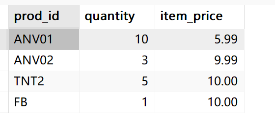

​	Item_price列包含订到中每项物品的单价，下面计算该订单的总价（单价乘以订购数量）：

```sql
SELECT prod_id,
	   quantity,
	   item_price,
	   quantity*item_price AS expanded_price
FROM orderitems
WHERE order_num =20005;
```

​	输出结果：

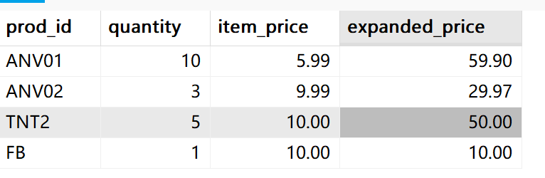


# 3.2 使用数据处理函数

​	SQL支撑利用函数来处理数据，它给数据的转换和处理提供了方便。但相对的，包含函数的SQL的语句可移植性较差，不是每种DBMS的函数功能都支持，有时同名的函数，具体实现差异也很大。

​	所以如果决定使用函数，应该保证做好代码注释，以便以后其他人能够确切地知道所编写SQL代码的含义。在Mysql中使用`--`代表注释，`-- `后面的字符被忽略。如：

```sql
SELECT * FROM student; -- 查询student表的所有数据
```

​	注意，`--`后面要跟空格才生效。

### 3.2.1 使用函数

​	大多数SQL实现支持以下类型的函数。

- 用于处理文本串（如删除或填充值，转换值为大写或小写）的文本函数
- 用于在数值数据上进行算术操作（如返回绝对值，进行代数运算的数值函数）
- 用于处理日期和时间值并从这些值提取特定成分（例如，返回两个日期只差，检查日期有效性等待）的日期和时间函数
- 返回DBMS正在使用的特殊信息（如返回用户登录信息，检查版本细节）的系统函数。


#### 3.2.1 文本处理函数

​	上次我们使用RTrim()函数来去除列值右边的空值，这次我们使用Upper函数。

```sql
SELECT vend_name, UPPER(vend_name) as vend_name_upcase
FROM vendors
ORDER BY vend_name;
```

​	输出：

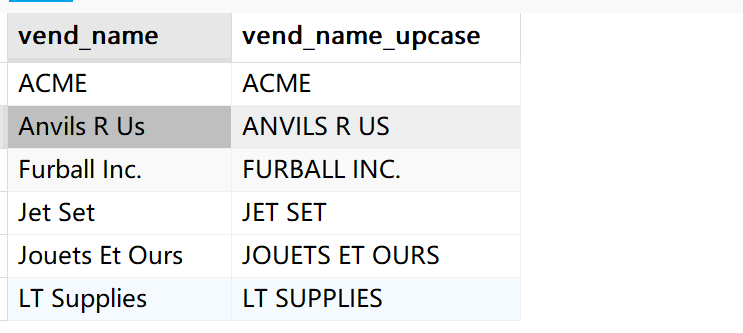

​	Upper()将文本转换为大写，第一列为vendors表中存储的值。第二列vend_name_upcase则是转换后的值。

​	下表列出了某些常用的文本处理函数

|            函数             |                      说明                      |
| :-------------------------: | :--------------------------------------------: |
|        Left(str,len)        |             返回串str左边len个字符             |
|         Length(str)         |                  返回串的长度                  |
|     Locate(substr,str)      | 找出串str的子串substr的第一个位置，未找到返回0 |
|         LTrim(str)          |                去除串左边的空格                |
|       Right(str,len)        |             返回串str右边len个字符             |
|         RTrim(str）         |                去除串右边的空格                |
|          Soundex()          |               返回串的SOUNDEX值                |
| SubString(str,start,length) |               返回指定子串的字符               |
|           Upper()           |                 将串转换为大写                 |

在整个表中，有些函数功能简单，有些函数功能复杂，复杂函数能够处理复杂的情况，下面介绍这些函数的具体使用方法


##### 1. Locate函数

​	Locate函数具有两个参数，原型如下：

```sql
Locate(substr,str);
```

​	该函数从str中查询子串substr，如果查询到了就返回它的位置，如果没有查询到，就返回0。例：

```sql
SELECT vend_name,
			 Concat('ur') as 查找子串,
			 LOCATE('ur',vend_name) as 所在位置,
FROM vendors;
```

​	输出：


​	这里的Concat并没有拼接任何字符，只指定了一个子串字符，这里起输出作用。


##### 2.Soundex()

​	Soundex()函数是一个语音算法，将字符串转换为其发音的代码，主要用于模糊匹配。原型如下：

```sql
Soundex(str);
```

​	返回一个4个字符的代码，格式为：`字母、数字、数字、数字`，第一个字符是原字符串的首字母，后三个字符是基于发音的数字编码，例：

```sql
SELECT vend_name,
	   Soundex(vend_name) as Soundex编码
FROM vendors;
```

​	输出：

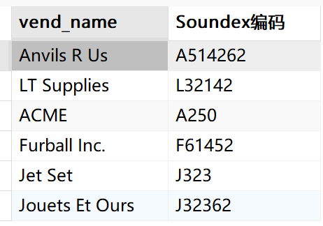


##### 3. SubString()

​	SubString（）函数可以从字符串提取出子字符串，是SQL中最常用的字符串函数之一，**基本语法**：

```sql
SubString(string,start,length);
```

​	从str提取start个到length个的字符。**start代表开始位置（从1开始计数），length表示要提前的字符数（可选，如果省略则提取到字符串围膜）。**

​	例如：

```sql
SubString('HelloWorld',5,2);
```

​	提取出从该字符串的第5个字符开始的两个字符。输出为`oW`

​	或者使用标准SQL语法：

```sql
SubString(string FROM start FOR length)
```

​	功能一样，只不过语法不同，比如下面的语句实现与上面的语句实现输出一样：

```sql
SubString('HelloWorld' FROM 5 FOR 2);
SubSTR('HelloWorld' FROM 5 FOR 2); -- 同义函数
```

​	

​	**从开头提取**

```sql
SELECT SUBSTRING('Database',1,4); -- 返回'Data'
```

​	**使用负数的起始位置（部分数据库支持）**

```sql
-- Mysql,Oracle支持从末尾计数
SELECT SUBSTRING('Hello World',-5);  -- 返回'world'
SELECT SUBSTR('Hello World',-5,3);  -- 返回'Wor'(Oracle)
```


### 3.2.2 日期和时间处理函数

​	日期和时间采用相应的数据类型和特殊的格式存储，以便能快速和有效地排序或过滤。下表列出了某些常用的日期和时间处理函数

|     函数      |              说明              |
| :-----------: | :----------------------------: |
|   AddDate()   |    增加一个日期（天、周等）    |
|   AddTime()   |    增加一个时间（时、分等）    |
|   CurDate()   |          返回当前日期          |
|   CurTime()   |          返回当前时间          |
|    Date()     |     返回日期时间的日期部分     |
|  DateDiff()   |        计算两个日期之差        |
|  Date_Add()   |     高度灵活的日期运算函数     |
| Date_Format() |  返回一个格式化的日期或时间串  |
|      Day      |     返回一个日期的天数部分     |
|  DayOfWeek()  | 对于一个日期，返回对应的星期几 |
|    Hour()     |     返回一个小时的小时部分     |
|  Minute（）   |     返回一个时间的分钟部分     |
|    Month()    |       返回一个日期的月份       |
|     Now()     |       返回当前日期的时间       |
|   Second()    |      返回一个时间的秒部分      |
|    Time()     |     返回一个日期的时间部分     |
|    Year()     |       返回一个日期的年费       |

​	迄今为止，我们都是用比较数字和文本的`WHERE`子句过滤数据，现在我们对日期进行过滤，日期进行过滤需注意一些问题和使用特殊的Mysql函数。

​	**首先是Mysql日期格式。日期格式必须为`yyyy-mm-dd`，2025年10月1日给出为`2025-10-01`。这是首选的日期格式**。

​	基本的日期比较如下：

```sql
SELECT * FROM
orders
WHERE order_date = '2005-09-01-';
```

​	输出：

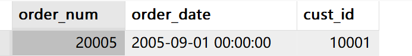

​	但是，order_date使用的数据类型为datatime，这种类型存储日期及时间中。如果order_date的值为`2005-09-01 11:30:05`，则这样的过滤语句将会失败。

​	解决办法是仅对日期进行比较，而不是将整个列值比较。使用Date()函数返回日期时间的日期部分。**`Date(order_data)`仅提取列的日期部分**。对应的SELECT语句为：

```sql
SELECT * FROM
orders
WHERE Date(order_date)= '2005-09-01';
```


​	**还有一种日期比较需要说明，如果你想检索出2005年9月的所有订单**，怎么办？简单的相等测试不行，因为它也要匹配月份中的天数。下面是解决办法之一：

```sql
SELECT * FROM
orders
WHERE Date(order_date) BETWEEN '2005-09-01' AND '2005-09-30';
```

​	输出：

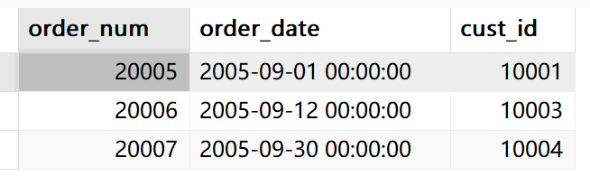

​	**使用BETWEEN操作符用来吧2005-09-01和2005-09-30定义为一个要匹配的日期范围**。

​	还有另外一种办法（一种不需要记住每个月有多少田或不需要操心闰年2月的办法）：

```sql
SELECT * FROM 
orders
WHERE YEAR(ORDER_DATE) =2005 AND MONTH(ORDER_DATE) =9;
```

​	Year()从一个日期中返回年份。Month从日期中返回月份，因此`WHERE YEAR(ORDER_DATE) =2005 AND MONTH(ORDER_DATE) =9;` 将检索出年份为2005同时月份为9月的所有行。

​	


##### 1.AddDate()函数

​	虽然名字叫增加日期函数，但它并不会真的对表	中的数据进行增加操作，它只是在查询是作为计算的函数。下面介绍该函数的用法。标准格式：

```sql
AddDate(date,INTERVAL expr unit)
-- 或者
AddDate(date,days);
```

​	date表示要操作的原始日期，而expr表示要添加的时间间隔数值。unit为时间单位（DAY,MONTH,YEAR等）。实例

```sql
SELECT ADDDATE('2025-09-01',INTERVAL 10 DAY); -- 返回'2025-09-11'
-- 或者
SELECT ADDDATE('2025-09-01',10); -- 同样返回'2025-09-11'
```

​	下面是该函数支持的时间单位，同时还支持减少时间的操作，只需将`expr`设为负数即可

| 单位          | 说明 | 示例                       |
| :------------ | :--- | :------------------------- |
| `MICROSECOND` | 微秒 | `INTERVAL 100 MICROSECOND` |
| `SECOND`      | 秒   | `INTERVAL 30 SECOND`       |
| `MINUTE`      | 分钟 | `INTERVAL 15 MINUTE`       |
| `HOUR`        | 小时 | `INTERVAL 2 HOUR`          |
| `DAY`         | 天   | `INTERVAL 7 DAY`           |
| `WEEK`        | 周   | `INTERVAL 2 WEEK`          |
| `MONTH`       | 月   | `INTERVAL 3 MONTH`         |
| `QUARTER`     | 季度 | `INTERVAL 1 QUARTER`       |
| `YEAR`        | 年   | `INTERVAL 1 YEAR`          |

注意，1秒等于1,000,000微秒，也就是1秒等于100万微秒

​	


##### 2. AddTime()函数

​	该函数针对时间计算的函数。下面是它的基本格式：

```sql
ADDTIME(expr1,expr2)
```

​	`expr1`的类型可以是TIME,DATETIME或TIEMSTAMP，它表示原始时间或日期时间值。而`expr2`只能是TIME字符串，它表示将要添加的时间间隔。**返回类型为与`expr1`相同的类型**。

​	例：

```sql
-- 基础时间加法	
SELECT ADDTIME('08:30:00', '01:45:30');        -- 返回 '10:15:30'
-- 微秒精度计算
SELECT ADDTIME('10:00:00.500000', '00:00:00.600000'); -- '10:00:01.100000'
```

​	TIME的格式为：`HH:MM:SS.ssss`，TIME的精确度可以精确到微秒级。


### 3.2.3 数值处理函数

​	数值处理函数进处理数值数据。这些函数一般主要用于代数、三角或几何运算，因此没有串或日期-时间处理函数使用那么频繁。

​	最具有讽刺意味的是，**在主要DBMS的函数中，数值函数是最一致最统一的函数**。下表	

|  函数  |        说明        |
| :----: | :----------------: |
| Abs()  | 返回一个数的绝对值 |
| Cos()  | 返回一个角度的余弦 |
| Exp()  | 返回一个数的指数值 |
| Mod()  |  返回除操作的余数  |
|  Pi()  |     返回圆周率     |
| Rand() |   返回一个随机数   |
| Sin()  | 返回一个角度的正弦 |
| Sqrt() | 返回一个数的平方根 |
| Tan()  | 返回一个角度的正切 |


# 3.3 汇总数据

​	我们检查需要汇总数据而不把他们实际检索出来，Mysql为此提供了转换的函数。这种类型的检索例子有以下几种。

- 确定表中的行数（或者满足某个条件或包含某个值的行数）
- 获得表中行组的和
- 找出表列的最大值、最小值和平均值

​	为了方便这种类型的检索，Mysql给出列5个聚集函数。

​	**聚集函数（aggregate function）运行在行组上，计算和返回单个值的函数**

|  函数   |       说明       |
| :-----: | :--------------: |
| AVG（） | 返回某列的平均值 |
| COUNT() |  返回某列的行数  |
|  MAX()  | 返回某列的最大值 |
| MIN（） | 返回某列的最小值 |
| SUM（） |  返回某列值之和  |

​	

### 3.3.1 AVG()函数

​	AVG()通过对表中行数计数并计算特定列值之和，求得该列的平均值。	

​	下面的例子使用AVG()返回products表中的所有产品的平均价格：

```sql
SELECT AVG(prod_price) as avg_price
FROM products;
```

​	输出：


​	还可以确定特定列或行的平均值。下面的离职返回特定供应商所提供产品的平均价格：

```sql
SELECT AVG(prod_price) as avg_price
FROM products;
WHERE vend_id =1003
```

​	AVG会忽略值为NULL的行


### 3.3.2 COUNT()函数

​	COUNT()函数进行计数，可利用COUNT()确定表中行的数目或符合特定条件的数目

​	COUNT()函数有两种使用方式。

- **使用`COUNT(*)`对表中行的数目进行计数，不管表列中包含的是空值（NULL）还是非空值***。
- **使用COUNT(列名)对特定列中具有值的行进行计数，忽略NULL值**。

​	下面的例子返回customers表中的客户的总数：

```sql
SELECT COUNT(*) AS num_cust FROM customers;
```

​	下面的例子只对具有电子邮件地址的客户计数：

```sql
SELECT COUNT(cust_email) AS num_cust FROM customers;
```


### 3.3.3 MAX()函数

​	MAX()返回指定列中的最大值。MAX()要求指定列名。如下所示：

```sql
SELECT MAX(prod_price) as max_price
FROM products;
```

​	这里，MAX()返回`products`表中最贵的物品的价格。

​	虽然MAX()一般用来找出最大的数值或日期值。但Mysql允许将它用来返回任意列中的最大值，包括返回文本列的最大值。MIN()同理


### 3.3.4 MIN()函数

​	MIN()返回指定列中的最小值，同样要求指定列名。如下所示：

```sql
SELECT MIN(prod_price) as max_price
FROM products;
```

​	其中MIN()返回`products`表中最便宜物品的价格。


### 3.3.5 SUM()函数

​	SUM()用来返回指定列值的和（）.如：

```sql
SELECT SUM(quantity) as items_orderd
FROM orderitems
WHERE order_num=20005;
```

​	返回订单号为20005的购买物品总和。


### 3.3.6 聚集不同值

​	在Mysql5.0.3中，添加了`DISTINCT`关键字。

​	以上5个聚集函数都可以使用：

- 对所有行执行计算，指定ALL参数或不给参数（ALL是默认行为）
- 只包含不同的值，指定DISTINCT参数

​	下面的例子使用AVG()函数返回特定供应商提供的产品的平均价格。它与上面的SELECT语句相同，但使用了DISTINCT参数，因此平均值只考虑各个不同的价格

```sql
SELECT AVG(DISTINCT prod_price ) AS avg_price
FROM products
WHERE vend_id = 1003;
```

​	在使用了`DISTINCT`关键字后，平均价格提高了，因为有多个物品具有相同的较低价格。排除他们提升了价格。


### 3.3.7 组合聚合函数

​	**SELECT语句可根据需要包含多个聚合函数**。请看下面的例子：

```sql
SELECT COUNT(*) AS num_items,
			 MIN(prod_price) AS price_min,
			 MAX(prod_price) AS price_MAX,
			 AVG(prod_price) AS price_avg
 FROM products;

```

​	输出：

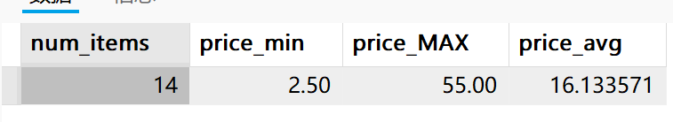


# 3.4 分组数据

​	本节将介绍如何分组数据，以便能汇总表内容的子集。涉及两个新SELECT语句的子句，分别是 GROUP BY子句和HAVING子句


### 3.4.1 数据分组

​	SQL聚集函数可以用来汇总数据，这使我们能够对行进行计数，计算和平均数、获得最大值最小值而不用检索所有数据。

​	看下面的例子，返回供应商1003提供的产品数目：

```sql
SELECT COUNT(*) AS num_prods
FROM products
WHERE vend_id=1003;
```

​	输出：

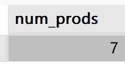

​	但如果要返回每个供应商提供的产品数目怎么办？或者返回提供10个以上产品的供应商怎么办。

​	此时，就可以用分组实现。**分组允许把数据分为多个逻辑组，以便对每个组进行聚集计算**。


### 3.4.2 创建分组

​	分组是在SELECT语句的`GROUP BY`子句中建立的，例：

```sql
SELECT vend_id,COUNT(*) AS num_prods
FROM products
GROUP BY vend_id;
```

​	输出：

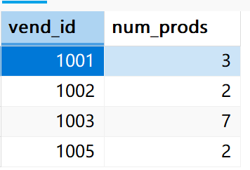

​	分组会将相同的值分到一组，在对这一组进行查询或应用聚合函数。比如说这个例子，通过`vend_id`列对表进行分组。根据不同的值，它分成了4组。再对这4组进行，`SELECT vend_id COUNT(*) as num_prods`操作。从而有了上面的返回结果。

​	为了更具体的理解`GROUP BY`字句，重复一遍，GROUP BY 将相同的值分到同一组，再对每一组进行查询或应用聚集函数。我把该表的数据拿过来：

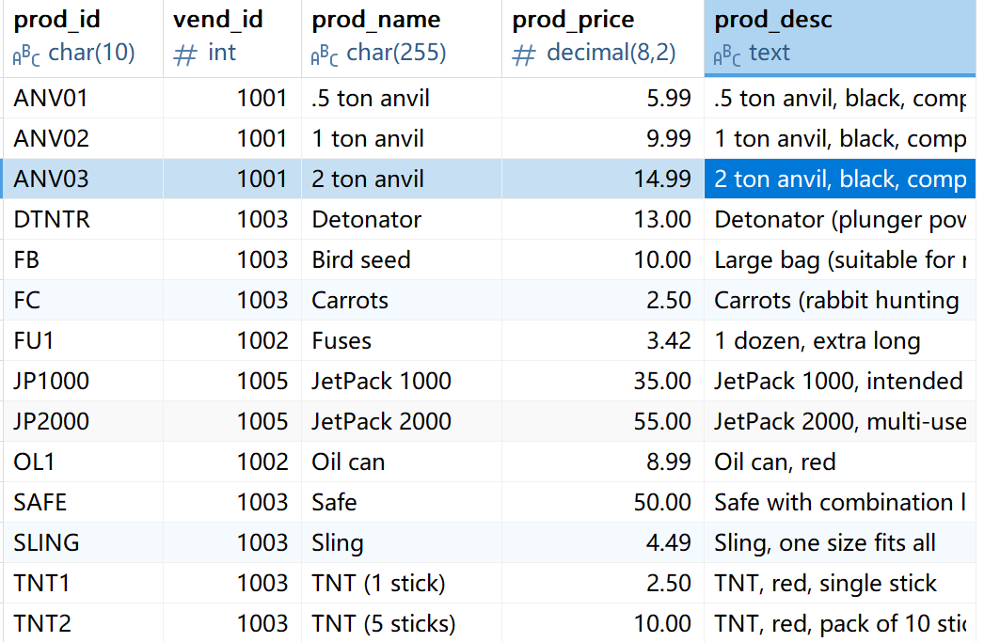

​	假如根据`vend_id`分组，那么将会分成四组记录。为了更直观的看出分组，我用了4条查询语句查询不同的id记录:

```sql
SELECT * FROM products WHERE vend_id = 1001; -- 分组1
SELECT * FROM products WHERE vend_id = 1002; -- 分组2
SELECT * FROM products WHERE vend_id = 1003; -- 分组3
SELECT * FROM products WHERE vend_id = 1005; -- 分组4
```

​	分组1：


​	分组2：

​	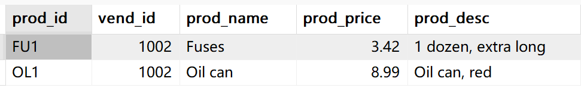

​	分组3：

​	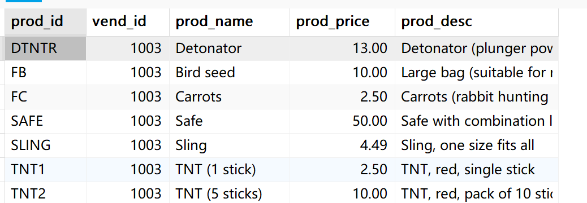

​	分组4：

​	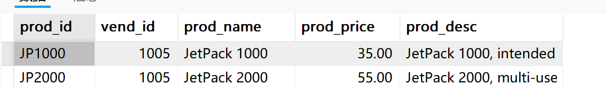

​	`GROUP BY vend_id`做的就是这样的工作，再对每个分组查询`vend_id`和应用聚合函数`count(*) as num_prods`，所以一个简单的分组就完成了多条语句的工作。

​	了解完`GROUP BY`具体是怎么工作后，需要知道一些重要的规定。

- GROUP BY 子句可以包含任意数目的列。这使得能对分组进行嵌套，为数据分组提供更细致的控制。
- 如果在`GROUP BY`子句中嵌套了分组，数据将在最后规定的分组上进行汇总。
- `GROPU BY `子句中列出的每个列都必须是检索列或有效的表达式。如果在SELECT中使用表达式，则必须在GROUP BY子句中指定相同的表达式。不能使用别名
- 除了聚集计算语句外，SELECT中的每个列都必须在GROUP BY子句中给出。
- 如果分组列中具有NULL值，则NULL将作为一个分组返回。如果列中有多行NULL值，它们将分为一组
- `GROUP BY `子句必须出现在WHERE子句之后，`ORDER BY 子句之前`。


​	**使用`WITH ROLLUP`关键字，可以得到每个分组汇总之后的值**，如下所示：

```sql
SELECT vend_id,COUNT(*) AS num_prods
FROM products
GROUP BY vend_id WITH ROLLUP;
```

​	输出：

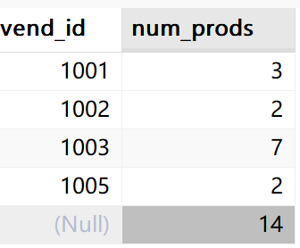


### 3.4.3 过滤分组

​	Mysql允许过滤分组，例如，列出至少有两个订单的所有顾客，为了得出这种数据，必须基于完整的分组而不是个别的行进行过滤。在这里，**我们不能使用WHERE完成，因为WHERE过滤指定的是行而不是分组，WHERE没有分组的概念**。

​	**MySql使用HAVING子句对分组进行过滤**，HAVING非常类似于WHERE。不过WHERE是过滤行，而HAVING过滤分组。例：

```sql
SELECT cust_id,Count(*) as orders
FROM orders
GROUP BY cust_id
HAVING COUNT(*)>=2;
```

​	输出：

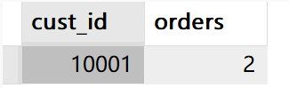

​	这条语句通过`cust_id`字段对表进行分组，然后过滤掉`COUNT(*)>=2`的记录，查询`cust_id`和聚集函数。


### 3.4.4 分组和排序

​	为说明GROUP BY 和ORDER BY的使用方法。看下面的例子

```sql
-- 查询订单号以及对应的总价
SELECT order_num, sum(quantity * item_price) as ordertotal
FROM orderitems
GROUP BY order_num -- 通过order_nunm(订单号)分组
HAVING sum(quantity * item_price)>=50 -- 过滤掉总价少于50的记录
```

​	输出：


​	可以看到，价格是无序的，这时候可以使用`order by`进行排序：

```sql
-- 查询订单号以及对应的总价
SELECT order_num, sum(quantity * item_price) as ordertotal
FROM orderitems
GROUP BY order_num -- 通过order_nunm(订单号)分组
HAVING sum(quantity * item_price)>=50 -- 过滤掉总价少于50的记录
ORDER BY sum(quantity * item_price) -- 通过价格排序
```

​	输出：


​	`order by`默认为升序排序。


### 3.4.5 SELECT 子句排序

​	下表是在SELECT中使用时必须遵循的次序，列出了迄今为止学过的所有子句。优先级从上到下，从高到低。

|   子句   |        描述        |      是否必须使用      |
| :------: | :----------------: | :--------------------: |
|  SELECT  | 要返回的列或表达式 |           是           |
|   FROM   | 要从中检索数据的表 | 仅在从表选择数据时使用 |
|  WHERE   |      行级过滤      |           否           |
| GROUP BY |      分组说明      | 仅在按组计算聚集时使用 |
|  HAVING  |      组级过滤      |           否           |
| ORDER BY |    输出排序顺序    |           否           |
|  LIMIT   |    要检索的行数    |           否           |


# 3.5 使用子查询

​	

### 3.5.1 子查询

​	MySQL4.1引入了子查询。**SELECT是SQL的查询，迄今为止我们所有的SELECT语句都是简单查询，即从单个数据库表中检索数据的单条语句。**

​	**子查询（subquery)，即嵌套在其他查询中的查询**。


### 3.5.2 利用子查询进行过滤

​	我们使用的数据库表示都是**关系表**。

​	订单存储在两个表中，对于订单号、客户id、订单日期的每个订单。order表存储一行。各个订单的物品存储在相关的orderitems表中。orders不存储客户的选项。它只存储客户的ID。实际上，客户信息存储在customers表中。

​	现在，**假如要列出订购物品TNT2的所有客户**，应该怎样检索。下面给出步骤

1. 检索具有物品TNT2的所有订单编号。
2. 检索具有前一步骤列出的订单编号的客户ID
3. 检索前一步返回的所有客户ID的客户信息。

​	上诉的每个步骤都可以单独作为一个查询来执行。可以把一条SELECT语句返回的结果用于另一条SELECT语句的WHERE子句。

​	第一条SELECT语句，对于`prod_id`为`TNT2`的所有订单物品，检索其`order_num`列：

```sql
SELECT oRder_num  -- 检索订单编号
FROM orderitems
WHERE prod_id = 'TNT2';
```

​	输出：

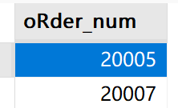

​	下一步，查询订单号为20005和20007的客户ID。**可以利用IN子句**，编写下面的SELECT语句：

```sql
SELECT cust_id -- 检索客户ID
FROM orders
WHERE order_num IN(20005,20007)
```

​	输出：

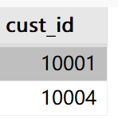

​	现在把第一个查询变为子查询组合两个查询：

```sql
SELECT cust_id -- 检索客户ID
FROM orders
WHERE order_num IN(
			SELECT oRder_num  -- 检索订单编号
			FROM orderitems
			WHERE prod_id = 'TNT2'
);
```

​	输出：


​	**子查询总是从内向外处理**，在处理上面的SELECT时，Mysql实际执行了两个操作。首先，它执行下面的查询：

```sql
SELECT oRder_num  -- 检索订单编号
FROM orderitems
WHERE prod_id = 'TNT2';
```

​	此查询返回两个订单号：20005和2007，然后两个值以IN操作符要求的逗号隔的格式传递给外部查询的WHERE子句。外部查询变为：

```sql
SELECT cust_id -- 检索客户ID
FROM orders
WHERE order_num IN(20005,20007)
```

​	可以看到，输出是正确的并且与前面硬编码WHERE子句所返回的值相同，现在就有了订购商品TNT2的所有顾客ID，下一步就是检索与这些ID关联的顾客信息。用于检索两个列的SQL语句如下：

```sql
SELECT cust_name cust_contact 
FROM customers
WHERE cust_id IN(10001,10004);
```

​	可以把这个WHERE子句转换为另一个子查询：

```sql
SELECT cust_name,cust_contact
FROM customers
WHERE cust_id IN(
		SELECT cust_id
		FROM orders
		WHERE order_num IN(
			SELECT order_num
			FROM orderitems
			WHERE prod_id='TNT2'
			)
		);
```

​	输出：

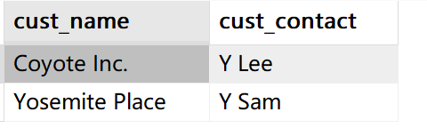

​	**为了执行上诉SELECT语句，MYSQL实际上必须执行3条SELECT语句**。最里面的子查询返回订单列表，此列表用于其外面的子查询WHERE子句。外面的子查询返回客户ID列表，此客户ID列表用最外层的WHERE子句。最外层查询返回所需的数据。

​	在WHERE子句中使用子查询能够编写出功能很强并且灵活的SQL语句。对于能嵌套的子查询的数据没有限制，不过在实际使用时由于性能的限制，不能嵌套太多的子查询。

​		

​	对于子查询返回的多个结果，一般使用`IN`去使用，在使用`IN`关键字时，不需要在字段后面写等于号。但Mysql还有一个功能一样的关键字，`ANY`它的使用要使用等于号。例：

```sql
SELECT cust_id -- 检索客户ID
FROM orders
WHERE order_num =ANY(20005,20007);
```


​	

### 3.5.3 作为计算字段使用子查询

​	使用子查询的另一方法是创建计算字段。假设需要显示customer表中的每个客户的订单总数。订单与相应的客户ID存储在orders表中。

​	为了执行这个操作，遵循以下步骤。

1.  从customer表中检索客户列表
2. 对于检索到的每一位顾客，统计order表中关联的订单数量。

下面的代码用于统计顾客10001所下的订单数量

```sql
SELECT count(*) as order
FROM orders
where cust_id=10001;
```

要为每位客户执行COUNT(*)计算，可以把`COUNT(*)`作为子查询：

```sql
SELECT cust_name,
	   cust_state,
	   (SELECT COUNT(*)
	   FROM orders
	   WHERE orders.cust_id = customers.cust_id) AS orders
FROM customers
ORDER BY cust_name;
```

​	输出：

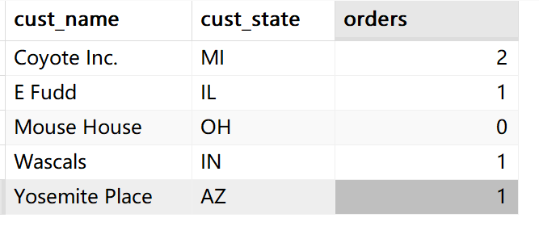

​	子查询部分：

```sql
 	   (SELECT COUNT(*)
	   FROM orders
	   WHERE orders.cust_id = customers.cust_id) AS orders
```

​	它将整个查询语句作为一个计算字段，然后起别名`orders`。

​	这条SELECT语句对`customer`表中的每个客户返回3列:`cust_name`、`cust_state和orders`。`orders`是一个计算字段，它是由圆括号内的子查询建立的，


### 3.5.4 相关子查询

​	在之前我们使用的子查询，都是可以单独执行的查询语句，将结果传递给外部查询，不依赖外部查询。这叫普通子查询。它首先执行**子查询，然后把子查询的结果作为父查询（或外部查询）条件的值。普通子查询只执行一次，**

​	而在有些查询任务中，**子查询的查询条件需要引用父查询表中的属性值。这类查询成为相关子查询**。相关子查询的执行顺序是：

1. 首先，选取父查询表中的一行记录，子查询利用次行中相关的属性值在子查询中进行查询。
2. 然后，父查询根据子查询返回的结果判断父查询表中此行是否满足查询条件。满足则放入结果集中。
3. 重复执行这一过程，直到处理完父查询表中的每一行数据

​	可以看出，相关子查询的执行次数是由父查询表的行数决定的。

例：查询选修了课程号为c1的学号和姓名，**我们首先使用普通子查询实现该功能**。

```sql
-- 使用普通子查询，查询选修了课程号为c1的学号和姓名
SELECT sno,sn FROM 
s
WHERE sno IN(
		SELECT sno
		from sc
		WHERE cno = 'c1');
```

​	首先，学号和姓名等一系列信息存储在s表中，而sc表存储着学生们修了哪些课程的信息，用学生号和课程号一一对应代表学生号为n的学生选修了课程号为c1的课程。我们在子查询中查询选修了cno为c1的学生号，明显课程不可能只有一名学生，而是多名，所以子查询返回的是一个集合，我们使用in关键字来表示外部条件的筛选

​	而父查询，则是查询s表的学生号和学生姓名，条件则是学生号符合子查询返回集合之一即可。


​	现在，我们再使用相关子查询实现。

```sql
SELECT sno,sn
FROM s
WHERE 'c1' IN (SELECT cno
				FROM sc
				WHERE sno = s.sno);
```

​	我们来看执行顺序，首先选取父查询表中的一行记录。在根据这行记录的数据在子查询中进行查询。这里子查询查询的是sc表中的课程号cno，条件则是sc表中的sno要与s表中的sno相同。所以子查询会返回一个学生选修的几门cno课程号集合。将结果传递给父查询，而父查询的条件则会筛选出该名学生中选修课程号为c1的记录。

​	然后这只是查询了一行记录，父查询表中还有n行记录，父查询表有多少行，子查询就要返回多少次结果。


​	下面的例子查询没有选修课程为c1的学号和姓名。使用NOT IN关键字实现

```sql
SELECT sno,sn
FROM s
WHERE sno NOT IN (
		SELECT sno
		from sc
		WHERE cno = 'c1');
```

​	同样也可以使用相关子查询实现，不过课程号的条件跑到了父查询里

```sql
SELECT sno,sn
FROM s
WHERE 'c1' NOT IN(
	SELECT cno
	FROM sc
	WHERE sno=sc.sno);
```


####  1 EXISTS

​	EXISTS表示存在的量次，带EXISTS的子查询不返回任何实际数据，它只得到逻辑真和假。

​	**当子查询的结果为非空时，它表示真，否则返回假。**NOT EXISTS于此相反。所以，它可以进行相关子查询。

```sql
-- 同样是查询选修号为c1的学号和姓名，但使用EXISTS
SELECT sno,sn
FROM s
WHERE EXISTS (
	SELECT *
	FROM sc
	WHERE sno=s.sno AND cno ='c1');
```

​	由于EXISTS只关心子查询里有没有值，而并不关心值是多少，所以我们可以使用通配符*查询。里面子查询的条件表示着`父查询表中的学号等于子查询表中的学号且课程号为c1的记录`。

​	可以看到这个条件很像内连接的条件，实际上，这个需求也可以使用内连接实现：

```sql
SELECT S.sno,S.sn
FROM s as S,sc
WHERE S.sno = sc.sno AND sc.cno='c1';
```


# 3.6 连接表

​		SQL最强大的功能之一就是能在数据检索查询的执行中连接（join）表。连接是利用SQL的SELECT能执行的最重要的操作。


### 3.6.1 关系表

​	现在有两个表，一个表存储产品信息，另一个表存储供应商信息，我们都知道，产品是由供应商生成的，所以使用这样的结构：

​	vendors表包含所有供应商的信息，每个供应商占一行，**每个供应商具有唯一的标识，此标识称为主键（primary key)。可以是供应商ID或任何其他唯一值**。

​	而products表只存储产品信息，它除了存储供应商ID（vendors表的主键）外存储其他供应商信息products存储结构由供应商id+产品信息构成。vendros表的主键又叫做products的外键。它将vendors表与products表关联，利用供应商ID能从vendors表中找出相应供应商的详细信息。

​	外键：**外键为某个表中的一列，它包含另一个表的主键值，定义了两个表之间的关系。**

​	这样做的好处是：

- 供应商信息不重复，从而不浪费时间和空间；
- 如果供应商信息变动，可以只更新vendors表中的单个记录，相关表中的数据不用改动
- 由于数据无重复，显然数据是一致的，这使得处理数据更简答 。


### 3.6.2 为什么要使用连接

​	分解数据为多个表能更有效地存储，更方便的处理，但这些好处是有代价的。

​	如果数据存储在多个表中，怎样用单条SELECT语句检索出数据？

​	答案是使用连接。简单地说，连接是一种机制，用来在一条SELECT语句中关联表，因此称之为连接。使用这种特殊的语法，可以连接多个表返回一组输出。

​	重要的是，要理解连接不是物理实体，它在实际的数据库表中不存在，仅存在于当前的查询中


### 3.6.3  创建连接

​	连接的创建非常简单。看下面的例子

```sql
SELECT vendors.vend_id, vend_name,prod_name,prod_price
FROM vendors,products
WHERE vendors.vend_id = products.vend_id
ORDER BY vend_name,prod_name
```

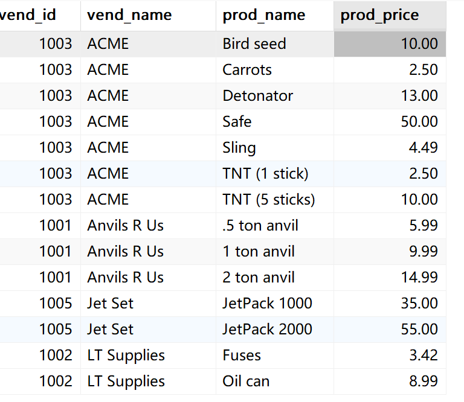

​	通过主外键，查询了两张表的数据。


##### 1. WHERE子句的重要性

​	在数据库表定义中不存在能支持MYSQL对标进行连接的东西。你必须自己做这件事。**在连接两个表时。实际上做的是将第一个表中的每一行于第二个表中的每一行配对。WHERE子句作为过滤条件。它只包含那些匹配给定条件的行，一般匹配的条件是判断表1中的主键等于表2中的外键**。

​	**没有WHERE子句，第一个表中的每个行动将与第二个表中的每个行配对，而不管它们逻辑上是否可以匹配在一起**。

​	**笛卡尔积：由于没有连接条件的表关系返回的结果为笛卡尔积。检索的行数的数目是第一个表的行乘以第二个表中的行数**

​	请看下面的语句和输出：

```sql
SELECT vendors.vend_id, vend_name,prod_name,prod_price
FROM vendors,products
ORDER BY vend_name,prod_name
```

​	输出：


​	表1中有6条记录，表2中有14，14*6=84

​	应该保证所有连接表都有WHERE子句，否则将返回比想要的数据多得多的数据。


### 3.6.4 内连接

​	目前为止所用的连接称为等值连接（Equijoin）——基于两个表之间的相等性测试的连接，**这种连接也被称为内连接**。它还有一种完全不同的语法，但功能是相同的：

​	**两个表根据连接条件进行匹配，然后返回所有匹配的行**。

```sql
SELECT vend_name,prod_name,prod_price
FROM vendors INNER JOIN products
ON vendors.vend_id = producst.vend_id
```

​	它完全等价于：

```sql
SELECT vendors.vend_id, vend_name,prod_name,prod_price
FROM vendors,products
WHERE vendors.vend_id = products.vend_id
ORDER BY vend_name,prod_name
```

​	两表的连接以`INNER JOIN`指定，条件则用特定的`ON`子句代替。而内连接的输出结果可以看作取两个表的交集。

​	 


### 3.6.7 连接多个表

​	SQL对一条SELECT语句中可以连接的表数目没有限制。创建连接的规则也基本相同，首先列出所有表，然后定义表之间的关系。

```sql
SELECT prod_name,vend_name, prod_price,quantity
FROM orderitems,products,vendors
WHERE products.vend_id = vendors.vend_id
	AND orderitems.prod_id = products.prod_id
	AND order_num=20005;
```

​	输出：

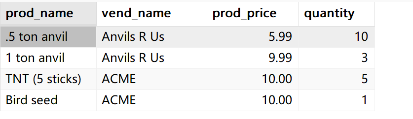

​	现在可以回顾第3.5节的例子了。其SELECT返回订购产品TNT2的客户列表，用内连接查询实现为下：

```sql
SELECT customers.cust_id as 客户ID,customers.cust_name as 客户名,customers.cust_country as 国家
FROM customers,orderitems,orders
WHERE orderitems.prod_id='TNT2' AND orderitems.order_num= orders.order_num
	AND orders.cust_id = customers.cust_id;
```

​	输出：


​	


# 3.7 创建高级连接

​	本章将讲解另外一些连接类型（包括它们的含义和使用方法），介绍如何对被连接的表使用表别名和聚合函数


### 3.7.1 使用表别名

​	别名除了用于列名和计算字段外，SQL还允许给表名起别名。请看下面的SELECT语句：

```sql
	SELECT cust_name,cust_contact
	FROM customers AS c, orders AS o, orderitems as oi
	WHERE c.cust_id = o.cust_id
		AND oi.order_num = o.order_num
		AND prod_id = 'TNT2';
```

​	FROM中的三个表都有别名，表别名不返回到客户机


### 3.7.2 使用不同类型的连接

​	到目前为止，只是使用了内连接（等值连接）的简答连接。SQL还有3种其他的连接，分别是：**自连接、自然连接和外部连接**。


##### 1. 自连接

​	**使用表别名的主要原因之一是能在单条SELECT语句中不止一次引用相同的表**。下面举一个例子

​	假如你发现某物品（起ID为DTNTR）存在问题，因此想想知道生产该物品的供应商生产的其他物品是否也存在问题。**此查询要求先找到生产ID为DTNTR的物品的供应商，然后找出这个供应商的其他物品**。

```sql
	SELECT  prod_id AS 生产ID,prod_name 产品名称
	FROM products
	WHERE vend_id in ( 
			SELECT vend_id
			FROM products
			WHERE prod_id = 'DTNTR');
```

​	输出：

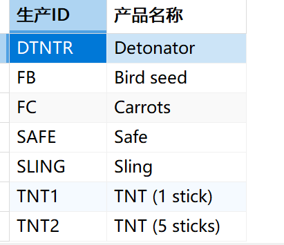

​	**这是一种解决方案，使用了子查询**。内层SELECT语句执行一个简单的检索，检索生产ID为`DTNTR`的`vend_id`列，将`vend_id`作为集合返回给外层WHERE做条件。外层通过内层返回的`vend_id`序列去检索`prod_id,prod_name`列。这样就达到列检索该生产商制作的所有商品。

​	现在使用连接的相同查询。将以两种连接格式展示代码：

```sql
	SELECT p1.prod_id as 生产ID, p1.prod_name 产品名称
	FROM products AS p1,products AS p2
		WHERE p1.vend_id = p2.vend_id
			AND p2.prod_id = 'DTNTR';
```

```sql
SELECT p1.prod_id as 生产ID, p1.prod_name 产品名称
	FROM products AS p1
	INNER JOIN products AS p2
	ON p1.vend_id = p2.vend_id
	WHERE p2.prod_id = 'DTNTR';
```

输出：

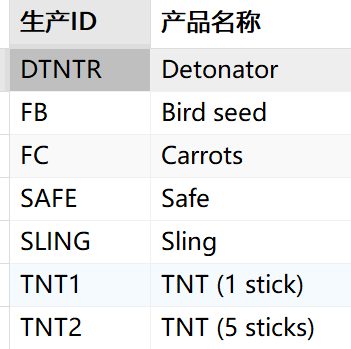

​	此查询需要的两个表实际上是相同的表，因此`products`表在FROM子句中出现了两次，这是完全合法的，但对`products`的引用具有二义性

​	为解决此问题，使用了表别名，将表别名作用于列名，如使用`p1`前缀明确地给出所需列的全面。

​	此查询的逻辑是这样的，**因为连接了相同的表，所以叫自连接，在逻辑上创建了两个表副本**。先在`p2`中找到生产ID为`DTNTR`的所有记录。在对这个记录筛选`vend_id`。由此可以筛选出生产了`DTNTR`的生产商的所有产品。

​	这里为什么刚开始的条件用ON，后面用WHERE，一般我们推荐：连接条件用ON，表示表之间的关系条件。后面WHERE用于业务逻辑过滤条件。这里的筛选生产ID为 `DTNTR`就可以认为是业务逻辑。前面的ON则是连接条件


##### 2. 外连接

​	在内连接查询中，不满足连接条件的记录不能作为查询结果输出。而在**外部连接中，参与连接的表有主从之分，以主表的每行数据去匹配从表的数据列，符合连接条件的数据将直接返回结果集中；对那些不符合条件的列，将被填上NULL值后在返回到结果集中**。

​	外连接分为左外连接和右外连接两种

- 主表在左边，则称为左外部连接
- 主表在右边，则称为又外部连接

​	外连接可以完成下面的几种任务

- 统计每份顾客下了多少份订单，包括还没有下订单的顾客。
- 列出所有产品的订购数量，包括没有被任何人订购的产品
- 在将还没有下订单的顾客考虑在内，计算平均的销售规模

​	

​	下面给出一个简单的内连接，它检索所有客户及其订单：

```sql
-- 可以看成检索下了订单的所有客户id以及订单id
SELECT customers.cust_id,orders.order_num
FROM customers INNER JOIN orders
	ON customers.cust_id = orders.cust_id;
```

​	外部连接语法类似，为了检索所有客户，包括那些没有订单的客户

```sql
-- 检索所有客户，包括那些没有订单的客户
SELECT customers.cust_id,orders.order_num
FROM customers LEFT OUTER JOIN orders
	ON customers.cust_id = orders.cust_id;
```


​	可以看出客户1有两个订单，客户2没有订单，客户3,4,5各有一个订单。

​	与内部连接关联两个表中的行不同的是，**外部连接还包括没有关联行的行。在使用`OUTER JOIN `语法时，必须使用`RIGHT`或`LEFT`关键字指定包括所有的行**。

​	上面的例子是**使用`LEFT OUTER JOIN`从FROM子句的左边表（选择所有行）**。要选择右边表的所有行。应该使用`RIGHT OUTER JOIN`:

```sql
SELECT customers.cust_id,orders.order_num
FROM customers RIGHT OUTER JOIN orders
	ON customers.cust_id = orders.cust_id;
```

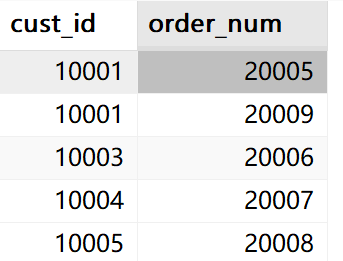

​	


### 3.7.3 使用带聚集函数的连接

​	聚集函数用来汇总数据。这些函数也可以和连接一起使用

​	如果要检索所有客户及每个客户下的订单数。下面使用count()函数完成此工作

```sql
SELECT
customers.cust_name, 
customers.cust_id, 	 
COUNT(orders.order_num) as 订单数
FROM customers INNER JOIN orders
ON  customers.cust_id  = orders.cust_id
GROUP BY customers.cust_id;
```

​	输出：

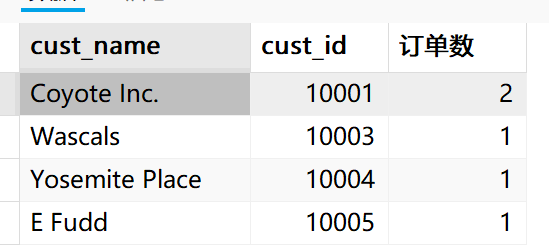

​	此SELECT语句使用内连接将两表相互关联。`GROUP BY`按客户分组，因此函数调用`COUNT(order.order_num)`对每个客户的订单计数。

​	聚集函数对其他连接也是如此，如左连接：

```sql
SELECT
customers.cust_name, 
customers.cust_id, 	 
COUNT(orders.order_num) as 订单数
FROM customers LEFT OUTER JOIN orders
ON  customers.cust_id  = orders.cust_id
GROUP BY customers.cust_id;

```

​	输出：

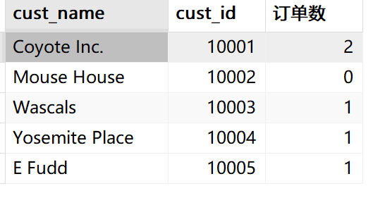

左连接，左边的表作为主表，主表的所有行都要检索，所有即使`cust_id`为10002的记录在`order`表中不满足条件也做输出。


### 3.7.4 并列查询

​	在MySQL中，有多种方法可以实现并列查询（查找具有相同值的记录）。关键字`WITH TIES	`只有在Mysql8.0+以上的版本可以使用。

​	比如说，查找具有相同成绩的学生。虽然这种查询使用WHERE限定条件也可以查询出来，但需要事先知道成绩的值。并列查询不需要提前知道要查询的值。并列查询可以在黑盒条件下去查询，如查询前三名成绩的学生信息。

​	使用MySql子查询的实现方式如下

```sql
SELECT * FROM student 
WHERE score<=(SELECT score 
     FROM student
     ORDER BY DESC LIMIT 2,1)
ORDER BY score desc;
```

​	子查询查询第三行的成绩，外部通过WHERE限制成绩必须大于等于第三行的成绩。然后输出符合条件的记录。

​	但是通常，学生的成绩第三行不会代表第3名。会出现这样的情况

第一行：90；

第二行：90；

第三行：80；

第四行：80；

第五行：70：

第六行：70；

​	可以看到，并列前三名的成绩分别是90、80、70；但原先的子查询语句，只能查询到第3行，也就是80的记录。并不能满足我们原先的需求：**查询并列前三名的学生信息**。

​	我们可以使用`DISTINCT`关键字对结果去重，去重之后，数据就只有90,80,70,60这几条数据。那么`LIMIT 2,1`就可以正确的取到第3名成绩的数据。别忘了对成绩进行降序排序。下面是查询并列前三名的学生信息的完整语句：

```sql
SELECT * FROM student 
WHERE score<=(SELECT DISTINCT score 
     FROM student
     ORDER BY DESC LIMIT 2,1)
ORDER BY score desc;
```


# 3.8 组合查询

​	大多数SQL查询都只包含从一个或多个表中返回数据的单条SELECT语句。**MySQL也允许执行多个查询（多条SELECT语句），并将结果作为单个查询结果集返回**。这些组合查询通常称为**并（union）**或**复合查询（compound query）**;

​	下面两张基本情况，需要使用组合查询：

- 对单个查询中从不同的表返回类似结构的数据；
- 对单个表执行多个查询，按单个查询返回数据；


### 3.8.1 创建组合查询

​	可以用UNION操作符来组合数条SQL查询。**将他们的结果组合成单个的结果集**。但，前提是表结构必须相同，也就是说字段和类型以及对应个数必须相同。它可以是同一张表结构不同的数据，但不能是两张不同的表结构。

​	查询产品价格小于等于5的产品信息，和生产商id为1001和1002的产品信息。这两个查询是在同一张表内进行，但所查询出来的信息不相同，我们可以使用UNION关键字将它们的结果集合起来。

```sql
SELECT vend_id,prod_id,prod_price
FROM products
WHERE prod_price <=5
UNION
SELECT vend_id,prod_id,prod_price
FROM products
WHERE vend_id IN(1001,1002);
```

​	下面给出WHERE条件实现同样的查询作为参考。

```sql	
SELECT vend_id,prod_id,prod_price
FROM products
WHERE prod_price <=5 OR vend_id IN(1001,1002);
```

​	使用UNION返回的记录是8条，因为它会自动去重，但下面的WHERE语句明明没有使用去重关键字`DISTINCT`，但返回的结果也是8条。这是因为，同时满足两个条件的记录之后返回一次。而重复的那条记录刚好同时满足两个条件。


### 3.8.2 UNION规则

​	在使用UNION时，我们需要遵守它的规则：

1. UNION必须由两条或两条以上的SELECT语句组成，语句之间用关键字UNION分隔（如果有4条SELECT语句，则要使用3个UNION）
2. UNION中的每个查询必须包含相同的列、表达式或聚合函数（但各个列不需要以相同的次序出现）
3. 列数据类型必须兼容：类型不必完全相同，但必须是DBMS可以隐含地转换的类型（例如，不同的数值）

​	遵守这些基本规则，可以将并用于任何数据检索任何。


### 3.8.3 包含或取消重复的行

​	我们前面注意到，单独运行第一条SELECT语句返回了4行，第二条返回了5行。但在使用UNION组合之后确只返回8行。

​	这是因为，**UNION从查询结果集中自动去除列重复的行**。这是UNION的默认行为，但如果需要，可以改变它，如果想返回所有的匹配行，可以使用**UNION ALL**

​	请看下面的例子：

```sql	
SELECT vend_id,prod_id,prod_price
FROM products
WHERE prod_price <=5
UNION ALL
SELECT vend_id,prod_id,prod_price
FROM products
WHERE vend_id IN(1001,1002) ORDER BY prod_price DESC;
```

​	这个例子会返回所有的行，不会自动地去除列重复的行。

```sql	
UNION于WHERE UNION几乎总是完成与多个WHERE条件相同的工作。UNION ALL 为UNION的一种形式，它完成WHERE子句完成不了的任务。如果确实需要每个条件的匹配行全部出现（包括重复行），则必须使用UNION ALL 而不是WHERE 
```


### 3.8.4 对组合查询结果排序

​	SELECT语句的输出用ORDER BY 子句排序，同样的**也可以对UNION的输出进行排序。但只能使用一条ORDER BY子句，它必须出现在最后一条SELECT语句之后**，对于结果集，不存在用一种方式排序一部分，而又用另一种方式排序另一部的情况。因此不允许使用多条ORDER BY 子句。

​	下面的例子排序前面UNION返回的结果

```sql	
SELECT vend_id,prod_id,prod_price
FROM products
WHERE prod_price <=5
UNION 
SELECT vend_id,prod_id,prod_price
FROM products
WHERE vend_id IN(1001,1002) ORDER BY vend_id,prod_price;
```

​	输出：

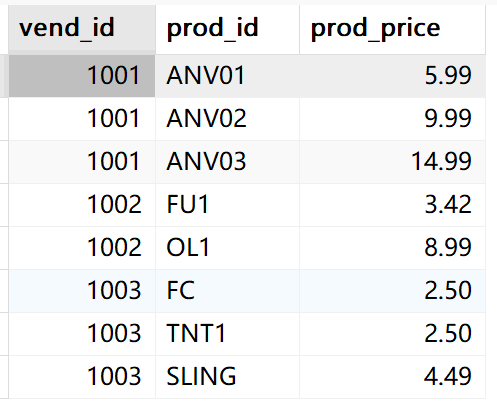

​	**合理的利用UNION，可把多条查询的结果作为一条组合查询返回，不管它的结果包含还是不包含重复，使用UNION可极大地简化复杂的WHERE子句，简化从多个表中检索数据的工作**

​	


# 3.9 全文本搜索


### 3.9.1 理解全文本搜索

```sql	
Mysql支持几种基本的数据库引擎，但并非所有的引擎都支持本书所描述的全文本搜索。两个最常使用的引擎MyISAM和InnoDB,前者支持全文本搜索，而后者不支持。如果要使用全文本搜索功能，则需切换引擎MyISAM。
```

​	注意，数据库引擎是基于表的，也就是说在数据库中可以用这样的场景，有几张表是InnoDB引擎，有几张表是MyISAM引擎，这完全是可以的。但是鉴于现在主流引擎都是使用InnoDB，而全文本搜索功能在INnoodb引擎中不支持，但Innodb的特性是其他数据库无法相比的，InnoDB有很多优点。

​	但InnoDB于5.6版本引入了全文本搜索，所以，这个内容还是要学的。

​	我们前面介绍了LIKE关键字，LIKE关键字配合通配符去匹配文本，能灵活匹配文本。后面又介绍了正则表达式，正则表达式可以编写查询所需行的非常复杂的匹配模式。

​	虽然这些搜索机制非常有用，但存在几个重要的限制。

1. 性能——通配符和正则表达式通常要求MySQL尝试匹配表中的所有行（而且这些搜索极少使用表索引）。**因此，由于被搜索行数不断增加，这些搜索可能非常耗时**。
2. 明确控制——**使用通配符和正则表达式匹配，很难明确地控制匹配什么和不匹配什么**。例如，指定一个词必须匹配，一个词必须不匹配，而第一个词仅在第一个词确实匹配的情况下才可以匹配或不匹配。

​	这些限制以及更多的限制都可以用全文本搜索来解决，在使用全文本搜索时，MySQL不需要分别查看每个行。**Mysql创建指定列中各词的一个索引，搜索针对词这些进行。**


### 3.9.2  使用全文本搜索

​	为了进行全文本搜索，必须索引被搜索的列。在对表列进行适当设计后，MySQL会自动进行所有的索引和重新索引。

​	一般在创建表时启用全文本搜索。`CREATE TABLE` 语句接受`FULLTEXT`子句，它给出被索引列的一个逗号分隔的列表。下面的CREATE语句演示了FULLTEXT子句的使用：

```sql
CREATE TABLE productnotes{
	note_id int NOT NULL  AUTO_INCREMENT,
	prod_id char(10) NOT NULL,
	note_date datetime NOT NULL,
	note_text text NULL,
	PRIMERY KEY(note_id), -- 设置主键
	FULLTEXT(note_text)
}ENGINE = InnoDB;
```

​	Mysql根据子句`FULLTEXT(note_text)`的指示对它进行索引。**这里的FULLTEXT索引单个列，如果需要也可以指定多个列。在定义之后，MySQL自动维护该索引。在增加、更新或删除时，索引随之自动更新**。


### 3.9.3进行全文本搜索

​	在索引之后，使用两个函数`Match()`和`Against()`执行全文本搜索，其中`Match()`指定被搜索的列，`Against()`指定要被搜索的表达式，如下：

```sql
SELECT note_id,note_text
FROM productnotes
WHERE Mathch(note_text) Against('rabbit');
```

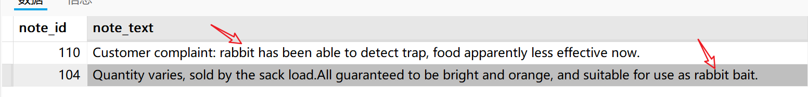

​	`Against('rabbit')`指定词rabbit作为搜索文本。由于有两行包含词`rabbit`，这两个行被返回。

​	传递给`Match()`的值必须与`FULLTEXT()`定义中的完全相同，如果指定多个列，则必须列出他们（而且次序正确）。全文本搜索不区分大小写。
