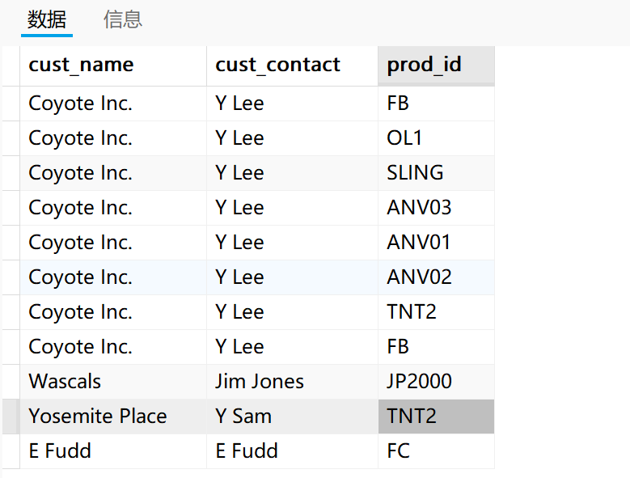
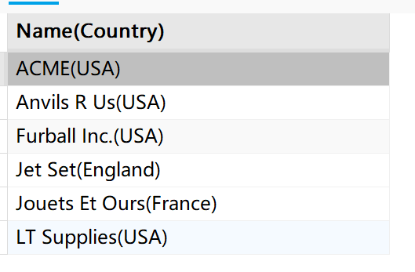
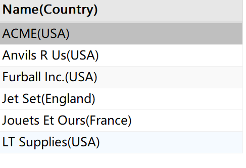
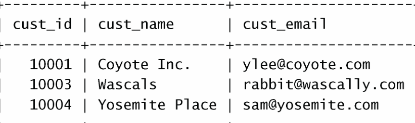
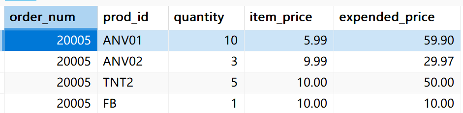
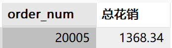

```
Mysql必知必会第22章到26章的内容
```


# 4.1 视图

​	**视图是在一个或多个基本表或视图的基础上，通过查询语句定义的虚拟表**。视图只存储其定义语句，并未存储其数据。当使用视图进行查询时，视图包含的数据才会临时生成。

​	视图是虚表。当SQL语句引用视图时，视图才会根据定义动态地产生数据。因此视图的内容总是于基本表中数据保持一致。


### 4.1.1 视图的作用

1. **视图提升了数据操作的便携性。**

   视图可定义在多个表上，且本质上视图也是一个表，不过是虚表，通过视图取重用SQL语句

2. **数据的逻辑独立性**

​	利用视图可以在一定承担的上将基本表结构与操作该表的业务程序进行逻辑分离。

3. **数据的安全性**

​	使用视图可在表权限基础上，进一步对视图使用进行授权，这增加了权限授予的层次，同时，可以通过视图隐藏表中敏感数据，实现数据安全

​	在视图创建之后，可以对视图指向`SELECT`操作，过滤和排序，将视图联结到其他视图或表。


### 4.1.2 视图的规则和限制

​	下面是关于视图创建和使用的一些最常见的规则和限制

- 与表一样，视图必须唯一命名（不能给视图取与别的视图或表相同的名字）
- 对于可以创建的视图数目没有限制
- 为了创建视图，必须具有足够的访问权限。这些限制通常由数据库管理人员授予
- 视图可以嵌套，**即可以利用从其他视图检索数据的查询来构造一个视图**
- `ORDER BY`可以用在视图中，但如果从该视图检索数据`SELECT`也含有`ORDER BY`，那么该视图中的`ORDER BY`将被覆盖
- 视图不能索引，也不能有关联的触发器或默认值
- 视图可以和表一起使用。例如，编写一条联结表和视图的SELECT语句


### 4.1.3 使用视图

​	下面是视图创建的规则

- 视图使用`CREATE VIEW`语句来创建
- 使用`SHOW CREATE VIEW viewname`;来查看创建视图的语句
- 用`DROP`删除视图，起语法为`DROP VIEW viewname`;
- 更新视图时，可以先用`DROP`再用`CREATE`，也可以直接用`CREATE OR REPLACE VIEW`，如果要更新的视图不存在，则第二条更新语句将创建一个视图；如果要更新的视图存在，则第2条更新语句会替换原有视图。

​	如下：

```sql
CREATE [OR REPLACE ] [ALGORITHM={ UNDEFINED | MERGE | TEMPTABLE}]
[DEFINER = { user | CURRENT_USER }]  
VIEW 视图名[(视图字段列表)]
AS 查询语句
[WITH [CASCADED | LOCAL] CHECK OPTION];
```

- 添加OR REPLACE可选参数表明可以在创建视图时替换数据库已有同名视图。

- ALGORITHM表示视图的使用方法。其中，UNDEFINE表示由MySQL自行决定使用方法。
- 当省略视图字段时，使用查询语句的字段名称作为视图的字段名称。
- AS指明视图的定义，其后由一个完整的SELECT语句构成
- WITH CHECK OPTION表示更新、修改和插入视图数据时，只有满足检查条件操作才会执行。

##### 1.利用视图简化复杂的联结

​	视图的最常见的应用之一是隐藏复杂的SQL，这通常会涉及联结。如下：

```sql
CREATE VIEW productcustomers AS 
SELECT cust_name, cust_contact,prod_id
FROM customers,orders,orderitems
WHERE customers.cust_id = orders.cust_id
	AND orderitems.order_num = orders.order_num;
```

​	这条语句创建一个名为`productcustomers`的视图，该视图的定义由AS后完整的SELECT语句构成。该SELECT语句联结三个表，**返回已订购任意产品的所有客户的列表**。指向`SELECT * FROM productcustomers`，将列出订购了所有任意产品的客户。查询结果如下：



​	现在可以针对查询购买了某个产品的客户信息，比如查询订购了产品`TNT2`的客户。

```sql
SELECT * FROM productcustomers 
WHERE prod_id='TNT2';
```

​	可以看到，可以像查询表一样查询视图，因为本身视图就是一个不包含任何实际数据的虚表。


##### 2. 用视图查询格式化检索出的数据

​	视图可以重用一些特定的SQL语句，换句话说就是用视图查询格式化检索出的数据。见如下语句，它将供应商的名字和国家格式化为一个字段查询。

```sql
SELECT Concat( RTrim(vend_name), '(', RTrim(vend_country),')') as 'Name(Country)'
FROM vendors
ORDER BY vend_name;
```

​	输出：



​	假如经常需要这个格式的结果，就可以基于这个SELECT查询语句创建视图，在每次需要时使用它即可。下面的语句将创建视图。

```sql
CREATE VIEW vendors_view AS
SELECT Concat( RTrim(vend_name), '(', RTrim(vend_country),')') as 'Name(Country)'
FROM vendors
ORDER BY vend_name;
```

​	可以看到，只需要在之前的SELECT语句前面加上`CREATE VIEW view_name AS`就可以创建一个结果为SELECT查询出来的表的视图。然后我们用`SELECT * FROM viewname`去查询视图。

```sql
SELECT * FROM vendors_view;
```




##### 3.用视图过滤不想要的数据

​	对视图应用普通的WHERE子句也很有用。比如，定义一个`customers_email_list_view`视图，它过滤没有电子邮件的客户，可以使用下面的语句：

```sql
CREATE VIEW customers_email_list_view as
SELECT cust_id,cust_name,cust_email
FROM customers
WHERE cust_email IS NOT NULL ;
```

​	现在可，可以像使用其他表一样使用视图`customers_email_list_view`。

```sql
SELECT * FROM customers_email_list_view;
```

​	结果




##### 4.使用视图与计算字段

​	视图对于简化计算字段的使用特别有用。下面的SELECT语句使用计算字段检索某个订单的物品，计算每种物品的总价格：

```sql
SELECT prod_id,
			 quantity,
			 item_price,
			 quantity*item_price as expended_price
FROM orderitems
WHERE order_num =20005;
```

​	下面将其转换为一个视图。

```sql
CREATE OR REPLACE VIEW order_expended_price_view AS
SELECT order_num,
			prod_id,
			 quantity,
			 item_price,
			 quantity*item_price as expended_price
FROM orderitems
```

​	然后查询该视图,检索订单号为20005的内容。

```sql
SELECT * FROM order_expended_price_view 
WHERE order_num =20005;
```

​	输出：



​	有了这个视图后可以根据需求进行更多的查询，比如我们查询订单20005总花销是多少。

```sql
SELECT order_num, SUM(expended_price) as 总花销
FROM order_expended_price_view
```

​	

​	可以看到，有了视图很多操作就简化掉了，而且非常的灵活

​	


### 4.1.5 更新视图

​	视图的数据能否更新？答案视情况而定

​	通常，视图是可更新的（即，可以对它们使用INSERT、UPDATA和DELETE）**。更新一个视图将更新其基表（视图本身没有数据）。如果你对视图增加或删除行，实际上是对其基表增加或删除行。**

​	但是，并非所有视图都是可更新的。基本上可以说，如果MySQL不能正确地确定被更新的基数据，则不允许更新。实际上，如果视图定义中有以下操作，则不能进行视图的更新：

- 分组（使用GROPU BY 和HAVING）；
- 联结；
- 子查询；
- 并（UNION）；
- 聚合函数(Min、Max等)
- DISTINCT
- 导出（计算）列

换句话说，本章许多例子的视图都是不可更新的。听上去好像是很严重的限制，但实际上并不是**，因为视图主要用于检索数据。**

​	**视图是虚拟的表。它们包含的不是数据而是根据需要检索的数据的查询。视图提供一种MySQL的SELECT语句层次的封装，可用来简化据处理以及重新格式化基础数据或保护基础数据。**


# 4.2 索引

​	在很多数据库系统中，数据库读取的次数多于数据库写的次数，因此，如何提高数据库读取数据效率是数据库优化的主要工作之一。**索引采用键值对的数据结构，可加快检索数据。**

​	索引的键由表或视图中一列或多列生成，值存储了键所对应数据的存储位置。如果把数据库看作质点，可以把索引的键看作字典的拼音，值为该拼音所在的第一个汉子的位置，借助拼音检索可以缩小目标汉字查找范围，避免逐页查找。

​	索引是一种以空间换时间的方法，索引一旦创建，将由MySQL自动管理和维护，索引的维护需要消耗计算资源和存储资源，**如何设计索引，是提升数据库使用效率的关键。**


### 4.2.1 索引分类

​	索引可以根据多种角度对索引进行分裂、

##### 1. 根据索引特征进行分类

​	(1) 普通索引是值创建索引时**不覆盖任何约束和限制条件的索引**。

​	(2) 唯一索引是值创建索引时，使用`UNIQUE`关键字的索引。**由于唯一索引涉及的列值必须唯一**，因此**使用唯一索引比使用普通索引查询速度快得多。**

​	(3) **主键索引是指创建数据表时依据主键自动创建的索引**。一个表只能有一个主键，所以，一个数据表只能有一个主键索引。

​	(4) 全文索引是指在创建索引时，**使用了`FULLTEXT`关键字的索引**。查询数据较大的字符串类型字段时，使用全文索引可提高查找数据。

​	(5) 空间索引是指在创建索引时，使用了`SPATIAL`关键字的索引。其适用于`GEOMETRY、POINT、POLYGON`等空间数据类型的列。


##### 2. 根据索引设计列数进行分类

​	从索引设计的列数角度可以将索引分为单列索引和复合索引。

​	(1) **单列索引是指针对某种表或视图上单列创建的索引**。结合索引特征分类方法，用户可以创建一个单列的唯一索引、也可以建立一个单列的主键索引。

​	(2) 复合索引是指针对某张表或视图上多个列创建的索引。**复合索引中列出现的顺序决定了索引的使用方式**。只有查询条件中使用了复合索引的第一个字段，复合索引才会生效。例如，对课程表中课程名称和学时2个字段建立复合索引，当查询条件的第一个参数为课程名称时，复合索引才会生效。注意。**复合索引不能跨表建立**


##### 3.根据索引存储方式进行分类

​	从索引存储技术角度可以将索引分为`B-Tree`索引和`Hash`索引

​	(1) `B-Tree`索引是指使用了`B-Tree`数据结构的索引。**`B-Tree`是一种支持范围查询且查询时间复杂度较低的平衡多叉树结构。**

​	(2) Hash索引是指使用了Hash结构的索引。


### 4.2.2  索引设置原则

①	严格限制同一个表或视图上的索引数量。索引增多将会严重影响INSERT、UPDATE和DELETE语句的执行性能。对于表中使用频度较低或者不再使用的索引，需及时删除。

②	对于重复值较多的列，不建议建立索引。

③	对排序、分组或者表连接涉及的字段建立索引，可提升数据检索效率。

④	对视图建立索引将提升使用视图的检索效率。

⑤	注意唯一索引和全文对于NULL的处理方式。


### 4.2.3 管理索引

##### 1.使用`CREATE INDEX`语句创建索引

```sql
CREATE [UNIQUE | FULLTEXT | SPATIAL] INDEX 索引名称
ON 表名称(字段名称[(索引字符长度) [ASC | DESC]][,...]);
```

- **UNIQUE | FULLTEXT | SPATIAL为可选参数，用于指明索引类型。**
- ON关键字指明索引针对的表。
- ASC和DESC表明索引的排序方式。
- **当字段名称[(索引字符长度) [ASC | DESC]]只有一项时，将建立单列索引。当字段名称[(索引字符长度) [ASC | DESC]]有多项时，将建立复合索引**。

​	

​	例如，为学生表s的姓名字段（sn）建立普通索引s_name_index，索引针对sn的前6个字节且以降序方式排列

```sql
CREATE INDEX s_name_index
ON s(sn(6) DESC);
```

​	为课程表c的课程名（cn）和学时（ct）字段建立复合唯一索引c_cn_ct_index。

```sql
CREATE UNIQUE INDEX c_cn_ct_index
ON c(cn,ct);
```

​	注意，创建唯一索引时，所对应的列必须是唯一值


##### 2. 创建表格时附带创建索引

```sql
CREATE TABLE 表名(
属性名1 数据类型 [列完整性约束],
...
属性名n 数据类型 [列完整性约束],
[表约束],
[UNIQUE | FULLTEXT | SPATIAL] INDEX | KEY [索引名1] (字段名称[(索引字符长度) [ASC | DESC]]),
...
[UNIQUE | FULLTEXT | SPATIAL] INDEX | KEY [索引名n] (字段名称[(索引字符长度) [ASC | DESC]])
);

```

​	如：创建教室表classroom，包含自增主键cid，教室编号crno（非空字符串），教室教学楼名称cbn（非空字符串）。创建classroom表时，附加由教室编号（crno）和教室名称（cbn）构成的普通唯一索引cn_cb_index。

```sql
CREATE TABLE classroom(
	cid INT AUTO_INCREMENT,
	crno VARCHAR(10) NOT NULL,
	cbn VARCHAR(10) NOT NULL,
	PRIMARY KEY(cid),
	UNIQUE INDEX cn_cb_index(crno, cbn)
);
```


##### 3.为已有表添加索引

```sql
ALTER TABLE 表名
ADD [UNIQUE | FULLTEXT | SPATIAL] INDEX | KEY [索引名1] (字段名称[(索引字符长度) [ASC | DESC]]),
...
ADD [UNIQUE | FULLTEXT | SPATIAL] INDEX | KEY [索引名n] (字段名称[(索引字符长度) [ASC | DESC]])；

```

例如，为教师表t中的教师姓名(tn)添加索引`tn_index`，索引长度为6且使用降序排序

```sql
ALTER TABLE t
ADD INDEX tn_index(tn(6) DESC);
```


##### 4.索引的查看

​	使用`SHOW INDEX`语句查看已有表或视图上的索引信息。

```sql
SHOW INDEX FROM 表名[FROM 数据库名];
```


##### 5.索引的删除

使用`ALTER TABLE`语句和`DROP INDEX`语句删除指定索引

```sql
ALTER TABLE 表名
DROP INDEX 索引名
```

或

```sql
DROP INDEX 索引名 ON 表名;
```


# 4.3 存储过程

​	


# 4.4 游标


# 4.5 触发器


# 4.6 事务管理

​	事务处理（`transaction processing`)可以用来维护数据库的完整性，**它保证成批的`Mysql`操作要么完全执行，要么完全不执行**。

事务处理需要知道的几个术语：

- 事务（transaction）指一组SQL语句；
- 回退（rollback）指撤销指定SQL语句的过程；
- 提交（commit）指将存储的SQL语句结果写入数据库表；
- 保留点（savepoint）指事务处理中设置的临时占位符，你可以对它发布回退（与回退整个事务处理不同）。

​	一般来说，事务必须满足4个条件（ACID）：原子性（Atomicity，或称不可分割性）、一致性、隔离性、持久性。


### 4.6.1 事务控制

​	管理事务处理的关键在于将SQL语句组分解为逻辑块，并明确规定数据何时回退，何时不回退。MySQL使用下面的语句来标识事务的开始：

```sql
START TRANSACTION
```

​	Mysql的`ROLLBACK`命令用来回退（撤销）Mysql语句

```sql
SELECT * FROM ordertotals;
START TRANSACTION;
DELETE FROM ordertotals;
SELECT *FROM ordertotals;
ROLLBACK;
SELECT * FROM ordertotals;
```

​	第一条查询语句查询出该表的数据，然后事务开始，这个事务将删除该表的所有行，然后又查询该表验证该表确实为空。这时用一条`ROLLBACK`语句回退`START TRANSACTION`之后的所有语句，最后一条`SELECT`语句显式该表不为空。


