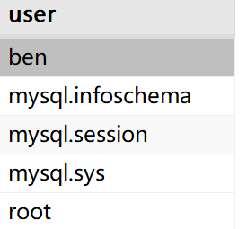

# 5.2 安全管理

​	数据库服务器通常包含关键的数据，确保这些数据的安全和完整要利用访问控制。本节将学习MySQL的访问控制和用户管理


### 5.2.1 访问控制

​	MySQL服务器的安全基础是：用户应该对他们需要的数据具有适当的访问权，既不能多也不能少。考虑下面的内容：

- 多数用户只需对表进行读和写，少数用户需要创建和删除表
- 某些用户只需要读表，不需要更新表
- 允许用户添加数据，但不允许它们删除是数据；
- 管理员需要处理用户账户的权限。
- 允许用户通常存储过程访问数据，但不允许它们直接访问数据
- 根据用户登录的地点限制对某些功能的访问

​	`root`用户账户对MySQL服务器具有完全的控制权限。对非现实的数据库实验MySQL时，可以这样做，但在实际工作中。决不能使用`root`，应该创建一些列账户，有的用于管理，有的供用户使用，有的供开发人员使用。


### 5.2.2 创建用户

​	创建一个新用户的账户，使用`CREATE USER`语句。下面是语法格式

```sql
CREATE USER [IF NOT EXISTS] '用户名' [@ '主机地址或标识']
[INDENTIFIED] [WITH AUTH_PLUGIN] BY '用户口令' [RANDOM PASSWORD]
[WITH resource_option [resource_option] ... ]
[password_option];
```

- 使用CREATE USER语句可一次性创建多个用户，不同用户的配置信息使用逗号分隔。
- 创建用户时，可指定用户访问数据库时允许的主机信息，如主机标识或名称、主机地址或特殊符号，’%’表示任意位置。
- IDENTIFY子句使用WITH AUTH_PLUGIN指定口令加密策略。通过BY关键字指明口令明文或随机口令RANDOM PASSWORD。
- 可选子句[WITH resource_option [resource_option] ...]使用resource_option配置用户对数据库资源使用约束。
- 可选子句[password_option]设定口令策略。
- CREATE USER语句还提供了其他参数，如用户锁、用户连接安全策略等信息


例1，使用`CREATE USER`语句创建普通用户。

```sql
CREATE USER IF NOT EXISTS 'student'@'localhost'
INDENTIFIED BY 'student123';
```

​	创建一个只允许在本地服务器登录的账户`student`，密码为`stduent123`

```sql
CREATE USER 'teacher1'@'%' IDENTIFIED BY 'teacher123',
'teacher2'@'192.168.1.23' IDENTIFIED BY RANDOM PASSWORD;
```

​	创建两个用户，其中`teacher1`允许在任何主机访问服务器，密码为`teacher123`，用户`teacher2`只允许在ip为`192.168.1.23`地址的机器上访问服务器，密码为随机密码。

```sql
CREATE USER 'teacher5'
  WITH MAX_QUERIES_PER_HOUR 60 
MAX_UPDATES_PER_HOUR 100;
```

​	创建一个允许在任何主机访问数据库的用户teacher5，密码为空，用户teacher5每小时最多允许查询为60次，每小时最多允许更新100次。

​	


### 5.2.3管理用户

​	MySQL中有一个名为`mysql`的数据库，它存储着MySQL各种信息。`user`表存储这Mysql中的用户数据及各种权限。下面查看数据库中的用户

```sql
SELECT user FROM user;
```



​	可以通过查看`mysql.user`表中的数据查看用户的数据：

```sql
SELECT * FROM mysql.user;
```

​	

##### 1.用户重命名

​	**为重命名一个用户账户，使用`RENAME USER`语句。**如下：

```sql
RENAME USER '原用户信息' TO '新用户信息' [,'原用户信息' TO '新用户信息']
```

- 可以使用RENAME USER语句一次性为多个已有用户进行重命名，不同用户使用逗号分隔。
- 使用RENAME USER语句实际上是对mysql.user表操作，因此，需要具有mysql数据库的UPDATE权限或服务器级别的CREATE USER权限。
- 使用'用户名'@'主机信息'的形式的用户信息重命名用户，该方式不仅可以重命名用户名称，还可以修改用户允许访问服务器的主机信息。
- 当重命名的用户为定义视图、存储过程时指定的DEFINER属性值，MySQL会阻止用户重命名。

例，将已有用户`teacher1`重命名为`teacher10`，将主机信息从`%`改为`localhost`

```sql
RENAME USER 'teacher1'@'%' to 'teahcer10'@'localhost';
```


##### 2.修改用户口令

​	修改口令有多种方式:

1. `mysqladmin`命令

```sql
mysqladmin -y 用户名 p password
```

​	输入上诉命令后，命令行首先输入原密码。原密码正确后，输入新密码和确认新密码。

2. 使用`SET PASSWORD`语句修改口令

```sql
SET PASSWORD [FOR '用户名'@'主机信息'] ='新密码';
SET PASSWORD FOR 'student'@'localhost'='student123;              
```

3. 使用`ALTER USER`语句修改用户口令

```sql
ALTER USER '用户名'@'主机信息' IDENTIFIED BY '新密码';
-- 例
ALTER USER 'student'@'localhost IDENTIFIED BY 'student123';
```

​	


##### 3. 删除用户

​	使用`DROP USER`语句删除用户

```sql
DROP USER '用户名'@'主机信息'[, '用户名'@'主机信息']...
-- 例 删除主机信息为localhost用户名为student的用户
DROP USER 'student'@'localhost';
```

​	使用系统表删除用户。

```sql
DELETE FROM mysql.user WHERE User='student' AND Host='localhost';
```


### 5.2.4 设置访问权限

​	在创建用户账户后，该用户是没有任何权限的，必须接着分配访问权限。下面的语句可以看见用户账户的权限。

```sql
SHOW GRANTS FOR 用户名。
```

​	使用`GRANT`关键字为用户授予权限。

```sql
GRANT 权限名称[(字段列表)],[权限名称[(字段列表)]]
ON 授权层次及对象
TO '用户名'@'主机信息',['用户名'@'主机信息']
[WITH GRANT OPTION];
```

- 可以一次性将多个权限赋予用户，不同权限名称使用逗号分隔。

- TO子句用于指明授予的用户，可以使用TO子句将权限授予多个用户

- ON子句用于指明授权级别及对象，常见形式包括：

  •*.*为服务器级别权限（全局权限）修改mysql.user表中记录

  •db_name.*为数据库级别权限，修改mysql.db表中记录

  •db_name.table_name为表或列级别权限，授予表级别权限将修改mysql.tables_priv表中记录，授予列级别权限将修改mysql.columns_priv表中记录

  •db_name.routine_name为存储过程级别权限，修改mysql.routines_priv表中记录

- 使用GRANT语句需要具有GRANT OPTION权限且具有授权权限的操作权限。

​	

​	`GRANT`和`REVOKE`可在几个层次上控制访问权限：

- 整个服务器，使用GRANT ALL和REVOKE ALL；
-  整个数据库，使用ON database.*；
-  特定的表，使用ON database.table；
-  特定的列；
-  特定的存储过程。

​	例如，授予用户`teacher10`服务器级别的所有权限

```sql
GRANT ALL 
ON *.* TO 'teacher10'@'localhost'
WITH GRANT OPTION;
```

​	或者, 授予`teacher6`服务器级别的查找、插入和更新权限

```sql
GRANT SELECT, INSERT, UPDATE 
ON *.* TO 'teacher6'@'localhost';
```


​	同样的，能授予全权限就能回收权限，使用`REVOKE`语句回收权限

```sql
REVOKE 权限名称[(字段列表)][,权限名称[(字段列表)]]...
ON 回收权限的层次及对象
FROM '用户名'@'主机信息'[,'用户名'@'主机信息']...;
```

​	例如，对用户`teacher10`撤销数据库`teaching`下的所有表的查看和删除权限。

```sql
REVOKE SELECT, DELETE
ON teaching.*
FROM 'teacher10'@'localhost';
```


