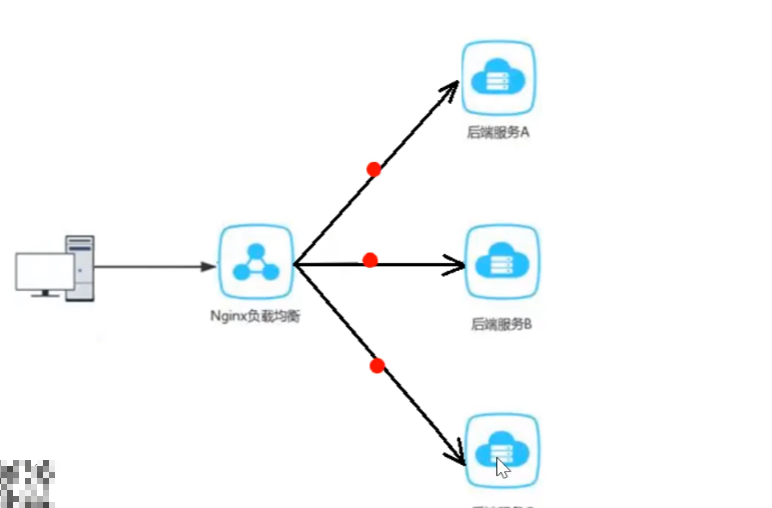

​	

# 1.1 Nginx反向代理

​	先思考一个问题：前端发送的请求，是如何请求到后端服务的

​	比如，前端请求地址为：`http://localhost/api/employee/login`

​	而后端接口地址为：`http://localhost:8080/admin/employee/login`

​	可以观察到，前端请求的地址和后端接口地址并不一样，那么是怎么能够正确的接受到请求的呢，其实就是`Nginx`反向代理做的，**将前端发送的动态请求由nginx转发到后端服务器**

​	

​	nginx反向代理的好处：

- 提高访问速度
- 进行负载均衡（把大量的请求按照指定的方式均衡的分配给集群中的每台服务器）



- 保证后端服务安全


### 1.1.1 反向代理的配置方式

​	反向代理的配置位于`conf`目录下的`nginx.conf`文件中。请看下面的一个服务配置

```conf 
server{
	listen 80;  #监听端口号80
	server_name localhost #服务名
	
	location /api/{
		proxy_pass http://localhost:8080/admin/; #反向代理
	}
}
```

​	当前端请求：`http://localhost/api/employee/login`时，`Nginx`通过反向代理，转发到`http://localhost8080/admin/epmloyee/login`

​	

​	**负载均衡的配置方式**

```conf 
	upstream webservers{
	  server 127.0.0.1:8080 weight=90 ;
	  #s你erver 127.0.0.1:8088 weight=10 ;
	}
	
	server{
		listen 80;  #监听端口号80
		server_name localhost #服务名
	
		location /api/{
			proxy_pass http://webservers/admin/; #反向代理
		}
	}
```

​	webservers里配置的是服务器的地址及对应的端口号。只要前端请求的是反向代理，它就会把请求平均的发送给`webservers`里的服务器列表

