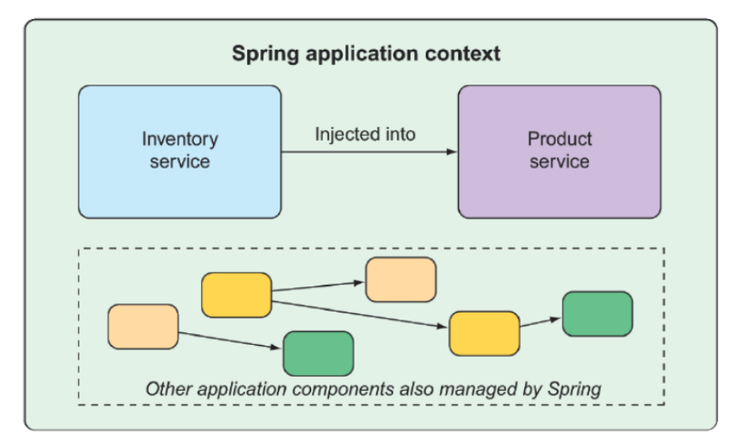
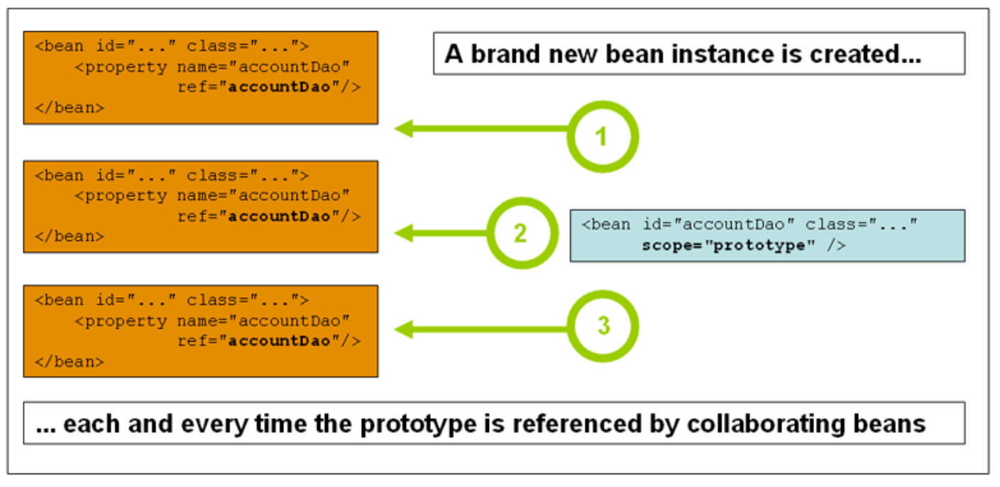

# 1 什么是Spring

​	Spring的核心是一个容器，成为`Spring`应用程序上下文，**用于创建和管理应用程序组建**，这些组件（或bean）在Spring应用程序上下文中连接在一起一次构成一个完整的应用程序。就像将砖、灰奖、木材等等组成房屋一样

> ​	bean是被Spring容器管理的对象，区别于自己创建、管理的Java对象

​	将bean连接在一起的行为是**基于一种称为==依赖注入（DI）==的模式**。**依赖项注入的应用程序，不是由组件自身创建和维护它们以来的其他bean的生命周期，而是依赖于单独的实体（容器）来创建和维护所有组件。**并将这些组件注入需要它们的bean，通常通过构造函数参数或属性访问器完成此操作。

​	

​	例如，有两个组件:`inventoryservice(库存信息)`和`product service(产品信息)`。库存信息依赖于产品信息，下图说明了`bean`和`Spring`应用程序上下文之间的关系



​		从历史上看，引导`Spring`应用程序上下文将`bean`连接在一起的方式是使用一个或多个XML文件，这些文件描述了组件及其于其他组件的关系。例如

​	以下XML声明两个bean，一个`InventoryService`Bean和一个`ProductService`bean，然后通过构造函数参数将`InventoryService`bean注入到`ProductService`中

```xml
<bean id="inventoryService" 
      class="com.example.InventoryService"/>
<bean id="productService"
      class = "com.example.ProductService">
	<constructor-arg ref = "inventoryService"/>
</bean>
```

​	在新版本中，基于`Java`的配置更为常见，下面基于Java的配置类等效XML配置：

```java
@Configuration
public class ServiceConfiguration{
    @Bean
    public InventoryService inventoryService(){
        return new InventoryService();
    }
    
    @Bean
    public ProductService productService(){
        return new ProductService(inventoryService());
    }
}
```

​	`@Configuration`注解向`Spring`表明这是一个配置类，它为`Spring application context`提供`beans`。配置的类方法带有`@Bean`注释，指示它们返回的对象应作为`bean`添加到应用程序上下文中。

​	基于Java的配置具有多个优点，包括更高的类型安全性和改进的可重构性。即使这样，仅当Spring无法自动配置组件时，才需要使用`Java`或`XML`进行显示配置，也就是说，**大部分时候Spring都是自动配置的**

​	

​	随着`Spring boot`的推出，自动配置的优势已经远远超过了组件扫描和自动装配，`Spring Boot`是`Spring`框架的扩展，它提供了多项生产力增强功能。这些增强功能最**著名的就是自动配置**

​	`Spring boot`自动配置大大减少了构建应用所需的显式配置，本章的示例中，甚至仅包含一行Spring配置代码。

​	`Spring Boot`极大地增强了`Spring`开发的能力，在学习时，将尽可能使用`Spring Boot`，并仅在必要时使用显式配置。


## 1.1 IDEA中使用Spring

​	使用Spring有多种方式，可以使用官方给出的快捷创建工程，也可以利用特定的工具创建，IDEA中也支持创建Spring项目。在这里，我们利用Maven依赖管理框架来使用Spring。

​	第一步，是创建一个普通的Maven项目，然后在`pom.xml`中导入`Spring`坐标。

```xml
       <dependency>
            <groupId>org.springframework</groupId>
            <artifactId>spring-context</artifactId>
            <version>6.2.14</version>
        </dependency>
```

​	第二步，在`resources`文件夹内，右键选择新建`xml配置文件`的选项中选择`spring`配置，命名为`applicationContext`。之后，便可以在里面通过`<bean/>`标签来声明`bean`：

```xml
<?xml version="1.0" encoding="UTF-8"?>
<beans xmlns="http://www.springframework.org/schema/beans"
       xmlns:xsi="http://www.w3.org/2001/XMLSchema-instance"
       xsi:schemaLocation="http://www.springframework.org/schema/beans http://www.springframework.org/schema/beans/spring-beans.xsd">
	
    <bean id = "hello" class="service.Hello"/>
</beans>
```

​	id是这个bean的唯一标识，也是通过容器获取bean的key，`class`指明了这个bean管理的类。

​	随后，我们就可以通过`Ioc`容器来获取这个bean（对象），`Hello`这个类有一个`Hi`方法，将打印`Hello`。在获取bean之前，当然呀先获取容器。在`Spring`中，使用`applicationContext`这个接口来代表Ioc容器，它有许多的实现类。这里我们使用实现类`	ClassPathXmlApplicationContext`

```java
public class App2 {
    public static void main(String[] args) {
            //获取Ioc容器（ApplicationContext）
        ApplicationContext ctx = new ClassPathXmlApplicationContext("applicationContext.xml");

        Hello h = (Hello) ctx.getBean("hello");
        h.hi();
    }
}
//运行结果：
Hello
```

​	

​		


# 2 IoC容器

​	使用对象时，由主动new产生对象转化为由外部提供对象，此过程中对象创建控制权由程序转移到**外部**，从而降低了耦合，此思想称为控制反转。

​	`Spring`提供了一个容器，成为`Ioc`容器，用来充当`IoC`思想中的外部。	


## 2.1 Spring IoC容器和Bean简介

​	`org.springframework.beans`和`org.springframework.context`包是`Spring Framework`的Ioc容器的基础，`BeanFactory`接口提供一种高级配置机制，能够管理任何类型的对象

​	**`ApplicationContext`**是`BeanFactory`的子接口，它增加了很多功能：

- 更容易于Spring的AOP功能集成
- `Message resource`处理（用于国际化）
- 事件发布
- 应用层的特定上下文，如`WebApplicationContext`，用于web应用

​	简而言之，`BeanFactory`提供了配置框架和基本功能，而`ApplicationContext`则增加了更多的企业特定功能。

​	在Spring中，构成你的应用程序的骨干并由Spring IOC容器管理的对象被称为Bean。`Bean`是一个由Spring Ioc容器实例化、组装和管理的对象。`Bean`以及它们之间的依赖关系都反映在容器使用的配置元数据（XML或注解）中。 


## 2.2 容器概述

​	`org.springframework.context.ApplicationContext`接口代表`Spring IoC`容器，负责**实例化、配置和组装bean**。容器通过读取配置元数据来获得关于要实例化、配置和组装哪些对象的知识。**配置元数据以XML、Java注解或Java代码标识**

​	Spring提供了几个`ApplicationContext`接口的实现。

1. **ClassPathXmlApplicationContext**

​	这个实现从类路径（classpath）加载XML配置。如：

```java
ApplicationContext contex =
    new ClassPathXmlApplicationContext("applicationContext.xml")
```

​	`Spring`会从`src/main/resources`下面寻找`applicationContext.xml`文件，然后读取元数据	

2. **FileSystemXmlApplicationContext**

​	从磁盘路径加载XML（相对或绝对路径都可以），例如：

```java
ApplicationContext context =
    new FileSystemXmlApplicationContext(
        "D:/spring/applicationContext.xml");
//或
ApplicationContext context2 =
    new FileSystemXmlApplicationContext(
        "config/applicationContext.xml");
```

3. **AnnotationConfigApplicationContext**

   最常用的元数据配置方式，读取Java配置类。例如：

   ```java
   @Configuration
   public class AppConfig {
   
       @Bean
       public UserService userService(){
           return new UserService();
       }
   
   }
   ```

   @Configuration表明它是一个配置类，@Bean表明这个构造方法是一个bean。

   然后创建applicationContext:

   ```java
   ApplicationContext context =
       new AnnotationConfigApplicationContext(
           AppConfig.class);
   ```


​	但实际上，在大多数时候都工作环境中，你都不需要去手动创建容器，这部分工作被Spring自动完成了。到Spring Boot时代，甚至只有一句：

```java
SpringApplication.run(...)
```

​	


#### 2.2.1 配置元数据 

​	配置元数据传统上是以简单直观的XML格式提供的。

​	Spring的配置包括至少一个，通常是一个以上的`Bean`定义，容器必须管理这些定义。基于XML的配置元数据将这些`Bean`配置为顶层`<beans/>`元素内的`<bean/>`元素。而`Java`配置通常使用`@Configuration`类的`@Bean`注解的方法

​	这些`Bean`的定义对应应用构成你的应用程序的实际对象，下面的例子显示了基于XML的配置元数据的基本结构

```xml
<?xml version="1.0" encoding="UTF-8"?>
<beans xmlns="http://www.springframework.org/schema/beans"
    xmlns:xsi="http://www.w3.org/2001/XMLSchema-instance"
    xsi:schemaLocation="http://www.springframework.org/schema/beans
        https://www.springframework.org/schema/beans/spring-beans.xsd">

    <bean id="..." class="..."> (1) (2)
        <!-- 这个bean的合作者和配置在这里 -->
    </bean>

    <bean id="..." class="...">
        <!-- c这个bean的合作者和配置在这里 -->
    </bean>

    <!-- 更多bean 定义在这里 -->

</beans>

```

- id属性是一个字符串，用于识别单个Bean定义
- class属性定义了Bean的类型，并使用类的全路径明

`id` 属性的值可以用来指代协作对象。但本例中没有显示用于引用协作对象的XML。在之后会介绍协作对象。

> 协作对象：在实际开发中更多的被称为：
>
> 依赖对象
> 依赖Bean
> 关联Bean
>
> 例如，如果一个类中的成员包含另一个类，那个类就被称为协作对象。


#### 2.2.2 实例化一个容器

​	提供给`ApplicationContext`构造函数的一条或多条路径是资源字符串，它让容器从各种外部资源（如本地文件系统、JavaCLASSPATH等）加载配置元数据

```xml
ApplicationContext context = new ClassPathXmlApplicationContext("services.xml","daos.xml");
```

​	


**构建基于XML的配置元数据**

​	让Bean的定义跨越多个XML文件很有用。通常情况下，每个单独的XML配置文件代表了你架构中的一个逻辑层或模块。你可以使用`applicationcontext`构造函数从所有这些XML片段中加载Bean定义，这个构造函数需要多个`Resource`位置，如上一节所示。

​	或是使用一个或多个`<import/>`元素来从另一个或多个文件加载Bean定义：

```xml
<beans>
    <import resource="services.xml"/>
    <import resource="resources/messageSource.xml"/>
    <import resource="/resources/themeSource.xml"/>

    <bean id="bean1" class="..."/>
    <bean id="bean2" class="..."/>
</beans>

```

​	在前面的例子中，外部Bean定义从三个文件中加载：`services.xml`、`messageSource.xml` 和 `themeSource.xml`。所有的位置路径都是相对于进行导入的定义文件而言的，所以 `services.xml` 必须与进行导入的文件在同一目录或 classpath 位置，而 `messageSource.xml` 和 `themeSource.xml` 必须在导入文件的位置以下的 `resources` 位置。正如你所看到的，前导斜线会被忽略。然而，鉴于这些路径是相对的，最好不要使用斜线。被导入文件的内容，包括顶层的 `<beans/>` 元素，必须是有效的XML Bean定义


#### 2.2.3 使用容器

​	`ApplicationContext` 是一个高级工厂的接口，能够维护不同Bean及其依赖关系的注册表。通过使用方法 `T getBean(String name, Class<T> requiredType)`，你可以检索到Bean的实例。

`ApplicationContext` 可以让你读取Bean定义（definition）并访问它们，如下例所示。

```java
public class App2 {
    public static void main(String[] args) {
            //获取Ioc容器（ApplicationContext）
        ApplicationContext ctx = new ClassPathXmlApplicationContext("applicationContext.xml");

        Hello h = ctx.getBean("hello",Hello.class);
        h.hi();
    }
}
```

​	可以使用`getBean`来检索Bean的实例，接口`PpplicationContext`还有一些其他检索Bean的方法。但在理想情况下，不应该使用这些方法，本质上还是自己获取对象的方式，这不符合`IOC`的思想。

​	更推荐通过 `@Autowired`、构造器注入等依赖注入方式获得 Bean，而不是让业务代码主动去容器里查找 Bean。


## 2.3 Bean概览

​	一个Spring IoC容器管理着一个或多个Bean。这些Bean是用你提供给容器的配置元数据创建的（例如，以XML <bean/> 定义的形式）。

在容器本身中，这些Bean定义被表示为 `BeanDefinition` 对象，它包含（除其他信息外）以下元数据。

- 一个全路径类名：通常，被定义的Bean的实际实现类。
- Bean的行为配置元素，它说明了Bean在容器中的行为方式（scope、生命周期回调，等等）。
- 对其他Bean的引用，这些Bean需要做它的工作。这些引用也被称为合作者或依赖。
- 要在新创建的对象中设置的其他配置设置—例如，pool的大小限制或在管理连接池的Bean中使用的连接数。

这个元数据转化为构成每个Bean定义的一组属性。下表描述了这些属性。

| 属性                     | 解释…                                                        |
| :----------------------- | :----------------------------------------------------------- |
| Class                    | [实例化 Bean](https://springdoc.cn/spring/core.html#beans-factory-class) |
| Name                     | [Bean 命名](https://springdoc.cn/spring/core.html#beans-beanname) |
| Scope                    | [Bean Scope](https://springdoc.cn/spring/core.html#beans-factory-scopes) |
| Constructor arguments    | [依赖注入](https://springdoc.cn/spring/core.html#beans-factory-collaborators) |
| Properties               | [依赖注入](https://springdoc.cn/spring/core.html#beans-factory-collaborators) |
| Autowiring mode          | [注入协作者（Autowiring Collaborators）](https://springdoc.cn/spring/core.html#beans-factory-autowire) |
| Lazy initialization mode | [懒加载的Bean](https://springdoc.cn/spring/core.html#beans-factory-lazy-init) |
| Initialization method    | [初始化回调](https://springdoc.cn/spring/core.html#beans-factory-lifecycle-initializingbean) |
| Destruction method       | [销毁回调](https://springdoc.cn/spring/core.html#beans-factory-lifecycle-disposablebean) |


#### 2.3.1  Bean命名

​	每个`Bean`都有一个或多个标识符（identifier）。这些标识符在承载Bean的容器中必须是唯一的。一个Bean通常只有一个标识符。然而，如果它需要一个以上的标识符，多余的标识符可以被视为别名。

​	在基于XML的配置元数据中，你可以使用 `id` 属性、`name` 属性或两者来指定Bean标识符。`id` 属性允许你精确地指定一个 `id`。传统上，这些名字是字母数字（'myBean'、'someService’等），但它们也可以包含特殊字符。如果你想为Bean引入其他别名，你也可以在 `name` 属性中指定它们，用逗号（`,`）、分号（`;`）或空格分隔。尽管 `id` 属性被定义为 `xsd:string` 类型，但 bean id 的唯一性是由容器强制执行的，尽管不是由 XML 解析器执行。

​	你不需要为Bean提供一个 `name` 或 `id`。如果你不明确地提供 `name` 或 `id`，容器将为该 Bean 生成一个唯一的名称。然而，如果你想通过使用 `ref` 元素或服务定位器风格的查找来引用该 bean 的名称，你必须提供一个名称。

​	**Bean的命名规则**

> 惯例是在命名Bean时使用标准的Java惯例来命名实例字段名。也就是说，Bean的名字以小写字母开始，然后以驼峰字母开头。这种名称的例子包括 `accountManager`、`accountService`、`userDao`、`loginController` 等等。
>
> 统一命名Bean使你的配置更容易阅读和理解。另外，如果你使用Spring AOP，在对一组按名称相关的Bean应用 advice 时，也有很大的帮助。

​	


**在 Bean Definition 之外对Bean进行别名**

​	在 Bean 定义中，你可以为Bean提供一个以上的名字，通过使用由 `id` 属性指定的最多一个名字和 `name` 属性中任意数量的其他名字的组合。这些名字可以是同一个Bean的等效别名，在某些情况下很有用，比如让应用程序中的每个组件通过使用一个特定于该组件本身的Bean名字来引用一个共同的依赖关系。

​	然而，在实际定义Bean的地方指定所有别名并不总是足够的。有时，为一个在其他地方定义的Bean引入别名是可取的。这种情况通常发生在大型系统中，配置被分割到每个子系统中，每个子系统都有自己的对象定义集。在基于XML的配置元数据中，你可以使用 `<alias/>` 元素来实现这一点。下面的例子展示了如何做到这一点。

```xml
<alias name="fromName" alias="toName"/>
```

​	在这种情况下，一个名为 `fromName` 的bean（在同一个容器中）在使用这个别名定义后，也可以被称为 `toName`。

​	例如，子系统A的配置元数据可以引用一个名为 `subsystemA-dataSource` 的数据源。子系统B的配置元数据可以引用一个名为 `subsystemB-dataSource` 的数据源。当组成使用这两个子系统的主应用程序时，主应用程序以 `myApp-dataSource` 的名字来引用数据源。为了让这三个名字都指代同一个对象，你可以在配置元数据中添加以下别名定义。

```xml
<alias name="myApp-dataSource" alias="subsystemA-dataSource"/>
<alias name="myApp-dataSource" alias="subsystemB-dataSource"/>
```

​	现在，每个组件和主应用程序都可以通过一个独特的名称来引用dataSource，并保证不与任何其他定义冲突（有效地创建了一个命名空间），但它们引用的是同一个bean。


#### 2.3.2 实例化Bean

​	`bean`定义本质是创建一个或多个对象的“配方”。容器在被要求时查看命名的`Bean`的“配方”。并使用该Bean定义所封装的配置元数据来创建（或获取）一个实际的对象

​	如果你使用基于XML的配置元数据，要在`<bean/>`元素的`class`属性中指定要实例化的对象的类型（或class）。这个`class`属性通常是强制的。可以以两种方式之一使用`Class`属性

- 通常，在容器本身通过反射式的调用构造函数直接创建`Bean`的情况下，指定要构造的`Bean`类，有点相当于`Java`代码中的`new`操作
- 在不太常见的情况下，即容器在一个类上调用`static`工厂方法来创建`bean`时，要指定包含被调用的`static`工厂方法的实际类。从`static`工程方法调用中返回的对象类型可能是同一个类或完全是另一个类


> **嵌套类名**
>
> 如果你为一个嵌套类配置一个Bean定义，你可以使用嵌套类的二进制名称或源名称。
>
> 例如，在`com.example`包中有一个叫做`SomeThing`的类，而这个`SomeThing`类有一个叫做`OtherThing`的静态嵌套类，它们可以用美元符号（$）或点（.）分开，因此在Bean定义中的class属性的指将是
>
> `com.example.SomeThing$OtherThing`或`com.example.SomeThing.OtherThing`


##### 1.用构造函数进行实例化

​	当你用构造函数的方法创建一个`Bean`时，所有普通的类都可以被Spring使用并与之兼容。**也就是说，被开发的类不需要实现任何特定的接口，也不需要以特定的方式进行编码，只需要指定Bean类就足够了**。

​	Spring Ioc容器几乎可以管理任何你希望它管理的类。大多数Spring用户更喜欢真正的JavaBean，它有一个默认的无参构造函数，以及按照容器中的属性建模适当的`setter`和`getter`。也可以在你的容器中拥有更多奇特的非`bean`风格的类。

​	基于XML的配置元数据，可以按以下方式指定你的`bean`类：

```java
<bean id="exampleBean" class="examples.ExampleBean"/>

<bean name="anotherExample" class="examples.ExampleBeanTwo"/>

```

​	

##### 2. 用静态工厂方法进行实例化

​	在定义一个静态工厂方法来创建`Bean`时，使用`class`属性来指定包含`static`工厂方法的类。并使用名为`factory-method`的属性来指定工厂方法本身的名称。Spring 可以通过静态工厂方法获得对象。获得对象之后，它会像对待普通 `new` 出来的对象一样管理它。这个功能主要是为了兼容那些已经存在的大量老代码和老框架，因为它们经常使用静态工厂方法而不是构造函数来创建对象。

​	下面的`Bean`定义规定，`Bean`将通过调用工厂方法来创建。该定义没有指定返回对象的类型（`class`）。而是指定了包含工厂方法的类，在这个例子中，`createInstance()`必须是一个`static`方法，下面的例子显示如何指定一个工厂方法

```java
<bean id="clientService"
    class="examples.ClientService"
    factory-method = "createInstance"/>
```

​	下面的例子显示了一个可以与前面的`Bean`定义一起工作的类：

```java
public class ClientService {
    private static ClientService clientService = new ClientService();
    private ClientService() {}

    public static ClientService createInstance() {
        return clientService;
    }
}
//一个单例模式的对象
```

​	

##### 3. 用实例工厂方法进行实例化

​	用实例工厂方法进行的实例化从容器中调用现有bean的非静态方法来创建一个新的bean。要使用这种机制，请将`class`属性留空，并在`factory-bean`属性中指定当前（或父代）容器中的一个Bean的名称。该容器包含要被调用来创建对象的实例方法。用`facotyr-method`属性设置工厂方法本身的名称。下面的例子显示了如何配置这样的一个Bean。

```java
<!-- the factory bean, which contains a method called createInstance() -->
<bean id="serviceLocator" class="examples.DefaultServiceLocator">
    <!-- inject any dependencies required by this locator bean -->
</bean>

<!-- the bean to be created via the factory bean -->
<bean id="clientService"
    factory-bean="serviceLocator"
    factory-method="createClientServiceInstance"/>

```

​	下面的例子显示了对应的工厂类：

```java
public class DefaultServiceLocator {

    private static ClientService clientService = new ClientServiceImpl();

    public ClientService createClientServiceInstance() {
        return clientService;
    }
}
```

​	一个工厂类也可以容纳一个以上的工厂方法。如下所示：

```java
<bean id="serviceLocator" class="examples.DefaultServiceLocator">
    <!-- inject any dependencies required by this locator bean -->
</bean>

<bean id="clientService"
    factory-bean="serviceLocator"
    factory-method="createClientServiceInstance"/>

<bean id="accountService"
    factory-bean="serviceLocator"
    factory-method="createAccountServiceInstance"/>

```

​	对应的工厂类：

```java
public class DefaultServiceLocator {

    private static ClientService clientService = new ClientServiceImpl();

    private static AccountService accountService = new AccountServiceImpl();

    public ClientService createClientServiceInstance() {
        return clientService;
    }

    public AccountService createAccountServiceInstance() {
        return accountService;
    }
}
```


## 2.4 依赖

​	一个典型的企业应用程序并不是由单一的对象（或Spring术语中的bean）组成的。即使是最简单的应用也是一些对象组成，它们一起工作，呈现出最终用户所看到的连贯的应用。

​	下面将解释如何从定义一些单独的`Bean`定义到一个完全实现的应用，在这个应用中，**各对象相互协作以实现一个目标**


#### 2.4.1 依赖注入

​	**依赖注入（DI）是一个过程**，对象仅通过构造参数、工厂方法的参数，或在对象实例被构造，或从工厂方法返回后在其上设置的属性来定义来的**依赖（即与它们一起工作的其他对象）**。

​	然后，容器在创建`bean`时注入这些依赖，这个过程从根本上说是**Bean本身通过使用类的直接构造或服务定位模式来控制其依赖的实例化或位置的逆过程（因此被称为控制反转）**

​	采用DI原则，代码会更干净，当对象被提供其依赖时，解耦会更有效，对象不会查找其依赖，也不知道依赖的位置或类别。因此类变得更容易测试。

​	DI主要有两个变体：基于构造器的依赖注入和基于setter的依赖注入。


##### 1.基于构造器的依赖注入

​	基于构造函数的DI是通过容器调用带有许多参数的构造函数来完成的，每个参数代表一个依赖。调用带有特定参数的`static`工厂方法来构造`bean`几乎是等价的。本讨论对构造函数的参数和`static`工厂方法的参数进行类似处理。下面的例子显示了一个只能用构造函数注入的依赖注入的类。

```java
public class SimpleMovieLister {

    // the SimpleMovieLister has a dependency on a MovieFinder
    private final MovieFinder movieFinder;

    // a constructor so that the Spring container can inject a MovieFinder
    public SimpleMovieLister(MovieFinder movieFinder) {
        this.movieFinder = movieFinder;
    }

    // business logic that actually uses the injected MovieFinder is omitted...
}


```

​	注意，这个类并没有什么特别之处，它是一个POJO，对容器的特定接口、基类或注解没有依赖。

> 构造器注入就是 Spring 在创建对象时，通过调用构造函数，把对象需要的依赖传进去；而业务类本身只是普通 Java 类（POJO），完全不需要继承 Spring 的类或实现 Spring 的接口。这样业务代码和 Spring 框架保持解耦。


2.**构造函数参数解析**

​	构造函数解析匹配是通过使用参数的类型进行的。构造器参数在bean定义中的定义顺序就是这些参数bean被实例化时被提供给适当的构造器顺序。考虑下面这个类。

```java
package x.y;
public class ThingOne{
    public ThingOne(ThingTwo thingTwo,ThingThree thingThree){
        //..
    }
}
```

​	假设`ThingTwo`和`ThingThree`类没有继承关系。在下面的配置中，不需要在`<constructor-arg/>`元素中明确指定构造函数参数的索引或类型，因为它引用了其他`bean`

```xml
<beans>
    <bean id="beanOne" class="x.y.ThingOne">
        <constructor-arg ref="beanTwo"/>
        <constructor-arg ref="beanThree"/>
    </bean>

    <bean id="beanTwo" class="x.y.ThingTwo"/>

    <bean id="beanThree" class="x.y.ThingThree"/>
</beans>

```

​	当引用另一个Bean时，类型是已知的，并且可以进行匹配（就像前面的例子那样）。当使用一个简单的类型时，比如 `<value>true</value>`，Spring不能确定值的类型，所以在没有帮助的情况下不能通过类型进行匹配。考虑一下下面这个类。

```java
package examples;

public class ExampleBean {

    // Number of years to calculate the Ultimate Answer
    private final int years;

    // The Answer to Life, the Universe, and Everything
    private final String ultimateAnswer;

    public ExampleBean(int years, String ultimateAnswer) {
        this.years = years;
        this.ultimateAnswer = ultimateAnswer;
    }
}

```

​	在这个类里面的构造函数中，它的参数是两个基本类型。所以可以通过`type`属性显式地指定构造函数的类型，容器就可以使用简答的类型匹配：

```java
<bean id="exampleBean" class="examples.ExampleBean">
    <constructor-arg type="int" value="7500000"/>
    <constructor-arg type="java.lang.String" value="42"/>
</bean>
```

​	

​	可以使用`index`属性来明确指定构造函数参数的索引，如下例所示：

```java
<bean id="exampleBean" class="examples.ExampleBean">
    <constructor-arg index="0" value="7500000"/>
    <constructor-arg index="1" value="42"/>
</bean>

```

​	`index="0"`表示该参数对应构造器函数的第一个参数，`index="1"`表示该参数对应构造器函数的第2个参数，指定一个索引可以解决构造函数有两个相同类型的参数的歧义。	

```java
public class Person {

    private String name;
    private String address;

    public Person(String name, String address) {
        this.name = name;
        this.address = address;
    }
}
```

​	对于正常使用的构造函数，Spring不会出错，但是如果是这样使用：

```java
new Person("贵州", "田");
```

​	原本期望的值被错误的填入成员了，指定索引可以解决这个问题：

```java
<bean id="person" class="Person">
    <constructor-arg index="0" value="田"/>
    <constructor-arg index="1" value="贵州"/>
</bean>
```

​	明确的告诉第一个参数是：“田”，第二个参数是：“贵州”

​	**也可以使用构造函数的参数名称来进行消歧**：

```java
<bean id="person" class="Person">
    <constructor-arg name="name" value="田"/>
    <constructor-arg name="address" value="贵州"/>
</bean>
```

​	但要使用这种形式，代码在编译时必须启用`debug`标志，因为java在编译时并不会保存构造函数的参数名称，更类似`person(String,String)`。`Spring`需要知道构造器的参数名称，所以在开启`debug`标志后可以获得这些名称。

​	不过，有另一种办法解决这个问题，那就是使用`@ConstructorProperties`JDK注解来明确命名你的构造函数参数。这样依赖，示例类就得如下：

```java
package examples;

public class ExampleBean {

    // Fields omitted

    @ConstructorProperties({"years", "ultimateAnswer"})
    public ExampleBean(int years, String ultimateAnswer) {
        this.years = years;
        this.ultimateAnswer = ultimateAnswer;
    }
}
```


##### 3.基于Setter的依赖注入

​	基于Setter的DI是通过容器在调用无参数的构造函数或无参数的`static`工厂方法来实例化你的`bean`之后调用`Setter`方法来实现的。

​	下面的例子显示了一个只能通过使用纯`setter`注入的类的依赖注入。

```java
public class SimpleMovieLister {

    // the SimpleMovieLister has a dependency on the MovieFinder
    private MovieFinder movieFinder;

    // a setter method so that the Spring container can inject a MovieFinder
    public void setMovieFinder(MovieFinder movieFinder) {
        this.movieFinder = movieFinder;
    }

    // business logic that actually uses the injected MovieFinder is omitted...
}


```

​	`ApplicationContext`支持它所管理的`Bean`基于构造器和基于Setter的`DI`，它还支持在一些依赖已经通过构造器方法注入后的基于setter的DI。

​	你以`BeanDefinition`的形式配置依赖关系，将其与`PropertyEditor`实例一起使用，将属性从一种格式转化为另一种。然而大多数Spring用户并不直接使用这些类。而是`XML bean`定义、注解组件（即用`@Component、@Controller`等注解的类），或基于Java的`@Configuration`类中的`Bean`方法。然后这些来源在内部转化为`BeanDefinition`的实例，并用于加载整个`Spring IoC`实例。

> **基于构造器的DI还是基于setter的DI？**
>
> ​	由于你可以混合使用基于构造函数的DI和基于setter的DI，一个好的经验法则是对强制依赖使用构造函数，对可选依赖使用setter方法或配置方法。请注意，在setter方法上使用 [@Autowired](https://springdoc.cn/spring/core.html#beans-autowired-annotation) 注解可以使属性成为必须的依赖；然而，带有参数程序化验证的构造器注入是更好的。
>
> ​	Spring团队通常提倡构造函数注入，因为它可以让你将应用组件实现为不可变的对象，并确保所需的依赖不为 `null`。此外，构造函数注入的组件总是以完全初始化的状态返回给客户端（调用）代码。顺便提一下，大量的构造函数参数是一种不好的代码气味，意味着该类可能有太多的责任，应该重构以更好地解决适当的分离问题。
>
> ​	Setter注入主要应该只用于在类中可以分配合理默认值的可选依赖。否则，必须在代码使用依赖的所有地方进行非null值检查。Setter注入的一个好处是，Setter方法使该类的对象可以在以后重新配置或重新注入。因此，通过 [JMX MBean](https://springdoc.cn/spring/integration.html#jmx) 进行管理是setter注入的一个引人注目的用例。
>
> ​	对于一个特定的类，使用最合理的DI风格。有时，在处理你没有源代码的第三方类时，你会做出选择。例如，如果一个第三方类没有暴露任何setter方法，那么构造函数注入可能是唯一可用的DI形式。


##### 4.依赖的解析过程

​	容器按如下方式执行 bean 依赖解析。

- ApplicationContext 是用描述所有bean的配置元数据创建和初始化的。配置元数据可以由XML、Java代码或注解来指定。

- 对于每个Bean来说，它的依赖是以属性、构造函数参数或静态工厂方法的参数（如果你用它代替正常的构造函数）的形式表达的。在实际创建Bean时，这些依赖被提供给Bean。

- 每个属性或构造函数参数都是要设置的值的实际定义，或对容器中另一个Bean的引用。

- 每个作为值的属性或构造函数参数都会从其指定格式转换为该属性或构造函数参数的实际类型。默认情况下，Spring 可以将以字符串格式提供的值转换为所有内置类型，如 int、long、String、boolean 等等。


​	当容器被创建时，Spring容器会验证每个Bean的配置。然而，在实际创建Bean之前，Bean的属性本身不会被设置。当容器被创建时，那些具有单例作用域并被设置为预实例化的Bean（默认）被创建。作用域在 Bean Scope 中定义。否则，Bean只有在被请求时才会被创建。创建 bean 有可能导致创建 bean 图（graph），因为 bean 的依赖关系和它的依赖关系（等等）被创建和分配。请注意，这些依赖关系之间的解析不匹配可能会出现得很晚—也就是说，在第一次创建受影响的Bean时。

> **循环依赖**
>
> ​	如果你使用主要的构造函数注入，就有可能产生一个无法解决的循环依赖情况。
>
> ​	比如说。类A通过构造函数注入需要类B的一个实例，而类B通过构造函数注入需要类A的一个实例。如果你将A类和B类的Bean配置为相互注入，Spring IoC容器会在运行时检测到这种循环引用，并抛出一个 `BeanCurrentlyInCreationException`。
>
> ​	一个可能的解决方案是编辑一些类的源代码，使其通过setter而不是构造器进行配置。或者，避免构造器注入，只使用setter注入。换句话说，虽然不推荐这样做，但你可以用setter注入来配置循环依赖关系。
>
> ​	与典型的情况（没有循环依赖关系）不同，Bean A和Bean B之间的循环依赖关系迫使其中一个Bean在被完全初始化之前被注入到另一个Bean中（一个典型的鸡生蛋蛋生鸡的场景）。


##### 5.依赖注入的例子

​	下面的例子将基于XML的配置元数据用于基于setter的DI。

```xml
<bean id="exampleBean" class="examples.ExampleBean">
    <!-- setter injection using the nested ref element -->
    <property name="beanOne">
        <ref bean="anotherExampleBean"/>
    </property>

    <!-- setter injection using the neater ref 	attribute -->
    <property name="beanTwo" ref="yetAnotherBean"/>
    <property name="integerProperty" value="1"/>
</bean>

<bean id="anotherExampleBean" class="examples.AnotherBean"/>
<bean id="yetAnotherBean" class="examples.YetAnotherBean"/>

```

​	相应的`ExampleBean`类：

```java
public class ExampleBean {

    private AnotherBean beanOne;

    private YetAnotherBean beanTwo;

    private int i;

    public void setBeanOne(AnotherBean beanOne) {
        this.beanOne = beanOne;
    }

    public void setBeanTwo(YetAnotherBean beanTwo) {
        this.beanTwo = beanTwo;
    }

    public void setIntegerProperty(int i) {
        this.i = i;
    }
}


```

​	setter被声明为与XML文件中指定的属性相匹配


​	下面的例子使用基于构造函数的DI

```xml
<bean id = "exampleBean" class="examples.ExampleBean">
    <constructor-arg>
        <ref bean = "anotherExampleBean"/>
    </constructor-arg>
    
    <!-- 简洁写法 -->
    <constructor-arg ref = "yetAnotherBean"/>
    
    <constructor-arg type = "int" value = "1" />
</bean>
<bean id="anotherExampleBean" class="examples.AnotherBean"/>
<bean id="yetAnotherBean" class="examples.YetAnotherBean"/>
```

​	相应的`ExampleBean`类

```java
public class ExampleBean {

    private AnotherBean beanOne;

    private YetAnotherBean beanTwo;

    private int i;

    public ExampleBean(
        AnotherBean anotherBean, YetAnotherBean yetAnotherBean, int i) {
        this.beanOne = anotherBean;
        this.beanTwo = yetAnotherBean;
        this.i = i;
    }
}
```

​	还记得前面说过的，`static`工厂方法返回对象实例与构造的DI类似，下面这个例子，则是一个使用工厂方法返回对象的实例：

```xml
<bean id="exampleBean" class="examples.ExampleBean" factory-method="createInstance">
    <constructor-arg ref="anotherExampleBean"/>
    <constructor-arg ref="yetAnotherBean"/>
    <constructor-arg value="1"/>
</bean>

<bean id="anotherExampleBean" class="examples.AnotherBean"/>
<bean id="yetAnotherBean" class="examples.YetAnotherBean"/>

```

​	对应`ExampleBean`类

```java
public class ExampleBean {

    // a private constructor
    private ExampleBean(...) {
        ...
    }

    // a static factory method; the arguments to this method can be
    // considered the dependencies of the bean that is returned,
    // regardless of how those arguments are actually used.
    public static ExampleBean createInstance (
        AnotherBean anotherBean, YetAnotherBean yetAnotherBean, int i) {

        ExampleBean eb = new ExampleBean (...);
        // some other operations...
        return eb;
    }
}

```

​	`static`工厂方法的参数由`<constructor-ar/>`元素提供，**与实际使用的构造函数完全相同**。被工厂方法返回的类的类型不一定与包含`static`工厂方法的类的类型相同。实例工厂方法可以以基本相同的方式使用（除了使用`factory-bean`属性，而不是`class`属性这点之外）

​	

#### 2.4.2 依赖和配置的细节

​	在上一节中，我们将`Bean`属性和构造函数参数定义为其他`Bean`的引用，或者定义为内联的值。是使用`XML`配置的元数据`<property/>`和`<constructor-arg>`实现的


##### 1.字面值（基本类型、String等）

​	在上一节中，我们大多数是引用其他`Bean`作为参数使用，这一节将学习如何注入字面值。

​	`<property/>`元素的`value`属性 ，将属性或构造函数参数指定为可读的字符串表示。`Spring`的转换服务被用来将这些值从`String`转化成属性或参数的实际类型。下面的例子显示了各种值的设置

```xml
<bean id="myDataSource" class="org.apache.commons.dbcp.BasicDataSource" destroy-method="close">
    <!-- results in a setDriverClassName(String) call -->
    <property name="driverClassName" value="com.mysql.jdbc.Driver"/>
    <property name="url" value="jdbc:mysql://localhost:3306/mydb"/>
    <property name="username" value="root"/>
    <property name="password" value="misterkaoli"/>
    <property name = "int_value" value = "11"/> 转换成整型
    <property name = "double_value " value = "18.8"/> 转换成浮点型
</bean>

```

​	`Spring`的转换服务可以正确的将可读字符串转化成里面对应的类型。

​	下面的例子使用`p-namespace`来实现更简洁的XML配置

```xml
<?xml version="1.0" encoding="UTF-8"?>

<beans

    <!-- 默认命名空间：Spring Bean配置使用的标签 -->
    xmlns="http://www.springframework.org/schema/beans"

    <!-- XML Schema标准命名空间 -->
    xmlns:xsi="http://www.w3.org/2001/XMLSchema-instance"

    <!-- p命名空间，用于简化property注入写法 -->
    xmlns:p="http://www.springframework.org/schema/p"

    <!--
        指定命名空间对应的校验规则(XSD)

        前半部分：
        http://www.springframework.org/schema/beans
        表示要校验的命名空间

        后半部分：
        https://www.springframework.org/schema/beans/spring-beans.xsd
        表示该命名空间对应的规则文件

        IDEA等IDE会根据这里提供自动提示、检查标签是否合法
    -->
    xsi:schemaLocation="
        http://www.springframework.org/schema/beans
        https://www.springframework.org/schema/beans/spring-beans.xsd">

    <!-- Bean定义 -->
    <bean id="myDataSource"
          class="org.apache.commons.dbcp.BasicDataSource"
          destroy-method="close"

          <!-- p命名空间写法，相当于：
               <property name='driverClassName' value='...'/>
          -->
          p:driverClassName="com.mysql.jdbc.Driver"

          <!-- 数据库连接地址 -->
          p:url="jdbc:mysql://localhost:3306/mydb"

          <!-- 数据库用户名 -->
          p:username="root"

          <!-- 数据库密码 -->
          p:password="misterkaoli"/>

</beans>
```

​	也可以配置一个`java.util.Properties`实例
```xml
<bean id="mappings"
    class="org.springframework.context.support.PropertySourcesPlaceholderConfigurer">

    <!-- typed as a java.util.Properties -->
    <property name="properties">
        <value>
            jdbc.driver.className=com.mysql.jdbc.Driver
            jdbc.url=jdbc:mysql://localhost:3306/mydb
        </value>
    </property>
</bean>

```

​	`Spring`容器通过使用`JavaBean`的`PropertyEditor`机制将`<value/>`元素中的文本转化为`java.util.Properties`实例。


##### 2.idref元素

​	`idref`元素仅仅将容器中另一个`bean`的id（一个字符串而不是一个引用）传递给`<constructor-arg/>`或`<property/>`元素的一种防错机制。

```xml
<bean id="theTargetBean" class="..."/>

<bean id="theClientBean" class="...">
    <property name="targetName">
        <idref bean="theTargetBean"/>
    </property>
</bean>
```

​	Spring容器可以提前检查容器中是否有这个bean的id，如果没有就可以提前报错。下面的`Bean`定义片段完全等同于（在运行时）下面的片段

```xml
<bean id="theTargetBean" class="..." />

<bean id="client" class="...">
    <property name="targetName" value="theTargetBean"/>
</bean>

```

​	第一中种形式比第二种形式好。因为`idref`标签可以让容器在部署时验证被引用的、命名的`bean`是否真的存在。在第二种变体中，没有对传递的`client`Bean的`targetName`属性进行验证（因为只认为是一个字符串）。只有在`client`Bean实际被实例化时，才会发现错误。

​	


##### 3.对其他Bean的引用（合作者或依赖）

​	`ref`元素是`<constructor-arg/>`或`<property/>`定义元素的最后的一个元素，在这里，你可以把一个bean的指定属性的值设置为对容器所管理的另一个`bean`的引用。大白话说就是，让该`bean`依赖注入另一个`bean`。被依赖的`bean`它在属性被设置之前根据需要被初始化。

​	所有的引用最终都是对另一个对象的引用，`scope`和验证取决于你是否通过`bean`或`parent`属性来指定其他对象的ID或名称，`bean`从全局去找（自己+父容器）。`parent`只找父容器。

​	

​	通过`<ref/>`标签的`bean`属性指定目标`bean`是最一般的形式。**它允许创建对同一容器或父容器中的任何bean引用**，不管它是否在同一个`XML`文件中，`Bean`属性的值是可以与目标bean的`id`属性相同，或与目标`bean`的`name`属性的一个值相同。下面的例子显示了如何使用一个`ref`元素

```xml
<ref bean = "someBean"/>
<!--这个someBean可以是另一个bean的id或name中的一个值 -->
```

​	通过`parent`属性创建目标Bean，可以创建对当前容器的父容器中的`Bean`的引用，`parent`属性的值可以与目标`Bean`的`id`属性或目标Bean的`name`属性中的一个值相同。**目标`Bean`必须在当前容器的一个父容器中。**当你有一个分层的容器（如MVC），你想用一个与父级Bean同名的代理来包装父级容器中的现有Bean时，应该使用这种Bean引用变体。下面的一对列表展示了如何使用`parent`属性

```xml
<!-- in the parent context -->
<bean id="accountService" class="com.something.SimpleAccountService">
    <!-- insert dependencies as required here -->
</bean>

```

```xml
<!-- in the child (descendant) context -->
<bean id="accountService" <!-- bean name is the same as the parent bean -->
    class="org.springframework.aop.framework.ProxyFactoryBean">
    <property name="target">
        <ref parent="accountService"/> <!-- notice how we refer to the parent bean -->
    </property>
    <!-- insert other configuration and dependencies as required here -->
</bean>

```


##### 4.内部Bean

​	在`<property/>`或`<constructor-arg/>`元素内的`<bean/>`元素定义了一个内部`Bean`
```xml
<bean id="outer" class="...">
    <!-- 而不是使用对目标Bean的引用，只需在行内定义目标Bean即可 -->
    <property name="target">
        <bean class="com.example.Person"> <!-- 这是内部Bean -->
            <property name="name" value="Fiona Apple"/>
            <property name="age" value="25"/>
        </bean>
    </property>
</bean>
```

​	内部bean定义不需要ID或名称。内部Bean是Spring在解析配置时创建的匿名对象，然后通过`setter`或构造器注入到外部Bean中。


##### 5.集合（Collection）

​	`<list/>`、`<set/>`、`<map/>` 和 `<props/>` 元素分别设置Java `Collection` 类型 `List`、`Set`、`Map` 和 `Properties` 的属性和参数。下面的例子展示了如何使用它们。

```xml
<bean id="moreComplexObject" class="example.ComplexObject">
    <!-- results in a setAdminEmails(java.util.Properties) call -->
    <property name="adminEmails">
        <props>
            <prop key="administrator">administrator@example.org</prop>
            <prop key="support">support@example.org</prop>
            <prop key="development">development@example.org</prop>
        </props>
    </property>
    <!-- results in a setSomeList(java.util.List) call -->
    <property name="someList">
        <list>
            <value>a list element followed by a reference</value>
            <ref bean="myDataSource" />
        </list>
    </property>
    <!-- results in a setSomeMap(java.util.Map) call -->
    <property name="someMap">
        <map>
            <entry key="an entry" value="just some string"/>
            <entry key="a ref" value-ref="myDataSource"/>
        </map>
    </property>
    <!-- results in a setSomeSet(java.util.Set) call -->
    <property name="someSet">
        <set>
            <value>just some string</value>
            <ref bean="myDataSource" />
        </set>
    </property>
</bean>

```

​	map的key值或value值，或set值，也可以是以下任何元素

```xml
bean | ref | idref | list | set | map | props | value | null
```


##### 6. Null and Empty String Values

​	Spring将属性等的空参数视为空字符串。下面这个基于XML的配置元数据片段将`email`属性设置为空字符串值（“”）

```xml
<bean class="ExampleBean">
	<property name="email" value=""/>
</bean>
```

​	前面的例子相等于下面的Java代码
```java
ExampleBean exampleBean = new ExampleBean();
exampleBean.setEmail("");
```

​	`<null/>`元素处理`null`值

```xml
<bean class="ExampleBean">
    <property name="email">
        <null/>
    </property>
</bean>

```

​	上面的配置等同于以下Java代码

```java
exampleBean.setEmail(null);
```

​	


##### 7. 使用p命名空间的XML快捷方式

​	`p-namespace`（命名空间）让你使用`bean`元素的属性来描述你的属性值合作Bean，或者两种都是

​	`Spring`支持具有命名空间的可扩展配置格式，这些命名空间是基于`XML Schema`定义的。`p-namespace`没有在XSD文件中定义，只存在于Spring的核心（core）中

​	下面的例子显示了两个XML片段（第一个使用标准的XML格式，第二个使用p-namespace），它们的解析结果相同：

```xml
<beans xmlns="http://www.springframework.org/schema/beans"
    xmlns:xsi="http://www.w3.org/2001/XMLSchema-instance"
    xmlns:p="http://www.springframework.org/schema/p"
    xsi:schemaLocation="http://www.springframework.org/schema/beans
        https://www.springframework.org/schema/beans/spring-beans.xsd">

    <bean name="classic" class="com.example.ExampleBean">
        <property name="email" value="someone@somewhere.com"/>
    </bean>

    <bean name="p-namespace" class="com.example.ExampleBean"
        p:email="someone@somewhere.com"/>
</beans>

```

​	接下来的例子包括了另外两个Bean定义，它们都有对另一个Bean的引用

```xml
<beans xmlns="http://www.springframework.org/schema/beans"
    xmlns:xsi="http://www.w3.org/2001/XMLSchema-instance"
    xmlns:p="http://www.springframework.org/schema/p"
    xsi:schemaLocation="http://www.springframework.org/schema/beans
        https://www.springframework.org/schema/beans/spring-beans.xsd">

    <bean name="john-classic" class="com.example.Person">
        <property name="name" value="John Doe"/>
        <property name="spouse" ref="jane"/>
    </bean>

    <bean name="john-modern"
        class="com.example.Person"
        p:name="John Doe"
        p:spouse-ref="jane"/>

    <bean name="jane" class="com.example.Person">
        <property name="name" value="Jane Doe"/>
    </bean>
</beans>

```

​	注意第二个Bean定义使用`p:spouse-ref="jane"`作为对另一个bean的引用


##### 8. 使用c命名空间的XML快捷方式

​	忽略不看，与上面类似，只不过c命名空间用于简化`<constructor-arg/>`


##### 9.复合属性名

​	当你设置Bean属性时，可以使用复合或嵌套的属性名。只要路径中除最终属性名外的所有组件不为null

```xml
<bean id="something" class ="things.ThingOne">
    <property name = "fred.bob.sammy" value = "123"/>
</bean>
```

​	`something` Bean有一个 `fred` 属性，它有一个 `bob` 属性，它有一个 `sammy` 属性，最后的 `sammy` 属性被设置为 `123` 的值。为了使这个方法奏效，`something` 的 `fred` 属性和 `fred` 的 `bob` 属性在构建 bean 后不能为 `null`。否则就会抛出一个 `NullPointerException`。


#### 2.4.3 使用depends-on

​	`depends-on`属性可以明确地强制一个或多个Bean在使用次元素的Bean被初始化之前初始化。下面的例子使用`depends-on`属性来表达单个`bean`的依赖性

```xml
<bean id="beanOne" class="ExampleBean" depends-on="manager"/>
<bean id="manager" class="ManagerBean" />
```

​	`depends-on`是一种“强制初始化顺序和销魂顺序的控制机制“，上面的例子流程如下：

```xml
初始化：
manager → beanOne

销毁：
beanOne → manager
```

​	depends-on 不改变对象关系，只控制 Bean 初始化和销毁的执行顺序。

​	要表达多个Bean的依赖，请提供一个`Bean`名称的列表作为`depends-on`属性的值（逗号、空格和封号是有效的分隔符）

```xml
<bean id="beanOne" class="ExampleBean" depends-on="manager,accountDao">
    <property name="manager" ref="manager" />
</bean>

<bean id="manager" class="ManagerBean" />
<bean id="accountDao" class="x.y.jdbc.JdbcAccountDao" />

```

​	`<depends-on>`只保证这些Bean必须在我（`beanOne`）之前初始化，并不保证`manager`和`accountDao`之间的顺序，同样的，销毁也是，只保证先销毁`bean`，再销毁`<depends-on>指定的Bean`列表（不保证顺序）


#### 2.4.4 懒加载的Bean	

​	默认情况下，`ApplicationContext` 的实现会急切地创建和配置所有的 单例 Bean，作为初始化过程的一部分。一般来说，这种预实例化是可取的，因为配置或周围环境中的错误会立即被发现，而不是几小时甚至几天之后。当这种行为不可取时，你可以通过将Bean定义标记为懒加载来阻止单例Bean的预实例化。**懒加载的 bean 告诉IoC容器在第一次被请求时创建一个bean实例，而不是在启动时**。

​	在XML中，这种行为是由`<bean/>`元素上的`lazy-init`属性控制的

```xml
<bean id="lazy" class="com.something.ExpensiveToCreateBean" lazy-init="true"/>
<bean name="not.lay" class="com.something.AnotherBean"/>
```

​	当前面的配置被 `ApplicationContext` 消耗时，当 `ApplicationContext` 启动时，`lazy` Bean不会被急切地预实化，而 `not.lazy` Bean则被急切地预实化了

​	然而，当懒加载Bean是未被懒加载的单例Bean的依赖关系时，`ApplicationContext` 会在启动时创建懒加载 Bean，因为它必须满足单例的依赖关系。懒加载的 Bean 被注入到其他没有被懒加载的单例 Bean中。**也就是说，如果懒加载的Bean被依赖，`lazy-init会失效`**

​	也可以通过使用`<beans/>`元素上的`default-lazy-init`属性来控制容器级的懒加载：

```xml
<beans default-lazy-init="true">
    <!-- no beans will be pre-instantiated... -->
</beans>
```

​	


#### 2.4.5 注入协作者（Autowiring Collaborators）

​	`Spring`容器可以自动连接协作Bean之间的关系。你可以让`Spring`通过检查`ApplicationContext`的内容为你的Bean自动解决协作者（其他Bean或依赖）

​	自动注入有以下优点：**自动注入可以大大减少对指定属性或构造函数参数的需要。自动注入可以随着你的对象的发展而更新配置。如果你需要给一个类添加一个依赖，这个依赖可以自动满足，而不需要你修改配置。**

​	当使用基于XML的配置元数据时，可以使用`<bean/>`元素的`autowire`属性来指定bean定义的自动注入模式。自动注入模式有4种功能，你可以为每个Bean指定自动注入，从而选择哪些要自动注入：

1. **no**

​	（默认）没有自动注入。Bean引用必须由`ref`元素来定义，对于大型部署来说，不建议改变默认设置，因为明确协作者（依赖）会带来更大的控制力和清晰度。在某种程度上，它记录了一个系统的结构

2. **byName**

​	通过属性名称进行自动注入，`Spring`寻找一个需要自动注入的属性同名的Bean。例如，一个`Bean`定义被设置为按名称自动注入，并且它包含一个`master`属性（也就是说，它有一个`setMaster(...)`方法），Spring会寻找一个名为`master`的Bean定义并使用它来设置该属性。

​	假设这是一个包含`master`属性的类，并且只能通过Setter依赖注入，也就是有一个`setMaster`的set方法

```java
public class ExampleBean{
    private  Master master;
    
    public void setMaster(Master master){
        this.master = master;
    }
}
```

​	在之前使用XML进行依赖注入的过程是这样。

```xml
	x1<bean id ="exampleBean" class="ExampleBean">2    <property name="master" ref ="masterBean"/>3</bean>4<bean id="masterBean" class ="Master"/>xml
```

​	现在使用按名称自动注入，变体是这样

```xml
<bean id ="exampleBean" class="ExampleBean" autowire="byName">
</bean>
<bean id="master" class ="Master"/>
```

​	Spring会反射扫描这个类。找到`setter`方法：`setMaster(...)` ,然后Spring会根据名字`Master`去寻找id为`master`的bean，注入到这个Bean中

​	`autowire="byName"`的过程是：

```xml
1. 解析 Bean：ExampleBean
2. 找 setter 方法：setMaster(...)
3. 提取属性名：master
4. 在容器中查找 Bean id = master
5. 找到则注入，没有则不处理
```


3.**byType**

​	如果容器中正好有一个`property`类型的`bean`存在，就可以自动注入该属性。如果存在一个以上的`bean`，就会抛出一个致命的`exception`。如果没有匹配的`bean`，就不会发送任何事情

​	`byType`和`byName`的区别是，一个是通过反射查看setter方法属性，一个是通过反射查看setter方法的名字。	

​	核心逻辑总结：

```xml
1. 找 setter 方法
2. 提取参数类型
3. 在容器中按类型查 Bean
4. 判断结果：
   - 1个 → 注入
   - 多个 → 报错
   - 0个 → 不注入
```

> Notice : byType自动注入只针对于Bean

4.**constructor**

​	类似于byType，但适用于构造函数参数。如果容器中没有构造函数参数类型的bean，就会产生一个致命的错误。

​	如果有这么一个类：

```java
public class ExampleBean{
    private  Master master;
    
    public ExampleBean(Master master){
        this.master = master;
    }
}
```

​	那么它对应的自动注入XML元数据配置则是：

```xml
<bean id = "exampleBean" class="ExampleBean" autowire= "constructor"/>

<bean id="master" class ="Master"/>
```

​	`Spring`会通过反射读取类的结构，识别到构造函数需要一个`Master.class`的参数，就会去容器中寻找类型为`Master.class`的bean（也就是`class="Master"`），然后注入进去。

> byName      → 按 Bean id 匹配
> byType      → 按 Bean 类型匹配（setter）
> constructor → 按 Bean 类型匹配（构造器）

​	通过 `byType` 或 `constructor` 自动注入模式，你可以给数组（array）和泛型集合（collection）注入。在这种情况下，容器中所有符合预期类型的自动注入候选者都被提供来满足依赖。如果预期的key类型是 `String`，你可以自动注入强类型的 `Map` 实例。自动注入的 `Map` 实例的值由符合预期类型的所有 bean 实例组成，而 `Map` 实例的key包含相应的 bean 名称。

​	例如，有一个类：

```java
public class ExampleBean2{
    private  List<Master> list;
    
    public ExampleBean2(List<Master> list){
       this.list = list;
    }
}
```

​	对应的XML配置元数据

```xml
<bean id = "exampleBean2" class = "ExampleBean" autowire = "constructor"/>

<bean id = "master1" class = "Master"/>
<bean id = "master2" class = "Master"/>
<bean id = "master3" class = "Master"/>
<bean id = "master4" class = "Master"/>
```

​	这种情况下，这4个类型为`Master`的Bean都将被注入到id为`exampleBean2`的Bean中去。

​	而`Map`注入，只需要记住，`key`是bean的`id`，`value`是bean实例。例如：

```java
private Map<String, Master> masters;
```

```xml
<bean id="a" class="Master"/>
<bean id="b" class="Master"/>
```

​	Spring注入结果：

```xml
masters = {
  "a" → a对象,
  "b" → b对象
}
```

​	

##### 1. 自动注入的限制和缺点

​	当自动注入在整个项目中被一致使用时，它的效果最好。如果自动注入没有被普遍使用，那么只用它来注入一个或两个Bean定义可能会让开发者感到困惑。

考虑自动注入的限制和弊端。

- `property` 和 `constructor-arg` 设置中的明确依赖关系总是覆盖自动注入。你不能自动注入简单的属性，如基本数据、`String` 和 `Class`（以及此类简单属性的数组）。这个限制是设计上的。
- 自动注入不如显式注入精确。尽管正如前面的表格中所指出的，Spring很小心地避免在模糊不清的情况下进行猜测，这可能会产生意想不到的结果。你的Spring管理的对象之间的关系不再被明确地记录下来。
- 对于可能从Spring容器中生成文档的工具来说，注入信息可能无法使用。
- 容器中的多个Bean定义可以与setter方法或构造参数指定的类型相匹配，以实现自动注入。对于数组、集合或 `Map` 实例，这不一定是个问题。然而，对于期待单一值的依赖关系，这种模糊性不会被任意地解决。如果没有唯一的Bean定义，就会抛出一个异常。

在后一种情况下，你有几种选择。

- 放弃自动注入，改用明确注入。
- 通过将bean定义的 `autowire-candidate` 属性设置为 `false` 来避免bean定义的自动注入，如 [下一节](https://springdoc.cn/spring/core.html#beans-factory-autowire-candidate) 所述。
- 通过将 `<bean/>` 元素的 `primary` 属性设置为 `true`，将单个Bean定义指定为主要候选者。
- 实现基于注解的配置所提供的更精细的控制，如 [基于注解的容器配置]() 中所述。


##### 2.从自动注入中排除一个Bean

​	在每个`Bean`的基础上，你可以将一个bean排除在自动注入外。在`Spring`的XML格式中，将`<bean/>`元素的`autowire-candidate`属性设置为false。**容器使特定的Bean定义对自动注入基础设施不可用（包括注解配置，如`@Autowired`）**

> Note
>
> `autowire-candidate` 属性被设计为只影响基于类型的自动注入。它不影响通过名称的显式引用，即使指定的 bean 没有被标记为 autowire 候选者，它也会被解析。因此，如果名称匹配，通过名称进行的自动注入还是会注入一个Bean。

​	也可以根据对Bean名称的模式匹配来现在`autowire`候选人，顶层的`<beans/>`元素在其`default-autowire-candidates`属性接收一个或多个模式。例如，要将自动注入候选状态限制在名称以`Repository`结尾的任何`bean`，请提供`*Respository`的值。要提供多个这样的模式，请用逗号分隔的列表定义它们。***Bean定义的`autowire-candidate`属性的明确值为true或false，这样的设置优先级高于模式匹配规则。**

​	**这并不意味着排除在外的Bean本身不能使用`autowiring`进行配置，相反，Bean本身不是自动注入到其他Bean的候选人**。


## 2.5 Bean Scope

​	当你创建一个Bean定义时，你创建了一个“配方”，用于创建是Bean定义（definition）是所定义的类的实际实例。Bean定义是一个“配方”的想法很重要，**因为它意味着，就像一个类一样，可以从一个“配方”中创建许多对象实例**

​	不仅可以控制各种依赖和配置值，将其插入到特定Bean定义创建的对象中，**还可以控制从特定Bean定义创建的对象的scope。**，通过配置来选择你所创建的对象的scope。而不是在Java类别上烘托出一个对象的scope。`Bean`可以被定义时为部署在若干scope中的一个。

​	`Spring`框架支持六个`scope`，其中4个只有在你使用`Web`感知（aware）的`ApplicationContext`时才可用。也可以创建一个自定义`scope`。

​	下表描述了支持的`scope`:

| Scope                                                        | 说明                                                         |
| :----------------------------------------------------------- | :----------------------------------------------------------- |
| [singleton](https://springdoc.cn/spring/core.html#beans-factory-scopes-singleton) | （默认情况下）为每个Spring IoC容器将单个Bean定义的Scope扩大到单个对象实例。 |
| [prototype](https://springdoc.cn/spring/core.html#beans-factory-scopes-prototype) | 将单个Bean定义的Scope扩大到任何数量的对象实例。              |
| [request](https://springdoc.cn/spring/core.html#beans-factory-scopes-request) | 将单个Bean定义的Scope扩大到单个HTTP请求的生命周期。也就是说，每个HTTP请求都有自己的Bean实例，该实例是在单个Bean定义的基础上创建的。只在Web感知的Spring `ApplicationContext` 的上下文中有效。 |
| [session](https://springdoc.cn/spring/core.html#beans-factory-scopes-session) | 将单个Bean定义的Scope扩大到一个HTTP `Session` 的生命周期。只在Web感知的Spring `ApplicationContext` 的上下文中有效。 |
| [application](https://springdoc.cn/spring/core.html#beans-factory-scopes-application) | 将单个Bean定义的 Scope 扩大到 `ServletContext` 的生命周期中。只在Web感知的Spring `ApplicationContext` 的上下文中有效。 |
| [websocket](https://springdoc.cn/spring/web.html#websocket-stomp-websocket-scope) | 将单个Bean定义的 Scope 扩大到 `WebSocket` 的生命周期。仅在具有Web感知的 Spring `ApplicationContext` 的上下文中有效。 |


#### 2.5.1 Signleton Scope

​	只有一个单例`Bean`的共享实例被管理，所有对具有符合Bean定义的ID的Bean的请求都会被Spring容器返回特定的Bean实例。

​	换句话说，当你定义了一个Bean定义，并且它被定义为`signleton`(默认行为)，**Spring IoC容器就会为该Bean定义的对象创建一个确切的实例，这个单一的实例被存储在这种单体Bean的缓存中，后续的请求和对改命名Bean的引用都会返回缓存的对象**。

​	例如，你在XML文件中定义了一个Bean

```xml
    <bean id = "person" class="pojo.Person">
        <constructor-arg name = "name" value="田韦韦"/>
        <constructor-arg name="address" value="贵州"/>
    </bean>
```

​	后续所有的对该Bean的请求都指向同一个引用：

```java
if(t==w){
   System.out.println("单例Bean验证，即从Spring获取的同一个Bean是同一个引用");
}
```

​	但是要区别，并不是只能在Beans里定义一个针对于该类的`bean`，单例`bean`是针对于ID（name）的。下面定义了两个类相同的`bean`，但ID不同：

```xml
    <bean id = "person" class="pojo.Person">
        <constructor-arg name = "name" value="田韦韦"/>
        <constructor-arg name="address" value="贵州"/>
    </bean>

    <bean id = "person2" class="pojo.Person">
        <constructor-arg name = "name" value="石露"/>
        <constructor-arg name="address" value="贵州"/>
    </bean>
```

​	这是允许的，在Java代码中可以使用`getBean`方法获取该Bean。但要注意，`getBean`有多种重载方式，我们需要指定Bean的Id，如果只指定`.class`类型，Spring会不知道要获取哪个`Bean`，因为针对该类型的`Bean`有多个。下面是正确的获取方式：

```java
    public static void main(String[] args) {
            //获取Ioc容器（ApplicationContext）
        ApplicationContext ctx = new ClassPathXmlApplicationContext("applicationContext.xml");
        ClientService clientService = (ClientService) ctx.getBean("clientService");
        clientService.clientService_Say_Hi();
        Person t = ctx.getBean("person",Person.class);
        Person w = ctx.getBean("person2",Person.class);
        if(t==w){
            System.out.println("单例Bean验证，即从Spring获取的同一个Bean是同一个引用");
        }else{
			System.out.println("不同单例Bean验证，验证了单例Bean是针对于ID的，而不是针对于Class")
        }
    }
```

​	变量t和变量w是两个完全不同的引用，所以这条会走`else`线。

​	Spring的`singleton Bean`概念与`Gang of Four(Gof)`模式书中定义的`singleton`模式不同。`GoF singleton`模式对对象范围进行了硬编码（Java代码），即每个`ClassLoder`创建一个仅有一个特定类的实例。

​	而`Spring`单例的范围最好被描述为每个容器和每个bean。这意味着，如果你在一个`Spring`容器中为一个特定的类定义了一个`Bean`，`Spring`容器就会为该Bean定义的类创建一个且只有一个实例。下面展示了如何把一个Bean定义为`singleton`（默认行为，无需指定）

```xml
<bean id="accountService" class="com.something.DefaultAccountService"/>

<!-- 下面的写法与上面完全等价，但属于冗余配置，因为 singleton 是默认作用域 -->
<bean id="accountService"
      class="com.something.DefaultAccountService"
      scope="singleton"/>
```

> GoF(四人帮) 写的一本非常著名的书：`Elements of Reusable Object-Oriented Software(设计模式)`， 这本书提出了
>
> 23种经典设计模式，其中就包括
>
> - `Singleton`（单例模式）
> - `Factory`（工厂模式）
> - `Observer`（观察者模式）
> - `Proxy`（代理模式）


#### 2.5.2 Prototype Scope

​	如果上面说的是单例模式，那么该模式和单例模式恰恰相反，它会导致每次对该特定Bean的请求都会创建一个新的Bean实例。

​	下图说明了`Spring prototype scope`



​	应该对所有有状态的`bean`使用`prototype` ，对无状态的bean使用`singleton scope`。（数据访问对象（DAO））通常不被配置为`prototype`，因为典型的DAO并不持有任何对状态。

​	下面的例子在XML中定义了一个`prototype bean`

```xml
<bean id="accountService" class="com.something.DefaultAccountService" scope="prototype"/>
```

​	于其他`scope`相比，Spring并不管理`prototype Bean`的完整生命周期。**容器对`prototype`对象进行实例化、配置和其他方面的组装，并将其客户端，而对该`prototype`实例没有进一步记录。因此，尽管初始化生命周期回调方法在所有对象上被调用，而不考虑`scope`，==但在`prototype`的情况下，配置的销毁生命周期回调不会被调用，客户端代码必须清理`prototype score`内的对象，并释放原`prototype Bean`持有的昂贵资源。为了让Spring容器释放由`prototype scopeBean`持有的资源，可以尝试使用自定义Bean后处理器，它持有对需要清理Bean的引用==**

​	在某些方面，`Spring`容器在`prototype scope Bean`方面的作用是代替Java的`new`操作。所有超过该点的生命周期管理必须由客户端处理。


#### 2.5.3 `singleton Bean`和`prototype bean`依赖

​	当你使用对`prototype Bean`有依赖的`singleton scope Bean`时，请注意依赖关系是在实例化时解析的。因此，如果你将一个`prototype scope`的Bean依赖性注入到一个`singleton scope`的Bean中。一个新的`prototype Bean`被实例化，然后被依赖注入到`singleton Bean`中。`prototype`实例是唯一提供给`singleton scope Bean`的实例，换句话说。

​	`prototype bean`只被实例化了一次，然后被注入到了`singleton bean`中去，一直被`singleton bean`所持有。


#### 2.5.4 Request、Session、Application和WebSocket Scope

​	`request、session、apllication`和`websocket`scope只有在你使用Web感知的`Spring ApplicationContext`实现时才可用。如果你将这些scope与常规的Spring IoC容器（如`ClassPathXmlApplicationContext`）一起使用，就会抛出一个`IllegalStateException`。


##### 1. 初始Web配置

​	为了支持Bean在`request、session、apllication`和`websocket`级别的scope，在你定义Bean之前，需要一些小的初始配置。

​	如果你已经在Spring Web MVC中访问scope内的Bean。实际上是在一个由Spring`DispatcherServlet`处理的请求（request）中，就不需要进行特别的设置。`DispatcherServlet`已经暴露了所有相关的状态。

​	如果你使用`Servlet Web`容器，在Spring的`DispatcherServlet`之外处理请求， 你需要注册：`org.springframework.web.context.request.RequestContextLIstener ServletRequestListener`。这可以通过使用`WebApplicationInitializer`接口以编程方式完成，或者在你的Web应用程序的`web.xml`文件中添加以下声明：

```xml
<web-app>
    ...
    <listener>
        <listener-class>
            org.springframework.web.context.request.RequestContextListener
        </listener-class>
    </listener>
    ...
</web-app>
```

​	另外，如果你的监听器（listener）设置有问题，可以考虑使用Spring的 `RequestContextFilter`。过滤器（filter）的映射取决于周围的Web应用配置，所以你必须适当地改变它。下面的列表显示了一个Web应用程序的过滤器部分。

```xml
<web-app>
    ...
    <filter>
        <filter-name>requestContextFilter</filter-name>
        <filter-class>org.springframework.web.filter.RequestContextFilter</filter-class>
    </filter>
    <filter-mapping>
        <filter-name>requestContextFilter</filter-name>
        <url-pattern>/*</url-pattern>
    </filter-mapping>
    ...
</web-app>
```


##### 2. Request scope

​	考虑以下用于Bean定义的XML配置

```xml
<bean id="loginAction" class="com.something.LoginAction" scope="request"/>
```

​	这表明该Bean是一个`request`请求。

​	当使用注解驱动的组件或Java配置时，`@RequestScope`注解可以用来将一个组件分配到`request` scope。

```java
@RequestScope
@Component
public class LoginAction {
    // ...
}
```


##### 3.作为依赖的Scope Bean

​	包含AOP知识，先跳过


## 2.6 自定义Bean的性质

​	Spring框架提供了许多接口，可以用它们来定制Bean的性质。

- 生命周期回调
- `ApplicationContextAware`和`BeanNameAware`
- 其他`Aware`接口


#### 2.6.1 生命周期回调

​	为了与容器对Bean生命周期的管理进行交互，可以实现`Spring InitializingBean`和`DisposableBean`接口，容器为前者调用`afterPropertiesSet()`，为后者调用`destroy()`，让Bean在初始化和销毁你的Bean时执行某些动作

​	Tip:

​	JSR-250的 `@PostConstruct` 和 `@PreDestroy` 注解通常被认为是在现代Spring应用程序中接收生命周期回调的最佳实践。使用这些注解意味着你的Bean不会被耦合到Spring特定的接口。详情请参见 使用 [使用 `@PostConstruct` 和 `@PreDestroy`](https://springdoc.cn/spring/core.html#beans-postconstruct-and-predestroy-annotations)。

如果你不想使用JSR-250注解，但你仍然想消除耦合，可以考虑用 `init-method` 和 `destroy-method` bean 定义元数据。

​	

##### 1.初始化回调

​	`org.springframework.beans.factory.InitializingBean`接口让Bean在容器对Bean设置了所有必要的属性后执行初始化工作。`InitializingBean`接口指定了一个方法

```java	
void afterPropertiesSe() throws Exception
```

​	但是建议你不要使用该接口，因为它不必要地将代码与Spring耦合。**另外，我们建议使用`@PostConstruct`注解指定一个POJO初始方法**。

​	在基于XML的配置元数据中，可以使用`init-method`属性来指定具有`void`无参数前面的方法名称。对于`Java`配置，可以使用`@Bean`的`initMethod`属性。考虑下面基于XML配置初始化回调方法的例子：

```xml
<bean id = "exampleInitBean" class-"exampkes.ExampleBean" init-method = "init"/>
```

​	对应的Java类

```java
public class ExampleBean {
    public void init() {
        // do some initialization work
    }
}

```

​	下面则是效果相同，但Spring官方不推荐的做法，因为它使类耦合了Spring的接口。

```xml
<bean id = "exampleInitBean" class-"exampkes.ExampleBean"/>
```

```java
public class AnotherExampleBean implements InitializingBean {

    @Override
    public void afterPropertiesSet() {
        // do some initialization work
    }
}
```

​	


##### 2.销毁回调

​	实现`org.springframework.beans.factory.DisposableBean`接口可以让Bean在包含它的容器被销毁时获得一个回调，`DisposableBean`接口指定了一个方法。

```java
void destroy() throws Exception
```

​	同样建议不要使用`DisposableBean`回调接口，因为它不必要地将代码耦合到Spring。建议使用`@PreDestory`注解或指定一个bean定义所支持的通用方法。对于基于XML的配置元数据，可以使用`<bean/>`上的`destory-method`属性，使用Java配置，可以使用`@Bean的destroyMethod`属性。

​	下面是基于XML指定销毁回调方法的元数据定义：

```xml
<bean id="exampleInitBean" class="examples.ExampleBean" destroy-method="cleanup"/>
```

```java
public class ExampleBean {

    public void cleanup() {
        // do some destruction work (like releasing pooled connections)
    }
}
```

​	下面的定义与上面的定义有完全相同的效果，使用实现Spring的接口来完成销毁回调。

```java
public class AnotherExampleBean implements DisposableBean {

    @Override
    public void destroy() {
        // do some destruction work (like releasing pooled connections)
    }
}


```

​	这样的代码与Spring耦合，并不推荐


##### 3. 默认的初始化和销毁方法

​	通常的初始化和销毁方法名称为：`init()、initialize()、dispose()`。在理想情况下，所有开发者都会使用相同的方法名称。确保一致性

​	你可以将Spring容器配置为**在每个Bean上“寻找”命名的初始化和销毁回调方法名称。这意味着，你可以为你的应用类使用名为init()的初始化回调，而不必为每个Bean定义配置`init-method="init"属性`。当Bean被创建时，Spring Ioc容器会调用该方法**

​	请看下面的例子

```java
public class DefaultBlogService implements BlogService {

    private BlogDao blogDao;

    public void setBlogDao(BlogDao blogDao) {
        this.blogDao = blogDao;
    }

    // this is (unsurprisingly) the initialization callback method
    public void init() {
        if (this.blogDao == null) {
            throw new IllegalStateException("The [blogDao] property must be set.");
        }
    }
}

```

​	然后可以在一个类似以下的bean中使用该类

```xml
<beans default-init-method="init">

    <bean id="blogService" class="com.something.DefaultBlogService">
        <property name="blogDao" ref="blogDao" />
    </bean>
</beans>
```

​	**顶层`<beans/>`元素属性中`default-init-method`属性的存在会使Spring IoC容器识别出Bean类为`init`的方法作为初始化方法的回调。当一个Bean被创建和装配时，如果Bean类有这样的方法，它就会在适当的时候被调用**

​	同样的，顶层`<beans/>`元素上的`default-destory-method`属性，类似第配置`destroy`方法回调。

​	如果现有的Bean类已经有与惯例（名字不一样）的回调方法，可以通过使用`<bean/>`本身的`init-method`和`destroy-method`属性来指定方法的名称，从而覆盖顶层设置的默认值。

​	


##### 4. 结合生命周期机制

​	从Spring2.5开始，有三个选项来控制Bean的生命周期行为：

- `InitializingBean`和`DisposableBean`callback接口
- 自定义`init()`and`destroy()`方法
- `@PostConstruct`和`@PreDestroy`注解

​	如果为一个bean配置来多个生命周期机制，并且每个机制都配置来不同的方法名称，那么每个配置的方法都会按照后面说明列出的顺序运行。然而，如果同一方法名称被配置，例如，`init()`为一个初始化方法用于多个这些生命周期机制，则该方法将被运行一次

​	为同一个Bean配置多个生命周期机制，具有不同的初始化方法，调用顺序如下：

1. 注解了 `@PostConstruct` 的方法。
2. `afterPropertiesSet()`，如 `InitializingBean` 回调接口所定义。
3. 一个自定义配置的 `init()` 方法。

​	销毁方法的调用顺序是一样的。

1. 注解了 `@PreDestroy` 的方法。
2. `destroy()`，正如 `DisposableBean` 回调接口所定义的那样。
3. 一个自定义配置的 `destroy()` 方法。


##### 5. 启动和关闭的回调

​	`Lifecycle`接口定义了任何有自己的生命周期要求的对象的基本方法。

```java
public interface Lifecycle {

    void start();

    void stop();

    boolean isRunning();
}
```

​	任何`Spring`管理的对象都可以实现`Lifecycle`接口。当然，当`ApllicationContext`本身收到启动和停止信号时，它将调用级联到定义在该上下文中的所有`Lifecycle`实现。它通过委托给一个`LifecycleProcessor`来实现。

```java
public interface LifecycleProcessor extends Lifecycle {

    void onRefresh();

    void onClose();
}
```

​	`LifecycleProcessor`本身就实现了`Lifecycle`接口，还添加了另外两个方法来对`context`的刷新和关闭做出反应。


##### 6. 在非Web应用中关闭Spring IoC容器

​	如果你在非Web应用环境中使用Spring的IoC容器，请向JVM注册一个`shutdown hook`，并在你的`Singleton Bean`上调用相关的`destory`方法，从而释放所有资源。
​	要注册一个`shutdown hook`，请调用`registerShutdownHook()`方法，该方法在`ConfigurableApplicationContext`接口上声明。

```java
import org.springframework.context.ConfigurableApplicationContext;
import org.springframework.context.support.ClassPathXmlApplicationContext;

public final class Boot {

    public static void main(final String[] args) throws Exception {
        ConfigurableApplicationContext ctx = new ClassPathXmlApplicationContext("beans.xml");

        // add a shutdown hook for the above context...
        ctx.registerShutdownHook();

        // app runs here...

        // main method exits, hook is called prior to the app shutting down...
    }
}
```


## 2.7 Bean定义的继承

​	一个 BeanDefinition 可以包含大量配置信息，例如构造器参数、属性值、初始化方法、销毁方法、工厂方法等。

​	子 BeanDefinition 可以继承父 BeanDefinition 中的配置，并根据需要覆盖或新增配置项。这样可以避免在多个 Bean 中重复编写相同配置。

​	在 XML 配置中，可以通过 `parent` 属性指定父 BeanDefinition：

```xml
<bean id="inheritedTestBean"
      abstract="true"
      class="org.springframework.beans.TestBean">
    <property name="name" value="parent"/>
    <property name="age" value="1"/>
</bean>

<bean id="inheritsWithDifferentClass"
      parent="inheritedTestBean"
      class="org.springframework.beans.DerivedTestBean"
      init-method="initialize">
    <property name="name" value="override"/>
</bean>
```

​	需要注意的是，这里的继承并不是 Java 类继承，而是 BeanDefinition 继承。

​	Spring 会先合并父子 BeanDefinition：

```text
class = DerivedTestBean
name = override
age = 1
init-method = initialize
```

​	然后根据合并后的配置创建 Bean，相当于执行：

```java
DerivedTestBean bean = new DerivedTestBean();
bean.setName("override");
bean.setAge(1);
bean.initialize();
```

​	因此，子 Bean 对应的类不一定要继承父 Bean 对应的类，但必须能够接受从父 BeanDefinition 继承而来的配置（例如具有对应的属性或 Setter 方法），否则 Spring 在创建 Bean 时会报错。

​	子Bean定义从**父级继承`scope`、构造函数参数值、属性值和方法重写，也可以选择添加新的值，你指定的如何scope、初始化方法、销毁方法或`static`工厂方法设置都会覆盖相应的父类设置**

​	其余的设置来自于子定义：**依赖、自动注入模式、依赖检查、`singleton`和懒加载**。换句话说，这些设置并不会从父Bean定义继承到子Bean定义，而是看子Bean本身是怎么设置的。


​	前面的例子通过使用`abstract`属性明确地将父类`Bean`定义标记为抽象的。如果父类没有指定一个类，就需要明确地将父Bean定义标记为抽象的。

```xml
<bean id="inheritedTestBeanWithoutClass" abstract="true">
    <property name="name" value="parent"/>
    <property name="age" value="1"/>
</bean>

<bean id="inheritsWithClass" class="org.springframework.beans.DerivedTestBean"
        parent="inheritedTestBeanWithoutClass" init-method="initialize">
    <property name="name" value="override"/>
    <!-- age will inherit the value of 1 from the parent bean definition-->
</bean>

```

​	父类Bean不能被单独的实例化，因为它是不完整的，而且它也被明确地标记为`abstract`。当一个定义是`abstract`的，它只能作为一个纯模板Bean定义使用，作为子定义的父定义（只要被标记为`abstract`，不管它有没有`class`属性，都不能单独实例化）。

​	试图单独使用这样的`abstract`父类bean，通过将其作为另一个Bean的`ref`属性来引用，或者用父类bean的ID将进行显示的`getBean()`调用。会返回一个错误。同样的，容器内部的`preInstantiateSingletons()`方法也会忽略被定义为抽象的Bean定义。

> `preInstantiateSingletons`是容器里的一个启动阶段方法
> 它会在容器启动完成后，**提前实例化所有非懒加载的单例Bean**

​	**Note**:`ApplicationContext` 默认预设了所有的singleton。因此，重要的是（至少对于singleton Bean来说），如果你有一个（父）Bean定义，你打算只作为模板使用，并且这个定义指定了一个类，你必须确保将 *abstract* 属性设置为 `true`，否则应用上下文将实际（试图）预实化 `abstract` Bean。


## 2.8 容器扩展点

​	暂时用不上，跳过


## 2.9 基于注解的容器配置

​	基于注解的配置+`Java Config`的模式是现代化Spring boot开发的主流方式。XML配置只适合在学习时理解使用，XML配置方式基本已经被淘汰

​	基于注解的配置提供了XML设置的替代方法，它依靠字节码元数据来注入数据，开发者通过在相关的类、方法或字段声明上使用注解，将配置移入组件类本身。例如`@Autowired`注解提供了与注入协作者（`Autowiring Collaborators`）中所描述相同的功能，而且控制范围更细，适用性更广

​	

#### 2.9.1 使用`@Autowired`

​	可以将`@Autowired`注解应用于构造函数

```java
public class MovieRecommender {

    private final CustomerPreferenceDao customerPreferenceDao;

    @Autowired
    public MovieRecommender(CustomerPreferenceDao customerPreferenceDao) {
        this.customerPreferenceDao = customerPreferenceDao;
    }

    // ...
}


```

​	从Spring Framework 4.3开始，如果目标Bean一开始就只定义了一个构造函数，那么在这样的构造函数上就不再需要 `@Autowired` 注解。然而，如果有几个构造函数，而且没有主要/默认构造函数，那么至少有一个构造函数必须用 `@Autowired` 注解，以便指示容器使用哪一个

​	也可以将`@Autowired`注解应用于传统的`setter`方法。

```java
public class SimpleMovieLister {

    private MovieFinder movieFinder;

    @Autowired
    public void setMovieFinder(MovieFinder movieFinder) {
        this.movieFinder = movieFinder;
    }

    // ...
}
```

​	也可以将注解应用于具有任意名称和多个参数的方法

```java
public class MovieRecommender {

    private MovieCatalog movieCatalog;

    private CustomerPreferenceDao customerPreferenceDao;

    @Autowired
    public void prepare(MovieCatalog movieCatalog,
            CustomerPreferenceDao customerPreferenceDao) {
        this.movieCatalog = movieCatalog;
        this.customerPreferenceDao = customerPreferenceDao;
    }

    // ...
}

```

​	也可以将`@Autowired`应用于字段，甚至将其于构造函数混合

```java
public class MovieRecommender {

    private final CustomerPreferenceDao customerPreferenceDao;

    @Autowired
    private MovieCatalog movieCatalog;

    @Autowired
    public MovieRecommender(CustomerPreferenceDao customerPreferenceDao) {
        this.customerPreferenceDao = customerPreferenceDao;
    }

    // ...
}
```

​	也可以指示Spring从`ApplicationContext`中提供所有特定类型的`Bean`，方法是将`@Autowired`注解添加到期望该类型数组的字段或方法中

```java
public class MovieRecommender {

    @Autowired
    private MovieCatalog[] movieCatalogs;

    // ...
}
```

​	同样适合于类型化的集合

```java
public class MovieRecommender {

    private Set<MovieCatalog> movieCatalogs;

    @Autowired
    public void setMovieCatalogs(Set<MovieCatalog> movieCatalogs) {
        this.movieCatalogs = movieCatalogs;
    }

    // ...
}	
```

​	对于集合目标Bean，可以实现`org.springframework.code.Ordered`接口，如果你想让数组或列表的项目以特定顺序排序，可以使用`@Order`或标准的`@Priority`注解，否则，它们的顺序将遵循容器中相应目标Bean定义的注册顺序。

​	

​	及时说类型化的`Map`实例也可以被自动注入，只要预计的key类型是String。`map`的值包含所有预期类型的Bean，而key包含相应的`Bean`名称

```java
	public class MovieRecommender {

    private Map<String, MovieCatalog> movieCatalogs;

    @Autowired
    public void setMovieCatalogs(Map<String, MovieCatalog> movieCatalogs) {
        this.movieCatalogs = movieCatalogs;
    }

    // ...
}
```

​	默认情况下，当一个给定的注入点没有匹配的候选`Bean`可用时，自动注入就会失败。抛出异常。保证在声明的数组、`collection`或`map`的情况下，预计至少有一个匹配的元素

​	但可以通过设置来改变这行为。通过将其标记为非必需（即通过`@Autowired`中的`required`属性设置为false），使框架能够跳入一个不可满足的注入点

```java
public class SimpleMovieLister {

    private MovieFinder movieFinder;

    @Autowired(required = false)
    public void setMovieFinder(MovieFinder movieFinder) {
        this.movieFinder = movieFinder;
    }

    // ...
}
```

​	注入的构造函数和工厂方法参数是一种特殊情况。因为由于Spring的构造函数解析算法有可能处理多个构造函数，**所以`@Autowired`中的`required`属性有一些不同的含义**。构造函数和工厂方法参数实际上是默认需要的，但在单个构造函数的情况下有一些特殊的规则，比如**多元素注入点（数组、collection、map）如果没有匹配的bean，则被解析为空实例。这是允许的常见的实现模式**。即所有的依赖关系都可以在一个独特的多参数构造函数中声明——例如，声明为一个没有`@Autowired`注解的单一公共构造函数

​	关于`@Autowired中的required`属性，有如下总结：

1. 如果`required`属性的值为`true`，则只有一个构造函数可以使用`@Autowired`注解，不然会报错
2. 如果有多个构造函数声明该注解，它们都必须声明`required=false`，才能被视为自动注入的后选择。
   1. 当多个构造函数被声明该注解时，优先调用在容器中匹配到的bean数量更多的构造函数。
   2. 如果没有候选者满足，将使用默认的构造函数。
3. 如果一个类一开始只声明了一个构造函数，那么即使没有注解，它也会被调用。被注解的构造函数不一定是公共的（public）
4. 构造器有多元素注入点时，如果没有匹配的Bean，注入空集合。	


​	另外，你可以通过Java8的`java.util.Optional`来表达特定依赖的非必须性质：

> Optional<T>是一种包装器对象，要么包装了类型T的对象，要么没有包装任何对象（为null），被当作一种更安全的使用对象的方式

```java
public class SimpleMovieLister {

    @Autowired
    public void setMovieFinder(Optional<MovieFinder> movieFinder) {
        ...
    }
}
```

​	从Spring Framework5.0 开始，也可以使用`@Nullable`注解，来表达非必须性质

```java
public class SimpleMovieLister {

    @Autowired
    public void setMovieFinder(@Nullable MovieFinder movieFinder) {
        ...
    }
}
```

​	


​	你也可以对那些众所周知的可解析依赖的接口使用 `@Autowired`。`BeanFactory`、`ApplicationContext`、`Environment`、`ResourceLoader`、`ApplicationEventPublisher` 和 `MessageSource`。这些接口和它们的扩展接口，如 `ConfigurableApplicationContext` 或 `ResourcePatternResolver`，将被自动解析，不需要特别的设置。下面的例子是自动注入一个 `ApplicationContext` 对象。

```java
public class MovieRecommender {

    @Autowired
    private ApplicationContext context;

    public MovieRecommender() {
    }

    // ...
}
```


#### 2.9.2 用`@Primary`对基于注解的自动注入进行微调

​	按类型自动注入可能会导致多个候选者，所以经常需要对选择过程进行更多的控制。实现这一目标的方法之一是使用Spring的`@Primary`注解。

​	**`@Primary` 表示，当多个Bean是自动注入到一个单值（single value）依赖的候选者时，应该优先考虑一个特定的`Bean`。如果在候选者中正好有一个主要（primary）Bean存在，它就会成为自动注入的值。**

​	考虑以下配置，它将`firstMovieCatalog`定义为主`MovieCatalog`。

```java
@Configuration
public class MovieConfiguration {

    @Bean
    @Primary
    public MovieCatalog firstMovieCatalog() { ... }

    @Bean
    public MovieCatalog secondMovieCatalog() { ... }

    // ...
}
```

​	通过前面的配置，Spring 会将 `firstMovieCatalog` 作为依赖注入到 `MovieRecommender`。

```java
public class MovieRecommender {
    @Autowired
    private MovieCatalog movieCatalog;

    // ...
}

```


#### 2.9.3 用Qualifiers微调基于注解的自动注入

​	当可以确定一个主要的后选择时，`@Primary`是按类型使用自动状态的一种有效方式，有几个实例。当你需要对选择过程进行更多的控制时，**可以使用Spirng的`@Qualifier`注解。可以将限定符的值与特定的参数联系起来，缩小类型匹配的范围，从而为每个参数选择一个特定的Bean。在最简单的情况下，这可以是一个普通的描述性值**	

```java
public class MovieRoccomender{
    @Autowired
    @Qualifier("main")
    private MovieCatelog movieCatelog;
}
```

​	也可以在单个构造函数参数或方法参数上指定`@Qualifier`注解

```java
public class MovieRecommender {

    private final MovieCatalog movieCatalog;

    private final CustomerPreferenceDao customerPreferenceDao;

    @Autowired
    public void prepare(@Qualifier("main") MovieCatalog movieCatalog,
            CustomerPreferenceDao customerPreferenceDao) {
        this.movieCatalog = movieCatalog;
        this.customerPreferenceDao = customerPreferenceDao;
    }

    // ...
}


```

​	相应的Bean定义：

```xml
<?xml version="1.0" encoding="UTF-8"?>
<beans xmlns="http://www.springframework.org/schema/beans"
    xmlns:xsi="http://www.w3.org/2001/XMLSchema-instance"
    xmlns:context="http://www.springframework.org/schema/context"
    xsi:schemaLocation="http://www.springframework.org/schema/beans
        https://www.springframework.org/schema/beans/spring-beans.xsd
        http://www.springframework.org/schema/context
        https://www.springframework.org/schema/context/spring-context.xsd">

    <context:annotation-config/>

    <bean class="example.SimpleMovieCatalog">
        <qualifier value="main"/> (1)

        <!-- inject any dependencies required by this bean -->
    </bean>

    <bean class="example.SimpleMovieCatalog">
        <qualifier value="action"/> (2)

        <!-- inject any dependencies required by this bean -->
    </bean>

    <bean id="movieRecommender" class="example.MovieRecommender"/>

</beans>

```

1. 具有`main qualifier`值的bean与具有相同`qualifier`值的构造函数参数相注入
2. 具有`action qualifier`值的bean与具有相同`qualifier`值的构造函数参数相注入

​	Bean的id被认为是默认的限定符值（`qualifier的值`），因此，可以用`main`的id来定义Bean，下面两种写法一样：

```xml
<bean class="SimpleMovieCatalog">
    <qualifier value="main"/>
</bean>

<bean id="main"
      class="SimpleMovieCatalog"/>
```

​	这会导致同样的匹配结果，但`@Autowired`从跟不上来说是关于类型驱动的注入，并带有可选的语义限定词，这意味着限定符的值，即使有Bean名称的回退（即上面那样，没有显示的`qualifier`，用`id`来充当限定符，就叫回退），也总是在类型匹配的集合具有缩小的语义，它们（限定符）在语义上并不表达对唯一Bean`id`的引用。

​	好的限定符值是`main`或`EMEA`或`presistent`，表达来独立于`Bean id`的特定主键的特征。好的`Qualifier`是`narrowing(缩小范围)`的语义。

​	`qualifier`也适用于类型化（泛型）的集合，例如，适用于`Set<MovieCatelog>`。在这种情况下，所有匹配的`bean`，根据声明的限定词，被作为一个集合注入。**这意味着限定词不一定是唯一的，相反，它们构成过滤标准。**例如，你可以用相同的限定词值`action`来定义多个`MovieCatalog`Bean。所有这些都被注入到一个用`@Qualifier("action")`注解的`Set<MovieCatalog>`中

​	Tip：

​	在类型匹配候选者中，让`qualifier`值针对目标Bean名称进行选择，不需要在注入点上进行`@Qualifier`注解。如果没有其他解析指标（如`qualifier或primary标记`）。对于非唯一的依赖情况，`Spring`会将注入点名称（即字段名或参数名）与目标Bean名称进行匹配，并选择同名的候选者。

​	换句话说，如果自动注入的的参数名是：`actionCatalog`，那么类型匹配的候选者Bean中也有一个名字叫：`actionCatalog`的，而且没有其他注解，那么Bean`actioncatalog`就会被注入到参数中。


​	对于那些本身被定义集合、map或数组类型的Bean，`@Resource`是一个很好的解决方案。它通过唯一的名称来引用特定的集合或数组Bean。

​	从4.3版本开始，可以通过Spring的`@Autowired`类型匹配算法来匹配集合、Map和数组类型，只要在`@Bean`返回类型签名或集合继承层次中保留元素类型信息。在这种情况下，你可以使用`qualifier`值在相同类型的集合中进行选择。例如，下面的Java代码配置了一个集合Bean

```java
@Configuration
public class AppConfig {

    @Bean
    @Qualifier("action")
    public List<MovieCatalog> actionCatalogs() {
        return List.of(
                new ActionMovieCatalog(),
                new ActionMovieCatalog()
        );
    }

    @Bean
    @Qualifier("comedy")
    public List<MovieCatalog> comedyCatalogs() {
        return List.of(
                new ComedyMovieCatalog()
        );
    }
}
```

​	现在，容器中有两个相同类型的集合，但限制服不同

```java
actionCatalogs
    类型：List<MovieCatalog>
    qualifier：action

comedyCatalogs
    类型：List<MovieCatalog>
    qualifier：comedy
```

​	现在，POJO中有一个需要注入的对象，它被注解

```java
@Autowired
@Qualifier("action")
private List<MovieCatalog> catalogs;
```

​	Spring会在容器中寻找`List<MovieCatalog>` 找到两个Bean:`actionCatalogs、comedyCatalog`，然后根据`@Qualifiter("action")`去选择`actionCatalog`。

​	为什么要保留元素类型信息，因为集合是支持泛型的，如果像这样返回`List`，那么Spring就不知道要匹配哪个了。所以，对于泛型，一定要把对于的类型写出来。

​	`@Autowired`适用于字段、构造函数和多参数方法，允许在参数级别上通过`qualifier`注解来缩写范围。相比之下，@`Resource`只支持字段和只有一个参数Bean属性`setter`方法。因此，如果你的注入目标是构造函数或多参数方法，应该坚持使用`qualifier`。


​	你可以创建你自己的自定义`qualifier`注解，以此来增强语义性。要做到这点，先定义一个注解，并在你的定义中提供`@Qualifier`注解。

```java
@Target({ElementType.FIELD, ElementType.PARAMETER})
@Retention(RetentionPolicy.RUNTIME)
@Qualifier
public @interface Genre {
    String value();
}
```

​	然后你可以在自动注入的字段和参数上提供自定义`@qualifier`

```java
public class MovieRecommender {

    @Autowired
    @Genre("Action")
    private MovieCatalog actionCatalog;

    private MovieCatalog comedyCatalog;

    @Autowired
    public void setComedyCatalog(@Genre("Comedy") MovieCatalog comedyCatalog) {
        this.comedyCatalog = comedyCatalog;
    }

    // ...
}

```

​	接下来，你可以提供候选Bean定义的信息。你可以添加 `<qualifier/>` 标签作为 `<bean/>` 标签的子元素，然后指定 `type` 和 `value` 来匹配你的自定义qualifier注解。type是与注解的全限定类名相匹配的。另外，如果不存在名称冲突的风险，作为一种方便，你可以使用简短的类名

```xml
<?xml version="1.0" encoding="UTF-8"?>
<beans xmlns="http://www.springframework.org/schema/beans"
    xmlns:xsi="http://www.w3.org/2001/XMLSchema-instance"
    xmlns:context="http://www.springframework.org/schema/context"
    xsi:schemaLocation="http://www.springframework.org/schema/beans
        https://www.springframework.org/schema/beans/spring-beans.xsd
        http://www.springframework.org/schema/context
        https://www.springframework.org/schema/context/spring-context.xsd">

    <context:annotation-config/>

    <bean class="example.SimpleMovieCatalog">
        <qualifier type="Genre" value="Action"/>
        <!-- inject any dependencies required by this bean -->
    </bean>

    <bean class="example.SimpleMovieCatalog">
        <qualifier type="example.Genre" value="Comedy"/>
        <!-- inject any dependencies required by this bean -->
    </bean>

    <bean id="movieRecommender" class="example.MovieRecommender"/>

</beans>

```


​	在某些情况下，使用没有值的注解可能就够了。例如，你可以提供一个`offline`目标，在没有互联网连接的情况下可以进行搜索，首先定义简单的注解。

```java
@Target({ElementType.FIELD, ElementType.PARAMETER})
@Retention(RetentionPolicy.RUNTIME)
@Qualifier
public @interface Offline {
}

```

​	然后将注解添加到要自动注入的字段或属性中

```java
public class MovieRecommender {

    @Autowired
    @Offline (1)
    private MovieCatalog offlineCatalog;

    // ...
}
```

​	现在，Bean定义只需要一个`qualifier type`

```xml
<bean class="example.SimpleMovieCatalog">
    <qualifier type="Offline"/> (1)
    <!-- inject any dependencies required by this bean -->
</bean>

```

​	

#### 2.9.4 使用泛型作为自动注入`Qualifier`

​	除了`@Qualifier`注解外，还可以使用`Java`泛型作为隐含的限定形式（即缩小候选者范围）。假设有如下配置

```java
@Configuration
public class MyConfiguration {

    @Bean
    public StringStore stringStore() {
        return new StringStore();
    }

    @Bean
    public IntegerStore integerStore() {
        return new IntegerStore();
    }
}
```

​	假设上面的Bean实现了一个泛型接口，（即`Store<String>`和`Store<Integer>`），可以`@Autowire Store`接口，泛型被作用`qualifier`。如下例所示

```java
@Autowired
private Store<String> s1; // <String> qualifier, injects the stringStore bean

@Autowired
private Store<Integer> s2; // <Integer> qualifier, injects the integerStore bean

```

​	通过泛型来缩小候选者范围，而无需显示地声明`@Qualifier`注解。也可自动注入。

​	泛型`qualifier`也适用于自动注入`list、Map`实例和数组，下面的例子是自动注入一个泛型`List`。

```java
// Inject all Store beans as long as they have an <Integer> generic
// Store<String> beans will not appear in this list
@Autowired
private List<Store<Integer>> s;
```


#### 2.9.5 使用`CustomAutowireConfigurer`

​	属于容器扩展知识，暂不学习


#### 2.9.6 用`@Resource`注入

​	Spring还支持通过在字段或Bean属性设置方法上使用`JSR-250 @Resource`注解进行注入。

​	`@Resource`需要一个`name`属性。默认情况下，`Spring`将该值解释为要注入的`Bean`名称。换句话说，它遵循按名称的语义，例如：

```java
public class SimpleMovieLister {

    private MovieFinder movieFinder;

    @Resource(name="myMovieFinder") (1)
    public void setMovieFinder(MovieFinder movieFinder) {
        this.movieFinder = movieFinder;
    }
}

```

​	如果没有明确自动名字，默认的名字来着于字段名或`setter`方法。如果是一个字段，它采用字段名。如果是`setter`方法，则采用`Bean`属性名。下面的例子把名为`movieFinder`的bean注入它的`setter`方法中

```java
public class SimpleMovieLister {

    private MovieFinder movieFinder;

    @Resource
    public void setMovieFinder(MovieFinder movieFinder) {
        this.movieFinder = movieFinder;
    }
}

```


​	在没有明确指定名称的`@Resource`使用的特殊情况下，与`@Autowired`类似，**`@Resource`找到一个主要的类型匹配，而不是命名的bean，并解析总所周知的可解析的依赖：`BeanFactory`、`ApplicationContext`、 `ResourceLoader`、`ApplicationEventPublisher` 和 `MessageSource` 接口	**

​	因此，在下面的例子中。`customerPreferenceDao`字段首先寻找名为`customerPreferenceDao`的Bean。找不到才回到`customerPreferenceDao`类型的唯一类型匹配

```java
public class MovieRecommender {

    @Resource
    private CustomerPreferenceDao customerPreferenceDao;

    @Resource
    private ApplicationContext context;(1)

    public MovieRecommender() {
    }
    // ...
}
```

`(1) context`字段是根据已知的可解析依赖类型注入的：`ApplicationContext`
